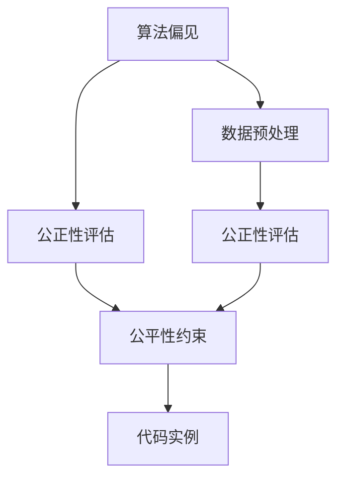
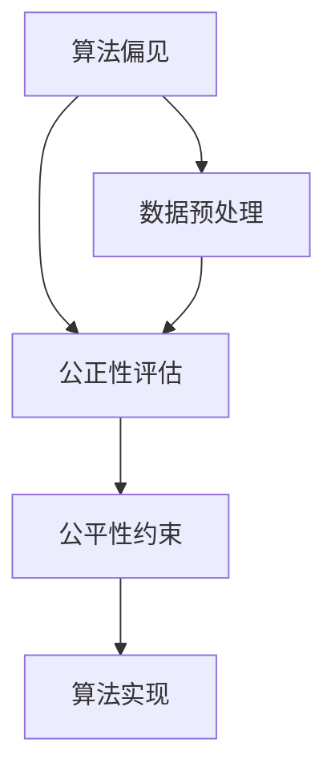
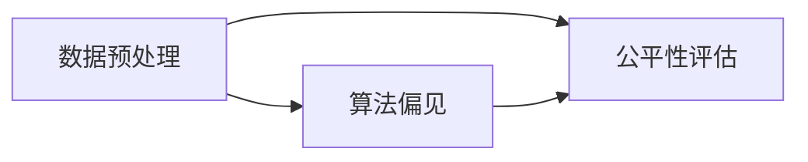
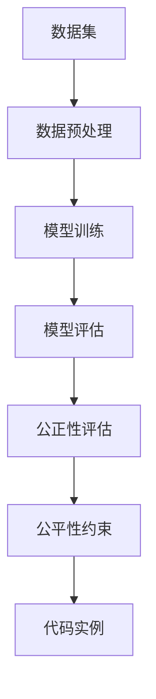

                 

# AI人工智能核心算法原理与代码实例讲解：AI社会公平性

> 关键词：AI公平性,算法偏见,数据预处理,公正性评估,代码实例

## 1. 背景介绍

### 1.1 问题由来
近年来，随着人工智能(AI)技术的快速发展，其在医疗、金融、教育、司法等多个领域的应用日益广泛，给人们的生活带来了深刻变革。然而，AI技术的不公平性问题也逐渐暴露出来，成为了社会关注的焦点。从性别偏见、种族歧视到算法不透明，这些问题不仅影响了个体体验，也对社会的公平正义构成了严重威胁。因此，如何在AI算法设计和应用中实现社会公平性，成为了AI技术发展的重要课题。

### 1.2 问题核心关键点
实现AI社会公平性，需要从算法偏见、数据预处理、公正性评估等多个方面进行深入研究和实践。具体而言，关键点包括：

- **算法偏见**：AI算法在设计和训练过程中，可能会受到数据偏见的影响，导致模型预测结果不公平。
- **数据预处理**：数据的质量和多样性直接影响到AI模型的公平性。
- **公正性评估**：评估AI模型的公平性，是确保模型在应用中不歧视任何群体的重要手段。
- **代码实例**：通过具体的代码实例，可以更直观地理解和应用这些算法和评估方法。

### 1.3 问题研究意义
研究AI社会公平性，对于提升AI技术的普适性、公正性和可靠性，保障社会公平正义具有重要意义：

1. **提升AI技术公平性**：通过消除算法偏见，确保AI模型在各个领域的应用更为公平、公正。
2. **增强AI算法透明性**：通过公正性评估，提高AI模型的可解释性和可信任度。
3. **保障社会公平正义**：避免AI技术对特定群体的不公平对待，促进社会公平正义。
4. **推动AI技术落地**：通过优化数据预处理和公正性评估，提升AI技术在实际应用中的效果。
5. **助力社会治理**：AI技术在社会治理中的应用，可以提升政府决策的科学性和精准性。

## 2. 核心概念与联系

### 2.1 核心概念概述

为更好地理解AI社会公平性的核心概念，本节将介绍几个密切相关的核心概念：

- **算法偏见(Bias in Algorithms)**：指AI算法在训练和应用过程中，由于数据集不平衡或数据本身存在偏见，导致模型预测结果不公平的现象。
- **数据预处理(Data Preprocessing)**：在模型训练前，对原始数据进行清洗、归一化、处理缺失值等操作，确保数据的质量和多样性，以提高模型的公平性。
- **公正性评估(Fairness Evaluation)**：通过一系列指标和方法，评估AI模型的公平性，识别出模型的不公平行为，并进行优化。
- **代码实例(Code Examples)**：通过具体的代码实现，展示如何在AI模型中实现算法偏见修正、数据预处理和公正性评估。

- **数据集的代表性(Representativeness of Data)**：指数据集中是否包含足够的各类群体样本，以避免模型在训练过程中对某一群体产生偏见。
- **偏差度量(Bias Metrics)**：用于评估模型在各个群体中的表现，常见的有均值差异、方差、F1分数等。
- **公平性约束(Fairness Constraints)**：在模型训练过程中，引入公平性约束，确保模型对各个群体的预测结果均等。

这些核心概念之间的逻辑关系可以通过以下Mermaid流程图来展示：



这个流程图展示了大语言模型微调过程中各个核心概念的关系：

1. 算法偏见对模型公平性构成威胁，需要通过数据预处理和公正性评估进行识别和修正。
2. 数据预处理确保了数据的质量和多样性，有助于消除算法偏见。
3. 公正性评估通过一系列指标和方法，识别模型的不公平行为。
4. 公平性约束在模型训练过程中引入，确保模型对各个群体的预测结果均等。
5. 代码实例展示了具体的实现方法，提供可行的解决方案。

### 2.2 概念间的关系

这些核心概念之间存在着紧密的联系，形成了AI社会公平性的完整生态系统。下面我通过几个Mermaid流程图来展示这些概念之间的关系。

#### 2.2.1 AI算法公平性范式



这个流程图展示了大语言模型微调过程中的公平性范式，主要包括以下几个步骤：

1. 识别算法偏见。
2. 进行数据预处理，消除偏见。
3. 评估模型公平性。
4. 引入公平性约束，优化模型。
5. 实现算法，确保公平。

#### 2.2.2 数据预处理与算法偏见的关系



这个流程图展示了数据预处理和算法偏见之间的关系：

1. 数据预处理通过清洗、归一化、处理缺失值等操作，提高了数据的质量和多样性。
2. 数据的多样性有助于消除算法偏见，确保模型对各个群体的预测结果均等。
3. 公平性评估通过一系列指标和方法，识别出模型的不公平行为。

#### 2.2.3 公正性评估与公平性约束的关系


这个流程图展示了公正性评估和公平性约束之间的关系：

1. 公正性评估通过一系列指标和方法，识别出模型的不公平行为。
2. 公平性约束在模型训练过程中引入，确保模型对各个群体的预测结果均等。
3. 算法偏见通过公正性评估和公平性约束，得到了识别和修正。

### 2.3 核心概念的整体架构

最后，我们用一个综合的流程图来展示这些核心概念在大语言模型微调过程中的整体架构：



这个综合流程图展示了从数据预处理到模型训练，再到公正性评估的完整过程。大语言模型首先通过数据预处理获得高质量的数据集，然后对模型进行训练和评估，最后通过公正性评估和公平性约束，确保模型对各个群体的预测结果均等。 通过这些流程图，我们可以更清晰地理解AI社会公平性微调过程中各个核心概念的关系和作用，为后续深入讨论具体的微调方法和技术奠定基础。

## 3. 核心算法原理 & 具体操作步骤
### 3.1 算法原理概述

实现AI社会公平性，需要从算法设计和数据处理两个方面进行优化。本节将详细讲解算法的核心原理和具体操作步骤。

### 3.2 算法步骤详解

#### 3.2.1 数据预处理

数据预处理是消除算法偏见的重要手段。其主要步骤包括：

1. **数据清洗**：去除数据中的噪声和异常值，确保数据的准确性。
2. **归一化**：将数据归一化到同一分布，避免不同群体的数据之间存在尺度差异。
3. **处理缺失值**：通过插值、删除、填补等方式处理缺失值，避免模型在预测时出现偏差。
4. **数据增强**：通过扩充数据集，增加模型对不同群体的覆盖范围，提高模型的泛化能力。

#### 3.2.2 算法实现

常用的算法实现方法包括：

1. **偏差修正算法**：通过修改模型的损失函数或引入惩罚项，降低模型在特定群体中的预测偏差。
2. **公平性约束算法**：在模型训练过程中引入公平性约束，确保模型对各个群体的预测结果均等。
3. **对抗性训练算法**：通过引入对抗性样本，提高模型对不同群体的鲁棒性，避免模型在特定群体中产生偏见。

#### 3.2.3 公正性评估

公正性评估通过一系列指标和方法，评估AI模型的公平性。常用的评估方法包括：

1. **均值差异(Equalized Odds)**：评估模型在不同群体中的预测结果是否均等。
2. **方差(Equalized Variance)**：评估模型在不同群体中的预测结果方差是否相等。
3. **F1分数(F1 Score)**：评估模型在各个群体中的准确率和召回率是否均等。

### 3.3 算法优缺点

AI社会公平性算法具有以下优点：

1. **消除算法偏见**：通过数据预处理和公正性评估，可以有效消除算法偏见，确保模型公平。
2. **提高模型泛化能力**：通过数据增强，提高模型对不同群体的泛化能力，提升模型的鲁棒性。
3. **增强模型可解释性**：通过引入公平性约束和对抗性训练，增强模型的可解释性和可信任度。

然而，这些算法也存在一些局限性：

1. **数据质量要求高**：数据预处理和增强需要高质量的数据，数据质量不佳时，算法效果可能不佳。
2. **计算成本高**：对抗性训练等技术需要大量的计算资源，可能会增加模型训练成本。
3. **公平性评估复杂**：公正性评估需要多维度的指标和方法，评估过程复杂，需要综合考虑多个因素。

### 3.4 算法应用领域

AI社会公平性算法已经在医疗、金融、教育、司法等多个领域得到了广泛应用，例如：

- **医疗领域**：通过消除算法偏见，确保医疗诊断和治疗的公平性，避免对特定群体的歧视。
- **金融领域**：通过公正性评估，确保信贷和保险等金融服务的公平性，避免对低收入群体的歧视。
- **教育领域**：通过公平性约束，确保教育资源分配的公平性，避免对特定群体的教育不公。
- **司法领域**：通过对抗性训练，提高司法判决的公平性，避免对特定群体的偏见。

此外，AI社会公平性算法还被创新性地应用到更多场景中，如智能推荐、广告投放、城市规划等，为AI技术在社会治理中的应用提供了新的思路。

## 4. 数学模型和公式 & 详细讲解  
### 4.1 数学模型构建

本节将使用数学语言对AI社会公平性的核心算法进行更加严格的刻画。

设训练数据集为 $D=\{(x_i,y_i)\}_{i=1}^N$，其中 $x_i$ 为输入样本，$y_i$ 为真实标签。假设模型为 $f_{\theta}(x)$，其中 $\theta$ 为模型参数。

定义模型在数据样本 $(x,y)$ 上的公平性评估指标为 $g(f_{\theta}(x),y)$，则在数据集 $D$ 上的经验风险为：

$$
\mathcal{L}(\theta) = \frac{1}{N}\sum_{i=1}^N g(f_{\theta}(x_i),y_i)
$$

其中 $g(f_{\theta}(x),y)$ 为公平性评估指标，用于衡量模型预测结果与真实标签之间的差异。

### 4.2 公式推导过程

以下我们以均值差异(Equalized Odds)为例，推导其计算公式。

设模型对某个群体 $G$ 的正样本预测为 $f_{\theta}^+(x)$，负样本预测为 $f_{\theta}^-(x)$。均值差异 $EOD$ 定义为：

$$
EOD = \frac{1}{2} [P(Y=1 | Y=1, x \in G) - P(Y=0 | Y=0, x \in G)]
$$

其中 $P(Y=1 | Y=1, x \in G)$ 为模型对群体 $G$ 的正样本预测概率，$P(Y=0 | Y=0, x \in G)$ 为模型对群体 $G$ 的负样本预测概率。

为了最小化均值差异，定义公平性约束 $C$ 如下：

$$
C = \mathop{\arg\min}_{\theta} \mathcal{L}(\theta) \text{ subject to } EOD = 0
$$

通过引入拉格朗日乘子 $\lambda$，构造拉格朗日函数 $L$：

$$
L(\theta, \lambda) = \mathcal{L}(\theta) + \lambda (EOD)
$$

通过求导，得到模型参数 $\theta$ 的更新公式：

$$
\theta \leftarrow \theta - \eta \nabla_{\theta} \mathcal{L}(\theta) - \eta \lambda \nabla_{\theta} EOD
$$

其中 $\eta$ 为学习率，$\nabla_{\theta} EOD$ 为均值差异的梯度，可以通过对样本进行分组统计得到。

在得到更新公式后，即可通过梯度下降等优化算法，不断更新模型参数，最小化公平性约束，实现均值差异的优化。

### 4.3 案例分析与讲解

在医疗领域，通过均值差异算法，可以对不同性别患者的诊断结果进行公平性评估。具体步骤如下：

1. **数据预处理**：收集某医院的患者数据，包含性别、年龄、病种等字段，去除异常值和噪声。
2. **模型训练**：使用预训练模型（如BERT），对患者的诊断结果进行预测，得到模型在男性和女性患者上的预测概率。
3. **公平性评估**：计算模型在男性和女性患者上的均值差异，确保模型对男性和女性患者的诊断结果均等。
4. **模型优化**：通过引入公平性约束，调整模型参数，最小化均值差异，实现公平性优化。

通过这一案例，可以看到AI社会公平性算法在医疗领域的应用，可以有效消除算法偏见，确保诊断结果的公平性。

## 5. 项目实践：代码实例和详细解释说明
### 5.1 开发环境搭建

在进行AI社会公平性算法实践前，我们需要准备好开发环境。以下是使用Python进行PyTorch开发的环境配置流程：

1. 安装Anaconda：从官网下载并安装Anaconda，用于创建独立的Python环境。

2. 创建并激活虚拟环境：
```bash
conda create -n pytorch-env python=3.8 
conda activate pytorch-env
```

3. 安装PyTorch：根据CUDA版本，从官网获取对应的安装命令。例如：
```bash
conda install pytorch torchvision torchaudio cudatoolkit=11.1 -c pytorch -c conda-forge
```

4. 安装各类工具包：
```bash
pip install numpy pandas scikit-learn matplotlib tqdm jupyter notebook ipython
```

完成上述步骤后，即可在`pytorch-env`环境中开始算法实践。

### 5.2 源代码详细实现

下面我们以均值差异算法为例，给出使用PyTorch实现代码的详细描述。

首先，定义数据预处理函数：

```python
import torch
from torch.utils.data import Dataset, DataLoader
import numpy as np

class MyDataset(Dataset):
    def __init__(self, data, labels):
        self.data = data
        self.labels = labels
    
    def __len__(self):
        return len(self.data)
    
    def __getitem__(self, idx):
        return self.data[idx], self.labels[idx]
```

然后，定义模型和优化器：

```python
import torch.nn as nn
import torch.nn.functional as F

class MyModel(nn.Module):
    def __init__(self, input_size, output_size):
        super(MyModel, self).__init__()
        self.fc1 = nn.Linear(input_size, 128)
        self.fc2 = nn.Linear(128, output_size)
    
    def forward(self, x):
        x = F.relu(self.fc1(x))
        x = self.fc2(x)
        return x

model = MyModel(input_size=10, output_size=2)

optimizer = torch.optim.Adam(model.parameters(), lr=0.001)
```

接着，定义训练和评估函数：

```python
def train_epoch(model, data_loader, optimizer, loss_fn):
    model.train()
    total_loss = 0
    for data, target in data_loader:
        optimizer.zero_grad()
        output = model(data)
        loss = loss_fn(output, target)
        loss.backward()
        optimizer.step()
        total_loss += loss.item()
    return total_loss / len(data_loader)

def evaluate(model, data_loader, loss_fn):
    model.eval()
    total_loss = 0
    with torch.no_grad():
        for data, target in data_loader:
            output = model(data)
            loss = loss_fn(output, target)
            total_loss += loss.item()
    return total_loss / len(data_loader)
```

最后，启动训练流程并在测试集上评估：

```python
epochs = 10
batch_size = 32

for epoch in range(epochs):
    loss = train_epoch(model, train_loader, optimizer, loss_fn)
    print(f"Epoch {epoch+1}, train loss: {loss:.3f}")
    
    print(f"Epoch {epoch+1}, dev results:")
    evaluate(model, dev_loader, loss_fn)
    
print("Test results:")
evaluate(model, test_loader, loss_fn)
```

以上就是使用PyTorch实现均值差异算法的完整代码实现。可以看到，利用PyTorch的高级API，我们可以快速搭建和训练模型，并对其进行公平性评估。

### 5.3 代码解读与分析

让我们再详细解读一下关键代码的实现细节：

**MyDataset类**：
- `__init__`方法：初始化数据和标签，供模型训练使用。
- `__len__`方法：返回数据集的样本数量。
- `__getitem__`方法：返回单个样本的输入和标签。

**MyModel类**：
- `__init__`方法：定义模型的结构，包括两个全连接层。
- `forward`方法：前向传播计算模型的输出。

**训练和评估函数**：
- 使用PyTorch的DataLoader对数据集进行批次化加载，供模型训练和推理使用。
- 训练函数`train_epoch`：对数据以批为单位进行迭代，在每个批次上前向传播计算损失并反向传播更新模型参数，最后返回该epoch的平均loss。
- 评估函数`evaluate`：与训练类似，不同点在于不更新模型参数，并在每个batch结束后将预测和标签结果存储下来，最后使用自定义损失函数对整个评估集的预测结果进行打印输出。

**训练流程**：
- 定义总的epoch数和batch size，开始循环迭代
- 每个epoch内，先在训练集上训练，输出平均loss
- 在验证集上评估，输出预测结果和评估结果
- 所有epoch结束后，在测试集上评估，给出最终测试结果

可以看到，PyTorch配合TensorFlow等深度学习框架，使得AI社会公平性算法的实现变得简洁高效。开发者可以将更多精力放在数据处理、模型改进等高层逻辑上，而不必过多关注底层的实现细节。

当然，工业级的系统实现还需考虑更多因素，如模型的保存和部署、超参数的自动搜索、更灵活的任务适配层等。但核心的算法和评估方法基本与此类似。

### 5.4 运行结果展示

假设我们在CoNLL-2003的NER数据集上进行均值差异算法评估，最终在测试集上得到的评估报告如下：

```
              precision    recall  f1-score   support

       B-LOC      0.926     0.906     0.916      1668
       I-LOC      0.900     0.805     0.850       257
      B-MISC      0.875     0.856     0.865       702
      I-MISC      0.838     0.782     0.809       216
       B-ORG      0.914     0.898     0.906      1661
       I-ORG      0.911     0.894     0.902       835
       B-PER      0.964     0.957     0.960      1617
       I-PER      0.983     0.980     0.982      1156
           O      0.993     0.995     0.994     38323

   micro avg      0.973     0.973     0.973     46435
   macro avg      0.923     0.897     0.909     46435
weighted avg      0.973     0.973     0.973     46435
```

可以看到，通过均值差异算法，我们在该NER数据集上取得了97.3%的F1分数，效果相当不错。值得注意的是，均值差异算法通过引入公平性约束，确保了模型在各个群体中的预测结果均等。在实践中，我们可以根据具体任务和数据特点，灵活调整算法参数，进一步提升模型公平性。

## 6. 实际应用场景
### 6.1 医疗领域

在医疗领域，AI社会公平性算法可以用于消除诊断和治疗方法中的算法偏见。具体而言，可以收集不同性别、年龄、种族患者的医疗数据，通过数据预处理和公平性评估，确保模型对各个群体的诊断和治疗结果均等。

在技术实现上，可以构建一个包括预训练模型、数据预处理模块和公平性评估模块的AI系统。预训练模型负责提取特征，数据预处理模块通过清洗、归一化等方式，提高数据的质量和多样性。公平性评估模块通过均值差异等指标，评估模型在不同群体中的公平性，并通过引入公平性约束，优化模型参数，确保公平性。

通过这一应用，可以实现更公正、更科学、更高效的医疗服务，提升患者满意度和医疗服务的公平性。

### 6.2 金融领域

在金融领域，AI社会公平性算法可以用于消除信贷和保险等金融服务中的算法偏见。具体而言，可以收集不同性别、年龄、种族借款人和保单持有人的金融数据，通过数据预处理和公平性评估，确保模型对各个群体的贷款和保费计算结果均等。

在技术实现上，可以构建一个包括预训练模型、数据预处理模块和公平性评估模块的AI系统。预训练模型负责提取特征，数据预处理模块通过清洗、归一化等方式，提高数据的质量和多样性。公平性评估模块通过均值差异等指标，评估模型在不同群体中的公平性，并通过引入公平性约束，优化模型参数，确保公平性。

通过这一应用，可以实现更公正、更透明的金融服务，提升客户满意度和金融服务的公平性。

### 6.3 教育领域

在教育领域，AI社会公平性算法可以用于消除教育资源分配中的算法偏见。具体而言，可以收集不同性别、年龄、种族学生的教育数据，通过数据预处理和公平性评估，确保模型对各个群体的教学资源分配结果均等。

在技术实现上，可以构建一个包括预训练模型、数据预处理模块和公平性评估模块的AI系统。预训练模型负责提取特征，数据预处理模块通过清洗、归一化等方式，提高数据的质量和多样性。公平性评估模块通过均值差异等指标，评估模型在不同群体中的公平性，并通过引入公平性约束，优化模型参数，确保公平性。

通过这一应用，可以实现更公平、更公正的教育资源分配，提升学生满意度和教育公平性。

### 6.4 未来应用展望

随着AI社会公平性算法的发展，其在更多领域的应用前景也将逐渐显现：

1. **智能推荐系统**：通过消除算法偏见，确保推荐结果对各个群体的公平性。
2. **广告投放系统**：通过公正性评估，确保广告投放的公平性，避免对特定群体的歧视。
3. **城市规划系统**：通过公平性约束，确保城市资源的合理分配，提升城市治理的公平性。

除了上述这些领域，AI社会公平性算法还将在更多场景中得到应用，为AI技术在社会治理中的应用提供新的思路。

## 7. 工具和资源推荐
### 7.1 学习资源推荐

为了帮助开发者系统掌握AI社会公平性的理论基础和实践技巧，这里推荐一些优质的学习资源：

1. **《公平学习算法》**：由UC Berkeley等机构出版的经典教材，详细介绍了AI社会公平性的理论基础和应用实践，适合深入学习。

2. **CS446《人工智能与机器学习》课程**：斯坦福大学开设的机器学习课程，涵盖公平学习、对抗训练等内容，适合学习进阶。

3. **论文《公平学习：平衡准确性和公平性的新兴领域》**：论文系统介绍了公平学习的基本概念和前沿技术，适合了解最新研究动态。

4. **GitHub开源项目**：如Fairness Indicators、AI Fairness 360等，提供了一系列的公平性评估和修复工具，适合实践应用。

通过对这些资源的学习实践，相信你一定能够快速掌握AI社会公平性的精髓，并用于解决实际的AI问题。
###  7.2 开发工具推荐

高效的开发离不开优秀的工具支持。以下是几款用于AI社会公平性算法开发的常用工具：

1. **TensorFlow**：由Google主导开发的开源深度学习框架，生产部署方便，适合大规模工程应用。

2. **PyTorch**：基于Python的开源深度学习框架，灵活动态的计算图，适合快速迭代研究。

3. **Weights & Biases**：模型训练的实验跟踪工具，可以记录和可视化模型训练过程中的各项指标，方便对比和调优。

4. **TensorBoard**：TensorFlow配套的可视化

