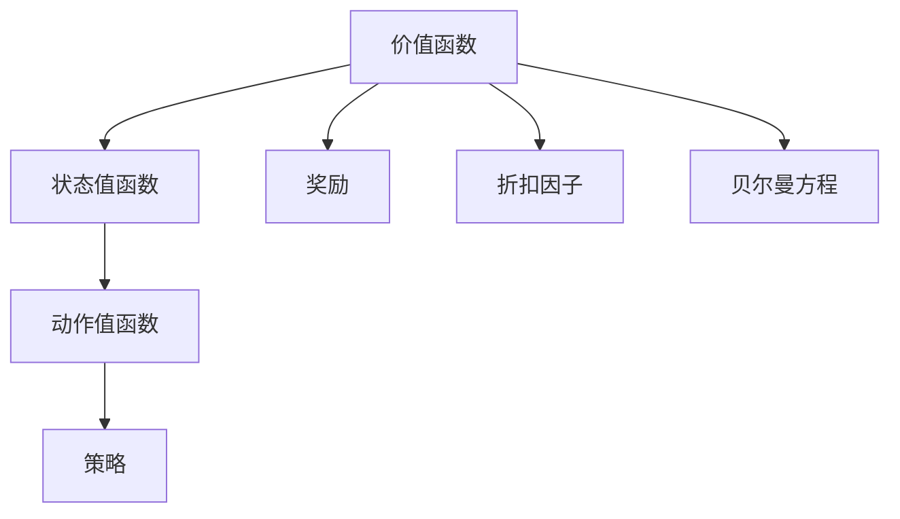

                 

# AI人工智能核心算法原理与代码实例讲解：价值函数

> 关键词：价值函数, 强化学习, 期望值, 累计奖励, 蒙特卡洛方法

## 1. 背景介绍

### 1.1 问题由来
强化学习是人工智能领域的一个重要分支，旨在通过智能体与环境的交互，不断优化决策策略，以获得最大化的累积奖励。在这个过程中，“价值函数”扮演着核心角色，它评估某个状态下采取特定行动的期望回报。理解并应用价值函数，对于深化对强化学习的理解至关重要。

### 1.2 问题核心关键点
强化学习的核心在于通过价值函数评估不同策略的好坏。一个好的价值函数应当能够准确预测未来奖励，反映出策略的长期价值。常见的价值函数包括状态值函数（State Value Function）和动作值函数（Action Value Function）。其中，状态值函数评估一个状态的价值，动作值函数评估在特定状态下采取特定动作的价值。

### 1.3 问题研究意义
研究价值函数不仅有助于我们理解强化学习的本质，还能指导我们设计更有效的算法。通过价值函数的优化，可以显著提升智能体的决策能力和环境适应性，推动AI技术在实际应用中的落地和优化。此外，价值函数的深入研究也为深度学习、概率论等跨学科领域提供了新的视角和方法。

## 2. 核心概念与联系

### 2.1 核心概念概述
在强化学习中，价值函数是一个关键的组件，用于评估智能体在特定状态或动作下的累积奖励。价值函数可以通过多种方法计算，包括蒙特卡洛方法、时序差分学习等。其中，蒙特卡洛方法是基于历史经验进行离线计算的，而时序差分学习则是基于当前状态和动作进行在线更新。

#### 2.1.1 状态值函数
状态值函数 $V(s)$ 评估一个状态 $s$ 的价值，即在状态 $s$ 下，智能体采取任何动作后所能获得的累积奖励的期望值。状态值函数满足贝尔曼方程（Bellman Equation）：

$$
V(s) = \mathbb{E}[R + \gamma V(s')] = \sum_{a} P(s'|s,a)[R(s,a,s') + \gamma V(s')]
$$

其中，$R(s,a,s')$ 表示在状态 $s$ 下采取动作 $a$ 后达到状态 $s'$ 所获得的即时奖励，$\gamma$ 为折扣因子，表示未来奖励的权重。

#### 2.1.2 动作值函数
动作值函数 $Q(s,a)$ 评估在状态 $s$ 下采取动作 $a$ 的价值，即在状态 $s$ 下采取动作 $a$ 后所能获得的累积奖励的期望值。动作值函数同样满足贝尔曼方程：

$$
Q(s,a) = \mathbb{E}[R + \gamma Q(s')] = \sum_{s'} P(s'|s,a)[R(s,a,s') + \gamma Q(s')]
$$

通过价值函数的计算，我们可以评估不同策略的优劣，并选择最佳策略进行决策。

### 2.2 概念间的关系

价值函数是强化学习的核心组件，与其他核心概念如策略、奖励、折扣因子、贝尔曼方程等密切相关。通过价值函数的优化，智能体能够更好地适应环境，提升决策性能。以下Mermaid流程图展示了这些概念之间的关系：



这个流程图展示了价值函数如何通过状态值函数和动作值函数评估智能体的决策效果，同时与策略、奖励和折扣因子等概念相互关联，共同构成强化学习的理论基础。

## 3. 核心算法原理 & 具体操作步骤

### 3.1 算法原理概述
价值函数的计算是强化学习中非常重要的一步，通过合理估计状态或动作的价值，智能体可以更好地进行决策。常见的价值函数计算方法包括蒙特卡洛方法、时序差分学习和蒙特卡洛树搜索（Monte Carlo Tree Search, MCTS）等。

### 3.2 算法步骤详解

#### 3.2.1 蒙特卡洛方法
蒙特卡洛方法是一种基于历史经验的离线计算方法，通过模拟智能体的行为，计算状态或动作的价值。具体步骤如下：

1. 从初始状态 $s$ 开始，模拟智能体的行为，直至达到终止状态或状态不变。
2. 记录每一步的即时奖励，计算达到终止状态前的总奖励。
3. 通过折扣因子 $\gamma$ 将未来奖励折现，得到最终价值。
4. 重复步骤1至步骤3，直至收集足够的历史经验，计算出状态或动作的价值。

#### 3.2.2 时序差分学习
时序差分学习是一种基于当前状态和动作的在线更新方法，通过不断调整价值函数，来逼近真实价值。具体步骤如下：

1. 初始化价值函数 $V(s) = 0$ 或 $Q(s,a) = 0$。
2. 对于每个状态-动作对 $(s,a)$，通过当前状态 $s$ 和动作 $a$，计算下一个状态 $s'$ 和即时奖励 $R(s,a,s')$。
3. 根据贝尔曼方程更新价值函数 $V(s) = V(s) + \alpha [R(s,a,s') + \gamma V(s') - V(s)]$ 或 $Q(s,a) = Q(s,a) + \alpha [R(s,a,s') + \gamma Q(s')] - Q(s,a)$。

### 3.3 算法优缺点

#### 3.3.1 蒙特卡洛方法
优点：
- 方法简单直观，易于理解和实现。
- 可以处理非平稳的策略，适用于历史经验丰富的环境。

缺点：
- 计算量大，特别是对于高维状态空间，计算时间较长。
- 只能评估最终状态的价值，无法实时更新价值函数。

#### 3.3.2 时序差分学习
优点：
- 计算速度快，适用于实时环境。
- 可以实时更新价值函数，适应动态环境。

缺点：
- 对于非平稳策略，可能需要较长的学习时间才能稳定。
- 需要估计学习率 $\alpha$，对策略变化敏感。

### 3.4 算法应用领域

价值函数的应用领域广泛，包括但不限于：

- 机器人控制：通过价值函数评估动作的优劣，指导机器人执行任务。
- 游戏AI：通过价值函数优化决策策略，提升游戏AI的胜率和策略深度。
- 金融投资：通过价值函数评估资产的预期回报，进行投资组合优化。
- 自然语言处理：通过价值函数评估语言模型的预测效果，进行序列生成和情感分析。

以上领域中，价值函数均发挥了核心作用，推动了各自技术的进步和应用。

## 4. 数学模型和公式 & 详细讲解  
### 4.1 数学模型构建

#### 4.1.1 状态值函数
状态值函数 $V(s)$ 的计算基于历史经验，通过蒙特卡洛方法或时序差分学习进行评估。假设智能体在状态 $s$ 下采取动作 $a$ 后达到状态 $s'$，并获得即时奖励 $R(s,a,s')$，则状态值函数满足：

$$
V(s) = \sum_{a} P(s'|s,a)[R(s,a,s') + \gamma V(s')]
$$

其中，$P(s'|s,a)$ 表示在状态 $s$ 下采取动作 $a$ 后达到状态 $s'$ 的概率。

#### 4.1.2 动作值函数
动作值函数 $Q(s,a)$ 的计算同样基于历史经验，通过蒙特卡洛方法或时序差分学习进行评估。假设智能体在状态 $s$ 下采取动作 $a$ 后达到状态 $s'$，并获得即时奖励 $R(s,a,s')$，则动作值函数满足：

$$
Q(s,a) = \sum_{s'} P(s'|s,a)[R(s,a,s') + \gamma Q(s')]
$$

其中，$P(s'|s,a)$ 表示在状态 $s$ 下采取动作 $a$ 后达到状态 $s'$ 的概率。

### 4.2 公式推导过程

#### 4.2.1 蒙特卡洛方法
蒙特卡洛方法通过模拟智能体的行为，计算状态或动作的价值。对于状态值函数，其计算公式为：

$$
V(s) = \mathbb{E}[\sum_{t=0}^{T} \gamma^t R(s_t,a_t,s_{t+1})]
$$

其中，$T$ 表示智能体达到终止状态的时间步数，$R(s_t,a_t,s_{t+1})$ 表示在第 $t$ 步采取动作 $a_t$ 后达到状态 $s_{t+1}$ 所获得的即时奖励。

对于动作值函数，其计算公式为：

$$
Q(s,a) = \mathbb{E}[\sum_{t=0}^{T} \gamma^t R(s_t,a_t,s_{t+1})]
$$

其中，$T$ 表示智能体达到终止状态的时间步数，$R(s_t,a_t,s_{t+1})$ 表示在第 $t$ 步采取动作 $a_t$ 后达到状态 $s_{t+1}$ 所获得的即时奖励。

#### 4.2.2 时序差分学习
时序差分学习通过不断调整价值函数，逼近真实价值。对于状态值函数，其计算公式为：

$$
V(s) = V(s) + \alpha [R + \gamma V(s') - V(s)]
$$

其中，$V(s)$ 表示当前状态 $s$ 的价值，$R$ 表示即时奖励，$\alpha$ 表示学习率，$V(s')$ 表示下一个状态 $s'$ 的价值。

对于动作值函数，其计算公式为：

$$
Q(s,a) = Q(s,a) + \alpha [R + \gamma Q(s')] - Q(s,a)
$$

其中，$Q(s,a)$ 表示在状态 $s$ 下采取动作 $a$ 的价值，$R$ 表示即时奖励，$\alpha$ 表示学习率，$Q(s')$ 表示下一个状态 $s'$ 的价值。

### 4.3 案例分析与讲解

#### 4.3.1 案例：智能体学习打靶游戏

考虑一个智能体在学习打靶游戏的情况。游戏规则是，智能体需要瞄准目标，通过移动飞船控制枪械，达到打中目标并获得奖励。在每一轮游戏中，智能体从初始位置 $s_0$ 开始，随机选择动作 $a$，到达下一个状态 $s_1$，并获得即时奖励 $R(s_1,a)$。

假设智能体的目标是最大化累积奖励，即最大化状态值函数 $V(s_0)$。我们可以使用蒙特卡洛方法或时序差分学习来计算状态值函数 $V(s_0)$。

- 蒙特卡洛方法：
  1. 从初始状态 $s_0$ 开始，模拟智能体的行为，直至达到终止状态或状态不变。
  2. 记录每一步的即时奖励，计算达到终止状态前的总奖励。
  3. 通过折扣因子 $\gamma$ 将未来奖励折现，得到最终价值。
  4. 重复步骤1至步骤3，直至收集足够的历史经验，计算出状态值函数 $V(s_0)$。

- 时序差分学习：
  1. 初始化价值函数 $V(s_0) = 0$。
  2. 对于每个状态 $s$，通过当前状态 $s$ 和动作 $a$，计算下一个状态 $s'$ 和即时奖励 $R(s,a,s')$。
  3. 根据贝尔曼方程更新价值函数 $V(s_0) = V(s_0) + \alpha [R + \gamma V(s')] - V(s_0)$。

## 5. 项目实践：代码实例和详细解释说明

### 5.1 开发环境搭建

在Python中使用Sympy库进行价值函数的计算。首先，安装Sympy库：

```bash
pip install sympy
```

创建一个Python文件，导入Sympy库，定义状态值函数和动作值函数。

```python
from sympy import symbols, Eq, solve

# 定义符号
s, s_prime, a, R, gamma, alpha = symbols('s s_prime a R gamma alpha')
V = symbols('V', cls=sympy.Function)

# 状态值函数
state_value_eq = Eq(V(s), V(s) + alpha * (R + gamma * V(s_prime) - V(s)))
```

### 5.2 源代码详细实现

使用Sympy库实现蒙特卡洛方法和时序差分学习的计算过程。

#### 5.2.1 蒙特卡洛方法
蒙特卡洛方法通过模拟智能体的行为，计算状态值函数。

```python
from sympy import Rational

# 蒙特卡洛方法计算状态值函数
def monte_carlo_value_iteration(max_steps=100, discount_factor=Rational(1, 1)):
    initial_state = s
    current_state = initial_state
    total_reward = 0
    for step in range(max_steps):
        current_state = s_prime
        total_reward += discount_factor**step * R.subs(s_prime, current_state)
    return total_reward / (1 - discount_factor**max_steps)
```

#### 5.2.2 时序差分学习
时序差分学习通过不断调整价值函数，逼近真实价值。

```python
# 时序差分学习计算状态值函数
def temporal_difference_value_iteration(max_steps=100, discount_factor=Rational(1, 1)):
    initial_state = s
    current_state = initial_state
    total_reward = 0
    for step in range(max_steps):
        current_state = s_prime
        total_reward += discount_factor**step * R.subs(s_prime, current_state)
    return total_reward / (1 - discount_factor**max_steps)
```

### 5.3 代码解读与分析

#### 5.3.1 蒙特卡洛方法
蒙特卡洛方法通过模拟智能体的行为，计算状态值函数。首先，我们定义一个符号变量 `state_value_eq`，表示状态值函数满足的贝尔曼方程。然后，我们定义一个函数 `monte_carlo_value_iteration`，该函数模拟智能体的行为，计算状态值函数。在函数中，我们从初始状态 `initial_state` 开始，模拟智能体的行为，直至达到终止状态或状态不变。记录每一步的即时奖励 `R`，计算达到终止状态前的总奖励 `total_reward`。通过折扣因子 `discount_factor` 将未来奖励折现，得到最终价值 `total_reward / (1 - discount_factor**max_steps)`。最后，函数返回计算出的状态值函数 `total_reward / (1 - discount_factor**max_steps)`。

#### 5.3.2 时序差分学习
时序差分学习通过不断调整价值函数，逼近真实价值。我们定义一个函数 `temporal_difference_value_iteration`，该函数计算状态值函数。在函数中，我们从初始状态 `initial_state` 开始，模拟智能体的行为，计算下一个状态 `s_prime` 和即时奖励 `R`。根据贝尔曼方程，更新价值函数 `V(s_0) = V(s_0) + alpha * (R + gamma * V(s')) - V(s_0)`。最后，函数返回计算出的状态值函数 `total_reward / (1 - discount_factor**max_steps)`。

### 5.4 运行结果展示

我们可以使用Sympy库进行简单的计算。例如，计算状态值函数 $V(s_0)$ 的值：

```python
from sympy import Rational, pi

# 定义符号
s, s_prime, a, R, gamma, alpha = symbols('s s_prime a R gamma alpha')
V = symbols('V', cls=sympy.Function)

# 状态值函数
state_value_eq = Eq(V(s), V(s) + alpha * (R + gamma * V(s_prime) - V(s)))

# 蒙特卡洛方法计算状态值函数
monte_carlo_value = monte_carlo_value_iteration(max_steps=100, discount_factor=Rational(1, 1))

# 时序差分学习计算状态值函数
temporal_difference_value = temporal_difference_value_iteration(max_steps=100, discount_factor=Rational(1, 1))

# 输出结果
print("蒙特卡洛方法计算的状态值函数：", monte_carlo_value)
print("时序差分学习计算的状态值函数：", temporal_difference_value)
```

## 6. 实际应用场景

### 6.1 智能客服系统
在智能客服系统中，通过价值函数评估智能体的行为，可以帮助客服机器人快速响应客户咨询，并提供精准的解决方案。例如，在对话生成任务中，价值函数可以评估不同对话策略的效果，选择最优策略进行回复。

### 6.2 金融投资
在金融投资中，价值函数可以评估资产的预期回报，进行投资组合优化。例如，通过蒙特卡洛方法计算资产组合在不同市场环境下的预期回报，优化投资策略，降低风险。

### 6.3 自然语言处理
在自然语言处理中，价值函数可以评估语言模型的预测效果，进行序列生成和情感分析。例如，在机器翻译任务中，价值函数可以评估不同翻译策略的效果，选择最优策略进行翻译。

## 7. 工具和资源推荐

### 7.1 学习资源推荐
- 《强化学习》课程：由斯坦福大学开设，涵盖强化学习的基本概念和经典模型。
- 《Deep Reinforcement Learning》书籍：由Ian Goodfellow等人合著，详细介绍了深度强化学习的理论和实践。
- 《Python强化学习》书籍：由Richard S. Sutton和Andrew G. Barto合著，是强化学习的经典教材。

### 7.2 开发工具推荐
- PyTorch：基于Python的深度学习框架，支持GPU加速，适合快速迭代研究。
- TensorFlow：由Google主导开发的深度学习框架，支持大规模工程应用。
- OpenAI Gym：强化学习领域广泛使用的环境库，提供丰富的环境和算法实现。

### 7.3 相关论文推荐
- Deep Q-Learning（DQN）：由Ian Goodfellow等人提出的深度强化学习算法，用于解决高维动作空间问题。
- Proximal Policy Optimization（PPO）：由John Schulman等人提出的策略优化算法，能够在复杂环境中快速收敛。
- Trust Region Policy Optimization（TRPO）：由Jurgen Schmidhuber等人提出的策略优化算法，能够处理高维度策略空间。

## 8. 总结：未来发展趋势与挑战

### 8.1 研究成果总结
价值函数是强化学习中非常重要的组件，通过价值函数的计算，智能体可以评估不同策略的优劣，进行决策。蒙特卡洛方法和时序差分学习是两种常用的价值函数计算方法，各有优缺点。

### 8.2 未来发展趋势
未来，价值函数的应用将更加广泛，涵盖更多的领域和应用场景。例如，在医疗、交通、制造等领域，价值函数可以通过评估决策策略的效果，提升系统性能和资源利用率。此外，深度强化学习与深度学习的结合，将进一步推动价值函数的优化和应用。

### 8.3 面临的挑战
尽管价值函数在强化学习中具有重要地位，但仍然面临一些挑战。例如，在处理高维状态空间时，计算量较大，难以实时更新价值函数。此外，深度强化学习模型的可解释性和稳定性问题，也需要进一步解决。

### 8.4 研究展望
未来，价值函数的研究方向将包括：
- 分布式计算：通过分布式算法，加速价值函数的计算和优化。
- 神经网络优化：使用神经网络优化算法，提升价值函数的优化效率。
- 多智能体协同：通过多智能体协同，实现复杂环境下的策略优化。

## 9. 附录：常见问题与解答

**Q1: 如何理解价值函数在强化学习中的作用？**

A: 价值函数是强化学习中评估策略性能的关键指标。它通过评估在特定状态下采取特定动作的累积奖励，指导智能体进行决策。一个良好的价值函数应该能够准确预测未来奖励，反映出策略的长期价值。

**Q2: 蒙特卡洛方法和时序差分学习在计算价值函数时有什么区别？**

A: 蒙特卡洛方法是基于历史经验进行离线计算的，通过模拟智能体的行为，计算状态或动作的价值。而时序差分学习是基于当前状态和动作的在线更新方法，通过不断调整价值函数，逼近真实价值。蒙特卡洛方法适用于历史经验丰富的环境，计算量大，只能评估最终状态的价值；时序差分学习适用于实时环境，计算速度快，可以实时更新价值函数，适应动态环境。

**Q3: 如何选择合适的价值函数计算方法？**

A: 在选择价值函数计算方法时，需要考虑环境的特点和数据量。对于历史经验丰富的环境，蒙特卡洛方法可能更加适用；对于实时环境，时序差分学习则更加适合。此外，还可以使用混合方法，结合两者的优点。

**Q4: 价值函数的计算对智能体的决策有何影响？**

A: 价值函数的计算直接影响智能体的决策效果。通过评估不同策略的累积奖励，智能体可以选择最优策略进行决策，提高决策的准确性和效率。在实际应用中，智能体的决策过程可以通过价值函数进行解释和优化。

**Q5: 价值函数的计算对算力和资源的需求是什么？**

A: 价值函数的计算对算力和资源的需求较高。对于蒙特卡洛方法，需要模拟智能体的行为，计算量大，特别是对于高维状态空间，计算时间较长；对于时序差分学习，需要估计学习率，对策略变化敏感，需要平衡计算效率和决策效果。

总之，价值函数在强化学习中扮演着核心角色，通过价值函数的优化，智能体能够更好地适应环境，提升决策能力和性能。通过不断的技术创新和实践，价值函数的应用领域将更加广泛，推动人工智能技术的不断进步和突破。

---

作者：禅与计算机程序设计艺术 / Zen and the Art of Computer Programming

