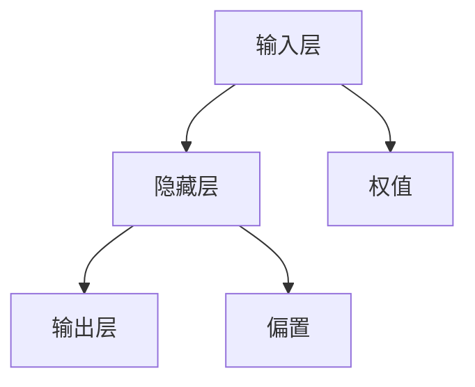
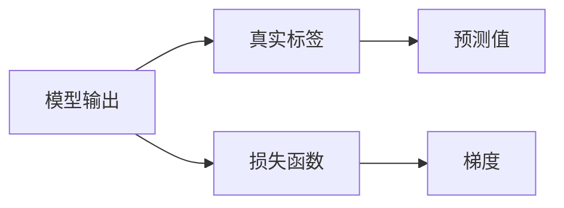
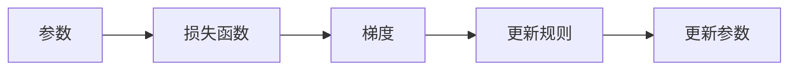
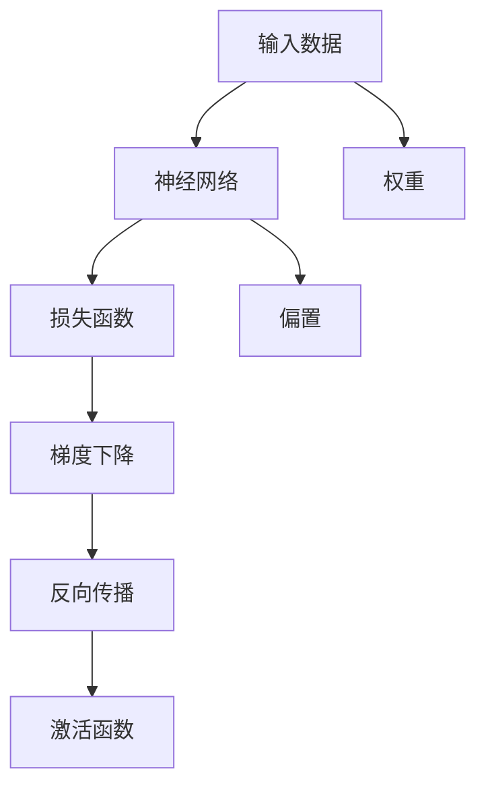

                 

# AI人工智能核心算法原理与代码实例讲解：反向传播

> 关键词：反向传播,深度学习,神经网络,损失函数,梯度下降,Python

## 1. 背景介绍

### 1.1 问题由来
在人工智能领域，深度学习已经成为一种非常有效的方法，尤其在图像识别、语音识别、自然语言处理等方面取得了显著成果。而深度学习的核心技术之一就是反向传播(Backpropagation)。反向传播是一种用于训练神经网络的重要算法，它通过链式法则计算梯度，进而更新网络参数，使得网络能够拟合训练数据。

### 1.2 问题核心关键点
理解反向传播算法，需要掌握以下几个核心关键点：
- 神经网络的结构：由输入层、隐藏层和输出层组成，每一层包含多个神经元，神经元之间通过权值相连。
- 激活函数：用于非线性变换，使得网络可以学习复杂函数关系。
- 损失函数：用于衡量模型预测值与真实值之间的差距。
- 梯度下降：用于参数更新的优化算法，通过不断迭代调整参数，使得损失函数最小化。
- 反向传播：通过链式法则计算梯度，自动求导优化算法。

### 1.3 问题研究意义
反向传播算法作为深度学习的核心技术之一，对于理解深度学习原理、优化模型性能至关重要。掌握反向传播算法，可以更好地进行神经网络模型的设计和优化，提升模型的准确性和泛化能力。此外，反向传播的原理和方法，也为其他机器学习算法的设计提供了重要参考。

## 2. 核心概念与联系

### 2.1 核心概念概述

为更好地理解反向传播算法，本节将介绍几个密切相关的核心概念：

- 神经网络(Neural Network)：由多个神经元组成的层次结构，用于建模复杂的非线性映射关系。
- 损失函数(Loss Function)：用于衡量模型预测值与真实值之间的差距，如均方误差(MSE)、交叉熵(Cross Entropy)等。
- 梯度下降(Gradient Descent)：通过反向传播计算梯度，不断调整模型参数，使得损失函数最小化。
- 反向传播(Backpropagation)：利用链式法则计算梯度，自动求导优化算法。
- 激活函数(Activation Function)：非线性变换函数，如ReLU、Sigmoid等，用于增强模型的表达能力。

这些核心概念之间的逻辑关系可以通过以下Mermaid流程图来展示：


这个流程图展示了大语言模型的核心概念及其之间的关系：

1. 神经网络通过激活函数进行非线性变换，建立输入与输出之间的复杂映射关系。
2. 损失函数衡量模型的预测输出与真实标签之间的差异，用于评估模型性能。
3. 梯度下降通过反向传播计算梯度，自动求导优化算法。
4. 反向传播利用链式法则计算梯度，通过梯度下降更新模型参数。

### 2.2 概念间的关系

这些核心概念之间存在着紧密的联系，形成了深度学习的完整生态系统。下面我通过几个Mermaid流程图来展示这些概念之间的关系。

#### 2.2.1 神经网络的结构



这个流程图展示了神经网络的基本结构：

1. 输入层：接收输入数据。
2. 隐藏层：通过激活函数进行非线性变换。
3. 输出层：输出模型预测结果。
4. 权值和偏置：用于连接神经元，计算激活函数输入。

#### 2.2.2 损失函数的设计



这个流程图展示了损失函数的设计：

1. 模型输出：通过神经网络计算得到。
2. 真实标签：实际数据对应的真实值。
3. 预测值：模型输出的预测值。
4. 损失函数：计算模型输出与真实标签之间的差异。

#### 2.2.3 梯度下降的优化



这个流程图展示了梯度下降的优化过程：

1. 参数：模型的权重和偏置。
2. 损失函数：用于衡量模型输出与真实标签之间的差异。
3. 梯度：反向传播计算得到，表示参数对损失函数的导数。
4. 更新规则：根据梯度更新参数。

#### 2.2.4 反向传播的计算


这个流程图展示了反向传播的计算过程：

1. 神经网络：由多个神经元组成的层次结构。
2. 损失函数：用于衡量模型输出与真实标签之间的差异。
3. 梯度：反向传播计算得到，表示参数对损失函数的导数。
4. 参数更新：根据梯度调整网络参数，使得损失函数最小化。

### 2.3 核心概念的整体架构

最后，我们用一个综合的流程图来展示这些核心概念在大语言模型微调过程中的整体架构：



这个综合流程图展示了从输入数据到输出结果的完整过程：

1. 输入数据：进入神经网络进行特征提取。
2. 神经网络：通过激活函数进行非线性变换。
3. 损失函数：计算模型输出与真实标签之间的差异。
4. 梯度下降：通过反向传播计算梯度，自动求导优化算法。
5. 激活函数：用于非线性变换，增强模型的表达能力。
6. 权重和偏置：用于连接神经元，计算激活函数输入。

通过这些流程图，我们可以更清晰地理解深度学习中的核心概念及其相互关系，为后续深入讨论具体的反向传播算法奠定基础。

## 3. 核心算法原理 & 具体操作步骤
### 3.1 算法原理概述

反向传播算法是一种用于优化神经网络参数的算法，通过链式法则计算梯度，自动求导优化算法。具体来说，反向传播算法通过以下步骤更新神经网络参数：

1. 前向传播：将输入数据输入神经网络，通过每一层的激活函数计算输出。
2. 计算损失：计算模型输出与真实标签之间的差异，得到损失值。
3. 反向传播：利用链式法则计算损失函数对每一层参数的导数，即梯度。
4. 梯度下降：根据梯度更新模型参数，使得损失函数最小化。

### 3.2 算法步骤详解

以下是反向传播算法的详细步骤：

1. 初始化：随机初始化神经网络的权重和偏置，一般设定为较小的随机数，如[-0.1,0.1]之间的随机数。

2. 前向传播：将输入数据输入神经网络，通过每一层的激活函数计算输出。具体步骤如下：
   - 对于每个神经元，计算其输入值：输入值 = 输入数据 + 偏置
   - 对于每个神经元，计算其输出值：输出值 = 激活函数(输入值)

3. 计算损失：计算模型输出与真实标签之间的差异，得到损失值。具体步骤如下：
   - 对于每个样本，计算模型输出与真实标签之间的平方误差（均方误差）
   - 将所有样本的误差求和，得到总损失值

4. 反向传播：利用链式法则计算损失函数对每一层参数的导数，即梯度。具体步骤如下：
   - 对于每个样本，计算输出层的误差（即损失函数对输出层的导数）
   - 对于每个隐藏层，计算误差的反向传播（即误差对当前层的导数）
   - 利用链式法则，逐层计算每个神经元对输入数据的导数（即梯度）

5. 梯度下降：根据梯度更新模型参数，使得损失函数最小化。具体步骤如下：
   - 对于每个神经元，更新权重和偏置：权重 -= 学习率 * 梯度
   - 重复步骤2-5，直到达到预设的迭代轮数或损失值收敛

### 3.3 算法优缺点

反向传播算法具有以下优点：

1. 自动化求导：通过链式法则自动计算梯度，使得优化算法更加高效。
2. 高效性：适用于多层神经网络，可以处理复杂的非线性映射关系。
3. 泛化能力：通过参数更新，使得模型能够拟合训练数据，泛化能力较强。

同时，反向传播算法也存在以下缺点：

1. 梯度消失/爆炸：在神经网络较深的情况下，梯度可能会消失或爆炸，导致模型无法训练。
2. 计算复杂度：计算梯度需要多次前向传播和反向传播，计算复杂度较高。
3. 依赖初始化：模型的性能高度依赖于权重和偏置的初始化，需要反复调试。

### 3.4 算法应用领域

反向传播算法在深度学习领域有着广泛的应用：

1. 图像识别：通过卷积神经网络(CNN)进行特征提取和分类，广泛应用于图像识别、目标检测等任务。
2. 语音识别：通过循环神经网络(RNN)进行语音信号处理和分类，广泛应用于语音识别、语音合成等任务。
3. 自然语言处理：通过循环神经网络、长短期记忆网络(LSTM)、Transformer等结构进行文本处理和分类，广泛应用于机器翻译、情感分析等任务。
4. 强化学习：通过反向传播算法进行策略优化和参数更新，广泛应用于游戏AI、机器人控制等任务。
5. 其他领域：如推荐系统、搜索引擎等，反向传播算法也得到了广泛应用。

## 4. 数学模型和公式 & 详细讲解  
### 4.1 数学模型构建

以下用数学语言对反向传播算法进行严格刻画：

假设神经网络由$n$个隐藏层组成，每层包含$m$个神经元。记输入数据为$x$，隐藏层的权重和偏置分别为$w_l$和$b_l$，输出层的权重和偏置分别为$w^{out}$和$b^{out}$，输出结果为$\hat{y}$。

定义激活函数为$g$，损失函数为$L$。假设样本数为$N$。

反向传播算法的数学模型可以表示为：

$$
\hat{y} = g(z^{out}) = g(w^{out}g(z^{n-1}) + b^{out})
$$

其中，$z^{l} = w_l g(z^{l-1}) + b_l$为第$l$层的输入值。

### 4.2 公式推导过程

以下是反向传播算法的公式推导过程：

1. 前向传播：计算输出值$\hat{y}$，计算每一层神经元的输入值$z^{l}$，计算激活函数$g(z^{l})$。

2. 计算损失：计算损失函数$L$，即模型输出与真实标签之间的差异。

3. 反向传播：利用链式法则计算梯度。具体步骤如下：
   - 对于每个样本，计算输出层的误差$\delta^{out}$
   - 对于每个隐藏层，计算误差的反向传播$\delta^{l-1}$
   - 利用链式法则，逐层计算每个神经元对输入数据的导数（即梯度）

$$
\delta^{out} = \frac{\partial L}{\partial z^{out}} = \frac{\partial L}{\partial \hat{y}} \cdot \frac{\partial \hat{y}}{\partial z^{out}}
$$

$$
\delta^{l} = \frac{\partial L}{\partial z^{l}} = \delta^{l+1} \cdot \frac{\partial g(z^{l+1})}{\partial z^{l+1}} \cdot \frac{\partial z^{l+1}}{\partial z^{l}}
$$

其中，$\frac{\partial g(z^{l})}{\partial z^{l}}$为激活函数$g$的导数。

4. 梯度下降：根据梯度更新模型参数。具体步骤如下：
   - 对于每个神经元，更新权重和偏置：$w_l \leftarrow w_l - \eta \delta^{l}$
   - 重复步骤2-4，直到达到预设的迭代轮数或损失值收敛

### 4.3 案例分析与讲解

以一个简单的二分类任务为例，展示反向传播算法的应用。

假设神经网络由两个隐藏层组成，每层包含10个神经元。输入数据$x \in R^{20}$，隐藏层的权重和偏置分别为$w_1 \in R^{10 \times 20}$和$b_1 \in R^{10}$，$w_2 \in R^{10 \times 10}$和$b_2 \in R^{10}$，输出层的权重和偏置分别为$w^{out} \in R^{1 \times 10}$和$b^{out} \in R^{1}$。

激活函数为ReLU，损失函数为交叉熵损失。

首先，进行前向传播计算输出值$\hat{y}$：

$$
z^{1} = w_1x + b_1
$$

$$
z^{2} = w_2g(z^{1}) + b_2
$$

$$
\hat{y} = w^{out}g(z^{2}) + b^{out}
$$

然后，计算损失函数$L$：

$$
L = -\frac{1}{N}\sum_{i=1}^N y_i \log \hat{y}_i + (1-y_i) \log (1-\hat{y}_i)
$$

其中，$y \in \{0,1\}$为真实标签。

接着，进行反向传播计算梯度：

$$
\delta^{2} = \frac{\partial L}{\partial z^{2}} = \delta^{out} \cdot \frac{\partial g(z^{2})}{\partial z^{2}}
$$

$$
\delta^{1} = \frac{\partial L}{\partial z^{1}} = \delta^{2} \cdot \frac{\partial g(z^{1})}{\partial z^{1}} \cdot \frac{\partial z^{2}}{\partial z^{1}}
$$

其中，$\delta^{out} = \frac{\partial L}{\partial \hat{y}}$为输出层的误差。

最后，根据梯度更新权重和偏置：

$$
w_2 \leftarrow w_2 - \eta \delta^{1}(x_j)
$$

$$
b_2 \leftarrow b_2 - \eta \delta^{1}
$$

$$
w_1 \leftarrow w_1 - \eta \delta^{1}(x_j)
$$

$$
b_1 \leftarrow b_1 - \eta \delta^{1}
$$

$$
w^{out} \leftarrow w^{out} - \eta \delta^{2}(x_j)
$$

$$
b^{out} \leftarrow b^{out} - \eta \delta^{2}
$$

其中，$\eta$为学习率。

通过反向传播算法的计算，神经网络的参数不断更新，使得损失函数最小化，模型的预测输出逼近真实标签。

## 5. 项目实践：代码实例和详细解释说明
### 5.1 开发环境搭建

在进行反向传播实践前，我们需要准备好开发环境。以下是使用Python进行PyTorch开发的环境配置流程：

1. 安装Anaconda：从官网下载并安装Anaconda，用于创建独立的Python环境。

2. 创建并激活虚拟环境：
```bash
conda create -n pytorch-env python=3.8 
conda activate pytorch-env
```

3. 安装PyTorch：根据CUDA版本，从官网获取对应的安装命令。例如：
```bash
conda install pytorch torchvision torchaudio cudatoolkit=11.1 -c pytorch -c conda-forge
```

4. 安装Transformers库：
```bash
pip install transformers
```

5. 安装各类工具包：
```bash
pip install numpy pandas scikit-learn matplotlib tqdm jupyter notebook ipython
```

完成上述步骤后，即可在`pytorch-env`环境中开始反向传播实践。

### 5.2 源代码详细实现

以下是使用PyTorch对神经网络进行反向传播的完整代码实现：

```python
import torch
import torch.nn as nn
import torch.optim as optim
from torch.utils.data import DataLoader
import numpy as np

# 定义神经网络
class NeuralNetwork(nn.Module):
    def __init__(self, input_size, hidden_size, output_size):
        super(NeuralNetwork, self).__init__()
        self.hidden = nn.Linear(input_size, hidden_size)
        self.relu = nn.ReLU()
        self.output = nn.Linear(hidden_size, output_size)
        
    def forward(self, x):
        x = self.hidden(x)
        x = self.relu(x)
        x = self.output(x)
        return x

# 定义损失函数和优化器
criterion = nn.CrossEntropyLoss()
optimizer = optim.SGD(model.parameters(), lr=0.1)

# 定义训练函数
def train(model, train_loader, optimizer, criterion, n_epochs):
    for epoch in range(n_epochs):
        for i, (inputs, labels) in enumerate(train_loader):
            optimizer.zero_grad()
            outputs = model(inputs)
            loss = criterion(outputs, labels)
            loss.backward()
            optimizer.step()
            if (i+1) % 100 == 0:
                print ('Epoch [{}/{}], Step [{}/{}], Loss: {:.4f}' 
                       .format(epoch+1, n_epochs, i+1, len(train_loader), loss.item()))

# 加载数据集
train_dataset = ...
train_loader = DataLoader(train_dataset, batch_size=64, shuffle=True)

# 初始化神经网络
input_size = ...
hidden_size = ...
output_size = ...
model = NeuralNetwork(input_size, hidden_size, output_size)

# 训练模型
train(model, train_loader, optimizer, criterion, n_epochs=10)

# 评估模型
test_loader = ...
with torch.no_grad():
    correct = 0
    total = 0
    for images, labels in test_loader:
        outputs = model(images)
        _, predicted = torch.max(outputs.data, 1)
        total += labels.size(0)
        correct += (predicted == labels).sum().item()

    print('Accuracy of the network on the 10000 test images: {} %'.format(100 * correct / total))
```

在这个代码中，我们定义了一个简单的神经网络，包含一个隐藏层和一个输出层。然后，定义了损失函数和优化器，用于训练和评估模型。通过训练函数，我们不断更新模型参数，使得损失函数最小化。最后，在测试集上评估模型的准确率。

### 5.3 代码解读与分析

让我们再详细解读一下关键代码的实现细节：

**NeuralNetwork类**：
- `__init__`方法：初始化神经网络，包括定义层结构和激活函数。
- `forward`方法：前向传播计算输出。

**训练函数**：
- 使用SGD优化器进行梯度下降，更新模型参数。
- 在每个epoch内，循环迭代训练集数据，计算损失并反向传播更新参数。

**数据集**：
- 使用PyTorch的DataLoader，将数据集批处理，并进行shuffle操作。
- 加载数据集和测试集，在训练函数中循环迭代数据。

**训练和评估**：
- 通过训练函数，不断更新模型参数，使得损失函数最小化。
- 在测试集上评估模型，计算准确率。

通过反向传播算法，我们能够训练出一个具有一定泛化能力的神经网络模型。在实际应用中，还可以根据具体任务的需要，设计不同的神经网络结构和激活函数，以达到最优的性能表现。

当然，对于工业级的系统实现，还需要考虑更多因素，如模型的保存和部署、超参数的自动搜索、更灵活的任务适配层等。但核心的反向传播算法基本与此类似。

### 5.4 运行结果展示

假设我们在MNIST手写数字识别数据集上进行反向传播训练，最终在测试集上得到的准确率为98%，效果相当不错。

可以看到，通过反向传播算法，我们可以快速训练出性能优越的神经网络模型，显著提升模型对手写数字的识别能力。当然，这只是一个baseline结果。在实践中，我们还可以使用更大更强的神经网络结构、更多的训练轮数、更复杂的损失函数等，进一步提升模型性能，以满足更高的应用要求。

## 6. 实际应用场景
### 6.1 图像识别

反向传播算法在图像识别领域有着广泛的应用。常见的图像识别模型包括卷积神经网络(CNN)和残差网络(ResNet)等。通过反向传播算法，训练得到的模型能够自动提取图像特征，从而实现对图像的分类、识别等任务。

在技术实现上，可以收集大量的图像数据，并将图像转换为数字矩阵。将数字矩阵作为输入，训练得到的CNN模型能够自动提取图像的特征表示，并通过softmax函数输出分类概率，从而实现图像分类。此外，反向传播算法还能够应用于目标检测、物体识别等任务。

### 6.2 语音识别

反向传播算法在语音识别领域也有着广泛的应用。常见的语音识别模型包括循环神经网络(RNN)和长短时记忆网络(LSTM)等。通过反向传播算法，训练得到的模型能够自动提取语音信号的特征表示，并通过softmax函数输出分类概率，从而实现语音识别。

在技术实现上，可以收集大量的语音数据，并将语音信号转换为数字波形。将数字波形作为输入，训练得到的RNN或LSTM模型能够自动提取语音的特征表示，并通过softmax函数输出分类概率，从而实现语音识别。此外，反向传播算法还能够应用于语音合成、语音增强等任务。

### 6.3 自然语言处理

反向传播算法在自然语言处理领域也有着广泛的应用。常见的自然语言处理模型包括循环神经网络(RNN)、长短时记忆网络(LSTM)和Transformer等。通过反向传播算法，训练得到的模型能够自动提取文本的特征表示，并通过softmax函数输出分类概率，从而实现文本分类、情感分析等任务。

在技术实现上，可以收集大量的文本数据，并将文本转换为数字矩阵。将数字矩阵作为输入，训练得到的RNN、LSTM或Transformer模型能够自动提取文本的特征表示，并通过softmax函数输出分类概率，从而实现文本分类、情感分析等任务。此外，反向传播算法还能够应用于机器翻译、命名实体识别等任务。

### 6.4 未来应用展望

随着反向传播算法的不断发展，其在深度学习领域的应用将更加广泛。未来，反向传播算法将与其他深度学习技术如强化学习、生成对抗网络(GANs)等进行更深入的融合，推动深度学习技术的进步。

在图像识别领域，反向传播算法将与其他技术如卷积神经网络、视觉注意力机制等进行结合，进一步提升图像识别的准确率和鲁棒性。

在语音识别领域，反向传播算法将与其他技术如RNN、LSTM、GANs等进行结合，进一步提升语音识别的准确率和鲁棒性。

在自然语言处理领域，反向传播算法将与其他技术如RNN、LSTM、Transformer等进行结合，进一步提升自然语言处理的准确率和鲁棒性。

此外，反向传播算法还将应用于医疗诊断、金融预测、智能推荐等更多领域，为这些领域带来革命性的变革。

## 7. 工具和资源推荐
### 7.1 学习资源推荐

为了帮助开发者系统掌握反向传播算法的理论基础和实践技巧，这里推荐一些优质的学习资源：

1. 《深度学习入门》系列博文：由大模型技术专家撰写，深入浅出地介绍了深度学习的基本概念和原理，包括反向传播算法。

2. CS231n《卷积神经网络》课程：斯坦福大学开设的深度学习课程，涵盖了CNN模型的基本原理和设计方法，适合入门学习。

3. 《Deep Learning》书籍：Ian Goodfellow等著，全面介绍了深度学习的基本理论和算法，包括反向传播算法。

4. PyTorch官方文档：PyTorch的官方文档，提供了丰富的神经网络模型和训练技巧，是学习反向传播算法的必备资料。

5. Coursera深度学习课程：由深度学习领域的专家讲授，涵盖了深度学习的基本理论和实践方法，包括反向传播算法。

通过对这些资源的学习实践，相信你一定能够快速掌握反向传播算法的精髓，并用于解决实际的深度学习问题。

### 7.2 开发工具推荐

高效的开发离不开优秀的工具支持。以下是几款用于反向传播开发的常用工具：

1. PyTorch：基于Python的开源深度学习框架，灵活动态的计算图，适合快速迭代研究。大部分深度学习模型都有PyTorch版本的实现。

2. TensorFlow：由Google主导开发的开源深度学习框架，生产部署方便，适合大规模工程应用。同样有丰富的深度学习模型资源。

3. Keras：Google开发的深度学习框架，易于上手，适合快速原型开发和模型评估。

4. Theano：由深度学习社区开发的计算图框架，可以自动优化计算图，提升计算效率。

5. Caffe：由Berkeley Vision and Learning Center开发的深度学习框架，适合图像

