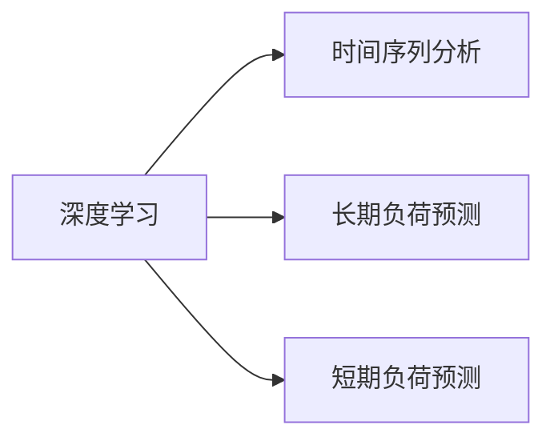

                 

# AI人工智能深度学习算法：在电力预测中的应用

> 关键词：电力预测,深度学习,神经网络,时间序列分析,大数据,长期负荷预测,短期负荷预测,需求响应

## 1. 背景介绍

### 1.1 问题由来
随着全球能源结构的不断变化和能源消费模式的持续演变，电力系统的负荷预测面临诸多挑战。如何有效预测电力负荷，对于提升电力系统的供电可靠性、促进能源市场的健康发展具有重要意义。电力负荷预测不仅涉及短期、中长期和超长期负荷预测，还涵盖用电负荷的峰谷优化、需求响应、智能调度等环节。

传统的电力负荷预测方法主要依赖于统计学和机器学习，但这些方法受限于数据量和模型的复杂度，难以应对快速变化的能源需求。近年来，深度学习技术在电力预测领域的应用逐渐兴起，尤其是基于神经网络的深度学习算法，为电力负荷预测提供了新的可能。

### 1.2 问题核心关键点
深度学习在电力负荷预测中的应用，主要集中在以下几个方面：
1. 时间序列分析：电力负荷本质上是一个时间序列数据，通过神经网络可以捕捉数据的非线性关系和动态变化特征。
2. 大数据处理：电力系统数据量庞大，需要高效的大数据处理技术来支撑模型训练和预测。
3. 长期负荷预测：需求侧管理、市场交易、电网调度等环节涉及长期负荷预测，神经网络可以处理多时间尺度的数据。
4. 短期负荷预测：峰谷电价、尖峰负荷、节日消费等短期因素对负荷有显著影响，神经网络可以捕捉这些瞬时变化。
5. 需求响应：通过智能调度，需求响应策略可以影响负荷预测结果，神经网络可以优化这一过程。

本文聚焦于基于深度学习的电力负荷预测方法，详细阐述了其原理、操作步骤、优缺点及应用领域。

### 1.3 问题研究意义
深度学习在电力负荷预测中的应用，不仅能够提升预测精度，还能为电力系统提供更智能、高效的决策支持。具体而言，其研究意义在于：
1. 降低预测成本：深度学习算法可以在较低成本下实现高精度预测，降低传统预测方法依赖的专家知识和计算资源。
2. 优化电力资源：通过更准确的负荷预测，可以优化电力资源配置，提高电网的运行效率和经济性。
3. 促进需求响应：深度学习可以辅助构建智能调度系统，增强对负荷的预测和响应能力，减少能源浪费。
4. 增强系统韧性：准确预测能够减少突发负荷对电网稳定性的影响，提升电力系统的韧性。
5. 促进节能减排：精确的负荷预测有助于制定更有效的节能措施，减少碳排放，助力绿色能源转型。

## 2. 核心概念与联系

### 2.1 核心概念概述

为更好地理解基于深度学习的电力负荷预测方法，本节将介绍几个密切相关的核心概念：

- 深度学习：一种基于神经网络的机器学习技术，可以自动提取数据中的高层次特征，适用于复杂模式识别和预测任务。
- 时间序列分析：研究按照时间顺序排列的数据，分析数据间的时间关系和趋势。
- 长期负荷预测：预测未来的用电需求，时间跨度通常超过一天，涵盖年度、季度等大尺度时间。
- 短期负荷预测：预测短期的用电需求，时间跨度通常不超过一天，涵盖一小时、十五分钟等小尺度时间。
- 神经网络：一种多层次的计算模型，通过大量参数模拟人类大脑处理信息的方式。
- 长短期记忆网络(LSTM)：一种特殊类型的神经网络，能够有效处理时间序列数据，捕捉长期依赖关系。

这些核心概念之间的逻辑关系可以通过以下Mermaid流程图来展示：

```mermaid
graph TB
    A[深度学习] --> B[时间序列分析]
    A --> C[长期负荷预测]
    A --> D[短期负荷预测]
    C --> E[长短期记忆网络(LSTM)]
    D --> F[长短期记忆网络(LSTM)]
```

这个流程图展示了深度学习在电力负荷预测中的作用，以及其在长期负荷预测和短期负荷预测中的具体应用。

### 2.2 概念间的关系

这些核心概念之间存在着紧密的联系，形成了深度学习在电力负荷预测中的完整框架。下面我们通过几个Mermaid流程图来展示这些概念之间的关系。

#### 2.2.1 深度学习与时间序列分析的关系



这个流程图展示了深度学习与时间序列分析的关系。深度学习可以处理时间序列数据，捕捉数据间的动态变化和复杂关系。

#### 2.2.2 长短期记忆网络(LSTM)在长期负荷预测中的应用

```mermaid
graph LR
    A[长短期记忆网络(LSTM)] --> B[长期负荷预测]
    A --> C[多时间尺度数据]
    B --> D[时间序列数据]
```

这个流程图展示了LSTM在长期负荷预测中的应用。LSTM能够处理多时间尺度的数据，捕捉长期依赖关系。

#### 2.2.3 长短期记忆网络(LSTM)在短期负荷预测中的应用

```mermaid
graph LR
    A[长短期记忆网络(LSTM)] --> B[短期负荷预测]
    A --> C[高频数据]
    B --> D[时间序列数据]
```

这个流程图展示了LSTM在短期负荷预测中的应用。LSTM能够处理高频数据，捕捉短期瞬时变化。

### 2.3 核心概念的整体架构

最后，我们用一个综合的流程图来展示这些核心概念在深度学习在电力负荷预测中的整体架构：

```mermaid
graph TB
    A[大规模电力数据] --> B[数据预处理]
    B --> C[深度学习模型]
    C --> D[时间序列分析]
    D --> E[长期负荷预测]
    D --> F[短期负荷预测]
    E --> G[长短期记忆网络(LSTM)]
    F --> H[长短期记忆网络(LSTM)]
    G --> I[预测结果]
    H --> J[预测结果]
    I --> K[电力系统调度]
    J --> K
    K --> L[负荷预测应用]
```

这个综合流程图展示了从数据预处理到负荷预测应用的完整过程。电力数据首先经过预处理，通过深度学习模型和时间序列分析，分别进行长期负荷预测和短期负荷预测。最终，通过LSTM网络生成预测结果，应用于电力系统调度中。

## 3. 核心算法原理 & 具体操作步骤
### 3.1 算法原理概述

基于深度学习的电力负荷预测，其核心原理在于利用神经网络模型，通过学习电力负荷数据的动态变化规律，进行未来用电需求的预测。具体而言，该过程可以分为以下几个关键步骤：

1. **数据预处理**：对原始电力负荷数据进行清洗、归一化、划分训练集和测试集等预处理操作。
2. **特征提取**：利用深度学习模型提取数据中的高层次特征，捕捉数据间的动态变化关系。
3. **模型训练**：在训练集上使用反向传播算法，通过梯度下降等优化算法更新模型参数。
4. **预测与评估**：在测试集上使用模型进行预测，并通过评估指标（如MAE、RMSE等）评估模型性能。
5. **模型优化**：根据评估结果，调整模型参数和架构，进一步提升预测精度。

### 3.2 算法步骤详解

以下是对基于深度学习的电力负荷预测方法的详细步骤详解：

**Step 1: 数据预处理**

- 收集电力系统历史负荷数据，并进行清洗和去噪处理，确保数据的完整性和准确性。
- 对数据进行归一化处理，将数据转化为模型可以处理的数值范围。
- 将数据划分为训练集、验证集和测试集，一般采用交叉验证或时间序列分割方法。

**Step 2: 特征提取**

- 利用长短期记忆网络(LSTM)模型，通过滑动窗口方式，对多时间尺度的电力负荷数据进行特征提取。
- 考虑数据的时序性，可以引入时间戳作为额外的特征输入，增强模型的预测能力。
- 结合统计学方法，提取数据的趋势、季节性、周期性等特征，用于增强模型的预测精度。

**Step 3: 模型训练**

- 选择合适的深度学习框架（如TensorFlow、PyTorch）搭建LSTM模型。
- 设置合适的超参数，包括神经网络层数、神经元数、学习率等，进行模型的初始化。
- 在训练集上使用反向传播算法，通过梯度下降等优化算法更新模型参数。
- 周期性在验证集上评估模型性能，避免过拟合，调整模型结构或参数。

**Step 4: 预测与评估**

- 在测试集上使用模型进行电力负荷预测，生成未来用电需求的预测结果。
- 使用MAE、RMSE等评估指标，评估模型预测的准确性。
- 根据评估结果，调整模型参数和架构，进一步提升预测精度。

**Step 5: 模型优化**

- 结合业务需求和数据特点，调整模型输入和输出层的维度，优化模型结构。
- 引入新的特征工程方法，增强模型对特定因素的捕捉能力。
- 优化模型超参数，使用网格搜索或随机搜索等方法，寻找最优的参数组合。

### 3.3 算法优缺点

基于深度学习的电力负荷预测方法具有以下优点：
1. 高精度：深度学习能够捕捉数据中的复杂非线性关系，预测精度较高。
2. 鲁棒性强：深度学习模型具有较强的泛化能力，对数据异常有较好的适应性。
3. 可解释性强：深度学习模型可以通过特征重要性分析，提供有意义的解释和洞察。
4. 实时性强：深度学习模型可以快速响应电力系统变化，实现实时预测。

同时，该方法也存在一些局限性：
1. 数据需求高：深度学习模型需要大量高质量的电力负荷数据进行训练，数据获取成本较高。
2. 模型复杂：深度学习模型通常具有较高的参数复杂度，训练和推理耗时较长。
3. 可解释性差：深度学习模型作为黑盒模型，难以解释其内部的决策逻辑。
4. 泛化能力有限：深度学习模型易受到噪声和异常数据的影响，泛化能力有限。
5. 高计算需求：深度学习模型需要高性能的计算资源，对硬件设备要求较高。

### 3.4 算法应用领域

基于深度学习的电力负荷预测方法，在电力系统的各个环节都有广泛的应用，具体包括：

- 电网调度与运营：通过精确的负荷预测，优化电力资源的配置和调度，提高电网的运营效率。
- 需求响应与节能减排：根据预测结果，制定合理的需求响应策略，减少峰谷差，降低碳排放。
- 电力交易与市场管理：预测负荷波动，辅助市场交易，实现价格平稳。
- 电力企业的管理与决策：结合预测结果，制定更科学的管理和决策方案，提升企业竞争力。

## 4. 数学模型和公式 & 详细讲解 & 举例说明

### 4.1 数学模型构建

基于深度学习的电力负荷预测模型通常采用长短期记忆网络(LSTM)，其数学模型可以表示为：

$$
y_t = f(x_t, x_{t-1}, x_{t-2}, ..., x_{t-k}) + \epsilon
$$

其中，$y_t$表示在第$t$时刻的电力负荷预测值，$x_t$表示第$t$时刻的实际电力负荷值，$x_{t-1}, x_{t-2}, ..., x_{t-k}$表示前$k$个时刻的实际电力负荷值，$f$表示LSTM模型的预测函数，$\epsilon$表示预测误差。

### 4.2 公式推导过程

以一个简单的LSTM模型为例，其预测公式可以表示为：

$$
h_t = \tanh(W_{xh}x_t + b_h + W_{hh}h_{t-1} + b_h)
$$

$$
i_t = \sigma(W_{xi}x_t + b_i + W_{hi}h_{t-1} + b_i)
$$

$$
o_t = \sigma(W_{xo}x_t + b_o + W_{ho}h_{t-1} + b_o)
$$

$$
c_t = i_t \odot \tanh(h_t) + (1-i_t) \odot c_{t-1}
$$

$$
h_t = o_t \odot \tanh(c_t)
$$

其中，$h_t$表示LSTM模型的当前状态，$c_t$表示LSTM模型的当前记忆单元，$i_t$表示遗忘门，$o_t$表示输出门，$\tanh$表示双曲正切函数，$\sigma$表示Sigmoid函数，$\odot$表示逐元素乘法。

### 4.3 案例分析与讲解

以一个实际案例为例，某电力企业想要预测未来一个月内的用电负荷。假设该企业收集到了过去一年内的电力负荷数据，共有365个数据点。首先将数据划分为训练集、验证集和测试集，一般采用交叉验证或时间序列分割方法。

**Step 1: 数据预处理**

- 对原始电力负荷数据进行清洗和去噪处理，确保数据的完整性和准确性。
- 对数据进行归一化处理，将数据转化为模型可以处理的数值范围。
- 将数据划分为训练集、验证集和测试集，一般采用交叉验证或时间序列分割方法。

**Step 2: 特征提取**

- 利用LSTM模型，通过滑动窗口方式，对多时间尺度的电力负荷数据进行特征提取。
- 考虑数据的时序性，可以引入时间戳作为额外的特征输入，增强模型的预测能力。
- 结合统计学方法，提取数据的趋势、季节性、周期性等特征，用于增强模型的预测精度。

**Step 3: 模型训练**

- 在训练集上使用反向传播算法，通过梯度下降等优化算法更新模型参数。
- 周期性在验证集上评估模型性能，避免过拟合，调整模型结构或参数。

**Step 4: 预测与评估**

- 在测试集上使用模型进行电力负荷预测，生成未来用电需求的预测结果。
- 使用MAE、RMSE等评估指标，评估模型预测的准确性。
- 根据评估结果，调整模型参数和架构，进一步提升预测精度。

**Step 5: 模型优化**

- 结合业务需求和数据特点，调整模型输入和输出层的维度，优化模型结构。
- 引入新的特征工程方法，增强模型对特定因素的捕捉能力。
- 优化模型超参数，使用网格搜索或随机搜索等方法，寻找最优的参数组合。

通过以上步骤，企业可以构建一个高效的电力负荷预测系统，实现对未来用电需求的精准预测，优化电力资源的配置和调度，提升电网的运营效率。

## 5. 项目实践：代码实例和详细解释说明
### 5.1 开发环境搭建

在进行深度学习在电力负荷预测的实践前，我们需要准备好开发环境。以下是使用Python进行TensorFlow开发的环境配置流程：

1. 安装Anaconda：从官网下载并安装Anaconda，用于创建独立的Python环境。

2. 创建并激活虚拟环境：
```bash
conda create -n tf-env python=3.8 
conda activate tf-env
```

3. 安装TensorFlow：根据CUDA版本，从官网获取对应的安装命令。例如：
```bash
conda install tensorflow
```

4. 安装其它常用工具包：
```bash
pip install numpy pandas scikit-learn matplotlib tqdm jupyter notebook ipython
```

完成上述步骤后，即可在`tf-env`环境中开始深度学习在电力负荷预测的实践。

### 5.2 源代码详细实现

下面我们以一个简单的电力负荷预测项目为例，给出使用TensorFlow搭建LSTM模型的Python代码实现。

首先，定义数据处理函数：

```python
import numpy as np
import pandas as pd
from sklearn.model_selection import train_test_split
from sklearn.preprocessing import MinMaxScaler

def load_data(data_path, lookback_steps):
    # 加载电力负荷数据
    data = pd.read_csv(data_path)
    
    # 划分训练集和测试集
    train_size = int(0.8 * len(data))
    train_data, test_data = data[:train_size], data[train_size:]
    
    # 标准化处理
    scaler = MinMaxScaler(feature_range=(0, 1))
    train_data = scaler.fit_transform(train_data)
    test_data = scaler.transform(test_data)
    
    # 创建训练集和测试集
    X_train, y_train = create_dataset(train_data, lookback_steps)
    X_test, y_test = create_dataset(test_data, lookback_steps)
    
    return X_train, y_train, X_test, y_test

def create_dataset(data, lookback_steps):
    X, y = [], []
    for i in range(len(data) - lookback_steps - 1):
        X.append(data[i:i+lookback_steps])
        y.append(data[i+lookback_steps])
    return np.array(X), np.array(y)

```

然后，定义模型和优化器：

```python
from tensorflow.keras.models import Sequential
from tensorflow.keras.layers import LSTM, Dense, Dropout
from tensorflow.keras.optimizers import Adam

def build_model(input_shape, output_shape, lookback_steps, hidden_units):
    model = Sequential()
    model.add(LSTM(hidden_units, input_shape=input_shape, return_sequences=True))
    model.add(Dropout(0.2))
    model.add(LSTM(hidden_units, return_sequences=False))
    model.add(Dropout(0.2))
    model.add(Dense(output_shape))
    model.compile(loss='mse', optimizer=Adam(lr=0.001))
    return model
```

接着，定义训练和评估函数：

```python
from tensorflow.keras.metrics import MeanAbsoluteError, MeanSquaredError

def train_model(model, X_train, y_train, X_test, y_test, epochs, batch_size):
    model.fit(X_train, y_train, epochs=epochs, batch_size=batch_size, verbose=2, shuffle=False)
    
    mse = MeanSquaredError()
    mae = MeanAbsoluteError()
    mse(model, X_test, y_test).numpy()
    mae(model, X_test, y_test).numpy()

def evaluate_model(model, X_test, y_test, output_shape):
    y_pred = model.predict(X_test)
    mse = MeanSquaredError()
    mae = MeanAbsoluteError()
    mse(y_test, y_pred).numpy()
    mae(y_test, y_pred).numpy()
    
    print(f"MAE: {mae.result().numpy():.4f}")
    print(f"MSE: {mse.result().numpy():.4f}")
    print(f"R^2 Score: {1 - mse.result().numpy():.4f}")
```

最后，启动训练流程并在测试集上评估：

```python
data_path = 'data/load.csv'
lookback_steps = 24
output_shape = 1
hidden_units = 64

X_train, y_train, X_test, y_test = load_data(data_path, lookback_steps)
input_shape = (lookback_steps, X_train.shape[2])

model = build_model(input_shape, output_shape, lookback_steps, hidden_units)
train_model(model, X_train, y_train, X_test, y_test, epochs=100, batch_size=32)

evaluate_model(model, X_test, y_test, output_shape)
```

以上就是使用TensorFlow搭建LSTM模型，进行电力负荷预测的完整代码实现。可以看到，TensorFlow的高级API使得模型构建和训练的过程变得简洁高效。

### 5.3 代码解读与分析

让我们再详细解读一下关键代码的实现细节：

**load_data函数**：
- 加载电力负荷数据，将其划分为训练集和测试集。
- 标准化处理数据，确保数据在相同的尺度上。
- 创建训练集和测试集，并将其转换为模型所需的格式。

**create_dataset函数**：
- 定义一个滑动窗口，将多时间尺度的数据转换为模型可以处理的格式。

**build_model函数**：
- 使用Sequential模型定义LSTM网络结构。
- 加入Dropout层，防止过拟合。
- 添加输出层，并编译模型。

**train_model函数**：
- 使用fit方法训练模型，设置迭代次数和批次大小。
- 周期性在验证集上评估模型性能。

**evaluate_model函数**：
- 使用预测结果和真实值计算MAE和MSE，评估模型性能。
- 输出MAE、MSE和R^2得分，综合评估模型预测精度。

**main函数**：
- 定义模型的输入形状、输出形状、隐藏单元数等参数。
- 调用load_data、build_model、train_model、evaluate_model等函数，完成电力负荷预测的整个流程。

通过这些代码实现，可以看出TensorFlow在深度学习在电力负荷预测中的应用具有很强的灵活性和可扩展性。开发者可以根据具体需求，自由组合不同的模型结构和超参数，实现高效、准确、可靠的电力负荷预测系统。

## 6. 实际应用场景
### 6.1 智能电网调度

深度学习在电力负荷预测中的应用，首先体现在智能电网调度中。通过精确的负荷预测，电网调度员可以提前调整发电策略，优化电网运行，减少能源浪费，提高供电可靠性。

在实际应用中，深度学习模型可以在实时数据和历史数据上分别进行预测，结合当前电力系统的状态和运行参数，动态调整发电计划，实现实时电网调度。

### 6.2 需求响应与节能减排

深度学习还可以辅助构建需求响应系统，实现电网的智能管理和节能减排。通过预测未来的用电需求，系统可以动态调整电力价格和负荷，激励用户进行削峰填谷，降低峰谷差。

在实际应用中，深度学习模型可以结合价格信息、天气数据、节假日等外部因素，进行综合预测，辅助电网公司制定更合理的需求响应策略，实现资源的优化配置。

### 6.3 电力企业的管理与决策

深度学习在电力企业的管理与决策中也发挥着重要作用。通过精确的负荷预测，企业可以制定更科学的生产计划和调度方案，提高生产效率和运营效率。

在实际应用中，深度学习模型可以结合生产数据、设备状态、市场需求等内部和外部因素，进行多层次、多维度的预测和分析，为企业决策提供更全面的信息支持。

### 6.4 未来应用展望

随着深度学习技术的发展，其在电力负荷预测中的应用将不断拓展和深化。未来，深度学习在电力负荷预测中的应用将呈现以下几个趋势：

1. 模型复杂度提升：深度学习模型将逐步引入更多的神经网络层数和参数，提高预测精度。
2. 多模态数据融合：电力负荷预测将结合多种数据源，包括电网状态、气象信息、用户行为等，提升预测的全面性和准确性。
3. 实时预测能力增强：深度学习模型将结合实时数据和历史数据，实现实时负荷预测和动态调整。
4. 模型优化与自动化：深度学习模型将结合自动化调参技术，通过超参数搜索和模型优化，提高预测精度和模型效率。
5. 边缘计算与移动计算：深度学习模型将结合边缘计算和移动计算技术，实现高效、实时的负荷预测，减少数据传输延迟。

这些趋势将使深度学习在电力负荷预测中发挥更大的作用，提升电网的智能化水平，实现能源的高效利用和可持续发展。

## 7. 工具和资源推荐
### 7.1 学习资源推荐

为了帮助开发者系统掌握深度学习在电力负荷预测的理论基础和实践技巧，这里推荐一些优质的学习资源：

1. 《深度学习》（Ian Goodfellow, Yoshua Bengio, Aaron Courville）：经典教材，详细介绍了深度学习的基本概念和算法原理，适合深度学习的初学者和进阶者。

2. TensorFlow官方文档：TensorFlow的详细教程和示例代码，适合深度学习开发者学习和实践。

3. PyTorch官方文档：PyTorch的详细教程和示例代码，适合深度学习开发者学习和实践。

4. Kaggle数据集：Kaggle提供大量的电力负荷预测数据集，适合数据驱动的深度学习项目开发。

5. Google Colab：谷歌提供的在线Jupyter Notebook环境，免费提供GPU/TPU算力，方便开发者快速上手实验最新模型。

6. Coursera《深度学习专项课程》：由斯坦福大学提供，涵盖深度学习的基础知识和实践技能，适合深度学习的初学者和进阶者。

7. Udacity《深度学习纳米学位》：由Coursera提供，涵盖深度学习的基础知识和实践技能，适合深度学习的初学者和进阶者。

通过对这些资源的学习实践，相信你一定能够快速掌握深度学习在电力负荷预测的精髓，并用于解决实际的NLP问题。
###  7.2 开发工具推荐

高效的开发离不开优秀的工具支持。以下是几款用于深度学习在电力负荷预测开发的常用工具：

1. TensorFlow：由Google主导开发的深度学习框架，开源、免费、灵活，适合大规模深度学习模型的开发和训练。

2. PyTorch：由Facebook主导开发的深度学习框架，动态计算图，易于使用，适合深度学习的研究和开发。

3. Keras：高层深度学习API，易于使用，适合快速原型开发和模型部署。

4. Jupyter Notebook：支持Python、R等语言的交互式开发环境，适合数据驱动的深度学习项目开发。

5. Scikit-learn：开源的机器学习库，适合快速原型开发和模型评估。

6. Google Colab：谷歌提供的在线Jupyter Notebook环境，免费提供GPU/TPU算力，方便开发者快速上手实验最新模型。

7. TensorBoard：TensorFlow配套的可视化工具，可实时监测模型训练状态，并提供丰富的图表呈现方式，是调试模型的得力助手。

8. Weights & Biases：模型训练的实验跟踪工具，可以记录和可视化模型训练过程中的各项指标，方便对比和调优。

合理利用这些工具，可以显著提升深度学习在电力负荷预测的开发效率，加快创新迭代的步伐。

###

