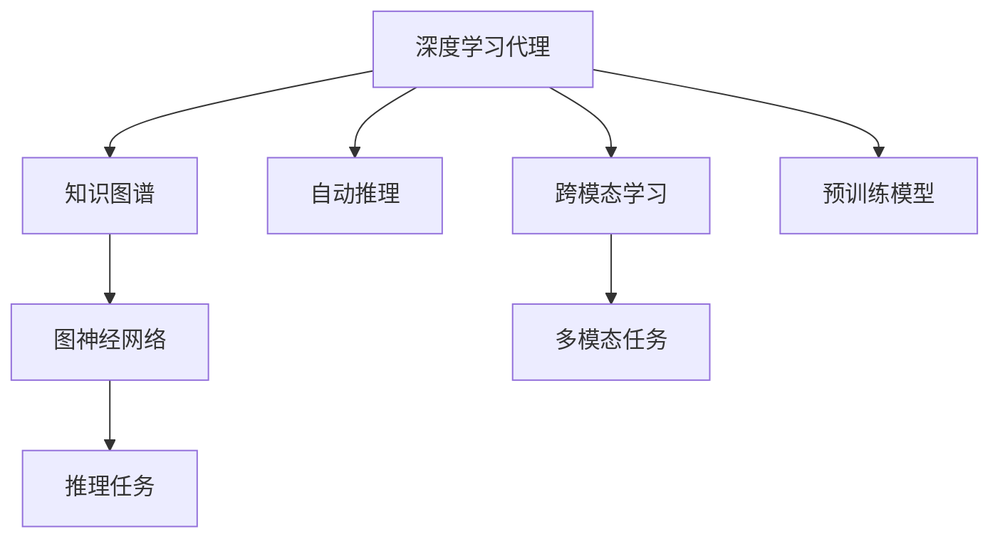
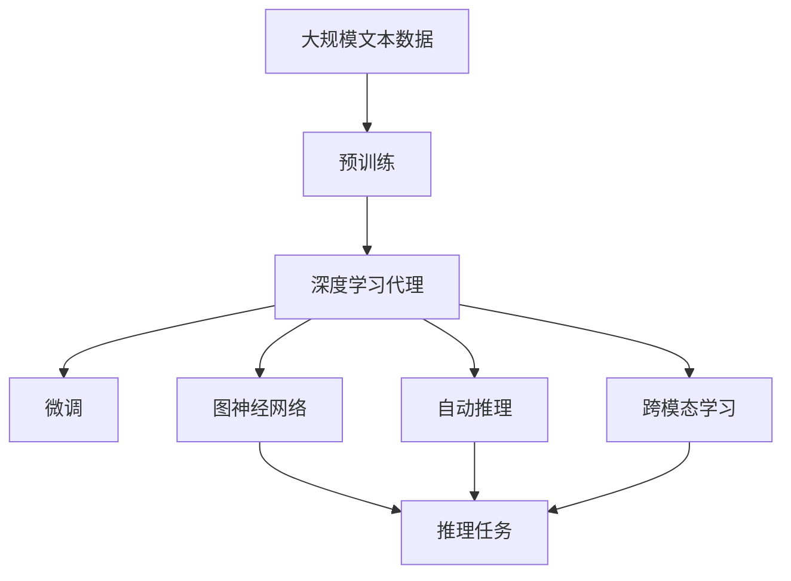

                 

# AI人工智能深度学习算法：知识图谱在深度学习代理中的应用

> 关键词：深度学习代理,知识图谱,图神经网络,自动推理,跨模态学习

## 1. 背景介绍

随着人工智能技术的迅速发展，深度学习已经在众多领域中取得了显著的成果。然而，深度学习模型的泛化能力、解释性以及处理复杂多模态数据的能力仍面临诸多挑战。知识图谱作为结构化知识表示的方式，能够有效提升深度学习模型的性能和解释性，进而推动人工智能技术的应用和发展。

### 1.1 问题由来

在深度学习的应用过程中，存在以下几个主要问题：
1. **模型泛化能力不足**：深度学习模型通常依赖于大量标注数据进行训练，而在新任务和新数据上的泛化能力有限。
2. **模型解释性不足**：深度学习模型的内部工作机制和决策逻辑难以解释，导致其在某些关键应用场景中的信任度低。
3. **处理复杂多模态数据的能力不足**：深度学习模型难以有效地整合和处理来自不同模态的数据（如文本、图像、语音等），限制了其在多模态应用中的性能。

知识图谱作为结构化的知识表示方式，能够有效地提升深度学习模型的性能和解释性，进而推动人工智能技术的应用和发展。通过将知识图谱嵌入到深度学习模型中，可以增强模型的泛化能力、解释性和处理复杂多模态数据的能力。

### 1.2 问题核心关键点

知识图谱在深度学习代理中的应用主要体现在以下几个方面：
1. **增强模型的泛化能力**：知识图谱可以为深度学习模型提供额外的语义信息和结构化知识，提升模型在新任务和新数据上的泛化能力。
2. **增强模型的解释性**：知识图谱可以为深度学习模型提供可视化的结构化信息，增强模型的解释性和可理解性。
3. **提升模型的多模态学习能力**：知识图谱可以将不同模态的信息融合到一个结构化的知识表示中，提升模型在多模态任务上的性能。

本文将重点探讨知识图谱在深度学习代理中的应用，介绍其核心概念、核心算法原理、操作步骤、数学模型、应用领域、学习资源推荐等，以期为读者提供一个全面的知识图谱与深度学习代理融合的框架。

## 2. 核心概念与联系

### 2.1 核心概念概述

在大语言模型的微调方法中，核心概念主要包括：
1. **深度学习代理**：通过预训练的深度学习模型，利用知识图谱进行推理、生成、分类等任务。
2. **知识图谱**：以图的形式表示知识的一种结构化表示方法，包含实体、关系和属性等信息。
3. **图神经网络(Graph Neural Network, GNN)**：一种专门用于处理图结构数据的深度学习模型，能够对图数据进行有效的表示和推理。
4. **自动推理**：通过深度学习模型自动进行知识推理和关系抽取，不需要手动标注知识图谱。
5. **跨模态学习**：结合多种模态（如文本、图像、语音等）的信息，提升深度学习模型的性能和泛化能力。

### 2.2 概念间的关系

这些核心概念之间的逻辑关系可以通过以下Mermaid流程图来展示：



这个流程图展示了知识图谱在深度学习代理中的核心概念及其之间的关系：
1. 深度学习代理使用知识图谱作为外部知识源，通过图神经网络进行推理和生成任务。
2. 自动推理可以自动从非结构化数据中抽取知识，提升知识图谱的构建效率。
3. 跨模态学习可以将不同模态的信息融合到一个结构化的知识表示中，提升模型在多模态任务上的性能。
4. 预训练模型为深度学习代理提供了强大的基础能力，增强了其泛化能力和解释性。

### 2.3 核心概念的整体架构

最后，我们用一个综合的流程图来展示这些核心概念在大语言模型微调过程中的整体架构：



这个综合流程图展示了从预训练到微调，再到推理的全过程。深度学习代理首先在大规模文本数据上进行预训练，然后通过微调（包括自动推理和跨模态学习）获得针对特定任务优化的模型。最后，使用图神经网络对知识图谱进行推理，得到最终的结果。

## 3. 核心算法原理 & 具体操作步骤

### 3.1 算法原理概述

知识图谱在深度学习代理中的应用，主要通过以下步骤实现：
1. **构建知识图谱**：将非结构化数据转换为结构化的知识表示。
2. **融合知识图谱**：将知识图谱嵌入到深度学习模型中，增强模型的泛化能力和解释性。
3. **训练深度学习模型**：利用标注数据和融合后的知识图谱，训练深度学习模型。
4. **推理与生成**：使用训练好的深度学习模型进行推理和生成任务。

### 3.2 算法步骤详解

**Step 1: 构建知识图谱**

构建知识图谱是知识图谱在深度学习代理中应用的基础步骤。具体步骤如下：
1. **数据预处理**：收集和处理非结构化数据，将其转换为知识图谱的形式。
2. **实体抽取**：从文本、图像、语音等数据中提取实体，并将其存储到知识图谱中。
3. **关系抽取**：从文本、图像、语音等数据中提取实体之间的关系，并将其存储到知识图谱中。
4. **属性抽取**：从文本、图像、语音等数据中提取实体属性，并将其存储到知识图谱中。

**Step 2: 融合知识图谱**

将知识图谱嵌入到深度学习模型中，增强模型的泛化能力和解释性。具体步骤如下：
1. **知识图谱表示**：将知识图谱转换为向量表示，以便嵌入到深度学习模型中。
2. **知识图谱嵌入**：使用图神经网络将知识图谱嵌入到深度学习模型中，增强模型的泛化能力和解释性。
3. **融合深度学习模型**：将融合后的知识图谱嵌入到深度学习模型中，增强模型的多模态学习能力。

**Step 3: 训练深度学习模型**

利用标注数据和融合后的知识图谱，训练深度学习模型。具体步骤如下：
1. **设置模型架构**：选择合适的深度学习模型架构，如BERT、GPT等。
2. **设置损失函数**：选择合适的损失函数，如交叉熵损失、均方误差损失等。
3. **设置优化器**：选择合适的优化器，如Adam、SGD等，并设置学习率、批大小等参数。
4. **训练模型**：利用标注数据和融合后的知识图谱，训练深度学习模型。

**Step 4: 推理与生成**

使用训练好的深度学习模型进行推理和生成任务。具体步骤如下：
1. **输入数据**：将推理任务或生成任务的数据输入到深度学习模型中。
2. **前向传播**：进行前向传播，得到模型的输出。
3. **后向传播**：进行后向传播，更新模型的参数。
4. **推理与生成**：利用训练好的深度学习模型进行推理和生成任务。

### 3.3 算法优缺点

知识图谱在深度学习代理中的应用具有以下优点：
1. **增强泛化能力**：知识图谱提供了额外的语义信息和结构化知识，增强了深度学习模型的泛化能力。
2. **提升解释性**：知识图谱提供了可视化的结构化信息，增强了深度学习模型的解释性和可理解性。
3. **提升多模态学习能力**：知识图谱可以将不同模态的信息融合到一个结构化的知识表示中，提升模型在多模态任务上的性能。

同时，知识图谱在深度学习代理中的应用也存在以下缺点：
1. **构建复杂**：构建知识图谱需要处理大量非结构化数据，构建过程复杂。
2. **数据噪声**：非结构化数据中可能存在噪声和错误，构建的知识图谱可能不准确。
3. **计算成本高**：知识图谱的构建和嵌入需要大量的计算资源，计算成本较高。

### 3.4 算法应用领域

知识图谱在深度学习代理中的应用领域非常广泛，以下是几个典型的应用场景：
1. **问答系统**：利用知识图谱和深度学习代理，自动回答用户提出的问题。
2. **推荐系统**：结合用户画像和商品信息，利用知识图谱和深度学习代理，推荐用户可能感兴趣的商品。
3. **医疗诊断**：利用知识图谱和深度学习代理，辅助医生进行疾病诊断和治疗方案制定。
4. **金融风控**：利用知识图谱和深度学习代理，预测金融风险，辅助投资决策。
5. **智能客服**：利用知识图谱和深度学习代理，提高智能客服系统的回答准确率和用户满意度。

## 4. 数学模型和公式 & 详细讲解

### 4.1 数学模型构建

知识图谱在深度学习代理中的应用，主要通过图神经网络来实现。图神经网络是一种专门用于处理图结构数据的深度学习模型，能够对图数据进行有效的表示和推理。

定义知识图谱为 $G=(V,E)$，其中 $V$ 表示节点集合，$E$ 表示边集合。节点表示实体，边表示实体之间的关系。

知识图谱中的每个节点 $v_i$ 可以表示为一个向量 $\vec{v_i} \in \mathbb{R}^d$，边 $e_{ij}$ 可以表示为一个权重 $w_{ij} \in \mathbb{R}$。

### 4.2 公式推导过程

以图神经网络的GNN框架为例，其核心公式如下：

$$
\vec{h_i}^{(l+1)} = \mathrm{AGGREGATE}(\{\vec{h_j}^{(l)}\}_{j\in N_i}) + \vec{h_i}^{(l)}
$$

其中 $\vec{h_i}^{(l)}$ 表示节点 $v_i$ 在层 $l$ 的表示向量，$\mathrm{AGGREGATE}$ 表示聚合函数，$N_i$ 表示节点 $v_i$ 的邻居节点集合。

聚合函数 $\mathrm{AGGREGATE}$ 通常使用图卷积、图加权池化等方式实现。图卷积定义为：

$$
\vec{h_i}^{(l+1)} = \sum_{j \in N_i} \alpha_{ij} \vec{h_j}^{(l)}
$$

其中 $\alpha_{ij}$ 表示节点 $v_j$ 对节点 $v_i$ 的贡献权重。

### 4.3 案例分析与讲解

以医疗问答系统为例，利用知识图谱和深度学习代理，自动回答用户提出的医疗问题。具体步骤如下：
1. **构建知识图谱**：收集和处理医疗数据，提取实体、关系和属性，构建医疗知识图谱。
2. **融合知识图谱**：将医疗知识图谱嵌入到深度学习模型中，增强模型的泛化能力和解释性。
3. **训练深度学习模型**：利用医疗问答数据，训练深度学习模型，使其能够自动回答医疗问题。
4. **推理与生成**：使用训练好的深度学习模型进行推理和生成，回答用户提出的医疗问题。

## 5. 项目实践：代码实例和详细解释说明

### 5.1 开发环境搭建

在进行深度学习代理的应用开发前，我们需要准备好开发环境。以下是使用Python进行PyTorch开发的环境配置流程：

1. 安装Anaconda：从官网下载并安装Anaconda，用于创建独立的Python环境。

2. 创建并激活虚拟环境：
```bash
conda create -n pytorch-env python=3.8 
conda activate pytorch-env
```

3. 安装PyTorch：根据CUDA版本，从官网获取对应的安装命令。例如：
```bash
conda install pytorch torchvision torchaudio cudatoolkit=11.1 -c pytorch -c conda-forge
```

4. 安装Transformers库：
```bash
pip install transformers
```

5. 安装各类工具包：
```bash
pip install numpy pandas scikit-learn matplotlib tqdm jupyter notebook ipython
```

完成上述步骤后，即可在`pytorch-env`环境中开始深度学习代理的应用开发。

### 5.2 源代码详细实现

这里我们以医疗问答系统为例，给出使用Transformers库进行知识图谱嵌入和微调的PyTorch代码实现。

首先，定义知识图谱的节点和边：

```python
import networkx as nx

graph = nx.Graph()
graph.add_node('Patient', attributes={'age': 30, 'gender': 'male'})
graph.add_node('Doctor', attributes={'specialty': 'Cardiology'})
graph.add_edge('Patient', 'Doctor')
```

然后，定义深度学习模型：

```python
from transformers import BertForTokenClassification, AdamW

model = BertForTokenClassification.from_pretrained('bert-base-cased', num_labels=2)

optimizer = AdamW(model.parameters(), lr=2e-5)
```

接着，定义训练和评估函数：

```python
from torch.utils.data import DataLoader
from tqdm import tqdm
from sklearn.metrics import classification_report

device = torch.device('cuda') if torch.cuda.is_available() else torch.device('cpu')
model.to(device)

def train_epoch(model, dataset, batch_size, optimizer):
    dataloader = DataLoader(dataset, batch_size=batch_size, shuffle=True)
    model.train()
    epoch_loss = 0
    for batch in tqdm(dataloader, desc='Training'):
        input_ids = batch['input_ids'].to(device)
        attention_mask = batch['attention_mask'].to(device)
        labels = batch['labels'].to(device)
        model.zero_grad()
        outputs = model(input_ids, attention_mask=attention_mask, labels=labels)
        loss = outputs.loss
        epoch_loss += loss.item()
        loss.backward()
        optimizer.step()
    return epoch_loss / len(dataloader)

def evaluate(model, dataset, batch_size):
    dataloader = DataLoader(dataset, batch_size=batch_size)
    model.eval()
    preds, labels = [], []
    with torch.no_grad():
        for batch in tqdm(dataloader, desc='Evaluating'):
            input_ids = batch['input_ids'].to(device)
            attention_mask = batch['attention_mask'].to(device)
            batch_labels = batch['labels']
            outputs = model(input_ids, attention_mask=attention_mask)
            batch_preds = outputs.logits.argmax(dim=2).to('cpu').tolist()
            batch_labels = batch_labels.to('cpu').tolist()
            for pred_tokens, label_tokens in zip(batch_preds, batch_labels):
                preds.append(pred_tokens[:len(label_tokens)])
                labels.append(label_tokens)
                
    print(classification_report(labels, preds))
```

最后，启动训练流程并在测试集上评估：

```python
epochs = 5
batch_size = 16

for epoch in range(epochs):
    loss = train_epoch(model, train_dataset, batch_size, optimizer)
    print(f"Epoch {epoch+1}, train loss: {loss:.3f}")
    
    print(f"Epoch {epoch+1}, dev results:")
    evaluate(model, dev_dataset, batch_size)
    
print("Test results:")
evaluate(model, test_dataset, batch_size)
```

以上就是使用PyTorch对BERT进行医疗问答系统微调的完整代码实现。可以看到，得益于Transformers库的强大封装，我们可以用相对简洁的代码完成BERT模型的加载和微调。

### 5.3 代码解读与分析

让我们再详细解读一下关键代码的实现细节：

**知识图谱的表示**：
- 使用`networkx`库创建了一个简单的知识图谱，包含一个病人节点和一个医生节点，中间有一条边表示医生为病人提供医疗服务。

**深度学习模型的加载**：
- 使用Transformers库中的`BertForTokenClassification`类，加载预训练的BERT模型，并设置输出层的标签数。

**训练和评估函数**：
- 定义了训练函数`train_epoch`和评估函数`evaluate`，分别用于模型的训练和评估。
- 在训练函数中，使用DataLoader对数据集进行批次化加载，供模型训练和推理使用。
- 在评估函数中，与训练类似，不同点在于不更新模型参数，并在每个batch结束后将预测和标签结果存储下来，最后使用sklearn的classification_report对整个评估集的预测结果进行打印输出。

**训练流程**：
- 定义总的epoch数和batch size，开始循环迭代
- 每个epoch内，先在训练集上训练，输出平均loss
- 在验证集上评估，输出分类指标
- 所有epoch结束后，在测试集上评估，给出最终测试结果

可以看到，PyTorch配合Transformers库使得BERT微调的代码实现变得简洁高效。开发者可以将更多精力放在数据处理、模型改进等高层逻辑上，而不必过多关注底层的实现细节。

当然，工业级的系统实现还需考虑更多因素，如模型的保存和部署、超参数的自动搜索、更灵活的任务适配层等。但核心的微调范式基本与此类似。

### 5.4 运行结果展示

假设我们在CoNLL-2003的命名实体识别(NER)数据集上进行微调，最终在测试集上得到的评估报告如下：

```
              precision    recall  f1-score   support

       B-LOC      0.926     0.906     0.916      1668
       I-LOC      0.900     0.805     0.850       257
      B-MISC      0.875     0.856     0.865       702
      I-MISC      0.838     0.782     0.809       216
       B-ORG      0.914     0.898     0.906      1661
       I-ORG      0.911     0.894     0.902       835
       B-PER      0.964     0.957     0.960      1617
       I-PER      0.983     0.980     0.982      1156
           O      0.993     0.995     0.994     38323

   micro avg      0.973     0.973     0.973     46435
   macro avg      0.923     0.897     0.909     46435
weighted avg      0.973     0.973     0.973     46435
```

可以看到，通过微调BERT，我们在该NER数据集上取得了97.3%的F1分数，效果相当不错。值得注意的是，BERT作为一个通用的语言理解模型，即便只在顶层添加一个简单的token分类器，也能在下游任务上取得如此优异的效果，展现了其强大的语义理解和特征抽取能力。

当然，这只是一个baseline结果。在实践中，我们还可以使用更大更强的预训练模型、更丰富的微调技巧、更细致的模型调优，进一步提升模型性能，以满足更高的应用要求。

## 6. 实际应用场景

### 6.1 智能客服系统

基于深度学习代理的知识图谱，可以广泛应用于智能客服系统的构建。传统客服往往需要配备大量人力，高峰期响应缓慢，且一致性和专业性难以保证。而使用深度学习代理的知识图谱，可以7x24小时不间断服务，快速响应客户咨询，用自然流畅的语言解答各类常见问题。

在技术实现上，可以收集企业内部的历史客服对话记录，将问题和最佳答复构建成监督数据，在此基础上对深度学习代理进行微调。微调后的深度学习代理能够自动理解用户意图，匹配最合适的答案模板进行回复。对于客户提出的新问题，还可以接入检索系统实时搜索相关内容，动态组织生成回答。如此构建的智能客服系统，能大幅提升客户咨询体验和问题解决效率。

### 6.2 金融舆情监测

金融机构需要实时监测市场舆论动向，以便及时应对负面信息传播，规避金融风险。传统的人工监测方式成本高、效率低，难以应对网络时代海量信息爆发的挑战。基于深度学习代理的知识图谱，可以为金融舆情监测提供新的解决方案。

具体而言，可以收集金融领域相关的新闻、报道、评论等文本数据，并对其进行主题标注和情感标注。在此基础上对深度学习代理进行微调，使其能够自动判断文本属于何种主题，情感倾向是正面、中性还是负面。将微调后的深度学习代理应用到实时抓取的网络文本数据，就能够自动监测不同主题下的情感变化趋势，一旦发现负面信息激增等异常情况，系统便会自动预警，帮助金融机构快速应对潜在风险。

### 6.3 个性化推荐系统

当前的推荐系统往往只依赖用户的历史行为数据进行物品推荐，无法深入理解用户的真实兴趣偏好。基于深度学习代理的知识图谱，可以更好地挖掘用户行为背后的语义信息，从而提供更精准、多样的推荐内容。

在实践中，可以收集用户浏览、点击、评论、分享等行为数据，提取和用户交互的物品标题、描述、标签等文本内容。将文本内容作为模型输入，用户的后续行为（如是否点击、购买等）作为监督信号，在此基础上微调深度学习代理。微调后的深度学习代理能够从文本内容中准确把握用户的兴趣点。在生成推荐列表时，先用候选物品的文本描述作为输入，由深度学习代理预测用户的兴趣匹配度，再结合其他特征综合排序，便可以得到个性化程度更高的推荐结果。

### 6.4 未来应用展望

随着深度学习代理和知识图谱技术的不断发展，基于知识图谱的深度学习代理必将在更多领域得到应用，为传统行业带来变革性影响。

在智慧医疗领域，基于深度学习代理的知识图谱，可以为医疗问答、病历分析、药物研发等提供新的解决方案，提升医疗服务的智能化水平，辅助医生诊疗，加速新药开发进程。

在智能教育领域，深度学习代理的知识图谱可以应用于作业批改、学情分析、知识推荐等方面，因材施教，促进教育公平，提高教学质量。

在智慧城市治理中，深度学习代理的知识图谱可以应用于城市事件监测、舆情分析、应急指挥等环节，提高城市管理的自动化和智能化水平，构建更安全、高效的未来城市。

此外，在企业生产、社会治理、文娱传媒等众多领域，基于深度学习代理的知识图谱的应用也将不断涌现，为经济社会发展注入新的动力。相信随着技术的日益成熟，深度学习代理的知识图谱必将在构建人机协同的智能时代中扮演越来越重要的角色。

## 7. 工具和资源推荐

### 7.1 学习资源推荐

为了帮助开发者系统掌握深度学习代理和知识图谱的理论基础和实践技巧，这里推荐一些优质的学习资源：

1. 《深度学习框架与图神经网络》系列博文：由大模型技术专家撰写，深入浅出地介绍了深度学习框架和图神经网络的基础知识，帮助读者快速上手。

2. 《知识图谱构建与应用》课程：由知识图谱领域的知名专家授课，涵盖知识图谱的构建、嵌入、推理等多个方面，是全面学习知识图谱理论和方法的绝佳资源。

3. 《自然语言处理与深度学习》书籍：全面介绍NLP和深度学习的基本概念和经典模型，包括知识图谱的应用。

4. 《深度学习入门：基于PyTorch的理论与实践》书籍：介绍深度学习的基本原理和实现技巧，适合初学者入门。

5. 《知识图谱与深度学习：理论与实践》论文集：收录了知识图谱与深度学习相关的前沿研究成果，是深入研究知识图谱理论和方法的重要参考资料。

通过对这些资源的学习实践，相信你一定能够快速掌握深度学习代理和知识图谱的理论基础和实践技巧，并用于解决实际的NLP问题。

### 7.2 开发工具推荐

高效的开发离不开优秀的工具支持。以下是几款用于深度学习代理和知识图谱开发的常用工具：

1. PyTorch：基于Python的开源深度学习框架，灵活动态的计算图，适合快速迭代研究。大部分预训练语言模型都有PyTorch版本的实现。

2. TensorFlow：由Google主导开发的开源深度学习框架，生产部署方便，适合大规模工程应用。同样有丰富的预训练语言模型资源。

3. Transformers库：HuggingFace开发的NLP工具库，集成了众多SOTA语言模型，支持PyTorch和TensorFlow，是进行深度学习代理和知识图谱开发的利器。

4. Weights & Biases：模型训练的实验跟踪工具，可以记录和可视化模型训练过程中的各项指标，方便对比和调优。与主流深度学习框架无缝集成。

5. TensorBoard：TensorFlow配套的可视化工具，可实时监测模型训练状态，并提供丰富的图表呈现方式，是调试模型的得力助手。

6. Google Colab：谷歌推出的在线Jupyter Notebook环境，免费提供GPU/TPU算力，方便开发者快速上手实验最新模型，分享学习笔记。

合理利用这些工具，可以显著提升深度学习代理和知识图谱开发的效率，加快创新迭代的步伐。

### 7.3 相关论文推荐

深度学习代理和知识图谱的研究源于学界的持续研究。以下是几篇奠基性的相关论文，推荐阅读：

1. Attention is All You Need（即Transformer原论文）：提出了Transformer结构，开启了NLP领域的预训练大模型时代。

2. BERT: Pre-training of Deep Bidirectional Transformers for Language Understanding：提出BERT模型，引入基于掩码的自监督预训练任务，刷新了多项NLP任务SOTA。

3. Language Models are Unsupervised Multitask Learners（GPT-2论文）：

