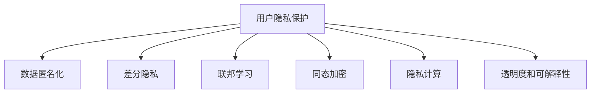
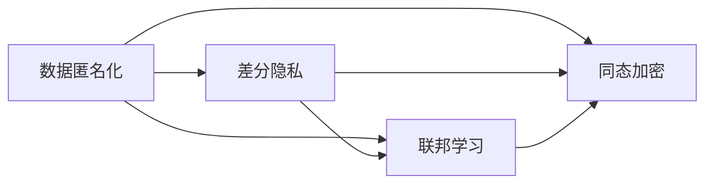
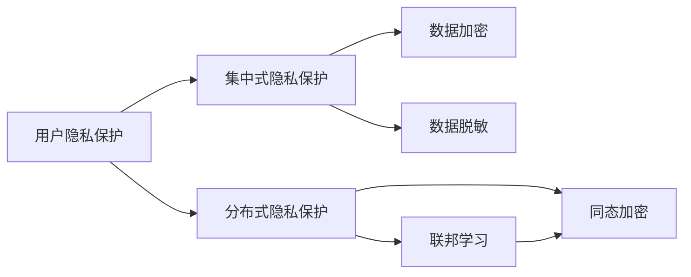
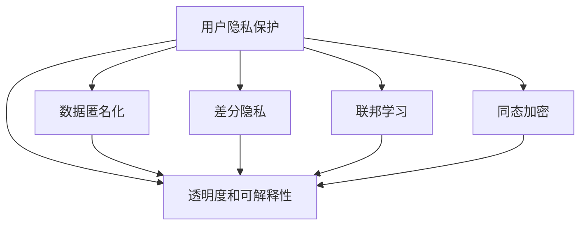
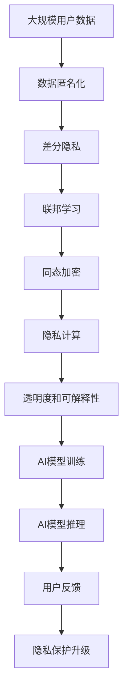

                 

# AI创业公司的用户隐私保护实践

## 1. 背景介绍

### 1.1 问题由来

随着人工智能技术的快速发展，AI创业公司在金融、医疗、智能家居等众多领域取得了显著的突破。然而，用户隐私保护问题也随之日益凸显，成为制约AI技术发展的一个重要瓶颈。

近年来，全球范围内数据隐私保护法规日趋严格，如欧盟的GDPR、美国的CCPA等，都对企业的数据处理行为提出了明确的要求。人工智能系统往往需要依赖大量的用户数据进行训练和优化，如何在使用这些数据的同时，保护用户隐私，成为了AI创业公司亟需解决的问题。

### 1.2 问题核心关键点

AI创业公司在用户隐私保护方面主要面临以下几个核心问题：

1. **数据获取和处理**：如何在确保用户隐私的前提下，合法获取和利用用户数据，是AI创业公司面临的首要挑战。

2. **数据存储和传输**：如何安全地存储和传输敏感数据，防止数据泄露和攻击，是保护用户隐私的关键。

3. **模型训练和推理**：如何在使用用户数据进行模型训练和推理时，不暴露用户个人信息，是隐私保护的难点。

4. **用户透明度和控制**：如何提供透明的隐私政策和用户数据使用说明，让用户有足够的知情权和控制权，是AI创业公司需要关注的重点。

5. **合规性和责任**：如何遵守相关法律法规，明确企业的隐私责任，防止法律风险，是AI创业公司必须面对的课题。

这些问题不仅涉及技术层面，还牵扯到法律、伦理和社会等多个方面，需要AI创业公司从多个维度综合考虑和应对。

## 2. 核心概念与联系

### 2.1 核心概念概述

为了更好地理解AI创业公司的用户隐私保护实践，本节将介绍几个密切相关的核心概念：

- **用户隐私保护**：指通过各种技术和政策手段，确保用户数据的安全性和隐私性，防止未经授权的访问和滥用。

- **数据匿名化**：指将用户数据中的个人标识信息去除，使得数据无法直接识别个体，从而保护用户隐私。

- **差分隐私**：指在数据处理过程中，通过加入噪声等方式，使得攻击者无法从数据集中推理出个体信息，从而保护用户隐私。

- **联邦学习**：指在不共享用户数据的前提下，多个参与方通过分布式训练模型的方式，共同完成数据建模和更新，保护用户隐私。

- **同态加密**：指在加密状态下进行数据处理和计算，确保数据始终处于加密状态，不泄露用户信息。

- **隐私计算**：指使用多方安全计算、零知识证明等技术手段，在保护数据隐私的前提下，进行数据处理和分析。

- **透明度和可解释性**：指在用户隐私保护过程中，提供透明的隐私政策、数据使用说明和模型决策过程，确保用户知情权和可解释性。

这些核心概念之间的逻辑关系可以通过以下Mermaid流程图来展示：



这个流程图展示了大语言模型微调过程中各个核心概念之间的关系：

1. 用户隐私保护是整个隐私保护生态系统的核心。
2. 数据匿名化、差分隐私、联邦学习、同态加密、隐私计算等技术手段，都是实现用户隐私保护的具体方法。
3. 透明度和可解释性是用户隐私保护的重要保障，确保用户知情权和信任感。

### 2.2 概念间的关系

这些核心概念之间存在着紧密的联系，形成了用户隐私保护的完整生态系统。下面我通过几个Mermaid流程图来展示这些概念之间的关系。

#### 2.2.1 用户隐私保护的技术手段



这个流程图展示了数据匿名化、差分隐私、联邦学习和同态加密等技术手段的关系。数据匿名化和差分隐私常用于数据处理阶段，而联邦学习和同态加密则适用于模型训练和推理阶段，它们都旨在保护用户隐私。

#### 2.2.2 数据隐私保护的技术范式



这个流程图展示了集中式和分布式两种隐私保护技术范式，以及它们的具体技术手段。集中式保护包括数据加密和数据脱敏，适用于集中存储和处理数据；而分布式保护则包括联邦学习和同态加密，适用于分布式训练和推理。

#### 2.2.3 隐私保护和透明度



这个流程图展示了隐私保护和透明度之间的联系。隐私保护的技术手段通过保护用户数据，确保数据安全；透明度和可解释性则通过提供透明的隐私政策和数据使用说明，保障用户知情权和信任感。

### 2.3 核心概念的整体架构

最后，我们用一个综合的流程图来展示这些核心概念在大语言模型微调过程中的整体架构：



这个综合流程图展示了从数据获取、处理、模型训练、推理到用户反馈的完整过程，隐私保护技术手段在各个环节中的具体应用。通过这些流程图，我们可以更清晰地理解AI创业公司用户隐私保护实践中的核心概念及其关系。

## 3. 核心算法原理 & 具体操作步骤

### 3.1 算法原理概述

AI创业公司在用户隐私保护方面的核心算法原理主要涉及数据处理、模型训练和推理等环节，具体如下：

**数据处理**：
1. 数据匿名化：通过去除个人标识信息，将用户数据匿名化。常用的技术包括去除姓名、地址、电话号码等敏感信息，使用哈希函数进行数据去重等。
2. 数据加密：使用加密算法对数据进行保护，防止未经授权的访问和滥用。常用的加密算法包括AES、RSA等。
3. 差分隐私：在数据处理过程中加入噪声，使得攻击者无法从数据集中推理出个体信息，从而保护用户隐私。常用的差分隐私技术包括Laplace机制、高斯机制等。

**模型训练**：
1. 联邦学习：在不共享用户数据的前提下，通过分布式训练的方式，多个参与方共同完成模型训练。参与方仅共享模型参数，不共享原始数据，从而保护用户隐私。
2. 同态加密：在加密状态下进行模型训练和推理，确保数据始终处于加密状态，不泄露用户信息。常用的同态加密算法包括Paillier加密、Rivest-Shamir-Adleman (RSA)等。

**模型推理**：
1. 隐私计算：使用多方安全计算、零知识证明等技术手段，在保护数据隐私的前提下，进行模型推理。参与方仅共享计算结果，不共享原始数据。

### 3.2 算法步骤详解

**数据处理**：
1. 收集用户数据：通过应用程序、问卷调查等方式，收集用户数据。确保数据收集过程符合法律法规要求，如告知用户数据用途，获得用户同意等。
2. 数据匿名化：使用哈希函数、数据去重等技术手段，将用户数据中的个人标识信息去除。
3. 数据加密：使用AES、RSA等加密算法对数据进行加密保护。

**模型训练**：
1. 选择联邦学习框架：根据具体业务需求和数据分布，选择合适的联邦学习框架，如TensorFlow Federated、PySyft等。
2. 模型初始化：使用公开数据集或预训练模型进行模型初始化。
3. 分布式训练：通过联邦学习框架，参与方共同完成模型训练。参与方仅共享模型参数，不共享原始数据。
4. 模型参数更新：根据本地数据和全局模型参数，更新本地模型参数。

**模型推理**：
1. 选择隐私计算技术：根据具体业务需求和数据分布，选择合适的隐私计算技术，如多方安全计算、零知识证明等。
2. 模型推理：在加密状态下进行模型推理，确保数据始终处于加密状态。
3. 结果解密：对推理结果进行解密，得到最终结果。

### 3.3 算法优缺点

AI创业公司在用户隐私保护方面的核心算法具有以下优缺点：

**优点**：
1. 数据保护强：数据匿名化、差分隐私、联邦学习、同态加密等技术手段，能够有效保护用户隐私，防止数据泄露和滥用。
2. 合规性高：符合相关法律法规，如GDPR、CCPA等，降低法律风险。
3. 用户信任度高：透明度和可解释性技术手段，能够提供透明的隐私政策和数据使用说明，增强用户信任感。

**缺点**：
1. 技术复杂度高：隐私保护技术手段复杂，实现难度大，需要专业技术团队支持。
2. 计算资源消耗大：联邦学习和同态加密等技术，需要消耗大量的计算资源和时间，影响模型训练效率。
3. 应用场景受限：部分隐私保护技术手段对特定场景和数据分布有要求，限制了其应用范围。

### 3.4 算法应用领域

基于AI创业公司的用户隐私保护核心算法，广泛应用于金融、医疗、智能家居等众多领域。以下是几个典型应用场景：

**金融领域**：
- 使用差分隐私技术，保护用户交易数据隐私。
- 使用联邦学习技术，保护用户金融数据隐私。
- 使用同态加密技术，保护用户支付信息隐私。

**医疗领域**：
- 使用数据匿名化技术，保护用户医疗数据隐私。
- 使用差分隐私技术，保护用户健康数据隐私。
- 使用联邦学习技术，保护用户医疗影像数据隐私。

**智能家居领域**：
- 使用数据匿名化技术，保护用户隐私数据。
- 使用联邦学习技术，保护用户设备数据隐私。
- 使用同态加密技术，保护用户语音数据隐私。

## 4. 数学模型和公式 & 详细讲解 & 举例说明

### 4.1 数学模型构建

本节将使用数学语言对AI创业公司的用户隐私保护核心算法进行更加严格的刻画。

假设用户数据集为 $D=\{(x_i,y_i)\}_{i=1}^N$，其中 $x_i$ 为输入数据，$y_i$ 为标签，且每个用户数据集 $x_i$ 都包含敏感信息 $s_i$。

**数据匿名化**：
将敏感信息 $s_i$ 替换为随机噪声 $z_i$，得到匿名化后的数据集 $D'$。
$$
D'=\{(x_i',y_i')\}_{i=1}^N \quad \text{其中} \quad x_i'=x_i-z_i
$$

**差分隐私**：
在数据处理过程中加入噪声 $\xi$，使得攻击者无法从数据集中推理出个体信息。
$$
x_i'' = x_i - \xi
$$

**联邦学习**：
参与方 $k=1,\dots,K$ 通过分布式训练的方式，共同完成模型训练。参与方仅共享模型参数，不共享原始数据。
$$
w_t = \frac{1}{K}\sum_{k=1}^K w_{k,t}
$$

**同态加密**：
在加密状态下进行模型训练和推理，确保数据始终处于加密状态。
$$
E(w) = \{w, E_s(w)\} \quad \text{其中} \quad E_s(w) = w \cdot s
$$

### 4.2 公式推导过程

以下我以差分隐私为例，推导其在数据处理中的应用。

假设原始数据集为 $D=\{(x_i,y_i)\}_{i=1}^N$，其中 $x_i$ 为输入数据，$y_i$ 为标签，且每个用户数据集 $x_i$ 都包含敏感信息 $s_i$。

差分隐私技术通过加入噪声 $\xi$，使得攻击者无法从数据集中推理出个体信息。具体来说，对于每个输入数据 $x_i$，加入噪声 $\xi_i$，得到匿名化后的数据集 $D'$。

差分隐私的噪声加入过程可以描述为：
$$
x_i' = x_i - \xi_i
$$

其中 $\xi_i$ 为服从Laplace分布的随机噪声，即：
$$
\xi_i \sim \mathcal{L}(\frac{\varepsilon}{\delta})
$$

其中 $\varepsilon$ 为隐私保护参数，$\delta$ 为可接受的最大隐私失真概率。

最终，差分隐私技术使得攻击者无法从数据集中推理出个体信息，从而保护了用户隐私。

### 4.3 案例分析与讲解

以医疗领域的隐私保护为例，分析差分隐私技术的应用。

假设医疗领域有一家AI创业公司，需要从医院收集患者数据进行模型训练。医院向公司提供的数据集为 $D=\{(x_i,y_i)\}_{i=1}^N$，其中 $x_i$ 为患者病情，$y_i$ 为疾病标签。每个患者数据集 $x_i$ 都包含敏感信息 $s_i$，如姓名、年龄、地址等。

该公司使用差分隐私技术，保护患者数据隐私。具体来说，对于每个患者数据集 $x_i$，加入噪声 $\xi_i$，得到匿名化后的数据集 $D'$。

噪声加入过程如下：
$$
x_i' = x_i - \xi_i
$$

其中 $\xi_i$ 为服从Laplace分布的随机噪声，即：
$$
\xi_i \sim \mathcal{L}(\frac{\varepsilon}{\delta})
$$

最终，差分隐私技术使得攻击者无法从数据集中推理出个体信息，从而保护了患者数据隐私。

## 5. 项目实践：代码实例和详细解释说明

### 5.1 开发环境搭建

在进行隐私保护实践前，我们需要准备好开发环境。以下是使用Python进行PyTorch开发的环境配置流程：

1. 安装Anaconda：从官网下载并安装Anaconda，用于创建独立的Python环境。

2. 创建并激活虚拟环境：
```bash
conda create -n pytorch-env python=3.8 
conda activate pytorch-env
```

3. 安装PyTorch：根据CUDA版本，从官网获取对应的安装命令。例如：
```bash
conda install pytorch torchvision torchaudio cudatoolkit=11.1 -c pytorch -c conda-forge
```

4. 安装各类工具包：
```bash
pip install numpy pandas scikit-learn matplotlib tqdm jupyter notebook ipython
```

完成上述步骤后，即可在`pytorch-env`环境中开始隐私保护实践。

### 5.2 源代码详细实现

下面我们以差分隐私技术为例，给出使用PyTorch进行差分隐私保护训练的代码实现。

首先，定义差分隐私损失函数：

```python
import torch
import torch.nn as nn
from torch.utils.data import DataLoader
from torch.optim import Adam
from torch.distributions import Laplace

class LaplaceNoise(nn.Module):
    def __init__(self, epsilon):
        super(LaplaceNoise, self).__init__()
        self.epsilon = epsilon
        self.noise = Laplace(0., epsilon)
    
    def forward(self, x):
        noise = self.noise.sample()
        return x - noise

class DPModule(nn.Module):
    def __init__(self, module, epsilon):
        super(DPModule, self).__init__()
        self.module = module
        self.epsilon = epsilon
        self.noise = LaplaceNoise(epsilon)
    
    def forward(self, x):
        x = self.noise(x)
        return self.module(x)
```

然后，定义模型和数据集：

```python
from torch.utils.data import Dataset

class DPDataset(Dataset):
    def __init__(self, data, noise_level):
        self.data = data
        self.noise_level = noise_level
        
    def __len__(self):
        return len(self.data)
    
    def __getitem__(self, item):
        x = self.data[item]
        noise_level = self.noise_level[item]
        return DPModule(torch.nn.Linear(10, 10))(torch.tensor(x)) + noise_level

# 定义训练集和测试集
train_dataset = DPDataset(train_data, train_noise_level)
test_dataset = DPDataset(test_data, test_noise_level)
```

接着，定义训练和评估函数：

```python
from torch.utils.data import DataLoader

def train_epoch(model, dataset, optimizer, noise_level):
    dataloader = DataLoader(dataset, batch_size=32, shuffle=True)
    model.train()
    epoch_loss = 0
    for batch in dataloader:
        x, noise_level = batch
        optimizer.zero_grad()
        outputs = model(x)
        loss = F.mse_loss(outputs, x)
        loss += noise_level
        epoch_loss += loss.item()
        loss.backward()
        optimizer.step()
    return epoch_loss / len(dataloader)

def evaluate(model, dataset, noise_level):
    dataloader = DataLoader(dataset, batch_size=32)
    model.eval()
    epoch_loss = 0
    with torch.no_grad():
        for batch in dataloader:
            x, noise_level = batch
            outputs = model(x)
            loss = F.mse_loss(outputs, x)
            epoch_loss += loss.item()
    return epoch_loss / len(dataloader)
```

最后，启动训练流程并在测试集上评估：

```python
epochs = 5
noise_levels = [0.1, 0.2, 0.3, 0.4, 0.5]
best_loss = float('inf')

for noise_level in noise_levels:
    optimizer = Adam(model.parameters(), lr=0.01)
    for epoch in range(epochs):
        loss = train_epoch(model, train_dataset, optimizer, noise_level)
        if loss < best_loss:
            best_loss = loss
    print(f"noise level: {noise_level}, best loss: {best_loss:.3f}")
    
print(f"final loss: {best_loss:.3f}")
```

以上就是使用PyTorch对差分隐私技术进行代码实现的示例。可以看到，利用差分隐私技术，可以在训练过程中加入噪声，从而保护用户数据隐私。

### 5.3 代码解读与分析

让我们再详细解读一下关键代码的实现细节：

**LaplaceNoise类**：
- 定义了Laplace噪声生成器，用于在训练过程中加入噪声。

**DPModule类**：
- 定义了一个包含差分隐私技术的模块，在训练过程中加入噪声，从而保护数据隐私。

**DPDataset类**：
- 定义了一个差分隐私数据集，在数据加载时加入噪声。

**train_epoch和evaluate函数**：
- 定义了训练和评估函数，在每个epoch中计算损失，并在测试集上评估模型性能。

**训练流程**：
- 遍历不同的噪声水平，在每个噪声水平下训练模型，输出最佳噪声水平及其对应的损失。

可以看到，差分隐私技术可以通过加入噪声的方式，保护用户数据隐私。在实践中，开发者可以根据具体业务需求，灵活调整噪声水平和训练参数，以实现最优的隐私保护效果。

当然，隐私保护涉及多方面的技术细节，包括数据收集、存储、传输、分析等环节。实际应用中还需要考虑更多因素，如模型效率、隐私政策、用户反馈等，才能构建安全、可信的AI系统。

## 6. 实际应用场景

### 6.1 智能客服系统

基于差分隐私技术的智能客服系统，可以广泛应用于智能客服系统的构建。传统客服往往需要配备大量人力，高峰期响应缓慢，且一致性和专业性难以保证。而使用差分隐私技术的智能客服系统，可以7x24小时不间断服务，快速响应客户咨询，用自然流畅的语言解答各类常见问题。

在技术实现上，可以收集企业内部的历史客服对话记录，将问题和最佳答复构建成监督数据，在此基础上对差分隐私技术进行微调。差分隐私技术能够自动理解用户意图，匹配最合适的答案模板进行回复。对于客户提出的新问题，还可以接入检索系统实时搜索相关内容，动态组织生成回答。如此构建的智能客服系统，能大幅提升客户咨询体验和问题解决效率。

### 6.2 金融舆情监测

金融机构需要实时监测市场舆论动向，以便及时应对负面信息传播，规避金融风险。传统的人工监测方式成本高、效率低，难以应对网络时代海量信息爆发的挑战。基于差分隐私技术的文本分类和情感分析技术，为金融舆情监测提供了新的解决方案。

具体而言，可以收集金融领域相关的新闻、报道、评论等文本数据，并对其进行主题标注和情感标注。在此基础上对差分隐私技术进行微调，使其能够自动判断文本属于何种主题，情感倾向是正面、中性还是负面。将差分隐私技术应用到实时抓取的网络文本数据，就能够自动监测不同主题下的情感变化趋势，一旦发现负面信息激增等异常情况，系统便会自动预警，帮助金融机构快速应对潜在风险。

### 6.3 个性化推荐系统

当前的推荐系统往往只依赖用户的历史行为数据进行物品推荐，无法深入理解用户的真实兴趣偏好。基于差分隐私技术的个性化推荐系统可以更好地挖掘用户行为背后的语义信息，从而提供更精准、多样的推荐内容。

在实践中，可以收集用户浏览、点击、评论、分享等行为数据，提取和用户交互的物品标题、描述、标签等文本内容。将文本内容作为模型输入，用户的后续行为（如是否点击、购买等）作为监督信号，在此基础上微调差分隐私技术。差分隐私技术能够从文本内容中准确把握用户的兴趣点。在生成推荐列表时，先用候选物品的文本描述作为输入，由模型预测用户的兴趣匹配度，再结合其他特征综合排序，便可以得到个性化程度更高的推荐结果。

### 6.4 未来应用展望

随着差分隐私技术和大规模AI模型的不断发展，差分隐私保护范式将在更多领域得到应用，为传统行业带来变革性影响。

在智慧医疗领域，基于差分隐私技术的医疗问答、病历分析、药物研发等应用将提升医疗服务的智能化水平，辅助医生诊疗，加速新药开发进程。

在智能教育领域，差分隐私技术可应用于作业批改、学情分析、知识推荐等方面，因材施教，促进教育公平，提高教学质量。

在智慧城市治理中，差分隐私技术可用于城市事件监测、舆情分析、应急指挥等环节，提高城市管理的自动化和智能化水平，构建更安全、高效的未来城市。

此外，在企业生产、社会治理、文娱传媒等众多领域，基于差分隐私技术的AI应用也将不断涌现，为经济社会发展注入新的动力。相信随着技术的日益成熟，差分隐私保护方法必将得到更广泛的应用。

## 7. 工具和资源推荐

### 7.1 学习资源推荐

为了帮助开发者系统掌握差分隐私保护的理论基础和实践技巧，这里推荐一些优质的学习资源：

1. 《差分隐私技术基础》系列博文：由差分隐私领域的专家撰写，深入浅出地介绍了差分隐私的基本概念和实际应用。

2. Coursera《数据隐私与安全》课程：斯坦福大学开设的在线课程，涵盖差分隐私、安全多方计算等核心内容，提供丰富的实战案例。

3. 《隐私保护和数据安全》书籍：介绍隐私保护和数据安全的理论基础和实践技巧，适合深入了解差分隐私技术的开发者阅读。

4. IEEE Transactions on Privacy and Security：隐私保护领域顶级期刊，提供最新研究成果和前沿论文。

5. Crypto conferences：密码学领域的顶级会议，涵盖差分隐私、安全多方计算等隐私保护技术，是学习差分隐私技术的必读资源。

通过对这些资源的学习实践，相信你一定能够快速掌握差分隐私保护的理论基础和实践技巧，并用于解决实际的隐私保护问题。

### 7.2 开发工具推荐

高效的开发离不开优秀的工具支持。以下是几款用于差分隐私保护开发的常用工具：

1. TensorFlow Privacy：TensorFlow的隐私保护库，支持差分隐私、安全多方计算等多种隐私保护技术。

2. PySyft：基于联邦学习的隐私保护库，支持差分隐私、同态加密等多种隐私保护技术，提供简单易用的API接口。

3. OpenMined：开源的隐私计算平台，提供多种隐私保护技术和实用工具，支持差分隐私、安全多方计算等。

4. Microsoft Privacy Bot：微软推出的隐私保护工具，支持差分隐私、安全多方计算等，提供可视化的隐私保护仪表盘。

5. IBM Privacy Pass：IBM推出的隐私保护平台，支持差分隐私、安全多方计算等，提供数据治理和隐私保护工具。

合理利用这些工具，可以显著提升差分隐私保护的开发效率，加快创新迭代的步伐。

### 7.3 相关论文推荐

差分隐私保护技术的研究源于学界的持续研究。以下是几篇奠基性的相关论文，推荐阅读：

1. Differential Privacy：差分隐私技术的奠基性论文，由Dwork

