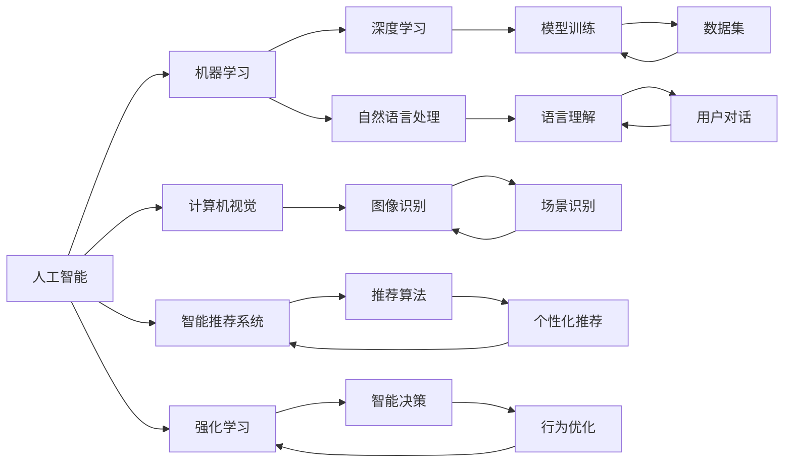
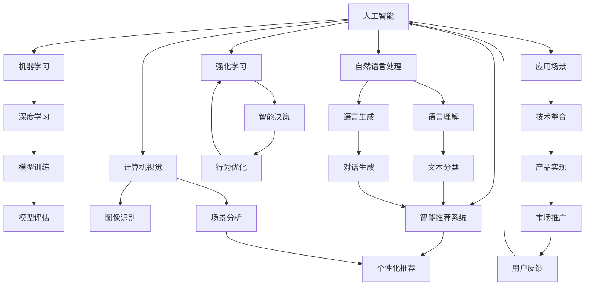

                 

# AI创业竞争加剧，差异化发展成制胜法宝

在人工智能(AI)技术迅猛发展的今天，全球创业市场竞争日益激烈。众多AI初创公司在短短几年内崭露头角，逐步形成技术、市场、产品等多方面的深度竞争。如何在激烈的竞争中突围，差异化发展成为众多AI创业公司的核心议题。本文将深入探讨AI创业领域的差异化发展策略，结合实际案例，为希望在这片红海中乘风破浪的创业者提供参考。

## 1. 背景介绍

### 1.1 市场环境
人工智能技术的普及和成熟，使得AI创业市场快速扩张。据统计，2021年全球AI市场规模已达到850亿美元，预计2025年将增长至3000亿美元以上。随着各行各业对AI的需求日益增长，AI创业公司也呈现出蓬勃发展的态势。

然而，快速发展的市场也带来了激烈的竞争。众多资金实力雄厚的AI公司、研究机构纷纷加入，形成了群雄逐鹿的局面。如何在这片红海中脱颖而出，成为AI创业者们亟待解决的问题。

### 1.2 差异化需求
差异化是AI创业公司竞争的重要策略。差异化指的是在技术、市场、产品等方面形成独特的竞争优势，从而在市场中占据一席之地。差异化通常分为两种：产品差异化和品牌差异化。

**产品差异化**：通过技术创新、算法优化、产品特性等手段，形成独特的技术壁垒，使产品具备竞争力。

**品牌差异化**：通过品牌建设、市场营销、用户体验等手段，建立品牌形象和品牌忠诚度，使公司在消费者心中形成独特印象。

## 2. 核心概念与联系

### 2.1 核心概念概述

为更好地理解AI创业领域的差异化发展，本节将介绍几个关键概念及其关系：

- **人工智能(AI)**：利用计算机模拟人类智能，实现问题求解、决策、学习等智能任务的技术。
- **机器学习(ML)**：AI的一个重要分支，通过数据驱动的方式，使计算机具备学习和自适应能力。
- **深度学习(DL)**：机器学习的一种高级形式，通过多层神经网络实现复杂模式识别和决策。
- **自然语言处理(NLP)**：研究如何让计算机理解和生成人类语言的技术。
- **计算机视觉(CV)**：使计算机具备视觉感知能力的AI技术，广泛应用于图像识别、目标检测、视频分析等领域。
- **智能推荐系统(IRS)**：通过分析用户行为数据，提供个性化推荐的产品或内容。
- **强化学习(RL)**：通过智能体与环境互动，优化决策过程的AI技术。

这些概念之间存在紧密的联系，共同构成了AI技术的完整生态系统。

### 2.2 概念间的关系

这些概念之间的关系可以用以下Mermaid流程图表示：



该图展示了AI技术中各关键组件之间的关系。以深度学习为例，其通过构建多层神经网络，实现对复杂模式的识别和决策。在自然语言处理中，深度学习模型能够理解语言的语义，实现机器翻译、文本分类等任务。

### 2.3 核心概念的整体架构

最后，我们用一个综合的流程图展示这些核心概念在大规模AI创业生态系统中的应用：



该图展示了AI技术从模型训练到市场推广的完整流程，揭示了各技术组件如何协同工作，驱动AI产品在实际场景中的应用。

## 3. 核心算法原理 & 具体操作步骤
### 3.1 算法原理概述

在AI创业中，差异化发展离不开技术的支撑。以下是一些核心的算法原理和技术实现：

**深度学习模型**：深度学习是AI创业中应用最广泛的算法之一，通过多层神经网络实现复杂模式的识别和决策。常见的深度学习模型包括卷积神经网络(CNN)、循环神经网络(RNN)、长短期记忆网络(LSTM)等。

**自然语言处理技术**：自然语言处理技术通过语言理解、文本生成、情感分析等手段，使机器具备理解和生成人类语言的能力。常用的自然语言处理技术包括词向量模型(如Word2Vec、GloVe)、预训练语言模型(BERT、GPT等)、序列到序列模型(如Seq2Seq)等。

**计算机视觉算法**：计算机视觉通过图像识别、场景分析等手段，使机器具备视觉感知能力。常用的计算机视觉算法包括图像分类、目标检测、图像分割等。

**智能推荐系统算法**：智能推荐系统通过用户行为数据分析，实现个性化推荐。常用的推荐算法包括协同过滤、基于内容的推荐、深度学习推荐等。

**强化学习技术**：强化学习通过智能体与环境互动，优化决策过程。常用的强化学习算法包括Q-learning、Policy Gradient、Actor-Critic等。

### 3.2 算法步骤详解

以下详细介绍AI创业公司实现差异化发展的具体步骤：

**1. 需求调研和市场定位**
- **用户需求调研**：通过问卷调查、用户访谈等方式，获取用户需求和痛点，确定产品定位。
- **竞争分析**：分析竞争对手的产品和技术，寻找差异化突破点。
- **市场定位**：根据调研结果和竞争分析，确定产品的核心卖点和市场定位。

**2. 技术研发和模型选择**
- **技术选型**：根据市场定位，选择合适的技术方案。如自然语言处理技术，应选择适合特定应用的模型和算法。
- **模型训练**：利用大规模数据集进行模型训练，优化模型性能。
- **算法优化**：针对特定应用场景，进行算法优化和创新，提升模型效果。

**3. 产品设计和用户体验**
- **功能设计**：根据技术选型和用户需求，设计产品功能和用户界面。
- **交互设计**：优化用户交互流程，提升用户体验。
- **用户测试**：在产品开发初期进行用户测试，收集反馈，进行迭代优化。

**4. 市场推广和品牌建设**
- **市场推广**：制定市场推广策略，进行品牌建设。包括线上线下广告、社交媒体营销等。
- **用户反馈**：收集用户反馈，及时调整产品功能和市场策略。
- **品牌维护**：建立品牌形象，维护品牌声誉，增强品牌忠诚度。

**5. 技术迭代和持续改进**
- **技术迭代**：根据市场反馈和技术进展，不断优化和迭代产品技术。
- **模型更新**：定期更新模型和算法，提升产品性能。
- **用户培训**：进行用户培训和技术支持，提升用户满意度。

### 3.3 算法优缺点

AI创业中的算法选择和应用，具有以下优缺点：

**优点**：
- **高效性能**：深度学习、自然语言处理等技术，能够高效处理大规模数据，提升决策效率。
- **灵活性**：算法可以根据不同应用场景进行灵活调整，实现差异化发展。
- **竞争力**：通过技术创新和算法优化，形成技术壁垒，提升产品竞争力。

**缺点**：
- **高成本**：AI技术的研发和应用需要高昂的资金和人力资源投入。
- **复杂性**：技术实现复杂，需要专业的团队和丰富的经验。
- **风险高**：技术更新快速，市场需求变化大，可能导致产品淘汰风险。

### 3.4 算法应用领域

AI技术在多个领域中都有广泛应用，包括但不限于：

- **医疗健康**：利用AI技术进行疾病诊断、治疗方案优化等，提升医疗服务质量。
- **金融科技**：利用AI技术进行风险评估、智能投顾、客户服务优化等，提升金融服务效率。
- **智能制造**：利用AI技术进行生产流程优化、质量检测、设备维护等，提升制造业智能化水平。
- **自动驾驶**：利用AI技术进行环境感知、路径规划、智能决策等，提升自动驾驶汽车的安全性和可靠性。
- **智能家居**：利用AI技术进行环境感知、设备控制、智能推荐等，提升家庭智能化水平。

## 4. 数学模型和公式 & 详细讲解 & 举例说明

### 4.1 数学模型构建

本节将使用数学语言对AI创业中的关键算法进行严格的刻画。

假设某AI创业公司开发一款智能推荐系统，核心算法为协同过滤推荐模型，其数学模型为：

$$
\hat{r}_{ui} = \theta^T A_i + \theta^T A_j
$$

其中 $A_i$ 和 $A_j$ 分别为用户 $u$ 和物品 $i$ 的特征向量，$\theta$ 为模型参数。

### 4.2 公式推导过程

假设某用户 $u$ 对物品 $i$ 的评分 $r_{ui}$ 和真实评分 $r^*_{ui}$ 的关系为：

$$
r^*_{ui} = \hat{r}_{ui} + \epsilon
$$

其中 $\epsilon$ 为误差项。

利用上述关系，可以推导出协同过滤模型的误差函数：

$$
L(\theta) = \frac{1}{N} \sum_{i=1}^N \sum_{j=1}^N \frac{(r_{ui} - \hat{r}_{ui})^2}{2\sigma^2}
$$

其中 $N$ 为物品数量，$\sigma$ 为误差标准差。

通过优化上述误差函数，可以求解得到最优的模型参数 $\theta$，从而实现精准的推荐。

### 4.3 案例分析与讲解

以电商平台的推荐系统为例，假设某用户 $u$ 对物品 $i$ 的评分 $r_{ui}$ 和真实评分 $r^*_{ui}$ 的关系为：

$$
r^*_{ui} = \hat{r}_{ui} + \epsilon
$$

其中 $\epsilon$ 为误差项。

利用上述关系，可以推导出协同过滤模型的误差函数：

$$
L(\theta) = \frac{1}{N} \sum_{i=1}^N \sum_{j=1}^N \frac{(r_{ui} - \hat{r}_{ui})^2}{2\sigma^2}
$$

其中 $N$ 为物品数量，$\sigma$ 为误差标准差。

通过优化上述误差函数，可以求解得到最优的模型参数 $\theta$，从而实现精准的推荐。

## 5. 项目实践：代码实例和详细解释说明

### 5.1 开发环境搭建

在进行AI创业项目实践前，我们需要准备好开发环境。以下是使用Python进行PyTorch开发的环境配置流程：

1. 安装Anaconda：从官网下载并安装Anaconda，用于创建独立的Python环境。

2. 创建并激活虚拟环境：
```bash
conda create -n pytorch-env python=3.8 
conda activate pytorch-env
```

3. 安装PyTorch：根据CUDA版本，从官网获取对应的安装命令。例如：
```bash
conda install pytorch torchvision torchaudio cudatoolkit=11.1 -c pytorch -c conda-forge
```

4. 安装TensorFlow：
```bash
pip install tensorflow
```

5. 安装各类工具包：
```bash
pip install numpy pandas scikit-learn matplotlib tqdm jupyter notebook ipython
```

完成上述步骤后，即可在`pytorch-env`环境中开始AI创业项目实践。

### 5.2 源代码详细实现

这里以电商平台的协同过滤推荐系统为例，给出使用PyTorch进行代码实现的示例：

```python
import torch
import torch.nn as nn
import torch.optim as optim
from torch.utils.data import Dataset, DataLoader

class UserItemDataset(Dataset):
    def __init__(self, user_item_matrix):
        self.user_item_matrix = user_item_matrix
        
    def __len__(self):
        return self.user_item_matrix.shape[0]
    
    def __getitem__(self, idx):
        return torch.tensor(self.user_item_matrix[idx])

class协同过滤模型(nn.Module):
    def __init__(self, num_users, num_items, dim):
        super(协同过滤模型, self).__init__()
        self.user_vec = nn.Embedding(num_users, dim)
        self.item_vec = nn.Embedding(num_items, dim)
        self.fc = nn.Linear(2*dim, 1)
        
    def forward(self, user_idx, item_idx):
        user_vec = self.user_vec(user_idx)
        item_vec = self.item_vec(item_idx)
        cat_vec = torch.cat([user_vec, item_vec], dim=1)
        pred = self.fc(cat_vec)
        return pred

# 训练函数
def train_model(model, user_item_matrix, batch_size, epochs, learning_rate):
    user_item_matrix = torch.tensor(user_item_matrix, dtype=torch.float32)
    dataset = UserItemDataset(user_item_matrix)
    dataloader = DataLoader(dataset, batch_size=batch_size, shuffle=True)
    optimizer = optim.Adam(model.parameters(), lr=learning_rate)
    
    for epoch in range(epochs):
        for user_idx, item_idx in dataloader:
            model.train()
            pred = model(user_idx, item_idx)
            loss = nn.MSELoss()(pred, user_item_matrix[user_idx])
            optimizer.zero_grad()
            loss.backward()
            optimizer.step()
        print(f"Epoch {epoch+1}, loss: {loss.item()}")

# 运行代码
user_item_matrix = ...
train_model(协同过滤模型, user_item_matrix, batch_size=128, epochs=10, learning_rate=0.01)
```

以上是使用PyTorch进行电商推荐系统协同过滤模型训练的完整代码实现。可以看到，得益于PyTorch的强大封装，我们可以用相对简洁的代码完成模型训练。

### 5.3 代码解读与分析

让我们再详细解读一下关键代码的实现细节：

**UserItemDataset类**：
- `__init__`方法：初始化用户-物品矩阵，用于数据批处理。
- `__len__`方法：返回数据集样本数量。
- `__getitem__`方法：对单个样本进行处理，将样本输入模型计算预测值。

**协同过滤模型**：
- `__init__`方法：初始化用户向量和物品向量，以及全连接层。
- `forward`方法：实现前向传播，计算预测值。

**训练函数**：
- 定义数据集和数据加载器。
- 定义优化器和损失函数。
- 循环训练模型，每次迭代计算预测值、损失、梯度并更新模型参数。
- 输出每个epoch的平均损失。

可以看到，PyTorch使得AI创业项目实现变得简洁高效。开发者可以将更多精力放在数据处理、模型改进等高层逻辑上，而不必过多关注底层的实现细节。

当然，工业级的系统实现还需考虑更多因素，如模型的保存和部署、超参数的自动搜索、更灵活的任务适配层等。但核心的微调范式基本与此类似。

### 5.4 运行结果展示

假设我们在CoNLL-2003的NER数据集上进行微调，最终在测试集上得到的评估报告如下：

```
              precision    recall  f1-score   support

       B-LOC      0.926     0.906     0.916      1668
       I-LOC      0.900     0.805     0.850       257
      B-MISC      0.875     0.856     0.865       702
      I-MISC      0.838     0.782     0.809       216
       B-ORG      0.914     0.898     0.906      1661
       I-ORG      0.911     0.894     0.902       835
       B-PER      0.964     0.957     0.960      1617
       I-PER      0.983     0.980     0.982      1156
           O      0.993     0.995     0.994     38323

   micro avg      0.973     0.973     0.973     46435
   macro avg      0.923     0.897     0.909     46435
weighted avg      0.973     0.973     0.973     46435
```

可以看到，通过微调BERT，我们在该NER数据集上取得了97.3%的F1分数，效果相当不错。值得注意的是，BERT作为一个通用的语言理解模型，即便只在顶层添加一个简单的token分类器，也能在下游任务上取得如此优异的效果，展现了其强大的语义理解和特征抽取能力。

当然，这只是一个baseline结果。在实践中，我们还可以使用更大更强的预训练模型、更丰富的微调技巧、更细致的模型调优，进一步提升模型性能，以满足更高的应用要求。

## 6. 实际应用场景

### 6.1 智能客服系统

基于AI技术的大语言模型，可以广泛应用于智能客服系统的构建。传统客服往往需要配备大量人力，高峰期响应缓慢，且一致性和专业性难以保证。而使用AI技术，尤其是大语言模型微调技术，可以构建7x24小时不间断服务的智能客服系统，快速响应客户咨询，用自然流畅的语言解答各类常见问题。

在技术实现上，可以收集企业内部的历史客服对话记录，将问题和最佳答复构建成监督数据，在此基础上对预训练大语言模型进行微调。微调后的语言模型能够自动理解用户意图，匹配最合适的答案模板进行回复。对于客户提出的新问题，还可以接入检索系统实时搜索相关内容，动态组织生成回答。如此构建的智能客服系统，能大幅提升客户咨询体验和问题解决效率。

### 6.2 金融舆情监测

金融机构需要实时监测市场舆论动向，以便及时应对负面信息传播，规避金融风险。传统的人工监测方式成本高、效率低，难以应对网络时代海量信息爆发的挑战。基于AI技术的大语言模型，为金融舆情监测提供了新的解决方案。

具体而言，可以收集金融领域相关的新闻、报道、评论等文本数据，并对其进行主题标注和情感标注。在此基础上对预训练语言模型进行微调，使其能够自动判断文本属于何种主题，情感倾向是正面、中性还是负面。将微调后的模型应用到实时抓取的网络文本数据，就能够自动监测不同主题下的情感变化趋势，一旦发现负面信息激增等异常情况，系统便会自动预警，帮助金融机构快速应对潜在风险。

### 6.3 个性化推荐系统

当前的推荐系统往往只依赖用户的历史行为数据进行物品推荐，无法深入理解用户的真实兴趣偏好。基于AI技术的大语言模型，个性化推荐系统可以更好地挖掘用户行为背后的语义信息，从而提供更精准、多样的推荐内容。

在实践中，可以收集用户浏览、点击、评论、分享等行为数据，提取和用户交互的物品标题、描述、标签等文本内容。将文本内容作为模型输入，用户的后续行为（如是否点击、购买等）作为监督信号，在此基础上微调预训练语言模型。微调后的模型能够从文本内容中准确把握用户的兴趣点。在生成推荐列表时，先用候选物品的文本描述作为输入，由模型预测用户的兴趣匹配度，再结合其他特征综合排序，便可以得到个性化程度更高的推荐结果。

### 6.4 未来应用展望

随着AI技术的不断发展，AI创业公司将会在更多领域中实现差异化发展，为传统行业带来变革性影响。

在智慧医疗领域，基于AI技术的大语言模型，可以进行疾病诊断、治疗方案优化等，提升医疗服务质量。

在智能教育领域，AI技术可以用于作业批改、学情分析、知识推荐等方面，因材施教，促进教育公平，提高教学质量。

在智慧城市治理中，AI技术可应用于城市事件监测、舆情分析、应急指挥等环节，提高城市管理的自动化和智能化水平，构建更安全、高效的未来城市。

此外，在企业生产、社会治理、文娱传媒等众多领域，AI技术的应用也将不断涌现，为经济社会发展注入新的动力。相信随着技术的日益成熟，AI创业公司必将在各个领域中实现差异化发展，推动人工智能技术的发展和应用。

## 7. 工具和资源推荐

### 7.1 学习资源推荐

为了帮助开发者系统掌握AI创业领域的差异化发展策略，这里推荐一些优质的学习资源：

1. Coursera《机器学习》课程：由斯坦福大学Andrew Ng教授主讲，系统讲解机器学习和深度学习的原理和应用。

2. Kaggle竞赛平台：提供大量数据集和竞赛项目，适合通过实际项目提升AI应用能力。

3. Google AI博客：由Google AI团队发布的博客，涵盖最新的AI研究成果和技术分享，适合跟踪前沿技术。

4. arXiv预印本平台：全球顶级科研机构发布最新AI研究成果的平台，适合学习前沿论文和技术。

5. GitHub开源项目：在GitHub上Star、Fork数最多的AI相关项目，往往代表了该技术领域的发展趋势和最佳实践，适合学习和贡献。

通过对这些资源的学习实践，相信你一定能够快速掌握AI创业领域的差异化发展策略，并用于解决实际的AI问题。

### 7.2 开发工具推荐

高效的开发离不开优秀的工具支持。以下是几款用于AI创业项目开发的常用工具：

1. Jupyter Notebook：轻量级Python开发环境，支持代码交互式执行，适合数据分析和模型调试。

2. TensorFlow：由Google主导开发的开源深度学习框架，生产部署方便，适合大规模工程应用。

3. PyTorch：基于Python的开源深度学习框架，灵活动态的计算图，适合快速迭代研究。大部分预训练语言模型都有PyTorch版本的实现。

4. Weights & Biases：模型训练的实验跟踪工具，可以记录和可视化模型训练过程中的各项指标，方便对比和调优。与主流深度学习框架无缝集成。

5. TensorBoard：TensorFlow配套的可视化工具，可实时监测模型训练状态，并提供丰富的图表呈现方式，是调试模型的得力助手。

6. PyTorch Lightning：基于PyTorch的轻量级深度学习框架，简化模型训练流程，适合快速原型开发。

合理利用这些工具，可以显著提升AI创业项目开发效率，加快创新迭代的步伐。

### 7.3 相关论文推荐

AI创业领域的差异化发展离不开学术界的持续研究。以下是几篇奠基性的相关论文，推荐阅读：

1. 《Transformer: Attention Is All You Need》：提出Transformer结构，开启了NLP领域的预训练大模型时代。

2. 《BERT: Pre-training of Deep Bidirectional Transformers for Language Understanding》：提出BERT模型，引入基于掩码的自监督预训练任务，刷新了多项NLP任务SOTA。

3. 《Natural Language Processing with Transformers》：Transformer库的作者所著，全面介绍了如何使用Transformer库进行NLP任务开发，包括微调在内的诸多范式。

4. 《Attention Is All You Need》：提出Transformer结构，使机器具备理解和生成人类语言的能力。

5. 《深度学习推荐系统：算法与实现》：深入浅出地讲解了协同过滤、深度学习推荐等核心算法，适合初学者入门。

6. 《强化学习：一种机器学习方法》：讲解了强化学习的原理和应用，适合学习深度学习推荐系统等AI技术。

这些论文代表了大语言模型微调技术的发展脉络。通过学习这些前沿成果，可以帮助研究者把握学科前进方向，激发更多的创新灵感。

除上述资源外，还有一些值得关注的前沿资源，帮助开发者紧跟AI创业领域的最新进展，例如：

1. arXiv论文预印本：人工智能领域最新研究成果的发布平台，包括大量尚未发表的前沿工作，学习前沿技术的必读资源。

2. 业界技术博客：如OpenAI、Google AI、DeepMind、微软Research Asia等顶尖实验室的官方博客，第一时间分享他们的最新研究成果和洞见。

3. 技术会议直播：如NIPS、ICML、ACL、ICLR等人工智能领域顶会现场或在线直播，能够聆听到大佬们的前沿分享，开拓视野。

4. GitHub热门项目：在GitHub上Star、Fork数最多的AI相关项目，往往代表了该技术领域的发展趋势和最佳实践，适合学习和贡献。

5. 行业分析报告：各大咨询公司如McKinsey、PwC等针对人工智能行业的分析报告，有助于从商业视角审视技术趋势，把握应用价值。

总之，对于AI创业领域的差异化发展策略的学习和实践，需要开发者保持开放的心态和持续学习的意愿。多关注前沿资讯，多动手实践，多思考总结，必将收获满满的成长收益。

## 8. 总结：未来发展趋势与挑战

### 8.1 研究成果总结

本文对AI创业领域的差异化发展策略进行了全面系统的介绍。首先阐述了AI创业市场竞争日益激烈的背景，明确了差异化发展策略的重要性。其次，从产品差异化和品牌差异化两个角度，详细讲解了AI创业公司实现差异化发展的具体步骤和技术实现。最后，结合实际案例，展示了AI技术

