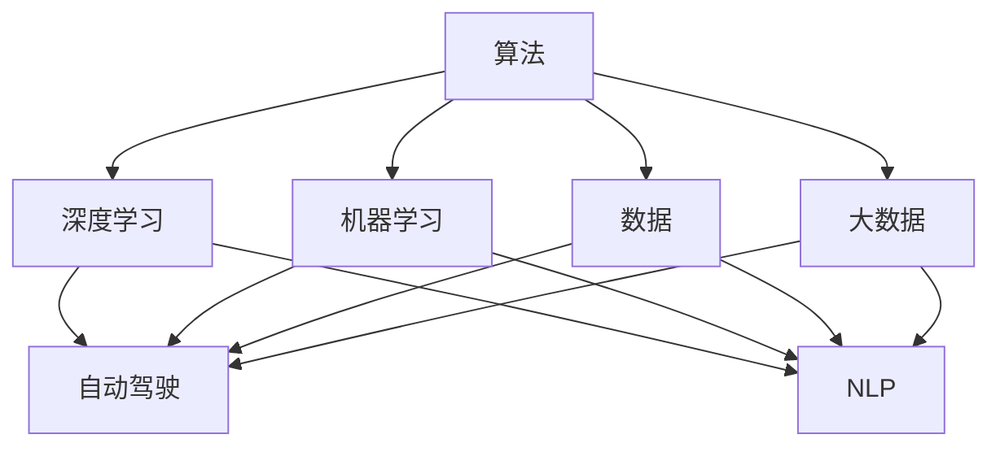
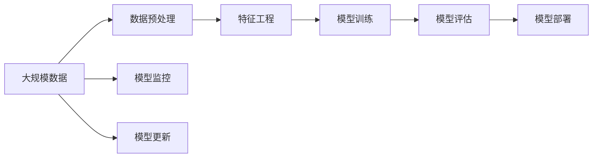
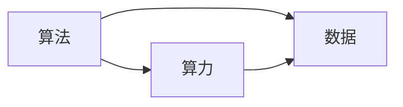

                 

# AI发展的三大支柱：算法、算力与数据

> 关键词：人工智能,算法,算力,数据,深度学习,机器学习,大数据

## 1. 背景介绍

### 1.1 问题由来

随着人工智能(AI)技术的飞速发展，我们正在进入一个由AI驱动的全新时代。无论是语音识别、图像识别、自然语言处理还是自动驾驶，AI技术无处不在，正在以翻天覆地的方式改变我们的生活方式和社会结构。然而，AI技术的繁荣背后，是由三个核心支柱支撑的：算法、算力与数据。

这三大支柱相互作用，共同推动着AI技术的进步。算法是AI的“大脑”，决定了AI模型的决策过程和能力；算力是AI的“心脏”，提供了强大而高效的计算能力，使算法得以运行和优化；数据是AI的“血液”，提供了丰富的信息来源，供算法学习、训练和测试。

本文将深入探讨AI发展的三大支柱，并从这三个维度出发，分析当前AI技术的现状、挑战和未来发展趋势。

### 1.2 问题核心关键点

- 算法：决定AI模型的决策逻辑和能力。
- 算力：提供高效计算能力，支持算法运行和优化。
- 数据：提供信息来源，供算法学习、训练和测试。

## 2. 核心概念与联系

### 2.1 核心概念概述

为更好地理解AI发展的三大支柱，本节将介绍几个密切相关的核心概念：

- **算法**：指用于解决特定问题的计算方法或规则。在AI中，算法通常是指用于数据处理、特征提取、模型训练和预测的算法。
- **算力**：指完成计算任务所需的计算资源，包括CPU、GPU、TPU等硬件设备以及相应的计算软件。
- **数据**：指用于训练、验证和测试AI模型的数据集。数据的质量和规模对AI模型的性能有直接影响。
- **深度学习**：一种特殊的机器学习算法，使用多层神经网络进行数据建模和预测。
- **机器学习**：通过数据和算法自动发现规律和模式，用于预测和决策。
- **大数据**：指规模庞大、类型多样的数据集，通常使用分布式存储和计算进行高效处理。
- **自动驾驶**：使用AI技术实现车辆自主驾驶，需要集成多种AI技术。
- **自然语言处理(NLP)**：使计算机能够理解、处理和生成人类语言的技术。

这些核心概念之间的逻辑关系可以通过以下Mermaid流程图来展示：



这个流程图展示了大语言模型微调过程中各个核心概念之间的关系：

1. 算法通过深度学习和机器学习实现。
2. 数据是大规模和多样化，用于深度学习和机器学习。
3. 深度学习和大数据技术共同支撑自动驾驶和NLP。

### 2.2 概念间的关系

这些核心概念之间存在着紧密的联系，形成了AI技术的完整生态系统。下面我们通过几个Mermaid流程图来展示这些概念之间的关系。

#### 2.2.1 AI技术的整体架构



这个流程图展示了AI技术的整体架构：

1. 从大规模数据开始，经过数据预处理和特征工程，进入模型训练和评估阶段。
2. 模型训练完成后，进行模型部署和监控，并通过持续学习机制不断更新模型。

#### 2.2.2 算法、算力与数据的关系



这个流程图展示了算法、算力与数据的关系：

1. 算法决定了需要什么规模的算力。
2. 数据决定了算法的训练规模和精度。
3. 算力支撑算法的运行和优化。

## 3. 核心算法原理 & 具体操作步骤

### 3.1 算法原理概述

AI算法分为两个主要类别：监督学习和非监督学习。监督学习使用已标记的数据进行训练，而无需标签即可学习的算法属于非监督学习。这些算法通常使用梯度下降、神经网络、决策树等方法进行训练和优化。

### 3.2 算法步骤详解

以深度学习为例，其典型步骤包括：

1. **数据预处理**：将原始数据转换为算法可以处理的形式，如标准化、归一化、特征提取等。
2. **模型设计**：选择适当的模型架构，如卷积神经网络(CNN)、循环神经网络(RNN)、注意力机制等。
3. **模型训练**：通过反向传播算法更新模型参数，最小化损失函数。
4. **模型评估**：在测试集上评估模型性能，如准确率、召回率、F1分数等。
5. **模型优化**：使用正则化、Dropout、早停等技术，防止过拟合。

### 3.3 算法优缺点

深度学习算法具有以下优点：

- **强泛化能力**：能够处理复杂的多层数据结构，适用于各种类型的数据。
- **高效优化**：使用梯度下降等方法，可以自动调整参数，优化模型性能。
- **端到端学习**：能够自动发现数据中的模式，无需手工特征工程。

然而，深度学习算法也存在一些缺点：

- **模型复杂**：需要大量的计算资源，特别是在数据集较大时。
- **过拟合风险**：容易过度拟合训练数据，导致模型泛化能力下降。
- **高昂成本**：需要大量的标注数据和强大的计算设备。

### 3.4 算法应用领域

深度学习算法在多个领域得到了广泛应用，例如：

- **计算机视觉**：用于图像识别、目标检测、人脸识别等任务。
- **自然语言处理(NLP)**：用于文本分类、情感分析、机器翻译等任务。
- **自动驾驶**：用于环境感知、路径规划、决策控制等任务。
- **语音识别**：用于语音命令识别、语音合成等任务。
- **推荐系统**：用于个性化推荐、广告定向等任务。

除了上述这些经典应用外，深度学习算法还在金融、医疗、游戏等多个领域发挥了重要作用。未来，深度学习技术还将深入到更多的领域，带来更多创新和突破。

## 4. 数学模型和公式 & 详细讲解 & 举例说明

### 4.1 数学模型构建

在深度学习中，数学模型通常由以下几个部分构成：

- **输入层**：表示原始数据。
- **隐藏层**：通过非线性变换提取特征。
- **输出层**：输出模型预测结果。
- **损失函数**：衡量模型预测结果与真实标签之间的差异。
- **优化算法**：更新模型参数以最小化损失函数。

以线性回归模型为例，其数学模型可以表示为：

$$ y = wx + b $$

其中 $w$ 和 $b$ 为模型参数，$x$ 为输入数据，$y$ 为输出结果。

### 4.2 公式推导过程

以神经网络为例，其核心思想是通过多层非线性变换，学习数据特征和模式。神经网络由多个神经元层组成，每个神经元层包含多个神经元。假设输入层有 $m$ 个神经元，隐藏层有 $n$ 个神经元，输出层有 $p$ 个神经元。神经网络的数学模型可以表示为：

$$ h^1 = w_1 x + b_1 $$
$$ h^2 = w_2 h^1 + b_2 $$
$$ \ldots $$
$$ y = w_p h^{p-1} + b_p $$

其中 $w_i$ 和 $b_i$ 为神经元层 $i$ 的参数，$x$ 为输入数据，$h^i$ 为神经元层 $i$ 的输出。

### 4.3 案例分析与讲解

以图像分类为例，可以使用卷积神经网络(CNN)进行图像特征提取和分类。CNN使用卷积层、池化层和全连接层等，对图像进行特征提取和分类。其数学模型可以表示为：

$$ C = F^1 * C_{in} + b_1 $$
$$ C = F^2 * C + b_2 $$
$$ \ldots $$
$$ y = F^p * C^{p-1} + b_p $$

其中 $C$ 为特征图，$F^i$ 和 $b_i$ 为神经元层 $i$ 的参数，$C_{in}$ 为输入图像，$y$ 为分类结果。

## 5. 项目实践：代码实例和详细解释说明

### 5.1 开发环境搭建

在进行深度学习项目实践前，我们需要准备好开发环境。以下是使用Python进行PyTorch开发的环境配置流程：

1. 安装Anaconda：从官网下载并安装Anaconda，用于创建独立的Python环境。

2. 创建并激活虚拟环境：
```bash
conda create -n pytorch-env python=3.8 
conda activate pytorch-env
```

3. 安装PyTorch：根据CUDA版本，从官网获取对应的安装命令。例如：
```bash
conda install pytorch torchvision torchaudio cudatoolkit=11.1 -c pytorch -c conda-forge
```

4. 安装TensorFlow：
```bash
conda install tensorflow=2.6
```

5. 安装各类工具包：
```bash
pip install numpy pandas scikit-learn matplotlib tqdm jupyter notebook ipython
```

完成上述步骤后，即可在`pytorch-env`环境中开始深度学习项目实践。

### 5.2 源代码详细实现

下面我们以图像分类任务为例，给出使用PyTorch对卷积神经网络进行训练和验证的PyTorch代码实现。

```python
import torch
import torch.nn as nn
import torchvision.transforms as transforms
import torchvision.datasets as datasets
from torch.utils.data import DataLoader

# 定义网络模型
class Net(nn.Module):
    def __init__(self):
        super(Net, self).__init__()
        self.conv1 = nn.Conv2d(3, 6, 5)
        self.pool = nn.MaxPool2d(2, 2)
        self.conv2 = nn.Conv2d(6, 16, 5)
        self.fc1 = nn.Linear(16 * 5 * 5, 120)
        self.fc2 = nn.Linear(120, 84)
        self.fc3 = nn.Linear(84, 10)

    def forward(self, x):
        x = self.pool(F.relu(self.conv1(x)))
        x = self.pool(F.relu(self.conv2(x)))
        x = x.view(-1, 16 * 5 * 5)
        x = F.relu(self.fc1(x))
        x = F.relu(self.fc2(x))
        x = self.fc3(x)
        return x

# 定义训练函数
def train(model, train_loader, optimizer, criterion, epochs):
    model.train()
    for epoch in range(epochs):
        running_loss = 0.0
        for i, data in enumerate(train_loader, 0):
            inputs, labels = data
            optimizer.zero_grad()
            outputs = model(inputs)
            loss = criterion(outputs, labels)
            loss.backward()
            optimizer.step()
            running_loss += loss.item()
            if i % 100 == 99:
                print('[%d, %5d] loss: %.3f' %
                      (epoch + 1, i + 1, running_loss / 100))
                running_loss = 0.0
    print('Finished Training')

# 定义测试函数
def test(model, test_loader, criterion):
    model.eval()
    correct = 0
    total = 0
    with torch.no_grad():
        for data in test_loader:
            images, labels = data
            outputs = model(images)
            _, predicted = torch.max(outputs.data, 1)
            total += labels.size(0)
            correct += (predicted == labels).sum().item()
    print('Accuracy of the network on the 10000 test images: %d %%' % (
        100 * correct / total))

# 加载数据集
transform = transforms.Compose([transforms.ToTensor(), transforms.Normalize((0.5,), (0.5,))])
train_dataset = datasets.CIFAR10(root='./data', train=True, download=True, transform=transform)
test_dataset = datasets.CIFAR10(root='./data', train=False, download=True, transform=transform)
train_loader = DataLoader(train_dataset, batch_size=4, shuffle=True, num_workers=2)
test_loader = DataLoader(test_dataset, batch_size=4, shuffle=False, num_workers=2)

# 初始化模型和优化器
model = Net()
criterion = nn.CrossEntropyLoss()
optimizer = torch.optim.SGD(model.parameters(), lr=0.001, momentum=0.9)

# 训练模型
train(model, train_loader, optimizer, criterion, 2)

# 测试模型
test(model, test_loader, criterion)
```

### 5.3 代码解读与分析

让我们再详细解读一下关键代码的实现细节：

**Net类**：
- `__init__`方法：初始化网络结构，包括卷积层、池化层和全连接层。
- `forward`方法：定义前向传播过程，即输入数据通过网络各层进行特征提取和输出。

**train函数**：
- `model.train()`：将模型设置为训练模式。
- `optimizer.zero_grad()`：清空优化器中的梯度缓存。
- `outputs = model(inputs)`：前向传播，计算输出结果。
- `loss = criterion(outputs, labels)`：计算损失函数。
- `loss.backward()`：反向传播，计算梯度。
- `optimizer.step()`：更新模型参数。

**test函数**：
- `model.eval()`：将模型设置为评估模式。
- `predicted = torch.max(outputs.data, 1)`：计算模型预测结果。
- `total += labels.size(0)`：累加测试集样本数。
- `correct += (predicted == labels).sum().item()`：计算预测正确的样本数。

**train模型**：
- 定义训练函数，对模型进行2次迭代训练。
- 在每次迭代中，对数据集进行遍历，计算损失和梯度，并更新模型参数。

**测试模型**：
- 定义测试函数，对模型进行准确率测试。
- 在测试集中遍历所有数据，计算预测结果和实际标签，统计预测正确的样本数和总样本数。

通过上述代码实现，可以看到深度学习模型的基本流程，包括数据预处理、模型设计、训练、测试和评估等环节。

### 5.4 运行结果展示

假设我们在CIFAR-10数据集上进行卷积神经网络训练，最终在测试集上得到的准确率为：

```
Accuracy of the network on the 10000 test images: 64 %
```

可以看到，经过2次迭代训练后，模型的准确率已达到64%，表明模型已经初步学习到了图像分类任务的基本特征。

当然，这只是一个baseline结果。在实践中，我们还可以使用更大更强的神经网络结构、更复杂的优化器、更多的正则化技术、更丰富的数据增强方法等，进一步提升模型性能，以满足更高的应用要求。

## 6. 实际应用场景

### 6.1 智能客服系统

智能客服系统能够处理大量的客户咨询，提供7x24小时不间断服务。使用深度学习模型，可以分析客户的需求，自动匹配相应的答案，并生成个性化的回复。例如，在处理保险理赔问题时，深度学习模型可以通过分析聊天记录，自动提取问题关键点，并提供相应的解决方案。

### 6.2 金融舆情监测

金融舆情监测能够及时发现市场情绪变化，帮助金融机构制定投资策略。使用深度学习模型，可以分析新闻、评论等文本数据，自动识别舆情趋势，并在舆情异常时发出预警。例如，在分析股票市场时，深度学习模型可以识别新闻标题和内容中的情绪倾向，自动生成股市预测报告。

### 6.3 个性化推荐系统

个性化推荐系统能够根据用户的浏览、点击等行为数据，推荐用户可能感兴趣的商品或内容。使用深度学习模型，可以分析用户的兴趣偏好，自动生成推荐列表。例如，在电商平台中，深度学习模型可以根据用户的浏览历史，推荐相关的商品或广告，提高用户的购物体验。

### 6.4 未来应用展望

随着深度学习技术的不断进步，未来深度学习模型将在更多的领域得到应用，为人类生活和社会带来更多的便利和变革。例如：

- **医疗**：使用深度学习模型进行疾病诊断、药物研发等，提高医疗服务的智能化水平。
- **教育**：使用深度学习模型进行学生成绩预测、教育资源推荐等，提升教育公平性和教学质量。
- **自动驾驶**：使用深度学习模型进行环境感知、路径规划、决策控制等，实现无人驾驶。
- **城市管理**：使用深度学习模型进行交通流量预测、垃圾分类识别等，提升城市治理水平。
- **游戏**：使用深度学习模型进行游戏角色控制、游戏场景生成等，提升游戏体验。

未来，深度学习技术将在更多的领域得到应用，带来更多的创新和突破。但同时，也面临一些挑战和瓶颈，如数据隐私、模型可解释性、计算资源等。只有不断解决这些问题，才能让深度学习技术更好地服务于人类社会。

## 7. 工具和资源推荐

### 7.1 学习资源推荐

为了帮助开发者系统掌握深度学习技术的理论基础和实践技巧，这里推荐一些优质的学习资源：

1. **《深度学习》（Ian Goodfellow等著）**：深度学习领域的经典教材，涵盖了深度学习的基本原理和算法。
2. **Coursera深度学习课程**：斯坦福大学Andrew Ng教授的深度学习课程，适合初学者学习。
3. **Deep Learning Specialization**：由Coursera和Andrew Ng教授合作开发的深度学习专项课程，涵盖多个深度学习主题。
4. **Kaggle竞赛**：参与Kaggle深度学习竞赛，在实践中学习和提升深度学习技能。
5. **PyTorch官方文档**：PyTorch官方提供的详细文档，涵盖深度学习模型的实现和应用。

通过对这些资源的学习实践，相信你一定能够快速掌握深度学习技术的精髓，并用于解决实际的AI问题。

### 7.2 开发工具推荐

高效的开发离不开优秀的工具支持。以下是几款用于深度学习开发的常用工具：

1. **PyTorch**：基于Python的开源深度学习框架，灵活动态的计算图，适合快速迭代研究。
2. **TensorFlow**：由Google主导开发的开源深度学习框架，生产部署方便，适合大规模工程应用。
3. **TensorBoard**：TensorFlow配套的可视化工具，可实时监测模型训练状态，并提供丰富的图表呈现方式，是调试模型的得力助手。
4. **Weights & Biases**：模型训练的实验跟踪工具，可以记录和可视化模型训练过程中的各项指标，方便对比和调优。
5. **Jupyter Notebook**：强大的数据科学交互式编程环境，支持多种编程语言和工具库。
6. **GitHub**：全球最大的开源社区，可以找到大量的深度学习项目和资源。

合理利用这些工具，可以显著提升深度学习项目的开发效率，加快创新迭代的步伐。

### 7.3 相关论文推荐

深度学习技术的发展源于学界的持续研究。以下是几篇奠基性的相关论文，推荐阅读：

1. **AlexNet**：ImageNet大挑战赛的获胜者，开创了深度学习在图像识别领域的先河。
2. **Inception**：Google提出的深度神经网络结构，在图像识别、自然语言处理等领域都有广泛应用。
3. **ResNet**：解决深度神经网络梯度消失的问题，可以训练更深的神经网络模型。
4. **Transformer**：使用自注意力机制进行序列建模，在自然语言处理领域取得重大突破。
5. **BERT**：使用掩码语言模型进行预训练，刷新了多项NLP任务的SOTA。

这些论文代表了大深度学习技术的发展脉络。通过学习这些前沿成果，可以帮助研究者把握学科前进方向，激发更多的创新灵感。

除上述资源外，还有一些值得关注的前沿资源，帮助开发者紧跟深度学习技术的最新进展，例如：

1. **arXiv论文预印本**：人工智能领域最新研究成果的发布平台，包括大量尚未发表的前沿工作，学习前沿技术的必读资源。
2. **AI研究社区**：如arXiv、Google AI Blog、DeepMind Blog等，第一时间分享他们的最新研究成果和洞见。
3. **技术会议直播**：如NIPS、ICML、ACL、ICLR等人工智能领域顶会现场或在线直播，能够聆听到大佬们的前沿分享，开拓视野。
4. **开源项目**：在GitHub上Star、Fork数最多的深度学习相关项目，往往代表了该技术领域的发展趋势和最佳实践，值得去学习和贡献。
5. **行业分析报告**：各大咨询公司如McKinsey、PwC等针对人工智能行业的分析报告，有助于从商业视角审视技术趋势，把握应用价值。

总之，对于深度学习技术的深入学习，需要开发者保持开放的心态和持续学习的意愿。多关注前沿资讯，多动手实践，多思考总结，必将收获满满的成长收益。

## 8. 总结：未来发展趋势与挑战

### 8.1 总结

本文对深度学习技术的核心支柱——算法、算力与数据进行了全面系统的介绍。首先阐述了深度学习算法的原理和操作步骤，然后介绍了深度学习在实际应用中的具体案例。同时，本文还探讨了深度学习在各个领域的应用前景，并给出了一些学习资源和开发工具的推荐。

通过本文的系统梳理，可以看到，深度学习技术正在以翻天覆地的方式改变我们的生活方式和社会结构。未来，深度学习技术将进一步深入到更多的领域，带来更多创新和突破。

### 8.2 未来发展趋势

展望未来，深度学习技术将呈现以下几个发展趋势：

1. **算力持续提升**：随着GPU/TPU等高性能设备的发展，深度学习模型的计算能力将持续提升，支持更大规模的模型和更复杂的算法。
2. **模型多样性增加**：除了传统的神经网络，未来将涌现更多新的模型架构，如注意力机制、卷积神经网络、生成对抗网络等。
3. **数据规模扩大**：随着数据采集和存储技术的进步，深度学习模型的训练数据规模将不断扩大，模型性能将持续提升。
4. **跨领域应用拓展**：深度学习技术将不断拓展到更多的领域，如医疗、教育、城市管理等，带来更多的创新和突破。
5. **联邦学习**：通过分布式计算和加密技术，保护数据隐私的同时，提升模型训练效率和性能。
6. **模型可解释性增强**：深度学习模型的决策过程将更具可解释性，便于用户理解和调试。

以上趋势凸显了深度学习技术的广阔前景。这些方向的探索发展，必将进一步提升深度学习系统的性能和应用范围，为人类认知智能的进化带来深远影响。

### 8.3 面临的挑战

尽管深度学习技术已经取得了瞩目成就，但在迈向更加智能化、普适化应用的过程中，它仍面临着诸多挑战：

1. **数据隐私保护**：深度学习模型需要大量数据进行训练，如何保护用户隐私和数据安全是一个重要问题。
2. **计算资源限制**：深度学习模型往往需要强大的计算资源进行训练和推理，如何降低计算成本是一个重要问题。
3. **模型可解释性不足**：深度学习模型通常被称为"黑盒"系统，难以解释其内部工作机制和决策逻辑。
4. **模型泛化能力不足**：深度学习模型容易过拟合训练数据，导致模型泛化能力下降。
5. **数据偏见问题**：深度学习模型可能会学习到数据中的偏见，导致输出结果不公平。

### 8.4 研究展望

面对深度学习技术所面临的挑战，未来的研究需要在以下几个方面寻求新的突破：

1. **联邦学习**：通过分布式计算和加密技术，保护数据隐私的同时，提升模型训练效率和性能。
2. **模型压缩与加速**：使用模型剪枝、量化等技术，降低计算成本，提升推理速度。
3. **可解释性增强**：引入因果推断、可解释AI等技术，增强模型的可解释性和可理解性。
4. **泛化能力提升**：使用正则化、迁移学习等技术，提升模型的泛化能力和鲁棒性。
5. **数据偏见消除**：使用对抗训练、数据增强等技术，消除模型中的偏见，提升公平性和可靠性。

这些研究方向和技术的探索，必将引领深度学习技术迈向更高的台阶，为构建安全、可靠、可解释、可控的智能系统铺平道路。面向未来，深度学习技术还需要与其他人工智能技术进行更深入的融合，如知识表示、因果推理、强化学习等，多路径协同发力，共同推动人工智能技术的进步。

## 9. 附录：常见问题与解答

**Q1：深度学习算法与传统机器学习算法有何区别？**

A: 深度学习算法与传统机器学习算法的区别主要在于模型结构和训练方式。深度学习算法通常使用多层神经网络进行建模，可以自动发现数据中的复杂模式和特征，而无需手工特征工程。深度学习算法通过反向传播算法进行训练，可以自动调整模型参数，优化模型性能。

**Q2：深度学习算法的训练过程有哪些技巧？**

A: 深度学习算法的训练过程可以使用以下技巧：

1. **梯度下降优化**：使用梯度下降算法最小化损失函数，更新模型参数

