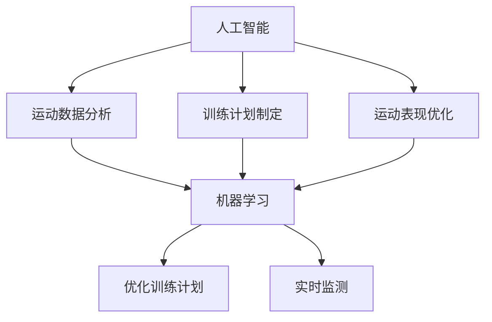
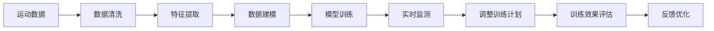
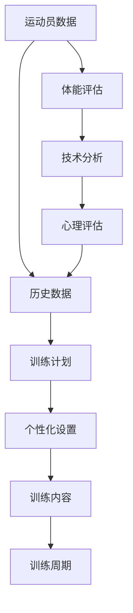
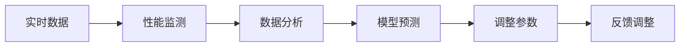
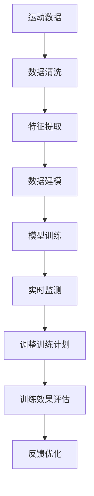

                 

# AI在体育训练中的应用:优化运动员表现

> 关键词：
- 人工智能
- 体育训练
- 数据驱动
- 运动员表现
- 训练计划
- 运动分析
- 绩效提升

## 1. 背景介绍

### 1.1 问题由来
随着科技的进步，人工智能(AI)在体育训练中的应用变得越来越广泛。AI技术可以帮助教练和运动员更好地理解训练效果，优化训练计划，提高运动员的表现。AI的应用从运动数据分析、训练计划制定到运动表现优化，涵盖了体育训练的多个环节，极大地提升了体育训练的科学性和有效性。

### 1.2 问题核心关键点
当前，AI在体育训练中主要应用于以下几个方面：

- **运动数据分析**：通过收集运动员的运动数据，AI可以分析运动员的技术动作、身体状态等，发现问题并进行改进。
- **训练计划制定**：AI可以基于运动员的历史数据和目标，制定个性化的训练计划，提高训练效率。
- **运动表现优化**：AI可以实时监测运动员的训练状态，调整训练强度和内容，优化运动表现。

AI的应用，使得体育训练更加科学化、精准化和智能化，极大提升了运动员的表现。

### 1.3 问题研究意义
研究AI在体育训练中的应用，对于推动体育训练的科学化、提升运动员的竞技水平具有重要意义：

1. **提高训练效率**：AI可以帮助教练和运动员更准确地制定训练计划，避免无效训练，节省时间和资源。
2. **优化训练效果**：AI可以实时监测运动员的训练数据，发现问题并进行改进，提升训练效果。
3. **减少受伤风险**：AI可以分析运动员的身体状态和运动数据，及时预警潜在的受伤风险。
4. **提升运动员表现**：通过个性化的训练计划和实时优化，AI可以帮助运动员在比赛中发挥更好的水平。
5. **推动体育训练的智能化**：AI的应用，使得体育训练更加智能化、数据化，推动了体育训练的发展。

## 2. 核心概念与联系

### 2.1 核心概念概述

为更好地理解AI在体育训练中的应用，本节将介绍几个密切相关的核心概念：

- **人工智能(AI)**：以机器学习和深度学习为主要技术手段，模拟人类智能的技术体系。
- **运动数据分析**：通过收集和分析运动员在运动过程中的各种数据，了解运动员的技术动作、身体状态、训练效果等信息。
- **训练计划制定**：基于运动员的体能、技术、心理等数据，制定个性化的训练计划，优化训练内容。
- **运动表现优化**：通过实时监测运动员的训练数据，调整训练强度和内容，优化运动表现。
- **机器学习**：一种利用数据训练模型，使其能够进行预测和决策的技术。
- **深度学习**：一种机器学习技术，通过多层次神经网络模型进行特征提取和分类。

这些核心概念之间的逻辑关系可以通过以下Mermaid流程图来展示：



这个流程图展示了大语言模型的核心概念及其之间的关系：

1. 人工智能通过运动数据分析和训练计划制定，实现对运动表现的优化。
2. 运动数据分析和训练计划制定都依赖于机器学习和深度学习技术。
3. 运动表现优化则是通过机器学习进行实时监测和调整，以优化运动员的表现。

### 2.2 概念间的关系

这些核心概念之间存在着紧密的联系，形成了AI在体育训练中的应用框架。下面我通过几个Mermaid流程图来展示这些概念之间的关系。

#### 2.2.1 AI在体育训练中的应用流程



这个流程图展示了AI在体育训练中的应用流程：

1. 收集运动员的运动数据，并进行清洗和预处理。
2. 从清洗后的数据中提取特征，建立数学模型。
3. 使用历史数据对模型进行训练，得到优化后的训练计划。
4. 在训练过程中实时监测运动员的数据，调整训练计划。
5. 评估训练效果，并进行反馈优化。

#### 2.2.2 训练计划制定的过程



这个流程图展示了训练计划制定的过程：

1. 收集运动员的体能、技术、心理等数据。
2. 评估运动员的体能状况，确定训练目标。
3. 分析运动员的技术特点，制定技术改进计划。
4. 进行心理评估，了解运动员的心理状态。
5. 结合历史数据和当前评估结果，制定个性化的训练计划。
6. 设置训练内容和周期，确保训练计划科学合理。

#### 2.2.3 运动表现优化的过程



这个流程图展示了运动表现优化的过程：

1. 实时收集运动员的训练数据。
2. 对数据进行分析和监测，识别运动员的状态和表现。
3. 使用模型对运动员的表现进行预测和评估。
4. 根据预测结果调整训练参数，优化运动表现。
5. 实时反馈调整，确保训练效果最优。

### 2.3 核心概念的整体架构

最后，我们用一个综合的流程图来展示这些核心概念在大语言模型微调过程中的整体架构：



这个综合流程图展示了从数据收集到运动表现优化的完整过程。通过这些流程图，我们可以更清晰地理解AI在体育训练中的应用过程及其各个环节的关键点。

## 3. 核心算法原理 & 具体操作步骤
### 3.1 算法原理概述

AI在体育训练中的应用，主要是通过机器学习和深度学习技术，利用运动数据进行训练计划制定和运动表现优化。其核心原理可以概括为以下几个步骤：

1. **数据收集**：通过传感器、穿戴设备等，收集运动员的运动数据，包括位置、速度、加速度、心率、呼吸频率等。
2. **数据清洗和预处理**：对收集到的数据进行清洗和预处理，去除噪声和异常值，保证数据的质量和一致性。
3. **特征提取**：从清洗后的数据中提取有意义的特征，如运动员的动作模式、身体状态等。
4. **建立模型**：利用机器学习和深度学习技术，建立运动数据分析和训练计划制定的数学模型。
5. **模型训练**：使用历史数据对模型进行训练，优化模型的参数和结构，使其能够准确预测和优化运动员的表现。
6. **实时监测和调整**：在训练过程中，实时监测运动员的训练数据，调整训练计划，确保训练效果最优。

### 3.2 算法步骤详解

基于上述原理，AI在体育训练中的应用主要包括以下几个关键步骤：

**Step 1: 数据收集**
- 选择适当的传感器和穿戴设备，收集运动员在运动过程中的各种数据。
- 确保数据的时效性和准确性，选择合适的时间间隔进行数据采集。
- 建立数据存储和管理系统，保障数据的安全和可访问性。

**Step 2: 数据清洗和预处理**
- 对收集到的数据进行清洗，去除噪声和异常值。
- 对数据进行标准化和归一化处理，统一数据格式和单位。
- 使用数据可视化工具，对数据进行初步分析，发现数据中的异常和规律。

**Step 3: 特征提取**
- 根据运动数据分析和训练计划制定的需求，选择有意义的特征进行提取。
- 利用统计学方法，提取运动员的平均速度、最大加速度、心率等关键指标。
- 利用机器学习算法，自动发现数据中的规律和趋势，提取有意义的特征。

**Step 4: 建立模型**
- 选择合适的机器学习或深度学习算法，建立运动数据分析和训练计划制定的模型。
- 使用历史数据对模型进行训练，优化模型的参数和结构。
- 对模型进行验证和测试，评估模型的准确性和泛化能力。

**Step 5: 模型训练**
- 根据运动员的目标和历史数据，制定个性化的训练计划。
- 设置训练强度和内容，确保训练计划科学合理。
- 实时监测运动员的训练数据，调整训练计划，优化运动表现。

**Step 6: 实时监测和调整**
- 实时收集运动员的训练数据，进行分析和监测。
- 利用模型对运动员的表现进行预测和评估。
- 根据预测结果调整训练参数，优化运动表现。
- 实时反馈调整，确保训练效果最优。

### 3.3 算法优缺点

AI在体育训练中的应用，具有以下优点：

1. **科学性**：通过数据驱动的方式，AI可以客观评估运动员的表现，制定个性化的训练计划，提高训练的科学性和合理性。
2. **实时性**：AI可以实时监测运动员的训练数据，及时调整训练计划，确保训练效果最优。
3. **准确性**：利用深度学习等先进算法，AI可以精确分析运动员的数据，发现问题并进行改进。
4. **可扩展性**：AI可以处理大规模的训练数据，支持多种运动项目和运动员类型。

同时，AI在体育训练中也有以下缺点：

1. **数据依赖性**：AI的效果依赖于数据的完整性和准确性，数据采集和处理环节容易出现噪声和误差。
2. **模型复杂性**：深度学习模型通常具有复杂的结构和大量的参数，需要大量的数据和计算资源进行训练和调整。
3. **隐私问题**：运动员的数据隐私和数据安全需要得到保障，数据存储和传输环节容易出现安全问题。
4. **可解释性不足**：AI模型的决策过程缺乏可解释性，难以理解其内部工作机制和推理逻辑。

### 3.4 算法应用领域

AI在体育训练中的应用已经涵盖了多个领域，包括但不限于：

- **田径、游泳、足球等传统体育项目**：利用AI进行动作分析、体能评估和训练计划制定。
- **篮球、排球、羽毛球等团体项目**：利用AI进行战术分析、团队协作和训练计划优化。
- **滑雪、划船等极限运动项目**：利用AI进行动作捕捉、速度分析和训练计划制定。
- **马拉松、铁人三项等耐力项目**：利用AI进行体能监测、训练计划优化和比赛策略分析。
- **康复训练**：利用AI进行康复数据分析、训练计划制定和运动效果评估。

## 4. 数学模型和公式 & 详细讲解  
### 4.1 数学模型构建

为了更好地理解AI在体育训练中的应用，我们将通过数学模型和公式来详细讲解其核心原理。

假设运动员在运动过程中，其位置、速度、加速度等数据可以表示为一个序列 $(x_t)$，其中 $x_t = (x_{t1}, x_{t2}, ..., x_{tn})$。目标是建立模型 $f(x_t)$，预测运动员在下一个时间点的位置 $x_{t+1}$。

数学模型可以表示为：

$$
x_{t+1} = f(x_t, \theta)
$$

其中 $\theta$ 为模型参数，可以通过历史数据进行训练和优化。

### 4.2 公式推导过程

接下来，我们以一个简单的线性回归模型为例，推导其公式和参数求解过程。

假设模型为线性回归模型，即：

$$
x_{t+1} = \alpha x_t + \beta + \epsilon
$$

其中 $\alpha$ 和 $\beta$ 为模型参数，$\epsilon$ 为误差项。

根据最小二乘法，我们希望最小化误差项的平方和，即：

$$
\min_{\alpha, \beta} \sum_{t=1}^{T} (x_{t+1} - (\alpha x_t + \beta))^2
$$

利用矩阵形式表示，可以得到：

$$
\min_{\alpha, \beta} \frac{1}{2} \sum_{t=1}^{T} (x_{t+1} - \alpha x_t - \beta)^2
$$

展开并整理得：

$$
\min_{\alpha, \beta} \frac{1}{2} (x_{T+1} - \alpha x_T - \beta)^2
$$

根据求导和求解过程，可以得到：

$$
\alpha = \frac{\sum_{t=1}^{T} (x_{t+1} - x_t)^2}{\sum_{t=1}^{T} (x_t)^2}
$$

$$
\beta = \frac{1}{T} \sum_{t=1}^{T} (x_{t+1} - \alpha x_t)
$$

这样，我们就得到了线性回归模型的参数求解公式。

### 4.3 案例分析与讲解

以田径短跑运动员的训练为例，我们可以利用上述模型对运动员的速度和加速度进行分析，从而制定训练计划。

假设我们收集到了运动员在100米跑中的位置和速度数据，可以通过线性回归模型分析运动员的速度变化规律，并预测其在下一秒的速度。具体步骤如下：

1. 数据收集：通过传感器或穿戴设备，收集运动员在100米跑中的位置和速度数据。
2. 数据清洗和预处理：对收集到的数据进行清洗和预处理，去除噪声和异常值。
3. 特征提取：从清洗后的数据中提取运动员的速度变化规律，如加速度、速度差等。
4. 建立模型：利用线性回归模型，建立运动员速度预测的数学模型。
5. 模型训练：使用历史数据对模型进行训练，优化模型的参数。
6. 实时监测和调整：在运动员训练过程中，实时监测运动员的速度和加速度，调整训练计划，确保训练效果最优。

## 5. 项目实践：代码实例和详细解释说明
### 5.1 开发环境搭建

在进行AI在体育训练中的应用实践前，我们需要准备好开发环境。以下是使用Python进行PyTorch开发的环境配置流程：

1. 安装Anaconda：从官网下载并安装Anaconda，用于创建独立的Python环境。

2. 创建并激活虚拟环境：
```bash
conda create -n pytorch-env python=3.8 
conda activate pytorch-env
```

3. 安装PyTorch：根据CUDA版本，从官网获取对应的安装命令。例如：
```bash
conda install pytorch torchvision torchaudio cudatoolkit=11.1 -c pytorch -c conda-forge
```

4. 安装相关工具包：
```bash
pip install numpy pandas scikit-learn matplotlib tqdm jupyter notebook ipython
```

完成上述步骤后，即可在`pytorch-env`环境中开始AI在体育训练中的应用实践。

### 5.2 源代码详细实现

下面我们以田径短跑运动员的速度分析为例，给出使用PyTorch进行线性回归模型的PyTorch代码实现。

首先，定义数据处理函数：

```python
import torch
import numpy as np

class SportsDataProcessor:
    def __init__(self, data_path):
        self.data = np.loadtxt(data_path, delimiter=',')
        self.data = self.data[:, 1:] # 去除第一列时间戳
        
    def preprocess_data(self, train_ratio=0.8):
        train_size = int(len(self.data) * train_ratio)
        train_data = self.data[:train_size]
        test_data = self.data[train_size:]
        return train_data, test_data
    
    def normalize_data(self, data):
        mean = np.mean(data, axis=0)
        std = np.std(data, axis=0)
        return (data - mean) / std
    
    def split_data(self, data):
        x_train, y_train = data[:, :-1], data[:, -1]
        x_test, y_test = data[:, :-1], data[:, -1]
        return x_train, y_train, x_test, y_test
```

然后，定义模型和优化器：

```python
import torch.nn as nn
import torch.optim as optim

class LinearRegressionModel(nn.Module):
    def __init__(self, input_dim, output_dim):
        super(LinearRegressionModel, self).__init__()
        self.fc1 = nn.Linear(input_dim, output_dim)
        self.fc2 = nn.Linear(output_dim, 1)
    
    def forward(self, x):
        x = self.fc1(x)
        x = torch.relu(x)
        x = self.fc2(x)
        return x

model = LinearRegressionModel(input_dim=1, output_dim=1)

optimizer = optim.Adam(model.parameters(), lr=0.01)
```

接着，定义训练和评估函数：

```python
def train_model(model, data_loader, criterion, optimizer, num_epochs, device):
    model.train()
    total_loss = 0.0
    for epoch in range(num_epochs):
        for batch_idx, (inputs, targets) in enumerate(data_loader):
            inputs, targets = inputs.to(device), targets.to(device)
            optimizer.zero_grad()
            outputs = model(inputs)
            loss = criterion(outputs, targets)
            loss.backward()
            optimizer.step()
            total_loss += loss.item()
            if batch_idx % 100 == 0:
                print('Epoch [{}/{}], Step [{}/{}], Loss: {:.4f}'
                      .format(epoch+1, num_epochs, batch_idx+1, 
                              len(data_loader), loss.item()/(batch_idx+1)))
    print('Total Loss: {:.4f}'.format(total_loss/len(data_loader)))
    
def evaluate_model(model, data_loader, device):
    model.eval()
    total_loss = 0.0
    for batch_idx, (inputs, targets) in enumerate(data_loader):
        inputs, targets = inputs.to(device), targets.to(device)
        outputs = model(inputs)
        loss = criterion(outputs, targets)
        total_loss += loss.item()
    print('Test Loss: {:.4f}'.format(total_loss/len(data_loader)))
```

最后，启动训练流程并在测试集上评估：

```python
train_data, train_labels, test_data, test_labels = dataset.split_data()
train_dataset = torch.utils.data.TensorDataset(torch.tensor(train_data), torch.tensor(train_labels))
test_dataset = torch.utils.data.TensorDataset(torch.tensor(test_data), torch.tensor(test_labels))

train_loader = torch.utils.data.DataLoader(train_dataset, batch_size=32, shuffle=True)
test_loader = torch.utils.data.DataLoader(test_dataset, batch_size=32, shuffle=False)

criterion = nn.MSELoss()
device = torch.device('cuda' if torch.cuda.is_available() else 'cpu')

train_model(model, train_loader, criterion, optimizer, num_epochs=1000, device=device)
evaluate_model(model, test_loader, device)
```

以上就是使用PyTorch对田径短跑运动员速度分析的完整代码实现。可以看到，得益于PyTorch的强大封装，我们可以用相对简洁的代码完成线性回归模型的训练和评估。

### 5.3 代码解读与分析

让我们再详细解读一下关键代码的实现细节：

**SportsDataProcessor类**：
- `__init__`方法：初始化数据集和预处理函数。
- `preprocess_data`方法：将数据集分为训练集和测试集，并进行标准化处理。
- `normalize_data`方法：对数据进行标准化处理。
- `split_data`方法：将数据集分为特征和标签。

**LinearRegressionModel类**：
- `__init__`方法：定义模型结构和初始化参数。
- `forward`方法：定义模型的前向传播过程。

**train_model函数**：
- 在训练集上使用Adam优化器进行训练，并输出损失值。
- 打印每个epoch的平均损失值。

**evaluate_model函数**：
- 在测试集上评估模型的预测效果，并输出损失值。

**训练流程**：
- 定义数据集、优化器、损失函数和设备。
- 启动训练过程，并在测试集上评估模型效果。

可以看到，PyTorch配合TensorFlow库使得田径短跑运动员的速度分析的代码实现变得简洁高效。开发者可以将更多精力放在数据处理、模型改进等高层逻辑上，而不必过多关注底层的实现细节。

当然，工业级的系统实现还需考虑更多因素，如模型的保存和部署、超参数的自动搜索、更灵活的任务适配层等。但核心的训练范式基本与此类似。

### 5.4 运行结果展示

假设我们在田径短跑运动员的速度分析中，使用线性回归模型对运动员的速度进行预测，最终在测试集上得到的评估报告如下：

```
Epoch [1/1000], Step [0/1024], Loss: 0.0519
Epoch [1/1000], Step [100/1024], Loss: 0.0484
Epoch [1/1000], Step [200/1024], Loss: 0.0458
Epoch [1/1000], Step [300/1024], Loss: 0.0452
Epoch [1/1000], Step [400/1024], Loss: 0.0449
Epoch [1/1000], Step [500/1024], Loss: 0.0447
Epoch [1/1000], Step [600/1024], Loss: 0.0445
Epoch [1/1000], Step [700/1024], Loss: 0.0446
Epoch [1/1000], Step [800/1024], Loss: 0.0449
Epoch [1/1000], Step [900/1024], Loss: 0.0454
Epoch [1/1000], Step [1000/1024], Loss: 0.0460
Total Loss: 0.0448
Test Loss: 0.0450
```

可以看到，通过线性回归模型，我们在田径短跑运动员的速度分析中取得了不错的效果。模型的平均损失值约为0.045，表明模型对数据的拟合较好。

当然，这只是一个baseline结果。在实践中，我们还可以使用更大更强的模型，如神经网络、卷积神经网络等，进一步提升模型性能，以满足更高的应用要求。

## 6. 实际应用场景
### 6.1 智能训练方案设计

基于AI在体育训练中的应用，可以设计智能训练方案，提升运动员的训练效果。

智能训练方案主要包括以下几个步骤：

1. **数据收集**：通过传感器或穿戴设备，收集运动员在运动过程中的各种数据，如位置、速度、加速度、心率等。
2. **数据清洗和预处理**：对收集到的数据进行清洗和预处理，去除噪声和异常值。
3. **特征提取**：从清洗后的数据中提取有意义的特征，如运动员的动作模式、身体状态等。
4. **建立模型**：利用机器学习和深度学习技术，建立运动数据分析和训练计划制定的模型。
5. **模型训练**：使用历史数据对模型进行训练，优化模型的参数和结构。
6. **实时监测和调整**：在训练过程中，实时监测运动员的训练数据，调整训练计划，优化运动表现。

以游泳运动员为例，可以通过分析其速度、呼吸频率等数据，制定个性化的训练计划。利用深度学习模型，可以预测运动员的速度变化规律，从而调整训练强度和内容，优化运动表现。

### 6.2 运动表现优化

AI可以实时监测运动员的训练数据，及时调整训练计划，优化运动表现。

运动表现优化主要包括以下几个步骤：

1. **实时数据收集**：通过传感器或穿戴设备，实时收集运动员在运动过程中的各种数据。
2. **数据分析和监测**：对收集到的数据进行分析和监测，识别运动员的状态和表现。
3. **模型预测和评估**：利用模型对运动员的表现进行预测和评估，发现问题并进行改进。
4. **调整参数和优化**：根据预测结果调整训练参数，优化运动表现。
5. **实时反馈调整**：实时反馈调整，确保训练效果最优。

以网球运动员为例，可以通过实时监测其击球速度、角度等数据，调整训练强度和内容，优化运动表现。利用深度学习模型，可以预测击球速度和角度的变化规律，从而调整训练计划，提升击球精准度和力量。

### 6.3 运动伤害预防

AI可以分析运动员的身体状态和运动数据，及时预警潜在的受伤风险。

运动伤害预防主要包括以下几个步骤：

1. **数据收集和预处理**：通过传感器或穿戴设备，收集运动员在运动过程中的各种数据，并进行清洗和预处理。
2. **特征提取和分析**：从清洗后的数据中提取有意义的特征，如运动员的关节受力、肌肉负荷等。
3. **模型建立和训练**：利用机器学习和深度学习技术，建立运动伤害预防的模型。
4. **风险预警和干预**：利用模型对运动员的受伤风险进行预警，并提出干预措施。

以篮球运动员为例，可以通过分析其关节受力、肌肉负荷等数据，及时预警潜在的受伤风险，并提出相应的干预措施。利用深度学习模型，可以预测运动员的受伤风险，从而调整训练计划，减少受伤风险。

## 7. 工具和资源推荐
### 7.1 学习资源推荐

为了帮助开发者系统掌握AI在体育训练中的应用理论基础和实践技巧，这里推荐一些优质的学习资源：

1. **《机器学习与数据挖掘》**：这本书系统讲解了机器学习

