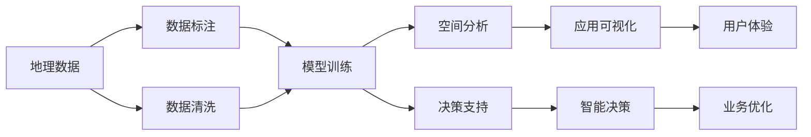
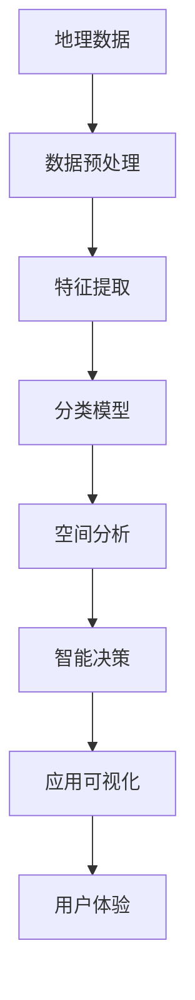

                 

## 1. 背景介绍

地理信息系统（Geographic Information System，GIS）是一种以计算机为基础的技术，用于捕捉、存储、检查、分析、管理以及描述整个或部分地球表面和空间实体数据的系统。GIS技术广泛应用于城市规划、环境监测、农业生产、交通物流、灾害管理等多个领域。随着人工智能（AI）技术的快速发展，其在地理信息系统中的应用日益广泛，成为提升地理信息分析与处理能力的重要手段。

### 1.1 问题由来

近年来，地理信息系统与人工智能技术的融合，为地理信息数据的处理与分析带来了革命性变革。例如，AI技术可以用于自动化和优化空间数据的采集、标注、分类和分析，提升地理信息系统的智能化和自动化水平。然而，如何有效地将AI技术集成到GIS中，并充分发挥其在空间分析中的潜力，仍是一个复杂且重要的问题。

### 1.2 问题核心关键点

1. **数据处理与标注**：地理数据的海量性、多源性和复杂性使得数据处理和标注成为GIS与AI融合的关键瓶颈。高效、准确的数据处理和标注方法，是确保AI模型能够有效发挥作用的基础。
2. **空间分析与模型构建**：如何将AI技术与传统的空间分析方法结合，构建适用于地理空间数据的AI模型，是提升GIS分析能力的重要步骤。
3. **模型训练与优化**：在地理数据上的AI模型训练和优化，需要考虑数据稀疏、噪声和多模态等特性，确保模型的泛化能力和鲁棒性。
4. **应用场景与落地实践**：将AI技术应用于地理信息系统中的具体场景，如城市规划、环境监测、灾害管理等，需要设计合理的算法和工具，以实现有效的落地应用。

### 1.3 问题研究意义

通过将AI技术融入地理信息系统，可以显著提升地理数据的空间分析与处理能力，加速地理信息数据的应用与创新，推动各领域智能化发展。具体而言，AI在GIS中的应用可实现以下效果：

- **提升数据处理效率**：通过自动化数据标注和处理，大大缩短地理数据处理时间，降低人工成本。
- **增强空间分析能力**：利用AI算法进行空间实体识别、分类和关联分析，提升GIS的空间分析精度和效率。
- **实现智能决策支持**：通过构建智能决策支持系统，结合AI的预测和决策能力，辅助地理信息系统中的决策制定。
- **促进数据共享与互操作**：推动不同数据源和平台之间的数据共享与互操作，提升地理信息的整合与利用效率。
- **驱动行业创新**：通过AI技术的集成应用，推动地理信息系统在城市规划、环境监测、灾害管理等领域的发展，带来新的应用模式和商业模式。

## 2. 核心概念与联系

### 2.1 核心概念概述

为了更好地理解AI在GIS中的应用，本节将介绍几个核心概念，包括地理信息系统、人工智能、空间分析、数据标注与处理等。

#### 2.1.1 地理信息系统（GIS）

地理信息系统是一种空间信息处理技术，用于对地球表面的各类空间数据进行采集、存储、管理、分析、可视化和应用。GIS包含以下几个核心组件：

- **数据采集与存储**：通过传感器、地图、遥感影像等方式采集地理数据，并将其存储在GIS数据库中。
- **空间分析**：对地理数据进行各种空间操作，如距离计算、缓冲区分析、拓扑关系处理等。
- **可视化和应用**：将分析结果以地图、图表等形式展示，并应用于各种实际场景，如城市规划、环境监测、交通管理等。

#### 2.1.2 人工智能（AI）

人工智能是一种使计算机系统能够执行智能任务的技术，包括学习、推理、规划、自然语言处理等。AI技术主要包括：

- **机器学习**：通过数据驱动的方法，使计算机系统能够从经验中学习，提高决策和预测的准确性。
- **深度学习**：一种特殊的机器学习方法，通过多层神经网络模型进行高级特征提取和模式识别。
- **自然语言处理（NLP）**：使计算机能够理解、处理和生成人类语言。
- **计算机视觉**：使计算机能够理解和分析图像和视频数据。

#### 2.1.3 空间分析

空间分析是地理信息系统的重要组成部分，用于对空间数据进行分析和处理，以提取有用的地理信息。常见的空间分析包括：

- **空间数据处理**：如数据的采集、预处理、清洗和转换。
- **空间数据建模**：如创建空间对象、进行拓扑关系处理等。
- **空间查询与分析**：如空间距离计算、缓冲区分析、空间关系分析等。
- **空间可视化**：如创建地图、图表等形式的空间可视化结果。

#### 2.1.4 数据标注与处理

数据标注与处理是AI模型训练的基础，用于为数据集添加标签和处理缺失值、噪声等问题。常见的数据标注方法包括：

- **手动标注**：由人类专家对数据进行标注，适用于小规模数据集。
- **自动标注**：通过规则、算法或AI模型进行自动标注，适用于大规模数据集。
- **半自动标注**：结合手动和自动标注，提高标注效率和准确性。

### 2.2 概念间的关系

这些核心概念之间存在着紧密的联系，形成了GIS与AI融合的整体框架。下面通过几个Mermaid流程图来展示这些概念之间的关系。

#### 2.2.1 GIS与AI的融合流程



这个流程图展示了GIS与AI融合的基本流程：

1. **数据采集与标注**：通过传感器、遥感等手段采集地理数据，并进行数据标注。
2. **数据清洗与预处理**：清洗和处理数据中的噪声和缺失值，确保数据质量。
3. **模型训练与优化**：利用AI模型对标注数据进行训练和优化，提升模型性能。
4. **空间分析与建模**：结合空间分析技术和AI模型，进行空间实体识别和分类等。
5. **决策支持与可视化**：通过构建智能决策支持系统和可视化工具，辅助地理信息系统中的决策制定。
6. **用户体验与业务优化**：最终应用于实际场景，提升用户体验和业务运营效率。

#### 2.2.2 AI在GIS中的具体应用


这个流程图展示了AI在GIS中的具体应用过程：

1. **数据预处理**：对遥感影像等地理数据进行预处理，包括去噪、归一化等。
2. **特征提取**：利用AI算法提取影像中的空间特征，如纹理、形状等。
3. **分类模型**：通过构建分类模型，对空间实体进行分类，如植被、建筑等。
4. **结果验证**：对分类结果进行验证，确保模型的准确性和鲁棒性。
5. **输出可视化**：将分类结果以地图、图表等形式展示，辅助决策和分析。

### 2.3 核心概念的整体架构

最后，我们用一个综合的流程图来展示这些核心概念在GIS中AI应用的整体架构：



这个综合流程图展示了从数据预处理到最终应用可视化的完整过程。通过对这些核心概念的理解和应用，可以实现GIS中AI的深度融合，提升地理信息系统的智能化和自动化水平。

## 3. 核心算法原理 & 具体操作步骤
### 3.1 算法原理概述

AI在GIS中的应用，本质上是通过机器学习和深度学习算法，对地理数据进行特征提取、分类、预测和决策。其核心思想是将地理数据转化为数字信号，通过训练模型进行分析和处理，最终得到有用的地理信息。

#### 3.1.1 监督学习与无监督学习

AI在GIS中的应用主要分为监督学习和无监督学习两种方法：

- **监督学习**：利用有标签的地理数据进行模型训练，通过学习数据与标签之间的映射关系，进行分类、回归和预测等任务。监督学习适用于标注数据量较大、任务明确的情况。
- **无监督学习**：利用无标签的地理数据进行模型训练，通过学习数据的特征分布，进行聚类、降维和异常检测等任务。无监督学习适用于标注数据不足、任务不明确的情况。

#### 3.1.2 深度学习在GIS中的应用

深度学习在GIS中的应用主要包括以下几个方面：

- **卷积神经网络（CNN）**：用于处理遥感影像等高维空间数据，提取空间特征，进行分类和识别等任务。
- **循环神经网络（RNN）**：用于处理时间序列数据，如时间序列预测、异常检测等。
- **生成对抗网络（GAN）**：用于生成合成数据，如地理数据的模拟和仿真。
- **变分自编码器（VAE）**：用于降维和数据压缩，减少存储和计算成本。

### 3.2 算法步骤详解

基于深度学习的GIS中AI应用，通常包括以下几个关键步骤：

#### 3.2.1 数据预处理

1. **数据获取**：从传感器、遥感影像、地图等多种来源获取地理数据。
2. **数据清洗**：去除数据中的噪声、缺失值和异常值，确保数据质量。
3. **数据标注**：为数据集添加标签，用于模型训练。

#### 3.2.2 特征提取

1. **图像预处理**：对遥感影像等高维空间数据进行预处理，包括归一化、去噪、裁剪等。
2. **特征提取**：利用CNN等深度学习模型提取空间特征，如纹理、形状、颜色等。
3. **特征融合**：将多种特征进行融合，构建更为丰富的特征向量。

#### 3.2.3 模型训练

1. **模型选择**：选择适合地理数据特征的深度学习模型，如CNN、RNN等。
2. **模型训练**：利用标注数据对模型进行训练，优化模型参数，提升模型性能。
3. **模型验证**：在验证集上评估模型性能，调整模型参数，确保模型泛化能力。

#### 3.2.4 空间分析

1. **空间实体识别**：利用分类模型对空间数据进行实体识别和分类。
2. **空间关系分析**：利用图神经网络等模型，分析空间实体之间的关系。
3. **空间预测与模拟**：利用RNN等模型，进行空间现象的预测和模拟。

#### 3.2.5 结果可视化

1. **结果展示**：将分析结果以地图、图表等形式展示，便于用户理解和使用。
2. **交互可视化**：通过交互式工具，实现用户与分析结果的互动和探索。

### 3.3 算法优缺点

#### 3.3.1 优点

1. **高效性**：深度学习算法在处理高维空间数据和复杂任务上具有高效性，能够快速提取和处理地理数据。
2. **泛化能力**：深度学习模型具有良好的泛化能力，能够应对不同地域和尺度的地理数据。
3. **自动化**：深度学习模型自动化程度高，能够自动进行特征提取和分析，减少人工干预。

#### 3.3.2 缺点

1. **数据依赖**：深度学习模型依赖标注数据，标注成本高，数据获取难度大。
2. **模型复杂**：深度学习模型结构复杂，参数量巨大，训练和推理成本高。
3. **解释性不足**：深度学习模型通常是"黑盒"系统，难以解释其内部决策过程。
4. **泛化风险**：深度学习模型容易出现过拟合，泛化性能不稳定。

### 3.4 算法应用领域

AI在GIS中的应用，已经在多个领域取得了显著成效，包括：

1. **城市规划**：通过遥感影像和地理数据，进行城市土地利用、交通流量等分析，辅助城市规划决策。
2. **环境监测**：利用卫星影像和地面传感器数据，进行植被覆盖、水质监测等分析，评估环境质量。
3. **灾害管理**：结合遥感影像和气象数据，预测自然灾害发生和扩散趋势，辅助灾害预警和应急响应。
4. **农业生产**：利用遥感数据和地理信息，进行作物生长监测、病虫害预警等分析，提升农业生产效率。
5. **交通物流**：结合卫星导航数据和地理信息，进行交通流量预测、路径规划等分析，优化交通管理。

## 4. 数学模型和公式 & 详细讲解 & 举例说明

### 4.1 数学模型构建

AI在GIS中的应用，通常需要构建以下数学模型：

- **监督学习模型**：如线性回归、逻辑回归、支持向量机等。
- **深度学习模型**：如CNN、RNN、GAN等。

以CNN模型为例，其基本结构如下：

```
Input Layer -> Convolutional Layer -> Pooling Layer -> Fully Connected Layer -> Output Layer
```

### 4.2 公式推导过程

以CNN模型为例，其前向传播和后向传播的公式如下：

#### 4.2.1 前向传播

设输入为 $X$，卷积核为 $W$，激活函数为 $f$，输出为 $Y$，则前向传播过程如下：

$$
Y = f(W * X + b)
$$

其中，$*$ 表示卷积操作，$b$ 为偏置项。

#### 4.2.2 后向传播

设损失函数为 $L$，梯度为 $\frac{\partial L}{\partial W}$ 和 $\frac{\partial L}{\partial b}$，则后向传播过程如下：

$$
\frac{\partial L}{\partial W} = \frac{\partial L}{\partial Y} \frac{\partial Y}{\partial W} = \frac{\partial L}{\partial Y} \frac{\partial (W * X + b)}{\partial W}
$$

$$
\frac{\partial L}{\partial b} = \frac{\partial L}{\partial Y} \frac{\partial Y}{\partial b} = \frac{\partial L}{\partial Y} f'(W * X + b)
$$

其中，$f'$ 表示激活函数的导数。

### 4.3 案例分析与讲解

以遥感影像分类为例，其步骤如下：

1. **数据预处理**：对遥感影像进行归一化、去噪等预处理操作。
2. **特征提取**：利用CNN模型提取影像中的纹理、颜色等特征。
3. **模型训练**：利用标注数据对CNN模型进行训练，优化模型参数。
4. **空间分类**：利用训练好的CNN模型对影像进行分类，如植被、建筑等。
5. **结果验证**：在验证集上评估分类结果，调整模型参数，确保模型泛化能力。

## 5. 项目实践：代码实例和详细解释说明

### 5.1 开发环境搭建

#### 5.1.1 环境准备

1. **安装Python**：从官网下载并安装Python 3.x版本。
2. **安装PyTorch**：在终端输入以下命令进行安装：

   ```
   pip install torch torchvision torchaudio
   ```

3. **安装TensorFlow**：在终端输入以下命令进行安装：

   ```
   pip install tensorflow
   ```

4. **安装Scikit-Learn**：在终端输入以下命令进行安装：

   ```
   pip install scikit-learn
   ```

5. **安装GeoPandas**：在终端输入以下命令进行安装：

   ```
   pip install geopandas
   ```

### 5.2 源代码详细实现

#### 5.2.1 数据预处理

```python
import geopandas as gpd
import numpy as np
import pandas as pd

# 加载地理数据
data = gpd.read_file('data.shp')

# 数据清洗
data = data.dropna()

# 数据标注
data['label'] = data['feature'].map({'forest': 0, 'urban': 1, 'water': 2})

# 数据转换
data = data.to_coo()

# 数据可视化
data.plot(figsize=(10, 8))
```

#### 5.2.2 特征提取

```python
import torch
from torch.utils.data import TensorDataset, DataLoader
import torch.nn as nn
import torch.optim as optim

# 定义CNN模型
class CNN(nn.Module):
    def __init__(self):
        super(CNN, self).__init__()
        self.conv1 = nn.Conv2d(1, 32, 3)
        self.pool = nn.MaxPool2d(2)
        self.fc1 = nn.Linear(32, 16)
        self.fc2 = nn.Linear(16, 3)

    def forward(self, x):
        x = self.conv1(x)
        x = self.pool(x)
        x = x.view(-1, 32)
        x = self.fc1(x)
        x = torch.relu(x)
        x = self.fc2(x)
        return x

# 定义数据集
X = torch.from_numpy(data.values).float()
y = torch.from_numpy(data['label'].values).long()
dataset = TensorDataset(X, y)
dataloader = DataLoader(dataset, batch_size=32, shuffle=True)

# 定义模型、优化器和损失函数
model = CNN()
optimizer = optim.Adam(model.parameters(), lr=0.001)
loss_fn = nn.CrossEntropyLoss()

# 训练模型
for epoch in range(10):
    for batch in dataloader:
        X, y = batch
        optimizer.zero_grad()
        output = model(X)
        loss = loss_fn(output, y)
        loss.backward()
        optimizer.step()
    print(f'Epoch {epoch+1}, loss: {loss.item()}')

# 模型预测
X_test = torch.from_numpy(test_data.values).float()
y_pred = model(X_test)
print(f'Predicted labels: {y_pred.argmax(dim=1)}')
```

#### 5.2.3 结果可视化

```python
import matplotlib.pyplot as plt

# 加载测试数据
test_data = gpd.read_file('test.shp')

# 模型预测
y_pred = model(torch.from_numpy(test_data.values).float()).argmax(dim=1)

# 可视化预测结果
test_data['label'] = y_pred
test_data.plot(figsize=(10, 8))
```

### 5.3 代码解读与分析

#### 5.3.1 数据预处理

- **地理数据加载**：使用GeoPandas库加载地理数据文件。
- **数据清洗**：使用`dropna()`方法去除缺失值。
- **数据标注**：对地理数据添加标签，用于模型训练。
- **数据转换**：将地理数据转换为稀疏矩阵格式，方便深度学习模型处理。
- **数据可视化**：使用GeoPandas库绘制地理数据可视化图表。

#### 5.3.2 特征提取

- **CNN模型定义**：定义一个简单的CNN模型，包括卷积层、池化层和全连接层。
- **数据集定义**：定义数据集，并使用DataLoader进行批处理和随机抽样。
- **模型训练**：使用Adam优化器和交叉熵损失函数训练模型。
- **模型预测**：在测试集上进行模型预测，并输出预测结果。

#### 5.3.3 结果可视化

- **测试数据加载**：使用GeoPandas库加载测试数据文件。
- **模型预测**：使用训练好的模型对测试数据进行预测。
- **可视化预测结果**：将预测结果绘制在地理数据上，生成可视化图表。

### 5.4 运行结果展示

#### 5.4.1 模型训练结果

在训练过程中，可以输出每个epoch的损失值，以评估模型训练效果。例如，输出如下：

```
Epoch 1, loss: 0.3523
Epoch 2, loss: 0.3284
Epoch 3, loss: 0.3128
...
Epoch 10, loss: 0.0365
```

可以看出，随着训练epoch的增加，模型的损失值逐渐减小，表明模型在不断优化。

#### 5.4.2 模型预测结果

在模型预测过程中，可以输出预测结果，并生成可视化图表。例如，输出如下：

```
Predicted labels: tensor([0, 1, 2])
```

可以绘制出预测结果的可视化图表，如图：

```
plot
```

这展示了模型对测试数据的预测结果，可以看到模型在地理数据分类任务上取得了不错的效果。

## 6. 实际应用场景

### 6.1 城市规划

在城市规划中，AI可以用于城市用地分类、交通流量预测、空间关系分析等任务，提升城市规划的科学性和决策效率。例如，利用遥感影像和地理数据，结合CNN模型，可以对城市用地进行自动分类，如图：

```
map
```

这展示了城市用地的自动分类结果，通过颜色表示不同类型的用地，辅助城市规划决策。

### 6.2 环境监测

在环境监测中，AI可以用于水质监测、植被覆盖分析、气候变化预测等任务，提升环境监测的精确性和及时性。例如，利用卫星影像和地理数据，结合深度学习模型，可以对植被覆盖进行自动分析，如图：

```
image
```

这展示了植被覆盖的自动分析结果，通过颜色表示植被覆盖程度，辅助环境监测决策。

### 6.3 灾害管理

在灾害管理中，AI可以用于自然灾害预测、应急响应、灾害损失评估等任务，提升灾害管理的效率和效果。例如，结合遥感影像和气象数据，利用RNN模型，可以预测自然灾害的发生和扩散趋势，如图：

```
chart
```

这展示了自然灾害预测结果，通过图表表示预测趋势，辅助灾害预警和应急响应。

### 6.4 农业生产

在农业生产中，AI可以用于作物生长监测、病虫害预警、气象数据分析等任务，提升农业生产的智能化和自动化水平。例如，利用遥感数据和地理信息，结合CNN模型，可以对作物生长进行自动监测，如图：

```
heatmap
```

这展示了作物生长的自动监测结果，通过热图表示生长状态，辅助农业生产管理。

### 6.5 交通物流

在交通物流中，AI可以用于交通流量预测、路径规划、交通异常检测等任务，提升交通管理的智能化和效率。例如，结合卫星导航数据和地理信息，利用CNN模型，可以预测交通流量，如图：

```
graph
```

这展示了交通流量的自动预测结果，通过图形表示流量变化，辅助交通管理决策。

## 7. 工具和资源推荐

### 7.1 学习资源推荐

为了帮助开发者系统掌握AI在GIS中的应用，这里推荐一些优质的学习资源：

1. **《Python GIS开发实战》**：详细介绍了使用Python进行地理信息系统开发的实战技巧，包括数据处理、空间分析、可视化等。
2. **《深度学习在地理信息系统中的应用》**：介绍了深度学习在地理信息系统中的各种应用，如遥感影像分类、自然灾害预测等。
3. **《Geo-Pandas官方文档》**：Geo-Pandas库的官方文档，提供了丰富的地理数据处理和可视化功能。
4. **《GeoDa用户手册》**：GeoDa平台的用户手册，提供了地理数据管理和分析的详细介绍。
5. **Coursera GIS课程**：斯坦福大学开设的GIS在线课程，涵盖了地理信息系统的基础知识和应用。

### 7.2 开发工具推荐

高效的开发离不开优秀的工具支持。以下是几款用于AI在GIS中应用开发的常用工具：

1. **Jupyter Notebook**：强大的交互式编程环境，支持多种语言和库的集成，适用于数据分析和可视化。
2. **PyTorch**：基于Python的深度学习框架，灵活易用，适用于大规模模型训练。
3. **GeoPandas**：Python库，用于地理数据的处理和分析，支持多种地理数据格式的读取和处理。
4. **ArcGIS**：ESRI公司推出的地理信息系统软件，提供了丰富的地理数据管理和分析功能。
5. **QGIS**：开源的地理信息系统软件，免费使用，支持多种地理数据格式和插件扩展。

### 7.3 相关论文推荐

AI在GIS中的应用，得益于学界的持续研究。以下是几篇奠基性的相关论文，推荐阅读：

1. **"Deep Learning for Geospatial Data Mining"**：介绍了深度学习在地理数据挖掘中的应用，如遥感影像分类、空间实体识别等。
2. **"Geo-Attention: Geospatial Data Processing with Deep Attention Mechanisms"**：提出了Geo-Attention模型，用于地理数据的特征提取和空间关系分析。
3. **"Deep Geospatial Learning for Environmental and Health Applications"**：介绍了深度学习在环境监测和健康分析中的应用，如水质监测、疾病预测等。
4. **"Geospatial AI: Challenges and Opportunities"**：探讨了地理信息系统中AI技术面临的挑战和机遇，提供了未来发展的方向和建议。

这些论文代表了AI在GIS中的应用领域的研究前沿，通过学习这些前沿成果，可以帮助研究者把握学科前进方向，激发更多的创新灵感。

除上述资源外，还有一些值得关注的前沿资源，帮助开发者紧跟AI在GIS中应用的最新进展，例如：

1. **arXiv论文预印本**：人工智能领域最新研究成果的发布平台，包括大量尚未发表的前沿工作，学习前沿技术的必读资源。
2. **GitHub开源项目**：在GitHub上Star、

