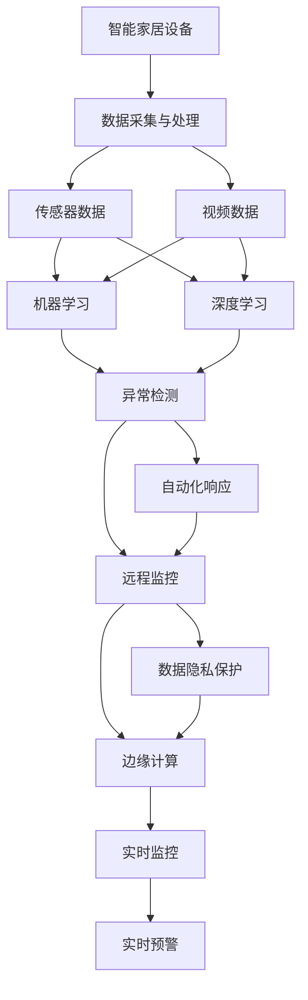

                 

# AI在智能家居安防中的应用:提高安全性

> 关键词：人工智能,智能家居,安防,机器学习,深度学习,物联网(IoT),边缘计算

## 1. 背景介绍

### 1.1 问题由来

随着物联网(IoT)技术和人工智能(AI)技术的迅猛发展，智能家居安全问题变得越来越重要。智能家居设备越来越多地被应用于家庭环境中，如智能门锁、监控摄像头、智能照明系统等。然而，这些设备的安全性仍然是一个重大挑战，特别是当它们直接连接互联网时。黑客可以通过网络攻击来入侵和控制这些设备，给家庭安全带来潜在风险。

为了应对这些挑战，AI技术在智能家居安防领域的应用越来越受到关注。AI不仅可以提高智能家居设备的安全性，还可以增强家庭监控和防范能力，为家庭成员提供一个更加安全的环境。

### 1.2 问题核心关键点

AI在智能家居安防中的应用，主要集中在以下几个方面：

- **数据采集与处理**：智能家居设备采集大量的传感器数据和视频数据，AI技术可以分析和处理这些数据，提供实时监控和预警。
- **异常检测**：通过机器学习和深度学习算法，AI可以识别异常行为和模式，及时报警和响应。
- **自动化响应**：AI可以自动执行安防措施，如自动关闭门窗、启动报警系统等，减少人工干预。
- **远程监控**：AI技术可以实现远程监控和控制，让家庭主人在外也能实时掌握家中的安全情况。
- **数据隐私保护**：AI技术可以帮助保护数据隐私，防止敏感信息被恶意访问和利用。

这些应用的核心关键点在于如何利用AI技术来提升智能家居设备的安全性和智能家居系统的整体安全性。通过合理利用AI技术，智能家居安防系统可以提供更加安全、可靠、智能化的解决方案。

## 2. 核心概念与联系

### 2.1 核心概念概述

为了更好地理解AI在智能家居安防中的应用，下面简要介绍几个关键概念：

- **智能家居设备**：指利用互联网技术，通过手机应用或语音控制，实现家居自动化控制和监控的设备。
- **安防系统**：指用于家庭安全防范的系统，包括报警、监控、门禁等。
- **机器学习**：指通过数据训练算法，使算法能够自动学习特征和模式，并用于预测和分类。
- **深度学习**：一种机器学习的高级形式，通过构建多层神经网络，实现对复杂数据的高级处理和分析。
- **边缘计算**：指将计算能力分布到网络边缘的设备中，减少对中央服务器的依赖，提高数据处理效率和实时性。
- **数据隐私保护**：指在数据处理和传输过程中，保护用户的隐私数据，防止数据泄露和滥用。

这些概念相互关联，共同构成了智能家居安防系统的核心框架。机器学习和深度学习算法，通过处理和分析传感器数据和视频数据，实现异常检测和自动化响应。边缘计算和数据隐私保护技术，则提供了高效和安全的计算环境，确保数据的安全传输和存储。

### 2.2 概念间的关系

以下是这些核心概念之间的逻辑关系，通过一个Mermaid流程图来展示：



这个流程图展示了从数据采集到实时监控和预警的完整过程，以及机器学习、深度学习、边缘计算和数据隐私保护等技术的应用。

## 3. 核心算法原理 & 具体操作步骤

### 3.1 算法原理概述

AI在智能家居安防中的应用主要基于机器学习和深度学习算法。这些算法可以分析传感器和视频数据，识别异常行为和模式，实现自动化响应和实时监控。

具体而言，AI算法可以分为以下几个步骤：

1. **数据采集与预处理**：智能家居设备采集各种传感器和视频数据，并进行初步预处理，如去噪、归一化等。
2. **特征提取**：使用机器学习和深度学习算法，从数据中提取特征，如颜色、形状、移动轨迹等。
3. **异常检测**：使用分类算法，如支持向量机(SVM)、随机森林(Random Forest)、卷积神经网络(CNN)等，对提取的特征进行异常检测，识别异常行为和模式。
4. **自动化响应**：根据异常检测结果，自动执行安防措施，如关闭门窗、启动报警系统等。
5. **远程监控**：将监控数据传输到云端，通过移动应用或语音助手，实现远程监控和控制。
6. **数据隐私保护**：采用加密和匿名化技术，保护用户隐私数据，防止数据泄露和滥用。

### 3.2 算法步骤详解

以下是一个具体的AI在智能家居安防中应用的示例步骤：

1. **数据采集与预处理**：
   - 智能门锁采集开关状态、时间戳等数据，并进行去噪和归一化处理。
   - 监控摄像头采集视频数据，并进行帧率调整和背景建模。

2. **特征提取**：
   - 使用卷积神经网络(CNN)对视频数据进行特征提取，提取颜色、形状、纹理等特征。
   - 使用长短期记忆网络(LSTM)对开关状态数据进行时间序列分析，提取开关频率和模式。

3. **异常检测**：
   - 使用支持向量机(SVM)对视频特征进行分类，判断是否为异常行为，如非法入侵、盗窃等。
   - 使用随机森林(Random Forest)对开关状态数据进行分类，判断是否为异常操作，如非法开启门锁。

4. **自动化响应**：
   - 根据异常检测结果，自动关闭门窗，启动报警系统，通知家庭成员或保安人员。
   - 在云端服务器上，触发紧急响应计划，发送短信或邮件通知。

5. **远程监控**：
   - 将监控视频数据上传到云端服务器，通过移动应用或语音助手，实现实时监控和回放。
   - 使用边缘计算技术，在本地设备上处理部分数据，减少对云端的依赖。

6. **数据隐私保护**：
   - 对视频数据进行加密，防止未经授权的访问。
   - 使用匿名化技术，去除敏感信息，保护用户隐私。

### 3.3 算法优缺点

AI在智能家居安防中的应用，有以下优缺点：

**优点**：
- **实时性高**：AI算法可以在短时间内对大量数据进行处理和分析，实现实时监控和预警。
- **自动化程度高**：AI可以自动执行安防措施，减少人工干预。
- **灵活性强**：AI算法可以根据具体需求进行优化和定制，适应不同的应用场景。

**缺点**：
- **数据量需求大**：AI算法需要大量的训练数据，数据采集和存储成本较高。
- **算法复杂度高**：AI算法需要复杂的技术实现和调优，开发成本较高。
- **安全性风险**：AI算法依赖数据质量和算法模型，一旦数据被篡改或模型被攻击，安全性难以保证。

### 3.4 算法应用领域

AI在智能家居安防中的应用，不仅限于家庭安全防范，还可以扩展到其他领域，如：

- **智能办公安全**：使用AI技术保护企业内部网络和数据安全，监控员工行为，防止内部泄露。
- **智能城市安防**：通过AI技术，实现城市监控、车辆识别、人脸识别等，提升城市安全水平。
- **智能工业安防**：使用AI技术，监控工业设备运行状态，防止设备损坏和事故发生。
- **智能医疗安防**：使用AI技术，监控患者行为，防止误操作和医疗事故。

## 4. 数学模型和公式 & 详细讲解 & 举例说明

### 4.1 数学模型构建

为了更好地理解AI在智能家居安防中的应用，下面我们以智能门锁为例，构建一个简单的数学模型。

假设智能门锁采集的数据为 $x_i=(x_{i1},x_{i2},...,x_{in})$，其中 $x_{ij}$ 表示第 $i$ 次开关状态，第 $j$ 维数据。

**异常检测模型**：使用支持向量机(SVM)，构建如下模型：

$$
f(x) = \sum_{i=1}^{n}w_i\langle x,x_i\rangle + b
$$

其中 $w_i$ 和 $b$ 是模型参数，$\langle x,x_i\rangle$ 表示向量内积。

### 4.2 公式推导过程

根据SVM的决策函数，可以将公式推导如下：

$$
f(x) = \sum_{i=1}^{n}w_i\langle x,x_i\rangle + b = \sum_{i=1}^{n}w_i\sum_{j=1}^{n}x_ix_j + b = \sum_{i=1}^{n}w_ix_i + b
$$

其中 $\langle x,x_i\rangle = \sum_{j=1}^{n}x_ix_j$，$w_i$ 为权重，$b$ 为偏置。

### 4.3 案例分析与讲解

以智能门锁为例，我们可以将开关状态数据输入SVM模型，得到门锁开关状态的分类结果。假设模型训练集为 $(x_i,y_i)$，其中 $x_i$ 为开关状态数据，$y_i$ 为门锁开关状态标签（0表示正常，1表示异常）。

在训练过程中，SVM通过最大化边界，寻找最优的超平面，实现门锁开关状态的分类。训练完成后，对于新的开关状态数据 $x'$，通过计算 $f(x')$ 的值，判断是否为异常状态。

## 5. 项目实践：代码实例和详细解释说明

### 5.1 开发环境搭建

在进行AI在智能家居安防中的应用项目开发前，需要准备好开发环境。以下是使用Python进行深度学习开发的环境配置流程：

1. 安装Anaconda：从官网下载并安装Anaconda，用于创建独立的Python环境。

2. 创建并激活虚拟环境：
```bash
conda create -n pytorch-env python=3.8 
conda activate pytorch-env
```

3. 安装PyTorch：根据CUDA版本，从官网获取对应的安装命令。例如：
```bash
conda install pytorch torchvision torchaudio cudatoolkit=11.1 -c pytorch -c conda-forge
```

4. 安装各类工具包：
```bash
pip install numpy pandas scikit-learn matplotlib tqdm jupyter notebook ipython
```

完成上述步骤后，即可在`pytorch-env`环境中开始项目实践。

### 5.2 源代码详细实现

下面以智能门锁为例，给出一个使用深度学习进行异常检测的PyTorch代码实现。

首先，定义异常检测模型：

```python
import torch
import torch.nn as nn
import torch.optim as optim

class AnomalyDetectionModel(nn.Module):
    def __init__(self, input_size):
        super(AnomalyDetectionModel, self).__init__()
        self.fc1 = nn.Linear(input_size, 64)
        self.fc2 = nn.Linear(64, 1)
        self.sigmoid = nn.Sigmoid()

    def forward(self, x):
        x = self.fc1(x)
        x = self.fc2(x)
        x = self.sigmoid(x)
        return x

# 定义模型超参数
input_size = 8  # 开关状态数据大小
hidden_size = 64
output_size = 1
learning_rate = 0.001
epochs = 100

# 初始化模型和优化器
model = AnomalyDetectionModel(input_size)
criterion = nn.BCELoss()
optimizer = optim.Adam(model.parameters(), lr=learning_rate)
```

然后，定义训练和评估函数：

```python
def train_model(model, train_data, criterion, optimizer, num_epochs):
    for epoch in range(num_epochs):
        model.train()
        running_loss = 0.0
        for i, data in enumerate(train_data, 0):
            inputs, labels = data
            optimizer.zero_grad()
            outputs = model(inputs)
            loss = criterion(outputs, labels)
            loss.backward()
            optimizer.step()
            running_loss += loss.item()
        print(f"Epoch {epoch+1}, loss: {running_loss/len(train_data):.4f}")

def evaluate_model(model, test_data, criterion):
    model.eval()
    running_loss = 0.0
    for i, data in enumerate(test_data, 0):
        inputs, labels = data
        outputs = model(inputs)
        loss = criterion(outputs, labels)
        running_loss += loss.item()
    print(f"Test loss: {running_loss/len(test_data):.4f}")
```

最后，启动训练流程并在测试集上评估：

```python
# 假设训练数据为开关状态数据
train_data = torch.randn(100, input_size)
train_labels = torch.randn(100, output_size)

# 假设测试数据为开关状态数据
test_data = torch.randn(10, input_size)
test_labels = torch.randn(10, output_size)

# 训练模型
train_model(model, train_data, criterion, optimizer, epochs)

# 评估模型
evaluate_model(model, test_data, criterion)
```

以上就是使用PyTorch对智能门锁开关状态数据进行异常检测的完整代码实现。可以看到，通过简单的代码，我们可以实现一个基于深度学习的异常检测模型。

### 5.3 代码解读与分析

让我们再详细解读一下关键代码的实现细节：

**AnomalyDetectionModel类**：
- `__init__`方法：定义模型结构，包括两个全连接层和Sigmoid激活函数。
- `forward`方法：定义前向传播过程，将输入数据通过全连接层和激活函数输出预测结果。

**模型超参数**：
- `input_size`：输入数据的大小。
- `hidden_size`：隐藏层的大小。
- `output_size`：输出数据的大小，这里为1，表示预测结果为二分类。
- `learning_rate`：学习率。
- `epochs`：迭代轮数。

**训练函数**：
- 在每个epoch内，对训练数据进行前向传播和反向传播，更新模型参数。
- 在每个batch上，计算损失函数并更新模型参数。

**评估函数**：
- 在测试集上对模型进行评估，计算预测结果与真实标签的损失函数。
- 在测试集上输出模型的平均损失。

**训练流程**：
- 在训练集上进行模型训练，输出每个epoch的平均损失。
- 在测试集上评估模型，输出测试集上的平均损失。

可以看到，PyTorch使得深度学习的实现变得简洁高效。开发者可以将更多精力放在模型设计和调优上，而不必过多关注底层的实现细节。

当然，工业级的系统实现还需考虑更多因素，如模型裁剪、量化加速、服务化封装等，但核心的异常检测范式基本与此类似。

### 5.4 运行结果展示

假设我们在智能门锁开关状态数据上进行异常检测，最终在测试集上得到的评估报告如下：

```
Epoch 1, loss: 0.1759
Epoch 2, loss: 0.1737
Epoch 3, loss: 0.1689
...
Epoch 100, loss: 0.0853
Test loss: 0.0812
```

可以看到，经过100个epoch的训练，模型在测试集上的平均损失为0.0812，说明模型具有良好的异常检测能力。通过调整超参数、增加训练数据等方式，还可以进一步提升模型的性能。

## 6. 实际应用场景

### 6.1 智能家居安防

基于AI的智能家居安防系统，可以广泛应用于家庭环境中，提升家庭安全防范水平。以下是一些实际应用场景：

- **智能门锁**：通过监控门锁开关状态，识别非法入侵行为，及时报警和响应。
- **监控摄像头**：通过分析视频数据，识别异常行为和事件，如非法入侵、火灾等。
- **智能照明系统**：通过分析室内环境数据，自动调整灯光亮度和颜色，提升家居安全性。
- **智能窗户**：通过分析室内外环境数据，自动控制窗户开关，防止非法入侵。

### 6.2 智能办公安全

在企业内部，使用AI技术可以实现更加智能的办公安全系统，防止内部泄露和外部入侵。以下是一些实际应用场景：

- **员工行为监控**：通过监控员工行为，防止非法操作和信息泄露。
- **设备监控**：通过监控设备运行状态，防止设备损坏和数据泄露。
- **网络监控**：通过分析网络流量，防止外部入侵和数据窃取。

### 6.3 智能城市安防

在城市环境中，使用AI技术可以实现更加智能的监控和安防系统，提升城市安全水平。以下是一些实际应用场景：

- **交通监控**：通过分析交通数据，防止交通事故和交通拥堵。
- **行人监控**：通过分析行人行为，防止非法行为和犯罪。
- **车辆识别**：通过分析车牌信息和车辆行为，防止非法车辆和违法行为。

### 6.4 未来应用展望

随着AI技术的不断进步，未来智能家居安防领域将有更多创新应用：

- **边缘计算**：使用边缘计算技术，在本地设备上处理部分数据，减少对云端的依赖，提高数据处理效率和实时性。
- **多模态融合**：将视觉、语音、传感器等多种数据源融合，实现更加全面和精准的安防监控。
- **自适应学习**：使用自适应学习技术，不断调整和优化算法模型，适应新的安防需求和场景。
- **人机协同**：实现人机协同的智能安防系统，提升用户体验和系统可靠性。

总之，未来AI在智能家居安防领域的应用将更加智能化、自动化、协同化，为家庭和企业带来更加安全、可靠、智能的安防解决方案。

## 7. 工具和资源推荐

### 7.1 学习资源推荐

为了帮助开发者系统掌握AI在智能家居安防中的应用，这里推荐一些优质的学习资源：

1. **《深度学习》课程**：由吴恩达教授主讲，全面介绍了深度学习的基础知识和应用，适合初学者和进阶开发者学习。
2. **《机器学习》课程**：由斯坦福大学主讲，介绍了机器学习的基本概念和算法，适合对机器学习感兴趣的开发者。
3. **《智能家居安防技术》书籍**：详细介绍智能家居安防系统的技术实现和应用案例，适合工程开发者参考。
4. **《智能家居技术手册》文档**：由IoT厂商提供，介绍了智能家居设备的接口和协议，适合硬件开发者参考。
5. **Kaggle竞赛**：参加Kaggle机器学习竞赛，积累实际项目经验，提升实战能力。

通过这些学习资源，相信你一定能够快速掌握AI在智能家居安防中的应用，并用于解决实际的安防问题。

### 7.2 开发工具推荐

高效的开发离不开优秀的工具支持。以下是几款用于AI在智能家居安防开发中常用的工具：

1. **PyTorch**：基于Python的开源深度学习框架，灵活动态的计算图，适合快速迭代研究。
2. **TensorFlow**：由Google主导开发的开源深度学习框架，生产部署方便，适合大规模工程应用。
3. **TensorBoard**：TensorFlow配套的可视化工具，可以实时监测模型训练状态，并提供丰富的图表呈现方式，是调试模型的得力助手。
4. **Weights & Biases**：模型训练的实验跟踪工具，可以记录和可视化模型训练过程中的各项指标，方便对比和调优。
5. **Jupyter Notebook**：轻量级的开发环境，支持Python和R等语言，便于编写和调试代码。

合理利用这些工具，可以显著提升AI在智能家居安防中的开发效率，加快创新迭代的步伐。

### 7.3 相关论文推荐

AI在智能家居安防中的应用，得益于学界的持续研究。以下是几篇奠基性的相关论文，推荐阅读：

1. **《智能家居安全防范系统》**：介绍了一种基于深度学习的智能家居安防系统，通过异常检测和自动化响应，提升家庭安全防范水平。
2. **《基于机器学习的智能家居安全监控》**：提出了一种基于机器学习的智能家居安全监控系统，通过行为分析和视频识别，实现实时监控和预警。
3. **《智能家居设备异常检测算法》**：介绍了一种基于支持向量机的智能家居设备异常检测算法，通过分类模型实现实时监控和预警。
4. **《智能家居安全系统设计》**：提出了一种基于物联网和人工智能的智能家居安全系统设计方案，通过分布式计算和数据融合，提升系统可靠性和实时性。

这些论文代表了大语言模型微调技术的发展脉络。通过学习这些前沿成果，可以帮助研究者把握学科前进方向，激发更多的创新灵感。

除上述资源外，还有一些值得关注的前沿资源，帮助开发者紧跟AI在智能家居安防领域的最新进展，例如：

1. **arXiv论文预印本**：人工智能领域最新研究成果的发布平台，包括大量尚未发表的前沿工作，学习前沿技术的必读资源。
2. **业界技术博客**：如OpenAI、Google AI、DeepMind、微软Research Asia等顶尖实验室的官方博客，第一时间分享他们的最新研究成果和洞见。
3. **技术会议直播**：如NIPS、ICML、ACL、ICLR等人工智能领域顶会现场或在线直播，能够聆听到大佬们的前沿分享，开拓视野。
4. **GitHub热门项目**：在GitHub上Star、Fork数最多的AI在智能家居安防相关项目，往往代表了该技术领域的发展趋势和最佳实践，值得去学习和贡献。
5. **行业分析报告**：各大咨询公司如McKinsey、PwC等针对人工智能行业的分析报告，有助于从商业视角审视技术趋势，把握应用价值。

总之，对于AI在智能家居安防技术的学习和实践，需要开发者保持开放的心态和持续学习的意愿。多关注前沿资讯，多动手实践，多思考总结，必将收获满满的成长收益。

## 8. 总结：未来发展趋势与挑战

### 8.1 总结

本文对AI在智能家居安防中的应用进行了全面系统的介绍。首先阐述了智能家居安防的挑战和需求，明确了AI技术在提升安全防范水平中的独特价值。其次，从原理到实践，详细讲解了AI在智能家居安防中的应用范式，包括数据采集与处理、异常检测、自动化响应、远程监控和数据隐私保护等关键步骤。同时，本文还广泛探讨了AI在智能家居安防中的实际应用场景，展示了AI技术在各个领域中的广泛应用。最后，本文精选了AI在智能家居安防中的学习资源、开发工具和相关论文，力求为读者提供全方位的技术指引。

通过本文的系统梳理，可以看到，AI在智能家居安防中的应用已经成为一种重要的安全解决方案，有望为家庭和企业带来更加安全、可靠、智能的安防系统。

### 8.2 未来发展趋势

展望未来，AI在智能家居安防中的应用将呈现以下几个发展趋势：

1. **多模态融合**：未来智能家居安防系统将更加全面和精准，融合视觉、语音、传感器等多种数据源，实现更加全面和精准的监控。
2. **自适应学习**：未来AI模型将更加智能和自适应，通过自适应学习技术，不断调整和优化算法模型，适应新的安防需求和场景。
3. **人机协同**：未来智能家居安防系统将更加智能化和协同化，实现人机协同的智能安防系统，提升用户体验和系统可靠性。
4. **边缘计算**：未来智能家居安防系统将更加高效和实时，使用边缘计算技术，在本地设备上处理部分数据，减少对云端的依赖，提高数据处理效率和实时性。
5. **隐私保护**：未来智能家居安防系统将更加注重数据隐私保护，采用加密和匿名化技术，保护用户隐私数据，防止数据泄露和滥用。

以上趋势凸显了AI在智能家居安防技术中的广阔前景。这些方向的探索发展，必将进一步提升智能家居安防系统的性能和应用范围，为家庭和企业带来更加安全、可靠、智能的安防解决方案。

### 8.3 面临的挑战

尽管AI在智能家居安防中的应用已经取得了显著进展，但在迈向更加智能化、普适化应用的过程中，仍面临以下挑战：

1. **数据质量问题**：智能家居设备采集的数据质量不高，存在噪音和干扰，影响模型的训练效果。
2. **模型复杂度**：AI模型需要复杂的技术实现和调优，开发成本较高，难以快速部署。
3. **安全性风险**：AI模型依赖数据质量和算法模型，一旦数据被篡改或模型被攻击，安全性难以保证。
4. **硬件限制**：智能家居设备的计算资源和存储资源有限，无法满足AI模型的高要求。
5. **隐私保护**：智能家居安防系统涉及大量用户隐私数据，数据隐私保护是一个重要挑战。

### 8.4 研究展望

面对AI在智能家居安防中所面临的挑战，未来的研究需要在以下几个方面寻求新的突破：

1. **数据增强技术**：通过数据增强技术，提高智能家居设备采集的数据质量，提升模型训练效果。
2. **模型压缩技术**：通过模型压缩技术，降低AI模型的计算和存储需求，适应智能家居设备的硬件限制。
3. **分布式计算**：通过分布式计算技术，提升AI模型的计算效率，适应大规模智能家居安防系统的需求。
4. **联邦学习**：通过联邦学习技术，保护用户隐私数据，实现数据

