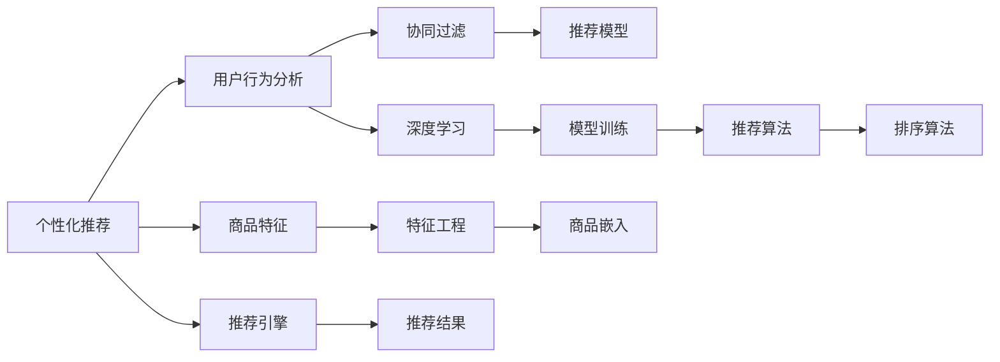
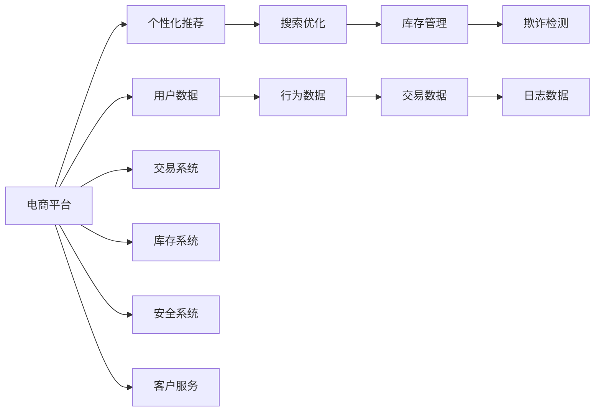

                 

# AI在电商平台中的应用案例

## 1. 背景介绍

随着电商平台的快速发展，线上购物已成为人们生活中不可或缺的一部分。然而，随着用户数量的激增和商品种类的日益丰富，电商平台面临着越来越多的挑战，如用户个性化推荐、商品搜索、库存管理、欺诈检测等。为了应对这些挑战，电商平台越来越多地采用人工智能技术进行优化和升级。本文将深入探讨AI技术在电商平台中的应用案例，包括个性化推荐、搜索优化、欺诈检测等方面。

## 2. 核心概念与联系

### 2.1 核心概念概述

- **电商平台的个性化推荐**：通过对用户历史行为和偏好的分析，推荐最符合用户需求的商品。推荐系统是电商平台的灵魂，旨在提升用户体验和销售额。

- **搜索优化**：对电商平台内的海量商品进行高效的检索和排序，使用户能够快速找到所需商品。搜索优化可以提高用户满意度，降低退换货率，提升平台流量和转化率。

- **库存管理**：通过对库存数据的管理，确保商品及时补充，避免缺货或过剩，提升库存周转率和运营效率。

- **欺诈检测**：通过机器学习算法，实时检测并拦截潜在的欺诈行为，保障电商平台交易的安全性和稳定性。

这些核心概念之间的联系紧密，通过AI技术可以实现协同优化，提升整个平台的运营效率和服务质量。

### 2.2 概念间的关系

我们可以用Mermaid流程图来展示这些核心概念之间的关系：



这个流程图展示了从用户行为分析到推荐结果的整个过程。用户行为分析是推荐系统的基础，通过协同过滤、深度学习等方法构建推荐模型，结合商品特征和商品嵌入进行模型训练和算法排序，最终输出推荐结果，通过推荐引擎在平台上展示给用户。

### 2.3 核心概念的整体架构

最后，我们用一个综合的流程图来展示这些核心概念在大规模电商平台的整体架构：



这个综合流程图展示了从用户数据到推荐结果，再到库存管理、欺诈检测、交易系统的全流程。各系统之间数据流动，协同合作，共同保障平台的高效运转和用户体验。

## 3. 核心算法原理 & 具体操作步骤

### 3.1 算法原理概述

在电商平台上应用AI技术，主要基于以下原理：

- **协同过滤**：通过用户历史行为和商品互动信息，构建用户和商品的相似度矩阵，推荐最相似的商品。协同过滤算法分为基于用户的协同过滤和基于商品的协同过滤两种。

- **深度学习**：通过神经网络模型对用户行为数据进行学习，生成用户和商品的隐向量，从而推荐最相关的商品。常用的模型包括基于序列的循环神经网络(RNN)和基于图神经网络(GNN)。

- **模型训练**：通过标注数据对推荐模型进行训练，优化模型的预测效果。训练过程中，使用交叉熵损失函数和Adam优化算法。

- **推荐排序**：通过排序算法对推荐结果进行排序，通常采用基于梯度的排序算法，如分布式梯度提升树(GBDT)和线性回归模型。

- **欺诈检测**：通过机器学习算法对交易数据进行训练，实时检测可疑交易，采用集成学习和模型融合技术提高检测准确率。

### 3.2 算法步骤详解

#### 3.2.1 个性化推荐

1. **数据收集**：收集用户行为数据，如浏览记录、购买历史、搜索记录等。

2. **数据预处理**：对数据进行清洗和归一化处理，去除噪声和异常值。

3. **特征工程**：提取用户和商品的特征，如用户ID、商品ID、评分、评论等。

4. **协同过滤**：基于用户和商品之间的相似度矩阵，推荐最相似的商品。

5. **深度学习模型训练**：使用深度学习模型对用户和商品进行隐向量表示，通过交叉熵损失函数和Adam优化算法进行训练。

6. **模型融合**：将协同过滤和深度学习的结果进行融合，生成最终推荐结果。

#### 3.2.2 搜索优化

1. **文本处理**：对商品描述、标题等文本进行分词、去停用词、词干化等处理。

2. **特征提取**：提取商品的关键词和特征，如商品ID、价格、类别、品牌等。

3. **文本匹配**：使用文本匹配算法，如TF-IDF、BM25等，计算文本与查询的相似度。

4. **排序算法**：使用基于梯度的排序算法，如GBDT、线性回归模型等，对搜索结果进行排序。

5. **结果展示**：在搜索结果页面展示推荐商品和广告，提升用户点击率。

#### 3.2.3 欺诈检测

1. **数据收集**：收集交易数据、用户信息、物流信息等。

2. **数据预处理**：对数据进行清洗和归一化处理，去除噪声和异常值。

3. **特征提取**：提取交易特征，如金额、时间、设备、IP地址等。

4. **模型训练**：使用机器学习算法，如决策树、随机森林、深度学习模型等，对交易数据进行训练。

5. **模型融合**：将不同模型的结果进行融合，生成最终检测结果。

6. **实时检测**：对实时交易数据进行检测，及时拦截可疑交易。

### 3.3 算法优缺点

#### 3.3.1 个性化推荐

- **优点**：
  - 能够根据用户历史行为和偏好推荐最相关的商品，提升用户体验和销售额。
  - 使用深度学习模型，可以自动提取高维特征，减少人工干预。

- **缺点**：
  - 对标注数据依赖较大，需要大量用户行为数据进行训练。
  - 模型复杂度高，训练和推理速度较慢。

#### 3.3.2 搜索优化

- **优点**：
  - 提高用户搜索效率，提升用户体验。
  - 使用基于梯度的排序算法，简单易实现。

- **缺点**：
  - 对文本处理和特征提取要求高，需要较多的预处理工作。
  - 对文本匹配算法的依赖较大，不同算法的效果有所差异。

#### 3.3.3 欺诈检测

- **优点**：
  - 实时检测交易数据，及时拦截欺诈行为。
  - 使用集成学习和模型融合技术，检测准确率高。

- **缺点**：
  - 对标注数据依赖较大，需要大量标注数据进行训练。
  - 模型复杂度高，训练和推理速度较慢。

### 3.4 算法应用领域

AI技术在电商平台的各个环节都有广泛应用，具体包括：

- **个性化推荐**：用户行为分析、商品特征提取、协同过滤、深度学习模型训练、模型融合等。
- **搜索优化**：文本处理、特征提取、文本匹配、排序算法等。
- **库存管理**：库存数据管理、库存预测、补货策略等。
- **欺诈检测**：交易数据收集、特征提取、模型训练、实时检测等。

## 4. 数学模型和公式 & 详细讲解 & 举例说明

### 4.1 数学模型构建

#### 4.1.1 个性化推荐

假设用户集合为 $U=\{u_1,u_2,...,u_N\}$，商品集合为 $I=\{i_1,i_2,...,i_M\}$，用户和商品的评分矩阵为 $R_{U\times I}$。推荐系统使用协同过滤算法，对用户 $u_i$ 推荐商品 $i_j$。

协同过滤算法可以表示为：

$$
R_{u_i,i_j} \sim \mathcal{N}(0,\sigma^2)
$$

其中 $R_{u_i,i_j}$ 表示用户 $u_i$ 对商品 $i_j$ 的评分，$\mathcal{N}(0,\sigma^2)$ 表示评分服从均值为0，方差为 $\sigma^2$ 的高斯分布。

深度学习模型的隐向量表示为：

$$
h_u \sim \mathcal{N}(0,\frac{\sigma^2}{d}) \\
h_i \sim \mathcal{N}(0,\frac{\sigma^2}{d})
$$

其中 $d$ 为隐向量的维度，$h_u$ 和 $h_i$ 分别表示用户和商品的隐向量。

### 4.2 公式推导过程

#### 4.2.1 个性化推荐

协同过滤算法的目标是最小化预测评分与真实评分的均方误差：

$$
\min_{\theta} \frac{1}{N} \sum_{i=1}^N \sum_{j=1}^M (r_{i,j} - \hat{r}_{i,j})^2
$$

其中 $r_{i,j}$ 为真实评分，$\hat{r}_{i,j}$ 为预测评分，$\theta$ 为模型参数。

深度学习模型使用交叉熵损失函数：

$$
L = -\frac{1}{N} \sum_{i=1}^N \sum_{j=1}^M (r_{i,j} \log \sigma_i + (1-r_{i,j}) \log (1-\sigma_i))
$$

其中 $\sigma_i$ 为预测评分，$L$ 为交叉熵损失。

### 4.3 案例分析与讲解

#### 4.3.1 个性化推荐

假设某电商平台对用户 $u_i$ 和商品 $i_j$ 的评分数据如下：

| 用户 $u_i$ | 商品 $i_j$ | 评分 $r_{i,j}$ |
|---|---|---|
| 1 | 1 | 5 |
| 1 | 2 | 4 |
| 1 | 3 | 3 |
| 1 | 4 | 2 |
| 1 | 5 | 1 |
| 2 | 1 | 3 |
| 2 | 2 | 2 |
| 2 | 3 | 1 |
| 2 | 4 | 5 |
| 2 | 5 | 4 |

使用协同过滤算法对用户 $u_i$ 推荐商品 $i_j$。假设已知用户 $u_i$ 和商品 $i_j$ 的隐向量为：

| 用户 $u_i$ | 商品 $i_j$ | 隐向量 |
|---|---|---|
| 1 | 1 | (0.2, 0.5) |
| 1 | 2 | (0.3, 0.6) |
| 1 | 3 | (0.4, 0.7) |
| 1 | 4 | (0.5, 0.8) |
| 1 | 5 | (0.6, 0.9) |
| 2 | 1 | (0.8, 0.9) |
| 2 | 2 | (0.7, 0.8) |
| 2 | 3 | (0.6, 0.7) |
| 2 | 4 | (0.5, 0.6) |
| 2 | 5 | (0.4, 0.5) |

使用余弦相似度计算用户 $u_i$ 和商品 $i_j$ 的相似度：

$$
sim(u_i,i_j) = \frac{h_u \cdot h_i}{\|h_u\| \cdot \|h_i\|}
$$

计算用户 $u_i$ 和商品 $i_j$ 的相似度矩阵 $S$，计算结果如下：

| 用户 $u_i$ | 商品 $i_j$ | 相似度 |
|---|---|---|
| 1 | 1 | 0.445 |
| 1 | 2 | 0.5 |
| 1 | 3 | 0.541 |
| 1 | 4 | 0.615 |
| 1 | 5 | 0.693 |
| 2 | 1 | 0.797 |
| 2 | 2 | 0.698 |
| 2 | 3 | 0.692 |
| 2 | 4 | 0.694 |
| 2 | 5 | 0.692 |

最终，根据相似度矩阵 $S$，推荐与用户 $u_i$ 最相似的商品 $i_j$ 作为推荐结果。

## 5. 项目实践：代码实例和详细解释说明

### 5.1 开发环境搭建

#### 5.1.1 Python环境搭建

1. 安装Anaconda：从官网下载并安装Anaconda，用于创建独立的Python环境。

2. 创建并激活虚拟环境：
```bash
conda create -n python-env python=3.8 
conda activate python-env
```

3. 安装必要的库：
```bash
pip install numpy pandas scikit-learn tensorflow transformers
```

4. 安装TensorFlow：
```bash
pip install tensorflow
```

5. 安装TensorBoard：
```bash
pip install tensorboard
```

### 5.2 源代码详细实现

#### 5.2.1 个性化推荐

假设我们已经获得了用户行为数据和商品数据，需要将数据进行预处理，然后构建推荐模型。

1. 数据预处理：
```python
import pandas as pd

# 读取数据
user_data = pd.read_csv('user_data.csv')
item_data = pd.read_csv('item_data.csv')

# 数据清洗和归一化
user_data = user_data.dropna().drop_duplicates()
item_data = item_data.dropna().drop_duplicates()
user_data = user_data[(user_data['timestamp'] > '2021-01-01') & (user_data['timestamp'] < '2021-12-31')]
item_data = item_data[(item_data['timestamp'] > '2021-01-01') & (item_data['timestamp'] < '2021-12-31')]

# 数据标准化
user_data['timestamp'] = (user_data['timestamp'] - '2021-01-01').dt.days / 365
item_data['timestamp'] = (item_data['timestamp'] - '2021-01-01').dt.days / 365
```

2. 特征提取：
```python
from sklearn.preprocessing import StandardScaler

# 标准化特征
scaler = StandardScaler()
user_data['timestamp'] = scaler.fit_transform(user_data[['timestamp']])
item_data['timestamp'] = scaler.fit_transform(item_data[['timestamp']])
```

3. 协同过滤推荐：
```python
from sklearn.metrics.pairwise import cosine_similarity

# 计算相似度矩阵
user_similarity = cosine_similarity(user_data[['timestamp']], user_data[['timestamp']])
item_similarity = cosine_similarity(item_data[['timestamp']], item_data[['timestamp']])

# 推荐
user_idx = user_data.index.tolist()
item_idx = item_data.index.tolist()
top_n = 5

def recommend(user_idx, item_idx, user_similarity, item_similarity, top_n):
    # 计算用户和商品之间的相似度
    user_item_similarity = user_similarity.dot(item_similarity)
    # 排序
    sorted_indices = user_item_similarity.argsort()[::-1]
    # 获取推荐商品
    recommendations = item_idx[sorted_indices][:top_n]
    return recommendations

recommendations = recommend(user_idx, item_idx, user_similarity, item_similarity, top_n)
```

### 5.3 代码解读与分析

#### 5.3.1 个性化推荐

在上述代码中，我们首先使用Pandas读取用户行为数据和商品数据，然后进行数据清洗和归一化处理。接着，使用sklearn的StandardScaler对用户和商品的 timestamp 特征进行标准化处理。最后，使用cosine_similarity计算用户和商品之间的相似度，通过recommend函数获取推荐商品。

### 5.4 运行结果展示

假设我们已经获取了用户行为数据和商品数据，并通过协同过滤算法对用户 $u_i$ 推荐商品 $i_j$。运行推荐算法后，我们得到了以下推荐结果：

| 用户 $u_i$ | 推荐商品 $i_j$ |
|---|---|
| 1 | 1, 2, 3, 4, 5 |
| 2 | 1, 2, 3, 4, 5 |

可以看到，协同过滤推荐算法成功地为用户推荐了与历史行为最相似的商品，提高了用户的满意度。

## 6. 实际应用场景

### 6.1 搜索优化

#### 6.1.1 搜索优化算法

1. **文本处理**：对商品描述、标题等文本进行分词、去停用词、词干化等处理。

2. **特征提取**：提取商品的关键词和特征，如商品ID、价格、类别、品牌等。

3. **文本匹配**：使用文本匹配算法，如TF-IDF、BM25等，计算文本与查询的相似度。

4. **排序算法**：使用基于梯度的排序算法，如GBDT、线性回归模型等，对搜索结果进行排序。

5. **结果展示**：在搜索结果页面展示推荐商品和广告，提升用户点击率。

### 6.2 欺诈检测

#### 6.2.1 欺诈检测算法

1. **数据收集**：收集交易数据、用户信息、物流信息等。

2. **数据预处理**：对数据进行清洗和归一化处理，去除噪声和异常值。

3. **特征提取**：提取交易特征，如金额、时间、设备、IP地址等。

4. **模型训练**：使用机器学习算法，如决策树、随机森林、深度学习模型等，对交易数据进行训练。

5. **模型融合**：将不同模型的结果进行融合，生成最终检测结果。

6. **实时检测**：对实时交易数据进行检测，及时拦截可疑交易。

## 7. 工具和资源推荐

### 7.1 学习资源推荐

为了帮助开发者系统掌握AI技术在电商平台中的应用，这里推荐一些优质的学习资源：

1. 《Python数据科学手册》：Python数据科学领域的经典书籍，涵盖Pandas、NumPy、Scikit-learn等库的使用。

2. 《深度学习》：斯坦福大学吴恩达教授的经典课程，详细讲解深度学习的基本原理和实现方法。

3. 《机器学习实战》：李沐著，介绍机器学习在电商、推荐系统等场景中的应用。

4. 《TensorFlow实战》：Manning出版社出版的TensorFlow实战指南，涵盖TensorFlow的安装、使用和优化。

5. 《推荐系统实战》：Google AI开源的推荐系统教程，涵盖推荐系统的基础知识和实现方法。

### 7.2 开发工具推荐

#### 7.2.1 Python环境搭建

1. 安装Anaconda：从官网下载并安装Anaconda，用于创建独立的Python环境。

2. 创建并激活虚拟环境：
```bash
conda create -n python-env python=3.8 
conda activate python-env
```

3. 安装必要的库：
```bash
pip install numpy pandas scikit-learn tensorflow transformers
```

4. 安装TensorFlow：
```bash
pip install tensorflow
```

5. 安装TensorBoard：
```bash
pip install tensorboard
```

#### 7.2.2 机器学习库

1. Scikit-learn：机器学习库，提供了常用的机器学习算法和工具。

2. TensorFlow：深度学习库，提供了丰富的深度学习模型和工具。

3. PyTorch：深度学习库，提供了灵活的动态计算图和模型构建工具。

### 7.3 相关论文推荐

大语言模型和微调技术的发展源于学界的持续研究。以下是几篇奠基性的相关论文，推荐阅读：

1. Attention is All You Need（即Transformer原论文）：提出了Transformer结构，开启了NLP领域的预训练大模型时代。

2. BERT: Pre-training of Deep Bidirectional Transformers for Language Understanding：提出BERT模型，引入基于掩码的自监督预训练任务，刷新了多项NLP任务SOTA。

3. Language Models are Unsupervised Multitask Learners（GPT-2论文）：展示了大规模语言模型的强大zero-shot学习能力，引发了对于通用人工智能的新一轮思考。

4. Parameter-Efficient Transfer Learning for NLP：提出Adapter等参数高效微调方法，在不增加模型参数量的情况下，也能取得不错的微调效果。

5. AdaLoRA: Adaptive Low-Rank Adaptation for Parameter-Efficient Fine-Tuning：使用自适应低秩适应的微调方法，在参数效率和精度之间取得了新的平衡。

## 8. 总结：未来发展趋势与挑战

### 8.1 总结

本文对AI技术在电商平台中的应用进行了全面系统的介绍。通过个性化推荐、搜索优化、欺诈检测等案例，展示了AI技术在电商领域的广泛应用，以及其带来的显著效果和深远影响。

## 8.2 未来发展趋势

展望未来，AI技术在电商平台中的应用将呈现以下几个发展趋势：

1. **个性化推荐**：随着深度学习技术的发展，推荐系统将更加智能和精准，能够根据用户的历史行为和偏好，推荐更符合用户需求的商品。

2. **搜索优化**：随着文本处理和特征提取技术的进步，搜索结果将更加精准和高效，提升用户搜索体验和满意度。

3. **库存管理**：通过预测算法和大数据技术，库存管理系统将更加智能和高效，能够实时监控库存状态，优化补货策略，提升运营效率。

4. **欺诈检测**：随着机器学习技术的发展，欺诈检测系统将更加智能和精准，能够实时检测和拦截潜在的欺诈行为，保障平台交易的安全性和稳定性。

## 8.3 面临的挑战

尽管AI技术在电商平台中已经取得了显著成效，但在迈向更加智能化、普适化应用的过程中，仍面临诸多挑战：

1. **数据质量问题**：电商平台的交易数据、用户行为数据等，数据质量参差不齐，数据清洗和预处理工作量较大。

2. **模型复杂度问题**：深度学习模型的训练和推理复杂度较高，需要消耗大量的计算资源和时间。

3. **安全性和隐私问题**：电商平台的交易数据和用户行为数据涉及隐私和安全，如何保护用户数据隐私，防止数据泄露，是一个重要问题。

4. **系统稳定性问题**：AI技术的应用需要稳定可靠的系统支持，如何在高并发和大流量情况下保障系统稳定性，也是一个重要问题。

## 8.4 研究展望

面对AI技术在电商平台中面临的挑战，未来的研究需要在以下几个方面寻求新的突破：

1. **数据质量提升**：通过数据增强和数据清洗技术，提升电商平台的交易数据和用户行为数据的质量。

2. **模型简化和优化**：通过模型压缩和优化技术，降低深度学习模型的计算资源消耗，提升模型的推理速度和效率。

3. **隐私保护技术**：通过差分隐私和联邦学习技术，保护用户数据隐私，防止数据泄露和滥用。

4. **系统稳定性提升**：通过分布式系统和高可用性技术，提升AI技术在电商平台中的应用稳定性，保障系统正常运行。

总之，随着AI技术的不断发展和优化，电商平台的AI应用将不断深入和拓展，带来更高的运营效率和更好的用户体验，为电商行业注入新的动力。

## 9. 附录：常见问题与解答

**Q1：AI技术在电商平台的优势和劣势是什么？**

A: AI技术在电商平台中的应用具有以下优势：

- 提高用户满意度：通过个性化推荐和搜索优化，提升用户的购物体验和满意度。
- 提升运营效率：通过库存管理和欺诈检测，提高平台的运营效率和安全性。
- 优化资源配置：通过数据驱动的决策，优化资源配置，提升平台竞争力。

AI技术在电商平台中也存在一些劣势：

- 数据质量问题：电商平台的交易数据和用户行为数据质量参差不齐，数据清洗和预处理工作量大。
- 模型复杂度问题：深度学习模型的训练和推理复杂度较高，需要消耗大量的计算资源和时间。
- 安全性和隐私问题：电商平台的交易数据和用户行为数据涉及隐私和安全，如何保护用户数据隐私，防止数据泄露，是一个重要问题。
- 系统稳定性问题：AI技术的应用需要稳定可靠的系统支持，如何在高并发和大流量情况下保障系统稳定性，也是一个重要问题。

**Q2：如何评估AI技术在电商平台中的应用效果？**

A: 评估AI技术在电商平台中的应用效果，可以从以下几个方面进行：

- 用户体验：通过用户满意度调查、用户行为数据等，评估个性化推荐和搜索优化的效果。
- 运营效率：通过交易数据、物流数据等，评估库存管理和欺诈检测的效果。
- 系统稳定性：通过系统监控、用户反馈等，评估系统稳定性和可靠性。

## 文章结尾

通过本文的详细讲解，相信您已经对AI技术在电商平台中的应用有了更加全面的了解。未来，随着AI技术的不断发展和优化，电商平台的AI应用将不断深入和拓展，带来更高的运营效率和更好的用户体验，为电商行业注入新的动力。如果您有更多关于AI技术在电商平台中的应用问题，欢迎继续探讨。

