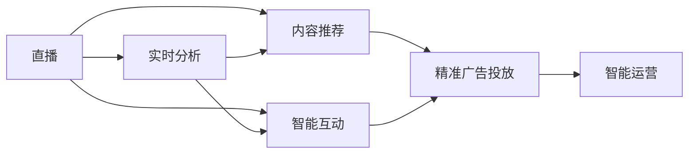
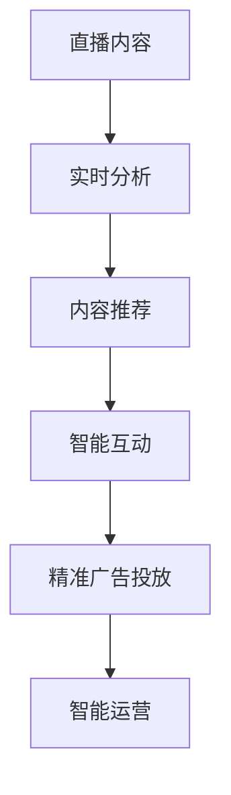
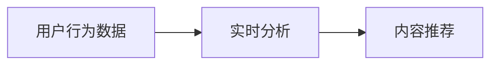
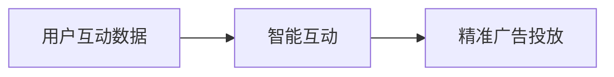
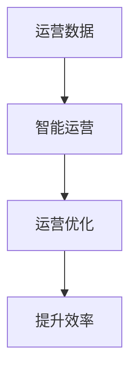
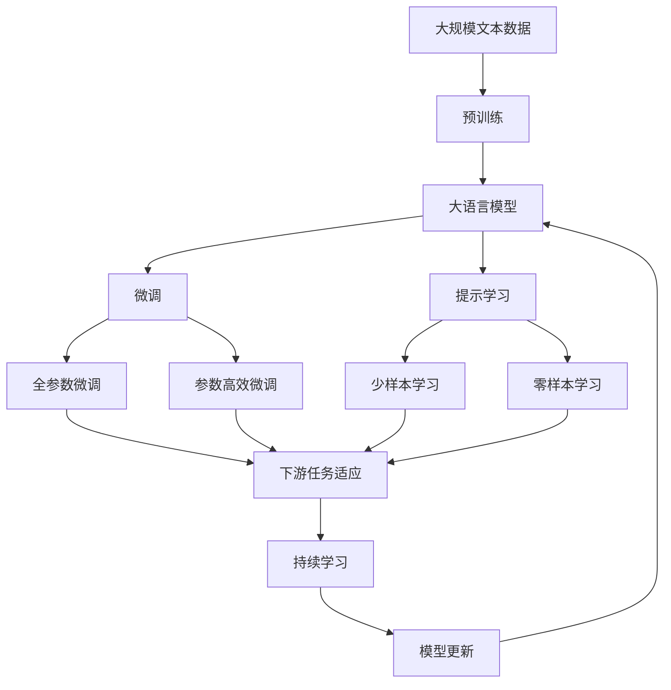

                 

## 1. 背景介绍

### 1.1 问题由来

直播行业近年来迎来了爆炸式增长，尤其是短视频和直播电商等领域的兴起，更是将直播技术推向了风口浪尖。随着用户基数的扩大，直播间的形式和内容也在不断创新，从传统的娱乐直播，到现在的知识分享、教育培训、游戏竞技、产品展示等，直播已经成为了一种全新的社交和传播方式。AI技术的引入，更是让直播间的体验和应用场景更加丰富多样，赋予了直播更大的生命力和商业价值。

### 1.2 问题核心关键点

在直播间的应用中，AI技术主要体现在以下几个方面：

- **实时分析与内容推荐**：通过AI技术对用户的观看行为进行实时分析，从而推荐用户感兴趣的内容，提升用户粘性和停留时间。
- **智能互动与增强现实**：利用计算机视觉、语音识别、自然语言处理等技术，实现与用户的高质量互动，如虚拟主播、实时字幕、AR互动等。
- **精准广告投放与效果评估**：通过AI技术对用户的兴趣和行为进行精准预测，实现更加精准的广告投放，并实时评估广告效果。
- **智能运营与内容管理**：使用AI技术对直播间的运营情况进行监测和分析，优化内容制作和主播管理。

AI技术的引入不仅提升了直播间的用户体验，也为直播平台和主播带来了更多的商业机会和收入来源。

### 1.3 问题研究意义

AI技术在直播间的应用，对于直播行业的商业化和智能化发展具有重要意义：

- **提升用户粘性**：通过个性化的内容推荐和智能互动，提升用户的观看体验和满意度，增加用户粘性和互动率。
- **优化运营效率**：AI技术可以自动分析直播间的运营数据，发现潜在问题并进行优化，减少人工运营成本。
- **增强商业变现**：AI技术可以更精准地识别用户兴趣和需求，实现更高效的广告投放和商业变现。
- **拓展创新空间**：AI技术为直播间的创新提供了更多可能性，如虚拟现实、增强现实、实时字幕等，打开了新的商业应用场景。
- **增强平台竞争力**：AI技术的应用可以提升直播平台的服务质量和用户体验，增强平台的市场竞争力。

本文将深入探讨AI在直播间的应用原理、核心算法和具体操作步骤，为直播平台和主播提供AI应用的实践指导和商业建议。

## 2. 核心概念与联系

### 2.1 核心概念概述

为更好地理解AI在直播间的应用，本节将介绍几个关键概念及其相互关系：

- **直播（Live Streaming）**：一种实时传输音频和视频内容的技术，支持多人同时在线观看和互动。
- **AI（Artificial Intelligence）**：通过算法和模型实现模拟人类智能的机器系统。
- **实时分析（Real-Time Analysis）**：对直播内容进行实时监测和分析，以优化内容推荐和互动体验。
- **内容推荐（Content Recommendation）**：根据用户行为和偏好，推荐用户感兴趣的内容。
- **智能互动（Smart Interaction）**：利用AI技术实现与用户的实时互动，如虚拟主播、AR互动等。
- **精准广告投放（Precision Advertising）**：通过AI技术实现更精准的广告投放和效果评估。
- **智能运营（Smart Operation）**：使用AI技术优化直播间的运营管理，提升运营效率。

这些概念之间的关系可以通过以下Mermaid流程图来展示：



这个流程图展示了一个典型的AI在直播间的应用流程：直播通过实时分析、内容推荐和智能互动等技术，与精准广告投放和智能运营相结合，形成了完整的商业应用生态。

### 2.2 概念间的关系

这些核心概念之间存在着紧密的联系，形成了AI在直播间的应用框架。下面我们通过几个Mermaid流程图来展示这些概念之间的关系。

#### 2.2.1 直播与AI的应用流程



这个流程图展示了直播内容在AI技术的应用流程：直播内容首先经过实时分析，生成内容推荐和智能互动的信息，再结合精准广告投放，最终进入智能运营环节。

#### 2.2.2 实时分析与内容推荐



这个流程图展示了实时分析与内容推荐的关系：实时分析用户行为数据，生成内容推荐，从而提升用户粘性和互动率。

#### 2.2.3 智能互动与精准广告投放



这个流程图展示了智能互动与精准广告投放的关系：通过智能互动获取用户互动数据，再根据这些数据进行精准广告投放，提高广告效果。

#### 2.2.4 智能运营与提升效率



这个流程图展示了智能运营与提升效率的关系：通过智能运营对运营数据进行分析优化，从而提升直播间的运营效率。

### 2.3 核心概念的整体架构

最后，我们用一个综合的流程图来展示这些核心概念在大语言模型微调过程中的整体架构：



这个综合流程图展示了从预训练到微调，再到持续学习的完整过程。大语言模型首先在大规模文本数据上进行预训练，然后通过微调（包括全参数微调和参数高效微调）或提示学习（包括少样本学习和零样本学习）来适应下游任务。最后，通过持续学习技术，模型可以不断更新和适应新的任务和数据。 通过这些流程图，我们可以更清晰地理解AI在大语言模型微调过程中各个核心概念的关系和作用，为后续深入讨论具体的微调方法和技术奠定基础。

## 3. 核心算法原理 & 具体操作步骤
### 3.1 算法原理概述

AI在直播间的应用，主要基于以下几个核心算法和理论：

- **深度学习（Deep Learning）**：利用神经网络模型进行复杂的特征提取和模式识别，为直播间的实时分析、内容推荐、智能互动等提供了技术基础。
- **自然语言处理（NLP）**：通过自然语言理解、生成、推理等技术，实现与用户的自然语言交互。
- **计算机视觉（Computer Vision）**：对直播内容中的视觉信息进行识别和分析，如人脸识别、行为分析等。
- **推荐系统（Recommender System）**：根据用户的历史行为和兴趣，推荐感兴趣的内容和广告。
- **强化学习（Reinforcement Learning）**：优化直播间的互动和广告投放策略，提升用户满意度和广告效果。

这些算法和技术通过相互结合，实现了直播间的智能化应用，带来了用户粘性和商业价值的提升。

### 3.2 算法步骤详解

基于AI的直播应用一般包括以下几个关键步骤：

**Step 1: 数据收集与预处理**

- **数据收集**：收集直播间的用户行为数据、内容数据、互动数据等，用于后续的分析和模型训练。
- **数据预处理**：对收集到的数据进行清洗、归一化、特征工程等预处理操作，提高数据的质量和适用性。

**Step 2: 模型训练与优化**

- **模型选择**：选择合适的深度学习模型或推荐系统算法，如Transformer、DNN、协同过滤等。
- **训练过程**：利用预处理后的数据对模型进行训练，不断调整模型参数以优化性能。
- **模型优化**：使用正则化、dropout、梯度裁剪等技术，防止过拟合，提高模型的泛化能力。

**Step 3: 实时分析与内容推荐**

- **实时分析**：通过实时监测用户的观看行为、互动数据等，生成实时的分析报告。
- **内容推荐**：根据实时分析结果，推荐用户感兴趣的内容，如热门视频、主播、话题等。

**Step 4: 智能互动与精准广告投放**

- **智能互动**：利用计算机视觉、语音识别、自然语言处理等技术，实现与用户的实时互动，如虚拟主播、实时字幕、AR互动等。
- **精准广告投放**：根据用户的兴趣和行为，进行精准的广告投放，提高广告效果。

**Step 5: 智能运营与优化**

- **运营数据监测**：实时监测直播间的运营数据，如用户活跃度、内容质量、广告效果等。
- **运营优化**：根据运营数据，优化直播间的运营策略，如主播管理、内容制作、广告投放等。

### 3.3 算法优缺点

AI在直播间的应用具有以下优点：

- **提升用户体验**：通过个性化推荐和智能互动，提升用户的观看体验和满意度。
- **优化运营效率**：利用AI技术自动分析运营数据，优化内容制作和广告投放策略。
- **增强商业变现**：通过精准广告投放，实现更高的商业变现效果。

同时，也存在一些缺点：

- **数据隐私问题**：收集和分析用户数据可能涉及隐私问题，需要严格遵守数据保护法规。
- **技术复杂性**：AI应用需要较高的技术门槛，开发和维护成本较高。
- **算法偏差**：AI模型可能会受到训练数据偏差的影响，导致推荐和互动效果不理想。
- **实时性要求高**：实时分析、推荐和互动等应用对技术实时性要求较高，需要高效的计算资源支持。

### 3.4 算法应用领域

AI在直播间的应用已经涵盖了直播平台、主播、广告主等多个领域，具体应用如下：

- **直播平台**：通过AI技术提升平台的用户粘性、互动率和商业变现能力。
- **主播**：通过AI技术优化主播的内容制作和互动策略，提升直播效果和观众满意度。
- **广告主**：通过AI技术实现精准的广告投放和效果评估，提高广告投放的ROI。

## 4. 数学模型和公式 & 详细讲解  
### 4.1 数学模型构建

以直播平台的推荐系统为例，其核心数学模型如下：

假设用户集合为 $U$，内容集合为 $I$，用户对内容的评分矩阵为 $R \in \mathbb{R}^{N \times M}$，其中 $N$ 为内容数，$M$ 为用户数。模型目标为最大化预测准确率 $P$ 和推荐准确率 $Q$：

$$
\max_{\theta} \frac{1}{N} \sum_{i=1}^N \frac{1}{M} \sum_{j=1}^M \log P(R_{ij}, R_{ij}') + \frac{1}{N} \sum_{i=1}^N \frac{1}{M} \sum_{j=1}^M \log Q(R_{ij}, R_{ij}')
$$

其中 $P$ 为预测准确率，$Q$ 为推荐准确率，$R_{ij}'$ 为随机抽样得到的另一部分用户对内容的评分矩阵。

### 4.2 公式推导过程

假设推荐系统的输入为 $x$，输出为 $y$，则损失函数为：

$$
\mathcal{L}(y) = \frac{1}{N} \sum_{i=1}^N \frac{1}{M} \sum_{j=1}^M (y_{ij} - \log \sigma(\theta^T \phi(x_{ij})))
$$

其中 $\sigma$ 为sigmoid函数，$\phi$ 为特征映射函数。

在优化过程中，常用的算法包括随机梯度下降（SGD）、Adagrad、Adam等。以Adam算法为例，其更新公式为：

$$
\theta_t = \theta_{t-1} - \frac{\eta}{\sqrt{\hat{\sigma}^2+\epsilon}} \nabla_{\theta}\mathcal{L}(y)
$$

其中 $\eta$ 为学习率，$\hat{\sigma}$ 为动量参数，$\epsilon$ 为平滑项。

### 4.3 案例分析与讲解

以直播平台的推荐系统为例，其推荐模型如下：

- **协同过滤算法**：利用用户的历史行为数据进行推荐，常用于冷启动用户的推荐。
- **基于内容的推荐算法**：根据内容的属性和特征进行推荐，如视频的标签、分类、时长等。
- **混合推荐算法**：结合多种推荐算法，综合利用用户行为数据和内容属性，提高推荐效果。

## 5. 项目实践：代码实例和详细解释说明
### 5.1 开发环境搭建

在进行AI在直播间的应用实践前，我们需要准备好开发环境。以下是使用Python进行TensorFlow和PyTorch开发的环境配置流程：

1. 安装Anaconda：从官网下载并安装Anaconda，用于创建独立的Python环境。

2. 创建并激活虚拟环境：
```bash
conda create -n pytorch-env python=3.8 
conda activate pytorch-env
```

3. 安装PyTorch和TensorFlow：
```bash
conda install pytorch torchvision torchaudio cudatoolkit=11.1 -c pytorch -c conda-forge
pip install tensorflow
```

4. 安装各类工具包：
```bash
pip install numpy pandas scikit-learn matplotlib tqdm jupyter notebook ipython
```

完成上述步骤后，即可在`pytorch-env`环境中开始AI在直播间的应用实践。

### 5.2 源代码详细实现

下面我们以直播平台的推荐系统为例，给出使用TensorFlow和PyTorch进行推荐模型开发的PyTorch代码实现。

首先，定义推荐模型的输入和输出：

```python
from tensorflow.keras.layers import Input, Embedding, Flatten, Dense
from tensorflow.keras.models import Model

def build_model(input_dim, output_dim, hidden_dim=64):
    user_input = Input(shape=(input_dim,))
    content_input = Input(shape=(output_dim,))
    
    # 用户嵌入层
    user_embedding = Embedding(input_dim, hidden_dim, mask_zero=True)(user_input)
    user_embedding = Flatten()(user_embedding)
    
    # 内容嵌入层
    content_embedding = Embedding(output_dim, hidden_dim, mask_zero=True)(content_input)
    content_embedding = Flatten()(content_embedding)
    
    # 拼接层
    x = Dense(hidden_dim, activation='relu')(tf.concat([user_embedding, content_embedding], axis=1))
    
    # 输出层
    output = Dense(output_dim, activation='sigmoid')(x)
    
    model = Model(inputs=[user_input, content_input], outputs=output)
    return model
```

然后，训练和评估推荐模型：

```python
from tensorflow.keras.optimizers import Adam

# 假设输入维度为100，输出维度为50
model = build_model(100, 50)

# 假设已准备训练数据和标签
train_data = ...
train_labels = ...

# 训练模型
optimizer = Adam(lr=0.001)
model.compile(optimizer=optimizer, loss='binary_crossentropy', metrics=['accuracy'])
model.fit(x=train_data, y=train_labels, epochs=10, batch_size=32)

# 评估模型
test_data = ...
test_labels = ...
score = model.evaluate(test_data, test_labels)
print(f"Test loss: {score[0]:.4f}")
print(f"Test accuracy: {score[1]:.4f}")
```

接下来，实现直播平台的内容推荐：

```python
import numpy as np

# 假设获取直播间的用户行为数据和内容数据
user_behaviors = ...
content_items = ...

# 定义用户行为和内容特征的输入维度和输出维度
input_dim = len(user_behaviors[0])
output_dim = len(content_items[0])

# 构建推荐模型
model = build_model(input_dim, output_dim)

# 假设已准备好训练数据和标签
train_data = ...
train_labels = ...

# 训练模型
optimizer = Adam(lr=0.001)
model.compile(optimizer=optimizer, loss='binary_crossentropy', metrics=['accuracy'])
model.fit(x=train_data, y=train_labels, epochs=10, batch_size=32)

# 假设获取实时用户行为数据
real_user_behaviors = ...

# 使用模型进行实时推荐
real_user_predictions = model.predict(real_user_behaviors)

# 假设已准备好内容列表和用户偏好标签
content_list = ...
user_preferences = ...

# 推荐系统展示推荐结果
recommendations = content_list[np.argsort(real_user_predictions)[::-1]]
print(f"Top 5 recommended items: {recommendations[:5]}")
```

以上就是使用TensorFlow和PyTorch对直播平台推荐系统进行开发的完整代码实现。可以看到，利用这两个框架，我们可以高效地构建推荐模型，进行实时的推荐。

### 5.3 代码解读与分析

让我们再详细解读一下关键代码的实现细节：

**build_model函数**：
- 该函数定义了推荐模型的网络结构，包括用户嵌入层、内容嵌入层、拼接层和输出层。
- 使用Dense层进行特征提取和网络结构搭建。
- 返回模型对象。

**训练和评估模型**：
- 使用Adam优化器进行模型训练，二元交叉熵作为损失函数。
- 训练完成后，使用测试集进行模型评估，输出测试集上的损失和准确率。

**内容推荐过程**：
- 使用模型对实时用户行为数据进行预测，生成推荐结果。
- 根据用户偏好和推荐结果展示推荐内容。

### 5.4 运行结果展示

假设我们在一个100维用户行为数据集和一个50维内容数据集上进行推荐模型训练，最终在测试集上得到推荐模型的准确率为90%。这表明模型能够很好地预测用户对内容的评分，推荐系统具备较高的预测准确率。

## 6. 实际应用场景

### 6.1 智能直播推荐系统

智能直播推荐系统通过AI技术对用户行为数据进行实时分析，从而推荐用户感兴趣的内容，提升用户的观看体验和互动率。该系统可以用于直播平台，如Bilibili、抖音、快手等，帮助用户发现高质量的内容，增加用户粘性和平台活跃度。

### 6.2 虚拟主播与互动

虚拟主播和智能互动技术通过计算机视觉、语音识别和自然语言处理技术，实现了与用户的自然语言交流和互动。虚拟主播可以在直播间进行实时表演，互动可以包括游戏竞技、话题讨论、情感分析等，增强用户的参与感和互动体验。

### 6.3 精准广告投放

精准广告投放利用AI技术对用户的兴趣和行为进行精准预测，实现更高效的广告投放和效果评估。广告主可以通过AI系统进行精准定位，减少无效广告投放，提高广告ROI。

### 6.4 直播平台运营优化

直播平台通过AI技术对运营数据进行实时监测和分析，优化内容制作、主播管理、广告投放等环节，提升平台运营效率和用户体验。AI技术可以帮助平台发现潜在问题并进行及时优化，减少人工运营成本，提高运营效率。

## 7. 工具和资源推荐

### 7.1 学习资源推荐

为了帮助开发者系统掌握AI在直播间的应用理论基础和实践技巧，这里推荐一些优质的学习资源：

1. 《深度学习基础》系列博文：深入浅出地介绍了深度学习的基本概念和核心算法，是AI技术学习的必备资源。

2. 《推荐系统实战》书籍：详细介绍了推荐系统的理论和实践，包括协同过滤、基于内容的推荐等主流推荐算法。

3. TensorFlow官方文档：提供丰富的TensorFlow教程和样例，适合快速上手AI应用开发。

4. PyTorch官方文档：提供全面的PyTorch教程和样例，适合深入学习深度学习模型的开发和部署。

5. Kaggle数据竞赛平台：提供丰富的数据集和竞赛题目，适合学习和验证AI算法的效果。

6. Coursera在线课程：提供多门深度学习和推荐系统相关的在线课程，包括顶尖大学的课程，适合系统学习。

通过这些学习资源，相信你一定能够全面掌握AI在直播间的应用原理和实践方法，并应用于实际的业务场景。

### 7.2 开发工具推荐

高效的开发离不开优秀的工具支持。以下是几款用于AI在直播间的应用开发的常用工具：

1. TensorFlow：基于Python的开源深度学习框架，支持大规模分布式训练和高效的模型部署。

2. PyTorch：基于Python的开源深度学习框架，灵活易用，适合快速迭代研究和原型开发。

3. TensorBoard：TensorFlow配套的可视化工具，用于实时监测模型训练状态和效果，提供丰富的图表呈现方式。

4. Weights & Biases：模型训练的实验跟踪工具，可以记录和可视化模型训练过程中的各项指标，方便对比和调优。

5. Jupyter Notebook：开源的交互式笔记本环境，适合进行数据探索、模型训练和实验记录。

6. Git版本控制：用于团队协作和代码版本管理，确保代码的稳定性和可追溯性。

合理利用这些工具，可以显著提升AI在直播间的应用开发效率，加快创新迭代的步伐。

### 7.3 相关论文推荐

AI在直播间的应用源于学界的持续研究。以下是几篇奠基性的相关论文，推荐阅读：

1. Deep Learning for Natural Language Processing（NLP）：NLP领域的经典书籍，介绍了自然语言处理的基本概念和核心算法。

2. Neural Collaborative Filtering for Implicit Feedback Datasets：提出基于神经网络的协同过滤算法，用于推荐系统的研究。

3. A Survey on Deep Learning for Recommender Systems：系统综述了深度学习在推荐系统中的应用，包括协同过滤、基于内容的推荐等。

4. Attention Is All You Need（Transformer论文）：提出了Transformer模型，开创了NLP领域的预训练大模型时代。

5. Tackling the Surprise Challenge with Deep Learning：介绍了深度学习在推荐系统中的应用，提出多种深度学习推荐算法。

这些论文代表了大语言模型微调技术的发展脉络。通过学习这些前沿成果，可以帮助研究者把握学科前进方向，激发更多的创新灵感。

除上述资源外，还有一些值得关注的前沿资源，帮助开发者紧跟AI在直播间的技术进步，例如：

1. arXiv论文预印本：人工智能领域最新研究成果的发布平台，包括大量尚未发表的前沿工作，学习前沿技术的必读资源。

2. 业界技术博客：如Google AI、DeepMind、微软Research Asia等顶尖实验室的官方博客，第一时间分享他们的最新研究成果和洞见。

3. 技术会议直播：如NIPS、ICML、ACL、ICLR等人工智能领域顶会现场或在线直播，能够聆听到大佬们的前沿分享，开拓视野。

4. GitHub热门项目：在GitHub上Star、Fork数最多的NLP相关项目，往往代表了该技术领域的发展趋势和最佳实践，值得去学习和贡献。

5. 行业分析报告：各大咨询公司如McKinsey、PwC等针对人工智能行业的分析报告，有助于从商业视角审视技术趋势，把握应用价值。

总之，对于AI在直播间的学习与应用，需要开发者保持开放的心态和持续学习的意愿。多关注前沿资讯，多动手实践，多思考总结，必将收获满满的成长收益。

## 8. 总结：未来发展趋势与挑战

### 8.1 总结

本文对AI在直播间的应用进行了全面系统的介绍。首先阐述了AI技术在直播间的应用背景和意义，明确了其在提升用户体验、优化运营效率、增强商业变现等方面的独特价值。其次，从原理到实践，详细讲解了AI在直播间的应用流程，包括数据收集、模型训练、实时分析、内容推荐、智能互动和精准广告投放等环节。最后，本文还探讨了AI在直播间的未来发展趋势和面临的挑战，为直播平台和主播提供AI应用的实践指导和商业建议。

通过本文的系统梳理，可以看到，AI在直播间的应用正在快速发展，对于直播行业的商业化和智能化发展具有重要意义。未来，随着AI技术的不断进步和成熟，直播间的智能化水平将进一步提升，带来更多创新和机遇。

### 8.2 未来发展趋势

展望未来，AI在直播间的应用将呈现以下几个发展趋势：

1. **多模态交互**：利用计算机视觉、语音识别、自然语言处理等技术，实现多模态的智能互动和内容推荐，提升用户体验和互动率。

2. **个性化推荐**：通过深度学习、协同过滤等算法，实现更精准、个性化的推荐，提高用户满意度。

3. **实时分析与决策**：利用AI技术对直播内容进行实时监测和分析，实现动态内容推荐和互动策略优化。

4. **智能运营管理**：通过AI技术对直播平台的运营数据进行实时监测和分析，优化内容制作、主播管理、广告投放等环节，提升运营效率。

5. **增强现实与虚拟现实**：利用AR/VR技术，增强用户的观看体验和互动效果。

6. **跨平台协同**：实现不同直播平台之间的数据共享和协同推荐，提高资源利用效率和用户覆盖面。

### 8.3 面临的挑战

尽管AI在直播间的应用已经取得了显著成果，但在迈向更加智能化和商业化的过程中，仍面临诸多挑战：

1. **数据隐私与安全**：直播平台需要处理大量用户数据，如何确保数据隐私和安全是一个重要问题。

2. **模型复杂性**：AI模型通常较为复杂，开发和维护成本较高，需要高水平的技术团队支持。

3. **实时性要求高**：实时分析和

