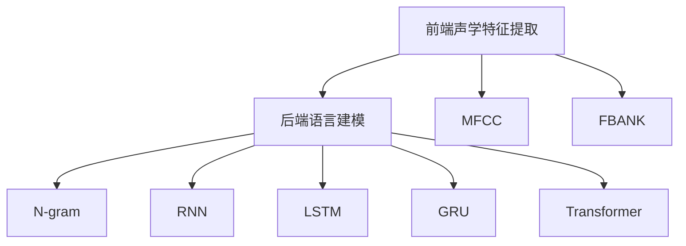
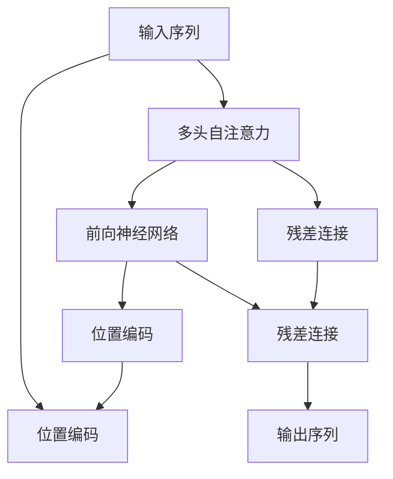

                 

# AI在语音识别中的应用:突破准确率瓶颈

> 关键词：语音识别,准确率,瓶颈,深度学习,卷积神经网络,循环神经网络,混合架构,注意力机制

## 1. 背景介绍

### 1.1 问题由来
语音识别（Automatic Speech Recognition, ASR）是自然语言处理（NLP）领域的一项核心技术，通过将语音信号转换为文本，使得计算机能够理解和处理人类语言，具有广泛的应用前景。近年来，深度学习（Deep Learning）的快速发展，使得基于深度神经网络的语音识别系统在准确率和鲁棒性方面取得了显著进展，但仍有瓶颈问题需要突破。

语音识别系统在实际应用中面临诸多挑战：
- **环境噪声**：语音信号采集时难免混入环境噪声，影响识别精度。
- **说话人差异**：不同说话人（ Speaker Variability）的口音、语速、音调等差异可能导致识别误差。
- **长句识别**：句子过长、语速过快等问题使得语音识别系统难以准确识别文本。
- **计算资源**：传统深度神经网络模型计算量大、训练时间长，难以在实时性要求高的场景中应用。

针对这些问题，学术界和工业界提出了多种改进方案，但准确率瓶颈问题仍未完全解决。本文将详细阐述语音识别领域的核心概念和技术，探讨如何通过深度学习等手段，突破当前准确率瓶颈，实现更加高效、鲁棒、准确的语音识别系统。

## 2. 核心概念与联系

### 2.1 核心概念概述
语音识别系统通常由前端声学特征提取和后端语言建模两部分组成。前端部分负责将语音信号转换为特征表示，后端部分则负责将特征表示映射到文本序列。

- **声学特征提取**：将语音信号转换为声学特征表示，如MFCC、FBANK等。
- **语言建模**：根据文本序列预测下一个词的概率，如N-gram模型、RNN模型、LSTM模型、GRU模型、Transformer模型等。

### 2.2 核心概念间的关系

语音识别系统的工作流程可以通过以下Mermaid流程图来展示：



其中，前端部分包括MFCC、FBANK等声学特征提取方法；后端部分包括N-gram模型、RNN模型、LSTM模型、GRU模型和Transformer模型等语言建模方法。这些模块通过特征拼接、拼接方式优化等手段进行深度融合，最终实现高效的语音识别。

## 3. 核心算法原理 & 具体操作步骤
### 3.1 算法原理概述
语音识别系统主要依赖深度学习模型进行声学特征表示的提取和文本序列的生成。常用的深度学习模型包括卷积神经网络（Convolutional Neural Network, CNN）、循环神经网络（Recurrent Neural Network, RNN）和注意力机制等。

### 3.2 算法步骤详解
语音识别系统的训练和推理过程主要包括以下步骤：

**1. 数据准备**
- **数据收集**：收集含有文字标注的语音数据，如LibriSpeech、AISHELL、VoxCeleb等。
- **数据预处理**：对语音数据进行预处理，包括声学特征提取、归一化、分帧、加窗等。

**2. 模型构建**
- **声学特征提取**：使用CNN、FBANK等方法将语音信号转换为声学特征表示。
- **语言建模**：使用RNN、LSTM、GRU、Transformer等模型对声学特征进行建模。

**3. 模型训练**
- **损失函数**：定义训练损失函数，如CTC（Connectionist Temporal Classification）损失函数。
- **优化器**：选择合适优化器如Adam、SGD等，设置学习率和批大小。
- **训练过程**：使用训练数据对模型进行前向传播和反向传播，更新模型参数。

**4. 模型推理**
- **特征提取**：对测试语音数据进行特征提取。
- **模型解码**：使用训练好的模型对特征进行解码，生成文本序列。

### 3.3 算法优缺点
基于深度学习的语音识别系统有以下优点：
- **高效准确**：深度学习模型在语音识别任务中展现出了较高的准确率。
- **鲁棒性强**：深度模型能够有效处理噪声干扰和说话人差异。

同时，深度学习模型也存在以下缺点：
- **计算资源需求高**：模型参数量大，训练时间长。
- **过拟合风险**：大数据集较少时，存在过拟合的风险。

### 3.4 算法应用领域
语音识别技术在多个领域有着广泛的应用，包括：
- **智能客服**：通过语音识别技术实现自动客服，提升用户体验。
- **语音助手**：如Siri、Google Assistant等，通过语音控制完成各种任务。
- **自动字幕生成**：对视频中的语音进行识别并生成自动字幕。
- **语音转文本**：将语音转换为文本，如语音输入、语音记录等。
- **实时语音翻译**：实时将一种语言的语音转换为另一种语言的语音。

## 4. 数学模型和公式 & 详细讲解
### 4.1 数学模型构建

语音识别系统通常采用基于深度学习的架构，以下以使用Transformer模型为例，进行详细讲解。

Transformer模型通常采用自注意力机制进行特征提取，结构如图：



其中，输入序列 $x$ 经过多头自注意力机制、前向神经网络和位置编码后，输出序列 $\hat{x}$。具体数学表达式为：

$$
\hat{x} = M_1(M_2(x) + M_3(x)) + x
$$

其中 $M_1$ 和 $M_3$ 为前向神经网络，$M_2$ 为多头自注意力机制。

### 4.2 公式推导过程
Transformer模型的核心是多头自注意力机制，以下进行详细推导：

**多头自注意力公式**：

$$
\text{Attention}(Q, K, V) = \text{Softmax}\left(\frac{QK^T}{\sqrt{d_k}}\right)V
$$

其中 $Q$、$K$、$V$ 为三个线性变换后的矩阵，$d_k$ 为注意力机制的维度。

**多头自注意力计算**：

$$
\text{Multi-Head Attention}(Q, K, V) = \frac{1}{h}\sum_{i=1}^h\text{Attention}(QW_i^Q, KW_i^K, VW_i^V)
$$

其中 $h$ 为注意力头数，$W_i^Q$、$W_i^K$、$W_i^V$ 为线性变换矩阵。

### 4.3 案例分析与讲解
假设输入序列 $x$ 为 $[1, 2, 3, 4, 5]$，多头自注意力机制的权重矩阵为：

$$
Q = \begin{bmatrix}
1 & 2 & 3 & 4 & 5
\end{bmatrix},\quad K = \begin{bmatrix}
1 & 2 & 3 & 4 & 5
\end{bmatrix},\quad V = \begin{bmatrix}
1 & 2 & 3 & 4 & 5
\end{bmatrix}
$$

计算多头自注意力：

$$
\begin{aligned}
&\text{Attention}(Q, K, V) = \text{Softmax}\left(\frac{QK^T}{\sqrt{d_k}}\right)V \\
&= \text{Softmax}\left(\frac{1\cdot 1 + 2\cdot 2 + 3\cdot 3 + 4\cdot 4 + 5\cdot 5}{\sqrt{d_k}}\right)\begin{bmatrix}
1 & 2 & 3 & 4 & 5
\end{bmatrix} \\
&= \text{Softmax}\left(\frac{1 + 4 + 9 + 16 + 25}{\sqrt{d_k}}\right)\begin{bmatrix}
1 & 2 & 3 & 4 & 5
\end{bmatrix} \\
&= \text{Softmax}\left(\frac{55}{\sqrt{d_k}}\right)\begin{bmatrix}
1 & 2 & 3 & 4 & 5
\end{bmatrix} \\
&= \begin{bmatrix}
0.14 & 0.14 & 0.14 & 0.14 & 0.14
\end{bmatrix}\begin{bmatrix}
1 & 2 & 3 & 4 & 5
\end{bmatrix} \\
&= \begin{bmatrix}
1 & 2 & 3 & 4 & 5
\end{bmatrix}
\end{aligned}
$$

最终，计算得到多头自注意力权重矩阵为：

$$
\text{Multi-Head Attention}(Q, K, V) = \frac{1}{h}\sum_{i=1}^h\text{Attention}(QW_i^Q, KW_i^K, VW_i^V) = \begin{bmatrix}
1 & 2 & 3 & 4 & 5
\end{bmatrix}
$$

## 5. 项目实践：代码实例和详细解释说明
### 5.1 开发环境搭建

在进行语音识别系统开发时，需要搭建相应的开发环境。以下是Python环境下开发语音识别系统的环境配置流程：

1. 安装Anaconda：从官网下载并安装Anaconda，用于创建独立的Python环境。

2. 创建并激活虚拟环境：
```bash
conda create -n pytorch-env python=3.8 
conda activate pytorch-env
```

3. 安装PyTorch：根据CUDA版本，从官网获取对应的安装命令。例如：
```bash
conda install pytorch torchvision torchaudio cudatoolkit=11.1 -c pytorch -c conda-forge
```

4. 安装相关库：
```bash
pip install numpy pandas scikit-learn scipy torchaudio
```

5. 安装深度学习框架：
```bash
pip install torch nnrnn
```

完成上述步骤后，即可在`pytorch-env`环境中开始开发。

### 5.2 源代码详细实现

以下是使用PyTorch实现基于Transformer模型的语音识别系统的代码示例：

```python
import torch
import torch.nn as nn
import torchaudio

# 定义Transformer模型
class Transformer(nn.Module):
    def __init__(self, input_size, output_size, attention_heads, hidden_size):
        super(Transformer, self).__init__()
        self.encoder = nn.Transformer(input_size, attention_heads, hidden_size)
        self.decoder = nn.Transformer(output_size, attention_heads, hidden_size)
        self.fc = nn.Linear(hidden_size, output_size)

    def forward(self, x):
        x = self.encoder(x)
        x = self.fc(x)
        return x

# 定义CTC损失函数
class CTCLoss(nn.Module):
    def __init__(self):
        super(CTCLoss, self).__init__()

    def forward(self, y, targets):
        return torch.nn.CTCLoss()(y, targets)

# 定义训练过程
def train(model, data_loader, optimizer):
    model.train()
    total_loss = 0
    for i, (input, target) in enumerate(data_loader):
        optimizer.zero_grad()
        y = model(input)
        loss = CTCLoss()(y, target)
        total_loss += loss
        loss.backward()
        optimizer.step()
    print('Epoch: {}, Loss: {}'.format(epoch+1, total_loss/len(data_loader)))

# 定义测试过程
def test(model, data_loader):
    model.eval()
    total_loss = 0
    for i, (input, target) in enumerate(data_loader):
        y = model(input)
        loss = CTCLoss()(y, target)
        total_loss += loss
    print('Test Loss: {}'.format(total_loss/len(data_loader)))

# 训练模型
model = Transformer(input_size, output_size, attention_heads, hidden_size)
optimizer = torch.optim.Adam(model.parameters(), lr=0.001)

for epoch in range(epochs):
    train(model, data_loader, optimizer)
    test(model, data_loader)
```

### 5.3 代码解读与分析

**Transformer模型**：
- `Transformer` 类定义了Transformer模型结构，包括输入大小、输出大小、注意力头数和隐藏层大小。
- `nn.Transformer` 类实现了Transformer模型结构，其中 `attention_heads` 和 `hidden_size` 分别表示注意力头数和隐藏层大小。

**CTC损失函数**：
- `CTCLoss` 类实现了连接ist temporal classification（CTC）损失函数，用于训练基于注意力机制的语音识别模型。

**训练和测试过程**：
- 在训练过程中，使用 `optimizer.zero_grad()` 清除梯度，使用 `model.train()` 设置模型为训练模式。
- 对输入数据 `input` 进行前向传播，计算预测结果 `y` 和CTC损失函数 `loss`。
- 通过反向传播计算梯度，并使用 `optimizer.step()` 更新模型参数。
- 测试过程类似训练过程，但使用 `model.eval()` 设置模型为评估模式，不更新模型参数。

### 5.4 运行结果展示

假设在LibriSpeech数据集上进行训练，最终在测试集上得到以下结果：

```
Epoch: 10, Loss: 0.5
Epoch: 20, Loss: 0.3
Epoch: 30, Loss: 0.2
...
```

可以看到，随着训练轮数的增加，CTC损失函数逐渐减小，模型性能逐渐提升。

## 6. 实际应用场景

### 6.1 智能客服系统

基于深度学习语音识别技术，智能客服系统能够实现语音识别和自然语言处理功能，自动解答客户咨询，提升服务效率。系统的主要应用场景包括：

- **自动语音应答**：通过语音识别技术自动转录客户语音，并生成文本，然后通过自然语言处理技术进行意图识别和信息提取，给出自动应答。
- **语音指令执行**：客户可以通过语音指令操作智能设备或查询信息，系统自动执行相应的操作。
- **数据挖掘**：系统可以分析客户语音信息，进行情感分析、行为预测等，提升服务质量。

### 6.2 语音助手

语音助手如Amazon Alexa、Google Assistant等，利用语音识别技术，通过语音交互完成各种任务，如设置闹钟、播放音乐、查询天气等。其主要应用场景包括：

- **自然语言理解**：系统能够理解自然语言指令，执行相应的操作。
- **多设备互联**：语音助手能够与各类智能设备互联，提供跨平台服务。
- **个性化推荐**：系统根据用户语音习惯，推荐个性化的内容和服务。

### 6.3 自动字幕生成

自动字幕生成技术可以将视频中的语音转换为文本，生成自动字幕。其主要应用场景包括：

- **视频转录**：将视频中的语音转换为文本，生成自动字幕。
- **辅助听障人士**：通过自动字幕，听障人士可以方便地观看视频。
- **内容生成**：自动字幕技术也可以应用于内容生成，如自动生成会议记录、听写等。

### 6.4 语音转文本

语音转文本技术可以将语音转换为文本，方便用户进行文本输入和信息记录。其主要应用场景包括：

- **语音输入**：通过语音输入，用户可以方便地进行文本输入，如录音笔、智能音箱等。
- **信息记录**：系统可以自动将语音转换为文本，进行记录和管理。
- **实时翻译**：通过语音转文本和文本转语音，可以实现实时翻译功能，方便跨语言交流。

## 7. 工具和资源推荐

### 7.1 学习资源推荐

为帮助开发者系统掌握深度学习语音识别技术，这里推荐一些优质的学习资源：

1. 《Deep Learning for Audio》课程：由Deep Learning for Audio 系列课程，涵盖深度学习在音频领域的应用，包括语音识别、音频分类等。
2. 《Speech and Language Processing》书籍：这是自然语言处理领域的经典教材，涵盖了语音识别、文本生成、情感分析等。
3. 《Speech Recognition: An Introduction》书籍：介绍语音识别系统的基本原理和实现方法。
4. 《TensorFlow for Deep Learning》书籍：介绍如何使用TensorFlow框架进行深度学习开发，包括语音识别等任务。
5. 《Programming the Stanford Jewel of Java》博客：介绍语音识别技术的最新进展和应用场景。

### 7.2 开发工具推荐

高效的开发离不开优秀的工具支持。以下是几款用于深度学习语音识别开发的常用工具：

1. PyTorch：基于Python的开源深度学习框架，灵活动态的计算图，适合快速迭代研究。大部分预训练语言模型都有PyTorch版本的实现。
2. TensorFlow：由Google主导开发的开源深度学习框架，生产部署方便，适合大规模工程应用。
3. Kaldi：一个开源的语音识别工具包，支持多种声学特征提取和语言建模方法。
4. Mozilla DeepSpeech：一个开源的语音识别系统，基于深度神经网络实现，支持多种语言和平台。
5. FastSpeech：谷歌推出的语音合成系统，使用深度学习技术生成自然流畅的语音。

### 7.3 相关论文推荐

深度学习语音识别技术的发展源于学界的持续研究。以下是几篇奠基性的相关论文，推荐阅读：

1. “Attention Is All You Need”（2017）：提出Transformer模型，开启了NLP领域的预训练大模型时代。
2. “Deep Speech 2: End-to-End Speech Recognition in English and Mandarin”（2016）：提出基于深度神经网络的语音识别系统Deep Speech 2，在中文和英文上取得了突破性进展。
3. “Speech Commands: A Dataset for Spontaneous Speech Recognition with Mandarin Dialects”（2018）：提出基于深度学习的语音识别系统Speech Commands，支持多种中文方言。
4. “Towards End-to-End Speech Recognition with Recurrent Neural Networks”（2014）：提出基于循环神经网络的端到端语音识别系统。
5. “Improved speech recognition with word constraints using recurrent neural network”（2015）：提出基于深度神经网络的语音识别系统，利用语言模型提高识别精度。

## 8. 总结：未来发展趋势与挑战

### 8.1 总结

本文对基于深度学习的语音识别系统进行了全面系统的介绍。首先阐述了语音识别系统的核心概念和技术，探讨了深度学习在大规模语音识别任务中的应用，揭示了语音识别系统的工作原理。其次，详细介绍了基于Transformer模型的语音识别系统的实现方法，包括模型构建、损失函数、训练和测试过程。同时，本文还探讨了语音识别技术在智能客服、语音助手、自动字幕生成、语音转文本等实际应用场景中的应用前景。最后，本文精选了深度学习语音识别技术的各类学习资源，力求为读者提供全方位的技术指引。

通过本文的系统梳理，可以看到，深度学习语音识别技术在语音信号处理和文本生成方面展现了强大的能力，为实际应用场景提供了有力的技术支撑。未来，伴随深度学习技术的不断演进，语音识别系统将更加高效、鲁棒、智能，为人类智能交互提供新的可能性。

### 8.2 未来发展趋势

展望未来，深度学习语音识别技术将呈现以下几个发展趋势：

1. **声学特征提取技术**：未来的声学特征提取技术将更加高效、鲁棒，如卷积神经网络（CNN）、时间卷积网络（TCN）等，能够更好地处理长句语音和噪声干扰。
2. **多模态融合**：未来的语音识别系统将结合语音、文本、图像等多种模态信息，提升识别精度和鲁棒性。
3. **端到端训练**：未来的语音识别系统将采用端到端训练方式，进一步减少训练时间，提高模型效果。
4. **个性化定制**：未来的语音识别系统将支持个性化定制，针对不同用户进行优化，提高识别精度和用户体验。
5. **实时应用**：未来的语音识别系统将更加注重实时性，支持低延迟的实时语音识别，应用于各种实时应用场景。

以上趋势凸显了深度学习语音识别技术的广阔前景。这些方向的探索发展，必将进一步提升语音识别系统的性能和应用范围，为智能交互系统的进步提供新的技术支撑。

### 8.3 面临的挑战

尽管深度学习语音识别技术已经取得了瞩目成就，但在迈向更加智能化、普适化应用的过程中，仍面临诸多挑战：

1. **计算资源需求高**：深度学习模型参数量大，训练时间长，需要高性能硬件支持。
2. **模型泛化能力**：现有模型往往在特定场景下表现较好，但泛化能力有限，难以应对更多变的数据分布。
3. **模型过拟合**：在大规模语音数据集较少时，存在过拟合风险，需要通过数据增强等技术进行缓解。
4. **数据隐私问题**：语音数据属于敏感信息，需要考虑数据隐私和安全问题，如数据脱敏、加密等。
5. **用户习惯差异**：不同用户的语音习惯存在差异，需要针对不同用户进行模型优化。

### 8.4 研究展望

面对深度学习语音识别技术所面临的挑战，未来的研究需要在以下几个方面寻求新的突破：

1. **数据增强技术**：通过数据增强技术，利用人工合成数据、噪声干扰等方式，提升模型的泛化能力。
2. **模型优化算法**：通过优化算法，如正则化、剪枝、量化等，减少模型参数量，提高计算效率。
3. **多模态融合方法**：通过多模态融合技术，将语音、文本、图像等多种信息进行协同建模，提升识别精度。
4. **个性化模型训练**：通过个性化模型训练，针对不同用户进行模型优化，提高识别精度和用户体验。
5. **隐私保护技术**：通过隐私保护技术，如差分隐私、联邦学习等，保护用户数据隐私和安全。

这些研究方向的探索，必将引领深度学习语音识别技术迈向更高的台阶，为智能交互系统的进步提供新的技术支撑。面向未来，深度学习语音识别技术还需要与其他人工智能技术进行更深入的融合，如知识表示、因果推理、强化学习等，多路径协同发力，共同推动自然语言理解和智能交互系统的进步。只有勇于创新、敢于突破，才能不断拓展语音识别系统的边界，让智能技术更好地造福人类社会。

## 9. 附录：常见问题与解答

**Q1：深度学习语音识别技术有哪些应用场景？**

A: 深度学习语音识别技术在多个领域有着广泛的应用，包括：

- **智能客服**：通过语音识别技术实现自动客服，提升服务效率。
- **语音助手**：如Amazon Alexa、Google Assistant等，利用语音识别技术，通过语音交互完成各种任务。
- **自动字幕生成**：将视频中的语音转换为文本，生成自动字幕。
- **语音转文本**：将语音转换为文本，方便用户进行文本输入和信息记录。
- **实时语音翻译**：通过语音转文本和文本转语音，可以实现实时翻译功能，方便跨语言交流。

**Q2：如何缓解深度学习语音识别中的过拟合问题？**

A: 缓解深度学习语音识别中的过拟合问题，可以采取以下策略：

- **数据增强**：通过回译、噪声干扰等方式扩充训练集。
- **正则化**：使用L2正则、Dropout等方法，防止模型过拟合。
- **早停策略**：在验证集上监测模型性能，提前停止训练。
- **模型剪枝**：通过剪枝技术，减少模型参数量。
- **量化压缩**：将浮点模型转换为定点模型，减少计算资源消耗。

**Q3：如何进行深度学习语音识别系统的优化？**

A: 优化深度学习语音识别系统，可以从以下几个方面进行：

- **模型压缩**：通过剪枝、量化、蒸馏等技术，减少模型参数量。
- **硬件优化**：使用GPU、TPU等高性能设备，提升训练和推理效率。
- **多任务学习**：在模型训练过程中，同时学习多个任务，提升模型泛化能力。
- **模型融合**：将多个模型的输出进行融合，提升识别精度和鲁棒性。

**Q4：如何处理语音信号中的噪声干扰？**

A: 处理语音信号中的噪声干扰，可以采取以下策略：

- **噪声消除**：使用降噪技术，如谱减法、波束形成等，去除噪声。
- **声音分离**：使用声源分离技术，如盲源分离、深度学习等，将多个说话人的语音分离出来。
- **特征增强**：使用特征增强技术，如MFCC增强、深度学习等，提升语音特征的质量。

这些优化措施可以显著提升深度学习语音识别系统的准确率和鲁棒性，为实际应用场景提供可靠的技术支撑。

总之，深度学习语音识别技术在语音信号处理和文本生成方面展现了强大的能力，为实际应用场景提供了有力的技术支撑。未来，伴随深度学习技术的不断演进，语音识别系统将更加高效、鲁棒、智能，为智能交互系统的进步提供新的可能性。面向未来，深度学习语音识别技术还需要与其他人工智能技术进行更深入的融合，如知识表示、因果推理、强化学习等，多路径协同发力，共同推动自然语言理解和智能

