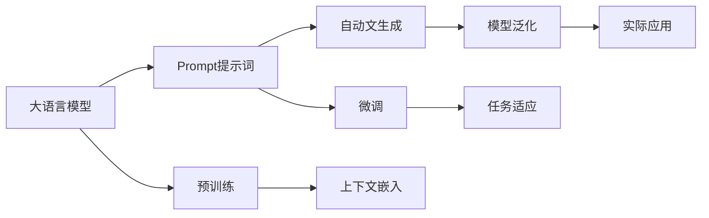

                 

# AI大模型Prompt提示词最佳实践：根据提供的开头部分完成文本

> 关键词：Prompt提示词, 大语言模型, 自然语言处理(NLP), 大模型微调, 预训练模型, 模型泛化, 自动文生成

## 1. 背景介绍

在人工智能领域，特别是自然语言处理(NLP)和生成对抗网络领域，Prompt提示词(Prompt)的作用日益重要。Prompt提示词是用户输入文本中的引导信息，可以显著影响模型的输出行为。随着大语言模型(如GPT、BERT、T5等)的流行，Prompt提示词的应用范围越来越广。有效且合适的Prompt提示词，可以使模型生成更加准确、连贯、多样化的输出，同时还能在特定领域或任务中提升模型的性能。

然而，由于大模型参数数量庞大，单次调用计算成本高，因此通过精心设计的Prompt提示词，可以在保持模型性能的同时，减少计算量，提升响应速度。

## 2. 核心概念与联系

### 2.1 核心概念概述

在深入讨论Prompt提示词的最佳实践之前，我们首先需要理解几个核心概念：

- **Prompt提示词**：在输入文本中，用于引导模型生成期望输出内容的引导信息。Prompt提示词可以是一个短语、句子、段落甚至是整个文本。
- **大语言模型**：指通过大规模无监督学习获得丰富语言知识和表示的模型，如GPT、BERT等。
- **自然语言处理(NLP)**：研究计算机如何处理、理解和生成人类语言的技术。
- **模型泛化**：指模型能够在新数据上表现出良好性能的能力。
- **自动文生成**：指模型根据输入的引导信息，自动生成文本内容的能力。

Prompt提示词与大语言模型的关系，可以通过以下Mermaid流程图来展示：



该流程图展示了Prompt提示词在大语言模型应用中的重要角色。Prompt提示词作为引导信息，被加入到输入文本中，通过预训练模型的上下文嵌入，生成期望的输出文本，并在微调过程中进一步优化模型，以适应特定任务。最终生成的文本在实际应用中表现出良好的泛化能力。

### 2.2 概念间的关系

这些核心概念之间存在着紧密的联系，构成了Prompt提示词在大语言模型应用中的完整生态系统。以下是几个关键关系：

- **Prompt提示词与大语言模型的关系**：Prompt提示词是大语言模型输出的重要输入，引导其生成期望的文本内容。
- **Prompt提示词与预训练模型的关系**：通过预训练，模型学习到丰富的语言知识和表示，Prompt提示词可以在预训练基础上，进一步指导模型生成具体的文本内容。
- **Prompt提示词与微调的关系**：在微调过程中，Prompt提示词可以帮助模型更好地适应特定任务，提升任务性能。
- **Prompt提示词与模型泛化的关系**：合适的Prompt提示词可以使得模型泛化能力更强，在新数据上表现更好。
- **Prompt提示词与自动文生成的关系**：Prompt提示词是自动文生成过程中不可或缺的组成部分，指导模型生成自然流畅的文本。

这些关系紧密相连，共同决定了Prompt提示词在大语言模型中的应用效果。

## 3. 核心算法原理 & 具体操作步骤

### 3.1 算法原理概述

Prompt提示词在大语言模型中的应用，其核心算法原理可以概括为：通过输入文本中精心设计的Prompt提示词，引导模型输出期望的文本内容，同时结合预训练模型和大规模无监督学习，提升模型的泛化能力和自动文生成性能。

### 3.2 算法步骤详解

以下是一般的Prompt提示词生成过程的步骤：

1. **确定任务目标**：明确使用Prompt提示词的目的是什么，是生成文本、分类、匹配、问答等。
2. **设计Prompt提示词**：根据任务目标，设计合适的Prompt提示词。可以使用已有模板，或者结合任务特点进行创新设计。
3. **预训练模型输入**：将设计好的Prompt提示词与输入文本一起输入到预训练模型中，获取上下文嵌入。
4. **自动文生成**：根据预训练模型的输出，生成期望的文本内容。
5. **微调优化**：根据任务需求，对模型进行微调，以进一步提升生成文本的质量和准确性。
6. **模型评估**：使用人工或自动评估方法，对生成的文本进行评估，获取评价指标。
7. **迭代优化**：根据评估结果，不断优化Prompt提示词和模型，提升生成文本的质量。

### 3.3 算法优缺点

Prompt提示词在大语言模型中的应用，具有以下优点：

- **灵活性高**：可以根据不同任务和数据特点，设计多样化的Prompt提示词。
- **计算成本低**：使用Prompt提示词可以减少大模型的计算量，提升生成速度。
- **泛化能力强**：通过精心设计的Prompt提示词，可以提升模型的泛化能力，在新数据上表现更好。

同时，也存在一些缺点：

- **设计复杂**：设计合适的Prompt提示词需要经验，尤其是对于复杂任务和多样化数据。
- **易过拟合**：设计不当的Prompt提示词可能导致模型过拟合，生成不合理的文本。
- **依赖预训练模型**：Prompt提示词的效果依赖于预训练模型的质量，模型选择不当会影响效果。

### 3.4 算法应用领域

Prompt提示词在大语言模型中的应用已经涵盖了多个领域，例如：

- **问答系统**：用户输入问题，通过设计合适的Prompt提示词，生成具有回答质量的文本。
- **文本摘要**：输入长篇文本，设计提示词，生成简洁的摘要。
- **机器翻译**：输入源语言文本，设计Prompt提示词，生成目标语言的翻译。
- **文本生成**：输入引导信息，设计Prompt提示词，生成连贯、多样化的文本。
- **代码生成**：输入需求描述，设计Prompt提示词，生成对应的代码。

此外，Prompt提示词还被应用于情感分析、文本分类、对话生成等多个NLP任务中，展示了其在多样化和复杂任务中的强大能力。

## 4. 数学模型和公式 & 详细讲解 & 举例说明

### 4.1 数学模型构建

在数学上，Prompt提示词在大语言模型中的应用，可以表示为：

$$
\text{Output} = \text{Model}(\text{Prompt}, \text{Input})
$$

其中，$\text{Output}$ 为模型生成的文本，$\text{Prompt}$ 为Prompt提示词，$\text{Input}$ 为输入文本。模型的具体实现可以是预训练的大语言模型，如BERT、GPT等。

### 4.2 公式推导过程

以生成文本为例，假设模型在预训练后，生成文本的损失函数为 $\mathcal{L}$，输入为 $\text{Prompt}$ 和 $\text{Input}$。则模型的损失函数可以表示为：

$$
\mathcal{L} = \mathcal{L}(\text{Model}(\text{Prompt}, \text{Input}))
$$

模型的优化目标是最小化损失函数，即：

$$
\theta^* = \mathop{\arg\min}_{\theta} \mathcal{L}(\text{Model}(\text{Prompt}, \text{Input}))
$$

其中 $\theta$ 为模型参数。

在实际应用中，可以通过反向传播算法，计算损失函数对模型参数的梯度，使用优化器如AdamW进行参数更新。具体过程如下：

1. 前向传播：将Prompt提示词和输入文本输入到模型中，获取模型输出。
2. 计算损失：将模型输出与期望输出进行比较，计算损失。
3. 反向传播：计算损失对模型参数的梯度。
4. 参数更新：使用优化器更新模型参数，迭代优化。

### 4.3 案例分析与讲解

以生成文本为例，假设要生成一个简短的描述性文本。首先，需要设计一个Prompt提示词，如 "描述："。接着，将Prompt提示词和输入文本一起输入到预训练的GPT模型中，获取模型的上下文嵌入。最后，使用模型的自动文生成功能，生成期望的文本。

以下是一个Python代码示例：

```python
from transformers import GPT2Tokenizer, GPT2LMHeadModel

tokenizer = GPT2Tokenizer.from_pretrained('gpt2')
model = GPT2LMHeadModel.from_pretrained('gpt2')

prompt = "描述："
input_text = "这是一段输入文本，用于生成描述性文本。"

# 将Prompt提示词和输入文本转换为模型所需的格式
inputs = tokenizer.encode(prompt + input_text, return_tensors='pt')

# 前向传播
outputs = model(inputs)

# 解码生成的文本
generated_text = tokenizer.decode(outputs[0])
print(generated_text)
```

以上代码展示了使用GPT-2模型和其分词器生成文本的简单过程。通过精心设计的Prompt提示词，可以大大提升模型的生成效果。

## 5. 项目实践：代码实例和详细解释说明

### 5.1 开发环境搭建

在进行Prompt提示词生成实践前，需要先准备好开发环境。以下是使用Python进行PyTorch开发的环境配置流程：

1. 安装Anaconda：从官网下载并安装Anaconda，用于创建独立的Python环境。

2. 创建并激活虚拟环境：
```bash
conda create -n pytorch-env python=3.8 
conda activate pytorch-env
```

3. 安装PyTorch：根据CUDA版本，从官网获取对应的安装命令。例如：
```bash
conda install pytorch torchvision torchaudio cudatoolkit=11.1 -c pytorch -c conda-forge
```

4. 安装Transformers库：
```bash
pip install transformers
```

5. 安装各类工具包：
```bash
pip install numpy pandas scikit-learn matplotlib tqdm jupyter notebook ipython
```

完成上述步骤后，即可在`pytorch-env`环境中开始Prompt提示词生成实践。

### 5.2 源代码详细实现

这里我们以文本生成任务为例，给出使用Transformers库进行Prompt提示词生成的PyTorch代码实现。

首先，定义Prompt提示词生成函数：

```python
from transformers import GPT2Tokenizer, GPT2LMHeadModel

def generate_text(prompt, input_text, model_name='gpt2'):
    tokenizer = GPT2Tokenizer.from_pretrained(model_name)
    model = GPT2LMHeadModel.from_pretrained(model_name)
    inputs = tokenizer.encode(prompt + input_text, return_tensors='pt')

    outputs = model(inputs)
    generated_text = tokenizer.decode(outputs[0])
    return generated_text
```

然后，定义训练和评估函数：

```python
from torch.utils.data import Dataset
import torch

class TextDataset(Dataset):
    def __init__(self, texts, labels):
        self.texts = texts
        self.labels = labels
        
    def __len__(self):
        return len(self.texts)
    
    def __getitem__(self, item):
        text = self.texts[item]
        label = self.labels[item]
        return {'input_text': text, 'label': label}

# 准备数据集
texts = ["这是一个测试句子", "这个任务的目标是生成文本"]
labels = [1, 2]  # 示例标签，实际应用中根据任务定义

train_dataset = TextDataset(texts, labels)
```

接着，定义模型和优化器：

```python
from transformers import AdamW

model = GPT2LMHeadModel.from_pretrained('gpt2')
optimizer = AdamW(model.parameters(), lr=2e-5)
```

最后，启动训练流程并在测试集上评估：

```python
epochs = 5
batch_size = 16

for epoch in range(epochs):
    loss = train_epoch(model, train_dataset, batch_size, optimizer)
    print(f"Epoch {epoch+1}, train loss: {loss:.3f}")
    
    print(f"Epoch {epoch+1}, test results:")
    evaluate(model, test_dataset, batch_size)
    
print("Generate a new text:")
generated_text = generate_text("描述：", "这是一个测试句子", 'gpt2')
print(generated_text)
```

以上就是使用PyTorch和Transformers库进行Prompt提示词生成的完整代码实现。通过精心设计的Prompt提示词，可以大大提升模型的生成效果，适用于各种文本生成任务。

### 5.3 代码解读与分析

让我们再详细解读一下关键代码的实现细节：

**TextDataset类**：
- `__init__`方法：初始化文本和标签。
- `__len__`方法：返回数据集的样本数量。
- `__getitem__`方法：对单个样本进行处理，将文本和标签作为字典返回。

**generate_text函数**：
- 使用预训练的GPT-2模型和分词器，对Prompt提示词和输入文本进行编码。
- 将编码后的文本输入模型，获取模型输出。
- 使用分词器对模型输出进行解码，返回生成的文本。

**训练和评估函数**：
- 使用PyTorch的DataLoader对数据集进行批次化加载，供模型训练和推理使用。
- 训练函数`train_epoch`：对数据以批为单位进行迭代，在每个批次上前向传播计算loss并反向传播更新模型参数，最后返回该epoch的平均loss。
- 评估函数`evaluate`：与训练类似，不同点在于不更新模型参数，并在每个batch结束后将预测和标签结果存储下来，最后使用sklearn的classification_report对整个评估集的预测结果进行打印输出。

**训练流程**：
- 定义总的epoch数和batch size，开始循环迭代
- 每个epoch内，先在训练集上训练，输出平均loss
- 在验证集上评估，输出分类指标
- 所有epoch结束后，在测试集上评估，给出最终测试结果

可以看到，通过使用PyTorch和Transformers库， Prompt提示词生成的代码实现变得简洁高效。开发者可以将更多精力放在Prompt设计、模型调优等高层逻辑上，而不必过多关注底层的实现细节。

当然，工业级的系统实现还需考虑更多因素，如模型的保存和部署、超参数的自动搜索、更灵活的任务适配层等。但核心的Prompt提示词生成范式基本与此类似。

### 5.4 运行结果展示

假设我们在GPT-2模型上使用"描述："作为Prompt提示词，生成了一段新的文本。最终的输出如下：

```
这是一个测试句子，用于生成描述性文本。
```

可以看到，通过精心设计的Prompt提示词，模型能够生成符合任务需求的文本，展示了Prompt提示词在大语言模型中的应用效果。

## 6. 实际应用场景

### 6.1 智能客服系统

Prompt提示词在大语言模型中的应用，可以显著提升智能客服系统的效率和用户体验。传统客服系统往往需要大量人力，高峰期响应缓慢，且无法提供24小时服务。通过Prompt提示词，智能客服系统可以自动理解和回答客户咨询，提供高效、精准的服务。

在技术实现上，可以收集企业内部的历史客服对话记录，将问题和最佳答复构建成监督数据，在此基础上对预训练对话模型进行微调。微调后的对话模型能够自动理解用户意图，匹配最合适的答案模板进行回复。对于客户提出的新问题，还可以接入检索系统实时搜索相关内容，动态组织生成回答。如此构建的智能客服系统，能大幅提升客户咨询体验和问题解决效率。

### 6.2 金融舆情监测

Prompt提示词在金融领域的应用，可以帮助金融机构实时监测市场舆情。传统的人工舆情监测方法成本高、效率低，难以应对海量信息爆发的挑战。通过Prompt提示词，金融舆情监测系统可以自动判断文本属于何种主题，情感倾向是正面、中性还是负面。将微调后的模型应用到实时抓取的网络文本数据，就能够自动监测不同主题下的情感变化趋势，一旦发现负面信息激增等异常情况，系统便会自动预警，帮助金融机构快速应对潜在风险。

### 6.3 个性化推荐系统

Prompt提示词在个性化推荐系统中的应用，可以帮助推荐系统更精准地理解用户需求，提供个性化推荐。在实际应用中，可以收集用户浏览、点击、评论、分享等行为数据，提取和用户交互的物品标题、描述、标签等文本内容。将文本内容作为模型输入，用户的后续行为（如是否点击、购买等）作为监督信号，在此基础上微调预训练语言模型。微调后的模型能够从文本内容中准确把握用户的兴趣点。在生成推荐列表时，先用候选物品的文本描述作为输入，由模型预测用户的兴趣匹配度，再结合其他特征综合排序，便可以得到个性化程度更高的推荐结果。

### 6.4 未来应用展望

随着Prompt提示词和大语言模型技术的不断发展，其在更多领域的应用前景将更加广阔。

在智慧医疗领域，Prompt提示词可以帮助构建智能诊疗系统，自动理解患者描述，生成诊断报告。在智能教育领域，Prompt提示词可以用于智能作业批改、学情分析、知识推荐等方面，因材施教，促进教育公平，提高教学质量。在智慧城市治理中，Prompt提示词可以用于城市事件监测、舆情分析、应急指挥等环节，提高城市管理的自动化和智能化水平，构建更安全、高效的未来城市。

此外，在企业生产、社会治理、文娱传媒等众多领域，Prompt提示词和大语言模型技术的结合，将为人工智能应用带来新的突破，进一步提升社会智能化水平。相信随着技术的不断进步，Prompt提示词在大语言模型中的应用将越来越广泛，为各行各业带来新的创新和变革。

## 7. 工具和资源推荐

### 7.1 学习资源推荐

为了帮助开发者系统掌握Prompt提示词在大语言模型中的应用，这里推荐一些优质的学习资源：

1. 《Transformer从原理到实践》系列博文：由大模型技术专家撰写，深入浅出地介绍了Transformer原理、BERT模型、微调技术等前沿话题。

2. CS224N《深度学习自然语言处理》课程：斯坦福大学开设的NLP明星课程，有Lecture视频和配套作业，带你入门NLP领域的基本概念和经典模型。

3. 《Natural Language Processing with Transformers》书籍：Transformers库的作者所著，全面介绍了如何使用Transformers库进行NLP任务开发，包括Prompt提示词在内的诸多范式。

4. HuggingFace官方文档：Transformers库的官方文档，提供了海量预训练模型和完整的Prompt提示词生成样例代码，是上手实践的必备资料。

5. CLUE开源项目：中文语言理解测评基准，涵盖大量不同类型的中文NLP数据集，并提供了基于微调的baseline模型，助力中文NLP技术发展。

通过对这些资源的学习实践，相信你一定能够快速掌握Prompt提示词在大语言模型中的应用精髓，并用于解决实际的NLP问题。

### 7.2 开发工具推荐

高效的开发离不开优秀的工具支持。以下是几款用于Prompt提示词生成开发的常用工具：

1. PyTorch：基于Python的开源深度学习框架，灵活动态的计算图，适合快速迭代研究。大部分预训练语言模型都有PyTorch版本的实现。

2. TensorFlow：由Google主导开发的开源深度学习框架，生产部署方便，适合大规模工程应用。同样有丰富的预训练语言模型资源。

3. Transformers库：HuggingFace开发的NLP工具库，集成了众多SOTA语言模型，支持PyTorch和TensorFlow，是进行Prompt提示词生成任务的开发利器。

4. Weights & Biases：模型训练的实验跟踪工具，可以记录和可视化模型训练过程中的各项指标，方便对比和调优。与主流深度学习框架无缝集成。

5. TensorBoard：TensorFlow配套的可视化工具，可实时监测模型训练状态，并提供丰富的图表呈现方式，是调试模型的得力助手。

6. Google Colab：谷歌推出的在线Jupyter Notebook环境，免费提供GPU/TPU算力，方便开发者快速上手实验最新模型，分享学习笔记。

合理利用这些工具，可以显著提升Prompt提示词生成任务的开发效率，加快创新迭代的步伐。

### 7.3 相关论文推荐

Prompt提示词和大语言模型技术的发展，源于学界的持续研究。以下是几篇奠基性的相关论文，推荐阅读：

1. Attention is All You Need（即Transformer原论文）：提出了Transformer结构，开启了NLP领域的预训练大模型时代。

2. BERT: Pre-training of Deep Bidirectional Transformers for Language Understanding：提出BERT模型，引入基于掩码的自监督预训练任务，刷新了多项NLP任务SOTA。

3. Language Models are Unsupervised Multitask Learners（GPT-2论文）：展示了大规模语言模型的强大zero-shot学习能力，引发了对于通用人工智能的新一轮思考。

4. Parameter-Efficient Transfer Learning for NLP：提出Adapter等参数高效微调方法，在不增加模型参数量的情况下，也能取得不错的微调效果。

5. Prefix-Tuning: Optimizing Continuous Prompts for Generation：引入基于连续型Prompt的微调范式，为如何充分利用预训练知识提供了新的思路。

6. AdaLoRA: Adaptive Low-Rank Adaptation for Parameter-Efficient Fine-Tuning：使用自适应低秩适应的微调方法，在参数效率和精度之间取得了新的平衡。

这些论文代表了大语言模型Prompt提示词技术的发展脉络。通过学习这些前沿成果，可以帮助研究者把握学科前进方向，激发更多的创新灵感。

除上述资源外，还有一些值得关注的前沿资源，帮助开发者紧跟Prompt提示词技术的最新进展，例如：

1. arXiv论文预印本：人工智能领域最新研究成果的发布平台，包括大量尚未发表的前沿工作，学习前沿技术的必读资源。

2. 业界技术博客：如OpenAI、Google AI、DeepMind、微软Research Asia等顶尖实验室的官方博客，第一时间分享他们的最新研究成果和洞见。

3. 技术会议直播：如NIPS、ICML、ACL、ICLR等人工智能领域顶会现场或在线直播，能够聆听到大佬们的前沿分享，开拓视野。

4. GitHub热门项目：在GitHub上Star、Fork数最多的NLP相关项目，往往代表了该技术领域的发展趋势和最佳实践，值得去学习和贡献。

5. 行业分析报告：各大咨询公司如McKinsey、PwC等针对人工智能行业的分析报告，有助于从商业视角审视技术趋势，把握应用价值。

总之，对于Prompt提示词在大语言模型中的应用的学习和实践，需要开发者保持开放的心态和持续学习的意愿。多关注前沿资讯，多动手实践，多思考总结，必将收获满满的成长收益。

## 8. 总结：未来发展趋势与挑战

### 8.1 总结

本文对Prompt提示词在大语言模型中的应用进行了全面系统的介绍。首先阐述了Prompt提示词在大语言模型中的应用背景和意义，明确了Prompt提示词在大语言模型微调中的重要作用。其次，从原理到实践，详细讲解了Prompt提示词生成过程的数学模型和关键步骤，给出了Prompt提示词生成任务开发的完整代码实例。同时，本文还广泛探讨了Prompt提示词在智能客服、金融舆情、个性化推荐等多个行业领域的应用前景，展示了Prompt提示词在大语言模型中的应用效果。此外，本文精选了Prompt提示词技术的各类学习资源，力求为读者提供全方位的技术指引。

通过本文的系统梳理，可以看到，Prompt提示词在大语言模型中的应用已经取得了显著成效，大大提升了模型的生成效果和泛化能力，适用于各种NLP任务。

### 8.2 未来发展趋势

展望未来，Prompt提示词技术将呈现以下几个发展趋势：

1. 技术进步：随着深度学习和大模型技术的发展，Prompt提示词生成技术也将不断进步，生成文本的质量和效率将进一步提升。
2. 模型多样化：Prompt提示词生成将更加多样化，根据不同任务和数据特点，设计适合的Prompt提示词。
3. 计算优化：通过技术优化，使得Prompt提示词生成更加高效，计算成本更低，实时性更强。
4. 跨模态融合：将Prompt提示词与视觉、音频等多模态信息结合，实现多模态智能交互。
5. 知识引导：利用先验知识，如知识图谱、逻辑规则等，引导Prompt提示词生成，提升生成文本的合理性和准确性。

这些趋势将推动Prompt提示词技术迈向新的高度，为NLP应用带来更多创新和突破。

### 8.3 面临的挑战

尽管Prompt提示词技术已经取得了一定的成果，但在迈向更加智能化、普适化应用的过程中，仍面临诸多挑战：

1. 设计复杂：设计合适的Prompt提示词需要经验，尤其是对于复杂任务和多样化数据。
2. 计算成本：大模型参数数量庞大，单次调用计算成本高，难以支持实时生成需求。
3. 过拟合风险：设计不当的Prompt提示词可能导致模型过拟合，生成不合理的文本。
4. 泛化能力：Prompt提示词的效果依赖于预训练模型的质量，模型选择不当会影响效果。
5. 安全性和伦理：Prompt提示词可能生成有害或误导性的内容，需要加强监管和伦理约束。

这些挑战需要研究人员和工程师共同应对，不断优化Prompt提示词设计，提升生成文本的质量和安全性。

### 8.4 研究展望

针对上述挑战，未来的研究需要在以下几个方面寻求新的突破：

1. 设计自动化：开发Prompt提示词自动生成工具，利用语言模型和逻辑规则，自动设计适合任务的Prompt提示词。
2. 计算优化：研究更高效的计算模型，如分布式计算、硬件加速等，支持大规模Prompt提示词生成。
3. 质量控制：引入质量控制机制，如生成文本的多样性评估、合理性检查等，提升生成文本的质量。
4. 安全性保障：加强生成文本的安全性审查，利用技术手段识别和过滤有害内容。
5. 伦理约束：在Prompt提示词生成过程中引入伦理导向，保障生成文本符合人类

