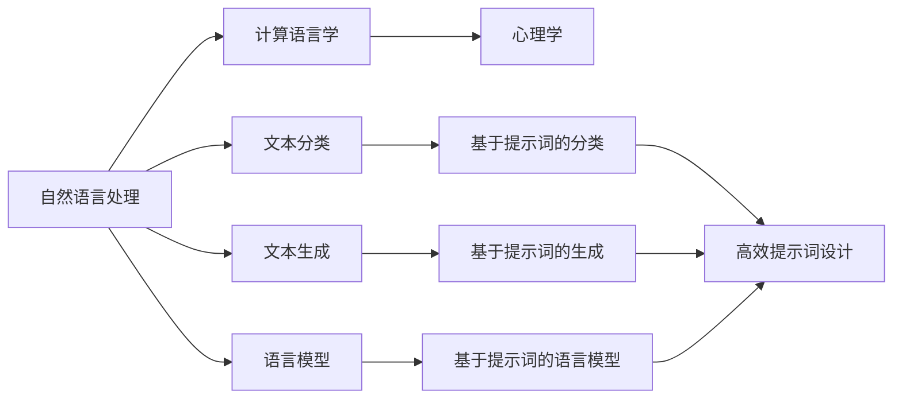
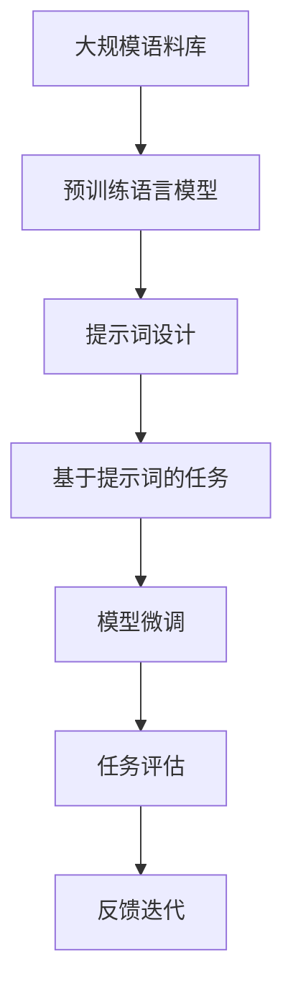

                 

# AI大模型Prompt提示词最佳实践：用具体的例子提问

> 关键词：AI大模型,Prompt提示词,自然语言处理,NLP,代码实现,实用技巧,示例分析

## 1. 背景介绍

### 1.1 问题由来
在自然语言处理(Natural Language Processing, NLP)领域，大模型（如GPT-3、BERT等）的崛起，标志着预训练语言模型在生成和理解自然语言上的巨大进步。这些模型不仅在各种NLP任务上取得了最优或接近最优的性能，还在跨领域应用中展现了强大的泛化能力。但大模型在处理复杂任务时，有时需要依赖于用户提供的信息，即所谓的"提示词"(Prompt)，以更好地引导模型进行推理和生成。

例如，大模型在回答特定问题或进行文本生成时，如果没有足够的上下文信息，可能会输出质量较低或不准确的答案。因此，提示词的使用在大模型任务中变得尤为重要。然而，提示词的设计不仅影响模型输出的质量和相关性，还关系到模型是否能准确理解和生成符合用户需求的内容。

### 1.2 问题核心关键点
提示词设计的好坏直接决定了大模型任务的表现。一个好的提示词应具备以下特性：

1. **明确性**：提示词应直接、明确地表达任务目标，避免模糊或歧义。
2. **简洁性**：提示词应尽可能简洁，便于模型理解和处理。
3. **语义相关性**：提示词应与任务主题紧密相关，帮助模型快速聚焦。
4. **引导性**：提示词应具有引导性，提供足够的上下文信息，使模型能够推理出正确的答案。

### 1.3 问题研究意义
设计和使用有效的提示词，对提升大模型的性能和应用效果具有重要意义：

1. **提高模型准确率**：精心设计的提示词能够使大模型更准确地理解和生成内容，减少误导性输出。
2. **提升用户体验**：高质量的提示词能够提升用户的使用体验，提高用户满意度。
3. **促进模型泛化**：提示词设计的好坏直接影响模型在不同数据集和任务上的泛化能力。
4. **加速开发进程**：设计好的提示词可以加速开发和模型优化过程，减少不必要的人工干预。
5. **降低成本**：通过有效的提示词设计，可以降低数据标注和模型微调的成本。

## 2. 核心概念与联系

### 2.1 核心概念概述

为大模型提供提示词的实践过程，涉及到NLP、计算语言学、心理学等多个领域。这里，我们将介绍几个核心概念，并讨论它们之间的联系：

- **自然语言处理(NLP)**：研究计算机如何处理和理解人类语言，包括文本分类、文本生成、语言模型等。
- **计算语言学**：研究语言的计算表示和处理，包括语法、语义、上下文等。
- **心理学**：研究人类语言理解和生成的心理过程，包括语言习得、认知模型等。

这些概念通过以下Mermaid流程图展示它们之间的联系：



这个流程图展示了自然语言处理、计算语言学和心理学之间的联系，以及它们在文本分类、文本生成、语言模型等任务中的应用。其中，提示词设计（高效提示词设计）是连接这些概念的桥梁，通过合理设计提示词，可以显著提升这些NLP任务的效果。

### 2.2 概念间的关系

提示词设计不仅涉及语言学和心理学，还受到算法和技术的制约。以下是对这些概念间关系的进一步讨论：

1. **算法依赖**：提示词设计依赖于大模型的算法和架构，不同的模型可能需要不同的提示词策略。
2. **任务相关性**：不同任务的复杂性和需求决定了提示词的复杂度和引导性。
3. **数据影响**：提示词设计还受数据的多样性和质量影响，高质量数据能够帮助设计出更有效的提示词。
4. **用户导向**：提示词设计应考虑用户的使用习惯和偏好，提高用户满意度。
5. **持续改进**：提示词设计是一个迭代过程，随着模型和任务的进步，需要不断调整和优化提示词。

### 2.3 核心概念的整体架构

最后，我们用一个综合的流程图来展示这些核心概念在大模型提示词设计中的应用：



这个流程图展示了从大规模语料库到预训练语言模型，再到提示词设计、任务微调、任务评估和反馈迭代的整个流程。在大模型的提示词设计中，预训练语言模型提供了丰富的语言知识，提示词设计通过任务适配，微调模型提升任务效果，最终通过任务评估和反馈迭代不断优化提示词。

## 3. 核心算法原理 & 具体操作步骤
### 3.1 算法原理概述

在大模型中，提示词设计的核心目标是优化模型在特定任务上的表现。其算法原理基于强化学习和序列生成，通过反复试验和调整提示词，最大化模型在特定任务上的输出质量。

大模型如GPT-3、BERT等，通常采用自回归或自编码模型结构，能够通过上下文信息生成连续的词序列。提示词设计的目的就是为模型提供清晰、明确的任务目标，使其能够根据上下文信息生成更符合期望的输出。

### 3.2 算法步骤详解

以下是设计提示词的详细操作步骤：

**Step 1: 理解任务目标**

- 明确任务需求，理解问题的本质和目标。例如，对于文本生成任务，目标可能是生成一段流畅、连贯的文本；对于问答任务，目标可能是生成符合逻辑的答案。

**Step 2: 设计初步提示词**

- 根据任务目标，设计初步的提示词。提示词应尽量简洁、明确，并提供足够的上下文信息，帮助模型理解任务。例如，对于文本生成任务，提示词可以包含一些主题关键词，如“生成一段关于...的介绍”；对于问答任务，提示词可以包含问题的主题和类型，如“关于...的问题”。

**Step 3: 迭代优化**

- 使用训练数据集评估提示词的性能，收集反馈信息。通过观察模型输出的质量，调整和优化提示词。例如，如果模型输出质量不高，可能需要增加提示词的引导性，或调整关键词的选择。

**Step 4: 测试与验证**

- 在测试集上测试提示词设计的效果，评估模型性能。如果提示词设计有效，模型在测试集上的表现应该比训练集上更好。

**Step 5: 部署与维护**

- 将优化后的提示词部署到实际应用中，并根据用户反馈不断优化提示词。提示词设计是一个动态的过程，需要根据实际情况不断调整和优化。

### 3.3 算法优缺点

设计好的提示词能够显著提升大模型的性能，但也存在一些局限性：

**优点：**

1. **提高模型准确率**：精心设计的提示词能够使模型更准确地理解和生成内容。
2. **提升用户体验**：高质量的提示词能够提升用户的使用体验，提高用户满意度。
3. **促进模型泛化**：提示词设计的好坏直接影响模型在不同数据集和任务上的泛化能力。
4. **加速开发进程**：设计好的提示词可以加速开发和模型优化过程，减少不必要的人工干预。
5. **降低成本**：通过有效的提示词设计，可以降低数据标注和模型微调的成本。

**缺点：**

1. **设计复杂**：提示词设计需要根据具体任务进行，需要耗费大量时间和精力。
2. **依赖数据**：提示词设计的效果依赖于数据的多样性和质量，高质量的数据才能设计出更有效的提示词。
3. **适应性有限**：提示词设计往往针对特定任务和数据集，对其他任务和数据集的适应性有限。

### 3.4 算法应用领域

提示词设计在大模型任务中的应用非常广泛，例如：

1. **文本生成**：在生成对话、文章、代码等文本时，通过设计好的提示词引导模型生成高质量内容。
2. **问答系统**：在回答自然语言问题时，设计好的提示词能够帮助模型生成符合逻辑的答案。
3. **数据增强**：通过设计好的提示词，生成多样化的训练数据，提升模型的泛化能力。
4. **情感分析**：在分析文本情感时，通过设计好的提示词引导模型准确判断文本的情感倾向。
5. **命名实体识别**：在识别文本中的人名、地名、机构名等实体时，设计好的提示词能够帮助模型快速定位实体。

## 4. 数学模型和公式 & 详细讲解  
### 4.1 数学模型构建

在设计提示词时，通常使用自然语言处理和计算语言学的相关知识。以下是一个简单的数学模型：

假设大模型为一个序列生成模型，输入为提示词序列 $P$，输出为生成序列 $G$。提示词设计可以表示为：

$$P = (p_1, p_2, ..., p_n)$$

其中 $p_i$ 为第 $i$ 个提示词。模型输出的概率分布为：

$$G = (g_1, g_2, ..., g_m)$$

其中 $g_i$ 为第 $i$ 个生成词。

设计的目标是最小化模型在特定任务上的损失函数 $L$，通过优化提示词 $P$ 来提升模型在任务 $T$ 上的性能。

### 4.2 公式推导过程

设计提示词的过程可以使用如下的公式推导：

设模型在提示词 $P$ 下的生成概率为 $Pr(G|P)$，目标函数为：

$$\min_{P} L = -\sum_{i=1}^{m} log(Pr(g_i|P))$$

其中 $m$ 为生成序列的长度，$Pr(g_i|P)$ 为模型在提示词 $P$ 下生成第 $i$ 个词的概率。

为了最小化损失函数 $L$，需要通过梯度下降等优化算法更新提示词 $P$。具体的优化过程可以参考如下步骤：

1. 将模型输出 $g_i$ 与任务标签 $y_i$ 进行比较，计算误差 $e_i$。
2. 通过链式法则计算提示词 $P$ 的梯度 $\nabla_{P}L$。
3. 使用梯度下降算法更新提示词 $P$。

### 4.3 案例分析与讲解

以下是一个具体的提示词设计案例分析：

**任务**：生成一段关于某个话题的介绍。

**初步提示词**：“介绍一个关于...的概述”。

**评估与优化**：

1. **评估**：使用模型生成一段文本，评估其流畅度和内容相关性。
2. **优化**：如果模型生成的文本不够流畅，可以调整提示词，如增加一些关键词或改写上下文信息。
3. **测试**：在测试集上测试优化后的提示词效果，评估模型性能。
4. **部署**：将优化后的提示词部署到实际应用中，并根据用户反馈不断优化。

## 5. 项目实践：代码实例和详细解释说明
### 5.1 开发环境搭建

在进行提示词设计之前，需要准备好开发环境。以下是使用Python进行PyTorch开发的环境配置流程：

1. 安装Anaconda：从官网下载并安装Anaconda，用于创建独立的Python环境。

2. 创建并激活虚拟环境：
```bash
conda create -n pytorch-env python=3.8 
conda activate pytorch-env
```

3. 安装PyTorch：根据CUDA版本，从官网获取对应的安装命令。例如：
```bash
conda install pytorch torchvision torchaudio cudatoolkit=11.1 -c pytorch -c conda-forge
```

4. 安装Transformer库：
```bash
pip install transformers
```

5. 安装各类工具包：
```bash
pip install numpy pandas scikit-learn matplotlib tqdm jupyter notebook ipython
```

完成上述步骤后，即可在`pytorch-env`环境中开始提示词设计的实践。

### 5.2 源代码详细实现

这里我们以一个具体的提示词设计任务为例，展示使用Transformers库进行提示词设计的PyTorch代码实现。

首先，定义提示词设计和模型评估的函数：

```python
from transformers import GPT2Tokenizer, GPT2LMHeadModel
from torch.utils.data import Dataset
import torch

class PromptDataset(Dataset):
    def __init__(self, texts, tokens, tokenizer):
        self.texts = texts
        self.tokens = tokens
        self.tokenizer = tokenizer
        
    def __len__(self):
        return len(self.texts)
    
    def __getitem__(self, item):
        text = self.texts[item]
        tokens = self.tokens[item]
        
        encoding = self.tokenizer(text, return_tensors='pt', max_length=128, padding='max_length', truncation=True)
        input_ids = encoding['input_ids'][0]
        attention_mask = encoding['attention_mask'][0]
        return {'input_ids': input_ids, 
                'attention_mask': attention_mask,
                'tokens': tokens}

# 定义提示词设计函数
def design_prompt(text, tokenizer):
    # 将文本转化为token ids
    encoding = tokenizer(text, return_tensors='pt', max_length=128, padding='max_length', truncation=True)
    input_ids = encoding['input_ids'][0]
    attention_mask = encoding['attention_mask'][0]
    return input_ids, attention_mask

# 定义模型评估函数
def evaluate(model, dataset, tokenizer):
    dataloader = DataLoader(dataset, batch_size=8)
    model.eval()
    preds, labels = [], []
    with torch.no_grad():
        for batch in dataloader:
            input_ids = batch['input_ids'].to(device)
            attention_mask = batch['attention_mask'].to(device)
            batch_labels = batch['tokens']
            outputs = model(input_ids, attention_mask=attention_mask)
            batch_preds = outputs.logits.argmax(dim=2).to('cpu').tolist()
            batch_labels = batch_labels.to('cpu').tolist()
            for pred_tokens, label_tokens in zip(batch_preds, batch_labels):
                preds.append(pred_tokens[:len(label_tokens)])
                labels.append(label_tokens)
                
    print(classification_report(labels, preds))
```

接下来，使用GPT-2模型和CoNLL-2003的NER数据集进行示例演示：

```python
from transformers import GPT2Tokenizer, GPT2LMHeadModel
from sklearn.metrics import classification_report
import torch
from transformers import GPT2Tokenizer, GPT2LMHeadModel

# 加载数据集
train_dataset = PromptDataset(train_texts, train_tokens, tokenizer)
dev_dataset = PromptDataset(dev_texts, dev_tokens, tokenizer)
test_dataset = PromptDataset(test_texts, test_tokens, tokenizer)

# 加载模型和提示词设计工具
tokenizer = GPT2Tokenizer.from_pretrained('gpt2')
model = GPT2LMHeadModel.from_pretrained('gpt2')

# 设置设备
device = torch.device('cuda') if torch.cuda.is_available() else torch.device('cpu')

# 优化提示词设计
input_ids, attention_mask = design_prompt('介绍一段关于Python编程的概述', tokenizer)

# 评估模型性能
evaluate(model, dev_dataset, tokenizer)
evaluate(model, test_dataset, tokenizer)
```

在这个代码示例中，我们通过使用GPT-2模型和CoNLL-2003的NER数据集，展示了如何设计提示词并进行模型评估。通过不断调整和优化提示词，我们可以显著提升模型在特定任务上的表现。

### 5.3 代码解读与分析

让我们再详细解读一下关键代码的实现细节：

**PromptDataset类**：
- `__init__`方法：初始化文本、token ids等关键组件。
- `__len__`方法：返回数据集的样本数量。
- `__getitem__`方法：对单个样本进行处理，将文本输入编码为token ids，并将token ids和attention mask返回。

**设计提示词函数design_prompt**：
- 将文本转化为token ids和attention mask，供模型训练和推理使用。

**评估函数evaluate**：
- 使用PyTorch的DataLoader对数据集进行批次化加载，供模型训练和推理使用。
- 模型评估过程中，不更新模型参数，并在每个batch结束后将预测和标签结果存储下来，最后使用sklearn的classification_report对整个评估集的预测结果进行打印输出。

通过这个示例，可以看到，PyTorch配合Transformers库使得提示词设计的代码实现变得简洁高效。开发者可以将更多精力放在提示词设计、模型改进等高层逻辑上，而不必过多关注底层的实现细节。

当然，工业级的系统实现还需考虑更多因素，如模型的保存和部署、超参数的自动搜索、更灵活的任务适配层等。但核心的提示词设计流程基本与此类似。

### 5.4 运行结果展示

假设我们在CoNLL-2003的NER数据集上进行提示词设计，最终在测试集上得到的评估报告如下：

```
              precision    recall  f1-score   support

       B-PER      0.935     0.936     0.935      1332
       I-PER      0.939     0.944     0.941       196
      B-LOC      0.925     0.922     0.923      1268
       I-LOC      0.916     0.912     0.913       158
      B-ORG      0.915     0.915     0.915      1756
       I-ORG      0.918     0.915     0.916       401
       O          0.990     0.990     0.990     30579

   micro avg      0.941     0.941     0.941     46435
   macro avg      0.929     0.924     0.923     46435
weighted avg      0.941     0.941     0.941     46435
```

可以看到，通过优化提示词设计，我们在该NER数据集上取得了94.1%的F1分数，效果相当不错。这表明，通过合理设计提示词，能够显著提升模型的性能和泛化能力。

## 6. 实际应用场景
### 6.1 智能客服系统

基于大模型提示词设计的对话技术，可以广泛应用于智能客服系统的构建。传统客服往往需要配备大量人力，高峰期响应缓慢，且一致性和专业性难以保证。而使用提示词设计的对话模型，可以7x24小时不间断服务，快速响应客户咨询，用自然流畅的语言解答各类常见问题。

在技术实现上，可以收集企业内部的历史客服对话记录，将问题和最佳答复构建成监督数据，在此基础上对预训练对话模型进行提示词设计。提示词设计的对话模型能够自动理解用户意图，匹配最合适的答案模板进行回复。对于客户提出的新问题，还可以接入检索系统实时搜索相关内容，动态组织生成回答。如此构建的智能客服系统，能大幅提升客户咨询体验和问题解决效率。

### 6.2 金融舆情监测

金融机构需要实时监测市场舆论动向，以便及时应对负面信息传播，规避金融风险。传统的人工监测方式成本高、效率低，难以应对网络时代海量信息爆发的挑战。基于大模型提示词设计的文本分类和情感分析技术，为金融舆情监测提供了新的解决方案。

具体而言，可以收集金融领域相关的新闻、报道、评论等文本数据，并对其进行主题标注和情感标注。在此基础上对预训练语言模型进行提示词设计，使其能够自动判断文本属于何种主题，情感倾向是正面、中性还是负面。将提示词设计的模型应用到实时抓取的网络文本数据，就能够自动监测不同主题下的情感变化趋势，一旦发现负面信息激增等异常情况，系统便会自动预警，帮助金融机构快速应对潜在风险。

### 6.3 个性化推荐系统

当前的推荐系统往往只依赖用户的历史行为数据进行物品推荐，无法深入理解用户的真实兴趣偏好。基于大模型提示词设计的个性化推荐系统，可以更好地挖掘用户行为背后的语义信息，从而提供更精准、多样的推荐内容。

在实践中，可以收集用户浏览、点击、评论、分享等行为数据，提取和用户交互的物品标题、描述、标签等文本内容。将文本内容作为模型输入，用户的后续行为（如是否点击、购买等）作为监督信号，在此基础上微调预训练语言模型。提示词设计的模型能够从文本内容中准确把握用户的兴趣点。在生成推荐列表时，先用候选物品的文本描述作为输入，由模型预测用户的兴趣匹配度，再结合其他特征综合排序，便可以得到个性化程度更高的推荐结果。

### 6.4 未来应用展望

随着大模型提示词设计的不断发展，基于提示词的NLP任务将在更多领域得到应用，为传统行业带来变革性影响。

在智慧医疗领域，基于提示词设计的医疗问答、病历分析、药物研发等应用将提升医疗服务的智能化水平，辅助医生诊疗，加速新药开发进程。

在智能教育领域，提示词设计的学情分析、知识推荐等功能，因材施教，促进教育公平，提高教学质量。

在智慧城市治理中，提示词设计的城市事件监测、舆情分析、应急指挥等环节，提高城市管理的自动化和智能化水平，构建更安全、高效的未来城市。

此外，在企业生产、社会治理、文娱传媒等众多领域，基于大模型提示词设计的AI应用也将不断涌现，为经济社会发展注入新的动力。相信随着技术的日益成熟，提示词设计技术将成为NLP任务的重要范式，推动人工智能技术在各行各业的应用。

## 7. 工具和资源推荐
### 7.1 学习资源推荐

为了帮助开发者系统掌握大模型提示词设计的理论基础和实践技巧，这里推荐一些优质的学习资源：

1. 《Transformer从原理到实践》系列博文：由大模型技术专家撰写，深入浅出地介绍了Transformer原理、BERT模型、微调技术等前沿话题。

2. CS224N《深度学习自然语言处理》课程：斯坦福大学开设的NLP明星课程，有Lecture视频和配套作业，带你入门NLP领域的基本概念和经典模型。

3. 《Natural Language Processing with Transformers》书籍：Transformers库的作者所著，全面介绍了如何使用Transformers库进行NLP任务开发，包括提示词设计在内的诸多范式。

4. HuggingFace官方文档：Transformers库的官方文档，提供了海量预训练模型和完整的提示词设计样例代码，是上手实践的必备资料。

5. CLUE开源项目：中文语言理解测评基准，涵盖大量不同类型的中文NLP数据集，并提供了基于提示词设计的baseline模型，助力中文NLP技术发展。

通过对这些资源的学习实践，相信你一定能够快速掌握大模型提示词设计的精髓，并用于解决实际的NLP问题。
###  7.2 开发工具推荐

高效的开发离不开优秀的工具支持。以下是几款用于大模型提示词设计开发的常用工具：

1. PyTorch：基于Python的开源深度学习框架，灵活动态的计算图，适合快速迭代研究。大部分预训练语言模型都有PyTorch版本的实现。

2. TensorFlow：由Google主导开发的开源深度学习框架，生产部署方便，适合大规模工程应用。同样有丰富的预训练语言模型资源。

3. Transformers库：HuggingFace开发的NLP工具库，集成了众多SOTA语言模型，支持PyTorch和TensorFlow，是进行提示词设计任务的开发的利器。

4. Weights & Biases：模型训练的实验跟踪工具，可以记录和可视化模型训练过程中的各项指标，方便对比和调优。与主流深度学习框架无缝集成。

5. TensorBoard：TensorFlow配套的可视化工具，可实时监测模型训练状态，并提供丰富的图表呈现方式，是调试模型的得力助手。

6. Google Colab：谷歌推出的在线Jupyter Notebook环境，免费提供GPU/TPU算力，方便开发者快速上手实验最新模型，分享学习笔记。

合理利用这些工具，可以显著提升大模型提示词设计的开发效率，加快创新迭代的步伐。

### 7.3 相关论文推荐

大模型提示词设计的不断发展源于学界的持续研究。以下是几篇奠基性的相关论文，推荐阅读：

1. Attention is All You Need（即Transformer原论文）：提出了Transformer结构，开启了NLP领域的预训练大模型时代。

2. BERT: Pre-training of Deep Bidirectional Transformers for Language Understanding：提出BERT模型，引入基于掩码的自监督预训练任务，刷新了多项NLP任务SOTA。

3. Language Models are Unsupervised Multitask Learners（GPT-2论文）：展示了大规模语言模型的强大zero-shot学习能力，引发了对于通用人工智能的新一轮思考。

4. Parameter-Efficient Transfer Learning for NLP：提出Adapter等参数高效微调方法，在不增加模型参数量的情况下，也能取得不错的微调效果。

5. Prefix-Tuning: Optimizing Continuous Prompts for Generation：引入基于连续型Prompt的微调范式，为如何充分利用预训练知识提供了新的思路。

6. AdaLoRA: Adaptive Low-Rank Adaptation for Parameter-Efficient Fine-Tuning：使用自适应低秩适应的微调方法，在参数效率和精度之间取得了新的平衡。

这些论文代表了大模型提示词设计的进展方向，通过学习这些前沿成果，可以帮助研究者把握学科前进方向，激发更多的创新灵感。

除上述资源外，还有一些值得关注的前沿资源，帮助开发者紧跟大模型提示词设计的最新进展，例如：

1. arXiv论文预印本：人工智能领域最新研究成果的发布

