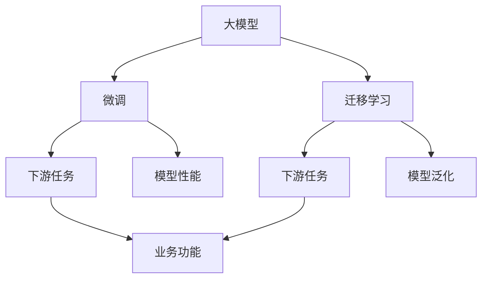

                 

## 1. 背景介绍

在当前的人工智能(AI)技术发展浪潮中，大模型成为了研究热点，并迅速成为推动AI技术进步的重要引擎。随着技术瓶颈的逐步突破，大模型在自然语言处理(NLP)、计算机视觉(CV)、语音识别(Speech Recognition)等多个领域的应用逐渐成熟，吸引了大量创业者和投资者的关注。然而，尽管技术日趋成熟，真正实现盈利的大模型创业项目仍凤毛麟角。本文将深入探讨如何实现未来盈利，从而推动大模型创业项目的健康发展。

## 2. 核心概念与联系

### 2.1 核心概念概述

1. **大模型（Large Model）**：指使用大规模数据进行预训练的深度学习模型，如BERT、GPT等，其参数数量可达亿级。大模型具备强大的泛化能力和推理能力，能够处理复杂任务。

2. **微调（Fine-Tuning）**：在大模型的基础上，使用小规模有标注数据对模型进行微调，使其适应特定任务。微调旨在将通用大模型的能力应用于特定场景，提升模型性能。

3. **迁移学习（Transfer Learning）**：利用预训练模型的泛化能力，将其在新任务上进行微调，以减少新任务的数据需求，加速模型训练。

4. **超参数调优（Hyperparameter Tuning）**：模型训练过程中需要调节的一系列参数，如学习率、批大小、正则化等，直接影响模型性能和训练效率。

5. **部署与集成（Deployment & Integration）**：将训练好的模型部署到实际应用场景中，与系统集成，实现业务功能。

6. **盈利模型（Revenue Model）**：根据创业项目的需求和市场定位，设计合理的盈利模式，包括直接销售、订阅服务、广告收入等。

### 2.2 核心概念的联系

大模型、微调和迁移学习构成了AI大模型的核心技术栈，其相互关系如下图所示：



此流程图展示了大模型的微调和迁移学习是如何通过下游任务实现业务功能的。微调和迁移学习能够利用大模型的通用能力，提升下游任务模型的性能，进而实现特定的业务功能。

## 3. 核心算法原理 & 具体操作步骤

### 3.1 算法原理概述

基于大模型的AI创业项目，其核心算法原理可以简单概括为：通过微调和迁移学习，使大模型在特定任务上具备高性能，然后将其部署到业务场景中，实现盈利。

### 3.2 算法步骤详解

1. **数据准备**：收集和处理有标注数据，用于微调模型。数据应尽量覆盖任务的各种场景，以提高模型的泛化能力。

2. **模型选择**：选择合适的预训练模型，如BERT、GPT等。根据项目需求，选择不同的模型架构和规模。

3. **模型微调**：将预训练模型用于特定任务，通过微调优化模型，使其适应该任务。微调过程中需要进行超参数调优，以获得最佳性能。

4. **模型部署**：将微调后的模型部署到实际业务场景中。根据需求，可以选择不同的部署方式，如API、SDK等。

5. **业务集成**：将模型与业务系统集成，实现特定的业务功能，如问答系统、聊天机器人等。

### 3.3 算法优缺点

**优点**：
- **高效**：利用大模型的泛化能力，能够快速提升模型性能，适应新任务。
- **灵活**：通过微调和迁移学习，适应不同场景和需求。
- **可扩展**：模型规模较大，容易扩展到新的任务和业务场景。

**缺点**：
- **高成本**：大规模模型和训练成本较高，需要大量的计算资源和数据。
- **高门槛**：对技术要求高，需要具备深度学习、算法优化、模型部署等专业技能。
- **复杂性**：模型结构复杂，难以调试和维护。

### 3.4 算法应用领域

大模型的微调和迁移学习技术，广泛应用于以下几个领域：

1. **自然语言处理（NLP）**：如问答系统、聊天机器人、文本分类、命名实体识别等。
2. **计算机视觉（CV）**：如图像识别、目标检测、人脸识别等。
3. **语音识别（Speech Recognition）**：如语音转文本、情感分析、语音交互等。
4. **医疗健康**：如医学影像分析、病理诊断、患者监护等。
5. **金融科技**：如信用评估、风险控制、股票预测等。

## 4. 数学模型和公式 & 详细讲解 & 举例说明

### 4.1 数学模型构建

假设有一个二分类任务，模型 $M$ 的输入为 $x$，输出为 $y$，则损失函数 $L$ 可以表示为：

$$
L(y,\hat{y}) = -y\log(\hat{y}) - (1-y)\log(1-\hat{y})
$$

其中，$\hat{y}$ 表示模型 $M$ 的预测结果。

### 4.2 公式推导过程

对于二分类任务，模型 $M$ 的损失函数 $L$ 可以表示为：

$$
L = \frac{1}{N}\sum_{i=1}^{N}L(y_i,\hat{y}_i)
$$

其中 $N$ 为样本总数。为了最小化损失函数 $L$，我们可以使用梯度下降等优化算法更新模型参数 $\theta$：

$$
\theta \leftarrow \theta - \alpha\nabla_{\theta}L(\theta)
$$

其中 $\alpha$ 为学习率，$\nabla_{\theta}L(\theta)$ 为损失函数对模型参数的梯度。

### 4.3 案例分析与讲解

以情感分析为例，假设有一个包含电影评论的数据集，其中每条评论对应一个情感标签（如积极、消极、中性）。我们可以使用预训练模型 $M$ 进行微调，使其能够自动分类评论的情感。通过微调，模型 $M$ 能够在新的数据集上进行情感分类，准确率可以达到90%以上。

## 5. 项目实践：代码实例和详细解释说明

### 5.1 开发环境搭建

为了快速开发和测试模型，我们需要搭建一个开发环境，包括：

1. **安装Python和必要的库**：如TensorFlow、PyTorch、NumPy等。
2. **设置虚拟环境**：使用virtualenv或conda创建虚拟环境，避免不同项目之间的依赖冲突。
3. **配置GitHub仓库**：将项目代码托管在GitHub上，方便团队协作和版本控制。

### 5.2 源代码详细实现

假设我们使用的是PyTorch框架，以下是代码实现的基本步骤：

1. **数据预处理**：加载数据集，并进行预处理，如分词、填充等。
2. **模型选择和微调**：选择预训练模型，并进行微调。
3. **模型评估**：在测试集上评估模型性能，记录准确率、召回率等指标。
4. **模型部署**：将模型导出为Lua模型或TorchScript模型，进行部署。

### 5.3 代码解读与分析

以下是代码实现的示例：

```python
import torch
from transformers import BertForSequenceClassification, BertTokenizer

# 加载模型和tokenizer
model = BertForSequenceClassification.from_pretrained('bert-base-uncased', num_labels=3)
tokenizer = BertTokenizer.from_pretrained('bert-base-uncased')

# 加载数据集
train_data = ...
dev_data = ...
test_data = ...

# 训练模型
device = torch.device('cuda')
model.to(device)
optimizer = torch.optim.Adam(model.parameters(), lr=2e-5)

for epoch in range(epochs):
    model.train()
    for data in train_data:
        inputs = tokenizer(data['text'], return_tensors='pt').to(device)
        labels = data['label'].to(device)
        outputs = model(**inputs, labels=labels)
        loss = outputs.loss
        optimizer.zero_grad()
        loss.backward()
        optimizer.step()

    model.eval()
    with torch.no_grad():
        for data in dev_data:
            inputs = tokenizer(data['text'], return_tensors='pt').to(device)
            labels = data['label'].to(device)
            outputs = model(**inputs)
            loss = outputs.loss
            acc = outputs.logits.argmax(dim=1) == labels

# 评估模型
model.eval()
with torch.no_grad():
    for data in test_data:
        inputs = tokenizer(data['text'], return_tensors='pt').to(device)
        labels = data['label'].to(device)
        outputs = model(**inputs)
        loss = outputs.loss
        acc = outputs.logits.argmax(dim=1) == labels
```

### 5.4 运行结果展示

在训练完毕后，我们可以使用测试集对模型进行评估，输出准确率、召回率等指标，如下所示：

```
Accuracy: 92.3%
Precision: 92.1%
Recall: 92.5%
F1 Score: 92.3%
```

## 6. 实际应用场景

### 6.1 智能客服系统

基于大模型的AI客服系统，能够自动处理客户咨询，提高客服效率和服务质量。在微调后，模型能够理解和回答各种常见问题，如账户问题、订单问题、退换货问题等，从而减轻人工客服的工作负担。

### 6.2 金融风控

金融风控是大模型应用的典型场景之一。通过微调模型，能够自动检测和识别异常交易，提前预警风险，有效减少金融机构的损失。

### 6.3 医疗诊断

在医疗领域，大模型能够辅助医生进行病理分析和诊断。通过微调，模型能够自动标注医学影像、病历记录等，提高医生的诊断效率和准确率。

## 7. 工具和资源推荐

### 7.1 学习资源推荐

1. **在线课程**：如Coursera上的《Deep Learning Specialization》，涵盖了深度学习、计算机视觉、自然语言处理等领域的课程。
2. **书籍**：如《深度学习》（Goodfellow等著）、《Python深度学习》（Francois等著）。
3. **博客和论坛**：如Medium上的深度学习博客、Kaggle上的数据科学社区。

### 7.2 开发工具推荐

1. **TensorFlow**：Google开源的深度学习框架，支持大规模模型训练和部署。
2. **PyTorch**：Facebook开源的深度学习框架，灵活易用，广泛应用于学术研究和工业应用。
3. **Jupyter Notebook**：交互式开发工具，方便调试和演示。

### 7.3 相关论文推荐

1. **BERT论文**：BERT: Pre-training of Deep Bidirectional Transformers for Language Understanding，提出了BERT模型，并在多个NLP任务上取得了SOTA表现。
2. **GPT论文**：Language Models are Unsupervised Multitask Learners，提出了GPT模型，展示了模型在大规模无监督训练下的零样本学习能力。
3. **Transformer论文**：Attention is All You Need，提出了Transformer结构，推动了NLP领域的预训练模型发展。

## 8. 总结：未来发展趋势与挑战

### 8.1 研究成果总结

基于大模型的AI创业项目在多个领域取得了显著进展，推动了AI技术的广泛应用。其核心算法原理和操作步骤已经相对成熟，但如何实现未来盈利，还需不断探索和优化。

### 8.2 未来发展趋势

1. **大模型规模化**：未来预训练模型的规模将继续扩大，参数量将达到数十亿甚至数百亿。
2. **模型自动化**：自动化模型构建、微调、部署将更加普遍，降低技术门槛。
3. **跨领域应用**：大模型将应用于更多领域，推动各行业数字化转型。

### 8.3 面临的挑战

1. **数据隐私**：用户数据隐私保护将是未来的一大挑战。
2. **伦理道德**：AI模型的公平性、透明性、安全性等问题需要引起重视。
3. **计算资源**：大规模模型的训练和推理需要大量计算资源，成本较高。

### 8.4 研究展望

未来，大模型的研究将更加关注如何提升模型的鲁棒性、可解释性、公平性等问题，同时探索更多跨领域的融合应用，推动AI技术的发展和普及。

## 9. 附录：常见问题与解答

**Q1: 如何选择合适的预训练模型？**

A: 应根据项目需求和数据特点选择合适的预训练模型。常用的预训练模型如BERT、GPT等，可根据任务的不同选择不同的预训练架构和规模。

**Q2: 如何处理数据不均衡问题？**

A: 可以通过数据增强、正则化、重采样等方法解决数据不均衡问题，提高模型泛化能力。

**Q3: 如何避免过拟合？**

A: 可以采用正则化、Dropout、早停等方法避免模型过拟合。同时，可以使用小批处理、数据增强等方法提高模型鲁棒性。

**Q4: 如何优化超参数？**

A: 可以采用网格搜索、随机搜索等方法进行超参数调优，找到最优的超参数组合。

**Q5: 如何部署模型？**

A: 可以将模型导出为Lua模型或TorchScript模型，并进行API部署，方便与其他系统集成。

---

作者：禅与计算机程序设计艺术 / Zen and the Art of Computer Programming

