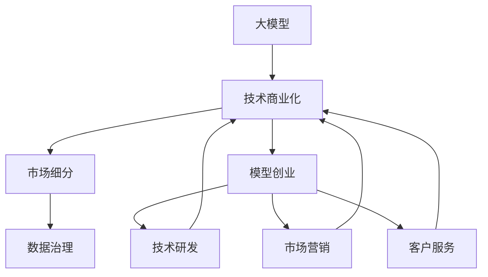

                 

# AI大模型创业：如何应对未来市场挑战？

> 关键词：大模型创业,市场挑战,策略优化,资源配置,技术创新,可持续性

## 1. 背景介绍

### 1.1 问题由来

随着人工智能(AI)技术的迅猛发展，大模型（如BERT、GPT-3等）在自然语言处理（NLP）、计算机视觉、语音识别等多个领域取得了显著成效，为各行业提供了强大的数据驱动解决方案。尽管大模型在技术层面已经日趋成熟，但其商业化落地和市场应用仍面临诸多挑战。特别是对于AI初创公司而言，如何在激烈的市场竞争中脱颖而出，获取市场份额，实现商业化成功，是一个亟待解决的问题。

### 1.2 问题核心关键点

在AI大模型创业过程中，核心挑战主要集中在以下几个方面：

- **技术研发投入高**：研发高质量大模型需要大量的算力、数据和人才资源，成本高昂。
- **市场接受度低**：尽管大模型技术先进，但用户对AI技术仍持怀疑态度，接受度较低。
- **竞争环境激烈**：众多科技巨头和初创企业都在竞争大模型市场，导致资源、人才和资金争夺战激烈。
- **应用场景限制**：大模型的应用场景虽然广泛，但需要大规模、高精度的数据进行训练，限制了其在某些特定领域的应用。
- **伦理和法律风险**：大模型可能带来偏见和歧视，并面临隐私和数据安全等伦理和法律问题。

解决这些问题需要全面、系统的方法和策略，本文将详细介绍如何应对这些挑战，确保AI大模型创业的顺利进行。

## 2. 核心概念与联系

### 2.1 核心概念概述

为更好地理解AI大模型创业及其应对市场挑战的策略，本节将介绍几个密切相关的核心概念：

- **大模型（Large Model）**：指通过大规模数据预训练获得的高级神经网络模型，具有强大的数据处理和模式识别能力。
- **模型创业（Model Entrepreneurship）**：指通过开发、销售和使用高质量AI大模型，获得商业收益的创业模式。
- **技术商业化（Technology Commercialization）**：指将AI技术转化为可用的商业产品或服务，满足市场需求的过程。
- **市场细分（Market Segmentation）**：指将市场划分为具有相似需求和特征的子市场，针对每个子市场提供定制化的解决方案。
- **数据治理（Data Governance）**：指在数据收集、存储、处理和使用过程中，确保数据质量、安全和隐私的一系列管理措施。

这些核心概念之间存在紧密联系，共同构成了AI大模型创业的基本框架。

### 2.2 概念间的关系

这些核心概念之间的关系可以通过以下Mermaid流程图来展示：



这个流程图展示了大模型创业的基本流程：

1. 首先开发高质量的大模型，进行技术商业化。
2. 然后根据市场需求对市场进行细分，针对不同子市场提供定制化解决方案。
3. 同时进行数据治理，确保数据质量和隐私安全。
4. 最后进行市场营销和客户服务，实现商业化成功。

在实际应用中，这些环节需要协调配合，才能有效推动AI大模型的创业进程。

## 3. 核心算法原理 & 具体操作步骤
### 3.1 算法原理概述

AI大模型创业过程中，关键的技术算法包括：

- **深度学习（Deep Learning）**：基于神经网络的模型训练方法，通过大量数据进行训练，提取特征，实现模式识别。
- **迁移学习（Transfer Learning）**：将在一个任务上训练好的模型迁移到另一个任务上，通过微调获得更好的性能。
- **自监督学习（Self-Supervised Learning）**：利用无标签数据进行模型训练，减少对标注数据的依赖。
- **强化学习（Reinforcement Learning）**：通过试错过程优化模型，获得最优策略。

这些算法共同构成了AI大模型的技术核心，通过合理组合和应用，可以实现大模型的高效训练和商业化落地。

### 3.2 算法步骤详解

AI大模型创业的具体操作步骤如下：

1. **需求分析与市场调研**：了解市场需求和用户痛点，进行市场细分，确定目标用户群体。
2. **数据收集与准备**：收集相关领域的数据，进行清洗、标注和预处理，确保数据质量和可用性。
3. **模型设计与训练**：选择合适的模型架构，进行训练和优化，提高模型性能。
4. **模型微调与优化**：根据特定任务需求，对模型进行微调，优化模型结构和参数，提升性能。
5. **应用开发与部署**：开发产品原型，进行测试和优化，部署到生产环境。
6. **市场营销与推广**：进行市场推广，提升品牌知名度和市场接受度。
7. **客户服务和反馈**：提供客户服务，收集用户反馈，不断优化产品和服务。

通过以上步骤，可以实现AI大模型的成功创业。

### 3.3 算法优缺点

AI大模型创业的算法有如下优缺点：

**优点**：
- **技术领先**：深度学习等先进技术大幅提升数据处理和模式识别能力。
- **模型通用性**：迁移学习和大模型预训练技术使得模型适用于多种任务。
- **成本效益高**：自监督学习和强化学习减少对标注数据的依赖，降低成本。

**缺点**：
- **计算资源需求高**：深度学习和强化学习需要大量计算资源，成本较高。
- **数据依赖性强**：高质量数据的获取和标注困难，限制了模型应用范围。
- **算法复杂度**：算法实现复杂，需要大量专业知识。
- **伦理和法律风险**：模型可能存在偏见和歧视，带来伦理和法律风险。

尽管存在这些缺点，但通过合理的策略和资源配置，可以有效地解决这些问题，实现AI大模型的成功创业。

### 3.4 算法应用领域

AI大模型创业技术广泛应用于多个领域，如金融、医疗、教育、自动驾驶等。

- **金融领域**：利用大模型进行风险评估、欺诈检测、投资决策等。
- **医疗领域**：利用大模型进行疾病诊断、治疗方案推荐、药物研发等。
- **教育领域**：利用大模型进行智能推荐、情感分析、语音识别等。
- **自动驾驶**：利用大模型进行路径规划、场景理解、行为预测等。

## 4. 数学模型和公式 & 详细讲解 & 举例说明

### 4.1 数学模型构建

在AI大模型创业中，常用的数学模型包括：

- **神经网络（Neural Network）**：基本的模型结构，通过输入、隐藏和输出层，进行特征提取和模式识别。
- **损失函数（Loss Function）**：衡量模型预测和实际标签之间的差异，常用的有交叉熵损失（Cross Entropy Loss）。
- **优化算法（Optimization Algorithm）**：如梯度下降（Gradient Descent）、Adam等，用于模型参数的更新。

### 4.2 公式推导过程

以下以深度学习中的反向传播算法为例，推导其公式：

设神经网络模型为 $f(x;w)$，其中 $w$ 为模型参数，$x$ 为输入数据，$y$ 为标签。则损失函数 $L$ 为：

$$
L(y,f(x;w)) = \sum_{i=1}^n(y_i - f(x_i;w))^2
$$

其中 $n$ 为样本数。反向传播算法的目标是最小化损失函数 $L$。根据链式法则，损失函数对 $w$ 的梯度为：

$$
\nabla_{w}L = \sum_{i=1}^n\nabla_{w}(f(x_i;w) - y_i)^2
$$

通过反向传播算法，可以高效计算模型参数的梯度，并进行优化。

### 4.3 案例分析与讲解

假设一个金融领域的大模型创业项目，利用深度学习模型进行信用风险评估。模型输入为用户的信用记录、贷款金额等，输出为用户的信用评分。

**数据准备**：
- 收集历史信用记录数据，进行清洗和标注。
- 划分为训练集、验证集和测试集。

**模型设计**：
- 选择合适的网络结构，如卷积神经网络（CNN）或循环神经网络（RNN）。
- 设置隐藏层、神经元个数等超参数。

**训练与优化**：
- 使用交叉熵损失函数，进行前向传播和反向传播。
- 选择合适的优化算法，如Adam，更新模型参数。
- 在验证集上评估模型性能，调整超参数。

**微调与优化**：
- 对模型进行微调，调整网络结构、学习率等参数。
- 使用梯度积累等技术，提高训练效率。

**应用开发**：
- 开发API接口，实现模型的集成和调用。
- 开发用户界面，提高用户体验。

**市场营销与推广**：
- 利用社交媒体、展会等渠道进行宣传。
- 提供免费试用，吸引用户。

## 5. 项目实践：代码实例和详细解释说明
### 5.1 开发环境搭建

在进行AI大模型创业实践前，需要准备好开发环境。以下是使用Python进行PyTorch开发的环境配置流程：

1. 安装Anaconda：从官网下载并安装Anaconda，用于创建独立的Python环境。

2. 创建并激活虚拟环境：
```bash
conda create -n pytorch-env python=3.8 
conda activate pytorch-env
```

3. 安装PyTorch：根据CUDA版本，从官网获取对应的安装命令。例如：
```bash
conda install pytorch torchvision torchaudio cudatoolkit=11.1 -c pytorch -c conda-forge
```

4. 安装各类工具包：
```bash
pip install numpy pandas scikit-learn matplotlib tqdm jupyter notebook ipython
```

完成上述步骤后，即可在`pytorch-env`环境中开始创业实践。

### 5.2 源代码详细实现

这里我们以一个简单的信用风险评估项目为例，给出使用PyTorch进行深度学习模型开发的完整代码实现。

```python
import torch
import torch.nn as nn
import torch.optim as optim
from sklearn.model_selection import train_test_split
from torch.utils.data import DataLoader

class CreditRiskNet(nn.Module):
    def __init__(self, input_dim, hidden_dim, output_dim):
        super(CreditRiskNet, self).__init__()
        self.fc1 = nn.Linear(input_dim, hidden_dim)
        self.fc2 = nn.Linear(hidden_dim, output_dim)
        self.relu = nn.ReLU()

    def forward(self, x):
        x = self.fc1(x)
        x = self.relu(x)
        x = self.fc2(x)
        return x

# 加载数据
def load_data():
    data = pd.read_csv('credit_data.csv')
    X = data.drop('target', axis=1)
    y = data['target']
    return X, y

# 划分数据集
X, y = load_data()
X_train, X_test, y_train, y_test = train_test_split(X, y, test_size=0.2, random_state=42)

# 定义模型
model = CreditRiskNet(input_dim=X_train.shape[1], hidden_dim=32, output_dim=1)

# 定义损失函数和优化器
criterion = nn.BCELoss()
optimizer = optim.Adam(model.parameters(), lr=0.001)

# 训练模型
def train(model, data_loader, criterion, optimizer, num_epochs=10, batch_size=32):
    device = torch.device('cuda' if torch.cuda.is_available() else 'cpu')
    model.to(device)

    for epoch in range(num_epochs):
        model.train()
        running_loss = 0.0
        for i, data in enumerate(data_loader, 0):
            inputs, labels = data[0].to(device), data[1].to(device)
            optimizer.zero_grad()
            outputs = model(inputs)
            loss = criterion(outputs, labels)
            loss.backward()
            optimizer.step()
            running_loss += loss.item()
        print(f'Epoch {epoch+1}, loss: {running_loss/len(data_loader):.4f}')

# 测试模型
def test(model, data_loader):
    model.eval()
    correct = 0
    total = 0
    with torch.no_grad():
        for data in data_loader:
            inputs, labels = data[0].to(device), data[1].to(device)
            outputs = model(inputs)
            _, predicted = torch.max(outputs.data, 1)
            total += labels.size(0)
            correct += (predicted == labels).sum().item()
    print(f'Accuracy: {(100 * correct / total):.2f}%')

# 加载数据
data_loader = DataLoader(X_train, y_train, batch_size=32, shuffle=True)

# 训练模型
train(model, data_loader, criterion, optimizer)

# 测试模型
test(model, DataLoader(X_test, y_test))
```

以上就是使用PyTorch进行信用风险评估项目开发的完整代码实现。可以看到，通过适当的代码封装，可以简化深度学习模型的开发过程，提高效率。

### 5.3 代码解读与分析

让我们再详细解读一下关键代码的实现细节：

**CreditRiskNet类**：
- `__init__`方法：初始化网络结构，包含两个全连接层和激活函数。
- `forward`方法：前向传播计算模型的输出。

**数据加载与处理**：
- `load_data`方法：加载数据集，划分为训练集和测试集。
- `train`和`test`函数：定义模型训练和测试流程，使用DataLoader进行数据批次化加载。

**模型训练与测试**：
- 在训练函数中，定义损失函数、优化器，并在每个epoch结束后输出平均损失。
- 在测试函数中，计算模型在测试集上的准确率。

**运行结果展示**：
- 在训练过程中，不断输出每个epoch的平均损失。
- 在测试过程中，输出模型的准确率。

通过以上代码，可以完成一个简单的AI大模型创业项目，并进行训练和测试。

## 6. 实际应用场景
### 6.1 金融风险管理

在金融领域，利用大模型进行风险管理，可以显著提高风险评估的准确性和效率。金融机构可以利用大模型对客户的信用记录、交易历史等数据进行分析，预测客户的违约风险，从而制定更科学的信贷策略。

例如，一个银行可以利用深度学习模型对客户的还款记录、收入情况、消费行为等进行分析，预测客户未来的还款能力。通过这种方式，银行可以在风险可控的前提下，拓展业务规模，提高服务质量。

### 6.2 医疗疾病预测

在医疗领域，利用大模型进行疾病预测，可以提高诊断的准确性和效率。医院可以利用大模型对患者的病历、症状等数据进行分析，预测患者的疾病类型和严重程度，从而制定更科学的诊疗方案。

例如，一家医院可以利用深度学习模型对患者的检查结果、病史等数据进行分析，预测患者的疾病类型和严重程度。通过这种方式，医院可以提高诊断的准确性，降低误诊率，提高患者满意度。

### 6.3 教育智能推荐

在教育领域，利用大模型进行智能推荐，可以提升学生的学习体验和教育效果。教育机构可以利用大模型对学生的学习行为、兴趣偏好等数据进行分析，推荐适合的学习内容和资源。

例如，一个在线教育平台可以利用深度学习模型对学生的学习行为、考试成绩等数据进行分析，推荐适合的学习内容和资源。通过这种方式，平台可以提升学生的学习效果，提高用户黏性，增强平台的竞争力。

## 7. 工具和资源推荐
### 7.1 学习资源推荐

为了帮助开发者系统掌握AI大模型创业的理论基础和实践技巧，这里推荐一些优质的学习资源：

1. 《深度学习》系列书籍：由Yoshua Bengio、Ian Goodfellow、Aaron Courville等深度学习专家共同编写，系统介绍了深度学习的理论和实践。
2. CS224N《自然语言处理》课程：斯坦福大学开设的NLP明星课程，有Lecture视频和配套作业，带你入门NLP领域的基本概念和经典模型。
3. 《Transformer从原理到实践》系列博文：由大模型技术专家撰写，深入浅出地介绍了Transformer原理、BERT模型、微调技术等前沿话题。
4. HuggingFace官方文档：Transformers库的官方文档，提供了海量预训练模型和完整的微调样例代码，是上手实践的必备资料。
5. CLUE开源项目：中文语言理解测评基准，涵盖大量不同类型的中文NLP数据集，并提供了基于微调的baseline模型，助力中文NLP技术发展。

通过对这些资源的学习实践，相信你一定能够快速掌握AI大模型创业的精髓，并用于解决实际的NLP问题。

### 7.2 开发工具推荐

高效的开发离不开优秀的工具支持。以下是几款用于AI大模型创业开发的常用工具：

1. PyTorch：基于Python的开源深度学习框架，灵活动态的计算图，适合快速迭代研究。大部分预训练语言模型都有PyTorch版本的实现。
2. TensorFlow：由Google主导开发的开源深度学习框架，生产部署方便，适合大规模工程应用。同样有丰富的预训练语言模型资源。
3. Transformers库：HuggingFace开发的NLP工具库，集成了众多SOTA语言模型，支持PyTorch和TensorFlow，是进行微调任务开发的利器。
4. Weights & Biases：模型训练的实验跟踪工具，可以记录和可视化模型训练过程中的各项指标，方便对比和调优。与主流深度学习框架无缝集成。
5. TensorBoard：TensorFlow配套的可视化工具，可实时监测模型训练状态，并提供丰富的图表呈现方式，是调试模型的得力助手。

合理利用这些工具，可以显著提升AI大模型创业的开发效率，加快创新迭代的步伐。

### 7.3 相关论文推荐

AI大模型创业技术的发展源于学界的持续研究。以下是几篇奠基性的相关论文，推荐阅读：

1. Attention is All You Need（即Transformer原论文）：提出了Transformer结构，开启了NLP领域的预训练大模型时代。
2. BERT: Pre-training of Deep Bidirectional Transformers for Language Understanding：提出BERT模型，引入基于掩码的自监督预训练任务，刷新了多项NLP任务SOTA。
3. Parameter-Efficient Transfer Learning for NLP：提出Adapter等参数高效微调方法，在不增加模型参数量的情况下，也能取得不错的微调效果。
4. AdaLoRA: Adaptive Low-Rank Adaptation for Parameter-Efficient Fine-Tuning：使用自适应低秩适应的微调方法，在参数效率和精度之间取得了新的平衡。

这些论文代表了大模型创业技术的发展脉络。通过学习这些前沿成果，可以帮助研究者把握学科前进方向，激发更多的创新灵感。

除上述资源外，还有一些值得关注的前沿资源，帮助开发者紧跟AI大模型创业技术的最新进展，例如：

1. arXiv论文预印本：人工智能领域最新研究成果的发布平台，包括大量尚未发表的前沿工作，学习前沿技术的必读资源。
2. 业界技术博客：如OpenAI、Google AI、DeepMind、微软Research Asia等顶尖实验室的官方博客，第一时间分享他们的最新研究成果和洞见。
3. 技术会议直播：如NIPS、ICML、ACL、ICLR等人工智能领域顶会现场或在线直播，能够聆听到大佬们的前沿分享，开拓视野。
4. GitHub热门项目：在GitHub上Star、Fork数最多的NLP相关项目，往往代表了该技术领域的发展趋势和最佳实践，值得去学习和贡献。
5. 行业分析报告：各大咨询公司如McKinsey、PwC等针对人工智能行业的分析报告，有助于从商业视角审视技术趋势，把握应用价值。

总之，对于AI大模型创业技术的学习和实践，需要开发者保持开放的心态和持续学习的意愿。多关注前沿资讯，多动手实践，多思考总结，必将收获满满的成长收益。

## 8. 总结：未来发展趋势与挑战

### 8.1 研究成果总结

本文对AI大模型创业过程中如何应对未来市场挑战进行了全面系统的介绍。首先阐述了AI大模型创业的背景和意义，明确了市场细分、数据治理、技术商业化等核心挑战。其次，从原理到实践，详细讲解了深度学习、迁移学习等关键技术，给出了完整代码实例，展示了AI大模型的成功应用。最后，对未来技术趋势和面临的挑战进行了总结，提出了相应的解决策略。

通过本文的系统梳理，可以看到，AI大模型创业需要综合考虑技术、市场、资源等多方面因素，通过合理配置，才能实现商业成功。未来，伴随技术的不断进步和市场的逐步成熟，AI大模型创业将迎来更广阔的发展空间。

### 8.2 未来发展趋势

展望未来，AI大模型创业技术将呈现以下几个发展趋势：

1. **技术演进加速**：深度学习、迁移学习等技术将不断进步，提升AI大模型的性能和应用范围。
2. **市场细分深入**：更多垂直领域的应用场景将涌现，AI大模型将更加精细化和定制化。
3. **数据治理强化**：数据隐私和安全问题将受到更多关注，数据治理技术将不断发展。
4. **生态系统完善**：更多的开源项目和商业平台将出现，构建完整的AI大模型生态系统。
5. **国际合作加强**：全球范围内的技术合作将更加频繁，推动AI大模型的国际标准化。

### 8.3 面临的挑战

尽管AI大模型创业技术已经取得了显著进展，但在走向商业化的过程中，仍面临诸多挑战：

1. **技术壁垒高**：深度学习等先进技术需要大量专业知识，入门门槛较高。
2. **资源需求大**：高质量数据和算力资源获取困难，成本较高。
3. **市场接受度低**：用户对AI技术仍持怀疑态度，推广难度较大。
4. **伦理和法律风险**：模型可能存在偏见和歧视，带来伦理和法律问题。
5. **商业模式单一**：当前主要依赖SaaS模式，难以适应多样化的市场需求。

### 8.4 研究展望

面对AI大模型创业所面临的种种挑战，未来的研究需要在以下几个方面寻求新的突破：

1. **技术普及推广**：通过更多开源项目和教育资源，降低AI大模型的技术门槛，促进技术普及。
2. **商业模型多样化**：探索更多的商业模型，如API服务、订阅制、按需付费等，满足多样化的市场需求。
3. **伦理和法律监管**：加强AI大模型伦理和法律监管，保障数据隐私和安全。
4. **国际合作深化**：加强国际合作，推动AI大模型的标准化和国际化。

通过这些努力，AI大模型创业技术将逐步成熟，为更多企业带来商业价值和创新动力。未来，伴随技术的不断进步和市场的逐步成熟，AI大模型创业将迎来更广阔的发展空间，推动人工智能技术的广泛应用。

## 9. 附录：常见问题与解答

**Q1：AI大模型创业的主要难点是什么？**

A: AI大模型创业的主要难点包括技术研发投入高、市场接受度低、竞争环境激烈、应用场景限制和伦理法律风险。这些问题需要综合考虑和解决，才能实现商业成功。

**Q2：如何进行市场细分？**

A: 市场细分需要根据不同用户群体的需求和特征，将市场划分为多个子市场。例如，在金融领域，可以根据用户信用记录、收入情况等进行细分，针对不同子市场提供定制化的服务。

**Q3：如何选择合适的大模型？**

A: 选择合适的大模型需要综合考虑模型的性能、应用场景、数据量等因素。例如，在医疗领域，可以选择医学知识图谱预训练的模型，提升疾病预测的准确性。

**Q4：如何提高模型的泛化能力？**

A: 提高模型的泛化能力需要更多的数据和更强的正则化技术。例如，可以在数据集中加入更多的噪声数据，增加模型的鲁棒性。

**Q5：如何降低模型的计算成本？**

A: 降低模型的计算成本可以通过模型裁剪、量化加速等技术实现。例如，可以使用TensorFlow Lite进行模型量化，减小内存占用和计算开销。

通过以上常见问题的解答，相信你对AI大模型创业有了更深入的理解和认识。

