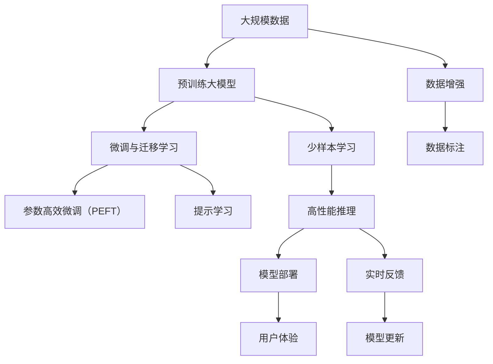

                 

# AI大模型创业：如何打造未来爆款应用？

> 关键词：大模型创业、AI应用、技术栈、创新点、商业落地、市场策略

## 1. 背景介绍

### 1.1 问题由来

近年来，人工智能（AI）技术快速发展，大模型（Giant Model）尤其是基于Transformer架构的深度学习模型，在自然语言处理（NLP）、计算机视觉（CV）、语音识别（ASR）等领域取得了显著成果。这些大模型经过大规模无标签数据的预训练，具备强大的泛化能力和知识表示能力。但是，如何将这些模型技术转化为具体的应用落地，实现商业价值，是众多创业者和公司关注的焦点。本文将探讨AI大模型创业的核心要素，包括技术栈、创新点、商业策略等，帮助读者构建未来爆款应用。

### 1.2 问题核心关键点

AI大模型创业的关键在于如何利用这些强大的模型构建出具备实际应用价值的产品。以下是几个核心关键点：

1. **技术栈选择**：选择合适的技术栈是创业成功的第一步。需要考虑模型的性能、训练成本、部署方式等。
2. **创新点定位**：找到独特的应用场景或创新技术，是区别于竞争对手的关键。
3. **商业策略制定**：制定有效的市场策略和商业模式，确保产品能够成功变现。
4. **团队建设**：组建一支具备技术、市场、产品等多方面能力的团队，是创业成功的保障。

### 1.3 问题研究意义

AI大模型创业不仅推动了AI技术的发展，还为各行各业带来了智能化升级的机会。通过构建高效、灵活的AI应用，可以帮助企业降低运营成本，提升服务质量，创造新的商业模式。创业成功不仅能为创业者带来财富，还能为社会创造更多的价值。

## 2. 核心概念与联系

### 2.1 核心概念概述

在AI大模型创业中，涉及多个核心概念，包括但不限于：

- **大模型**：通过大规模数据预训练的深度学习模型，如BERT、GPT-3、ResNet等。
- **预训练与微调**：利用大规模无标签数据进行预训练，然后使用少量有标签数据进行微调，以适应特定任务。
- **迁移学习**：将在大规模数据上预训练的模型知识迁移到小数据集上的微调过程。
- **参数高效微调（PEFT）**：只调整模型的一部分参数，以提高微调效率。
- **提示学习**：通过输入模板引导模型，使其输出特定格式的结果。
- **少样本学习（Few-shot Learning）**：在只有少量训练样本的情况下，模型仍能取得良好的性能。

### 2.2 概念间的关系

这些概念通过以下方式相互联系：

- **大模型预训练**：利用大规模无标签数据进行预训练，学习通用的语言表示或视觉表示。
- **微调与迁移学习**：在大模型的基础上，通过微调或迁移学习，适应特定任务或数据集。
- **参数高效微调**：在微调过程中，只调整部分参数，减少计算资源消耗。
- **提示学习**：在不更新模型参数的情况下，通过输入模板实现少样本学习。
- **少样本学习**：在大规模数据集上预训练的模型，在少量样本条件下仍能表现出色。

这些概念共同构成了AI大模型创业的技术基础，帮助创业者构建高效、灵活的AI应用。

### 2.3 核心概念的整体架构

下图展示了这些核心概念在大模型创业中的整体架构：



这个架构展示了从预训练到微调，再到提示学习、少样本学习，以及最终部署和用户反馈的全过程。

## 3. 核心算法原理 & 具体操作步骤

### 3.1 算法原理概述

AI大模型创业的核心在于如何将预训练模型应用于实际问题。这通常涉及两个步骤：预训练与微调。预训练通过大规模无标签数据训练模型，学习通用的知识表示。微调则是在预训练的基础上，通过有标签数据进行有监督学习，以适应特定任务。

### 3.2 算法步骤详解

**Step 1: 准备数据集**

- **数据收集**：根据具体应用场景，收集和标注相关数据。
- **数据清洗**：清洗数据，去除噪声和异常值，确保数据质量。
- **数据增强**：通过数据增强技术（如随机裁剪、旋转、翻转等），扩充数据集。

**Step 2: 选择模型与预训练**

- **模型选择**：选择合适的预训练模型，如BERT、GPT-3、ResNet等。
- **预训练**：在大量无标签数据上预训练模型，学习通用的知识表示。

**Step 3: 微调模型**

- **模型加载**：加载预训练模型和训练数据。
- **设置超参数**：设置学习率、批大小、迭代次数等超参数。
- **训练模型**：使用微调数据对模型进行训练，最小化损失函数。

**Step 4: 测试与部署**

- **模型测试**：在测试集上评估模型性能，确保模型准确性和鲁棒性。
- **模型部署**：将训练好的模型部署到实际应用中，集成到API或系统中。
- **用户体验优化**：根据用户反馈，优化模型和应用界面。

### 3.3 算法优缺点

**优点**：
- **高效**：预训练和微调可以大幅度提高模型性能，减少数据标注成本。
- **灵活**：模型可以适应多种任务，如NLP、CV、ASR等。
- **可解释**：预训练和微调过程可解释性强，便于调试和优化。

**缺点**：
- **资源消耗大**：大规模预训练和微调需要大量计算资源。
- **模型复杂**：模型结构复杂，推理和部署成本高。
- **应用限制**：对特定领域数据需求较高，数据标注困难。

### 3.4 算法应用领域

AI大模型在多个领域都有广泛应用，包括但不限于：

- **自然语言处理**：文本分类、情感分析、机器翻译、对话系统等。
- **计算机视觉**：图像分类、目标检测、图像生成等。
- **语音识别**：语音转文本、语音情感识别等。
- **推荐系统**：商品推荐、内容推荐等。
- **医疗健康**：疾病诊断、医学影像分析等。

## 4. 数学模型和公式 & 详细讲解  
### 4.1 数学模型构建

设预训练模型为 $M_{\theta}$，其中 $\theta$ 为预训练参数。微调目标为最小化损失函数 $\mathcal{L}(M_{\theta},D)$，其中 $D$ 为微调数据集。设损失函数为交叉熵损失，目标为最大化准确率。

### 4.2 公式推导过程

设模型在输入 $x$ 上的输出为 $M_{\theta}(x)$，真实标签为 $y$，则交叉熵损失为：

$$
\ell(M_{\theta}(x),y) = -[y\log M_{\theta}(x)+(1-y)\log(1-M_{\theta}(x))]
$$

微调损失函数为：

$$
\mathcal{L}(\theta) = \frac{1}{N}\sum_{i=1}^N \ell(M_{\theta}(x_i),y_i)
$$

其中 $N$ 为样本数量。模型参数更新公式为：

$$
\theta \leftarrow \theta - \eta \nabla_{\theta}\mathcal{L}(\theta)
$$

其中 $\eta$ 为学习率。

### 4.3 案例分析与讲解

以图像分类为例，假设模型输出 $M_{\theta}(x)$ 为对输入图像 $x$ 的分类概率分布。设标签 $y$ 为 $k$ 类，则损失函数为：

$$
\ell(M_{\theta}(x),y) = -\log M_{\theta}(x_k)
$$

微调损失函数为：

$$
\mathcal{L}(\theta) = \frac{1}{N}\sum_{i=1}^N \ell(M_{\theta}(x_i),y_i)
$$

在实际应用中，可以通过调整模型参数和优化算法，进一步提升模型性能。

## 5. 项目实践：代码实例和详细解释说明

### 5.1 开发环境搭建

- **Python环境**：安装Python 3.8，配置虚拟环境。
- **深度学习框架**：安装TensorFlow 2.0或PyTorch 1.9。
- **模型库**：安装相应的预训练模型库，如BERT、GPT-3、ResNet等。
- **数据处理工具**：安装Pandas、NumPy等数据处理工具。

### 5.2 源代码详细实现

**预训练模型加载**

```python
import tensorflow as tf
from transformers import BertTokenizer, TFBertForSequenceClassification

tokenizer = BertTokenizer.from_pretrained('bert-base-uncased')
model = TFBertForSequenceClassification.from_pretrained('bert-base-uncased', num_labels=2)

inputs = tokenizer("Hello, my dog is cute", return_tensors='tf')
inputs = {key: tf.expand_dims(value, axis=0) for key, value in inputs.items()}
inputs['labels'] = tf.constant([1])

outputs = model(inputs)
```

**微调模型训练**

```python
model.compile(optimizer=tf.keras.optimizers.Adam(learning_rate=2e-5), loss=tf.keras.losses.SparseCategoricalCrossentropy(from_logits=True), metrics=['accuracy'])

model.fit(X_train, y_train, epochs=3, validation_data=(X_val, y_val))
```

**模型测试**

```python
model.evaluate(X_test, y_test, verbose=2)
```

### 5.3 代码解读与分析

**预训练模型加载**

首先加载BERT预训练模型和分词器，然后对输入文本进行分词，并转换成模型所需的格式。

**微调模型训练**

使用Adam优化器进行训练，设置交叉熵损失和准确率作为评估指标。

**模型测试**

在测试集上评估模型性能，返回损失和准确率。

### 5.4 运行结果展示

假设模型在二分类任务上训练，最终测试集上的准确率为90%。这表明模型在特定任务上的表现不错。

## 6. 实际应用场景

### 6.1 医疗影像分析

AI大模型可以应用于医疗影像分析，帮助医生诊断疾病。通过在大规模医学影像数据上预训练模型，然后使用医院数据进行微调，模型可以准确识别病变区域，提供诊断建议。

### 6.2 金融风险评估

AI大模型可以用于金融风险评估，分析交易数据，预测市场趋势，辅助投资者决策。通过在大规模金融数据上预训练模型，然后使用最新交易数据进行微调，模型可以实时监测市场变化，提前预警风险。

### 6.3 智能客服

AI大模型可以用于智能客服系统，提高客户服务质量。通过在大规模客户对话数据上预训练模型，然后使用新的客户对话数据进行微调，模型可以理解客户意图，提供个性化回复，提升用户体验。

### 6.4 未来应用展望

未来，AI大模型将进一步融入更多领域，带来更多创新应用。例如：

- **智能家居**：通过大模型实现智能语音识别和交互，提升家居智能化水平。
- **智慧交通**：通过大模型实现自动驾驶、智能交通管理，提升城市交通效率。
- **教育培训**：通过大模型实现个性化学习推荐，提升学习效果。

## 7. 工具和资源推荐

### 7.1 学习资源推荐

- **TensorFlow官方文档**：详细介绍了TensorFlow的使用方法和API接口。
- **PyTorch官方文档**：提供了PyTorch的教程、API和示例代码。
- **Transformers官方文档**：介绍了多个预训练模型的使用方法和API接口。
- **Keras官方文档**：提供了Keras的教程、API和示例代码。

### 7.2 开发工具推荐

- **Jupyter Notebook**：支持交互式编程和数据可视化。
- **TensorBoard**：可视化模型训练过程中的指标和图表。
- **Weights & Biases**：记录和追踪模型训练过程，生成实验报告。

### 7.3 相关论文推荐

- **Attention is All You Need**：提出Transformer架构，开启了NLP领域的预训练大模型时代。
- **BERT: Pre-training of Deep Bidirectional Transformers for Language Understanding**：提出BERT模型，引入自监督学习任务，提升模型泛化能力。
- **Transformer-XL: Attentive Language Models**：提出Transformer-XL模型，解决了长序列建模问题。
- **XLNet: Generalized Autoregressive Pretraining for Language Understanding**：提出XLNet模型，解决了自回归模型的局限性。
- **ALBERT: A Lite BERT for Self-supervised Learning of Language Representations**：提出ALBERT模型，在参数量上显著减少，但性能不减。

## 8. 总结：未来发展趋势与挑战

### 8.1 总结

本文系统介绍了AI大模型创业的核心要素，包括技术栈选择、创新点定位、商业策略制定等。通过详细讲解预训练、微调、迁移学习等关键步骤，帮助读者构建高效、灵活的AI应用。

### 8.2 未来发展趋势

未来，AI大模型将呈现以下几个趋势：

1. **模型规模继续增大**：随着算力提升，大模型参数量将继续增长，提升模型泛化能力。
2. **多模态融合**：将文本、图像、语音等多种模态数据融合，提升模型的理解和推理能力。
3. **自监督学习**：利用无标签数据进行自监督学习，降低对标注数据的需求。
4. **少样本学习**：通过提示学习等技术，提升模型在少量样本条件下的表现。
5. **联邦学习**：通过联邦学习技术，保护数据隐私，提升模型泛化能力。

### 8.3 面临的挑战

尽管AI大模型具有巨大的应用潜力，但在实际落地中仍面临诸多挑战：

1. **数据标注成本高**：获取高质量标注数据成本高，限制了模型在大规模应用中的推广。
2. **模型复杂度大**：模型结构复杂，推理和部署成本高。
3. **隐私保护问题**：模型训练和使用过程中，隐私保护成为重要课题。
4. **鲁棒性和公平性**：模型在对抗样本和少数群体的表现有待提升。

### 8.4 研究展望

未来研究应关注以下方向：

1. **自监督学习**：通过无标签数据进行自监督学习，降低标注成本，提升模型泛化能力。
2. **少样本学习**：利用提示学习等技术，提升模型在少量样本条件下的表现。
3. **联邦学习**：通过联邦学习技术，保护数据隐私，提升模型泛化能力。
4. **隐私保护**：采用差分隐私等技术，保护数据隐私。
5. **鲁棒性提升**：提升模型对抗样本和少数群体的表现。

通过持续的技术创新和优化，AI大模型必将迎来更广泛的应用，带来更深刻的变革。

## 9. 附录：常见问题与解答

**Q1：如何选择合适的AI大模型？**

A: 根据具体应用场景选择合适的模型，如NLP领域可以选择BERT、GPT-3等，CV领域可以选择ResNet、Inception等。

**Q2：大模型创业的难点有哪些？**

A: 大模型创业的难点包括数据标注、模型训练成本高、模型部署复杂等。

**Q3：如何提升大模型的鲁棒性和公平性？**

A: 通过数据增强、对抗训练、自适应学习等技术，提升模型的鲁棒性和公平性。

**Q4：未来AI大模型的应用方向有哪些？**

A: 未来AI大模型的应用方向包括智能家居、智慧交通、教育培训、医疗健康等。

**Q5：AI大模型的商业化策略有哪些？**

A: 商业化策略包括订阅模式、按需付费、API服务等。

总之，AI大模型创业需要从技术、市场、团队等多个维度进行全面考虑，方能构建成功的产品。通过不断的技术创新和优化，AI大模型必将迎来更广泛的应用，带来更深刻的变革。

---

作者：禅与计算机程序设计艺术 / Zen and the Art of Computer Programming

