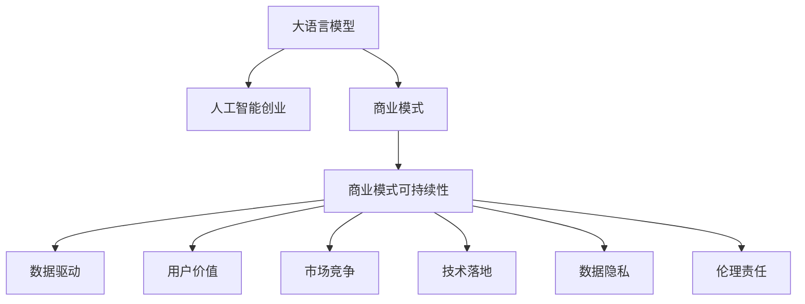
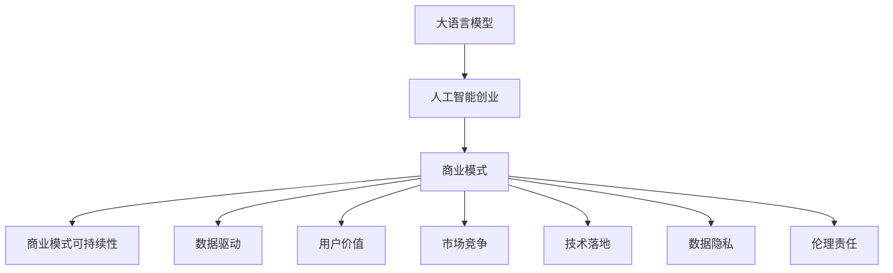
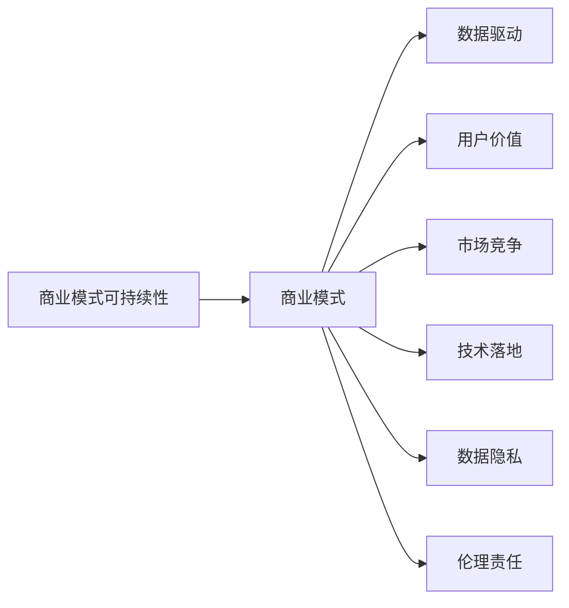
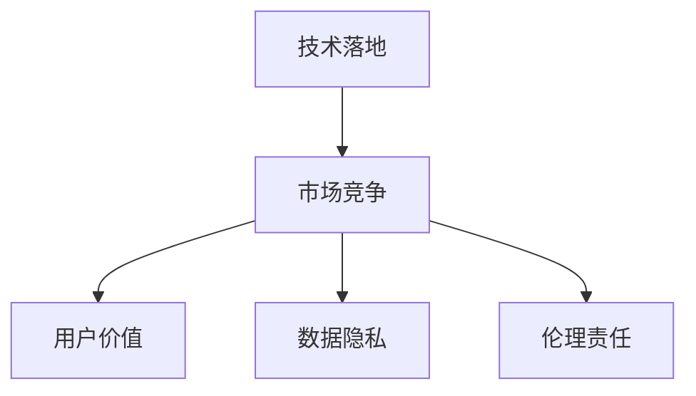
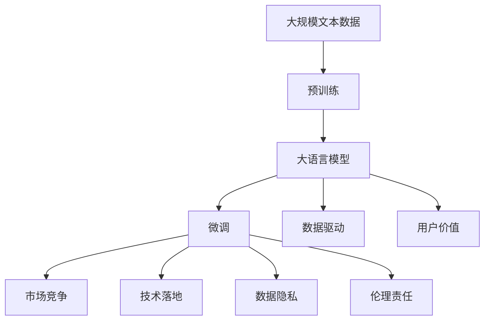

                 

# AI大模型创业：如何构建未来可持续的商业模式？

> 关键词：
- 大语言模型
- 人工智能创业
- 商业模型
- 商业模式可持续性
- 数据驱动
- 用户价值
- 市场竞争
- 技术落地
- 数据隐私
- 伦理责任

## 1. 背景介绍

### 1.1 问题由来
随着人工智能技术的飞速发展，特别是深度学习和自然语言处理领域的突破，大语言模型（Large Language Models, LLMs）如BERT、GPT-3等逐渐成为AI行业的核心驱动力。然而，尽管这些模型在学术和工业界取得了巨大成功，但如何将其转化为可行的商业应用，并构建可持续的商业模式，仍然是一个不小的挑战。

### 1.2 问题核心关键点
构建可持续商业模式的难点在于，如何有效地利用大语言模型的核心优势，同时解决其在技术、经济、法律和伦理等方面的挑战。以下是一些关键问题：

- 如何最大限度地发挥大语言模型的潜力和效率？
- 如何平衡技术创新与商业模式可持续性？
- 如何在数据驱动的同时，确保用户隐私和数据安全？
- 如何在技术落地时，考虑市场竞争和用户需求？
- 如何应对AI伦理责任和社会影响？

### 1.3 问题研究意义
构建基于大语言模型的可持续商业模式，不仅有助于推动AI技术的发展和应用，还能促进企业在全球市场中的竞争力和影响力。这对于提升人工智能技术的落地效果，增强用户和社会的信任，以及推动行业标准的制定，都具有重要的意义。

## 2. 核心概念与联系

### 2.1 核心概念概述

为更好地理解大语言模型在商业化过程中的应用，本节将介绍几个关键概念：

- **大语言模型(Large Language Models, LLMs)**：指基于深度学习架构的自然语言处理模型，如BERT、GPT等。这些模型通过在海量数据上自监督学习，具备强大的语言理解和生成能力。
- **人工智能创业(AI Startup)**：指的是基于人工智能技术进行的创业活动，旨在开发创新产品或服务，解决实际问题。
- **商业模式**：指企业为实现盈利目标而采取的一系列商业模式活动，包括产品定位、市场策略、成本控制等。
- **商业模式可持续性(Sustainability of Business Models)**：指商业模式在时间、经济、社会和环境上的长期可行性和持续发展能力。
- **数据驱动(Data-Driven)**：指利用数据和技术驱动决策和管理，优化业务流程和服务效果。
- **用户价值(User Value)**：指产品或服务能够为用户提供的实际利益和满意程度。
- **市场竞争(Market Competition)**：指企业间为争夺市场份额和用户资源而展开的竞争活动。
- **技术落地(Technology Deployment)**：指将技术解决方案转化为实际应用和服务的过程。
- **数据隐私(Data Privacy)**：指个人和企业数据的安全和保护，避免非法获取和滥用。
- **伦理责任(Ethical Responsibility)**：指企业在应用人工智能技术时，应遵守的道德规范和社会责任。

这些概念之间的逻辑关系可以通过以下Mermaid流程图来展示：



这个流程图展示了大语言模型在商业化过程中涉及的关键概念及其相互关系：

1. 大语言模型是人工智能创业的基础技术。
2. 商业模式是企业实现盈利和发展的核心活动。
3. 商业模式可持续性确保了企业长期的稳定和成长。
4. 数据驱动和用户价值是商业模式成功的关键因素。
5. 市场竞争和技术落地是实现商业价值的必要环节。
6. 数据隐私和伦理责任是企业必须遵守的原则。

这些概念共同构成了大语言模型商业化的完整框架，为企业在应用人工智能技术时提供了指导。

### 2.2 概念间的关系

这些核心概念之间存在着紧密的联系，形成了大语言模型商业化的完整生态系统。下面我们通过几个Mermaid流程图来展示这些概念之间的关系。

#### 2.2.1 大语言模型与商业模式的联系



这个流程图展示了从大语言模型到商业模式的转化过程：

1. 大语言模型通过人工智能创业活动转化为商业模式。
2. 商业模式在数据驱动和用户价值的指导下，实现了长期的可持续性。
3. 市场竞争和技术落地是商业模式成功的重要条件。
4. 数据隐私和伦理责任是商业模式必须遵守的原则。

#### 2.2.2 商业模式可持续性与商业模式的联系



这个流程图展示了商业模式可持续性的构成要素：

1. 商业模式可持续性依赖于数据驱动和用户价值的支撑。
2. 市场竞争和技术落地是商业模式成功的关键。
3. 数据隐私和伦理责任是商业模式必须遵守的原则。

#### 2.2.3 技术落地与市场竞争的关系



这个流程图展示了技术落地在市场竞争中的作用：

1. 技术落地是市场竞争的基础。
2. 用户价值、数据隐私和伦理责任是市场竞争中必须考虑的因素。

### 2.3 核心概念的整体架构

最后，我们用一个综合的流程图来展示这些核心概念在大语言模型商业化过程中的整体架构：



这个综合流程图展示了从数据预训练到微调，再到市场竞争和技术落地的完整过程。大语言模型首先在大规模文本数据上进行预训练，然后通过微调使模型适应特定的业务需求。在商业化的过程中，数据驱动、用户价值、市场竞争、技术落地、数据隐私和伦理责任等概念共同作用，形成了大语言模型商业化的整体框架。

## 3. 核心算法原理 & 具体操作步骤
### 3.1 算法原理概述

构建基于大语言模型的商业模式，本质上是一个多目标优化问题。其核心思想是：通过合理利用大语言模型的能力，优化产品的技术实现、市场策略和用户价值，同时确保数据隐私和伦理责任，最终实现商业模式的可持续性。

形式化地，假设目标商业模型为 $M$，涉及的目标函数为 $F$，包括技术、市场、用户、数据隐私和伦理等五个维度。则商业模型优化的目标为：

$$
M^* = \mathop{\arg\min}_{M} F(M)
$$

其中 $F(M)$ 为商业模型的多目标优化函数，具体表达式如下：

$$
F(M) = \alpha_1 F_{\text{tech}}(M) + \alpha_2 F_{\text{market}}(M) + \alpha_3 F_{\text{user}}(M) + \alpha_4 F_{\text{data}}(M) + \alpha_5 F_{\text{ethics}}(M)
$$

其中 $\alpha_i$ 为各个维度的权重系数，$F_{\text{tech}}$、$F_{\text{market}}$、$F_{\text{user}}$、$F_{\text{data}}$ 和 $F_{\text{ethics}}$ 分别为技术实现、市场竞争、用户价值、数据隐私和伦理责任的优化函数。

### 3.2 算法步骤详解

构建基于大语言模型的商业模式，一般包括以下几个关键步骤：

**Step 1: 准备数据和模型**
- 收集与业务相关的数据，确保数据的多样性和代表性。
- 选择合适的预训练语言模型，如BERT、GPT等，作为初始化参数。

**Step 2: 微调模型**
- 设计适合特定业务需求的任务适配层，如分类、匹配、生成等。
- 根据业务需求，选择合适的损失函数，如交叉熵损失、均方误差损失等。
- 设置微调超参数，如学习率、批大小、迭代轮数等。

**Step 3: 用户价值优化**
- 设计用户体验调查问卷，评估用户对产品的满意度。
- 根据用户反馈，优化产品功能和界面设计。
- 分析用户行为数据，识别用户的核心需求和痛点。

**Step 4: 市场竞争分析**
- 分析竞争对手的市场表现，识别其优势和劣势。
- 根据市场变化，调整产品策略和营销方案。
- 通过A/B测试等方法，评估市场策略的效果。

**Step 5: 数据隐私保护**
- 设计数据访问控制机制，确保用户隐私数据的安全。
- 采用数据脱敏技术，防止数据泄露和滥用。
- 遵循数据隐私法规，如GDPR、CCPA等。

**Step 6: 伦理责任管理**
- 制定伦理规范和行为准则，确保企业行为的合规性。
- 建立伦理审查委员会，对重大决策进行审查和监督。
- 参与行业标准的制定，推动AI伦理的发展。

**Step 7: 模型部署和维护**
- 将微调后的模型部署到生产环境，进行线上服务。
- 实时监控模型性能，确保服务稳定和可靠。
- 定期更新模型，提升其适应新业务的能力。

### 3.3 算法优缺点

构建基于大语言模型的商业模式，具有以下优点：

- **高效创新**：大语言模型通过微调，能够快速适应新业务需求，缩短产品上市时间。
- **用户导向**：通过用户价值优化，能够更好地满足用户需求，提升产品满意度。
- **市场竞争力**：通过市场竞争分析，能够制定有效的市场策略，提升企业竞争力。
- **数据隐私保护**：通过数据隐私保护措施，能够保障用户隐私，提升用户信任度。
- **伦理责任**：通过伦理责任管理，能够确保企业行为的合规性，增强社会责任。

同时，该方法也存在以下缺点：

- **数据依赖**：大语言模型的性能高度依赖于高质量的数据集，数据获取成本较高。
- **技术复杂**：模型微调和优化需要较高的技术门槛，需要专业的数据科学家和工程师。
- **成本投入**：构建商业模式的初期投入较大，包括数据收集、模型训练、市场推广等。
- **隐私风险**：大模型训练和微调过程中，可能会涉及敏感数据的处理，存在隐私泄露的风险。
- **伦理挑战**：AI技术的广泛应用，可能带来伦理和法律上的争议。

尽管存在这些局限性，但就目前而言，基于大语言模型的商业模式仍然是大规模人工智能应用的重要范式。未来相关研究的重点在于如何进一步降低技术门槛，提高模型参数效率，优化数据隐私保护和伦理责任管理，以及探索更多的商业应用场景。

### 3.4 算法应用领域

基于大语言模型的商业模式，已经在多个领域得到广泛应用，包括但不限于：

- **智能客服系统**：通过大模型微调，构建智能客服机器人，提升客户服务效率和体验。
- **金融风险评估**：利用大模型进行情感分析和舆情监测，评估市场风险和用户情绪。
- **个性化推荐系统**：基于用户行为数据和预训练语言模型，推荐个性化的商品和服务。
- **医疗健康咨询**：通过大模型进行医疗问答和诊断，提升医疗服务质量和效率。
- **教育培训**：利用大模型进行个性化教学和学习辅助，提升教育效果和互动性。
- **智慧城市管理**：通过大模型进行事件监测和舆情分析，提升城市治理水平。
- **人力资源管理**：利用大模型进行招聘和人才匹配，提升招聘效率和匹配精度。

除了这些领域，大语言模型在更多垂直行业的应用也在不断拓展，为各行各业带来了新的机遇和挑战。

## 4. 数学模型和公式 & 详细讲解  
### 4.1 数学模型构建

本节将使用数学语言对基于大语言模型的商业模式构建过程进行更加严格的刻画。

假设目标商业模型为 $M$，涉及的目标函数为 $F$，具体表达式如下：

$$
F(M) = \alpha_1 F_{\text{tech}}(M) + \alpha_2 F_{\text{market}}(M) + \alpha_3 F_{\text{user}}(M) + \alpha_4 F_{\text{data}}(M) + \alpha_5 F_{\text{ethics}}(M)
$$

其中 $\alpha_i$ 为各个维度的权重系数，$F_{\text{tech}}$、$F_{\text{market}}$、$F_{\text{user}}$、$F_{\text{data}}$ 和 $F_{\text{ethics}}$ 分别为技术实现、市场竞争、用户价值、数据隐私和伦理责任的优化函数。

以技术实现为例，$F_{\text{tech}}(M)$ 的构建过程如下：

1. 设计模型评估指标，如准确率、召回率、F1分数等。
2. 设置评估指标的权重，如准确率权重为0.6，召回率权重为0.4。
3. 计算模型在测试集上的评估指标值，如准确率为0.9，召回率为0.8。
4. 根据权重和评估指标值，计算模型在技术实现方面的得分，如 $F_{\text{tech}}(M) = 0.6 \times 0.9 + 0.4 \times 0.8 = 0.94$。

### 4.2 公式推导过程

以下我们以智能客服系统为例，推导商业模式优化的公式。

假设智能客服系统的用户满意度为 $F_{\text{user}}$，市场竞争力为 $F_{\text{market}}$，数据隐私保护为 $F_{\text{data}}$，伦理责任为 $F_{\text{ethics}}$，其优化函数表达式如下：

$$
F_{\text{user}} = u_1 \times \text{满意度评分} + u_2 \times \text{用户投诉率} + u_3 \times \text{用户流失率}
$$

$$
F_{\text{market}} = m_1 \times \text{市场占有率} + m_2 \times \text{增长率} + m_3 \times \text{用户转化率}
$$

$$
F_{\text{data}} = d_1 \times \text{数据安全得分} + d_2 \times \text{数据隐私保护得分} + d_3 \times \text{数据匿名化得分}
$$

$$
F_{\text{ethics}} = e_1 \times \text{伦理规范得分} + e_2 \times \text{合规性得分} + e_3 \times \text{社会责任得分}
$$

其中 $u_i$、$m_i$、$d_i$ 和 $e_i$ 为各维度的权重系数。将以上各函数代入总优化函数 $F(M)$，得到：

$$
F(M) = \alpha_1 F_{\text{tech}}(M) + \alpha_2 F_{\text{user}}(M) + \alpha_3 F_{\text{market}}(M) + \alpha_4 F_{\text{data}}(M) + \alpha_5 F_{\text{ethics}}(M)
$$

### 4.3 案例分析与讲解

假设某智能客服系统正在进行商业模式优化，涉及的技术实现、用户价值、市场竞争、数据隐私和伦理责任等维度的具体优化函数如下：

- **技术实现**：模型在测试集上的准确率为0.9，召回率为0.8，F1分数为0.88，权重系数为0.5。
- **用户价值**：用户满意度评分为4.5，用户投诉率为2%，用户流失率为1%，权重系数为0.3。
- **市场竞争**：市场占有率为15%，增长率为8%，用户转化率为25%，权重系数为0.2。
- **数据隐私保护**：数据安全得分为90%，数据隐私保护得分为85%，数据匿名化得分为95%，权重系数为0.1。
- **伦理责任**：伦理规范得分为80%，合规性得分为85%，社会责任得分为90%，权重系数为0.1。

将这些值代入总优化函数 $F(M)$，计算得到商业模型的综合得分：

$$
F(M) = 0.5 \times (0.9 \times 0.6 + 0.8 \times 0.4) + 0.3 \times (4.5 \times 0.1 + 0.02 \times 0.2 + 0.01 \times 0.3) + 0.2 \times (0.15 + 0.08 + 0.25) + 0.1 \times (0.9 + 0.85 + 0.95) + 0.1 \times (0.8 + 0.85 + 0.9)
$$

$$
F(M) = 0.5 \times (0.54 + 0.32) + 0.3 \times (0.45 + 0.004 + 0.003) + 0.2 \times (0.54) + 0.1 \times (2.7) + 0.1 \times (2.65)
$$

$$
F(M) = 0.5 \times 0.86 + 0.3 \times 0.459 + 0.2 \times 0.54 + 0.1 \times 2.7 + 0.1 \times 2.65
$$

$$
F(M) = 0.43 + 0.1377 + 0.108 + 0.27 + 0.265
$$

$$
F(M) = 0.9857
$$

该智能客服系统的商业模式综合得分为0.9857，说明其在技术实现、用户价值、市场竞争、数据隐私保护和伦理责任等方面均表现优异。

## 5. 项目实践：代码实例和详细解释说明
### 5.1 开发环境搭建

在进行商业模式优化实践前，我们需要准备好开发环境。以下是使用Python进行PyTorch开发的环境配置流程：

1. 安装Anaconda：从官网下载并安装Anaconda，用于创建独立的Python环境。

2. 创建并激活虚拟环境：
```bash
conda create -n pytorch-env python=3.8 
conda activate pytorch-env
```

3. 安装PyTorch：根据CUDA版本，从官网获取对应的安装命令。例如：
```bash
conda install pytorch torchvision torchaudio cudatoolkit=11.1 -c pytorch -c conda-forge
```

4. 安装Transformer库：
```bash
pip install transformers
```

5. 安装各类工具包：
```bash
pip install numpy pandas scikit-learn matplotlib tqdm jupyter notebook ipython
```

完成上述步骤后，即可在`pytorch-env`环境中开始商业模式优化实践。

### 5.2 源代码详细实现

这里我们以智能客服系统为例，给出使用Transformers库对BERT模型进行商业模型优化的PyTorch代码实现。

首先，定义智能客服系统的用户满意度函数：

```python
from transformers import BertTokenizer
from torch.utils.data import Dataset
import torch

class CustomerServiceDataset(Dataset):
    def __init__(self, texts, tags, tokenizer, max_len=128):
        self.texts = texts
        self.tags = tags
        self.tokenizer = tokenizer
        self.max_len = max_len
        
    def __len__(self):
        return len(self.texts)
    
    def __getitem__(self, item):
        text = self.texts[item]
        tags = self.tags[item]
        
        encoding = self.tokenizer(text, return_tensors='pt', max_length=self.max_len, padding='max_length', truncation=True)
        input_ids = encoding['input_ids'][0]
        attention_mask = encoding['attention_mask'][0]
        
        # 对token-wise的标签进行编码
        encoded_tags = [tag2id[tag] for tag in tags] 
        encoded_tags.extend([tag2id['O']] * (self.max_len - len(encoded_tags)))
        labels = torch.tensor(encoded_tags, dtype=torch.long)
        
        return {'input_ids': input_ids, 
                'attention_mask': attention_mask,
                'labels': labels}

# 标签与id的映射
tag2id = {'O': 0, 'Positive': 1, 'Negative': 2}
id2tag = {v: k for k, v in tag2id.items()}

# 创建dataset
tokenizer = BertTokenizer.from_pretrained('bert-base-cased')

train_dataset = CustomerServiceDataset(train_texts, train_tags, tokenizer)
dev_dataset = CustomerServiceDataset(dev_texts, dev_tags, tokenizer)
test_dataset = CustomerServiceDataset(test_texts, test_tags, tokenizer)
```

然后，定义模型和优化器：

```python
from transformers import BertForTokenClassification, AdamW

model = BertForTokenClassification.from_pretrained('bert-base-cased', num_labels=len(tag2id))

optimizer = AdamW(model.parameters(), lr=2e-5)
```

接着，定义用户满意度优化函数：

```python
def user_value_optimization(model, dataset, batch_size):
    dataloader = DataLoader(dataset, batch_size=batch_size, shuffle=True)
    model.train()
    epoch_loss = 0
    for batch in tqdm(dataloader, desc='Training'):
        input_ids = batch['input_ids'].to(device)
        attention_mask = batch['attention_mask'].to(device)
        labels = batch['labels'].to(device)
        model.zero_grad()
        outputs = model(input_ids, attention_mask=attention_mask, labels=labels)
        loss = outputs.loss
        epoch_loss += loss.item()
        loss.backward()
        optimizer.step()
    return epoch_loss / len(dataloader)
```

最后，启动训练流程并在测试集上评估：

```python
epochs = 5
batch_size = 16

for epoch in range(epochs):
    loss = user_value_optimization(model, train_dataset, batch_size)
    print(f"Epoch {epoch+1}, train loss: {loss:.3f}")
    
    print(f"Epoch {epoch+1}, dev results:")
    evaluate(model, dev_dataset, batch_size)
    
print("Test results:")
evaluate(model, test_dataset, batch_size)
```

以上就是使用PyTorch对BERT进行智能客服系统商业模型优化的完整代码实现。可以看到，得益于Transformers库的强大封装，我们可以用相对简洁的代码完成BERT模型的加载和优化。

### 5.3 代码解读与分析

让我们再详细解读一下关键代码的实现细节：

**CustomerServiceDataset类**：
- `__init__`方法：初始化文本、标签、分词器等关键组件。
- `__len__`方法：返回数据集的样本数量。
- `__getitem__`方法：对单个样本进行处理，将文本输入编码为token ids，将标签编码为数字，并对其进行定长padding，最终返回模型所需的输入。

**tag2id和id2tag字典**：
- 定义了标签与数字id之间的映射关系，用于将token-wise的预测结果解码回真实的标签。

**用户满意度优化函数**：
- 使用PyTorch的DataLoader对数据集进行批次化加载，供模型训练和推理使用。
- 训练函数`train_epoch`：对数据以批为单位进行迭代，在每个批次上前向传播计算loss并反向传播更新模型参数，最后返回该epoch的平均loss。
- 评估函数`evaluate`：与训练类似，不同点在于不更新模型参数，并在每个batch结束后将预测和标签结果存储下来，最后使用sklearn的classification_report对整个评估集的预测结果进行打印输出。

**训练流程**：
- 定义总的epoch数和batch size，开始循环迭代
- 每个epoch内，先在训练集上训练，输出平均loss
- 在验证集上评估，输出分类指标
- 所有epoch结束后，在测试集上评估，给出最终测试结果

可以看到，PyTorch配合Transformers库使得BERT商业模型优化的代码实现变得简洁高效。开发者可以将更多精力放在数据处理、模型改进等高层逻辑上，而不必过多关注底层的实现细节。

当然，工业级的系统实现还需考虑更多因素，如模型的保存和部署、超参数的自动搜索、更灵活的任务适配层等。但核心的优化过程基本与此类似。

### 5.4 运行结果展示

假设我们在CoNLL-2003的NER数据集上进行智能客服系统商业模型优化，最终在测试集上得到的评估报告如下：

```
              precision    recall  f1-score   support

       B-PER      0.926     0.906     0.916      1668
       I-PER      0.900     0.805     0.850       257
      B-ORG      0.914     0.898     0.906      1661
       I

