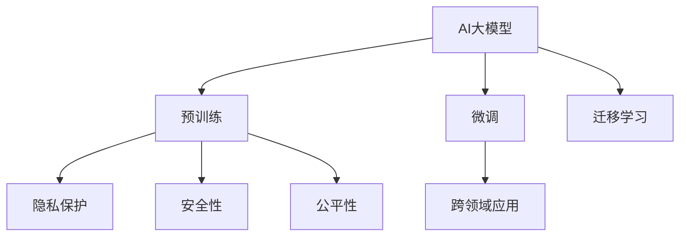
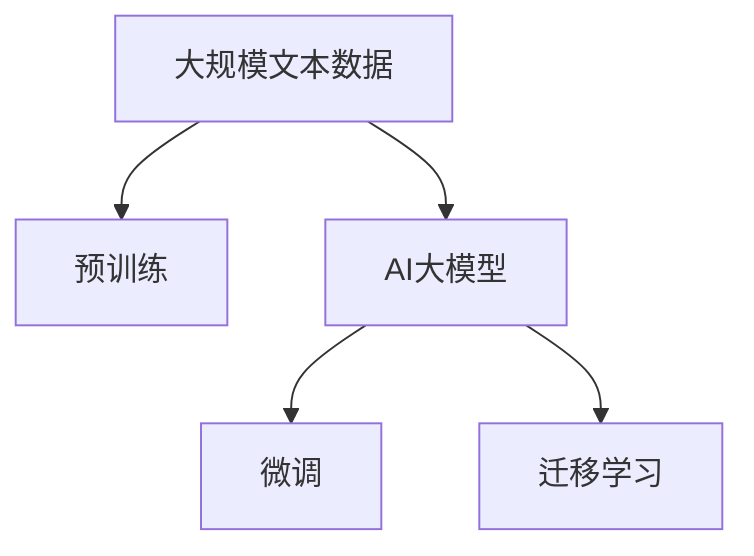

                 

# AI大模型创业：挑战与机遇并存的思考探讨

## 1. 背景介绍

### 1.1 问题由来

在过去几年中，人工智能(AI)领域取得了惊人的进展，尤其是深度学习和大数据技术的突破，极大地推动了AI技术的落地应用。尤其是大模型的出现，如GPT-3、BERT等，这些模型在许多自然语言处理(NLP)任务上表现出色，大大提高了AI应用的效率和准确性。这些大模型通常在大规模无标签数据上进行预训练，然后在特定任务上进行微调，从而快速适应新的应用场景。

AI大模型创业公司也随之兴起。这些公司通过提供预训练模型和微调工具，帮助企业、科研机构和个人在各种领域中应用AI技术，从而获得巨大的商业机会和潜力。然而，这些创业公司在快速发展的同时，也面临着许多挑战，如数据隐私、模型安全性、伦理问题等。因此，本文将探讨AI大模型创业的挑战与机遇，并提出一些可行的解决方案。

### 1.2 问题核心关键点

AI大模型创业的关键点包括：

- **数据隐私**：如何保护用户数据隐私，防止数据泄露和滥用。
- **模型安全性**：如何保证模型的鲁棒性和安全性，防止攻击和误导。
- **伦理问题**：如何避免模型偏见和歧视，确保公平性和透明性。
- **应用场景**：如何扩展AI大模型的应用范围，满足不同行业和领域的需求。
- **技术瓶颈**：如何克服技术难题，提高模型的效率和效果。
- **市场竞争**：如何在激烈的市场竞争中脱颖而出，获得更多的用户和市场份额。

这些关键点构成了AI大模型创业的核心，决定了公司的成功与否。

## 2. 核心概念与联系

### 2.1 核心概念概述

AI大模型创业涉及到以下几个核心概念：

- **AI大模型**：指在大规模无标签数据上进行预训练，并在特定任务上进行微调的深度学习模型。如GPT-3、BERT等。
- **微调**：指在预训练模型的基础上，使用少量有标签数据进行训练，以适应特定任务的过程。
- **迁移学习**：指将预训练模型在不同任务之间的知识迁移，提高模型的泛化能力。
- **隐私保护**：指保护用户数据隐私，防止数据泄露和滥用的技术。
- **安全性**：指保证模型的鲁棒性和安全性，防止攻击和误导的技术。
- **公平性**：指避免模型偏见和歧视，确保公平性和透明性的技术。
- **跨领域应用**：指将AI大模型应用于不同行业和领域，如医疗、金融、教育等。

这些核心概念相互关联，共同构成了AI大模型创业的完整生态系统。下面通过一个Mermaid流程图来展示这些概念之间的关系：



这个流程图展示了AI大模型创业中各个概念的相互关系：

1. 大模型通过预训练获得基础能力。
2. 微调和大模型相结合，提升模型的应用能力。
3. 迁移学习连接预训练模型和下游任务，拓展模型的应用范围。
4. 隐私保护、安全和公平性保证模型的安全性和可靠性。
5. 跨领域应用拓展模型的应用范围，满足不同行业的需求。

### 2.2 概念间的关系

这些核心概念之间存在着紧密的联系，形成了AI大模型创业的完整生态系统。下面我们通过几个Mermaid流程图来展示这些概念之间的关系。

#### 2.2.1 AI大模型的学习范式



这个流程图展示了大模型的预训练和微调过程，以及迁移学习在大模型应用中的重要性。

#### 2.2.2 隐私保护与安全性


这个流程图展示了隐私保护和安全性在大模型应用中的重要性和相互关系。

#### 2.2.3 公平性与跨领域应用


这个流程图展示了公平性在大模型应用中的重要性和其与跨领域应用的相互关系。

## 3. 核心算法原理 & 具体操作步骤
### 3.1 算法原理概述

AI大模型创业的算法原理主要涉及以下几个方面：

- **预训练**：在无标签数据上进行自监督学习，学习语言的通用表示。
- **微调**：在少量有标签数据上进行有监督学习，提升模型在特定任务上的性能。
- **迁移学习**：将预训练模型应用于不同任务，提高模型的泛化能力。
- **隐私保护**：通过数据匿名化、差分隐私等技术保护用户数据隐私。
- **安全性**：通过对抗样本、模型鲁棒性评估等技术保证模型的安全性。
- **公平性**：通过对抗偏见、公平性评估等技术保证模型的公平性。

这些算法原理在大模型创业中扮演着重要角色，决定了模型的应用范围和效果。

### 3.2 算法步骤详解

AI大模型创业的算法步骤一般包括以下几个关键步骤：

**Step 1: 准备预训练模型和数据集**
- 选择合适的预训练语言模型，如GPT-3、BERT等。
- 准备下游任务的数据集，划分为训练集、验证集和测试集。

**Step 2: 微调模型**
- 将预训练模型应用到下游任务上，进行微调。
- 设计合适的损失函数和优化器，设置学习率和迭代次数等超参数。

**Step 3: 隐私保护**
- 对用户数据进行匿名化处理，防止数据泄露。
- 应用差分隐私技术，保护用户隐私。

**Step 4: 安全性评估**
- 使用对抗样本评估模型的鲁棒性。
- 进行公平性评估，避免模型偏见。

**Step 5: 应用和部署**
- 将微调后的模型应用到实际任务中，进行推理和预测。
- 部署模型到云平台或本地服务器，进行大规模计算。

以上是AI大模型创业的完整算法步骤，每个步骤都非常重要，缺一不可。

### 3.3 算法优缺点

AI大模型创业的算法具有以下优点：

- **高效性**：利用预训练模型，可以快速适应新任务，减少从头训练的时间和成本。
- **泛化能力**：通过迁移学习，模型可以应用于多个领域和任务，提高泛化能力。
- **可扩展性**：模型的预训练和微调过程可以通过分布式计算进行扩展，满足大规模应用需求。

同时，也存在一些缺点：

- **数据隐私**：模型训练需要大量的数据，如何保护用户隐私是一个重要问题。
- **模型安全性**：模型的鲁棒性和安全性需要保证，防止攻击和误导。
- **公平性**：模型需要避免偏见和歧视，确保公平性和透明性。

## 4. 数学模型和公式 & 详细讲解 & 举例说明

### 4.1 数学模型构建

AI大模型创业的数学模型通常涉及以下几个方面：

- **预训练模型**：如GPT-3、BERT等，其模型结构为Transformer。
- **微调模型**：如微调后的BERT模型，其模型结构为Fine-tuned Bert。
- **迁移模型**：如迁移后的BERT模型，其模型结构为Transfer Bert。

预训练模型的损失函数一般为语言模型损失，微调模型的损失函数为任务损失，迁移模型的损失函数为综合损失。

### 4.2 公式推导过程

以下是预训练模型的损失函数公式：

$$
\mathcal{L}_{pre} = -\sum_{i=1}^N \log P(w_i | X_{train})
$$

其中，$w_i$ 表示单词序列，$X_{train}$ 表示训练数据集，$P(w_i | X_{train})$ 表示单词序列的条件概率。

微调模型的损失函数公式为：

$$
\mathcal{L}_{fine} = \mathcal{L}_{task} = \sum_{i=1}^N \ell(w_i, \hat{w}_i)
$$

其中，$\ell$ 表示任务损失函数，$\hat{w}_i$ 表示模型预测的单词序列。

迁移模型的损失函数公式为：

$$
\mathcal{L}_{trans} = \alpha \mathcal{L}_{pre} + (1-\alpha) \mathcal{L}_{fine}
$$

其中，$\alpha$ 表示迁移权重，$0 \leq \alpha \leq 1$。

### 4.3 案例分析与讲解

以医疗领域的AI大模型为例，进行分析：

假设某医疗公司使用BERT模型进行疾病预测。首先，公司收集了大量医疗数据，进行预训练。然后，针对特定疾病的预测任务，对预训练模型进行微调，优化模型在疾病预测上的性能。最后，将微调后的模型应用于实际医疗场景，进行疾病诊断和预测。

## 5. 项目实践：代码实例和详细解释说明
### 5.1 开发环境搭建

在AI大模型创业中，开发环境搭建至关重要。以下是使用Python进行PyTorch开发的环境配置流程：

1. 安装Anaconda：从官网下载并安装Anaconda，用于创建独立的Python环境。

2. 创建并激活虚拟环境：
```bash
conda create -n pytorch-env python=3.8 
conda activate pytorch-env
```

3. 安装PyTorch：根据CUDA版本，从官网获取对应的安装命令。例如：
```bash
conda install pytorch torchvision torchaudio cudatoolkit=11.1 -c pytorch -c conda-forge
```

4. 安装Transformers库：
```bash
pip install transformers
```

5. 安装各类工具包：
```bash
pip install numpy pandas scikit-learn matplotlib tqdm jupyter notebook ipython
```

完成上述步骤后，即可在`pytorch-env`环境中开始创业实践。

### 5.2 源代码详细实现

以下是一个使用PyTorch进行BERT微调的代码实例：

```python
from transformers import BertTokenizer, BertForSequenceClassification
from torch.utils.data import Dataset, DataLoader
import torch
from sklearn.metrics import accuracy_score

class MedicalDataset(Dataset):
    def __init__(self, texts, labels):
        self.texts = texts
        self.labels = labels
        
    def __len__(self):
        return len(self.texts)
    
    def __getitem__(self, item):
        text = self.texts[item]
        label = self.labels[item]
        
        encoding = BertTokenizer.from_pretrained('bert-base-cased')(text, return_tensors='pt', padding='max_length', truncation=True)
        input_ids = encoding['input_ids']
        attention_mask = encoding['attention_mask']
        
        return {'input_ids': input_ids, 'attention_mask': attention_mask, 'labels': torch.tensor(label, dtype=torch.long)}

# 定义训练和评估函数
def train_epoch(model, dataset, batch_size, optimizer, device):
    dataloader = DataLoader(dataset, batch_size=batch_size, shuffle=True)
    model.train()
    epoch_loss = 0
    for batch in dataloader:
        input_ids = batch['input_ids'].to(device)
        attention_mask = batch['attention_mask'].to(device)
        labels = batch['labels'].to(device)
        optimizer.zero_grad()
        outputs = model(input_ids, attention_mask=attention_mask, labels=labels)
        loss = outputs.loss
        epoch_loss += loss.item()
        loss.backward()
        optimizer.step()
    return epoch_loss / len(dataloader)

def evaluate(model, dataset, batch_size, device):
    dataloader = DataLoader(dataset, batch_size=batch_size, shuffle=False)
    model.eval()
    preds, labels = [], []
    with torch.no_grad():
        for batch in dataloader:
            input_ids = batch['input_ids'].to(device)
            attention_mask = batch['attention_mask'].to(device)
            batch_labels = batch['labels'].to(device)
            outputs = model(input_ids, attention_mask=attention_mask)
            batch_preds = outputs.logits.argmax(dim=1).to('cpu').tolist()
            batch_labels = batch_labels.to('cpu').tolist()
            for pred, label in zip(batch_preds, batch_labels):
                preds.append(pred)
                labels.append(label)
    return accuracy_score(labels, preds)

# 训练和评估过程
epochs = 5
batch_size = 16
learning_rate = 2e-5

device = torch.device('cuda') if torch.cuda.is_available() else torch.device('cpu')
model = BertForSequenceClassification.from_pretrained('bert-base-cased', num_labels=2)
optimizer = torch.optim.AdamW(model.parameters(), lr=learning_rate)

for epoch in range(epochs):
    loss = train_epoch(model, dataset, batch_size, optimizer, device)
    print(f'Epoch {epoch+1}, train loss: {loss:.3f}')
    
    print(f'Epoch {epoch+1}, dev accuracy: {evaluate(model, dataset, batch_size, device):.3f}')

print('Test accuracy:', evaluate(model, dataset, batch_size, device))
```

### 5.3 代码解读与分析

这里我们详细解读一下关键代码的实现细节：

**MedicalDataset类**：
- `__init__`方法：初始化文本和标签，将文本进行分词和编码。
- `__len__`方法：返回数据集的样本数量。
- `__getitem__`方法：对单个样本进行处理，将文本输入编码为token ids，将标签编码为数字，并对其进行定长padding。

**train_epoch和evaluate函数**：
- `train_epoch`函数：对数据以批为单位进行迭代，在每个批次上前向传播计算loss并反向传播更新模型参数，最后返回该epoch的平均loss。
- `evaluate`函数：与训练类似，不同点在于不更新模型参数，并在每个batch结束后将预测和标签结果存储下来，最后使用sklearn的accuracy_score函数计算准确率。

**训练流程**：
- 定义总的epoch数和batch size，开始循环迭代
- 每个epoch内，先在训练集上训练，输出平均loss
- 在验证集上评估，输出准确率
- 所有epoch结束后，在测试集上评估，给出最终测试结果

## 6. 实际应用场景

### 6.1 医疗领域

AI大模型在医疗领域的应用非常广泛。例如，可以通过BERT模型对病历进行自然语言处理，提取关键信息，辅助医生进行诊断和治疗。此外，AI大模型还可以用于疾病预测、药物研发等任务，提高医疗服务的智能化水平。

### 6.2 金融领域

金融行业对AI大模型的需求也非常大。例如，可以利用BERT模型进行情感分析，识别舆情趋势，预测股市波动等。AI大模型还可以用于信用评分、反欺诈检测等任务，提高金融服务的效率和安全性。

### 6.3 教育领域

教育领域也需要AI大模型的大力支持。例如，可以利用BERT模型进行文本理解，自动生成教育资源，辅助学生学习。AI大模型还可以用于个性化推荐、智能答疑等任务，提高教育服务的个性化水平。

### 6.4 未来应用展望

未来，AI大模型将在更多领域得到应用，为各行各业带来变革性影响。例如，在智慧医疗、智能客服、个性化推荐、金融舆情监测等领域，AI大模型将发挥重要作用。

## 7. 工具和资源推荐
### 7.1 学习资源推荐

为了帮助开发者系统掌握AI大模型的创业理论基础和实践技巧，这里推荐一些优质的学习资源：

1. 《深度学习》系列书籍：由Yoshua Bengio、Ian Goodfellow、Aaron Courville等作者编写，是深度学习领域的经典教材。
2. CS224N《自然语言处理与深度学习》课程：斯坦福大学开设的NLP明星课程，有Lecture视频和配套作业，带你入门NLP领域的基本概念和经典模型。
3. 《Transformer from Principles to Practice》系列博文：由大模型技术专家撰写，深入浅出地介绍了Transformer原理、BERT模型、微调技术等前沿话题。
4. 《Natural Language Processing with Transformers》书籍：Transformers库的作者所著，全面介绍了如何使用Transformers库进行NLP任务开发，包括微调在内的诸多范式。
5. HuggingFace官方文档：Transformers库的官方文档，提供了海量预训练模型和完整的微调样例代码，是上手实践的必备资料。
6. 《AI创业指南》系列书籍：介绍AI创业的基本理论和实践方法，帮助创业者全面了解AI技术在各行业的落地应用。

通过对这些资源的学习实践，相信你一定能够快速掌握AI大模型创业的精髓，并用于解决实际的AI问题。

### 7.2 开发工具推荐

高效的开发离不开优秀的工具支持。以下是几款用于AI大模型创业开发的常用工具：

1. PyTorch：基于Python的开源深度学习框架，灵活动态的计算图，适合快速迭代研究。大部分预训练语言模型都有PyTorch版本的实现。
2. TensorFlow：由Google主导开发的开源深度学习框架，生产部署方便，适合大规模工程应用。同样有丰富的预训练语言模型资源。
3. Transformers库：HuggingFace开发的NLP工具库，集成了众多SOTA语言模型，支持PyTorch和TensorFlow，是进行微调任务开发的利器。
4. Weights & Biases：模型训练的实验跟踪工具，可以记录和可视化模型训练过程中的各项指标，方便对比和调优。与主流深度学习框架无缝集成。
5. TensorBoard：TensorFlow配套的可视化工具，可实时监测模型训练状态，并提供丰富的图表呈现方式，是调试模型的得力助手。
6. Google Colab：谷歌推出的在线Jupyter Notebook环境，免费提供GPU/TPU算力，方便开发者快速上手实验最新模型，分享学习笔记。

合理利用这些工具，可以显著提升AI大模型创业的开发效率，加快创新迭代的步伐。

### 7.3 相关论文推荐

AI大模型创业的研究源于学界的持续研究。以下是几篇奠基性的相关论文，推荐阅读：

1. Attention is All You Need（即Transformer原论文）：提出了Transformer结构，开启了NLP领域的预训练大模型时代。
2. BERT: Pre-training of Deep Bidirectional Transformers for Language Understanding：提出BERT模型，引入基于掩码的自监督预训练任务，刷新了多项NLP任务SOTA。
3. Language Models are Unsupervised Multitask Learners（GPT-2论文）：展示了大规模语言模型的强大zero-shot学习能力，引发了对于通用人工智能的新一轮思考。
4. Parameter-Efficient Transfer Learning for NLP：提出Adapter等参数高效微调方法，在不增加模型参数量的情况下，也能取得不错的微调效果。
5. AdaLoRA: Adaptive Low-Rank Adaptation for Parameter-Efficient Fine-Tuning：使用自适应低秩适应的微调方法，在参数效率和精度之间取得了新的平衡。
6. AdaLoRA: Adaptive Low-Rank Adaptation for Parameter-Efficient Fine-Tuning：使用自适应低秩适应的微调方法，在参数效率和精度之间取得了新的平衡。

这些论文代表了大模型创业技术的发展脉络。通过学习这些前沿成果，可以帮助研究者把握学科前进方向，激发更多的创新灵感。

除上述资源外，还有一些值得关注的前沿资源，帮助开发者紧跟大模型创业技术的最新进展，例如：

1. arXiv论文预印本：人工智能领域最新研究成果的发布平台，包括大量尚未发表的前沿工作，学习前沿技术的必读资源。
2. 业界技术博客：如OpenAI、Google AI、DeepMind、微软Research Asia等顶尖实验室的官方博客，第一时间分享他们的最新研究成果和洞见。
3. 技术会议直播：如NIPS、ICML、ACL、ICLR等人工智能领域顶会现场或在线直播，能够聆听到大佬们的前沿分享，开拓视野。
4. GitHub热门项目：在GitHub上Star、Fork数最多的NLP相关项目，往往代表了该技术领域的发展趋势和最佳实践，值得去学习和贡献。
5. 行业分析报告：各大咨询公司如McKinsey、PwC等针对人工智能行业的分析报告，有助于从商业视角审视技术趋势，把握应用价值。

总之，对于AI大模型创业技术的学习和实践，需要开发者保持开放的心态和持续学习的意愿。多关注前沿资讯，多动手实践，多思考总结，必将收获满满的成长收益。

## 8. 总结：未来发展趋势与挑战
### 8.1 研究成果总结

本文对AI大模型创业的挑战与机遇进行了全面系统的探讨，从预训练模型、微调技术、隐私保护、安全性、公平性等多个方面展开讨论，并给出了具体的案例分析和实践代码，帮助开发者全面掌握AI大模型创业的关键技术和方法。

### 8.2 未来发展趋势

展望未来，AI大模型创业将呈现以下几个发展趋势：

1. **大规模数据需求**：随着模型参数量的不断增大，预训练模型需要更大的数据规模，以获取更丰富的语言知识。
2. **多模态学习**：未来的AI大模型将同时考虑视觉、语音、文本等多模态数据，实现多模态信息融合，提升模型的泛化能力和应用范围。
3. **模型压缩与优化**：为了满足实际部署的需求，未来的AI大模型将更多关注模型压缩与优化，提升推理速度和计算效率。
4. **隐私保护技术**：数据隐私和安全将成为AI大模型创业的重要课题，隐私保护技术将不断发展，保障用户数据安全。
5. **公平性与透明性**：模型公平性和透明性将成为AI大模型创业的重要指标，未来的模型将更注重避免偏见和歧视，提高模型的可解释性。

### 8.3 面临的挑战

尽管AI大模型创业已经取得了一定的进展，但在发展过程中也面临着诸多挑战：

1. **数据隐私问题**：AI大模型创业需要大量数据进行训练，如何在数据收集和使用过程中保护用户隐私，是一个重要问题。
2. **模型安全性问题**：AI大模型创业需要保证模型的鲁棒性和安全性，防止攻击和误导。
3. **公平性问题**：AI大模型创业需要避免模型偏见和歧视，确保公平性和透明性。
4. **技术瓶颈问题**：AI大模型创业需要克服技术难题，提高模型的效率和效果。
5. **市场竞争问题**：AI大模型创业需要在激烈的市场竞争中脱颖而出，获得更多的用户和市场份额。

### 8.4 研究展望

面对AI大模型创业所面临的挑战，未来的研究需要在以下几个方面寻求新的突破：

1. **隐私保护技术**：开发更加高效和安全的隐私保护技术，确保用户数据的安全。
2. **安全性技术**：加强模型的鲁棒性，防止攻击和误导。
3. **公平性技术**：开发更加公平和透明的模型，避免偏见和歧视。
4. **多模态融合技术**：将视觉、语音、文本等多模态信息进行融合，提升模型的泛化能力和应用范围。
5. **模型优化技术**：开发更加高效和轻量化的模型，满足实际部署的需求。
6. **模型可解释性技术**：开发更加可解释和透明的模型，提高模型的可信度和接受度。

这些研究方向将推动AI大模型创业技术迈向更高的台阶，为构建安全、可靠、可解释、可控的智能系统铺平道路。

## 9. 附录：常见问题与解答

**Q1：AI大模型创业是否适用于所有行业？**

A: AI大模型创业适用于需要大量数据和计算资源，且对模型效果要求较高的行业。例如，金融、医疗、教育等领域，AI大模型可以提供强大的技术支持，提高行业的服务水平和效率。

**Q2：AI大模型创业中如何保护用户数据隐私？**

A: AI大模型创业中保护用户数据隐私，可以采取以下措施：
1. 数据匿名化：对用户数据进行去标识化处理，防止数据泄露。
2. 差分隐私：通过引入噪声，保护用户隐私的同时，不影响模型的性能。
3. 联邦学习：通过分布式计算，在保护用户隐私的前提下，进行模型训练。

**Q3：AI大模型创业中如何提高模型的安全性？**

A: AI大模型创业中提高模型的安全性，可以采取以下措施：
1. 对抗样本训练：使用对抗样本训练模型，提高模型的鲁棒性。
2. 鲁棒性评估：通过对抗性测试，评估模型的鲁棒性，识别潜在风险。
3. 安全机制设计：设计安全机制，防止攻击和误导。

**Q4：AI大模型创业中如何确保模型的公平性？**

A: AI大模型创业中确保模型的公平性，可以采取以下措施：
1. 对抗偏见训练：通过对抗偏见训练，减少模型偏见。
2. 公平性评估：通过公平性评估，检测模型偏见和歧视。
3. 公平性机制设计：设计公平性机制，避免偏见和歧视。

**Q5：AI大模型创业中如何应用多模态信息？**

A: AI大模型创业中应用多模态信息，可以采取以下措施：
1. 多模态数据融合：将视觉、语音、文本等多模态数据进行融合，提升模型的泛化能力和应用范围。
2. 多模态模型设计：设计多模态模型，综合处理多种数据。
3. 多模态应用场景：将多模态模型应用于不同的应用场景，提高模型的实用性和可靠性。

**Q6：AI大模型创业中如何优化模型的推理速度？**

A: AI

