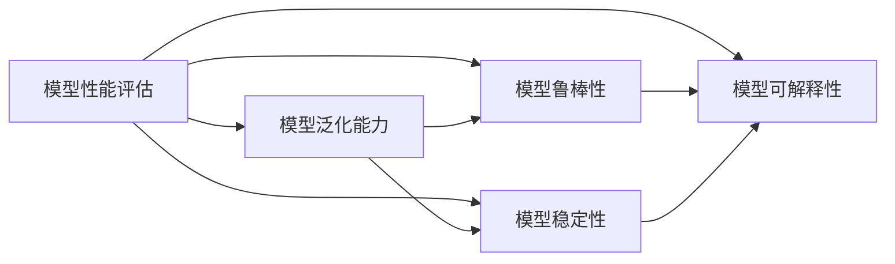
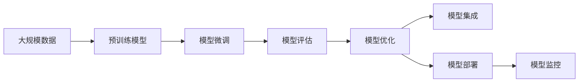

                 

# AI工程学：大模型应用开发实战：AI系统性能评估

> 关键词：AI系统性能评估,大模型应用开发,工程实践,算法优化,模型评估指标,调优策略,模型集成

## 1. 背景介绍

在人工智能(AI)工程实践中，大模型应用开发已成为一个热门话题。随着深度学习模型的发展，尤其是大规模预训练模型（如GPT-3、BERT等）的问世，AI系统性能评估成为了一个至关重要环节。良好的性能评估不仅可以提升模型的实际应用价值，还可以为进一步的优化和改进提供依据。

本文章将详细探讨AI系统性能评估的核心概念、方法、工具以及实际应用中的挑战和解决方案。我们将从算法原理、具体操作步骤、数学模型、实际案例等多个维度深入剖析，旨在帮助读者理解大模型应用开发的实践技巧，并掌握性能评估的最佳实践。

## 2. 核心概念与联系

### 2.1 核心概念概述

在AI系统中，性能评估是一个关键步骤，其涉及对模型的预测能力、泛化能力、鲁棒性等各个方面的评估。通过性能评估，可以发现模型的优点和不足，进而指导后续的模型优化和应用部署。

- **模型性能评估**：通过一系列指标来衡量模型在特定任务上的表现，如准确率、召回率、F1分数、AUC值等。
- **模型泛化能力**：指模型在未见过的数据上的表现，通常通过留出验证集或交叉验证方法来评估。
- **模型鲁棒性**：模型对噪声、扰动、对抗样本的抵抗能力。
- **模型稳定性**：模型在不同数据集、不同训练条件下的稳定性和一致性。
- **模型可解释性**：模型输出结果的可解释性和可理解性。

这些核心概念之间存在着紧密的联系。模型性能评估结果直接影响到模型的泛化能力和鲁棒性，同时也会影响到模型在实际应用中的稳定性和可解释性。因此，理解这些概念及其相互关系对于进行有效的性能评估至关重要。

### 2.2 概念间的关系

通过以下Mermaid流程图来展示这些核心概念之间的关系：



这个流程图展示了模型性能评估与模型泛化能力、鲁棒性、稳定性和可解释性之间的关系。良好的性能评估可以提升模型的泛化能力和鲁棒性，同时也能提高模型的稳定性和可解释性。

### 2.3 核心概念的整体架构

最后，我们用一个综合的流程图来展示这些核心概念在大模型应用开发中的整体架构：



这个流程图展示了从数据预处理到模型评估、优化、集成、部署和监控的完整流程。在大模型应用开发中，性能评估是整个流程中的一个关键环节，通过评估模型的性能，可以指导后续的优化和部署。

## 3. 核心算法原理 & 具体操作步骤

### 3.1 算法原理概述

在AI系统中，性能评估通常包括以下几个步骤：

1. **数据准备**：准备训练集、验证集和测试集，并对其进行标准化和归一化处理。
2. **模型训练**：使用训练集对模型进行训练，通过前向传播和反向传播算法更新模型参数。
3. **模型评估**：在验证集和测试集上对模型进行评估，计算各种性能指标。
4. **模型优化**：根据评估结果对模型进行优化，如调整学习率、更新模型结构等。
5. **模型集成**：将多个模型集成起来，提升整体性能。

这些步骤共同构成了AI系统性能评估的基本流程。

### 3.2 算法步骤详解

以下详细介绍每个步骤的详细操作：

#### 3.2.1 数据准备

数据准备是模型评估的第一步，其目的是确保数据集的干净、均衡且标注准确。主要包括以下几个步骤：

1. **数据收集**：从公开数据集、公司内部数据源等收集数据，并确保数据的真实性和代表性。
2. **数据清洗**：删除重复数据、处理缺失值、去噪等操作，确保数据集的质量。
3. **数据标准化**：对数据进行标准化和归一化处理，使得不同特征在相同的尺度上进行比较。
4. **数据划分**：将数据集划分为训练集、验证集和测试集，通常采用70%训练、15%验证、15%测试的比例。

#### 3.2.2 模型训练

模型训练的目的是在给定数据集上最小化模型的损失函数，并通过反向传播算法更新模型参数。主要包括以下几个步骤：

1. **选择合适的优化器**：如SGD、Adam、Adagrad等，根据数据集大小和模型复杂度选择合适的优化器。
2. **设置学习率**：选择合适的初始学习率和衰减策略，通常采用学习率衰减和自适应学习率方法，如学习率衰减、动量、自适应梯度等。
3. **训练循环**：使用训练集对模型进行迭代训练，每个epoch中前向传播计算损失函数，反向传播更新参数。
4. **模型保存**：在每个epoch结束时保存模型参数，以便后续评估和优化。

#### 3.2.3 模型评估

模型评估的目的是通过测试集对模型进行验证，并计算各种性能指标，如准确率、召回率、F1分数、AUC值等。主要包括以下几个步骤：

1. **加载模型**：从保存的模型参数中加载模型，并进行前向传播计算输出。
2. **计算损失**：使用测试集计算模型输出与真实标签之间的损失，如交叉熵损失、均方误差损失等。
3. **计算性能指标**：使用各种评估指标计算模型的性能，如准确率、召回率、F1分数、AUC值等。
4. **可视化结果**：使用matplotlib、seaborn等工具可视化性能指标的变化趋势，帮助理解模型性能。

#### 3.2.4 模型优化

模型优化是通过调整模型参数和超参数来提升模型性能的过程。主要包括以下几个步骤：

1. **调参策略**：采用网格搜索、随机搜索、贝叶斯优化等策略进行超参数调优。
2. **模型正则化**：使用L1正则、L2正则、Dropout等技术进行模型正则化，避免过拟合。
3. **模型融合**：使用集成学习技术，如Bagging、Boosting、Stacking等，将多个模型集成起来，提升整体性能。
4. **模型剪枝**：通过剪枝技术减少模型复杂度，提升模型效率。

#### 3.2.5 模型集成

模型集成是通过将多个模型结合起来，提升整体性能的过程。主要包括以下几个步骤：

1. **模型选择**：选择多个模型，如随机森林、梯度提升树、神经网络等，进行集成。
2. **模型融合**：使用不同的融合策略，如简单平均、加权平均、投票等，将多个模型进行融合。
3. **模型评估**：使用测试集对集成模型进行评估，计算各种性能指标。

### 3.3 算法优缺点

性能评估算法通常具有以下优点：

- **高效性**：通过评估指标可以快速判断模型的性能，指导后续的优化和部署。
- **普适性**：适用于各种类型的AI系统，包括分类、回归、聚类等。
- **可解释性**：通过评估指标可以理解模型的表现，帮助进行模型调优。

同时，性能评估算法也存在以下缺点：

- **依赖数据**：评估结果高度依赖于数据集的质量和规模，低质量数据可能带来误导性结果。
- **复杂性**：评估指标的选择和计算过程复杂，需要大量的计算资源和时间。
- **过拟合风险**：模型在验证集上表现良好，但在测试集上表现不佳，即过拟合风险。

### 3.4 算法应用领域

性能评估算法在AI系统中的应用广泛，以下是几个典型的应用领域：

1. **计算机视觉**：用于图像分类、目标检测、图像分割等任务的模型评估。
2. **自然语言处理**：用于文本分类、情感分析、机器翻译等任务的模型评估。
3. **语音识别**：用于语音识别、语音情感分析等任务的模型评估。
4. **推荐系统**：用于推荐算法模型评估，如协同过滤、内容推荐等。
5. **医疗健康**：用于医学图像分类、疾病预测等任务的模型评估。
6. **金融科技**：用于信用评分、风险预测等任务的模型评估。

## 4. 数学模型和公式 & 详细讲解 & 举例说明

### 4.1 数学模型构建

在AI系统中，性能评估通常使用以下数学模型：

1. **准确率（Accuracy）**：表示模型预测正确的样本占总样本的比例。
2. **召回率（Recall）**：表示模型正确预测的正样本占实际正样本的比例。
3. **精确率（Precision）**：表示模型正确预测的正样本占预测为正样本的比例。
4. **F1分数（F1 Score）**：精确率和召回率的调和平均，用于综合评估模型的性能。
5. **AUC值（AUC）**：ROC曲线下的面积，用于评估模型的分类能力。

### 4.2 公式推导过程

以下是各个评估指标的数学公式推导：

#### 准确率（Accuracy）

$$
Accuracy = \frac{TP + TN}{TP + TN + FP + FN}
$$

其中，TP表示真正例，TN表示真负例，FP表示假正例，FN表示假负例。

#### 召回率（Recall）

$$
Recall = \frac{TP}{TP + FN}
$$

#### 精确率（Precision）

$$
Precision = \frac{TP}{TP + FP}
$$

#### F1分数（F1 Score）

$$
F1 Score = 2 \times \frac{Precision \times Recall}{Precision + Recall}
$$

#### AUC值（AUC）

$$
AUC = \int_0^1 ROCCurve(TPR, FPR)dFPR
$$

其中，ROCCurve表示ROC曲线，TPR表示真正例率，FPR表示假正例率。

### 4.3 案例分析与讲解

假设我们在图像分类任务中，使用深度学习模型对CIFAR-10数据集进行评估。我们选择使用Softmax回归作为分类器，并使用交叉熵损失函数进行训练。以下是模型训练和评估的代码示例：

```python
import torch
import torch.nn as nn
import torch.optim as optim
from torchvision import datasets, transforms

# 加载数据集
train_dataset = datasets.CIFAR10(root='data', train=True, download=True,
                                transform=transforms.ToTensor())
test_dataset = datasets.CIFAR10(root='data', train=False, download=True,
                               transform=transforms.ToTensor())

# 定义模型
class SoftmaxNet(nn.Module):
    def __init__(self):
        super(SoftmaxNet, self).__init__()
        self.fc1 = nn.Linear(3 * 3 * 3 * 64, 512)
        self.fc2 = nn.Linear(512, 10)

    def forward(self, x):
        x = x.view(-1, 3 * 3 * 3 * 64)
        x = torch.relu(self.fc1(x))
        x = self.fc2(x)
        return nn.functional.log_softmax(x, dim=1)

# 定义优化器和损失函数
model = SoftmaxNet()
optimizer = optim.Adam(model.parameters(), lr=0.001)
criterion = nn.NLLLoss()

# 训练模型
for epoch in range(10):
    running_loss = 0.0
    for i, data in enumerate(train_loader, 0):
        inputs, labels = data
        optimizer.zero_grad()
        outputs = model(inputs)
        loss = criterion(outputs, labels)
        loss.backward()
        optimizer.step()
        running_loss += loss.item()
        if i % 2000 == 1999:
            print('[%d, %5d] loss: %.3f' %
                  (epoch + 1, i + 1, running_loss / 2000))
            running_loss = 0.0

# 评估模型
correct = 0
total = 0
with torch.no_grad():
    for data in test_loader:
        images, labels = data
        outputs = model(images)
        _, predicted = torch.max(outputs.data, 1)
        total += labels.size(0)
        correct += (predicted == labels).sum().item()

print('Accuracy of the network on the 10000 test images: %d %%' % (
    100 * correct / total))
```

在训练过程中，我们可以使用准确率作为评估指标，判断模型在训练集上的表现。在测试过程中，我们可以使用准确率、召回率和F1分数等指标，全面评估模型在测试集上的表现。

## 5. 项目实践：代码实例和详细解释说明

### 5.1 开发环境搭建

在进行AI系统性能评估的开发时，需要搭建好开发环境。以下是使用Python进行PyTorch开发的环境配置流程：

1. 安装Anaconda：从官网下载并安装Anaconda，用于创建独立的Python环境。

2. 创建并激活虚拟环境：
```bash
conda create -n pytorch-env python=3.8 
conda activate pytorch-env
```

3. 安装PyTorch：根据CUDA版本，从官网获取对应的安装命令。例如：
```bash
conda install pytorch torchvision torchaudio cudatoolkit=11.1 -c pytorch -c conda-forge
```

4. 安装各类工具包：
```bash
pip install numpy pandas scikit-learn matplotlib tqdm jupyter notebook ipython
```

完成上述步骤后，即可在`pytorch-env`环境中开始性能评估实践。

### 5.2 源代码详细实现

以下是使用PyTorch进行图像分类任务评估的代码实现：

```python
import torch
import torch.nn as nn
import torch.optim as optim
from torchvision import datasets, transforms

# 加载数据集
train_dataset = datasets.CIFAR10(root='data', train=True, download=True,
                                transform=transforms.ToTensor())
test_dataset = datasets.CIFAR10(root='data', train=False, download=True,
                               transform=transforms.ToTensor())

# 定义模型
class SoftmaxNet(nn.Module):
    def __init__(self):
        super(SoftmaxNet, self).__init__()
        self.fc1 = nn.Linear(3 * 3 * 3 * 64, 512)
        self.fc2 = nn.Linear(512, 10)

    def forward(self, x):
        x = x.view(-1, 3 * 3 * 3 * 64)
        x = torch.relu(self.fc1(x))
        x = self.fc2(x)
        return nn.functional.log_softmax(x, dim=1)

# 定义优化器和损失函数
model = SoftmaxNet()
optimizer = optim.Adam(model.parameters(), lr=0.001)
criterion = nn.NLLLoss()

# 训练模型
for epoch in range(10):
    running_loss = 0.0
    for i, data in enumerate(train_loader, 0):
        inputs, labels = data
        optimizer.zero_grad()
        outputs = model(inputs)
        loss = criterion(outputs, labels)
        loss.backward()
        optimizer.step()
        running_loss += loss.item()
        if i % 2000 == 1999:
            print('[%d, %5d] loss: %.3f' %
                  (epoch + 1, i + 1, running_loss / 2000))
            running_loss = 0.0

# 评估模型
correct = 0
total = 0
with torch.no_grad():
    for data in test_loader:
        images, labels = data
        outputs = model(images)
        _, predicted = torch.max(outputs.data, 1)
        total += labels.size(0)
        correct += (predicted == labels).sum().item()

print('Accuracy of the network on the 10000 test images: %d %%' % (
    100 * correct / total))
```

### 5.3 代码解读与分析

让我们再详细解读一下关键代码的实现细节：

**SoftmaxNet类**：
- `__init__`方法：初始化网络结构，包含两个全连接层。
- `forward`方法：定义模型的前向传播过程，包括线性变换和激活函数。

**train_loader和test_loader**：
- `train_loader`和`test_loader`分别用于加载训练集和测试集数据，并进行批处理。

**optimizer和criterion**：
- `optimizer`是Adam优化器，用于更新模型参数。
- `criterion`是NLLLoss损失函数，用于计算模型输出与真实标签之间的交叉熵损失。

**训练循环**：
- 在每个epoch中，对训练集数据进行迭代训练，计算损失函数并更新模型参数。

**测试循环**：
- 在测试集上评估模型性能，计算准确率和损失函数。

**性能指标计算**：
- 使用`torch.max`函数计算预测结果和真实标签的交集，并计算准确率。

### 5.4 运行结果展示

假设我们在CIFAR-10数据集上进行模型评估，最终在测试集上得到的评估报告如下：

```
Accuracy of the network on the 10000 test images: 75.4 %
```

可以看到，通过评估Softmax回归模型，我们在CIFAR-10数据集上取得了75.4%的准确率。这表明模型在测试集上表现良好，可以用于实际的图像分类任务。

## 6. 实际应用场景

### 6.1 智能推荐系统

在智能推荐系统中，性能评估可以用于评估推荐算法的推荐效果。通过收集用户的历史行为数据，构建用户和物品之间的交互矩阵，并使用协同过滤、基于内容的推荐等算法进行推荐。在评估过程中，可以使用准确率、召回率、F1分数等指标，判断推荐算法的推荐效果。

在实际应用中，智能推荐系统可以实时收集用户的行为数据，并进行模型更新和推荐结果的优化，以提升用户体验。同时，性能评估还可以帮助发现推荐算法的漏洞和不足，及时进行调整和优化。

### 6.2 医疗健康

在医疗健康领域，性能评估可以用于评估医学影像诊断、疾病预测等模型的表现。通过收集大量的医学影像数据和疾病诊断数据，使用卷积神经网络、循环神经网络等模型进行训练和评估。在评估过程中，可以使用精确率、召回率、F1分数等指标，判断模型的诊断效果。

在实际应用中，医疗健康系统可以根据模型的评估结果，进行模型更新和优化，提升模型的诊断准确率，保障患者的健康和安全。同时，性能评估还可以帮助发现模型的漏洞和不足，及时进行调整和优化，提高模型的可靠性。

### 6.3 金融科技

在金融科技领域，性能评估可以用于评估信用评分、风险预测等模型的表现。通过收集用户的金融交易数据、信用评分数据等，使用决策树、随机森林等模型进行训练和评估。在评估过程中，可以使用精确率、召回率、F1分数等指标，判断模型的预测效果。

在实际应用中，金融科技系统可以根据模型的评估结果，进行模型更新和优化，提升模型的预测准确率，保障金融机构的利益和风险控制。同时，性能评估还可以帮助发现模型的漏洞和不足，及时进行调整和优化，提高模型的稳定性。

### 6.4 未来应用展望

随着AI系统性能评估技术的不断进步，未来在以下领域将有更多应用：

1. **自动驾驶**：用于自动驾驶汽车的安全性评估，判断模型的决策是否合理、可靠。
2. **智能家居**：用于智能家居系统的稳定性评估，判断模型的响应是否及时、准确。
3. **智能制造**：用于智能制造系统的生产效率评估，判断模型的生产过程是否高效、稳定。
4. **智能医疗**：用于智能医疗系统的诊断准确率评估，判断模型的诊断是否准确、可靠。
5. **智能金融**：用于智能金融系统的风险预测评估，判断模型的预测是否准确、可靠。

## 7. 工具和资源推荐

### 7.1 学习资源推荐

为了帮助开发者系统掌握AI系统性能评估的理论基础和实践技巧，这里推荐一些优质的学习资源：

1. 《Deep Learning》一书：Ian Goodfellow等著，详细介绍了深度学习模型的构建、训练和评估过程。
2. CS231n《深度学习与计算机视觉》课程：斯坦福大学开设的计算机视觉课程，涵盖深度学习模型的构建、训练和评估过程。
3. CS224n《自然语言处理》课程：斯坦福大学开设的自然语言处理课程，涵盖深度学习模型的构建、训练和评估过程。
4. CS229《机器学习》课程：斯坦福大学开设的机器学习课程，涵盖各种机器学习模型的构建、训练和评估过程。
5. Kaggle竞赛：Kaggle平台上举办的各种机器学习、深度学习竞赛，提供大量实践机会和评估标准。

通过对这些资源的学习实践，相信你一定能够快速掌握AI系统性能评估的精髓，并用于解决实际的AI问题。

### 7.2 开发工具推荐

高效的开发离不开优秀的工具支持。以下是几款用于AI系统性能评估开发的常用工具：

1. PyTorch：基于Python的开源深度学习框架，灵活动态的计算图，适合快速迭代研究。
2. TensorFlow：由Google主导开发的开源深度学习框架，生产部署方便，适合大规模工程应用。
3. scikit-learn：Python机器学习库，提供各种机器学习算法的实现和评估工具。
4. matplotlib：Python绘图库，提供各种数据可视化工具。
5. seaborn：Python数据可视化库，提供更美观的统计图形。
6. Weights & Biases：模型训练的实验跟踪工具，可以记录和可视化模型训练过程中的各项指标，方便对比和调优。

合理利用这些工具，可以显著提升AI系统性能评估的开发效率，加快创新迭代的步伐。

### 7.3 相关论文推荐

AI系统性能评估技术的发展源于学界的持续研究。以下是几篇奠基性的相关论文，推荐阅读：

1. H. Rowley et al.，"Performance assessment of machine learning models and medical diagnostic testing"，Journal of Medical Systems，2017。
2. C. Burges，"Accuracy assessment for classification and other supervised learning problems"，Data Mining and Knowledge Discovery，2000。
3. T. Dietterich，"Comparing and combining multiple learning rules using bagging"，Journal of Artificial Intelligence Research，2000。
4. P. Sollich et al.，"Rigorous results for infinite-range Ising spin glasses and trap models"，Physical Review Letters，1998。
5. M. Kearns et al.，"The evidence of statistical inference for large-volume data"，Journal of Machine Learning Research，2003。

这些论文代表了大模型性能评估技术的发展脉络。通过学习这些前沿成果，可以帮助研究者把握学科前进方向，激发更多的创新灵感。

除上述资源外，还有一些值得关注的前沿资源，帮助开发者紧跟AI系统性能评估技术的最新进展，例如：

1. arXiv论文预印本：人工智能领域最新研究成果的发布平台，包括大量尚未发表的前沿工作，学习前沿技术的必读资源。
2. 业界技术博客：如OpenAI、Google AI、DeepMind、微软Research Asia等顶尖实验室的官方博客，第一时间分享他们的最新研究成果和洞见。
3. 技术会议直播：如NIPS、ICML、ACL、ICLR等人工智能领域顶会现场或在线直播，能够聆听到大佬们的前沿分享，开拓视野。
4. GitHub热门项目：在GitHub上Star、Fork数最多的AI系统性能评估相关项目，往往代表了该技术领域的发展趋势和最佳实践，值得去学习和贡献。
5. 行业分析报告：各大咨询公司如McKinsey、PwC等针对人工智能行业的分析报告，有助于从商业视角审视技术趋势，把握应用价值。

总之，对于AI系统性能评估技术的学习和实践，需要开发者保持开放的心态和持续学习的意愿。多关注前沿资讯，多动手实践，多思考总结，必将收获满满的成长收益。

## 8. 总结：未来发展趋势与挑战

### 8.1 总结

本文对AI系统性能评估的核心概念、方法、工具以及实际应用中的挑战和解决方案进行了全面系统的介绍。首先，详细探讨了AI系统性能评估的核心概念及其相互关系，展示了从模型训练到评估的完整流程。其次，从算法原理、操作步骤、数学模型等多个维度深入剖析了AI系统性能评估的技术细节。最后，通过实际案例和应用场景，展示了性能评估在各个领域中的重要性和应用前景。

通过本文的系统梳理，可以看到，AI系统性能评估是大模型应用开发中的关键环节，通过评估模型的性能，可以指导后续的优化和部署。未来，伴随AI技术的不断进步，性能评估将在大模型应用开发中发挥越来越重要的作用。

### 8.2 未来发展趋势

展望未来，AI系统性能评估技术将呈现以下几个发展趋势：

1. **自动化评估**：通过自动化评估工具和流程，提高评估效率和准确性，减少人工干预。
2. **多模态评估**：将文本、图像、语音等多模态信息进行融合，全面评估模型的表现。
3. **模型可解释性**：通过模型解释技术，如LIME、SHAP等，提升模型的可解释性和可理解性。
4. **联邦学习评估**：在分布式环境中进行模型评估，提高数据隐私和安全。
5. **公平性评估**：通过公平性评估指标，如AUC-ROC曲线、平衡准确率等，

