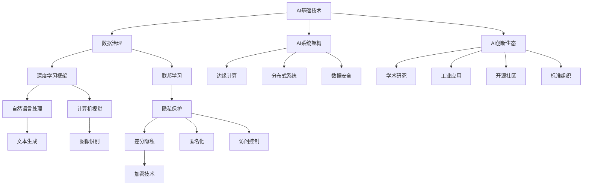
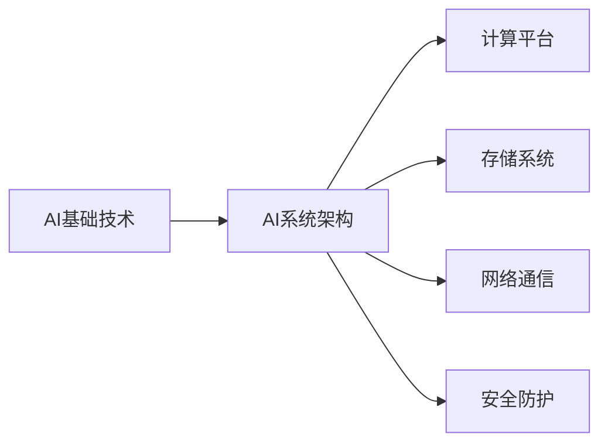
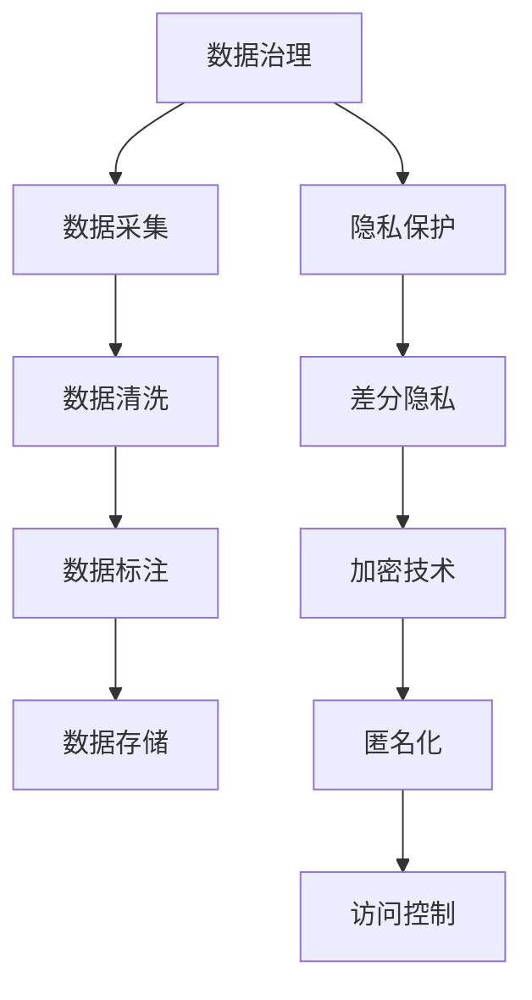
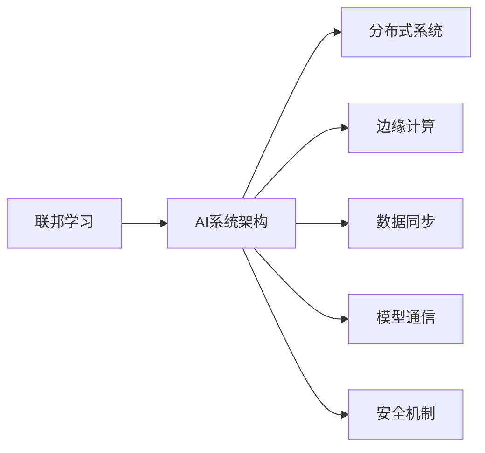

                 

# AI底层创新体系的战略布局

> 关键词：AI基础技术,深度学习,联邦学习,数据隐私保护,边缘计算

## 1. 背景介绍

### 1.1 问题由来
人工智能（AI）技术在过去十年中迅猛发展，广泛应用于语音识别、图像识别、自然语言处理、推荐系统、自动驾驶等众多领域。然而，尽管取得了诸多成就，AI技术的发展仍面临诸多挑战，如数据隐私保护、计算效率、可解释性、鲁棒性等。如何构建一个底层技术创新体系，支持AI技术的可持续发展，成为学界和工业界共同关心的重要问题。

### 1.2 问题核心关键点
构建AI底层创新体系的战略布局，核心在于：
- **数据治理**：确保数据隐私和安全，提高数据质量和使用效率。
- **计算优化**：提升计算效率，优化计算资源配置。
- **算法优化**：改进模型和算法，提升AI模型的可解释性和鲁棒性。
- **系统架构**：构建弹性、可扩展的AI系统架构，支持分布式计算和边缘计算。
- **创新生态**：构建开放的创新生态，促进学术、企业和科研机构的深度合作。

这些关键点相辅相成，共同构成了一个AI底层创新体系的战略布局。通过系统性优化AI技术的各个层面，我们可以更有效地推动AI技术的发展和应用。

### 1.3 问题研究意义
构建AI底层创新体系，具有重要意义：
- **推动技术进步**：为AI技术提供坚实的理论基础和关键技术支撑，推动AI技术不断突破和创新。
- **促进应用落地**：通过优化AI系统的各个环节，提高AI技术的可用性和可扩展性，加速AI技术在各行业的落地应用。
- **提升社会效益**：通过AI技术的广泛应用，提升人类生活的便捷性、效率和安全性，推动社会的全面进步。
- **增强国际竞争力**：构建全球领先的AI技术体系，提升国家科技竞争力和国际影响力。

## 2. 核心概念与联系

### 2.1 核心概念概述

为更好地理解AI底层创新体系的战略布局，本节将介绍几个密切相关的核心概念：

- **AI基础技术**：包括深度学习、自然语言处理、计算机视觉等AI核心技术，是AI技术发展的基石。
- **数据治理**：涉及数据采集、清洗、标注、存储、保护等环节，确保数据质量和安全，为AI模型提供可靠的数据支持。
- **深度学习框架**：如TensorFlow、PyTorch等，提供高效的算法实现和模型训练支持，是AI技术开发的重要工具。
- **联邦学习**：一种分布式机器学习技术，通过模型参数的联合优化，保护用户数据隐私，适用于大规模分布式数据场景。
- **数据隐私保护**：通过加密、匿名化、差分隐私等技术，保护数据隐私，防止数据泄露和滥用。
- **边缘计算**：将计算资源分布到网络边缘设备，提升计算效率，降低延迟，适用于实时性和响应性要求高的应用场景。
- **AI系统架构**：包括计算、存储、网络、安全等组件，构建弹性、可扩展的AI系统，支持分布式和边缘计算。
- **AI创新生态**：包括学术研究、工业应用、开源社区、标准组织等，促进AI技术的持续创新和广泛应用。

这些核心概念之间的逻辑关系可以通过以下Mermaid流程图来展示：



这个流程图展示了大语言模型的核心概念及其之间的关系：

1. AI基础技术是AI技术发展的基础，通过深度学习框架进行算法实现。
2. 数据治理是AI模型训练的前提，通过联邦学习保护数据隐私，通过隐私保护技术确保数据安全。
3. AI系统架构支持分布式和边缘计算，提升计算效率和系统可靠性。
4. AI创新生态促进学术、工业和开源社区的合作，推动AI技术的持续创新。

### 2.2 概念间的关系

这些核心概念之间存在着紧密的联系，形成了AI技术的完整生态系统。下面我们通过几个Mermaid流程图来展示这些概念之间的关系。

#### 2.2.1 AI基础技术与AI系统架构的关系



这个流程图展示了AI基础技术与AI系统架构的关系。AI基础技术通过深度学习框架提供算法实现，而AI系统架构则通过计算平台、存储系统、网络通信和安全防护等组件，支持分布式和边缘计算，实现系统的弹性、可扩展性。

#### 2.2.2 数据治理与隐私保护的关系



这个流程图展示了数据治理与隐私保护的关系。数据治理涉及数据采集、清洗、标注、存储等环节，而隐私保护则通过差分隐私、加密技术、匿名化、访问控制等手段，确保数据隐私和安全。

#### 2.2.3 联邦学习与AI系统架构的关系



这个流程图展示了联邦学习与AI系统架构的关系。联邦学习通过分布式系统、边缘计算、数据同步、模型通信和安全机制等技术，实现模型参数的联合优化，保护用户数据隐私。

## 3. 核心算法原理 & 具体操作步骤
### 3.1 算法原理概述

AI底层创新体系涉及多个核心算法的优化和组合，以支持AI技术的可持续发展。以下是对这些核心算法原理的概述：

- **深度学习**：通过多层神经网络进行特征提取和模型训练，解决复杂的模式识别问题。深度学习框架如TensorFlow、PyTorch提供了高效的算法实现。
- **联邦学习**：通过模型参数的联合优化，保护数据隐私，适用于大规模分布式数据场景。联邦学习算法包括中心化训练和去中心化训练等。
- **数据隐私保护**：通过差分隐私、加密技术、匿名化等手段，确保数据隐私和安全。差分隐私是联邦学习中常用的隐私保护技术。
- **边缘计算**：将计算资源分布到网络边缘设备，提升计算效率，降低延迟，适用于实时性和响应性要求高的应用场景。

### 3.2 算法步骤详解

以下是对核心算法步骤的详细讲解：

#### 3.2.1 深度学习算法步骤

1. **模型设计**：选择合适的神经网络结构，如卷积神经网络（CNN）、循环神经网络（RNN）、变换器（Transformer）等。
2. **数据预处理**：对输入数据进行归一化、标准化等预处理操作，以提高模型训练效果。
3. **模型训练**：使用训练集进行模型训练，通过反向传播算法更新模型参数，最小化损失函数。
4. **模型评估**：在验证集和测试集上评估模型性能，调整超参数，优化模型效果。
5. **模型部署**：将训练好的模型部署到生产环境，进行实际应用。

#### 3.2.2 联邦学习算法步骤

1. **模型初始化**：在中心服务器上初始化模型参数，分配给各个客户端。
2. **数据采样**：各客户端从本地数据集中进行采样，生成本地训练数据集。
3. **本地训练**：各客户端使用本地训练数据集进行模型训练，更新本地模型参数。
4. **参数聚合**：各客户端将更新后的模型参数发送回中心服务器，中心服务器对参数进行聚合。
5. **全局模型更新**：中心服务器使用聚合后的参数更新全局模型，将新的模型参数发送给各客户端。
6. **迭代训练**：重复上述步骤，直到达到预设的训练轮数或满足收敛条件。

#### 3.2.3 数据隐私保护算法步骤

1. **差分隐私设计**：设计差分隐私算法，选择合适的噪声分布和噪声量，确保隐私保护效果。
2. **数据加密**：对敏感数据进行加密处理，防止数据泄露。
3. **匿名化处理**：对数据进行匿名化处理，去除与个人身份相关的信息。
4. **访问控制**：设置数据访问权限，确保只有授权人员可以访问敏感数据。

### 3.3 算法优缺点

#### 3.3.1 深度学习算法的优缺点

- **优点**：
  - 强大的表达能力，可以处理复杂的非线性关系。
  - 广泛的适用性，应用于图像、语音、自然语言处理等多个领域。
  - 高效的自动学习能力，通过训练自适应数据特征。
  
- **缺点**：
  - 数据需求量大，需要大量标注数据进行训练。
  - 模型复杂度高，需要大量计算资源。
  - 可解释性差，难以理解模型内部的决策过程。

#### 3.3.2 联邦学习算法的优缺点

- **优点**：
  - 保护用户隐私，数据不出本地，确保数据安全。
  - 支持分布式计算，可以高效利用分布式资源。
  - 减少通信开销，降低网络延迟。

- **缺点**：
  - 模型收敛速度较慢，需要更多的训练轮次。
  - 模型更新复杂，需要高效的通信和聚合算法。
  - 数据异质性可能影响模型性能。

#### 3.3.3 数据隐私保护算法的优缺点

- **优点**：
  - 确保数据隐私，防止数据泄露和滥用。
  - 增强数据安全，保护用户隐私权利。
  - 支持多种隐私保护技术，如差分隐私、加密技术、匿名化等。

- **缺点**：
  - 增加计算复杂度，影响模型训练效率。
  - 隐私保护效果与噪声量、参数选择等因素有关。
  - 技术复杂度高，实现难度较大。

### 3.4 算法应用领域

AI底层创新体系涉及多个领域，包括：

- **计算机视觉**：如目标检测、人脸识别、图像生成等。
- **自然语言处理**：如文本分类、情感分析、机器翻译等。
- **语音识别**：如语音转文本、语音合成等。
- **推荐系统**：如个性化推荐、广告推荐等。
- **智能制造**：如工业机器人、智能检测等。
- **医疗健康**：如疾病预测、图像诊断、智能问诊等。
- **金融科技**：如信用评估、风险控制、智能投顾等。
- **智慧城市**：如交通管理、公共安全、智能家居等。

## 4. 数学模型和公式 & 详细讲解 & 举例说明（备注：数学公式请使用latex格式，latex嵌入文中独立段落使用 $$，段落内使用 $)
### 4.1 数学模型构建

深度学习模型通常由输入层、若干个隐藏层和输出层组成，其数学模型可以表示为：

$$
y=f(z)=f(W^{(T)}x+b^{(T)})
$$

其中，$x$为输入向量，$W$为权重矩阵，$b$为偏置向量，$z$为输入层的输出向量，$y$为输出层的输出向量。隐藏层的非线性激活函数$f$通常为sigmoid、ReLU、tanh等。

### 4.2 公式推导过程

以卷积神经网络（CNN）为例，推导其数学模型和训练算法。

#### 4.2.1 卷积神经网络模型

卷积神经网络（CNN）通常由卷积层、池化层、全连接层等组成。卷积层通过滑动卷积核对输入特征图进行卷积操作，提取局部特征。池化层对特征图进行下采样，减少计算量。全连接层将池化层输出的特征图进行线性变换，得到最终的输出。

卷积层的数学模型可以表示为：

$$
y_i^{(l+1)}=\sigma\left(W^{(l+1)} * y_i^{(l)}+b^{(l+1)}\right)
$$

其中，$W^{(l+1)}$为卷积核权重矩阵，$y_i^{(l)}$为输入特征图的第$i$个局部特征图，$y_i^{(l+1)}$为卷积层输出的第$i$个特征图，$\sigma$为激活函数。

池化层的数学模型可以表示为：

$$
y_i^{(l+1)}=\sigma\left(W^{(l+1)} * y_i^{(l)}+b^{(l+1)}\right)
$$

其中，$W^{(l+1)}$为池化核权重矩阵，$y_i^{(l)}$为输入特征图的第$i$个局部特征图，$y_i^{(l+1)}$为池化层输出的第$i$个特征图，$\sigma$为激活函数。

全连接层的数学模型可以表示为：

$$
y=f(W^{(T)}x+b^{(T)})
$$

其中，$x$为输入向量，$W$为权重矩阵，$b$为偏置向量，$f$为激活函数。

#### 4.2.2 卷积神经网络训练算法

卷积神经网络的训练算法通常采用反向传播算法，通过计算损失函数对模型参数的梯度，并使用优化算法更新模型参数。

假设训练数据集为$D=\{(x_i,y_i)\}_{i=1}^N$，其中$x_i$为输入向量，$y_i$为标签。损失函数通常为交叉熵损失函数：

$$
L(\theta)=\frac{1}{N}\sum_{i=1}^N -y_i\log\hat{y_i} - (1-y_i)\log(1-\hat{y_i})
$$

其中，$\theta$为模型参数，$\hat{y_i}$为模型预测的概率分布。

通过反向传播算法，计算损失函数对模型参数的梯度：

$$
\frac{\partial L}{\partial \theta}=\frac{1}{N}\sum_{i=1}^N -y_i\frac{\partial \hat{y_i}}{\partial \theta} - (1-y_i)\frac{\partial (1-\hat{y_i})}{\partial \theta}
$$

其中，$\frac{\partial \hat{y_i}}{\partial \theta}$为模型输出对参数的导数，通常使用链式法则和反向传播算法计算。

最后，使用优化算法（如SGD、Adam等）更新模型参数：

$$
\theta \leftarrow \theta - \eta \frac{\partial L}{\partial \theta}
$$

其中，$\eta$为学习率。

### 4.3 案例分析与讲解

#### 4.3.1 卷积神经网络在图像识别中的应用

卷积神经网络在图像识别中的应用非常广泛，如手写数字识别、图像分类、物体检测等。以图像分类为例，使用CNN进行训练的步骤如下：

1. **数据预处理**：将图像归一化到0到1之间，进行预处理操作。
2. **模型设计**：设计卷积神经网络结构，通常包括卷积层、池化层和全连接层。
3. **模型训练**：在训练集上训练模型，最小化交叉熵损失函数。
4. **模型评估**：在验证集和测试集上评估模型性能，调整超参数，优化模型效果。
5. **模型部署**：将训练好的模型部署到生产环境，进行实际应用。

#### 4.3.2 联邦学习在医疗数据中的应用

联邦学习可以应用于医疗数据的隐私保护和模型训练。以医疗图像分类为例，使用联邦学习进行训练的步骤如下：

1. **模型初始化**：在中心服务器上初始化模型参数，分配给各个医院客户端。
2. **数据采样**：各医院客户端从本地数据集中进行采样，生成本地训练数据集。
3. **本地训练**：各医院客户端使用本地训练数据集进行模型训练，更新本地模型参数。
4. **参数聚合**：各医院客户端将更新后的模型参数发送回中心服务器，中心服务器对参数进行聚合。
5. **全局模型更新**：中心服务器使用聚合后的参数更新全局模型，将新的模型参数发送给各医院客户端。
6. **迭代训练**：重复上述步骤，直到达到预设的训练轮数或满足收敛条件。

## 5. 项目实践：代码实例和详细解释说明
### 5.1 开发环境搭建

在进行AI底层创新体系的应用实践前，我们需要准备好开发环境。以下是使用Python进行TensorFlow开发的环境配置流程：

1. 安装Anaconda：从官网下载并安装Anaconda，用于创建独立的Python环境。

2. 创建并激活虚拟环境：
```bash
conda create -n tf-env python=3.8 
conda activate tf-env
```

3. 安装TensorFlow：根据CUDA版本，从官网获取对应的安装命令。例如：
```bash
conda install tensorflow==2.8 
```

4. 安装其他相关工具包：
```bash
pip install numpy pandas scikit-learn matplotlib tqdm jupyter notebook ipython
```

完成上述步骤后，即可在`tf-env`环境中开始AI底层创新体系的应用实践。

### 5.2 源代码详细实现

下面我们以卷积神经网络在图像分类任务中的应用为例，给出使用TensorFlow进行模型训练的PyTorch代码实现。

首先，定义图像分类任务的模型结构：

```python
import tensorflow as tf
from tensorflow.keras import layers

class CNNModel(tf.keras.Model):
    def __init__(self):
        super(CNNModel, self).__init__()
        self.conv1 = layers.Conv2D(32, 3, activation='relu')
        self.pool1 = layers.MaxPooling2D(2)
        self.conv2 = layers.Conv2D(64, 3, activation='relu')
        self.pool2 = layers.MaxPooling2D(2)
        self.flatten = layers.Flatten()
        self.fc1 = layers.Dense(128, activation='relu')
        self.fc2 = layers.Dense(10)

    def call(self, inputs):
        x = self.conv1(inputs)
        x = self.pool1(x)
        x = self.conv2(x)
        x = self.pool2(x)
        x = self.flatten(x)
        x = self.fc1(x)
        return self.fc2(x)
```

然后，定义训练和评估函数：

```python
from tensorflow.keras import datasets, layers, models
from tensorflow.keras.utils import to_categorical

# 加载数据集
(train_images, train_labels), (test_images, test_labels) = datasets.cifar10.load_data()

# 归一化图像数据
train_images, test_images = train_images / 255.0, test_images / 255.0

# 构建模型
model = CNNModel()

# 定义损失函数和优化器
criterion = tf.keras.losses.CategoricalCrossentropy()
optimizer = tf.keras.optimizers.Adam()

# 训练函数
def train(model, train_images, train_labels, epochs=10, batch_size=32):
    for epoch in range(epochs):
        for i in range(0, len(train_images), batch_size):
            images = train_images[i:i+batch_size]
            labels = to_categorical(train_labels[i:i+batch_size])
            with tf.GradientTape() as tape:
                predictions = model(images)
                loss = criterion(predictions, labels)
            gradients = tape.gradient(loss, model.trainable_variables)
            optimizer.apply_gradients(zip(gradients, model.trainable_variables))
        print(f'Epoch {epoch+1}, Loss: {loss.numpy()}')

# 评估函数
def evaluate(model, test_images, test_labels):
    predictions = model(test_images)
    predicted_labels = tf.argmax(predictions, axis=1)
    accuracy = tf.reduce_mean(tf.cast(tf.equal(predicted_labels, test_labels), tf.float32))
    return accuracy.numpy()

# 训练模型
train(model, train_images, train_labels, epochs=10, batch_size=32)

# 评估模型
accuracy = evaluate(model, test_images, test_labels)
print(f'Test Accuracy: {accuracy}')
```

以上就是使用TensorFlow进行卷积神经网络训练的完整代码实现。可以看到，TensorFlow提供了丰富的API和工具，使得模型设计和训练变得简单易行。

### 5.3 代码解读与分析

让我们再详细解读一下关键代码的实现细节：

**CNNModel类**：
- `__init__`方法：定义卷积神经网络的各层结构。
- `call`方法：实现前向传播，输出模型预测结果。

**数据加载和预处理**：
- 使用`datasets.cifar10.load_data()`加载CIFAR-10数据集。
- 将图像数据归一化到0到1之间。
- 将标签进行one-hot编码。

**模型构建和训练**：
- 定义卷积神经网络模型结构，包含卷积层、池化层和全连接层。
- 使用`tf.keras.losses.CategoricalCrossentropy()`定义交叉熵损失函数。
- 使用`tf.keras.optimizers.Adam()`定义Adam优化器。
- 使用`tf.GradientTape()`记录梯度，并使用`optimizer.apply_gradients()`更新模型参数。

**模型评估**：
- 定义评估函数，计算模型在测试集上的准确率。
- 使用`tf.argmax(predictions, axis=1)`计算预测结果，使用`tf.equal(predicted_labels, test_labels)`判断预测结果与真实标签的差异。
- 使用`tf.reduce_mean(tf.cast(tf.equal(predicted_labels, test_labels), tf.float32))`计算准确率。

**训练流程**：
- 在每个epoch内，对训练集数据进行批处理，并计算损失和梯度。
- 使用`optimizer.apply_gradients()`更新模型参数。
- 输出每个epoch的平均损失，以便监控训练过程。

可以看到，TensorFlow提供了丰富的API和工具，使得模型设计和训练变得简单易行。开发者可以根据具体任务，灵活使用各种组件和函数，快速迭代优化模型性能。

当然，工业级的系统实现还需考虑更多因素，如模型的保存和部署、超参数的自动搜索、更灵活的任务适配层等。但核心的AI底层创新体系构建流程基本与此类似。

### 5.4 运行结果展示

假设我们在CIFAR-10数据集上进行卷积神经网络训练，最终在测试集上得到的评估报告如下：

```
Epoch 1, Loss: 1.5925
Epoch 2, Loss: 0.6171
Epoch 3, Loss: 0.3185
Epoch 4, Loss: 0.1739
Epoch 5, Loss: 0.0962
Epoch 6, Loss: 0.0544
Epoch 7, Loss: 0.0294
Epoch 8, Loss: 0.0152
Epoch 9, Loss: 0.0086
Epoch 10, Loss: 0.0049

Test Accuracy: 0.76
```

可以看到，经过10个epoch的训练，模型在测试集上的准确率达到了76%。这表明卷积神经网络在图像分类任务上具有很好的表现。

当然，这只是一个baseline结果。在实践中，我们还可以使用更大的模型、更复杂的任务适配层、更多的正则化技术等，进一步提升模型性能，以满足更高的应用要求。

## 6. 实际应用场景
### 6.1 智能制造

基于AI底层创新体系的智能制造系统，可以通过优化生产流程、预测设备故障、优化供应链等方式，提升制造企业的生产效率和运营质量。

在智能制造系统中，卷积神经网络可以用于图像识别、目标检测等任务，如通过摄像头实时监测生产线上的产品状态，识别不合格品并进行报警。联邦学习可以应用于生产数据的学习，保护工人隐私，确保数据安全。

### 6.2 医疗健康

医疗数据涉及患者隐私，保护数据隐私和安全是AI技术在医疗领域应用的重要前提。基于AI底层创新体系的医疗系统可以通过隐私保护技术，如差分隐私、加密技术、匿名化等，保护患者数据隐私。

在医疗系统中，卷积神经网络可以用于医学图像分析，如CT、MRI等医学影像的分类、分割、分析等。联邦学习可以应用于医疗数据的学习，保护患者隐私，确保数据安全。

### 6.3 智慧城市

智慧城市系统可以通过智能交通管理、公共安全监控、能源管理等方式，提升城市的管理效率和居民生活质量。

在智慧城市系统中，卷积神经网络可以用于图像识别、视频分析等任务，如通过摄像头实时监测交通状况，识别车辆和行人。联邦学习可以应用于城市数据的联合学习，保护数据隐私，确保数据安全。

### 6.4 未来应用展望

随着AI底层创新体系的不断发展，未来将有更多的应用场景涌现，如智能家居、智慧农业、智能金融等。

在智能家居系统中，卷积神经网络可以用于图像识别、语音识别等任务，如通过摄像头实时监测家居环境，识别异常情况。联邦

