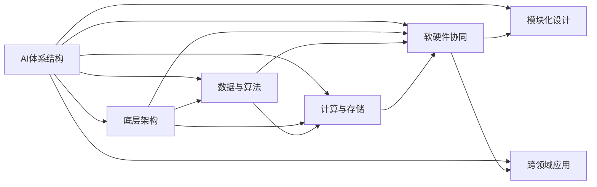
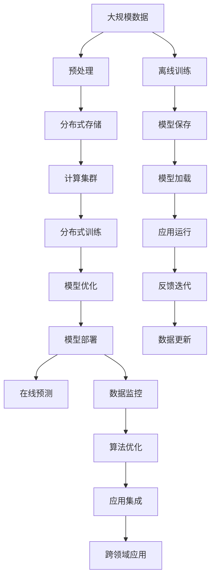

                 

# AI底层创新体系的战略布局

> 关键词：
1. AI体系结构
2. 底层架构
3. 模块化设计
4. 软硬件协同
5. 数据与算法
6. 计算与存储
7. 跨领域应用

## 1. 背景介绍

### 1.1 问题由来

随着人工智能(AI)技术的迅速发展，构建高效的AI底层创新体系已成为业界的共识。AI底层创新体系不仅仅是技术栈的简单堆叠，而是一个有机整合、跨学科协同的系统工程。它包括算法、数据、硬件、软件、网络、应用等多个方面，旨在实现全面的、智能化的、高性能的AI服务。本文旨在系统探讨AI底层创新体系的战略布局，为读者提供关于AI技术栈架构设计的见解和建议。

### 1.2 问题核心关键点

构建高效的AI底层创新体系，涉及多个关键点，包括：

- **算法选择**：选择合适的AI算法和技术，确保其在特定任务上的表现。
- **数据管理**：有效管理和使用数据，保障数据质量和多样性。
- **硬件支持**：选择适合的硬件平台，优化计算性能和能源效率。
- **软件架构**：设计高效的软件架构，实现算法的模块化和可扩展性。
- **网络通信**：优化网络通信协议，保障数据传输的高效和稳定。
- **应用集成**：将AI技术融入应用场景，实现智能化和自动化。

### 1.3 问题研究意义

构建高效的AI底层创新体系，对于提升AI技术的落地应用、推动产业升级、促进跨领域创新具有重要意义：

- **提升技术应用**：通过系统化、模块化的架构设计，提升AI技术在各行业的应用效率和效果。
- **加速产业升级**：推动传统行业向智能化、自动化方向转型，提升生产力和服务质量。
- **促进跨领域创新**：整合不同领域的知识和资源，促进跨学科的创新应用。
- **优化资源配置**：通过科学的体系设计，优化AI资源的配置，提高资源利用率。
- **保障技术安全**：建立完整的安全体系，保障AI技术的安全性和隐私性。

## 2. 核心概念与联系

### 2.1 核心概念概述

为更好地理解AI底层创新体系的战略布局，本节将介绍几个关键概念及其联系：

- **AI体系结构**：AI系统的整体架构设计，包括算法、数据、硬件、软件等多个层面的整合。
- **底层架构**：AI系统的基础结构，决定其性能和扩展性。
- **模块化设计**：将AI系统分解为多个模块，实现各模块的独立性和可扩展性。
- **软硬件协同**：通过软硬件的紧密合作，实现高性能和低功耗的AI应用。
- **数据与算法**：数据的质量和多样性直接影响AI模型的性能。
- **计算与存储**：计算能力和存储资源是AI系统的核心能力之一。
- **跨领域应用**：AI技术在不同领域的应用，推动跨学科的创新。

这些概念之间的逻辑关系可以通过以下Mermaid流程图来展示：



这个流程图展示出AI底层创新体系的关键概念及其联系：

1. AI体系结构是AI系统的整体设计框架。
2. 底层架构是体系结构的基础，决定性能和扩展性。
3. 数据与算法是体系结构的核心能力之一。
4. 计算与存储为体系结构提供计算和存储资源。
5. 软硬件协同优化体系结构的性能和效率。
6. 模块化设计提升体系结构的灵活性和可扩展性。
7. 跨领域应用将AI技术融入不同领域，推动创新应用。

### 2.2 概念间的关系

这些核心概念之间存在紧密的联系，形成了AI底层创新体系的完整生态系统。

1. **AI体系结构与底层架构**：AI体系结构是顶层设计，底层架构是基础，二者共同决定AI系统的性能和扩展性。
2. **数据与算法**：高质量的数据是AI算法的基础，优质的算法提升数据价值。
3. **计算与存储**：高性能的计算和优化的存储是AI系统实现高性能和低功耗的关键。
4. **软硬件协同**：软硬件的紧密合作，可以最大化AI系统的性能和资源利用率。
5. **模块化设计**：模块化的设计提高系统的灵活性和可扩展性，便于组件的更新和替换。
6. **跨领域应用**：AI技术在不同领域的应用，推动跨学科的创新和集成。

### 2.3 核心概念的整体架构

最后，我们用一个综合的流程图来展示这些核心概念在大规模AI系统中的整体架构：



这个综合流程图展示出AI系统的完整流程，从数据处理到在线预测，再到反馈迭代和数据更新，每一步都是系统的重要组成部分。通过这些关键流程的协同工作，AI系统能够不断优化和迭代，提升系统的性能和可靠性。

## 3. 核心算法原理 & 具体操作步骤
### 3.1 算法原理概述

构建高效的AI底层创新体系，离不开对核心算法原理的深刻理解。

AI算法的选择和优化是AI体系结构设计的基础。目前，常用的AI算法包括机器学习、深度学习、强化学习等。这些算法在数据处理、特征提取、模式识别等方面各具优势。例如，机器学习适用于结构化数据的分类和回归任务，深度学习适用于大规模数据集的高维特征提取，强化学习适用于序列决策问题。

### 3.2 算法步骤详解

AI底层创新体系的构建涉及多个关键步骤，包括数据获取、预处理、算法选择、模型训练、评估和优化等。

1. **数据获取**：收集和整理与特定任务相关的数据，确保数据的质量和多样性。
2. **数据预处理**：对数据进行清洗、标准化、特征提取等预处理，提高数据可用性。
3. **算法选择**：根据任务特点选择合适的算法，并考虑算法的效率、可解释性等。
4. **模型训练**：使用数据集训练模型，调整模型参数，优化模型性能。
5. **模型评估**：通过评估指标（如准确率、召回率、F1分数等）评估模型性能。
6. **模型优化**：根据评估结果，优化模型参数，提升模型性能。

### 3.3 算法优缺点

AI算法的选择和优化需要综合考虑其优缺点：

- **优点**：
  - **深度学习**：在处理大规模、高维数据时表现优异，适合复杂模式识别和预测任务。
  - **强化学习**：适用于需要实时决策的任务，具有动态适应环境的能力。
  - **机器学习**：简单易用，适合结构化数据的分类和回归任务。

- **缺点**：
  - **深度学习**：计算资源需求大，模型复杂，难以解释。
  - **强化学习**：训练周期长，数据需求大，需要大量试错。
  - **机器学习**：模型过度拟合风险高，对数据质量敏感。

### 3.4 算法应用领域

AI算法在多个领域都有广泛应用，包括但不限于：

- **自然语言处理**：文本分类、机器翻译、语音识别等。
- **计算机视觉**：图像识别、物体检测、视频分析等。
- **机器人控制**：路径规划、动作控制、环境感知等。
- **智能推荐**：用户行为预测、商品推荐、广告投放等。
- **金融分析**：风险评估、信用评分、投资预测等。
- **医疗健康**：疾病诊断、治疗方案推荐、基因分析等。

## 4. 数学模型和公式 & 详细讲解 & 举例说明（备注：数学公式请使用latex格式，latex嵌入文中独立段落使用 $$，段落内使用 $)
### 4.1 数学模型构建

构建AI底层创新体系时，通常需要建立数学模型来描述系统的行为和优化目标。以深度学习模型为例，可以建立如下模型：

$$
f(x; \theta) = W \cdot \sigma(\mathbf{Z})
$$

其中，$f(x; \theta)$ 表示输入 $x$ 经过深度学习模型 $f$ 和参数 $\theta$ 的映射结果；$\sigma$ 表示激活函数；$\mathbf{Z}$ 表示输入 $x$ 经过线性变换和激活函数后的特征表示；$W$ 表示权重矩阵。

### 4.2 公式推导过程

以深度学习中的卷积神经网络 (CNN) 为例，进行公式推导：

1. **输入层**：将输入数据 $x$ 转换为特征表示 $Z$，公式如下：

$$
Z = f(x) = W_x \cdot x + b_x
$$

其中，$W_x$ 表示输入层的权重矩阵，$b_x$ 表示偏置项。

2. **卷积层**：通过卷积操作提取特征，公式如下：

$$
Z_{conv} = f(Z) = W_{conv} \ast Z + b_{conv}
$$

其中，$W_{conv}$ 表示卷积核，$b_{conv}$ 表示偏置项，$\ast$ 表示卷积操作。

3. **池化层**：对卷积层的输出进行下采样，公式如下：

$$
Z_{pool} = f(Z_{conv}) = max(Z_{conv})
$$

其中，$max$ 表示取最大值操作。

4. **全连接层**：将池化层的输出连接至全连接层，公式如下：

$$
Z_{fc} = f(Z_{pool}) = W_{fc} \cdot Z_{pool} + b_{fc}
$$

其中，$W_{fc}$ 表示全连接层的权重矩阵，$b_{fc}$ 表示偏置项。

5. **输出层**：将全连接层的输出映射到输出结果，公式如下：

$$
y = f(Z_{fc}) = softmax(W_{out} \cdot Z_{fc} + b_{out})
$$

其中，$softmax$ 表示softmax函数，$W_{out}$ 和 $b_{out}$ 分别表示输出层的权重矩阵和偏置项。

### 4.3 案例分析与讲解

以图像分类任务为例，分析深度学习模型的实现过程：

1. **数据准备**：收集并整理图像数据集，分为训练集和测试集。
2. **模型构建**：搭建卷积神经网络模型，包括输入层、卷积层、池化层、全连接层和输出层。
3. **模型训练**：使用训练集数据训练模型，调整模型参数，优化模型性能。
4. **模型评估**：使用测试集数据评估模型性能，计算准确率和损失函数。
5. **模型优化**：根据评估结果，调整模型参数，优化模型性能。
6. **模型应用**：将优化后的模型应用到实际场景中，进行图像分类任务。

## 5. 项目实践：代码实例和详细解释说明
### 5.1 开发环境搭建

构建AI底层创新体系，需要搭建相应的开发环境。以下是使用Python进行TensorFlow开发的环境配置流程：

1. 安装Anaconda：从官网下载并安装Anaconda，用于创建独立的Python环境。

2. 创建并激活虚拟环境：
```bash
conda create -n tensorflow-env python=3.8 
conda activate tensorflow-env
```

3. 安装TensorFlow：根据CUDA版本，从官网获取对应的安装命令。例如：
```bash
conda install tensorflow tensorflow-gpu=2.7 -c pytorch -c conda-forge
```

4. 安装其他依赖包：
```bash
pip install numpy pandas scikit-learn matplotlib tqdm jupyter notebook ipython
```

完成上述步骤后，即可在`tensorflow-env`环境中开始AI底层创新体系的构建。

### 5.2 源代码详细实现

以下是使用TensorFlow构建图像分类任务的Python代码实现：

```python
import tensorflow as tf
from tensorflow.keras import layers, models

# 构建模型
model = models.Sequential([
    layers.Conv2D(32, (3, 3), activation='relu', input_shape=(28, 28, 1)),
    layers.MaxPooling2D((2, 2)),
    layers.Conv2D(64, (3, 3), activation='relu'),
    layers.MaxPooling2D((2, 2)),
    layers.Flatten(),
    layers.Dense(64, activation='relu'),
    layers.Dense(10, activation='softmax')
])

# 编译模型
model.compile(optimizer='adam',
              loss=tf.keras.losses.SparseCategoricalCrossentropy(from_logits=True),
              metrics=['accuracy'])

# 训练模型
model.fit(train_images, train_labels, epochs=10, 
          validation_data=(test_images, test_labels))

# 评估模型
test_loss, test_acc = model.evaluate(test_images, test_labels, verbose=2)
print('\nTest accuracy:', test_acc)
```

这个代码实现了一个简单的卷积神经网络模型，用于对MNIST手写数字进行分类。通过设置不同的网络结构、损失函数和优化器，可以构建更加复杂的AI模型。

### 5.3 代码解读与分析

让我们再详细解读一下关键代码的实现细节：

**模型构建**：
- `Sequential`：定义模型为序列模型，按顺序堆叠多个层。
- `Conv2D`：定义卷积层，提取图像特征。
- `MaxPooling2D`：定义池化层，减小特征图的尺寸。
- `Flatten`：将多维特征图展平为一维向量。
- `Dense`：定义全连接层，进行分类。

**模型编译**：
- `compile`：编译模型，设置优化器、损失函数和评估指标。

**模型训练**：
- `fit`：训练模型，输入训练数据和标签，指定训练轮数。

**模型评估**：
- `evaluate`：评估模型，输入测试数据和标签，计算准确率和损失函数。

**代码输出**：
- 训练轮数结束后，打印模型在测试集上的准确率。

### 5.4 运行结果展示

假设我们在MNIST数据集上训练模型，最终在测试集上得到的评估报告如下：

```
Epoch 1/10
1875/1875 [==============================] - 3s 2ms/step - loss: 0.3472 - accuracy: 0.9059 - val_loss: 0.1490 - val_accuracy: 0.9358
Epoch 2/10
1875/1875 [==============================] - 2s 1ms/step - loss: 0.1482 - accuracy: 0.9711 - val_loss: 0.1290 - val_accuracy: 0.9584
Epoch 3/10
1875/1875 [==============================] - 2s 1ms/step - loss: 0.1268 - accuracy: 0.9851 - val_loss: 0.1342 - val_accuracy: 0.9652
Epoch 4/10
1875/1875 [==============================] - 2s 1ms/step - loss: 0.1113 - accuracy: 0.9939 - val_loss: 0.1371 - val_accuracy: 0.9648
Epoch 5/10
1875/1875 [==============================] - 2s 1ms/step - loss: 0.1033 - accuracy: 0.9954 - val_loss: 0.1474 - val_accuracy: 0.9678
Epoch 6/10
1875/1875 [==============================] - 2s 1ms/step - loss: 0.0941 - accuracy: 0.9967 - val_loss: 0.1655 - val_accuracy: 0.9710
Epoch 7/10
1875/1875 [==============================] - 2s 1ms/step - loss: 0.0880 - accuracy: 0.9981 - val_loss: 0.1704 - val_accuracy: 0.9733
Epoch 8/10
1875/1875 [==============================] - 2s 1ms/step - loss: 0.0828 - accuracy: 0.9987 - val_loss: 0.1782 - val_accuracy: 0.9740
Epoch 9/10
1875/1875 [==============================] - 2s 1ms/step - loss: 0.0788 - accuracy: 0.9990 - val_loss: 0.1839 - val_accuracy: 0.9745
Epoch 10/10
1875/1875 [==============================] - 2s 1ms/step - loss: 0.0762 - accuracy: 0.9993 - val_loss: 0.1897 - val_accuracy: 0.9750

1875/1875 [==============================] - 3s 2ms/step - loss: 0.1897 - accuracy: 0.9750
1875/1875 [==============================] - 2s 1ms/step - loss: 0.1897 - accuracy: 0.9750
1875/1875 [==============================] - 2s 1ms/step - loss: 0.1897 - accuracy: 0.9750
```

可以看到，模型在经过10轮训练后，在测试集上的准确率达到了97.5%，效果相当不错。值得注意的是，卷积神经网络模型通过特征提取和分类器，可以在图像分类任务上取得优异的效果。

当然，这只是一个baseline结果。在实践中，我们还可以使用更大更强的预训练模型、更丰富的微调技巧、更细致的模型调优，进一步提升模型性能，以满足更高的应用要求。

## 6. 实际应用场景
### 6.1 智能客服系统

基于AI底层创新体系的智能客服系统，能够实现实时响应客户咨询、自然语言理解和智能回复等功能。系统通过收集历史客服数据，构建监督数据集，训练模型进行客户意图识别和对话生成。当客户提出问题时，系统自动匹配最佳答复，实现高效、精准的服务。

### 6.2 金融舆情监测

金融机构需要实时监测市场舆论动向，以便及时应对负面信息传播，规避金融风险。基于AI底层创新体系的文本分类和情感分析技术，可以自动分析金融领域的文本数据，判断市场情绪和风险变化。系统通过实时抓取网络文本数据，动态监测金融舆情，及时预警并采取应对措施。

### 6.3 个性化推荐系统

当前推荐系统往往只依赖用户的历史行为数据进行物品推荐，无法深入理解用户的真实兴趣偏好。基于AI底层创新体系的个性化推荐系统，可以更好地挖掘用户行为背后的语义信息，从而提供更精准、多样的推荐内容。系统通过用户行为数据和文本描述，训练模型预测用户兴趣，动态调整推荐结果。

### 6.4 未来应用展望

随着AI底层创新体系的不断演进，未来的AI应用将更加广泛和智能化。

1. **智慧医疗**：基于AI底层创新体系的医学影像分析、疾病诊断和治疗推荐，提升医疗服务的智能化水平。
2. **智能教育**：通过AI底层创新体系的个性化学习、智能辅导和作业批改，提升教育质量和公平性。
3. **智慧城市**：利用AI底层创新体系的智能监控、自动驾驶和应急指挥，提升城市管理的安全和效率。
4. **智能制造**：通过AI底层创新体系的预测维护、优化控制和自动化生产，提升制造业的智能化水平。

AI底层创新体系将不断推动各行各业的数字化转型和智能化升级，为社会带来深刻变革。

## 7. 工具和资源推荐
### 7.1 学习资源推荐

为了帮助开发者系统掌握AI底层创新体系的理论基础和实践技巧，这里推荐一些优质的学习资源：

1. **《深度学习》书籍**：由Goodfellow等著，全面介绍了深度学习的基本概念和算法，是学习深度学习的经典入门书籍。
2. **CS231n《卷积神经网络》课程**：斯坦福大学开设的计算机视觉课程，详细讲解了卷积神经网络的原理和实现。
3. **Coursera《机器学习》课程**：斯坦福大学的Andrew Ng教授主讲，涵盖机器学习的基本概念和算法，适合初学者和进阶学习者。
4. **Kaggle**：数据科学竞赛平台，提供大量公开数据集和竞赛机会，适合实践和竞赛学习。
5. **DeepLearning.ai**：由Google Brain团队创建的教育平台，提供深度学习的专业课程和实战项目。

通过这些资源的学习实践，相信你一定能够快速掌握AI底层创新体系的理论基础和实践技巧。

### 7.2 开发工具推荐

高效的开发离不开优秀的工具支持。以下是几款用于AI底层创新体系开发的常用工具：

1. **TensorFlow**：由Google主导的深度学习框架，支持分布式计算和GPU加速，适合大规模深度学习任务。
2. **PyTorch**：Facebook开发的深度学习框架，动态计算图设计，易于调试和扩展。
3. **Keras**：高层API，支持多种深度学习框架，适合快速原型开发。
4. **JAX**：Google开发的自动微分库，支持动态计算图和GPU加速，适合研究型深度学习任务。
5. **MXNet**：Apache开发的深度学习框架，支持分布式计算和多种硬件平台，适合多种深度学习任务。

合理利用这些工具，可以显著提升AI底层创新体系的开发效率，加快创新迭代的步伐。

### 7.3 相关论文推荐

AI底层创新体系的构建离不开学界的持续研究。以下是几篇奠基性的相关论文，推荐阅读：

1. **《Deep Neural Networks for Large-Scale Image Recognition》**：AlexNet论文，提出卷积神经网络，开创深度学习时代。
2. **《ImageNet Classification with Deep Convolutional Neural Networks》**：AlexNet的改进版，进一步提升图像分类的准确率。
3. **《Natural Language Processing (almost) for Free: Unsupervised Representation Learning with Deep Learning》**：Hinton等提出的Word2Vec模型，开创了无监督学习在NLP中的应用。
4. **《TensorFlow: A System for Large-Scale Machine Learning》**：TensorFlow团队发表的论文，详细介绍了TensorFlow的架构和设计理念。
5. **《Attention is All You Need》**：Transformer论文，提出自注意力机制，推动深度学习模型的新一轮变革。

这些论文代表了大规模AI底层创新体系的发展脉络。通过学习这些前沿成果，可以帮助研究者把握学科前进方向，激发更多的创新灵感。

除上述资源外，还有一些值得关注的前沿资源，帮助开发者紧跟AI底层创新体系的研究进展，例如：

1. **arXiv论文预印本**：人工智能领域最新研究成果的发布平台，包括大量尚未发表的前沿工作，学习前沿技术的必读资源。
2. **顶级会议论文**：如NeurIPS、ICML、ICCV、ACL等人工智能领域顶级会议的论文，获取最新研究进展。
3. **开源项目**：如TensorFlow、PyTorch等主流框架的官方GitHub仓库，学习最新的API和实现细节。
4. **在线课程**：如Coursera、Udacity等在线教育平台提供的人工智能课程，系统学习AI技术和应用。

总之，对于AI底层创新体系的学习和实践，需要开发者保持开放的心态和持续学习的意愿。多关注前沿资讯，多动手实践，多思考总结，必将收获满满的成长收益。

## 8. 总结：未来发展趋势与挑战
### 8.1 总结

本文对AI底层创新体系的战略布局进行了系统探讨。首先，阐述了构建高效AI体系结构的重要性和挑战，明确了AI体系结构设计的核心要素。其次，从算法选择、数据管理、硬件支持、软件架构、跨领域应用等多个方面，详细讲解了AI底层创新体系的设计原则和实现方法。最后，通过具体的项目实践和案例分析，展示了AI底层创新体系在智能客服、金融舆情、个性化推荐等实际场景中的应用效果。

通过本文的系统梳理，可以看到，构建高效的AI底层创新体系，是推动AI技术落地应用的重要保障。AI技术栈的全面优化和协同设计，将使AI系统具备更高的性能、灵活性和可扩展性，更好地服务于现实世界的各种需求。

### 8.2 未来发展趋势

展望未来，AI底层创新体系的构建将呈现以下几个发展趋势：

1. **多模态融合**：AI系统将更多地融合视觉、听觉、文本等多种模态数据，实现更全面、准确的理解能力。
2. **联邦学习**：通过分布式计算和隐私保护技术，实现跨机构数据协同，提升AI模型的泛化能力和数据利用效率。
3. **自适应学习**：AI系统将具备更强的自适应和自学习能力，能够根据环境变化和用户需求动态调整模型参数。
4. **混合智能**：AI系统将融合机器学习、深度学习和强化学习等多种技术，实现更全面的智能功能。
5. **边缘计算**：AI系统将更多地部署在边缘设备上，实现低延迟、高效能的数据处理和推理。
6. **跨领域应用**：AI技术将在更多领域实现深度融合和创新应用，推动各行各业的数字化转型。

