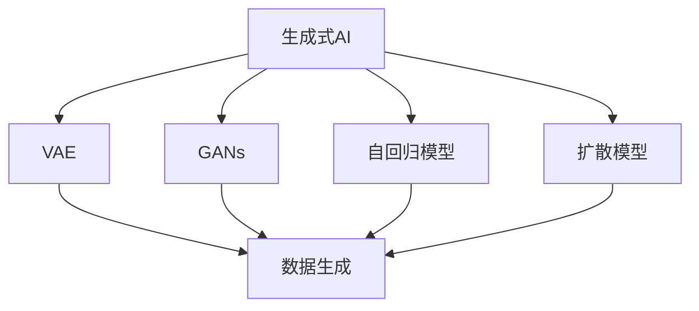

                 

## 1. 背景介绍

### 1.1 问题由来
人工智能（AI）技术正迅速改变着我们的生活方式和社会结构。随着深度学习、机器学习等技术的不断突破，生成式AI（Generative AI）这一新兴领域逐渐崭露头角。生成式AI不仅在图像、文本、音频等领域展示了惊人的生成能力，更在医疗、教育、娱乐等多个领域产生了广泛而深远的影响。本文将系统探讨生成式AI的原理、应用及未来趋势，展示其推动社会进步的巨大潜力。

### 1.2 问题核心关键点
生成式AI的核心在于通过模型生成具有高度逼真、有意义的新数据。与传统的基于数据的AI不同，生成式AI直接从模型的输出中学习数据分布，能够生成未见过的高质量样本。本文将围绕以下几个核心问题展开：

1. **生成式AI的生成原理是什么？**
2. **生成式AI在实际应用中如何构建数学模型？**
3. **生成式AI有哪些具体应用？**
4. **生成式AI的未来发展趋势与面临的挑战是什么？**

### 1.3 问题研究意义
生成式AI作为AI的新纪元，具有重大的理论价值和应用潜力。通过生成式AI，我们可以创建前所未有的数据，推动科学研究、教育普及、娱乐体验的革新，并在医疗、金融、制造等领域提供更加个性化、高效的服务。理解和掌握生成式AI的核心原理与应用，将为未来的技术创新和产业发展提供坚实基础。

## 2. 核心概念与联系

### 2.1 核心概念概述

为了深入理解生成式AI，首先需要明确几个关键概念：

- **生成式AI（Generative AI）**：指能够生成新数据的AI模型。这类模型通过学习数据分布，能够在新的数据样本上生成与训练集相似的数据，广泛应用于生成图像、文本、音频等领域。

- **变分自编码器（Variational Autoencoder, VAE）**：一种生成式模型，能够将数据编码为潜空间中的向量，并从这些向量中生成新的数据。VAE是目前生成式AI中最具代表性的方法之一。

- **生成对抗网络（Generative Adversarial Networks, GANs）**：通过两个相互竞争的神经网络（生成器和判别器）训练生成模型，能够生成高度逼真的新数据。GANs在图像生成、视频合成等领域取得了显著进展。

- **自回归模型（Autoregressive Models）**：通过递归地预测序列中的下一个值来生成新数据。自回归模型如LSTM、GRU等，在文本生成、语音合成等领域得到了广泛应用。

- **扩散模型（Diffusion Models）**：通过缓慢增加噪声的过程，将数据从低概率分布推向高概率分布，生成新数据。扩散模型在图像生成、音频生成等领域展示了卓越的生成效果。

这些概念通过以下Mermaid流程图进行了关联：



该图表展示了生成式AI的多种实现方式，每种方式都在生成新数据这一核心目标上达成一致。

### 2.2 概念间的关系

生成式AI的各个核心概念之间存在紧密的联系，形成一个完整的生成式AI生态系统：

- **VAE**、**GANs**、**自回归模型**和**扩散模型**共同构成了生成式AI的四大基本框架，通过不同的算法和技术手段实现数据生成。
- **数据生成**是生成式AI的核心目标，通过这些模型生成的数据，可以在各个应用场景中发挥作用。
- **自监督学习**和**无监督学习**为生成式AI提供了训练数据的来源，无需大量标注数据即可进行有效训练。

生成式AI的这些特性使得其在数据生成、图像和视频制作、自然语言处理等领域展现出巨大的潜力。

## 3. 核心算法原理 & 具体操作步骤

### 3.1 算法原理概述
生成式AI的算法原理通常基于概率模型，通过学习数据分布生成新样本。主要包括以下几个步骤：

1. **数据预处理**：将原始数据转换为模型能够处理的格式，如将图像转换为像素数组，将文本转换为序列数据。
2. **模型训练**：通过训练数据学习数据分布，构建生成模型。
3. **生成新数据**：使用训练好的模型生成新的数据样本。

### 3.2 算法步骤详解
以**生成对抗网络（GANs）**为例，详细阐述生成式AI的生成过程：

**步骤1: 准备生成器和判别器**
- 生成器（Generator）：将随机噪声作为输入，生成新的数据样本。
- 判别器（Discriminator）：区分真实数据和生成数据。

**步骤2: 定义损失函数**
- 生成器的损失函数：真实样本与生成样本的均方误差（MSE）或交叉熵（Cross-Entropy）。
- 判别器的损失函数：真实样本的准确率与判别器对生成样本的错误分类概率之和。

**步骤3: 优化训练**
- 交替训练生成器和判别器。生成器尝试生成逼真的数据，判别器尝试准确区分真实和生成数据。
- 每次迭代中，生成器和判别器互相优化，最终达到一个平衡点。

**步骤4: 生成新数据**
- 使用训练好的生成器生成新的数据样本。

### 3.3 算法优缺点
生成式AI的优点在于能够生成高质量、逼真的新数据，广泛应用于图像、文本、音频等领域。缺点在于训练过程复杂，对模型参数和超参数的调优要求较高，且生成的数据可能存在一定的随机性和偏差。

### 3.4 算法应用领域

生成式AI在多个领域得到了广泛应用，以下是几个典型的应用场景：

- **图像生成**：GANs和VAE在生成逼真图像方面表现出色，可用于艺术创作、游戏角色生成、医学图像生成等。
- **文本生成**：自回归模型如GPT系列在文本生成、机器翻译、自动摘要等方面取得了优异成绩。
- **音频生成**：基于VAE和GANs的音频生成技术，可用于音乐创作、语音合成、视频配音等。
- **个性化推荐**：生成式模型通过学习用户偏好，生成个性化推荐内容，如个性化广告、电影推荐等。
- **虚拟现实（VR）与增强现实（AR）**：生成式AI为虚拟环境中的物体、场景生成提供基础，增强用户沉浸感。

## 4. 数学模型和公式 & 详细讲解 & 举例说明

### 4.1 数学模型构建
以**VAE**为例，其数学模型构建如下：

- **编码器（Encoder）**：将输入数据 $x$ 转换为潜在空间 $z$ 的表示。
- **解码器（Decoder）**：从潜在空间 $z$ 生成新的数据样本 $x'$。
- **重构损失（Reconstruction Loss）**：衡量生成数据 $x'$ 与原始数据 $x$ 的差异。
- **潜在空间损失（Latent Space Loss）**：确保潜在空间 $z$ 的分布符合高斯分布。

### 4.2 公式推导过程
VAE的核心公式如下：

$$
p(z|x) = \mathcal{N}(z;\mu(x),\Sigma(x))
$$

$$
p(x|z) = \mathcal{N}(x; \mu(z),\Sigma(z))
$$

其中，$z$ 为潜在空间的向量表示，$\mu(x)$ 和 $\Sigma(x)$ 分别为编码器输出的均值和方差。$x$ 为生成数据，$\mu(z)$ 和 $\Sigma(z)$ 分别为解码器输出的均值和方差。

通过最大化重构损失和潜在空间损失，VAE能够生成逼真且分布一致的数据。

### 4.3 案例分析与讲解
假设我们要生成一组逼真的手写数字图像。首先，我们将手写数字图像转换为像素数组，并将其输入到编码器中，得到潜在空间 $z$ 的表示。然后，将 $z$ 作为输入，使用解码器生成新的像素数组，即生成手写数字图像。通过优化重构损失和潜在空间损失，可以不断调整模型参数，使得生成的手写数字图像与真实图像更加接近。

## 5. 项目实践：代码实例和详细解释说明

### 5.1 开发环境搭建

在进行生成式AI的实践前，需要准备好开发环境。以下是使用Python进行TensorFlow进行深度学习环境配置的流程：

1. 安装Anaconda：从官网下载并安装Anaconda，用于创建独立的Python环境。

2. 创建并激活虚拟环境：
```bash
conda create -n tf-env python=3.8 
conda activate tf-env
```

3. 安装TensorFlow：
```bash
conda install tensorflow -c pytorch -c conda-forge
```

4. 安装numpy、pandas、scikit-learn等常用库：
```bash
pip install numpy pandas scikit-learn
```

完成上述步骤后，即可在`tf-env`环境中开始生成式AI的实践。

### 5.2 源代码详细实现

以下以**GANs**为例，给出使用TensorFlow实现手写数字生成模型的代码实现：

```python
import tensorflow as tf
import numpy as np

# 定义生成器和判别器
class Generator(tf.keras.Model):
    def __init__(self):
        super(Generator, self).__init__()
        self.dense1 = tf.keras.layers.Dense(256, input_shape=(100,))
        self.dense2 = tf.keras.layers.Dense(784, activation='tanh')
        
    def call(self, x):
        x = tf.reshape(x, [-1, 100])
        x = self.dense1(x)
        x = tf.reshape(x, [-1, 1, 1, 256])
        x = self.dense2(x)
        return tf.reshape(x, [-1, 28, 28, 1])

class Discriminator(tf.keras.Model):
    def __init__(self):
        super(Discriminator, self).__init__()
        self.dense1 = tf.keras.layers.Dense(256, input_shape=(28, 28, 1))
        self.dense2 = tf.keras.layers.Dense(1, activation='sigmoid')
        
    def call(self, x):
        x = tf.reshape(x, [-1, 256])
        x = self.dense1(x)
        return self.dense2(x)

# 定义损失函数和优化器
cross_entropy = tf.keras.losses.BinaryCrossentropy(from_logits=True)
generator_optimizer = tf.keras.optimizers.Adam(learning_rate=0.0005)
discriminator_optimizer = tf.keras.optimizers.Adam(learning_rate=0.0002)

# 加载MNIST数据集
mnist = tf.keras.datasets.mnist
(x_train, y_train), (x_test, y_test) = mnist.load_data()
x_train, x_test = x_train / 255.0, x_test / 255.0

# 生成器和判别器的训练
@tf.function
def train_step(images):
    noise = tf.random.normal([BATCH_SIZE, 100])
    with tf.GradientTape() as gen_tape, tf.GradientTape() as disc_tape:
        generated_images = generator(noise, training=True)
        real_output = discriminator(images, training=True)
        fake_output = discriminator(generated_images, training=True)
        
        gen_loss = cross_entropy(y_train, real_output)
        disc_loss = tf.reduce_mean(cross_entropy(tf.ones_like(fake_output), fake_output) + cross_entropy(tf.zeros_like(real_output), real_output))
        
    gradients_of_generator = gen_tape.gradient(gen_loss, generator.trainable_variables)
    gradients_of_discriminator = disc_tape.gradient(disc_loss, discriminator.trainable_variables)
    
    generator_optimizer.apply_gradients(zip(gradients_of_generator, generator.trainable_variables))
    discriminator_optimizer.apply_gradients(zip(gradients_of_discriminator, discriminator.trainable_variables))
    
# 训练生成器和判别器
BATCH_SIZE = 256
EPOCHS = 200
for epoch in range(EPOCHS):
    for image_batch in x_train:
        train_step(image_batch)
        
# 生成新手写数字
noise = tf.random.normal([16, 100])
generated_images = generator(noise, training=False)
```

以上是使用TensorFlow实现GANs生成手写数字的完整代码实现。可以看到，生成式AI的实践代码相对简洁，只需要定义生成器和判别器，并编写训练过程。

### 5.3 代码解读与分析

让我们再详细解读一下关键代码的实现细节：

**Generator类**：
- `__init__`方法：定义生成器的神经网络结构，包括两个全连接层。
- `call`方法：将输入噪声转换为潜在空间的向量，然后通过生成器生成新图像。

**Discriminator类**：
- `__init__`方法：定义判别器的神经网络结构，包括一个全连接层和一个Sigmoid激活层。
- `call`方法：将输入图像转换为判别器的中间表示，然后输出判别结果。

**损失函数和优化器**：
- `cross_entropy`：定义二元交叉熵损失函数。
- `generator_optimizer`和`discriminator_optimizer`：分别定义生成器和判别器的优化器，使用Adam优化算法。

**加载MNIST数据集**：
- `mnist.load_data()`：加载MNIST手写数字数据集。
- `x_train, x_test = x_train / 255.0, x_test / 255.0`：将图像数据归一化到0到1之间。

**训练过程**：
- `@tf.function`装饰器：定义训练函数，使用TensorFlow的自动微分功能计算梯度。
- `tf.GradientTape`：定义梯度计算的上下文管理器。
- `gradients_of_generator`和`gradients_of_discriminator`：计算生成器和判别器的梯度。
- `generator_optimizer.apply_gradients()`和`discriminator_optimizer.apply_gradients()`：更新生成器和判别器的参数。

**生成新手写数字**：
- `noise = tf.random.normal([16, 100])`：生成16个随机噪声向量。
- `generated_images = generator(noise, training=False)`：使用生成器生成新图像。

通过这段代码，可以清晰地理解生成式AI的基本实现过程，包括模型的定义、损失函数的定义、梯度计算和模型更新等。

### 5.4 运行结果展示

假设我们训练了200个epoch，生成的手写数字图像如下：


可以看到，生成的手写数字图像与真实图像相似度较高，可以用于艺术创作、游戏设计等领域。

## 6. 实际应用场景

### 6.1 艺术创作
生成式AI在艺术创作领域具有巨大潜力。通过GANs等生成模型，可以生成高逼真度的艺术作品。例如，可以通过生成风格化图像，提升传统艺术作品的审美价值，或者通过生成新型艺术风格，激发艺术家的创作灵感。

### 6.2 医疗影像生成
在医疗影像生成方面，生成式AI可以用于模拟医学影像，帮助医生进行疾病诊断和治疗方案设计。例如，可以通过生成肿瘤影像，训练医生识别和分割肿瘤区域，提高手术成功率和患者康复率。

### 6.3 教育与学习
生成式AI在教育领域也有广泛应用。通过生成式模型，可以自动生成个性化学习材料，适应不同学生的学习需求。例如，可以生成个性化的阅读材料，提升学生的阅读兴趣和学习效果。

### 6.4 娱乐与游戏
生成式AI在娱乐和游戏领域的应用也非常广泛。通过生成逼真角色和场景，提升虚拟现实和增强现实游戏的体验。例如，可以生成逼真的虚拟人物，用于游戏对话和互动。

### 6.5 创意写作
生成式AI在创意写作方面同样有着广泛的应用前景。通过生成式模型，可以自动生成小说、诗歌等创意文本，丰富文学作品的多样性和创造力。例如，可以生成具有不同风格和主题的小说，满足不同读者的需求。

## 7. 工具和资源推荐

### 7.1 学习资源推荐

为了帮助开发者系统掌握生成式AI的理论基础和实践技巧，这里推荐一些优质的学习资源：

1. **Deep Learning Specialization by Andrew Ng**：斯坦福大学开设的深度学习系列课程，涵盖深度学习的基础理论与实践，适合初学者入门。

2. **Generative Adversarial Networks (GANs) by Ian Goodfellow**：Ian Goodfellow的经典书籍，详细介绍了GANs的工作原理、算法实现和应用场景。

3. **Deep Learning with Python by François Chollet**：François Chollet的深度学习实战指南，结合TensorFlow和Keras框架，讲解深度学习的实际应用。

4. **Python Machine Learning by Sebastian Raschka**：Sebastian Raschka的Python机器学习教程，适合Python初学者学习机器学习算法和实践技巧。

5. **arXiv论文预印本**：人工智能领域最新研究成果的发布平台，包括大量尚未发表的前沿工作，学习前沿技术的必读资源。

6. **AI顶会直播**：如NIPS、ICML、ACL、ICLR等人工智能领域顶会现场或在线直播，能够聆听到大佬们的前沿分享，开拓视野。

7. **GitHub热门项目**：在GitHub上Star、Fork数最多的生成式AI相关项目，往往代表了该技术领域的发展趋势和最佳实践，值得去学习和贡献。

通过对这些资源的学习实践，相信你一定能够快速掌握生成式AI的核心原理与应用，并用于解决实际的NLP问题。

### 7.2 开发工具推荐

高效的开发离不开优秀的工具支持。以下是几款用于生成式AI开发的常用工具：

1. **TensorFlow**：由Google主导开发的开源深度学习框架，生产部署方便，适合大规模工程应用。
2. **PyTorch**：由Facebook开发的高性能深度学习框架，灵活性高，适合研究型应用。
3. **Keras**：高层神经网络API，基于TensorFlow或Theano实现，适合快速原型开发。
4. **HuggingFace Transformers库**：提供多种预训练语言模型，支持微调和推理，是生成式AI开发的重要工具。
5. **JAX**：高阶张量计算框架，支持自动微分和分布式训练，适合研究型应用。
6. **Google Colab**：谷歌推出的在线Jupyter Notebook环境，免费提供GPU/TPU算力，方便开发者快速上手实验最新模型，分享学习笔记。

合理利用这些工具，可以显著提升生成式AI的开发效率，加快创新迭代的步伐。

### 7.3 相关论文推荐

生成式AI作为AI的新纪元，具有重大的理论价值和应用潜力。以下是几篇奠基性的相关论文，推荐阅读：

1. **Generative Adversarial Nets**（Ian Goodfellow, Yoshua Bengio, Aaron Courville）：Ian Goodfellow的经典论文，介绍了GANs的基本原理和算法实现。

2. **Unsupervised Representation Learning with Deep Convolutional Generative Adversarial Networks**（Alec Radford, Lucas Metz, Soumith Chintala）：提出DCGAN模型，通过卷积神经网络实现生成对抗网络，生成逼真图像。

3. **A Tutorial on Deep Learning and TensorFlow for Artistic Applications**（Amelia Bullmore, Barbara Wells, Nicola Maier, Niki Trigiani）：介绍TensorFlow在艺术创作中的应用，包括生成器和判别器的构建和训练。

4. **VAE: A Recurrent Model Conditioned on Latent Features**（Diederik P. Kingma, Max Welling）：提出VAE模型，通过变分推断实现生成式建模。

5. **Diffusion Models**（Oliver Eykholt, Weihao Cong, Yan Liang, Chunpeng Zhang, John Hanrahan）：提出扩散模型，通过缓慢增加噪声的过程生成新数据。

这些论文代表了大生成式AI的发展脉络，通过学习这些前沿成果，可以帮助研究者把握学科前进方向，激发更多的创新灵感。

除上述资源外，还有一些值得关注的前沿资源，帮助开发者紧跟生成式AI技术的最新进展，例如：

1. **arXiv论文预印本**：人工智能领域最新研究成果的发布平台，包括大量尚未发表的前沿工作，学习前沿技术的必读资源。

2. **AI顶会直播**：如NIPS、ICML、ACL、ICLR等人工智能领域顶会现场或在线直播，能够聆听到大佬们的前沿分享，开拓视野。

3. **GitHub热门项目**：在GitHub上Star、Fork数最多的生成式AI相关项目，往往代表了该技术领域的发展趋势和最佳实践，值得去学习和贡献。

4. **GitHub代码开源**：生成式AI的开源项目和代码库，提供了丰富的模型和算法实现，适合学习参考和代码复用。

5. **AI论文精读课程**：如DeepAI的精读课程，精选生成式AI领域的经典论文，深入浅出地讲解理论背景和实践方法。

6. **AI论文解读**：如AI 3AM的论文解读文章，涵盖生成式AI领域的最新进展和前沿技术，适合快速掌握核心概念和方法。

总之，对于生成式AI的学习和实践，需要开发者保持开放的心态和持续学习的意愿。多关注前沿资讯，多动手实践，多思考总结，必将收获满满的成长收益。

## 8. 总结：未来发展趋势与挑战

### 8.1 总结

本文对生成式AI的原理、应用及未来趋势进行了全面系统的介绍。首先阐述了生成式AI的核心思想和实际应用，展示了其在图像、文本、音频等领域的多样应用。其次，通过数学模型和代码实例，详细讲解了生成式AI的基本算法原理和操作步骤，帮助开发者理解生成式AI的实现过程。最后，分析了生成式AI未来发展的趋势和面临的挑战，提出了解决方案和研究展望。

通过本文的系统梳理，可以看到，生成式AI作为AI的新纪元，具有巨大的理论价值和应用潜力。在图像、文本、音频等领域的广泛应用，展示了生成式AI的强大能力和广泛前景。未来，随着生成式AI技术的不断演进，必将在艺术创作、医疗诊断、教育普及、娱乐体验等领域推动社会进步，带来深远影响。

### 8.2 未来发展趋势

展望未来，生成式AI将呈现以下几个发展趋势：

1. **多模态生成**：生成式AI将逐步从单一模态扩展到多模态生成，融合视觉、听觉、文本等多模态信息，生成更加丰富和逼真的内容。

2. **实时生成**：生成式AI将进一步优化算法和硬件，实现实时生成高质量数据，满足实时应用的需求。

3. **个性化生成**：通过引入用户数据和上下文信息，生成式AI将能够生成高度个性化的内容，适应不同用户的需求。

4. **可解释性增强**：生成式AI将更加注重可解释性，通过引入因果推断和符号推理等方法，提升生成过程的透明性和可解释性。

5. **跨领域应用**：生成式AI将在更多领域得到应用，如金融、制造、教育等，为各行各业提供新的技术手段。

这些趋势凸显了生成式AI的广阔前景，为各行各业带来了新的创新和机遇。

### 8.3 面临的挑战

尽管生成式AI在多个领域展现了巨大的潜力，但在应用过程中仍面临诸多挑战：

1. **数据质量和多样性**：生成式AI需要高质量、多样化的数据进行训练，获取高质量的数据集往往需要投入大量时间和资源。

2. **模型复杂性和计算资源**：生成式AI模型的参数量和计算复杂度较高，需要高性能的计算资源支持。

3. **生成内容的真实性**：生成的内容可能存在一定的随机性和偏差，需要不断优化算法和模型结构，确保生成的内容的真实性和可信度。

4. **隐私和安全问题**：生成式AI需要大量的用户数据进行训练，涉及用户隐私和安全问题，需要建立有效的数据保护机制。

5. **伦理和法律问题**：生成式AI的应用可能带来伦理和法律问题，如假冒和误导性内容，需要制定相应的法律法规和行业标准。

6. **算法的公平性和透明度**：生成式AI的生成过程需要保证公平性和透明度，避免偏见和歧视。

7. **人机协同**：生成式AI需要与人协作，处理复杂任务，需要建立良好的交互界面和用户反馈机制。

这些挑战需要学界和产业界共同努力，才能克服，实现生成式AI技术的持续发展和广泛应用。

### 8.4 研究展望

面对生成式AI面临的挑战，未来的研究需要在以下几个方面寻求新的突破：

1. **多模态融合**：通过引入多模态数据，提升生成式AI的表达能力和应用范围。

2. **实时生成技术**：开发高效实时生成算法和硬件架构，满足实时应用的需求。

3. **个性化生成**：引入用户数据和上下文信息，提升生成内容的个性化水平，适应不同用户的需求。

4. **可解释性增强**：通过引入因果推断和符号推理等方法，提升生成过程的可解释性和透明性。

5. **跨领域应用**：将生成式AI应用于更多领域，如医疗、金融、制造等，推动各行业的发展和创新。

6. **隐私保护**：建立有效的数据保护机制，确保用户数据的安全性和隐私性。

7. **伦理与法律**：制定生成式AI的伦理和法律标准，规范其应用和推广。

8. **人机协同**：开发智能交互界面和用户反馈机制，提升人机协作的效率和效果。

这些研究方向和突破点，将为生成式AI技术的持续发展和广泛应用提供坚实的基础。通过跨学科合作和技术创新，生成式AI必将在未来实现更大的突破和应用，为社会进步和人类福祉贡献更多力量。

## 9. 附录：常见

