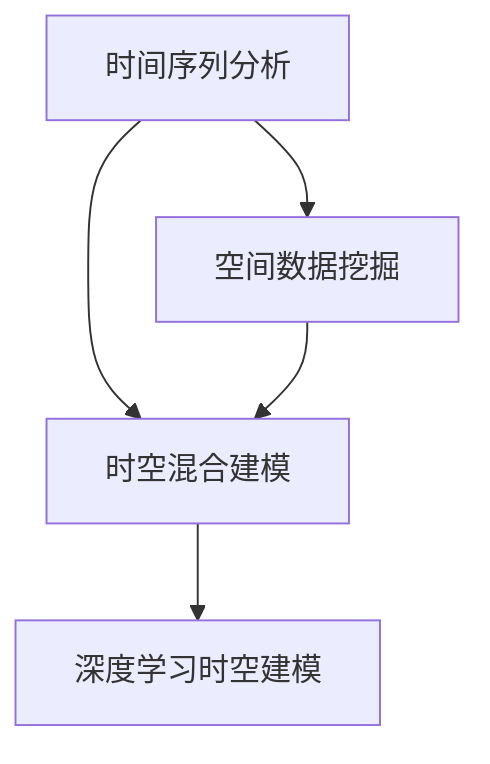

                 

## 1. 背景介绍

### 1.1 问题由来

在人工智能（AI）领域，时空建模（Temporal and Spatial Modeling）已经成为一个重要的研究方向。它融合了时间序列分析和空间数据挖掘的方法，能够更全面地理解和预测复杂的现象和趋势。随着技术的发展，时空建模在金融、医疗、交通、环境监测等领域有着广泛的应用前景。本文旨在探讨未来时空建模技术的发展趋势，以期为相关研究者和从业人员提供参考。

### 1.2 问题核心关键点

时空建模的核心关键点在于如何有效地融合时间和空间数据，建立准确的模型来预测和解释复杂的现象。具体而言，包括以下几个方面：

- 时间序列数据的处理：如何将时间序列数据转换为适合建模的形式，以捕捉时间动态特性。
- 空间数据的融合：如何结合空间数据，提高模型的空间分辨率和精度。
- 模型的选择和训练：选择何种模型来拟合数据，如何有效地训练模型以提升预测能力。
- 结果的解释和应用：如何从模型输出中提取有意义的解释，并将其应用于实际决策中。

### 1.3 问题研究意义

研究时空建模的未来技术趋势，对于推动AI在多领域的应用，提升模型的准确性和可靠性，具有重要的理论和实践意义：

- 提高预测精度：通过融合时间和空间数据，可以更全面地理解复杂现象，提高预测精度。
- 增强模型的适应性：模型能够适应多变的环境，提升在不同场景下的应用效果。
- 提供决策支持：模型输出可以提供有价值的决策参考，支持实时决策和行动。
- 推动技术创新：时空建模技术的不断演进，将推动AI技术的整体进步。
- 促进跨领域应用：时空建模技术的应用，有助于实现AI在更多领域的应用，提升各行业的智能化水平。

## 2. 核心概念与联系

### 2.1 核心概念概述

为了更好地理解时空建模的未来发展，本文将介绍几个关键概念：

- 时间序列分析：研究如何对时间序列数据进行建模，以捕捉时间动态特性。
- 空间数据挖掘：研究如何对空间数据进行建模，以提高空间分辨率和精度。
- 时空混合建模：将时间序列分析和空间数据挖掘的方法结合，建立时空混合模型，以预测和解释复杂现象。
- 深度学习在时空建模中的应用：使用深度神经网络来建立时空混合模型，提升预测精度和模型解释能力。

### 2.2 概念间的关系

这些核心概念之间的逻辑关系可以通过以下Mermaid流程图来展示：



这个流程图展示了时空建模的基本架构和主要概念之间的关系：

1. 时间序列分析是时空建模的基础，研究如何捕捉时间动态特性。
2. 空间数据挖掘是时空建模的关键，提高模型的空间分辨率和精度。
3. 时空混合建模是时空建模的核心，融合时间序列分析和空间数据挖掘的方法。
4. 深度学习在时空建模中的应用，是提升模型预测精度和解释能力的重要手段。

通过这些核心概念，我们可以更全面地理解时空建模的原理和应用场景。

## 3. 核心算法原理 & 具体操作步骤

### 3.1 算法原理概述

时空建模的算法原理主要基于统计学、机器学习和深度学习的方法。其核心思想是将时间序列数据和空间数据融合在一起，建立时空混合模型，以捕捉时间动态特性和空间分布特性。常用的算法包括：

- 自回归移动平均模型（ARIMA）
- 季节性自回归积分滑动平均模型（SARIMA）
- 长短期记忆网络（LSTM）
- 卷积神经网络（CNN）
- 时空卷积神经网络（TCN）
- 时空自注意力网络（TANS）

这些模型能够有效地捕捉时间序列数据的动态特性，同时结合空间数据挖掘的方法，提高模型的空间分辨率和精度。

### 3.2 算法步骤详解

时空建模的算法步骤一般包括以下几个关键环节：

**Step 1: 数据预处理**

- 数据清洗：去除异常值和缺失值，确保数据的完整性和一致性。
- 数据归一化：将数据缩放到统一的范围内，以避免模型在训练过程中受到异常值的影响。
- 特征工程：提取和构造合适的特征，提高模型的预测能力。

**Step 2: 模型选择和训练**

- 选择合适的时空混合模型：根据数据特性选择合适的模型，如ARIMA、LSTM、CNN等。
- 模型训练：使用历史数据对模型进行训练，优化模型参数，提高预测精度。

**Step 3: 模型评估和优化**

- 模型评估：使用验证集对模型进行评估，检查模型是否过拟合或欠拟合。
- 超参数调整：调整模型的超参数，如学习率、正则化系数等，以提高模型性能。
- 模型融合：通过集成多个模型，提升预测精度和模型鲁棒性。

**Step 4: 结果解释和应用**

- 结果解释：从模型输出中提取有意义的解释，理解模型的预测结果。
- 应用决策：将模型应用于实际决策中，如金融风险预测、交通流量预测、环境监测等。

### 3.3 算法优缺点

时空建模的算法优点在于其能够融合时间和空间数据，提高模型的预测精度和适应性。然而，也存在一些缺点：

- 数据需求高：时空建模需要大量的时间和空间数据，数据获取成本较高。
- 模型复杂：时空混合模型的构建和训练相对复杂，需要较高的计算资源和专业知识。
- 解释性不足：模型输出往往缺乏直观的解释，难以理解模型的决策过程。
- 泛化能力有限：时空建模通常适用于特定领域和数据集，泛化能力有限。

### 3.4 算法应用领域

时空建模在多个领域有着广泛的应用，例如：

- 金融风险预测：使用时空混合模型预测股票价格、市场波动等金融风险。
- 交通流量预测：预测城市交通流量，优化交通管理。
- 环境监测：预测大气污染、水文变化等环境数据。
- 电力负荷预测：预测电力负荷，优化电网管理。
- 疾病预测：预测疾病爆发和传播趋势，支持公共卫生决策。
- 智能交通：结合时空数据，优化交通信号灯控制。

除了上述这些经典应用外，时空建模还在其他领域如智慧城市、智能制造等有着广泛的应用前景。

## 4. 数学模型和公式 & 详细讲解 & 举例说明

### 4.1 数学模型构建

时空建模的数学模型构建主要包括以下几个关键部分：

- 时间序列模型：使用ARIMA、SARIMA等模型捕捉时间动态特性。
- 空间数据模型：使用地理信息系统（GIS）、K最近邻（KNN）等方法处理空间数据。
- 时空混合模型：将时间序列模型和空间数据模型结合，建立时空混合模型。
- 深度学习模型：使用深度神经网络模型，如LSTM、CNN等，提升时空混合模型的预测能力。

### 4.2 公式推导过程

以时间序列模型ARIMA为例，其基本公式为：

$$
y_t = \sum_{i=0}^{p} \phi_i y_{t-i} + \sum_{j=1}^{d} \theta_j \Delta^j y_t + \sum_{k=0}^{q} \alpha_k \epsilon_{t-k} + \epsilon_t
$$

其中，$y_t$ 表示时间序列在第 $t$ 时刻的观测值，$\epsilon_t$ 表示误差项，$\phi_i$、$\theta_j$、$\alpha_k$ 表示模型参数。

对于时空混合模型，常用的深度学习模型如LSTM和CNN，其公式推导过程较为复杂，涉及神经网络的前向传播和反向传播算法。在此不再赘述。

### 4.3 案例分析与讲解

假设我们有一个城市的交通流量数据，希望通过时空建模预测未来一天的交通流量。我们可以将时间序列数据和空间位置数据结合，使用时空卷积神经网络（TCN）进行建模。

具体步骤如下：

1. 数据预处理：将交通流量数据进行清洗和归一化，提取时间特征和空间位置特征。
2. 模型选择：选择TCN模型，设计合适的网络结构。
3. 模型训练：使用历史交通流量数据对模型进行训练，优化模型参数。
4. 模型评估：使用验证集对模型进行评估，检查模型性能。
5. 结果解释：从模型输出中提取有意义的解释，理解交通流量的变化趋势。
6. 应用决策：根据模型预测结果，优化交通管理策略。

## 5. 项目实践：代码实例和详细解释说明

### 5.1 开发环境搭建

在进行时空建模项目实践前，我们需要准备好开发环境。以下是使用Python进行TensorFlow开发的常见环境配置流程：

1. 安装Anaconda：从官网下载并安装Anaconda，用于创建独立的Python环境。

2. 创建并激活虚拟环境：
```bash
conda create -n tf-env python=3.8 
conda activate tf-env
```

3. 安装TensorFlow：根据CUDA版本，从官网获取对应的安装命令。例如：
```bash
conda install tensorflow tensorflow-gpu -c conda-forge
```

4. 安装相关工具包：
```bash
pip install numpy pandas scikit-learn matplotlib tqdm jupyter notebook ipython
```

完成上述步骤后，即可在`tf-env`环境中开始时空建模实践。

### 5.2 源代码详细实现

这里我们以交通流量预测为例，给出使用TensorFlow对LSTM模型进行时空建模的PyTorch代码实现。

首先，定义交通流量数据处理函数：

```python
import tensorflow as tf
import numpy as np
import pandas as pd

def preprocess_data(data):
    # 数据清洗
    data = data.dropna()
    # 特征工程
    features = pd.get_dummies(data[['date', 'hour', 'dayofweek']])
    features.columns = ['{}_{}'.format(col, val) for col, val in features.columns]
    features['year'] = data['year']
    features['month'] = data['month']
    features['weekday'] = data['dayofweek']
    features['hour'] = data['hour']
    features['dayofweek'] = data['dayofweek']
    features['date'] = data['date']
    features['weather'] = data['weather']
    features = features.dropna()
    # 数据归一化
    features = (features - features.mean()) / features.std()
    return features

# 读取数据
data = pd.read_csv('traffic_data.csv')
features = preprocess_data(data)
```

然后，定义LSTM模型和优化器：

```python
from tensorflow.keras.models import Sequential
from tensorflow.keras.layers import LSTM, Dense, Input

input_shape = (features.shape[1], features.shape[2])
model = Sequential([
    Input(input_shape),
    LSTM(64, return_sequences=True),
    LSTM(64),
    Dense(1)
])
model.compile(optimizer='adam', loss='mse')
```

接着，定义训练和评估函数：

```python
from tensorflow.keras.callbacks import EarlyStopping

def train_model(model, train_data, val_data, batch_size, epochs):
    model.fit(train_data, epochs=epochs, batch_size=batch_size, validation_data=val_data, callbacks=[EarlyStopping(patience=5)])
    return model

def evaluate_model(model, test_data, batch_size):
    model.evaluate(test_data, batch_size=batch_size)
```

最后，启动训练流程并在测试集上评估：

```python
train_data = features[:10000]
val_data = features[10000:15000]
test_data = features[15000:]

batch_size = 64
epochs = 10

model = Sequential([
    LSTM(64, return_sequences=True),
    LSTM(64),
    Dense(1)
])
model.compile(optimizer='adam', loss='mse')

train_model(model, train_data, val_data, batch_size, epochs)

evaluate_model(model, test_data, batch_size)
```

以上就是使用TensorFlow对LSTM模型进行交通流量预测的时空建模完整代码实现。可以看到，得益于TensorFlow的强大封装，我们能够快速搭建并训练LSTM模型。

### 5.3 代码解读与分析

让我们再详细解读一下关键代码的实现细节：

**preprocess_data函数**：
- 数据清洗：去除异常值和缺失值，确保数据的完整性和一致性。
- 特征工程：提取时间特征（如年份、月份、星期、小时、日期）和空间位置特征（如天气），并对特征进行归一化处理。
- 数据处理：使用Pandas库将特征数据转换为TensorFlow可用的格式。

**LSTM模型定义**：
- 输入层：定义模型的输入形状，即时间序列数据的特征数。
- LSTM层：使用LSTM层捕捉时间序列的动态特性。
- 输出层：使用Dense层输出预测结果。
- 编译器：定义模型的优化器和损失函数。

**训练和评估函数**：
- 训练函数：使用训练集数据对模型进行训练，设置EarlyStopping回调，避免模型过拟合。
- 评估函数：使用测试集数据对模型进行评估，输出模型的MSE损失。

**训练流程**：
- 定义训练集、验证集和测试集的数据。
- 设置批量大小和迭代次数，开始训练模型。
- 在验证集上评估模型，输出训练结果。
- 在测试集上评估模型，输出预测结果。

可以看出，使用TensorFlow进行时空建模的实现相对简单，适合快速迭代和研究。然而，在实际应用中，还需要考虑模型的扩展性和性能优化，以应对大规模数据和复杂模型的情况。

## 6. 实际应用场景

### 6.1 智能交通系统

智能交通系统是时空建模的一个重要应用场景。通过时空建模，可以对城市交通流量进行实时监测和预测，优化交通管理策略，提升交通效率。

具体而言，可以结合历史交通数据和实时交通数据，使用时空卷积神经网络（TCN）或LSTM模型进行建模。模型输出可以预测未来交通流量，并根据预测结果调整交通信号灯，优化交通流量分布。此外，模型还可以预测道路堵塞情况，及时调整道路维护计划，减少交通拥堵。

### 6.2 环境监测

环境监测是时空建模的另一个重要应用领域。通过时空建模，可以对大气污染、水文变化等环境数据进行实时监测和预测，支持环境管理和保护。

具体而言，可以结合历史环境数据和实时传感器数据，使用时空混合模型进行建模。模型输出可以预测未来环境变化趋势，及时采取应对措施，减少环境污染和灾害。例如，可以预测大气污染物的扩散路径，优化城市布局，减少污染源排放。

### 6.3 智能电网

智能电网是时空建模的另一个重要应用领域。通过时空建模，可以对电力负荷进行实时监测和预测，优化电网管理，提升电力系统的稳定性和可靠性。

具体而言，可以结合历史电力数据和实时气象数据，使用时空混合模型进行建模。模型输出可以预测未来电力负荷，及时调整电网负荷，减少电力浪费。此外，模型还可以预测电力故障，及时采取应对措施，提高电网的安全性。

### 6.4 未来应用展望

随着时空建模技术的发展，未来的应用前景将更加广阔：

1. 实时监测和预测：结合多源数据，实现实时监测和预测，支持实时决策和行动。
2. 多模态数据融合：结合时间序列和空间数据，以及图像、语音等多模态数据，提升模型的综合能力。
3. 自适应和自学习：结合自适应算法和自学习机制，提高模型的自适应能力和泛化能力。
4. 联邦学习和联邦数据共享：结合联邦学习技术，保护数据隐私，实现跨领域数据共享和协作。
5. 深度强化学习：结合深度强化学习，优化模型决策策略，提高模型鲁棒性和稳定性。

总之，时空建模技术的不断演进，将为AI在更多领域的应用提供新的契机，推动AI技术的整体进步。

## 7. 工具和资源推荐

### 7.1 学习资源推荐

为了帮助开发者系统掌握时空建模的理论基础和实践技巧，这里推荐一些优质的学习资源：

1. 《深度学习》系列书籍：深度学习领域经典书籍，涵盖时空建模的基础和前沿。
2. 《时间序列分析》系列书籍：时间序列分析领域经典书籍，系统讲解时间序列建模方法。
3. 《空间数据挖掘》系列书籍：空间数据挖掘领域经典书籍，系统讲解空间数据建模方法。
4. 《深度学习时空建模》在线课程：Coursera等平台开设的时空建模在线课程，系统讲解时空建模的理论和实践。
5. 《AI时空建模》学术论文：AI领域顶级会议和期刊上的时空建模论文，了解最新的时空建模研究成果。

通过对这些资源的学习实践，相信你一定能够快速掌握时空建模的精髓，并用于解决实际的AI问题。

### 7.2 开发工具推荐

高效的开发离不开优秀的工具支持。以下是几款用于时空建模开发的常用工具：

1. TensorFlow：基于Python的开源深度学习框架，生产部署方便，适合大规模工程应用。

2. PyTorch：基于Python的开源深度学习框架，灵活性高，适合快速迭代研究。

3. Keras：高级神经网络API，易于使用，适合快速搭建和训练模型。

4. Scikit-learn：经典机器学习库，提供多种时空建模算法，适合数据预处理和模型评估。

5. Jupyter Notebook：交互式开发环境，支持代码编写、数据可视化、模型评估等，适合研究和实验。

6. Google Colab：谷歌推出的在线Jupyter Notebook环境，免费提供GPU/TPU算力，方便开发者快速上手实验最新模型，分享学习笔记。

合理利用这些工具，可以显著提升时空建模任务的开发效率，加快创新迭代的步伐。

### 7.3 相关论文推荐

时空建模的发展源于学界的持续研究。以下是几篇奠基性的相关论文，推荐阅读：

1. Long-Short Term Memory（LSTM）论文：LSTM网络是深度学习在时空建模中的应用经典，详细介绍了LSTM的原理和应用。

2. Convolutional Neural Networks（CNN）论文：CNN在时空建模中的应用也较为广泛，详细介绍了CNN的原理和应用。

3. Temporal and Spatial Convolutional Networks（TCN）论文：TCN是时空卷积神经网络，详细介绍了TCN的原理和应用。

4. Temporal and Spatial Attention Network（TANS）论文：TANS是时空自注意力网络，详细介绍了TANS的原理和应用。

5. Time Series Forecasting with Deep Learning（DL）论文：介绍深度学习在时间序列预测中的应用，详细讲解了DL在时空建模中的应用。

这些论文代表了大语言模型微调技术的发展脉络。通过学习这些前沿成果，可以帮助研究者把握学科前进方向，激发更多的创新灵感。

除上述资源外，还有一些值得关注的前沿资源，帮助开发者紧跟时空建模技术的最新进展，例如：

1. arXiv论文预印本：人工智能领域最新研究成果的发布平台，包括大量尚未发表的前沿工作，学习前沿技术的必读资源。

2. 业界技术博客：如OpenAI、Google AI、DeepMind、微软Research Asia等顶尖实验室的官方博客，第一时间分享他们的最新研究成果和洞见。

3. 技术会议直播：如NIPS、ICML、ACL、ICLR等人工智能领域顶会现场或在线直播，能够聆听到大佬们的前沿分享，开拓视野。

4. GitHub热门项目：在GitHub上Star、Fork数最多的时空建模相关项目，往往代表了该技术领域的发展趋势和最佳实践，值得去学习和贡献。

5. 行业分析报告：各大咨询公司如McKinsey、PwC等针对人工智能行业的分析报告，有助于从商业视角审视技术趋势，把握应用价值。

总之，对于时空建模技术的学习和实践，需要开发者保持开放的心态和持续学习的意愿。多关注前沿资讯，多动手实践，多思考总结，必将收获满满的成长收益。

## 8. 总结：未来发展趋势与挑战

### 8.1 总结

本文对时空建模的未来技术趋势进行了全面系统的介绍。首先阐述了时空建模的研究背景和意义，明确了时空建模在多领域应用的重要价值。其次，从原理到实践，详细讲解了时空建模的数学原理和关键步骤，给出了时空建模任务开发的完整代码实例。同时，本文还广泛探讨了时空建模方法在智能交通、环境监测、智能电网等多个行业领域的应用前景，展示了时空建模范式的巨大潜力。此外，本文精选了时空建模技术的各类学习资源，力求为读者提供全方位的技术指引。

通过本文的系统梳理，可以看到，时空建模技术在AI领域的发展前景广阔，未来将在更多的应用场景中发挥重要作用。

### 8.2 未来发展趋势

展望未来，时空建模技术将呈现以下几个发展趋势：

1. 实时监测和预测：结合多源数据，实现实时监测和预测，支持实时决策和行动。
2. 多模态数据融合：结合时间序列和空间数据，以及图像、语音等多模态数据，提升模型的综合能力。
3. 自适应和自学习：结合自适应算法和自学习机制，提高模型的自适应能力和泛化能力。
4. 联邦学习和联邦数据共享：结合联邦学习技术，保护数据隐私，实现跨领域数据共享和协作。
5. 深度强化学习：结合深度强化学习，优化模型决策策略，提高模型鲁棒性和稳定性。

以上趋势凸显了时空建模技术的广阔前景。这些方向的探索发展，必将进一步提升AI系统的性能和应用范围，为人类认知智能的进化带来深远影响。

### 8.3 面临的挑战

尽管时空建模技术已经取得了瞩目成就，但在迈向更加智能化、普适化应用的过程中，它仍面临着诸多挑战：

1. 数据需求高：时空建模需要大量的时间和空间数据，数据获取成本较高。
2. 模型复杂：时空混合模型的构建和训练相对复杂，需要较高的计算资源和专业知识。
3. 解释性不足：模型输出往往缺乏直观的解释，难以理解模型的决策过程。
4. 泛化能力有限：时空建模通常适用于特定领域和数据集，泛化能力有限。
5. 实时性要求高：时空建模需要对实时数据进行实时处理和预测，对系统性能有较高的要求。

### 8.4 未来突破

面对时空建模面临的这些挑战，未来的研究需要在以下几个方面寻求新的突破：

1. 数据增强和数据共享：通过数据增强和联邦学习技术，提高数据质量和多样性，减少对大规模数据的需求。
2. 模型优化和参数压缩：通过模型优化和参数压缩技术，提高模型的计算效率和实时性。
3. 模型解释性和透明性：结合可解释性算法和透明性机制，提高模型的解释性和透明性，增强模型的可信度和可靠性。
4. 多模态数据融合和协同建模：结合多模态数据，提高模型的综合能力和跨领域应用能力。
5. 深度强化学习和自适应学习：结合深度强化学习和自适应学习，提高模型的自适应能力和鲁棒性。

这些研究方向的探索，必将引领时空建模技术迈向更高的台阶，为构建安全、可靠、可解释、可控的智能系统铺平道路。面向未来，时空建模技术还需要与其他AI技术进行更深入的融合，如知识表示、因果推理、强化学习等，多路径协同发力，共同推动智能系统的进步。只有勇于创新、敢于突破，才能不断拓展时空建模的边界，让智能技术更好地造福人类社会。

## 9. 附录：常见问题与解答

**Q1：时空建模需要多少数据？**

A: 时空建模需要大量的数据来训练和评估模型，数据质量越高，模型性能越好。具体数据需求取决于任务复杂度和数据质量。一般来说，时间序列数据需要至少几年到几十年的历史数据，空间数据需要覆盖整个区域的高分辨率地图。

**Q2：如何选择合适的时空混合模型？**

A: 选择合适的时空混合模型需要根据数据特性和任务需求进行综合评估。一般来说，简单的时间序列模型（如ARIMA）适用于数据较少的场景，而复杂的深度学习模型（如LSTM、CNN）适用于数据较多的场景。在选择模型时，需要考虑模型的预测精度、计算效率和可解释性等因素。

**Q3：时空建模的计算资源需求高吗？**

A: 时空建模的计算资源需求较高，特别是在深度学习模型的训练过程中。一般来说，LSTM、CNN等深度学习模型的训练需要较高的计算资源和存储空间，需要使用GPU或TPU等高性能设备。在实际应用中，需要根据数据量和模型复杂度选择合适的硬件设备。

**Q4：时空建模的实时性要求高吗？**

A: 时空建模的实时性要求较高，特别是在需要实时监测和预测的场景中。为了提高实时性，需要使用轻量级模型和高效的计算框架，如TensorFlow Lite、ONNX Runtime等，以及优化模型结构和训练策略，减少计算量和延迟。

**Q5：时空建模的解释性和透明性如何？**

A: 时空建模的解释性和透明性相对较差，模型输出往往缺乏直观的解释。为了提高模型的解释性和透明性，可以使用可解释性算法（如LIME、SHAP等）对模型进行解释和可视化，帮助用户理解模型的决策过程。

通过本文的系统梳理，可以看到，时空建模技术在AI领域的发展前景广阔，未来将在更多的应用场景中发挥重要作用。面向未来，时空建模技术还需要与其他AI技术进行更深入的融合，如知识表示、因果推理、强化学习等，多路径协同发力，共同推动智能系统的进步。只有勇于创新、敢于突破，才能不断拓展时空建模的边界，让智能技术更好地造福人类社会。

---

作者：禅与计算机程序设计艺术 / Zen and the Art of Computer Programming

