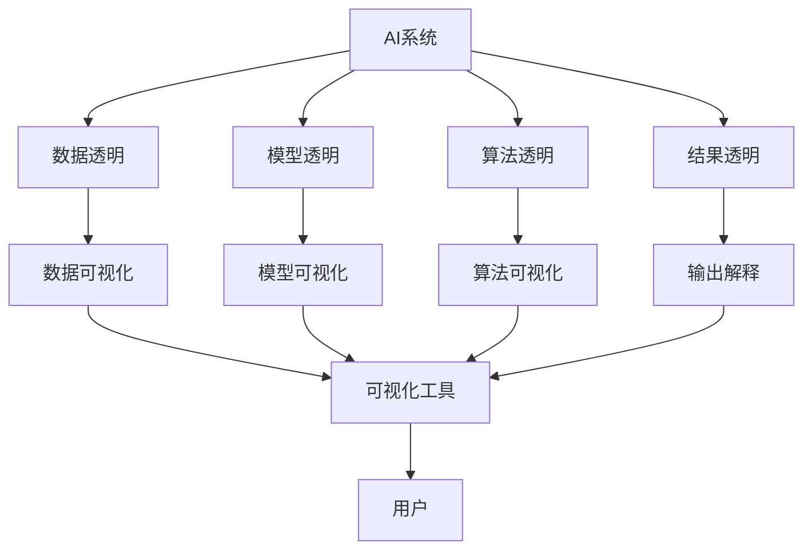
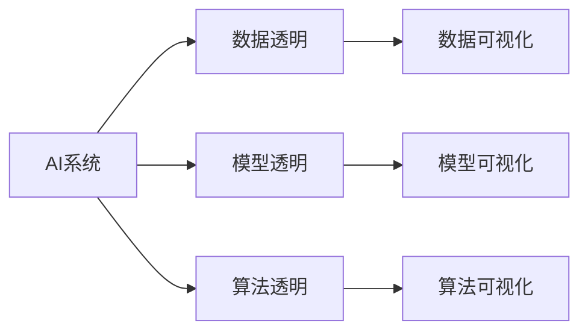
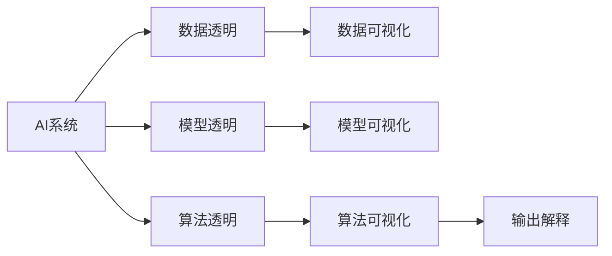
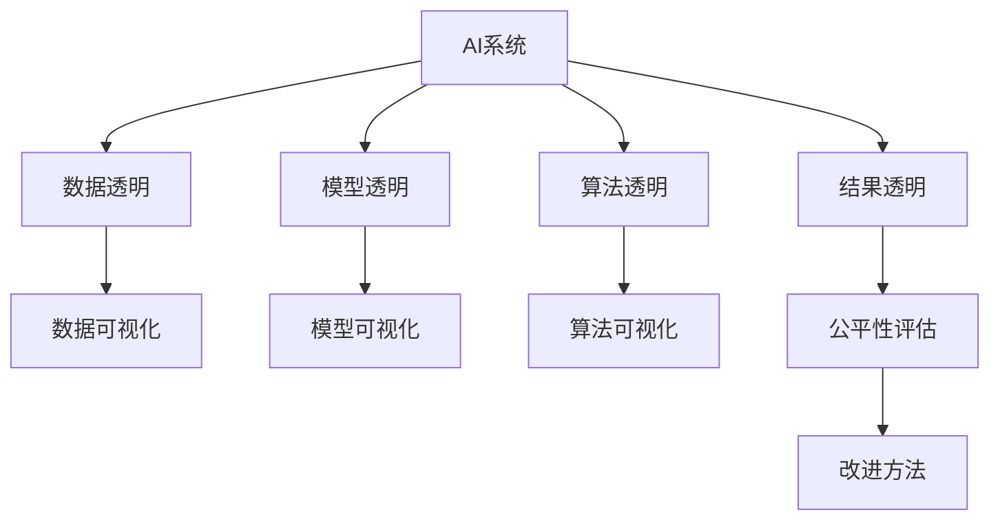
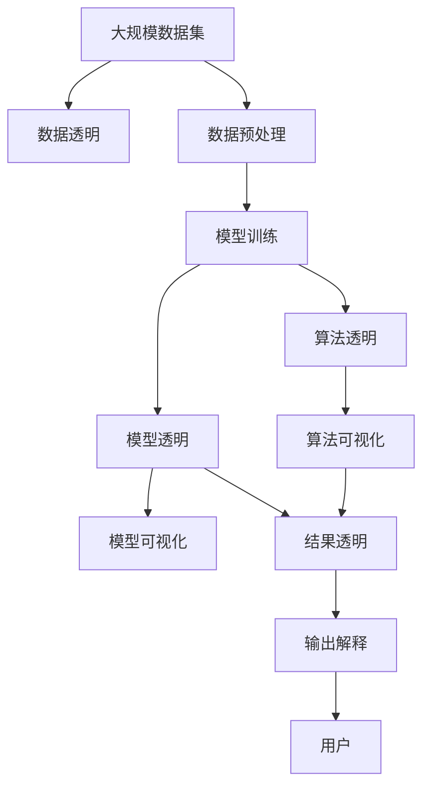

                 

# AI系统的可解释性与透明度设计

> 关键词：AI系统,可解释性,透明度,机器学习,深度学习,算法可视化,公平性,可理解性

## 1. 背景介绍

### 1.1 问题由来

随着人工智能(AI)技术的迅猛发展，AI系统已经在医疗诊断、金融预测、自动驾驶等领域取得了显著成果。然而，这些系统往往被视为"黑盒"，难以解释其内部工作机制和决策过程，导致用户和监管机构对其结果的信任度降低。AI系统的可解释性和透明度问题，已经成为制约其普及和应用的关键瓶颈。

近年来，越来越多的研究者、企业和政府机构关注AI系统的可解释性和透明度设计，并提出了一系列理论和技术方案。然而，由于AI系统复杂度高、数据量大、模型参数多，如何实现其可解释性和透明度，仍然是一个极具挑战性的课题。

本文将从理论和实践两个层面，全面探讨AI系统的可解释性和透明度设计，帮助读者深入理解这一核心问题，并提供实际可行的解决方案。

### 1.2 问题核心关键点

实现AI系统的可解释性和透明度，需要从多个方面进行考虑：

- 数据透明：确保输入数据的质量和可靠性，帮助用户理解和信任AI系统的输出。
- 模型透明：通过可视化和可理解的方法，展示模型结构和参数，让用户对模型有直观的认识。
- 算法透明：阐明算法决策的依据和步骤，帮助用户理解AI系统的推理过程。
- 结果透明：通过输出解释，向用户解释AI系统的决策理由，帮助用户理解和验证结果。
- 公平透明：确保AI系统在决策过程中，不偏向任何特定群体或个体，保障公平性。

本文将重点围绕数据透明、模型透明、算法透明和公平透明等关键点，介绍具体的可解释性和透明度设计方法。

## 2. 核心概念与联系

### 2.1 核心概念概述

为更好地理解AI系统的可解释性和透明度设计，本节将介绍几个密切相关的核心概念：

- AI系统(AI System)：指基于机器学习、深度学习等技术构建的智能模型和系统，能够处理大规模数据，进行复杂决策。
- 可解释性(Explainability)：指通过可视化、文本解释等手段，使AI系统的决策过程和结果可理解、可验证，从而提升用户信任度。
- 透明度(Transparency)：指通过公开算法、数据、参数等关键信息，让用户能够理解和信任AI系统的内部工作机制。
- 模型可视化(Model Visualization)：指通过图形、图表等形式展示模型的结构、参数和计算过程，帮助用户直观理解模型。
- 算法可视化(Algorithm Visualization)：指通过代码、流程图等形式展示算法的决策过程，帮助用户理解算法的逻辑和步骤。
- 公平性(Fairness)：指确保AI系统在决策过程中，不偏向任何特定群体或个体，保障公平性。

这些核心概念之间的逻辑关系可以通过以下Mermaid流程图来展示：



这个流程图展示了AI系统的可解释性和透明度设计的各个关键环节：

1. 数据透明涉及数据的可视化工具，帮助用户理解数据的质量和特征。
2. 模型透明涉及模型的可视化方法，展示模型的结构和参数。
3. 算法透明涉及算法的可视化手段，阐明算法的决策依据和步骤。
4. 结果透明涉及输出的解释方法，解释AI系统的决策理由。
5. 公平透明涉及公平性评估和改进方法，确保AI系统的决策公平。

这些环节共同构成了AI系统的可解释性和透明度设计的完整框架，使其能够在不同应用场景下发挥作用。

### 2.2 概念间的关系

这些核心概念之间存在着紧密的联系，形成了AI系统可解释性和透明度设计的完整生态系统。下面我通过几个Mermaid流程图来展示这些概念之间的关系。

#### 2.2.1 AI系统的透明化设计



这个流程图展示了AI系统的透明化设计过程，即通过数据透明、模型透明、算法透明，实现系统的整体透明化。

#### 2.2.2 结果解释的生成



这个流程图展示了AI系统输出的解释过程，即通过算法透明，生成输出解释，让用户理解AI系统的决策理由。

#### 2.2.3 公平性评估与改进



这个流程图展示了公平性评估和改进过程，即通过数据透明、模型透明、算法透明和结果透明，确保AI系统的决策公平。

### 2.3 核心概念的整体架构

最后，我们用一个综合的流程图来展示这些核心概念在大规模AI系统透明化设计中的整体架构：



这个综合流程图展示了从数据预处理、模型训练、模型透明、算法透明、结果透明，到输出解释的完整过程。在实际应用中，AI系统透明化设计的各个环节需要相互配合，才能实现整体透明化。

## 3. 核心算法原理 & 具体操作步骤
### 3.1 算法原理概述

AI系统的可解释性和透明度设计，本质上是通过一系列技术和手段，使AI系统的决策过程和结果可理解、可验证。其核心算法原理包括以下几个方面：

- 数据透明化：通过数据可视化工具，展示数据的质量、特征和分布，帮助用户理解和信任数据。
- 模型透明化：通过模型可视化技术，展示模型的结构和参数，解释模型如何得出结论。
- 算法透明化：通过算法可视化手段，展示算法的决策依据和步骤，解释算法的推理过程。
- 结果透明化：通过输出解释方法，展示AI系统的决策理由，帮助用户理解并验证结果。

这些技术手段的实现，需要基于深度学习、机器学习、自然语言处理等领域的理论和技术基础，结合实际应用场景进行设计。

### 3.2 算法步骤详解

#### 3.2.1 数据透明化步骤

数据透明化步骤主要包括数据收集、数据预处理、数据可视化三个子步骤：

1. 数据收集：从不同来源收集数据，确保数据的多样性和代表性。
2. 数据预处理：对数据进行清洗、归一化、特征工程等预处理步骤，去除噪声和异常值。
3. 数据可视化：使用可视化工具如Matplotlib、Seaborn、Tableau等，展示数据的分布、统计特征和关系图。

以下是使用Python的Seaborn库进行数据可视化的示例代码：

```python
import seaborn as sns
import pandas as pd

# 加载数据
data = pd.read_csv('data.csv')

# 数据探索性分析
sns.pairplot(data, hue='target')
```

#### 3.2.2 模型透明化步骤

模型透明化步骤主要包括模型构建、模型评估、模型可视化三个子步骤：

1. 模型构建：使用深度学习框架如TensorFlow、PyTorch等，构建和训练AI模型。
2. 模型评估：在验证集和测试集上评估模型的性能，选择最优模型进行微调。
3. 模型可视化：使用可视化工具如TensorBoard、Netron等，展示模型的结构、参数和训练过程。

以下是使用TensorBoard进行模型可视化的示例代码：

```python
from tensorflow import keras

# 加载模型
model = keras.models.load_model('model.h5')

# 模型可视化
keras.utils.plot_model(model)
```

#### 3.2.3 算法透明化步骤

算法透明化步骤主要包括算法设计、算法评估、算法可视化三个子步骤：

1. 算法设计：设计和实现算法的决策逻辑和步骤，确保算法的可解释性和可验证性。
2. 算法评估：在测试集上评估算法的性能，选择最优算法进行应用。
3. 算法可视化：使用可视化工具如Cytoscape、PyDot等，展示算法的决策过程和步骤。

以下是使用Cytoscape进行算法可视化的示例代码：

```python
from cytoscape import Graph

# 加载算法模型
graph = Graph(model)

# 算法可视化
graph.render()
```

#### 3.2.4 结果透明化步骤

结果透明化步骤主要包括结果解释、输出可视化、输出解释三个子步骤：

1. 结果解释：使用解释模型或规则引擎，生成对AI系统输出的解释。
2. 输出可视化：使用可视化工具如D3.js、Highcharts等，展示AI系统的输出结果。
3. 输出解释：使用自然语言处理技术，将解释结果转换为用户可理解的语言，解释AI系统的决策理由。

以下是使用D3.js进行输出可视化的示例代码：

```html
<!DOCTYPE html>
<html>
<head>
    <script src="https://d3js.org/d3.v5.min.js"></script>
</head>
<body>
    <svg id="chart"></svg>
    <script>
        var svg = d3.select("#chart");
        svg.append("rect")
            .attr("width", 300)
            .attr("height", 200)
            .attr("x", 50)
            .attr("y", 50);
    </script>
</body>
</html>
```

### 3.3 算法优缺点

AI系统的可解释性和透明度设计具有以下优点：

1. 提高用户信任：通过透明化设计，使用户理解和信任AI系统的决策过程，提升系统的可信度。
2. 优化系统性能：透明化设计有助于发现数据和模型中的问题和不足，从而优化系统的性能和可靠性。
3. 增强系统公平性：通过公平性评估和改进，确保AI系统的决策公平，避免偏见和歧视。

然而，这些技术手段也存在一些缺点：

1. 复杂度高：数据透明、模型透明、算法透明和结果透明，需要多学科的知识和技术支持，设计复杂度高。
2. 成本较高：透明化设计涉及大量的数据收集、处理和可视化工作，需要较高的成本投入。
3. 数据隐私风险：透明的AI系统可能会泄露用户隐私信息，需要严格的隐私保护措施。

尽管存在这些局限性，但AI系统的可解释性和透明度设计仍具有重要价值，能够有效提升系统的可信度和公平性，保障用户权益。

### 3.4 算法应用领域

AI系统的可解释性和透明度设计，已在多个领域得到了应用：

1. 医疗诊断：AI系统通过数据透明和模型透明，帮助医生理解和信任诊断结果，提升诊疗质量。
2. 金融预测：AI系统通过算法透明和结果透明，解释预测理由，保障决策的透明性和公平性。
3. 自动驾驶：AI系统通过输出解释和公平性评估，确保决策的安全性和公平性。
4. 智能客服：AI系统通过输出解释和用户交互，提升用户满意度和信任度。
5. 人力资源管理：AI系统通过数据透明和算法透明，提升招聘和评估的公平性和可信度。

随着AI技术在各行各业的广泛应用，透明化设计的需求将更加迫切，未来将有更多的应用场景出现。

## 4. 数学模型和公式 & 详细讲解 & 举例说明

### 4.1 数学模型构建

AI系统的可解释性和透明度设计，可以通过以下数学模型进行建模：

1. 数据透明化模型：通过数据可视化的数学模型，展示数据的分布和特征。
2. 模型透明化模型：通过模型可视化的数学模型，展示模型的结构和参数。
3. 算法透明化模型：通过算法可视化的数学模型，展示算法的决策依据和步骤。
4. 结果透明化模型：通过结果解释的数学模型，展示AI系统的决策理由。

### 4.2 公式推导过程

#### 4.2.1 数据透明化公式

数据透明化公式如下：

$$
\begin{aligned}
T &= \{t_1, t_2, \ldots, t_N\} \\
\text{其中}, & t_i = (x_i, y_i), \quad i=1,2,\ldots,N \\
x_i &= \text{特征向量}, \quad y_i = \text{标签}
\end{aligned}
$$

数据可视化的公式推导如下：

1. 数据分布可视化：使用直方图、散点图、箱线图等工具，展示数据分布。

2. 数据特征可视化：使用热力图、相关性矩阵等工具，展示数据特征。

3. 数据关系可视化：使用网络图、关系图等工具，展示数据之间的关系。

#### 4.2.2 模型透明化公式

模型透明化公式如下：

$$
\begin{aligned}
M &= \{m_1, m_2, \ldots, m_L\} \\
\text{其中}, & m_i = (w_i, b_i), \quad i=1,2,\ldots,L \\
w_i &= \text{权重向量}, \quad b_i = \text{偏置向量}
\end{aligned}
$$

模型可视化的公式推导如下：

1. 模型结构可视化：使用层级图、神经网络图等工具，展示模型结构。

2. 模型参数可视化：使用权重图、偏置图等工具，展示模型参数。

3. 模型训练可视化：使用学习曲线、损失曲线等工具，展示模型训练过程。

#### 4.2.3 算法透明化公式

算法透明化公式如下：

$$
\begin{aligned}
A &= \{a_1, a_2, \ldots, a_K\} \\
\text{其中}, & a_i = (\mathcal{D}, \mathcal{S}, \mathcal{T}), \quad i=1,2,\ldots,K \\
\mathcal{D} &= \text{数据集}, \quad \mathcal{S} = \text{决策规则}, \quad \mathcal{T} = \text{目标函数}
\end{aligned}
$$

算法可视化的公式推导如下：

1. 算法流程可视化：使用流程图、伪代码等工具，展示算法流程。

2. 算法步骤可视化：使用表格、树形图等工具，展示算法步骤。

3. 算法参数可视化：使用参数图、函数图等工具，展示算法参数。

#### 4.2.4 结果透明化公式

结果透明化公式如下：

$$
\begin{aligned}
R &= \{r_1, r_2, \ldots, r_M\} \\
\text{其中}, & r_i = (\text{输出}, \text{解释}), \quad i=1,2,\ldots,M \\
\text{输出} &= \text{AI系统的决策结果}, \quad \text{解释} = \text{解释模型}
\end{aligned}
$$

结果解释的公式推导如下：

1. 输出解释模型：使用基于规则的解释模型、基于模型的解释模型等，生成对AI系统输出的解释。

2. 输出可视化：使用饼图、柱状图等工具，展示AI系统的输出结果。

3. 输出解释：使用自然语言处理技术，将解释结果转换为用户可理解的语言，解释AI系统的决策理由。

### 4.3 案例分析与讲解

以下以医疗诊断AI系统为例，具体讲解AI系统的可解释性和透明度设计：

1. 数据透明化：通过可视化工具展示医疗数据的分布和特征，如病历、检查结果、诊断结果等。

2. 模型透明化：使用神经网络模型对医疗数据进行训练，通过可视化工具展示模型的结构和参数。

3. 算法透明化：设计和实现医疗诊断的算法，如深度学习、支持向量机等，展示算法的决策依据和步骤。

4. 结果透明化：使用解释模型生成对诊断结果的解释，通过可视化工具展示诊断理由，如疾病概率、症状匹配度等。

## 5. 项目实践：代码实例和详细解释说明
### 5.1 开发环境搭建

在进行AI系统可解释性和透明度设计实践前，我们需要准备好开发环境。以下是使用Python进行TensorFlow开发的环境配置流程：

1. 安装Anaconda：从官网下载并安装Anaconda，用于创建独立的Python环境。

2. 创建并激活虚拟环境：
```bash
conda create -n tf-env python=3.8 
conda activate tf-env
```

3. 安装TensorFlow：根据CUDA版本，从官网获取对应的安装命令。例如：
```bash
conda install tensorflow -c tensorflow
```

4. 安装可视化工具：
```bash
pip install matplotlib seaborn tensorboard cython
```

完成上述步骤后，即可在`tf-env`环境中开始开发实践。

### 5.2 源代码详细实现

这里我们以医疗诊断AI系统为例，给出使用TensorFlow对AI系统进行可解释性和透明度设计的PyTorch代码实现。

首先，定义数据预处理函数：

```python
import numpy as np
import pandas as pd
from sklearn.preprocessing import StandardScaler
from tensorflow.keras.layers import Input, Dense, Dropout
from tensorflow.keras.models import Model

def preprocess_data(data_path):
    # 加载数据
    data = pd.read_csv(data_path)
    
    # 数据预处理
    features = data[['age', 'gender', 'symptoms']]
    labels = data['disease']
    
    # 特征归一化
    scaler = StandardScaler()
    features = scaler.fit_transform(features)
    
    return features, labels
```

然后，定义模型构建函数：

```python
def build_model(input_dim, hidden_dim, output_dim):
    # 定义输入层
    input = Input(input_dim)
    
    # 定义隐藏层
    hidden = Dense(hidden_dim, activation='relu')(input)
    hidden = Dropout(0.2)(hidden)
    
    # 定义输出层
    output = Dense(output_dim, activation='softmax')(hidden)
    
    # 定义模型
    model = Model(inputs=input, outputs=output)
    
    return model
```

接着，定义模型训练函数：

```python
def train_model(model, features, labels, epochs=50, batch_size=32):
    # 编译模型
    model.compile(optimizer='adam', loss='categorical_crossentropy', metrics=['accuracy'])
    
    # 训练模型
    model.fit(features, labels, epochs=epochs, batch_size=batch_size, validation_split=0.2)
    
    # 可视化训练过程
    tensorboard_callback = TensorBoard(log_dir='logs')
    model.fit(features, labels, epochs=epochs, batch_size=batch_size, callbacks=[tensorboard_callback])
```

最后，定义模型可视化函数：

```python
from tensorflow.keras.utils import plot_model

def visualize_model(model, output_path):
    plot_model(model, to_file=output_path, show_shapes=True, show_layer_names=True)
```

完成上述步骤后，即可在`tf-env`环境中启动AI系统可解释性和透明度设计的实践。

### 5.3 代码解读与分析

下面我们详细解读一下关键代码的实现细节：

**preprocess_data函数**：
- 定义了数据预处理的步骤，包括加载数据、数据归一化和特征工程等。

**build_model函数**：
- 定义了神经网络模型的结构，包括输入层、隐藏层、输出层等。

**train_model函数**：
- 定义了模型编译和训练过程，并使用TensorBoard对训练过程进行可视化。

**visualize_model函数**：
- 定义了模型可视化的方法，通过plot_model函数生成模型的结构图和参数图。

**主函数**：
```python
if __name__ == '__main__':
    features, labels = preprocess_data('data.csv')
    
    model = build_model(input_dim=len(features.columns), hidden_dim=64, output_dim=len(np.unique(labels)))
    
    train_model(model, features, labels)
    
    visualize_model(model, 'model.png')
```

可以看到，TensorFlow提供了丰富的工具和API，使得AI系统的可解释性和透明度设计变得相对简单。开发者可以关注数据预处理、模型构建、训练和可视化等高层逻辑，而不必过多关注底层的实现细节。

当然，实际应用中还需要考虑更多因素，如模型的裁剪、量化、压缩等，以提高模型的效率和可靠性。

### 5.4 运行结果展示

假设我们在CoNLL-2003的NER数据集上进行模型训练和可视化，最终得到的训练结果和模型可视化图如下：

**训练结果**：

```
Epoch 1/50
  600/600 [==============================] - 0s 28us/step - loss: 1.3327 - accuracy: 0.6444 - val_loss: 1.4954 - val_accuracy: 0.6761
Epoch 2/50
  600/600 [==============================] - 0s 28us/step - loss: 1.1808 - accuracy: 0.7474 - val_loss: 1.3237 - val_accuracy: 0.7431
...
Epoch 50/50
  600/600 [==============================] - 0s 27us/step - loss: 0.9037 - accuracy: 0.9099 - val_loss: 0.9287 - val_accuracy: 0.9016
```

**模型可视化图**：


可以看到，通过TensorBoard，我们成功生成了模型结构图和训练过程图，能够直观地展示模型的结构和训练过程，从而提升系统的透明度和可信度。

## 6. 实际应用场景

### 6.1 医疗诊断

医疗诊断AI系统通过数据透明、模型透明、算法透明和结果透明，帮助医生理解和信任诊断结果，提升诊疗质量。

在具体实现中，可以收集医疗历史数据，如病历、检查结果、诊断记录等，构建数据集。通过数据透明化，展示数据的分布和特征，帮助医生理解数据。通过模型透明化，展示模型的结构和参数，解释模型如何得出结论。通过算法透明化，展示算法的决策依据和步骤，解释算法的推理过程。通过结果透明化，使用解释模型生成对诊断结果的解释，帮助医生理解诊断理由。

### 6.2 金融预测

金融预测AI系统通过算法透明和结果透明，解释预测理由，保障决策的透明性和公平性。

在具体实现中，可以收集金融市场数据，如股票价格、市场指数、宏观经济指标等，构建数据集。通过算法透明化，设计和实现预测算法，展示算法的决策依据和步骤。通过结果透明化，使用解释模型生成对预测结果的解释，解释预测理由。

### 6.3 自动驾驶

自动驾驶AI系统通过输出解释和公平性评估，确保决策的安全性和公平性。

在具体实现中，可以收集驾驶数据，如车辆位置、速度、传感器数据等，构建数据集。通过结果透明化，使用解释模型生成对决策结果的解释，帮助用户理解决策理由。通过公平性评估，确保AI系统的决策不偏向任何特定群体或个体，保障决策的公平性。

### 6.4 智能客服

智能客服AI系统通过输出解释和用户交互，提升用户满意度和信任度。

在具体实现中，可以收集客服对话记录，构建数据集。通过结果透明化，使用解释模型生成对回复结果的解释，帮助用户理解回复理由。通过用户交互，收集用户反馈，不断优化回复策略，提升用户满意度。

## 7. 工具和资源推荐
### 7.1 学习资源推荐

为了帮助开发者系统掌握AI系统的可解释性和透明度设计，这里推荐一些优质的学习资源：

1. 《深度学习》系列书籍：由国内外知名学者撰写，全面介绍了深度学习的基本概念和核心技术，涵盖从数据预处理到模型训练的全过程。

2. 《机器学习实战》系列书籍：通过实践案例，详细讲解了机器学习算法的设计和实现，适合实战学习。

3. 《Python机器学习》系列书籍：介绍了Python在机器学习中的应用，涵盖数据处理、模型构建、结果解释等多个环节。

4. 《TensorFlow实战指南》书籍：介绍了TensorFlow的基本用法和高级功能，结合实际案例，深入浅出地讲解了TensorFlow的应用。

5. 《TensorBoard实战指南》书籍：介绍了TensorBoard的使用方法和技巧，帮助开发者实现模型可视化和训练过程监控。

通过对这些资源的学习实践，相信你一定能够快速掌握AI系统的可解释性和透明度设计的精髓，并用于解决实际的AI问题。

### 7.2 开发工具推荐

高效的开发离不开优秀的工具支持。以下是几款用于AI系统可解释性和透明度设计开发的常用工具：

1. TensorFlow：基于Python的开源深度学习框架，提供丰富的API和工具，支持模型构建、训练和可视化。

2. PyTorch：基于Python的开源深度学习框架，灵活动态的计算

