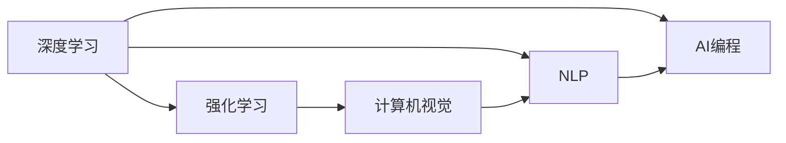

                 

## 1. 背景介绍

随着人工智能（AI）技术的迅猛发展，编程范式正经历一场深刻变革。传统基于规则的编程逐渐被基于数据驱动和模型驱动的编程所取代。人工智能编程，即AI Programming，以其强大的数据分析能力和模型优化潜力，正在改变我们对软件设计和开发的传统认知。本文将探讨AI编程的新思维与技术挑战，希望能够为IT领域从业人员带来一些新视角和新思路。

## 2. 核心概念与联系

### 2.1 核心概念概述

为了更好地理解AI编程的概念和技术，我们首先介绍几个关键概念：

- **AI编程（AI Programming）**：基于人工智能技术进行编程的新范式。它强调利用机器学习和深度学习算法，对海量数据进行分析、建模和优化，以提升软件系统的性能和效率。
- **深度学习（Deep Learning）**：一种基于神经网络的机器学习技术，能够处理高度复杂的数据模式和任务，如图像识别、自然语言处理等。
- **强化学习（Reinforcement Learning）**：通过与环境的交互，使智能体不断优化行为策略，以达到预期目标的学习方式。
- **自然语言处理（Natural Language Processing, NLP）**：研究如何让计算机理解和处理人类语言的技术，如文本分类、情感分析、机器翻译等。
- **计算机视觉（Computer Vision）**：使计算机能够“看”和“理解”图像和视频的技术，包括目标检测、图像生成、视频分析等。

这些概念相互交织，共同构成了AI编程的丰富生态。深度学习、强化学习和计算机视觉等技术，为AI编程提供了强大的工具和方法。而自然语言处理作为AI编程的重要应用领域之一，它的进步更是推动了AI编程的不断演进。

### 2.2 概念间的关系

AI编程的各个核心概念之间存在着紧密的联系，通过以下Mermaid流程图来展示它们的关系：



从图中可以看出，深度学习和强化学习是AI编程的基础，它们为计算机视觉和自然语言处理提供了技术支撑。而AI编程作为一个综合性的概念，涵盖了包括深度学习、强化学习、计算机视觉和自然语言处理在内的多种技术。

## 3. 核心算法原理 & 具体操作步骤

### 3.1 算法原理概述

AI编程的核心在于通过数据驱动的方法，利用机器学习和深度学习算法，对软件系统进行优化和改进。其基本流程包括数据收集、特征提取、模型训练和模型应用等步骤。具体来说：

1. **数据收集**：获取相关领域的大量数据，如文本、图像、视频等。
2. **特征提取**：使用特征提取技术，如词向量、卷积神经网络（CNN）、循环神经网络（RNN）等，将原始数据转化为模型可以处理的特征。
3. **模型训练**：使用深度学习框架（如TensorFlow、PyTorch等）构建和训练模型，通过优化算法（如梯度下降、Adam等）调整模型参数，使其能够预测新数据。
4. **模型应用**：将训练好的模型部署到实际应用中，进行预测、分类、推荐等任务。

### 3.2 算法步骤详解

以下是AI编程的详细操作步骤：

**Step 1: 数据收集与预处理**

- 确定任务需求，收集相关领域的数据。数据来源可以包括公开数据集、API接口、爬虫抓取等。
- 对数据进行清洗、去噪和标准化处理，以确保数据质量。

**Step 2: 特征提取与选择**

- 选择合适的特征提取方法，如词向量（Word Embedding）、卷积神经网络（CNN）、循环神经网络（RNN）等。
- 对特征进行选择和组合，使用特征工程技术（如降维、归一化、编码等）提高模型效率。

**Step 3: 模型选择与训练**

- 选择合适的深度学习模型，如卷积神经网络（CNN）、循环神经网络（RNN）、Transformer等。
- 使用深度学习框架进行模型构建和训练，调整模型超参数，如学习率、批量大小、迭代轮数等。
- 使用优化算法进行模型训练，最小化损失函数，如交叉熵、均方误差等。

**Step 4: 模型评估与调优**

- 在验证集上评估模型性能，使用评估指标如准确率、召回率、F1-score等。
- 根据评估结果调整模型结构、参数和超参数，进行模型调优。

**Step 5: 模型部署与优化**

- 将训练好的模型部署到实际应用中，使用服务化工具如Docker、Kubernetes等进行容器化部署。
- 优化模型性能，如使用混合精度训练、模型压缩、模型融合等技术。

### 3.3 算法优缺点

AI编程的优点在于：

- 自动化程度高，能够快速处理大量数据和复杂任务。
- 结合深度学习和强化学习，模型具有很强的自适应性和学习能力。
- 可以应用于多种领域，如图像识别、自然语言处理、推荐系统等。

同时，AI编程也存在一些缺点：

- 对数据和计算资源的需求较高，需要高性能计算设备和大量标注数据。
- 模型的可解释性较差，难以理解其内部工作机制。
- 模型训练和优化过程复杂，需要专业知识和高水平的数据科学家的参与。

### 3.4 算法应用领域

AI编程在多个领域中都有广泛应用，例如：

- **计算机视觉**：图像识别、目标检测、人脸识别、图像生成等。
- **自然语言处理**：机器翻译、文本分类、情感分析、问答系统等。
- **推荐系统**：商品推荐、内容推荐、个性化广告等。
- **智能运维**：故障检测、性能优化、自动化测试等。
- **医疗健康**：疾病预测、药物研发、健康监测等。
- **金融科技**：信用评分、风险评估、投资策略等。

## 4. 数学模型和公式 & 详细讲解

### 4.1 数学模型构建

AI编程的数学模型主要基于深度学习框架进行构建。这里以卷积神经网络（CNN）为例，介绍其数学模型构建过程。

- **输入数据**：$x \in \mathbb{R}^n$，其中$n$为输入数据维度。
- **卷积层**：使用卷积核对输入数据进行卷积操作，得到特征图$h \in \mathbb{R}^{n'}$。
- **激活函数**：使用非线性激活函数如ReLU、Sigmoid等，引入非线性变换。
- **池化层**：使用池化操作对特征图进行下采样，减少模型参数。
- **全连接层**：将池化后的特征图输入全连接层，得到输出结果$y \in \mathbb{R}^m$。
- **损失函数**：使用交叉熵损失函数（$-\frac{1}{N}\sum_{i=1}^N y_i \log \hat{y_i}$），衡量模型预测结果与真实标签之间的差异。

### 4.2 公式推导过程

以CNN为例，卷积层的卷积操作可以表示为：

$$
h_k(x) = \sum_{j=1}^{n} w_{k,j} x_j + b_k
$$

其中，$w_{k,j}$为卷积核参数，$b_k$为偏置项。通过多个卷积核的叠加，可以得到多通道的特征图。

池化操作可以表示为：

$$
p_k = \max_{i=1,...,k} h_i
$$

全连接层可以表示为：

$$
y = W h + b
$$

其中，$W$为权重矩阵，$b$为偏置向量。损失函数可以表示为：

$$
L(y,\hat{y}) = -\frac{1}{N}\sum_{i=1}^N y_i \log \hat{y_i}
$$

### 4.3 案例分析与讲解

假设我们希望构建一个图像分类器，使用CNN进行训练。假设输入数据为$x$，输出标签为$y$。我们可以按照以下步骤进行模型构建和训练：

1. **数据准备**：收集并标注大量图像数据，如CIFAR-10、ImageNet等。
2. **模型构建**：使用PyTorch框架构建CNN模型，包含卷积层、激活函数、池化层、全连接层等。
3. **模型训练**：使用GPU进行并行训练，最小化交叉熵损失函数，调整模型参数。
4. **模型评估**：在测试集上评估模型性能，如准确率、召回率、F1-score等。
5. **模型优化**：根据评估结果，调整模型结构和参数，进行超参数调优。
6. **模型部署**：将训练好的模型部署到实际应用中，进行图像分类预测。

## 5. 项目实践：代码实例和详细解释说明

### 5.1 开发环境搭建

为了进行AI编程项目实践，我们需要准备以下开发环境：

1. **安装Python**：选择Python 3.x版本，使用Anaconda或Miniconda进行安装。
2. **安装深度学习框架**：如TensorFlow、PyTorch、Keras等，使用pip或conda进行安装。
3. **安装数据处理工具**：如Pandas、NumPy、Scikit-learn等，使用pip或conda进行安装。
4. **安装可视化工具**：如Matplotlib、Seaborn、TensorBoard等，使用pip或conda进行安装。
5. **安装机器学习框架**：如scikit-learn、XGBoost、LightGBM等，使用pip或conda进行安装。

### 5.2 源代码详细实现

以下是一个使用TensorFlow进行图像分类的示例代码：

```python
import tensorflow as tf
from tensorflow.keras import layers, models

# 构建CNN模型
model = models.Sequential([
    layers.Conv2D(32, (3, 3), activation='relu', input_shape=(32, 32, 3)),
    layers.MaxPooling2D((2, 2)),
    layers.Conv2D(64, (3, 3), activation='relu'),
    layers.MaxPooling2D((2, 2)),
    layers.Conv2D(64, (3, 3), activation='relu'),
    layers.Flatten(),
    layers.Dense(64, activation='relu'),
    layers.Dense(10)
])

# 编译模型
model.compile(optimizer='adam', loss=tf.keras.losses.SparseCategoricalCrossentropy(from_logits=True), metrics=['accuracy'])

# 训练模型
model.fit(train_images, train_labels, epochs=10, validation_data=(test_images, test_labels))

# 评估模型
test_loss, test_acc = model.evaluate(test_images, test_labels, verbose=2)
print('Test accuracy:', test_acc)
```

### 5.3 代码解读与分析

上述代码中，我们首先使用TensorFlow的Keras API构建了一个包含卷积层、池化层和全连接层的CNN模型。然后使用Adam优化器和交叉熵损失函数编译模型。接着，使用训练集进行模型训练，并在验证集上进行评估。最后，使用测试集对模型进行评估，输出测试精度。

## 6. 实际应用场景

### 6.1 智能运维

AI编程在智能运维中有着广泛的应用。通过收集运维数据，利用深度学习算法进行故障预测和性能优化，可以显著提升系统的稳定性和可靠性。

- **故障预测**：使用时间序列分析、卷积神经网络等技术，对系统运行数据进行分析，预测可能出现的故障，提前进行维护。
- **性能优化**：利用强化学习算法，对系统参数进行优化，提升系统性能和效率。
- **自动化测试**：使用自然语言处理技术，自动生成测试用例，提高测试覆盖率和效率。

### 6.2 金融科技

AI编程在金融科技领域也有着重要的应用，如信用评分、风险评估、投资策略等。

- **信用评分**：使用深度学习算法对客户的交易记录、社交行为等数据进行分析，预测客户的信用风险。
- **风险评估**：利用强化学习算法，对市场动态进行建模，预测市场风险。
- **投资策略**：使用自然语言处理技术，分析市场新闻、公告等文本信息，进行投资策略优化。

### 6.3 医疗健康

AI编程在医疗健康领域也有着广泛的应用，如疾病预测、药物研发、健康监测等。

- **疾病预测**：使用深度学习算法，对患者的生理数据进行分析，预测可能出现的疾病。
- **药物研发**：利用计算机视觉技术，对生物分子图像进行分析和建模，加速药物研发过程。
- **健康监测**：使用传感器数据和深度学习算法，对用户的健康状况进行实时监测和预警。

## 7. 工具和资源推荐

### 7.1 学习资源推荐

为了系统掌握AI编程的相关知识，以下是一些推荐的学习资源：

- **深度学习课程**：如Coursera的《Deep Learning Specialization》、Udacity的《Deep Learning Nanodegree》等。
- **自然语言处理课程**：如Stanford的《CS224N: Natural Language Processing with Deep Learning》等。
- **计算机视觉课程**：如Stanford的《CS231n: Convolutional Neural Networks for Visual Recognition》等。
- **强化学习课程**：如Coursera的《Reinforcement Learning Specialization》等。

### 7.2 开发工具推荐

为了进行AI编程项目实践，以下是一些推荐的开发工具：

- **深度学习框架**：如TensorFlow、PyTorch、Keras等。
- **数据处理工具**：如Pandas、NumPy、Scikit-learn等。
- **可视化工具**：如Matplotlib、Seaborn、TensorBoard等。
- **机器学习框架**：如scikit-learn、XGBoost、LightGBM等。
- **容器化工具**：如Docker、Kubernetes等。

### 7.3 相关论文推荐

为了深入了解AI编程的最新进展，以下是一些推荐的论文：

- **深度学习论文**：如《ImageNet Classification with Deep Convolutional Neural Networks》等。
- **自然语言处理论文**：如《Attention is All You Need》等。
- **计算机视觉论文**：如《Detecting Objects in Nature Scenes: A Challenge》等。
- **强化学习论文**：如《Playing Atari with Deep Reinforcement Learning》等。

## 8. 总结：未来发展趋势与挑战

### 8.1 研究成果总结

AI编程作为一种新兴的编程范式，已经在多个领域取得了显著的进展。深度学习、强化学习和计算机视觉等技术的不断突破，为AI编程提供了强大的技术支撑。自然语言处理和智能运维等应用领域的广泛探索，展示了AI编程的广阔前景。

### 8.2 未来发展趋势

未来的AI编程将呈现出以下几个发展趋势：

- **自动化程度提高**：随着AI技术的不断成熟，AI编程将更加自动化和智能化，能够快速处理复杂任务，提高开发效率。
- **跨领域融合**：AI编程将与其他领域的技术进行深度融合，如物联网、区块链等，拓展AI编程的应用范围。
- **数据驱动**：数据将成为AI编程的核心资源，通过海量数据进行训练和优化，提升模型性能和泛化能力。
- **模型集成**：多模型集成技术将成为AI编程的重要工具，通过组合多个模型的优势，提高系统的鲁棒性和可靠性。
- **边缘计算**：将AI编程模型部署到边缘设备，进行本地计算和推理，提升系统的实时性和响应速度。

### 8.3 面临的挑战

尽管AI编程前景广阔，但在实际应用中仍面临一些挑战：

- **数据获取难度**：获取高质量、大规模的数据资源，是AI编程的重要瓶颈。
- **模型复杂度**：大规模深度学习模型需要高性能计算资源，成本较高。
- **模型可解释性**：AI编程模型的黑盒特性，使得模型的可解释性较差，难以理解其内部工作机制。
- **隐私保护**：AI编程涉及大量用户数据，如何保护用户隐私，是一个亟待解决的问题。
- **伦理与安全**：AI编程模型可能带来伦理和安全风险，如偏见、歧视等，如何规避这些风险，需要更多的伦理和安全约束。

### 8.4 研究展望

未来的AI编程研究将从以下几个方面进行：

- **数据高效利用**：探索无监督学习和半监督学习技术，提高数据利用效率，降低数据标注成本。
- **模型简化**：研究模型压缩、量化等技术，提高模型的计算效率和资源利用率。
- **模型可解释性**：引入可解释性技术，提高AI编程模型的透明性和可理解性。
- **跨模态融合**：探索多模态数据融合技术，提升AI编程模型的综合处理能力。
- **伦理与安全**：制定AI编程伦理和安全标准，建立模型训练和应用中的监督机制。

## 9. 附录：常见问题与解答

### Q1: AI编程的优势和劣势是什么？

**A**: AI编程的优势在于其强大的数据分析能力和模型优化潜力，能够处理复杂任务和海量数据。其劣势在于对数据和计算资源的需求较高，模型可解释性较差，需要专业知识和高水平的数据科学家的参与。

### Q2: AI编程在实际应用中需要注意哪些问题？

**A**: AI编程在实际应用中需要注意数据获取难度、模型复杂度、模型可解释性、隐私保护和伦理安全等问题。

### Q3: 如何提高AI编程模型的可解释性？

**A**: 提高AI编程模型的可解释性，可以采用可视化技术、特征重要性分析等方法，解释模型的决策过程和内部机制。

### Q4: 如何平衡AI编程模型的性能和计算资源？

**A**: 可以通过模型压缩、量化等技术，提高模型的计算效率和资源利用率。同时，可以通过多模型集成、分布式计算等方法，平衡模型的性能和资源消耗。

### Q5: AI编程的未来发展方向是什么？

**A**: AI编程的未来发展方向包括自动化程度提高、跨领域融合、数据驱动、模型集成、边缘计算等。

作者：禅与计算机程序设计艺术 / Zen and the Art of Computer Programming

