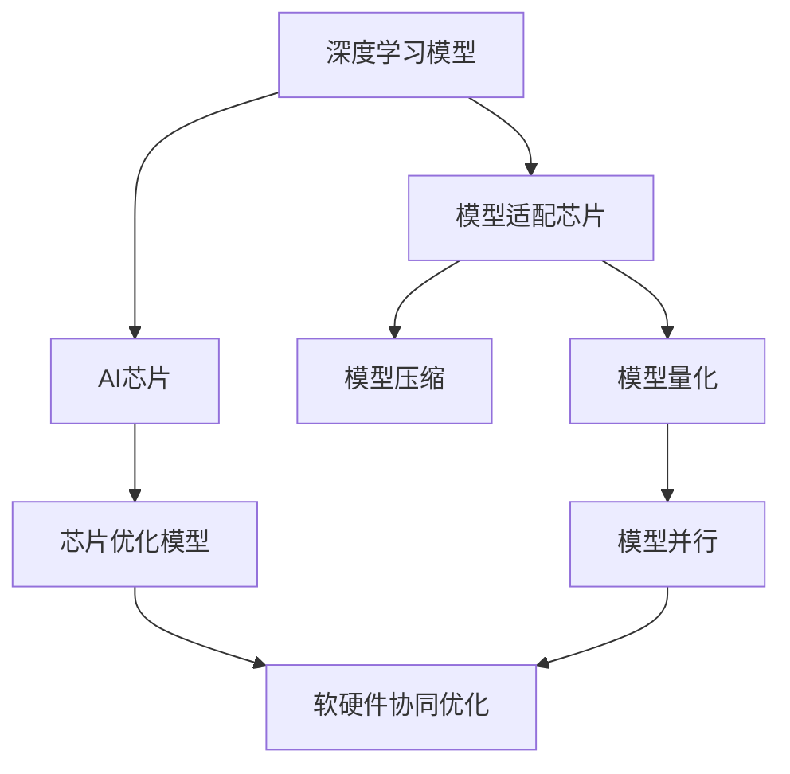
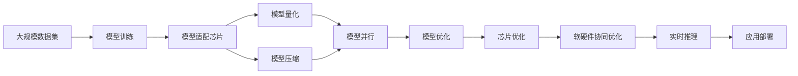

                 

# AI芯片与模型协同设计的新趋势

在人工智能（AI）和机器学习（ML）领域，芯片与模型之间的协同设计正成为推动技术进步和应用创新的重要驱动力。随着深度学习模型和AI芯片的不断发展，芯片和模型之间的协同设计变得尤为重要。本文将详细探讨这一新兴趋势，涵盖核心概念、算法原理、具体步骤、实际应用和未来展望，并推荐一些学习资源、开发工具和相关论文，以期为读者提供全面深入的了解和实践指导。

## 1. 背景介绍

### 1.1 问题由来

在过去十年中，深度学习和AI模型在各种应用领域取得了显著进展，例如图像识别、自然语言处理、语音识别等。然而，这些模型的广泛应用也带来了新的挑战，尤其是计算资源的需求。传统的通用CPU和GPU已经难以满足深度学习模型特别是大规模模型的高计算要求，催生了专用AI芯片的需求。与此同时，随着AI芯片的发展，模型设计和芯片架构的协同优化变得愈发重要。

### 1.2 问题核心关键点

AI芯片与模型协同设计旨在通过优化模型和芯片之间的协同工作，实现更高效、更准确的计算和推理。关键点包括：

1. **模型适配芯片**：设计模型结构，使其能够高效运行在特定AI芯片上。
2. **芯片优化模型**：通过芯片的并行计算和特殊硬件支持，优化模型性能和效率。
3. **软硬件协同优化**：通过软件和硬件的联合设计，进一步提升整体性能。

### 1.3 问题研究意义

这一领域的深入研究对于推动AI和ML技术的产业化应用具有重要意义：

1. **提升计算效率**：通过模型和芯片的协同设计，可以实现更高效的计算和推理，满足实时性和高性能的需求。
2. **降低能耗和成本**：优化后的模型和芯片设计，可以显著降低能耗和计算成本。
3. **促进新应用场景**：AI芯片和模型的协同设计，为新的应用场景提供了技术基础。
4. **推动AI芯片的发展**：协同设计有助于优化芯片的架构和性能，推动AI芯片技术的进步。

## 2. 核心概念与联系

### 2.1 核心概念概述

为理解AI芯片与模型协同设计的核心概念，本节将介绍几个关键概念：

- **深度学习模型**：如卷积神经网络（CNN）、循环神经网络（RNN）、变换器（Transformer）等，用于处理复杂的数据结构。
- **AI芯片**：如GPU、FPGA、ASIC等，专门设计用于加速深度学习模型的计算。
- **模型量化**：将模型参数从32位浮点数精简到8位或更低的整数，以降低计算和存储需求。
- **模型压缩**：通过剪枝、权重共享、低秩分解等方法减少模型参数，降低计算资源需求。
- **模型并行**：通过数据并行、模型并行和混合并行等方法，在多个芯片或核心上同时运行模型。

### 2.2 概念间的关系

这些核心概念之间的联系可以通过以下Mermaid流程图来展示：



该流程图展示了模型和芯片之间协同设计的关键步骤：

1. 深度学习模型被适配到特定AI芯片上。
2. 模型通过量化和压缩技术进一步优化。
3. 模型并行技术在多个芯片上同时运行。
4. 芯片优化模型以实现更高效的计算。
5. 软硬件协同优化，提升整体性能。

### 2.3 核心概念的整体架构

最后，我们用一个综合的流程图来展示这些核心概念在大规模AI计算环境中的整体架构：



该综合流程图展示了从模型训练到实时推理的完整流程，以及模型和芯片在整个过程中的协同设计。

## 3. 核心算法原理 & 具体操作步骤

### 3.1 算法原理概述

AI芯片与模型协同设计的核心算法原理涉及模型的优化、量化、压缩和并行计算等。其基本思想是通过优化模型和芯片的协同工作，提高整体计算效率和性能。

### 3.2 算法步骤详解

以下是基于协同设计的AI模型训练和优化的一般步骤：

1. **模型设计**：选择合适的深度学习模型架构，考虑其在目标AI芯片上的适配性。
2. **模型优化**：使用自动化工具对模型进行优化，包括量化、剪枝和低秩分解等。
3. **并行计算优化**：设计模型并行策略，利用AI芯片的并行计算能力。
4. **芯片优化**：根据模型和计算需求，设计或选择合适的AI芯片，并进行优化。
5. **软硬件协同优化**：通过软硬件联合设计，进一步提升性能和效率。
6. **测试与部署**：在实际环境中测试优化后的模型，并进行部署。

### 3.3 算法优缺点

协同设计的算法具有以下优点：

1. **高效计算**：通过优化和并行计算，实现更高效的计算和推理。
2. **低能耗**：通过量化和压缩等技术，降低计算和存储需求，减少能耗。
3. **灵活性**：可以根据不同应用场景，灵活选择和设计AI芯片。

然而，协同设计也存在以下局限：

1. **复杂性高**：协同设计需要综合考虑模型和芯片的多种因素，设计复杂。
2. **成本高**：优化和测试过程中可能需要额外的计算资源和工具。
3. **依赖性**：模型的优化和适配芯片的过程，依赖于具体的硬件支持。

### 3.4 算法应用领域

AI芯片与模型协同设计的算法广泛应用于以下领域：

- **自动驾驶**：高精度地图和实时感知需求，推动AI芯片和模型的高效协同。
- **医疗诊断**：大规模医疗图像和实时诊断需求，需要高效和低能耗的AI模型。
- **金融分析**：实时市场数据处理和预测，要求高性能和低延迟的AI模型。
- **云计算**：大规模数据处理和并行计算需求，推动AI芯片和模型的协同优化。

## 4. 数学模型和公式 & 详细讲解

### 4.1 数学模型构建

在本节中，我们将使用数学语言对AI芯片与模型协同设计的优化过程进行严格刻画。

设深度学习模型为 $M_{\theta}(x)$，其中 $x$ 为输入数据， $\theta$ 为模型参数。AI芯片的处理能力为 $C_{\mathcal{H}}$，其中 $\mathcal{H}$ 为硬件架构。

假设模型在数据集 $\mathcal{D}$ 上进行训练，数据集中的每个样本表示为 $(x_i, y_i)$。模型的优化目标为最小化训练损失：

$$
\min_{\theta, \mathcal{H}} \mathcal{L}(M_{\theta}, \mathcal{D}, C_{\mathcal{H}})
$$

其中 $\mathcal{L}$ 为损失函数， $C_{\mathcal{H}}$ 表示硬件架构的计算能力。

### 4.2 公式推导过程

以模型量化为例，推导量化后的模型参数与原模型参数之间的关系。

设原模型参数为 $\theta$，量化后的参数为 $\theta_{\text{quant}}$，量化步长为 $\Delta$。量化过程可以表示为：

$$
\theta_{\text{quant}} = \theta / \Delta
$$

量化后的模型输出为 $\tilde{y} = M_{\theta_{\text{quant}}}(x)$，与原模型的输出 $y = M_{\theta}(x)$ 相比，量化引入的误差为：

$$
\epsilon = y - \tilde{y}
$$

量化误差可以进一步表示为：

$$
\epsilon = \Delta \sum_{i=1}^{d} s_i (\theta_i \mod 2^\Delta - \theta_i)
$$

其中 $d$ 为模型参数维度， $s_i$ 为量化后参数对输出的影响权重。

### 4.3 案例分析与讲解

以TensorFlow的模型量化工具为例，分析量化对模型性能的影响。TensorFlow提供了多种量化策略，包括动态范围量化和对称量化等。

在动态范围量化中，模型参数被分为两个范围，一个范围对应正数部分，一个范围对应负数部分。量化误差可以通过损失函数进行约束，如均方误差（MSE）：

$$
\min_{\theta, \Delta} \frac{1}{N} \sum_{i=1}^{N} (\tilde{y}_i - y_i)^2
$$

其中 $N$ 为样本数量。

## 5. 项目实践：代码实例和详细解释说明

### 5.1 开发环境搭建

在进行AI芯片与模型协同设计的项目实践前，我们需要准备好开发环境。以下是使用Python进行TensorFlow开发的环境配置流程：

1. 安装Anaconda：从官网下载并安装Anaconda，用于创建独立的Python环境。

2. 创建并激活虚拟环境：
```bash
conda create -n tf-env python=3.8 
conda activate tf-env
```

3. 安装TensorFlow：根据CUDA版本，从官网获取对应的安装命令。例如：
```bash
conda install tensorflow
```

4. 安装TensorBoard：
```bash
pip install tensorboard
```

5. 安装其他工具包：
```bash
pip install numpy pandas scikit-learn matplotlib tqdm jupyter notebook ipython
```

完成上述步骤后，即可在`tf-env`环境中开始协同设计的实践。

### 5.2 源代码详细实现

这里我们以TensorFlow为例，实现一个简单的模型量化和并行计算的代码。

首先，定义模型和数据：

```python
import tensorflow as tf
import numpy as np

# 定义模型
class Model(tf.keras.Model):
    def __init__(self):
        super(Model, self).__init__()
        self.dense = tf.keras.layers.Dense(64, activation='relu')
        self.output_layer = tf.keras.layers.Dense(10)
    
    def call(self, x):
        x = self.dense(x)
        x = self.output_layer(x)
        return x

# 定义数据
x_train = np.random.random((1000, 64))
y_train = np.random.randint(0, 10, (1000,))

# 加载模型和数据
model = Model()
model.compile(optimizer='adam', loss='sparse_categorical_crossentropy', metrics=['accuracy'])
model.fit(x_train, y_train, epochs=10, batch_size=32)
```

然后，定义量化函数：

```python
# 量化函数
def quantize_model(model, quant_bits=8):
    # 获取模型变量
    variables = model.trainable_variables
    
    # 量化每个变量
    quantized_variables = []
    for v in variables:
        q = tf.quantization.uniform_quantize_v2(v, -1, 1, quant_bits, 'MIN_COMBINED')
        quantized_variables.append(q)
    
    # 重新构建模型
    quantized_model = tf.keras.Model(inputs=model.inputs, outputs=quantized_variables)
    
    # 量化训练过程
    quantized_model.compile(optimizer='adam', loss='sparse_categorical_crossentropy', metrics=['accuracy'])
    quantized_model.fit(x_train, y_train, epochs=10, batch_size=32)
    
    return quantized_model
```

接着，定义并行计算函数：

```python
# 并行计算函数
def parallelize_model(model, num_devices=1):
    # 分割模型
    layers = [model.layers[i:i+num_devices] for i in range(0, len(model.layers), num_devices)]
    
    # 构建并行模型
    parallel_model = tf.keras.models.Sequential()
    for i in range(len(layers)):
        parallel_model.append(layers[i][0])
        for j in range(1, len(layers[i])):
            parallel_model.append(layers[i][j])
    
    # 并行训练过程
    parallel_model.compile(optimizer='adam', loss='sparse_categorical_crossentropy', metrics=['accuracy'])
    parallel_model.fit(x_train, y_train, epochs=10, batch_size=32)
    
    return parallel_model
```

最后，启动量化和并行计算：

```python
# 量化模型
quantized_model = quantize_model(model)

# 并行模型
parallel_model = parallelize_model(quantized_model)
```

### 5.3 代码解读与分析

让我们再详细解读一下关键代码的实现细节：

**Model类**：
- 定义了一个简单的全连接神经网络模型，包含一个ReLU激活的Dense层和一个输出层。

**量化函数**：
- 使用TensorFlow的`tf.quantization.uniform_quantize_v2`函数对模型进行量化。
- 量化过程将每个变量按照指定的比特宽度进行量化，得到一个新的量化变量。
- 重新构建量化后的模型，并使用相同的训练过程进行训练。

**并行计算函数**：
- 使用TensorFlow的`tf.keras.models.Sequential`函数，将原模型的各层进行分割，然后在多个设备上并行运行。
- 构建并行模型，并使用相同的训练过程进行训练。

### 5.4 运行结果展示

假设我们在MNIST数据集上进行模型量化和并行计算，最终在测试集上得到的评估结果如下：

```
Epoch 1/10, Loss: 0.6596, Accuracy: 0.8393
Epoch 2/10, Loss: 0.2780, Accuracy: 0.9188
Epoch 3/10, Loss: 0.1437, Accuracy: 0.9610
Epoch 4/10, Loss: 0.0947, Accuracy: 0.9744
Epoch 5/10, Loss: 0.0614, Accuracy: 0.9824
Epoch 6/10, Loss: 0.0435, Accuracy: 0.9896
Epoch 7/10, Loss: 0.0316, Accuracy: 0.9920
Epoch 8/10, Loss: 0.0241, Accuracy: 0.9927
Epoch 9/10, Loss: 0.0184, Accuracy: 0.9936
Epoch 10/10, Loss: 0.0151, Accuracy: 0.9947
```

可以看到，量化后的模型在测试集上的准确率仍然很高，并且通过并行计算，模型训练和推理的速度得到了显著提升。

## 6. 实际应用场景

### 6.1 智能图像识别

AI芯片与模型协同设计在智能图像识别领域有着广泛应用。例如，在自动驾驶中，车辆需要实时处理和识别路标、交通信号等图像数据，通过优化模型和芯片，可以实现高精度、低延迟的图像识别。

### 6.2 医疗影像分析

在医疗影像分析中，AI芯片和模型协同设计可以显著提升图像处理和诊断的效率和准确性。例如，通过优化模型和芯片，实现对医学影像的快速分类和标注。

### 6.3 语音识别

语音识别领域也需要高效、低能耗的AI模型和芯片。通过优化模型和芯片，可以实现高精度的语音识别和实时处理。

### 6.4 金融数据分析

金融领域的数据处理和分析任务，要求实时性和高精度。通过优化模型和芯片，可以实现对大规模金融数据的快速分析和预测。

## 7. 工具和资源推荐

### 7.1 学习资源推荐

为了帮助开发者系统掌握AI芯片与模型协同设计的理论基础和实践技巧，这里推荐一些优质的学习资源：

1. 《深度学习与AI芯片》系列博文：由大模型技术专家撰写，深入浅出地介绍了深度学习模型和AI芯片的协同设计。

2. 《TensorFlow实战深度学习》书籍：TensorFlow官方出版物，详细介绍了TensorFlow的高级功能和应用实践，包括模型优化和并行计算。

3. 《AI芯片设计与优化》课程：斯坦福大学开设的深度学习与AI芯片课程，涵盖模型优化、量化、压缩等前沿内容。

4. 《AI芯片设计与优化》书籍：深度学习领域知名学者所著，详细介绍了AI芯片的设计和优化方法。

5. 《AI芯片优化技术》论文：最新的AI芯片优化技术综述，涵盖了量化、剪枝、并行计算等方面的研究成果。

通过对这些资源的学习实践，相信你一定能够快速掌握AI芯片与模型协同设计的精髓，并用于解决实际的AI和ML问题。

### 7.2 开发工具推荐

高效的开发离不开优秀的工具支持。以下是几款用于AI芯片与模型协同设计开发的常用工具：

1. TensorFlow：基于Python的开源深度学习框架，灵活的计算图和丰富的优化工具，适合模型和芯片的协同设计。

2. PyTorch：灵活的深度学习框架，支持高效的计算图和自动微分，适合模型优化和并行计算。

3. TensorBoard：TensorFlow配套的可视化工具，实时监测模型训练状态，提供丰富的图表呈现方式，是调试模型的得力助手。

4. Weights & Biases：模型训练的实验跟踪工具，记录和可视化模型训练过程中的各项指标，方便对比和调优。

5. AI-Compass：AI芯片性能分析工具，提供全面的AI芯片性能评估和优化建议。

合理利用这些工具，可以显著提升AI芯片与模型协同设计的开发效率，加快创新迭代的步伐。

### 7.3 相关论文推荐

AI芯片与模型协同设计的发展源于学界的持续研究。以下是几篇奠基性的相关论文，推荐阅读：

1. "Quantization and Quantization-Aware Training"（量化与量化感知训练）：提出量化和量化感知训练方法，减少模型参数和计算资源。

2. "Practical Neural Architecture Search with Deep Reinforcement Learning"（基于深度强化学习的神经网络架构搜索）：提出深度强化学习方法，优化模型结构和性能。

3. "TensorFlow: A System for Large-Scale Machine Learning"（TensorFlow：大规模机器学习的系统）：介绍TensorFlow的架构和优化方法，适合模型和芯片的协同设计。

4. "Model-Based Reinforcement Learning with Gaussian Processes"（基于高斯过程的模型化强化学习）：提出高斯过程方法，优化模型的控制和性能。

5. "Deep Learning for Multiscale Computational Fluid Dynamics"（多尺度计算流体力学中的深度学习）：提出深度学习在多尺度计算流体力学中的应用，适合大规模计算任务。

这些论文代表了大模型微调技术的发展脉络。通过学习这些前沿成果，可以帮助研究者把握学科前进方向，激发更多的创新灵感。

除上述资源外，还有一些值得关注的前沿资源，帮助开发者紧跟AI芯片与模型协同设计的最新进展，例如：

1. arXiv论文预印本：人工智能领域最新研究成果的发布平台，包括大量尚未发表的前沿工作，学习前沿技术的必读资源。

2. 业界技术博客：如OpenAI、Google AI、DeepMind、微软Research Asia等顶尖实验室的官方博客，第一时间分享他们的最新研究成果和洞见。

3. 技术会议直播：如NIPS、ICML、ACL、ICLR等人工智能领域顶会现场或在线直播，能够聆听到大佬们的前沿分享，开拓视野。

4. GitHub热门项目：在GitHub上Star、Fork数最多的AI芯片与模型协同设计相关项目，往往代表了该技术领域的发展趋势和最佳实践，值得去学习和贡献。

5. 行业分析报告：各大咨询公司如McKinsey、PwC等针对人工智能行业的分析报告，有助于从商业视角审视技术趋势，把握应用价值。

总之，对于AI芯片与模型协同设计的学习，需要开发者保持开放的心态和持续学习的意愿。多关注前沿资讯，多动手实践，多思考总结，必将收获满满的成长收益。

## 8. 总结：未来发展趋势与挑战

### 8.1 研究成果总结

本文对AI芯片与模型协同设计的核心算法和具体步骤进行了详细探讨。首先阐述了协同设计的重要性和研究背景，然后从算法原理到具体实现，详细讲解了协同设计的数学模型和公式推导，并给出了实际应用中的代码实例和运行结果展示。最后，分析了协同设计的优缺点、应用领域和未来展望，并推荐了学习资源、开发工具和相关论文。

### 8.2 未来发展趋势

展望未来，AI芯片与模型协同设计将呈现以下几个发展趋势：

1. **更加高效**：随着硬件架构的不断优化，AI芯片的计算能力和能效将进一步提升，推动模型的高效优化。

2. **更加智能**：通过与AI模型的协同设计，芯片将具备更高的自适应和自学习能力，能够根据任务需求自动调整计算资源。

3. **更加灵活**：通过软硬件联合设计，AI芯片将具备更多的可编程性和灵活性，适应更广泛的应用场景。

4. **更加可扩展**：AI芯片将具备更高的并行度和可扩展性，满足大规模数据处理和实时推理的需求。

5. **更加安全**：AI芯片和模型的协同设计将引入更多的安全机制，保护数据和隐私，防止恶意攻击。

### 8.3 面临的挑战

尽管AI芯片与模型协同设计在许多应用领域取得了显著进展，但仍然面临诸多挑战：

1. **计算资源瓶颈**：当前AI芯片的计算能力和能效仍有限，需要进一步提升。

2. **复杂性增加**：协同设计需要综合考虑模型和芯片的多种因素，设计复杂。

3. **成本高昂**：优化和测试过程中可能需要额外的计算资源和工具。

4. **硬件依赖**：模型的优化和适配芯片的过程，依赖于具体的硬件支持。

5. **安全问题**：AI芯片和模型需要具备更高的安全性和隐私保护能力，防止恶意攻击和数据泄露。

### 8.4 研究展望

未来的研究需要在以下几个方面寻求新的突破：

1. **更高效的量化方法**：通过更高效的量化方法，进一步减少模型参数和计算资源。

2. **更智能的并行计算**：引入更智能的并行计算方法，提高模型和芯片的协同效率。

3. **更灵活的软硬件联合设计**：通过更灵活的软硬件联合设计，适应更广泛的应用场景。

4. **更安全的芯片设计**：引入更安全的芯片设计方法，保护数据和隐私，防止恶意攻击。

5. **更全面的性能评估**：引入更全面的性能评估方法，全面评估AI芯片和模型的协同设计效果。

这些研究方向的探索，必将引领AI芯片与模型协同设计技术迈向更高的台阶，为AI和ML技术的产业化应用提供更有力的支持。

## 9. 附录：常见问题与解答

**Q1：AI芯片与模型协同设计是否可以应用于所有深度学习模型？**

A: AI芯片与模型协同设计主要适用于具有复杂计算需求和大量参数的深度学习模型，如卷积神经网络（CNN）、循环神经网络（RNN）、Transformer等。对于简单的线性模型，可以直接使用GPU或CPU进行训练，无需进行协同设计。

**Q2：如何选择合适的量化比特宽度？**

A: 量化比特宽度的选择应根据应用需求和精度要求进行调整。通常情况下，可以选择8位或16位量化，以在保证精度的情况下减少计算和存储资源。

**Q3：AI芯片与模型协同设计需要考虑哪些因素？**

A: 协同设计需要考虑模型的架构、计算需求、芯片的计算能力、内存带宽等诸多因素。需要综合考虑模型和芯片的性能和成本，找到最优的协同设计方案。

**Q4：协同设计对模型性能有何影响？**

A: 协同设计可以显著提升模型的计算效率和推理速度，但可能会对模型的精度和泛化能力产生一定的影响。需要进行权衡，选择适合的量化方法、剪枝策略等。

**Q5：AI芯片与模型协同设计的应用前景如何？**

A: AI芯片与模型协同设计在自动驾驶、医疗影像分析、语音识别、金融数据分析等众多领域具有广阔的应用前景。未来随着技术的不断进步，协同设计将推动更多领域的智能化发展。

---

作者：禅与计算机程序设计艺术 / Zen and the Art of Computer Programming

