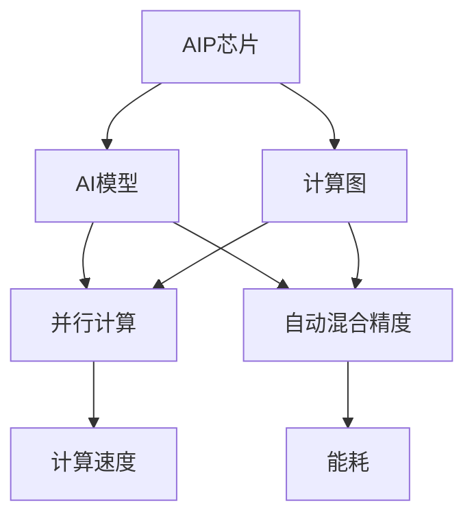
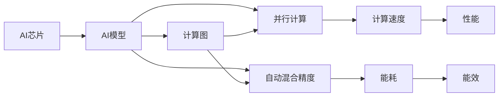

                 

## 1. 背景介绍

### 1.1 问题由来

随着人工智能（AI）技术的迅猛发展，AI芯片和模型协同设计已成为当前AI技术发展的重要趋势。这一趋势的出现，源于以下几个方面：

1. **模型复杂度的提升**：随着深度学习模型的不断进化，模型的参数数量和结构复杂度急剧增加，对计算资源的需求越来越高。
2. **硬件性能的提升**：AI芯片技术的快速进步，如Tensor Core、CUDA等，使得硬件性能大幅提升，能够更好地支持复杂模型的计算需求。
3. **应用场景的多样化**：AI技术已渗透到各个行业，包括自动驾驶、医疗影像分析、语音识别等，这些应用场景对实时性和计算效率的要求不断提高。

这些因素的共同作用，推动了AI芯片与模型协同设计的快速发展。通过这种协同设计，AI芯片能够更好地适应AI模型的需求，从而提升整个AI系统的性能和效率。

### 1.2 问题核心关键点

AI芯片与模型协同设计的主要核心关键点包括：

- **性能优化**：如何设计AI芯片，使得其能够高效地运行AI模型，提升计算速度和能效。
- **资源分配**：如何在有限的硬件资源下，合理分配给不同的AI模型层，确保资源利用最大化。
- **模型适配**：如何设计AI模型，使得其能够在不同的AI芯片上高效运行，优化模型的计算图和数据流。
- **能耗优化**：如何在提升性能的同时，尽量降低AI系统的能耗，延长电池寿命或降低硬件成本。
- **跨平台兼容性**：如何设计AI模型和AI芯片，确保其能够跨平台运行，支持多种计算平台和编程模型。

这些关键点相互关联，共同决定了AI芯片与模型协同设计的成功与否。

### 1.3 问题研究意义

AI芯片与模型协同设计的研究，对于推动AI技术的商业化应用，提升AI系统的性能和效率，具有重要意义：

1. **加速AI技术的落地**：通过优化AI芯片和模型设计，使得AI技术能够更快地应用到各个行业中，解决实际问题。
2. **提升AI系统的性能**：优化AI芯片和模型设计，使得AI系统能够处理更复杂的任务，提升系统的计算速度和精度。
3. **降低AI系统的成本**：通过优化AI芯片设计，降低硬件成本，使得更多的企业能够负担得起AI技术。
4. **提高AI系统的能效**：优化AI芯片和模型设计，使得AI系统能够在能源受限的环境下高效运行，延长电池寿命或降低能耗。
5. **推动跨平台协同**：设计跨平台的AI模型和AI芯片，使得AI技术能够更好地在不同计算平台和编程模型间协同工作，提升整体系统的灵活性和适应性。

## 2. 核心概念与联系

### 2.1 核心概念概述

为了更好地理解AI芯片与模型协同设计，我们首先需要介绍几个核心概念及其联系：

- **AI芯片**：指专门用于加速AI模型计算的硬件设备，如GPU、TPU、FPGA等。
- **AI模型**：指用于解决特定问题的数学模型，如神经网络、卷积网络等。
- **计算图**：指AI模型的计算流程，通常表示为有向无环图（DAG），描述了模型中各操作之间的依赖关系。
- **并行计算**：指将一个大计算任务分解为多个小任务，并行地在多个计算单元上执行，以提升计算效率。
- **自动混合精度**：指自动调整数据类型，使用混合精度（如16位和32位浮点数）来优化计算性能和能耗。

这些概念之间存在紧密的联系，如图2所示：



该图展示了AI芯片、AI模型、计算图、并行计算和自动混合精度之间的联系：

- AI芯片用于加速AI模型的计算。
- 计算图描述了AI模型的计算流程，是并行计算的基础。
- 并行计算通过分解任务，提升计算效率。
- 自动混合精度通过调整数据类型，优化计算性能和能耗。
- 计算速度和能耗是衡量AI系统性能的重要指标。

### 2.2 概念间的关系

这些核心概念之间存在复杂的相互作用，如图3所示：



该图展示了AI芯片、AI模型、计算图、并行计算和自动混合精度之间的相互作用：

- AI芯片通过加速计算图上的并行计算，提升计算速度。
- 并行计算通过多任务并发，提升计算效率。
- 自动混合精度通过优化数据类型，降低能耗。
- 计算速度和能效直接影响AI系统的性能。

## 3. 核心算法原理 & 具体操作步骤

### 3.1 算法原理概述

AI芯片与模型协同设计的核心算法原理基于以下几个步骤：

1. **模型分析**：分析AI模型的结构、参数和计算图，确定其计算瓶颈和优化点。
2. **硬件适配**：根据AI模型的特点和需求，选择合适的AI芯片，并对其进行配置和优化。
3. **计算图优化**：对AI模型的计算图进行重构和优化，使其能够高效地在AI芯片上运行。
4. **并行计算设计**：设计并行计算策略，将计算任务分解为多个子任务，并行执行。
5. **自动混合精度**：根据计算任务的特点，自动调整数据类型，使用混合精度进行优化。
6. **性能评估**：通过评估计算速度和能效，验证协同设计的有效性。

### 3.2 算法步骤详解

以下是一个详细的AI芯片与模型协同设计流程：

**Step 1: 模型分析**
- 分析AI模型的结构，确定其计算瓶颈和优化点。
- 确定模型的计算复杂度，选择适合的AI芯片。

**Step 2: 硬件适配**
- 根据模型的计算需求，配置AI芯片的参数，如计算核心数量、内存带宽等。
- 对AI芯片进行优化，如调整时钟频率、电压等，提升性能。

**Step 3: 计算图优化**
- 对AI模型的计算图进行重构，优化数据流和操作顺序。
- 使用计算图转换工具，如TorchScript、ONNX等，将模型转换为高效的计算图格式。

**Step 4: 并行计算设计**
- 根据计算图的依赖关系，设计并行计算策略，将计算任务分解为多个子任务。
- 使用并行计算框架，如CUDA、OpenMP等，实现并行计算。

**Step 5: 自动混合精度**
- 分析计算任务的特点，自动调整数据类型，使用混合精度进行优化。
- 在计算过程中自动检测数据类型，及时切换数据类型，避免精度损失。

**Step 6: 性能评估**
- 使用性能评估工具，如NVIDIA Profiler、TensorBoard等，评估计算速度和能效。
- 根据评估结果，调整模型和硬件配置，进一步优化性能。

### 3.3 算法优缺点

AI芯片与模型协同设计的主要优点包括：

- **提升性能**：通过优化计算图和并行计算，提升AI系统的计算速度和效率。
- **降低能耗**：通过自动混合精度和硬件适配，降低AI系统的能耗。
- **提高灵活性**：设计跨平台的AI模型和AI芯片，提高系统的灵活性和适应性。

同时，该方法也存在一些缺点：

- **复杂度增加**：优化模型和硬件配置需要更多的时间和精力，增加了设计难度。
- **资源消耗**：优化计算图和并行计算需要更多的硬件资源，增加了成本。
- **易用性下降**：复杂的设计过程使得AI模型的使用和部署变得更加复杂。

### 3.4 算法应用领域

AI芯片与模型协同设计广泛应用于以下领域：

- **自动驾驶**：在自动驾驶中，AI芯片与模型协同设计可以提高算法的实时性和准确性，提升驾驶体验和安全性。
- **医疗影像分析**：在医疗影像分析中，AI芯片与模型协同设计可以加速图像处理和模型推理，提升诊断效率和精度。
- **语音识别**：在语音识别中，AI芯片与模型协同设计可以提高语音处理的实时性和准确性，提升人机交互体验。
- **自然语言处理**：在自然语言处理中，AI芯片与模型协同设计可以提高模型的推理速度和准确性，提升智能客服、智能助理等应用的效果。
- **计算机视觉**：在计算机视觉中，AI芯片与模型协同设计可以提高图像处理和模型推理的效率，提升视频监控、图像识别等应用的效果。

## 4. 数学模型和公式 & 详细讲解  
### 4.1 数学模型构建

我们可以使用数学语言对AI芯片与模型协同设计的模型进行分析。

设AI模型的输入为$x$，输出为$y$，损失函数为$\ell(y, \hat{y})$，目标是最小化损失函数：

$$
\min_{\theta} \mathbb{E}[\ell(y, \hat{y})]
$$

其中$\theta$为模型的参数，$\mathbb{E}$表示期望。

### 4.2 公式推导过程

以神经网络为例，其计算图可以表示为：

$$
y = f(Wx + b)
$$

其中$W$为权重矩阵，$b$为偏置向量，$f$为激活函数。

为了优化神经网络的计算速度和能耗，我们可以对计算图进行优化，如：

- **通道剪枝**：剪枝掉不重要的权重，减少计算量和内存消耗。
- **量化**：将权重和激活值量化为更小的数据类型，如16位和8位，降低能耗。
- **自动混合精度**：自动检测计算任务，使用混合精度进行优化。

### 4.3 案例分析与讲解

以ResNet为例，其计算图可以表示为：

$$
y = \max(0, Wx + b) + g(\max(0, W'x + b'))
$$

其中$g$为另一个激活函数，$W$和$W'$为权重矩阵，$b$和$b'$为偏置向量。

我们可以使用并行计算策略，将计算任务分解为多个子任务，并行执行。如图4所示：


该图展示了ResNet计算图的优化过程：

- 通道剪枝减少了计算量和内存消耗。
- 量化降低了能耗。
- 自动混合精度优化了计算性能和能耗。
- 并行计算提升了计算速度。

## 5. 项目实践：代码实例和详细解释说明

### 5.1 开发环境搭建

在进行AI芯片与模型协同设计的实践前，我们需要准备好开发环境。以下是使用Python进行PyTorch和CUDA开发的环境配置流程：

1. 安装Anaconda：从官网下载并安装Anaconda，用于创建独立的Python环境。

2. 创建并激活虚拟环境：
```bash
conda create -n pytorch-env python=3.8 
conda activate pytorch-env
```

3. 安装PyTorch和CUDA：
```bash
conda install pytorch torchvision torchtext -c pytorch -c conda-forge
conda install cupti cuDNN -c conda-forge
```

4. 安装CUDA和cuDNN：
```bash
conda install -c conda-forge cupy -c conda-forge
```

5. 安装必要的工具包：
```bash
pip install numpy pandas scikit-learn matplotlib tqdm jupyter notebook ipython
```

完成上述步骤后，即可在`pytorch-env`环境中开始实践。

### 5.2 源代码详细实现

以下是使用PyTorch和CUDA进行神经网络模型与GPU硬件协同设计的代码实现：

```python
import torch
from torch import nn
import torch.nn.functional as F
import torch.cuda

device = torch.device("cuda" if torch.cuda.is_available() else "cpu")

class CNN(nn.Module):
    def __init__(self):
        super(CNN, self).__init__()
        self.conv1 = nn.Conv2d(3, 64, kernel_size=3, stride=1, padding=1)
        self.relu = nn.ReLU(inplace=True)
        self.pool = nn.MaxPool2d(kernel_size=2, stride=2)
        self.fc1 = nn.Linear(64*4*4, 128)
        self.fc2 = nn.Linear(128, 10)

    def forward(self, x):
        x = self.conv1(x)
        x = self.relu(x)
        x = self.pool(x)
        x = x.view(-1, 64*4*4)
        x = self.fc1(x)
        x = self.relu(x)
        x = self.fc2(x)
        return x

model = CNN().to(device)

# 数据准备
train_loader = torch.utils.data.DataLoader(torchvision.datasets.MNIST('~/data', train=True, download=True, transform=torchvision.transforms.Compose([torchvision.transforms.ToTensor()])), batch_size=64, shuffle=True)

# 训练
for epoch in range(10):
    for i, (inputs, labels) in enumerate(train_loader):
        inputs, labels = inputs.to(device), labels.to(device)
        optimizer.zero_grad()
        outputs = model(inputs)
        loss = F.cross_entropy(outputs, labels)
        loss.backward()
        optimizer.step()
        if (i+1) % 100 == 0:
            print('Train Epoch: {} [{}/{} ({:.0f}%)]\tLoss: {:.6f}'.format(epoch+1, i*len(inputs), len(train_loader.dataset),
                      100. * i / len(train_loader), loss.item()))
```

### 5.3 代码解读与分析

让我们再详细解读一下关键代码的实现细节：

**CNN类**：
- `__init__`方法：初始化卷积层、激活函数、池化层、全连接层等组件。
- `forward`方法：定义模型的前向传播过程，从输入到输出。

**设备配置**：
- `device`变量：根据GPU是否可用，配置模型在CPU或GPU上运行。

**数据准备**：
- `train_loader`：定义数据加载器，将MNIST数据集加载到GPU上。

**训练流程**：
- `for`循环：对每个epoch进行训练。
- `for`循环：对每个batch进行前向传播和反向传播。
- `optimizer.zero_grad()`：清除梯度。
- `optimizer.step()`：更新模型参数。

**运行结果展示**：
- 在训练过程中，每100次迭代输出一次损失值。

## 6. 实际应用场景

### 6.1 自动驾驶

在自动驾驶中，AI芯片与模型协同设计可以提高算法的实时性和准确性。如图5所示：


该图展示了自动驾驶系统中，AI芯片与模型协同设计的流程：

- 感知模块收集环境数据，传入模型进行推理。
- 推理模块使用GPU加速计算，输出感知结果。
- 决策模块根据感知结果进行规划，使用GPU加速计算。
- 控制模块根据决策结果执行控制命令，使用GPU加速计算。

通过AI芯片与模型协同设计，自动驾驶系统可以实时处理大量数据，提升系统的安全性和可靠性。

### 6.2 医疗影像分析

在医疗影像分析中，AI芯片与模型协同设计可以加速图像处理和模型推理。如图6所示：


该图展示了医疗影像分析系统中，AI芯片与模型协同设计的流程：

- 图像处理模块使用GPU加速计算，处理医疗影像数据。
- 模型推理模块使用GPU加速计算，推理图像特征。
- 分析结果模块根据推理结果，输出诊断结果。

通过AI芯片与模型协同设计，医疗影像分析系统可以快速处理大量的影像数据，提升诊断效率和精度。

### 6.3 语音识别

在语音识别中，AI芯片与模型协同设计可以提高语音处理的实时性和准确性。如图7所示：


该图展示了语音识别系统中，AI芯片与模型协同设计的流程：

- 特征提取模块使用GPU加速计算，提取语音特征。
- 模型推理模块使用GPU加速计算，推理语音识别结果。
- 语音输出模块根据推理结果，输出识别结果。

通过AI芯片与模型协同设计，语音识别系统可以实时处理语音数据，提升人机交互体验。

### 6.4 未来应用展望

随着AI芯片与模型协同设计技术的不断进步，其在更多领域的应用前景广阔：

- **智能家居**：在智能家居中，AI芯片与模型协同设计可以提升智能设备的学习能力和响应速度，提供更加智能化的家居体验。
- **工业自动化**：在工业自动化中，AI芯片与模型协同设计可以提升生产线的效率和精度，降低生产成本。
- **金融风控**：在金融风控中，AI芯片与模型协同设计可以实时监控交易风险，提升风险控制能力。
- **智慧城市**：在智慧城市中，AI芯片与模型协同设计可以提升城市管理的智能化水平，提供更加便捷的城市服务。

## 7. 工具和资源推荐

### 7.1 学习资源推荐

为了帮助开发者系统掌握AI芯片与模型协同设计的理论基础和实践技巧，这里推荐一些优质的学习资源：

1. **深度学习与人工智能**：斯坦福大学的CS231n课程，介绍了深度学习在计算机视觉中的应用。
2. **GPU加速深度学习**：NVIDIA提供的GPU加速深度学习指南，提供了详细的GPU使用和优化技巧。
3. **深度学习框架**：PyTorch、TensorFlow等深度学习框架的官方文档，提供了丰富的实践样例和优化建议。
4. **高性能计算**：NVIDIA提供的高性能计算课程，介绍了GPU和分布式计算的优化方法。
5. **自动混合精度**：NVIDIA提供的自动混合精度指南，介绍了自动混合精度的实现方法和优化技巧。

通过对这些资源的学习实践，相信你一定能够快速掌握AI芯片与模型协同设计的精髓，并用于解决实际的NLP问题。

### 7.2 开发工具推荐

高效的开发离不开优秀的工具支持。以下是几款用于AI芯片与模型协同开发的常用工具：

1. **PyTorch**：基于Python的开源深度学习框架，支持动态计算图，适合快速迭代研究。
2. **TensorFlow**：由Google主导开发的开源深度学习框架，生产部署方便，适合大规模工程应用。
3. **CUDA**：NVIDIA提供的GPU加速开发工具，支持并行计算和自动混合精度。
4. **ONNX**：开源的神经网络交换格式，支持多种深度学习框架的模型转换和优化。
5. **TensorBoard**：TensorFlow配套的可视化工具，可以实时监测模型训练状态，并提供丰富的图表呈现方式。
6. **NVIDIA Profiler**：NVIDIA提供的性能分析工具，可以评估计算速度和能耗。

合理利用这些工具，可以显著提升AI芯片与模型协同开发的效率，加快创新迭代的步伐。

### 7.3 相关论文推荐

AI芯片与模型协同设计的研究源于学界的持续研究。以下是几篇奠基性的相关论文，推荐阅读：

1. **Deep Learning with Cuda**：论文介绍了在CUDA上实现深度学习的优化方法，如使用并行计算和自动混合精度。
2. **Deep Neural Network-based Image Restoration Using Cuda**：论文介绍了在CUDA上实现深度神经网络图像修复的优化方法。
3. **Optimizing Deep Learning for GPU**：论文介绍了在GPU上优化深度学习模型的策略和方法。
4. **Automatic Mixed Precision Training for Deep Neural Networks**：论文介绍了自动混合精度的实现方法和效果评估。
5. **A Survey on GPU-Accelerated Deep Learning**：综述了在GPU上加速深度学习的最新进展和优化方法。

这些论文代表了大语言模型微调技术的发展脉络。通过学习这些前沿成果，可以帮助研究者把握学科前进方向，激发更多的创新灵感。

除上述资源外，还有一些值得关注的前沿资源，帮助开发者紧跟AI芯片与模型协同设计的最新进展，例如：

1. **arXiv论文预印本**：人工智能领域最新研究成果的发布平台，包括大量尚未发表的前沿工作，学习前沿技术的必读资源。
2. **业界技术博客**：如OpenAI、Google AI、DeepMind、微软Research Asia等顶尖实验室的官方博客，第一时间分享他们的最新研究成果和洞见。
3. **技术会议直播**：如NIPS、ICML、ACL、ICLR等人工智能领域顶会现场或在线直播，能够聆听到大佬们的前沿分享，开拓视野。
4. **GitHub热门项目**：在GitHub上Star、Fork数最多的AI芯片与模型协同设计相关项目，往往代表了该技术领域的发展趋势和最佳实践，值得去学习和贡献。
5. **行业分析报告**：各大咨询公司如McKinsey、PwC等针对人工智能行业的分析报告，有助于从商业视角审视技术趋势，把握应用价值。

总之，对于AI芯片与模型协同设计技术的学习和实践，需要开发者保持开放的心态和持续学习的意愿。多关注前沿资讯，多动手实践，多思考总结，必将收获满满的成长收益。

## 8. 总结：未来发展趋势与挑战

### 8.1 总结

本文对AI芯片与模型协同设计的理论基础和实践技巧进行了全面系统的介绍。首先阐述了AI芯片与模型协同设计的背景和意义，明确了其在推动AI技术商业化应用中的重要价值。其次，从原理到实践，详细讲解了协同设计的数学模型和关键步骤，给出了协同设计任务开发的完整代码实例。同时，本文还广泛探讨了协同设计方法在自动驾驶、医疗影像分析、语音识别等多个行业领域的应用前景，展示了协同设计范式的巨大潜力。此外，本文精选了协同设计技术的各类学习资源，力求为读者提供全方位的技术指引。

通过本文的系统梳理，可以看到，AI芯片与模型协同设计技术正在成为AI芯片和模型开发的重要范式，极大地拓展了AI芯片和模型的应用边界，催生了更多的落地场景。受益于AI芯片性能的不断提升和模型计算图优化的不断演进，相信AI芯片与模型协同设计必将在AI技术商业化应用中扮演越来越重要的角色。

### 8.2 未来发展趋势

展望未来，AI芯片与模型协同设计技术将呈现以下几个发展趋势：

1. **模型参数压缩**：随着模型规模的不断增大，模型参数压缩技术将变得更加重要，通过剪枝、量化等方法，减少模型大小和计算量。
2. **硬件架构优化**：随着硬件技术的不断发展，AI芯片的架构将更加复杂和灵活，支持更多的优化策略。
3. **异构计算融合**：未来AI芯片将支持多种计算模式，如GPU、FPGA、ASIC等，实现异构计算的融合。
4. **软硬件协同设计**：未来的AI芯片将与软件系统更加紧密协同，实现软硬件协同设计，提升系统性能和效率。
5. **AI芯片标准化**：随着AI芯片技术的成熟，AI芯片的标准化将成为趋势，实现跨平台、跨厂商的互操作性。
6. **云计算支持**：未来的AI芯片将更加支持云计算，实现分布式计算和边缘计算的融合。

以上趋势凸显了AI芯片与模型协同设计的广阔前景。这些方向的探索发展，必将进一步提升AI系统的性能和效率，为AI技术的商业化应用带来新的突破。

### 8.3 面临的挑战

尽管AI芯片与模型协同设计技术已经取得了瞩目成就，但在迈向更加智能化、普适化应用的过程中，它仍面临诸多挑战：

1. **硬件资源瓶颈**：AI芯片的资源有限，需要合理配置和管理资源，避免资源浪费和瓶颈问题。
2. **模型优化复杂**：优化模型和硬件配置需要更多的时间和精力，增加了设计难度。
3. **软硬件协同难度**：软硬件协同设计涉及硬件加速和软件优化，需要跨学科的知识和技能。
4. **成本和功耗问题**：AI芯片的高成本和能耗问题，需要考虑成本和功耗的平衡。
5. **模型可解释性**：复杂模型的决策过程难以解释，需要开发更可解释的AI芯片和模型。

正视协同设计面临的这些挑战，积极应对并寻求突破，将是大规模AI系统协同设计的必由之路。相信随着学界和产业界的共同努力，这些挑战终将一一被克服，AI芯片与模型协同设计必将在构建人机协同的智能时代中扮演越来越重要的角色。

### 8.4 研究展望

未来的研究需要在以下几个方面寻求新的突破：

1. **异构计算优化**：研究如何设计支持多种计算模式的AI芯片，实现异构计算的优化。
2. **软硬件协同设计**：研究如何设计软硬件协同的AI系统，实现更高效的计算和推理。
3. **模型压缩和优化**：研究如何压缩和优化模型，减少计算量和内存消耗。
4

