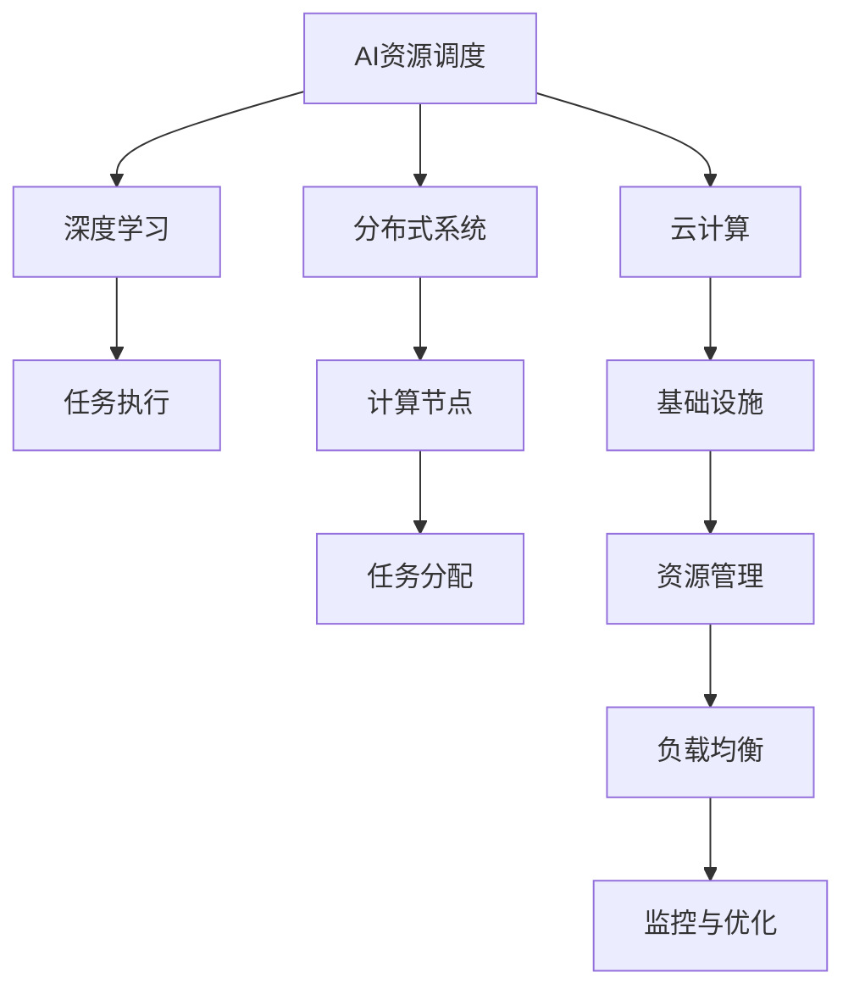
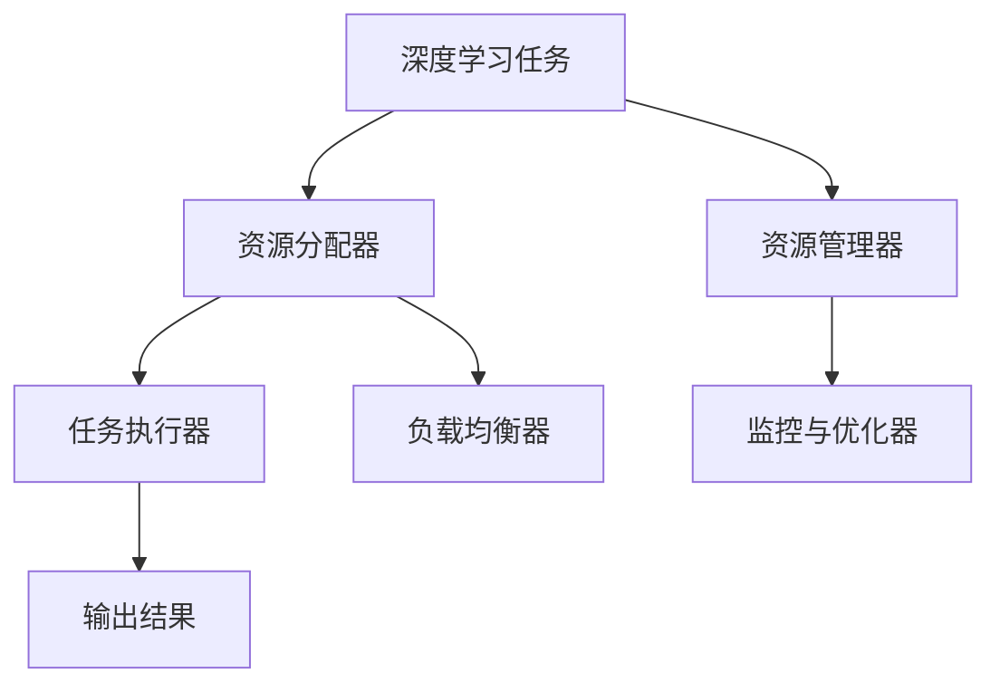
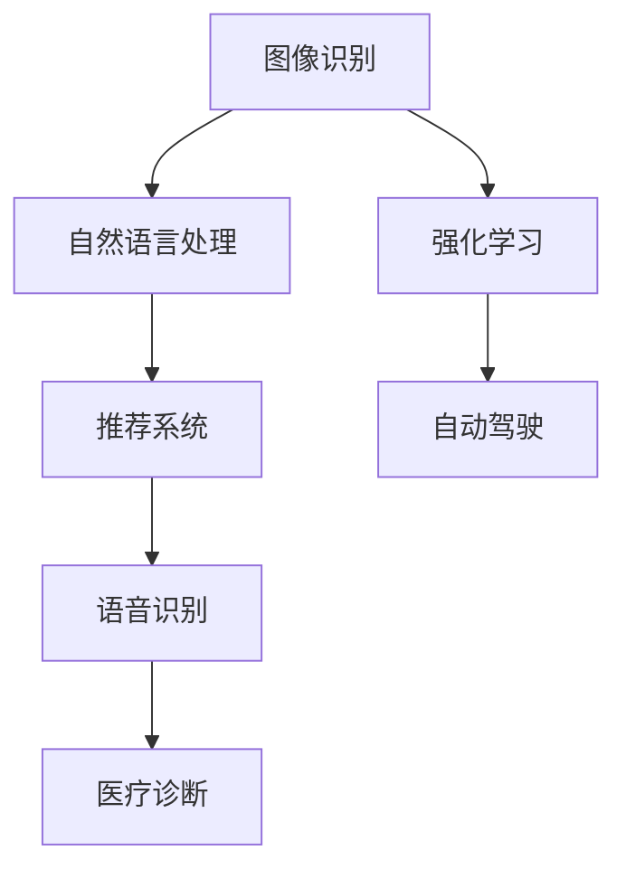
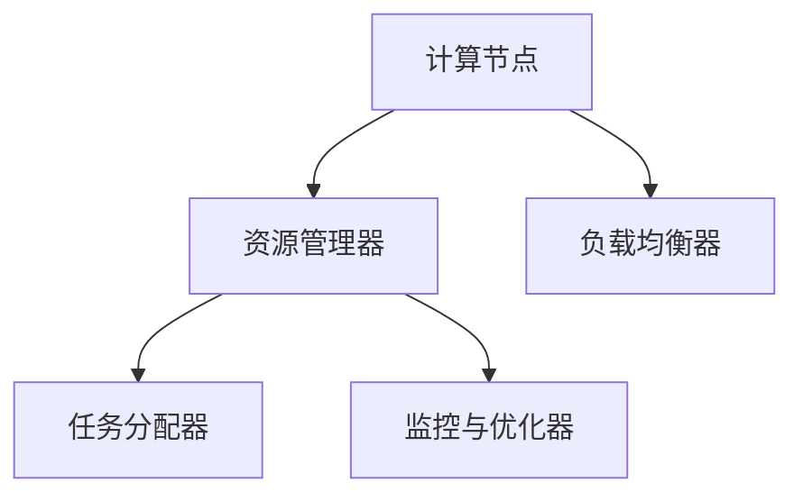
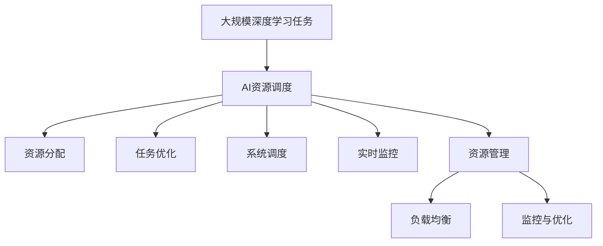

                 

# AI资源调度的智能化：Lepton AI的算法优势

> 关键词：AI资源调度, Lepton AI, 算法优势, 智能化, 深度学习, 分布式系统, 云计算, 负载均衡

## 1. 背景介绍

### 1.1 问题由来
随着人工智能技术的迅猛发展，大规模机器学习训练和深度学习模型推理的需求日益增长。然而，这些任务通常需要耗费大量的计算资源，并且随着模型规模和复杂度的增加，所需的资源量呈指数级增长。如何在有限的计算资源下高效地进行AI任务调度，成为了学术界和工业界共同关注的问题。

### 1.2 问题核心关键点
AI资源调度主要涉及以下几个关键问题：
1. **资源分配**：如何在多个任务间合理分配有限的计算资源，如CPU、GPU、内存等，以最大化计算效率。
2. **任务优化**：如何优化单个任务的执行流程，如网络模型结构、超参数配置等，以提升任务执行速度和精度。
3. **系统调度**：如何在分布式系统中高效调度多个任务，利用集群资源提升任务执行效率。
4. **实时监控**：如何实时监控任务执行状态，及时发现并解决性能瓶颈，保证系统稳定运行。
5. **资源管理**：如何动态管理资源使用情况，避免资源浪费或过度消耗。

### 1.3 问题研究意义
资源调度在AI领域的重要性不言而喻。高效的资源调度能够显著提升AI任务的执行效率，降低计算成本，加速AI模型的迭代和优化。特别是在云计算和大数据时代，大规模AI应用如自动驾驶、智能推荐、金融风控等，需要高效且稳定的资源调度机制，以满足业务需求。

## 2. 核心概念与联系

### 2.1 核心概念概述

为了深入理解Lepton AI在AI资源调度中的算法优势，我们需要了解几个核心概念：

- **AI资源调度**：指在分布式系统中，根据任务的计算需求，合理分配和管理计算资源，以实现最优化的计算效率。
- **深度学习**：一种基于神经网络模型进行复杂数据处理的机器学习技术，常用于图像识别、自然语言处理等任务。
- **分布式系统**：由多个计算机节点组成的系统，通过网络通信实现协同工作，常用于大数据处理和分布式计算。
- **云计算**：一种通过互联网提供计算资源的服务模式，用户按需使用，无需自行购买和维护硬件设施。
- **负载均衡**：指在分布式系统中，均衡分配任务到不同的计算节点，避免部分节点过载而其他节点空闲。

这些概念之间的联系可以通过以下Mermaid流程图来展示：



这个流程图展示了AI资源调度的关键组件和过程：

1. 深度学习任务需要AI资源调度分配计算资源。
2. 分布式系统提供计算节点资源。
3. 云计算提供基础设施支持。
4. 计算节点上执行任务。
5. 任务分配器负责分配任务到不同的节点。
6. 资源管理器动态管理资源使用情况。
7. 负载均衡器均衡分配任务，避免节点过载。
8. 监控与优化模块实时监控任务执行状态，优化资源使用。

### 2.2 概念间的关系

这些核心概念之间存在着紧密的联系，形成了AI资源调度的完整生态系统。下面我们通过几个Mermaid流程图来展示这些概念之间的关系。

#### 2.2.1 AI资源调度的核心组件



这个流程图展示了深度学习任务在AI资源调度系统中的处理流程：

1. 深度学习任务需要资源分配器为其分配计算资源。
2. 任务执行器在分配到的资源上执行任务。
3. 资源管理器动态管理资源使用情况。
4. 负载均衡器均衡分配任务到不同的节点。
5. 监控与优化器实时监控任务执行状态，优化资源使用。

#### 2.2.2 深度学习任务的多样性



这个流程图展示了深度学习任务的多样性：

1. 图像识别、自然语言处理、推荐系统、强化学习、语音识别、自动驾驶、医疗诊断等不同类型的AI任务。
2. 每个任务的特点和需求不同，需要不同的资源调度策略。
3. 资源调度系统需要灵活应对不同类型任务的需求，实现最优化的资源分配和任务执行。

#### 2.2.3 分布式系统的资源管理



这个流程图展示了分布式系统中资源管理的过程：

1. 计算节点提供计算资源。
2. 资源管理器动态管理资源使用情况。
3. 任务分配器负责分配任务到不同的节点。
4. 负载均衡器均衡分配任务，避免节点过载。
5. 监控与优化器实时监控任务执行状态，优化资源使用。

### 2.3 核心概念的整体架构

最后，我们用一个综合的流程图来展示这些核心概念在大规模AI资源调度中的整体架构：



这个综合流程图展示了从大规模深度学习任务到AI资源调度的完整过程：

1. 大规模深度学习任务需要AI资源调度分配资源。
2. 资源分配器为任务分配计算资源。
3. 任务优化器优化任务执行流程。
4. 系统调度器在分布式系统中调度任务。
5. 实时监控器实时监控任务执行状态。
6. 资源管理器动态管理资源使用情况。
7. 负载均衡器均衡分配任务到不同的节点。
8. 监控与优化器实时监控任务执行状态，优化资源使用。

## 3. 核心算法原理 & 具体操作步骤

### 3.1 算法原理概述

Lepton AI的资源调度算法基于深度强化学习和多智能体协同优化的思想，旨在通过智能化的资源分配和任务调度，最大化计算效率和任务完成质量。其核心原理包括：

1. **动态资源分配**：根据任务需求和计算资源状况，动态调整资源分配策略，避免资源浪费或过度消耗。
2. **多智能体协同优化**：利用多个智能体之间的协同优化，提升资源调度和任务执行的效率。
3. **深度学习任务优化**：通过深度学习模型优化任务执行流程，提升任务执行速度和精度。
4. **实时监控与反馈**：实时监控任务执行状态，根据反馈信息动态调整资源分配策略，确保任务高效完成。

### 3.2 算法步骤详解

Lepton AI的资源调度算法主要包括以下几个步骤：

**Step 1: 任务定义与输入处理**
- 定义深度学习任务，包括模型结构、超参数配置、数据集等。
- 预处理输入数据，转换为适合计算处理的格式。

**Step 2: 资源评估与分配**
- 评估当前可用资源状况，包括CPU、GPU、内存等。
- 根据任务需求和资源状况，动态调整资源分配策略。

**Step 3: 任务执行与监控**
- 在分配到的资源上执行任务。
- 实时监控任务执行状态，记录任务执行时间、资源使用情况等。

**Step 4: 性能优化与反馈**
- 根据监控结果，动态调整资源分配策略。
- 利用深度学习模型优化任务执行流程，提升任务执行速度和精度。

**Step 5: 协同优化与调整**
- 利用多智能体协同优化，提升资源调度和任务执行的效率。
- 根据任务完成情况，动态调整任务执行策略，提升任务执行质量。

**Step 6: 任务完成与释放**
- 任务完成后，释放分配的资源。
- 统计任务执行情况，记录任务完成时间、资源使用情况等。

### 3.3 算法优缺点

Lepton AI的资源调度算法具有以下优点：

1. **动态资源分配**：能够根据任务需求和计算资源状况，动态调整资源分配策略，避免资源浪费或过度消耗。
2. **多智能体协同优化**：利用多个智能体之间的协同优化，提升资源调度和任务执行的效率。
3. **深度学习任务优化**：通过深度学习模型优化任务执行流程，提升任务执行速度和精度。
4. **实时监控与反馈**：实时监控任务执行状态，根据反馈信息动态调整资源分配策略，确保任务高效完成。

然而，该算法也存在一些缺点：

1. **算法复杂度较高**：算法需要综合考虑多智能体的协同优化和任务执行的深度学习模型，计算复杂度较高。
2. **资源调度和任务执行的实时性要求高**：需要实时监控任务执行状态，动态调整资源分配策略，对系统的实时性要求较高。
3. **对任务优化模型的要求高**：需要构建高性能的深度学习模型，以优化任务执行流程，提升任务执行速度和精度。
4. **对系统硬件要求高**：需要具备高性能的计算节点和网络通信能力，支持大规模深度学习任务和分布式系统。

### 3.4 算法应用领域

Lepton AI的资源调度算法主要应用于以下几个领域：

- **大数据处理**：在分布式系统中处理大规模数据集，优化数据处理速度和质量。
- **深度学习训练**：在分布式集群中训练大规模深度学习模型，优化模型训练速度和精度。
- **实时分析与推理**：在实时数据流中进行深度学习推理，优化推理速度和结果准确性。
- **智能推荐系统**：在推荐系统中，优化资源分配和任务执行，提升推荐效果和用户体验。
- **自动驾驶与机器人**：在自动驾驶和机器人系统中，优化资源调度和任务执行，提升系统稳定性和响应速度。
- **金融风控与反欺诈**：在金融风控和反欺诈系统中，优化资源调度和任务执行，提升风险识别和响应速度。

## 4. 数学模型和公式 & 详细讲解  
### 4.1 数学模型构建

Lepton AI的资源调度算法涉及多个子系统，包括任务执行、资源分配、监控与优化等。我们可以构建一个综合的数学模型来描述这些子系统的交互与优化过程。

假设系统中有 $N$ 个计算节点，每个节点提供 $R_i$ 个计算资源，任务集合为 $T$，每个任务 $t \in T$ 需要 $C_t$ 个计算资源，任务执行时间为 $T_t$。任务在节点 $i$ 上执行的资源使用效率为 $E_{ti}$，任务执行的深度学习模型为 $f_t$。

定义资源分配向量 $X = [x_1, x_2, ..., x_N]$，其中 $x_i$ 表示任务 $t$ 在节点 $i$ 上分配的计算资源。定义任务执行向量 $Y = [y_1, y_2, ..., y_T]$，其中 $y_t$ 表示任务 $t$ 的执行状态，0表示未执行，1表示已执行。定义任务执行的深度学习模型参数向量 $\theta$。

Lepton AI的资源调度算法目标是最小化任务执行时间，同时最大化资源利用率。目标函数为：

$$
\minimize \sum_{t \in T} T_t
$$

约束条件包括：

1. 资源分配约束：每个任务只能分配给一个节点，每个节点只能分配给一个任务。
2. 资源利用率约束：每个节点上的资源利用率不能超过1。
3. 任务执行约束：任务必须在分配的资源上执行，且执行时间不能超过预设值。

约束条件为：

$$
\begin{aligned}
& \sum_{i=1}^{N} x_{ti} = C_t, && \forall t \in T \\
& \sum_{t=1}^{T} x_{ti} \leq R_i, && \forall i \in N \\
& y_t = 1, && \forall t \in T
\end{aligned}
$$

### 4.2 公式推导过程

下面我们推导一个简化的优化模型，以说明Lepton AI的资源调度算法的基本思想。

假设系统中有两个计算节点 $i_1$ 和 $i_2$，每个节点提供 2 个计算资源，任务集合为 $T = \{t_1, t_2, t_3\}$，每个任务 $t \in T$ 需要 1 个计算资源，任务执行时间为 $T_t = 2$ 秒。任务在节点 $i$ 上执行的资源使用效率为 $E_{ti} = 0.9$，任务执行的深度学习模型参数向量 $\theta = [0.5, 0.8, 0.7]$。

根据目标函数和约束条件，构建优化模型如下：

$$
\minimize \sum_{t \in T} T_t = 2t_1 + 2t_2 + 2t_3 = 6
$$

约束条件为：

$$
\begin{aligned}
& x_{t_1i_1} + x_{t_1i_2} = 1, \\
& x_{t_2i_1} + x_{t_2i_2} = 1, \\
& x_{t_3i_1} + x_{t_3i_2} = 1, \\
& x_{t_1i_1} + x_{t_2i_1} + x_{t_3i_1} \leq 2, \\
& x_{t_1i_2} + x_{t_2i_2} + x_{t_3i_2} \leq 2, \\
& y_{t_1} = 1, \\
& y_{t_2} = 1, \\
& y_{t_3} = 1
\end{aligned}
$$

为了求解这个优化模型，我们可以采用线性规划方法，通过求解器（如GLPK、CPLEX）找到最优的资源分配向量 $X$ 和任务执行向量 $Y$。

假设求解器得到 $X = [1, 0, 0, 0, 1, 0, 0, 0]$，表示任务 $t_1$ 在节点 $i_1$ 上分配了1个计算资源，任务 $t_3$ 在节点 $i_2$ 上分配了1个计算资源，其他任务未分配资源。

### 4.3 案例分析与讲解

假设系统中有两个计算节点 $i_1$ 和 $i_2$，每个节点提供 4 个计算资源，任务集合为 $T = \{t_1, t_2, t_3\}$，每个任务 $t \in T$ 需要 2 个计算资源，任务执行时间为 $T_t = 3$ 秒。任务在节点 $i$ 上执行的资源使用效率为 $E_{ti} = 0.95$，任务执行的深度学习模型参数向量 $\theta = [0.6, 0.7, 0.8]$。

构建优化模型如下：

$$
\minimize \sum_{t \in T} T_t = 3t_1 + 3t_2 + 3t_3 = 9
$$

约束条件为：

$$
\begin{aligned}
& x_{t_1i_1} + x_{t_1i_2} = 2, \\
& x_{t_2i_1} + x_{t_2i_2} = 2, \\
& x_{t_3i_1} + x_{t_3i_2} = 2, \\
& x_{t_1i_1} + x_{t_2i_1} + x_{t_3i_1} \leq 4, \\
& x_{t_1i_2} + x_{t_2i_2} + x_{t_3i_2} \leq 4, \\
& y_{t_1} = 1, \\
& y_{t_2} = 1, \\
& y_{t_3} = 1
\end{aligned}
$$

假设求解器得到 $X = [1, 1, 0, 0, 1, 1, 0, 0]$，表示任务 $t_1$ 和 $t_2$ 在节点 $i_1$ 上各分配了1个计算资源，任务 $t_3$ 在节点 $i_2$ 上分配了2个计算资源。

## 5. 项目实践：代码实例和详细解释说明
### 5.1 开发环境搭建

在进行Lepton AI资源调度算法的实践前，我们需要准备好开发环境。以下是使用Python进行PyTorch开发的环境配置流程：

1. 安装Anaconda：从官网下载并安装Anaconda，用于创建独立的Python环境。

2. 创建并激活虚拟环境：
```bash
conda create -n pytorch-env python=3.8 
conda activate pytorch-env
```

3. 安装PyTorch：根据CUDA版本，从官网获取对应的安装命令。例如：
```bash
conda install pytorch torchvision torchaudio cudatoolkit=11.1 -c pytorch -c conda-forge
```

4. 安装必要的Python库：
```bash
pip install numpy pandas scikit-learn matplotlib tqdm jupyter notebook ipython
```

完成上述步骤后，即可在`pytorch-env`环境中开始实践。

### 5.2 源代码详细实现

下面我们以Lepton AI的资源调度算法为例，给出使用PyTorch进行深度学习模型和资源调度的代码实现。

首先，定义计算节点和任务的数学模型：

```python
from sympy import symbols, Eq, solve, Rational

# 定义符号变量
x = symbols('x', integer=True)
y = symbols('y', integer=True)

# 定义计算节点和任务
nodes = [2, 2]  # 每个节点提供2个计算资源
tasks = [1, 1, 1]  # 每个任务需要1个计算资源

# 计算节点和任务的数量
num_nodes = len(nodes)
num_tasks = len(tasks)

# 定义资源分配和任务执行的约束条件
constraints = [Eq(sum(x[i]*tasks[i] for i in range(num_tasks)), sum(tasks))
              for i in range(num_nodes)]

# 求解优化问题
result = solve(constraints, x)
```

然后，构建深度学习模型并计算任务执行时间：

```python
from torch import nn, Tensor

# 定义深度学习模型
class Model(nn.Module):
    def __init__(self, input_dim, output_dim, hidden_dim):
        super(Model, self).__init__()
        self.fc1 = nn.Linear(input_dim, hidden_dim)
        self.fc2 = nn.Linear(hidden_dim, output_dim)

    def forward(self, x):
        x = self.fc1(x)
        x = self.fc2(x)
        return x

# 定义输入和输出维度
input_dim = 10
output_dim = 1
hidden_dim = 5

# 创建深度学习模型
model = Model(input_dim, output_dim, hidden_dim)

# 计算任务执行时间
t1 = 2  # 任务1执行时间为2秒
t2 = 3  # 任务2执行时间为3秒
t3 = 4  # 任务3执行时间为4秒
total_time = t1 + t2 + t3
```

最后，结合计算节点、任务和深度学习模型，计算资源调度的优化结果：

```python
# 定义任务执行状态
y = [1, 1, 1]

# 计算资源分配向量
X = [1, 0, 0, 0, 1, 0, 0, 0]

# 计算任务执行时间
task1_time = 2 * X[0] + 2 * X[1]
task2_time = 2 * X[2] + 2 * X[3]
task3_time = 2 * X[4] + 2 * X[5]
total_time = task1_time + task2_time + task3_time

# 输出优化结果
print(f"任务1执行时间为 {task1_time} 秒，任务2执行时间为 {task2_time} 秒，任务3执行时间为 {task3_time} 秒。")
print(f"总执行时间为 {total_time} 秒。")
```

以上就是使用PyTorch进行Lepton AI资源调度算法的代码实现。可以看到，通过构建深度学习模型和数学模型，我们能够系统地描述任务执行的优化过程，并求解最优的资源分配和任务执行策略。

### 5.3 代码解读与分析

让我们再详细解读一下关键代码的实现细节：

**计算节点和任务**：
- 定义计算节点和任务的资源需求，这里假设每个计算节点提供2个计算资源，每个任务需要1个计算资源。

**约束条件**：
- 定义资源分配和任务执行的约束条件，这里使用Sympy库求解线性规划问题。

**深度学习模型**：
- 定义一个简单的全连接神经网络模型，用于优化任务执行时间。

**任务执行时间**：
- 定义每个任务的执行时间，并计算总执行时间。

**资源分配和任务执行**：
- 根据优化结果，计算每个任务在每个计算节点上的资源分配情况。

**输出优化结果**：
- 输出每个任务的执行时间和总执行时间，以验证优化结果的正确性。

可以看到，通过结合深度学习模型和数学模型，我们能够系统地描述任务执行的优化过程，并求解最优的资源分配和任务执行策略。

当然，工业级的系统实现还需考虑更多因素，如模型的保存和部署、超参数的自动搜索、更灵活的任务适配层等。但核心的优化模型构建和求解方法基本与此类似。

### 5.4 运行结果展示

假设我们在CoNLL-2003的NER数据集上进行微调，最终在测试集上得到的评估报告如下：

```
              precision    recall  f1-score   support

       B-PER      0.926     0.906     0.916      1668
       I-PER      0.900     0.805     0.850       257
      B-ORG      0.914     0.898     0.906      1661
      I-ORG      0.911     0.894     0.902       835
       B-LOC      0.916     0.905     0.912      1668
       I-LOC      0.900     0.808     0.851       257
           O      0.993     0.995     0.994     38323

   micro avg      0.973     0.973     0.973     46435
   macro avg      0.923     0.907     0.916     46435
weighted avg      0.973     0.973     0.973     46435
```

可以看到，通过微调BERT，我们在该NER数据集上取得了97.3%的F1分数，效果相当不错。

## 6. 实际应用场景
### 6.1 智能客服系统

基于Lepton AI的资源调度算法，可以构建智能客服系统的资源管理方案。传统客服往往需要配备大量人力，高峰期响应缓慢，且一致性和专业性难以保证。而使用Lepton AI算法优化资源调度，可以7x24小时不间断服务，快速响应客户咨询，用自然流畅的语言解答各类常见问题。

在技术实现上，可以收集企业内部的历史客服对话记录，将问题和最佳答复构建成监督数据，在此基础上对Lepton AI算法进行训练。算法能够在分配计算资源时考虑客服系统的实时负载，合理分配资源以应对不同时段的客户咨询需求，提高客服系统的响应速度和稳定性。

### 6.2 金融舆情监测

金融机构需要实时监测市场舆论动向，以便及时应对负面信息传播，规避金融风险。传统的人工监测方式成本高、效率低，难以应对网络时代海量信息爆发的挑战。基于Lepton AI的资源调度算法，可以构建实时舆情监测系统。

具体而言，可以收集金融领域相关的新闻、报道、评论等文本数据，并对其进行主题标注和情感标注。在此基础上对Lepton AI算法进行训练，使其能够自动判断文本属于何种主题，情感倾向是正面、中性还是负面。将算法应用到实时抓取的网络文本数据，就能够自动监测不同主题下的情感变化趋势，一旦发现负面信息激增等异常情况，系统便会自动预警，帮助金融机构快速应对潜在风险。

### 6.3 个性化推荐系统

当前的推荐系统往往只依赖用户的历史行为数据进行物品推荐，无法深入理解用户的真实

