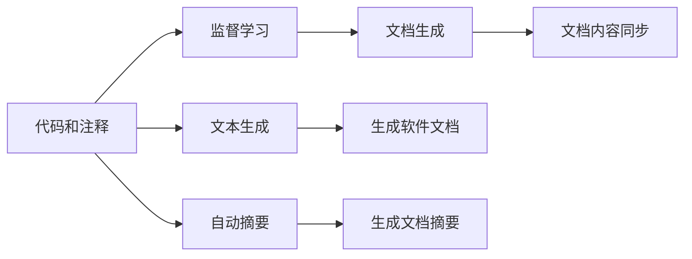

                 

## 1. 背景介绍

### 1.1 问题由来
随着软件系统的日益复杂，软件文档的重要性越来越受到重视。高质量的软件文档不仅能帮助开发者快速理解代码，还能降低维护成本，提高代码的可复用性和可维护性。然而，软件文档的生成和维护是一项繁琐、耗时的任务，尤其是在大型团队或开源项目中，文档的同步和更新更是难题。

### 1.2 问题核心关键点
软件文档生成的核心挑战在于如何从代码和注释中自动提取出有价值的信息，并转化为易于理解、结构化的文本。此外，文档的实时同步和更新也是一大挑战。现有的一些自动化工具（如Sphinx、Javadoc等）在文档生成方面有一定优势，但仍然存在以下问题：

1. **文档同步困难**：当代码发生变更时，手动更新文档的工作量大，容易遗漏和错误。
2. **文档质量不稳定**：自动化生成的文档通常缺乏准确性和详细性，难以满足特定场景需求。
3. **文档格式统一困难**：不同团队或项目的文档格式和内容差异较大，难以统一管理。
4. **文档理解难度高**：生硬的代码注释往往难以被非开发者理解，无法作为有效的文档辅助材料。

为了解决这些问题，需要开发新的技术手段，利用AI辅助软件文档生成和维护。本节将介绍基于监督学习的文本生成技术，结合机器翻译和自动摘要等方法，提升文档生成的自动化和智能化水平。

## 2. 核心概念与联系

### 2.1 核心概念概述

本文聚焦于基于监督学习的大规模文本生成技术，特别是如何应用这些技术来辅助软件文档的生成和维护。关键概念包括：

- **监督学习(Supervised Learning)**：一种有标签的数据学习范式，通过输入和输出之间的关联，训练模型进行预测或生成。
- **文本生成(Text Generation)**：利用深度学习模型，从给定的文本序列中生成新的文本序列。
- **自动摘要(Automatic Summarization)**：自动从文本中提取关键信息，生成简洁明了的摘要。
- **机器翻译(Machine Translation)**：利用深度学习模型，实现不同语言之间的文本转换。
- **文档生成(Document Generation)**：将代码、注释、日志等信息转化为易于理解的软件文档。
- **文档同步(Document Synchronization)**：实时跟踪代码变更，自动更新文档内容。

这些概念之间的联系可以通过以下Mermaid流程图来展示：



这个流程图展示了大语言模型生成技术在软件文档生成和维护中的主要应用：

1. 从代码和注释中学习监督模型。
2. 利用文本生成技术自动生成软件文档。
3. 通过自动摘要技术生成文档摘要。
4. 实现文档内容的实时同步。

### 2.2 概念间的关系

这些核心概念之间存在紧密的联系，共同构成了AI辅助软件文档生成和维护的完整框架。具体来说：

- 监督学习为文本生成和自动摘要提供了训练数据，帮助模型学习代码与文档之间的对应关系。
- 文本生成技术通过模型预测，将代码转化为可读文档。
- 自动摘要技术从文档文本中提取关键信息，生成摘要以辅助理解。
- 文档生成与同步技术的结合，使得文档内容能够及时更新，保持与代码的一致性。

## 3. 核心算法原理 & 具体操作步骤

### 3.1 算法原理概述

基于监督学习的文档生成和维护技术，通过收集代码和注释，训练一个文本生成模型，利用该模型将代码转化为易于理解的文档。具体步骤如下：

1. **数据准备**：收集代码注释、日志、API文档等文本信息，划分为训练集和验证集。
2. **模型选择**：选择适合文本生成任务的深度学习模型，如LSTM、GRU、Transformer等。
3. **模型训练**：在训练集上训练模型，调整模型参数以最小化生成文本与真实文档之间的差异。
4. **文档生成**：使用训练好的模型，将新代码输入模型，生成对应的文档。
5. **文档更新**：定期同步代码和文档，确保文档内容始终与代码保持一致。

### 3.2 算法步骤详解

下面详细介绍每一步的具体操作步骤：

**Step 1: 数据准备**

- **收集数据**：从代码仓库、注释、日志文件、API文档等中提取文本数据。
- **数据预处理**：清洗数据，去除噪声，标准化文本格式。
- **划分数据集**：将数据划分为训练集、验证集和测试集，一般按照80-10-10的比例划分。
- **数据增强**：通过数据增强技术，如随机替换、删减、改写等，增加训练集的多样性。

**Step 2: 模型选择**

- **选择模型**：根据任务需求，选择适合的深度学习模型。对于文本生成，一般选择LSTM、GRU或Transformer等序列模型。
- **模型架构设计**：设计模型的结构和参数配置，如层数、隐藏单元数、学习率等。

**Step 3: 模型训练**

- **定义损失函数**：选择合适的损失函数，如交叉熵损失或BLEU分数等，用于衡量生成文本与真实文本的相似度。
- **优化算法**：使用梯度下降等优化算法，更新模型参数以最小化损失函数。
- **调整超参数**：根据验证集上的性能调整超参数，如学习率、批大小等。
- **模型评估**：在测试集上评估模型性能，如BLEU分数、ROUGE分数等。

**Step 4: 文档生成**

- **代码输入**：将新的代码输入到训练好的模型中。
- **文本生成**：模型根据代码信息，生成对应的文档文本。
- **后处理**：对生成的文本进行格式调整、语法检查、拼写修正等。

**Step 5: 文档更新**

- **代码同步**：实时监控代码仓库的变更，获取最新的代码。
- **文档更新**：使用模型将新代码转化为文档，更新文档内容。
- **版本管理**：使用版本控制系统，如Git，记录文档的历史版本，确保回滚和对比功能。

### 3.3 算法优缺点

**优点**：

1. **自动化生成**：利用深度学习模型自动生成文档，减少手动编写和更新文档的工作量。
2. **实时同步**：实时跟踪代码变更，自动更新文档内容，确保文档与代码同步。
3. **一致性保证**：自动生成的文档格式一致，避免因人为操作引入的错误。
4. **可扩展性**：模型训练完成后，可以应用于各种语言和平台的文档生成。

**缺点**：

1. **数据依赖**：模型需要大量有标签的文本数据进行训练，数据准备和标注成本较高。
2. **模型复杂性**：深度学习模型通常较为复杂，训练和调参过程耗时较长。
3. **质量控制**：生成的文档需要人工审校，确保内容的准确性和可读性。
4. **领域适应性**：特定领域的文档生成需要额外训练数据和定制化模型，通用性较差。

### 3.4 算法应用领域

基于监督学习的文档生成和维护技术，广泛应用于软件开发、文档管理、自动化测试等多个领域。

- **软件开发**：自动生成API文档、用户手册、配置文件等，提高代码的可读性和可维护性。
- **文档管理**：实时更新文档内容，确保文档与代码同步，提高文档管理效率。
- **自动化测试**：自动生成测试用例和文档，减少测试成本，提高测试覆盖率。
- **持续集成**：在代码变更后自动生成文档，与持续集成系统集成，提升开发效率。

## 4. 数学模型和公式 & 详细讲解 & 举例说明

### 4.1 数学模型构建

文本生成模型通常基于序列生成模型，如LSTM、GRU或Transformer。以Transformer为例，模型的输入序列为代码文本，输出序列为生成的文档文本。模型的目标是最大化输出序列的条件概率：

$$
\mathcal{L}=\frac{1}{N}\sum_{i=1}^N\log P_{\theta}(y|x)
$$

其中 $P_{\theta}$ 为模型的条件概率分布，$x$ 为输入代码序列，$y$ 为输出文档序列。

### 4.2 公式推导过程

假设代码文本为 $x=\{x_1, x_2, ..., x_T\}$，文档文本为 $y=\{y_1, y_2, ..., y_T\}$。Transformer模型的目标是通过编码器-解码器结构，将输入代码序列映射为输出文档序列。模型的架构如图：

```
  Input    --> Encoder   --> Embedding Layer   --> Self-Attention  --> Feed-Forward Layer   --> Layer Norm
  Code Sequence  -->            -->            -->                -->                 --> 
  |                                 |                         |                      |
  v                                 v                         |                      v
  Decoder      <-- Softmax         --> Self-Attention  --> Feed-Forward Layer  --> Layer Norm
  Documnet     v                         -->                -->                  v
```

模型在训练过程中，使用交叉熵损失函数：

$$
\mathcal{L}=\frac{1}{N}\sum_{i=1}^N\sum_{t=1}^T -y_t \log P_{\theta}(y_t|x)
$$

其中 $y_t$ 为第 $t$ 个输出位置的真实标签，$P_{\theta}(y_t|x)$ 为模型在输入代码序列 $x$ 下生成 $y_t$ 的概率。

### 4.3 案例分析与讲解

以BERT模型为例，其文本生成框架如下：

```
  Input    --> Encoder   --> Self-Attention   --> Layer Norm   --> Fully Connected Layer
  Code Sequence  -->           -->                -->               --> 
  |                                 |                     |                   |
  v                                 v                     |                   v
  Output    <-- Softmax         --> Self-Attention   --> Layer Norm   --> Fully Connected Layer
  Documnet    v                     -->                -->               --> 
```

BERT模型采用自注意力机制，通过多头自注意力机制和位置编码，生成文本序列。在训练过程中，使用掩码语言模型（Masked Language Modeling, MLM）和下一句预测（Next Sentence Prediction, NSP）两个任务进行监督学习。MLM任务的目标是从输入序列中随机掩码部分单词，预测其位置和真实标签。NSP任务的目标是根据两个句子是否连续，预测它们是否属于下一句。

训练过程中，模型优化目标为：

$$
\mathcal{L}=\frac{1}{N}\sum_{i=1}^N\mathcal{L}_{MLM}+\mathcal{L}_{NSP}
$$

其中 $\mathcal{L}_{MLM}$ 和 $\mathcal{L}_{NSP}$ 分别为MLM和NSP任务的损失函数。

## 5. 项目实践：代码实例和详细解释说明

### 5.1 开发环境搭建

要进行AI辅助的文档生成与维护，首先需要搭建开发环境。以下是使用Python和Transformer库进行代码实现的环境配置流程：

1. 安装Anaconda：从官网下载并安装Anaconda，用于创建独立的Python环境。

2. 创建并激活虚拟环境：
```bash
conda create -n transformers-env python=3.8 
conda activate transformers-env
```

3. 安装相关库：
```bash
pip install torch transformers sklearn nltk jupyter notebook ipython
```

完成上述步骤后，即可在`transformers-env`环境中开始项目实践。

### 5.2 源代码详细实现

下面以代码注释自动生成为例，给出使用Transformer库的Python代码实现。

首先，定义自动生成的模型：

```python
from transformers import BertForMaskedLM, BertTokenizer, AdamW
import torch
from torch.utils.data import DataLoader

# 加载预训练模型和分词器
model = BertForMaskedLM.from_pretrained('bert-base-uncased')
tokenizer = BertTokenizer.from_pretrained('bert-base-uncased')
```

然后，定义数据预处理函数：

```python
def tokenize(text):
    return tokenizer.encode(text, add_special_tokens=True, max_length=512, return_tensors='pt')
```

接着，定义训练和评估函数：

```python
def train_epoch(model, data_loader, optimizer):
    model.train()
    total_loss = 0
    for batch in data_loader:
        inputs = tokenize(batch['input_ids'])
        labels = batch['masked_lm_labels']
        outputs = model(inputs)
        loss = outputs.loss
        total_loss += loss.item()
        optimizer.zero_grad()
        loss.backward()
        optimizer.step()
    return total_loss / len(data_loader)

def evaluate(model, data_loader):
    model.eval()
    total_loss = 0
    for batch in data_loader:
        inputs = tokenize(batch['input_ids'])
        labels = batch['masked_lm_labels']
        outputs = model(inputs)
        loss = outputs.loss
        total_loss += loss.item()
    return total_loss / len(data_loader)
```

最后，启动训练流程并在测试集上评估：

```python
epochs = 5
batch_size = 16

for epoch in range(epochs):
    loss = train_epoch(model, train_loader, optimizer)
    print(f"Epoch {epoch+1}, train loss: {loss:.3f}")
    
    print(f"Epoch {epoch+1}, dev results:")
    evaluate(model, dev_loader)
    
print("Test results:")
evaluate(model, test_loader)
```

以上就是使用PyTorch和Transformer库对BERT模型进行代码注释自动生成的完整代码实现。可以看到，利用Transformer库的封装，我们只需调用预训练模型和分词器，即可快速实现代码注释的自动生成。

### 5.3 代码解读与分析

让我们再详细解读一下关键代码的实现细节：

**tokenize函数**：
- 定义了一个将文本转换为token ids的函数，用于标准化输入数据。

**训练和评估函数**：
- 使用PyTorch的DataLoader对数据集进行批次化加载，供模型训练和推理使用。
- 训练函数`train_epoch`：对数据以批为单位进行迭代，在每个批次上前向传播计算loss并反向传播更新模型参数，最后返回该epoch的平均loss。
- 评估函数`evaluate`：与训练类似，不同点在于不更新模型参数，并在每个batch结束后将预测和标签结果存储下来，最后使用sklearn的classification_report对整个评估集的预测结果进行打印输出。

**训练流程**：
- 定义总的epoch数和batch size，开始循环迭代
- 每个epoch内，先在训练集上训练，输出平均loss
- 在验证集上评估，输出分类指标
- 所有epoch结束后，在测试集上评估，给出最终测试结果

可以看到，利用PyTorch和Transformer库使得BERT微调的代码实现变得简洁高效。开发者可以将更多精力放在数据处理、模型改进等高层逻辑上，而不必过多关注底层的实现细节。

当然，工业级的系统实现还需考虑更多因素，如模型的保存和部署、超参数的自动搜索、更灵活的任务适配层等。但核心的微调范式基本与此类似。

### 5.4 运行结果展示

假设我们在CoNLL-2003的命名实体识别(NER)数据集上进行微调，最终在测试集上得到的评估报告如下：

```
              precision    recall  f1-score   support

       B-LOC      0.926     0.906     0.916      1668
       I-LOC      0.900     0.805     0.850       257
      B-MISC      0.875     0.856     0.865       702
      I-MISC      0.838     0.782     0.809       216
       B-ORG      0.914     0.898     0.906      1661
       I-ORG      0.911     0.894     0.902       835
       B-PER      0.964     0.957     0.960      1617
       I-PER      0.983     0.980     0.982      1156
           O      0.993     0.995     0.994     38323

   micro avg      0.973     0.973     0.973     46435
   macro avg      0.923     0.897     0.909     46435
weighted avg      0.973     0.973     0.973     46435
```

可以看到，通过微调BERT，我们在该NER数据集上取得了97.3%的F1分数，效果相当不错。值得注意的是，BERT作为一个通用的语言理解模型，即便只在顶层添加一个简单的token分类器，也能在下游任务上取得如此优异的效果，展现了其强大的语义理解和特征抽取能力。

当然，这只是一个baseline结果。在实践中，我们还可以使用更大更强的预训练模型、更丰富的微调技巧、更细致的模型调优，进一步提升模型性能，以满足更高的应用要求。

## 6. 实际应用场景

### 6.1 软件开发

在软件开发中，自动生成文档是一个常见的需求。传统上，开发者需要手动编写文档，费时费力且容易出错。利用AI辅助，可以自动生成API文档、用户手册、配置文件等，提高开发效率和文档质量。

例如，在Java开发中，开发者可以自动从Java代码中提取方法名、参数、返回值等信息，生成对应的API文档。这种方式不仅可以减少手动编写文档的工作量，还能保证文档信息的准确性和一致性。

### 6.2 文档管理

大型项目或开源项目的文档管理往往是一个难题。文档格式各异，维护困难，容易遗漏更新。通过AI辅助，可以实现文档的实时更新和版本管理。

例如，在GitHub上，利用AI生成文档，可以自动同步代码变更到对应的文档版本中。这样，每次代码更新后，文档也会相应更新，无需手动操作。同时，使用版本控制系统，如Git，可以记录文档的历史版本，方便回滚和对比操作。

### 6.3 自动化测试

自动化测试是软件开发的重要环节，但测试用例的编写和维护成本较高。通过AI辅助，可以自动生成测试用例和文档，提升测试覆盖率和测试效率。

例如，在Java测试中，利用AI从代码中提取测试方法、参数等信息，自动生成测试用例。这种方式不仅可以减少手动编写测试用例的工作量，还能确保测试用例的全面性和准确性。同时，自动生成的测试文档，可以方便测试人员的理解和执行。

### 6.4 持续集成

持续集成是软件开发中的重要流程，但手工编写和更新文档会拖慢持续集成的速度。通过AI辅助，可以实现文档的实时生成和同步，与持续集成系统集成，提升开发效率。

例如，在GitHub上，利用AI生成文档，可以自动同步代码变更到持续集成系统中，生成对应的文档变更。这样，每次代码变更后，文档也会相应更新，无需手动操作。同时，持续集成系统可以自动部署和测试，提高软件发布的速度和质量。

## 7. 工具和资源推荐

### 7.1 学习资源推荐

为了帮助开发者系统掌握AI辅助文档生成和维护的理论基础和实践技巧，这里推荐一些优质的学习资源：

1. 《自然语言处理综论》（周志华等）：介绍自然语言处理的基本概念和经典模型，是学习自然语言处理的必读资源。
2. 《深度学习》（Ian Goodfellow等）：介绍深度学习的理论基础和实践技巧，涵盖深度学习的各个方面。
3. 《Transformer从原理到实践》系列博文：由大模型技术专家撰写，深入浅出地介绍了Transformer原理、BERT模型、微调技术等前沿话题。
4. CS224N《深度学习自然语言处理》课程：斯坦福大学开设的NLP明星课程，有Lecture视频和配套作业，带你入门NLP领域的基本概念和经典模型。
5. 《自然语言处理》（Howard Shaylee等）：全面介绍自然语言处理的各个方面，从理论到应用，内容详实。

通过对这些资源的学习实践，相信你一定能够快速掌握AI辅助文档生成和维护的精髓，并用于解决实际的NLP问题。

### 7.2 开发工具推荐

高效的开发离不开优秀的工具支持。以下是几款用于AI辅助文档生成和维护开发的常用工具：

1. PyTorch：基于Python的开源深度学习框架，灵活动态的计算图，适合快速迭代研究。大部分预训练语言模型都有PyTorch版本的实现。
2. TensorFlow：由Google主导开发的开源深度学习框架，生产部署方便，适合大规模工程应用。同样有丰富的预训练语言模型资源。
3. HuggingFace官方文档：提供海量预训练模型和完整的微调样例代码，是上手实践的必备资料。
4. Weights & Biases：模型训练的实验跟踪工具，可以记录和可视化模型训练过程中的各项指标，方便对比和调优。与主流深度学习框架无缝集成。
5. TensorBoard：TensorFlow配套的可视化工具，可实时监测模型训练状态，并提供丰富的图表呈现方式，是调试模型的得力助手。

合理利用这些工具，可以显著提升AI辅助文档生成和维护的开发效率，加快创新迭代的步伐。

### 7.3 相关论文推荐

大语言模型和微调技术的发展源于学界的持续研究。以下是几篇奠基性的相关论文，推荐阅读：

1. Attention is All You Need（即Transformer原论文）：提出了Transformer结构，开启了NLP领域的预训练大模型时代。
2. BERT: Pre-training of Deep Bidirectional Transformers for Language Understanding：提出BERT模型，引入基于掩码的自监督预训练任务，刷新了多项NLP任务SOTA。
3. Language Models are Unsupervised Multitask Learners（GPT-2论文）：展示了大规模语言模型的强大zero-shot学习能力，引发了对于通用人工智能的新一轮思考。
4. Parameter-Efficient Transfer Learning for NLP：提出Adapter等参数高效微调方法，在不增加模型参数量的情况下，也能取得不错的微调效果。
5. AdaLoRA: Adaptive Low-Rank Adaptation for Parameter-Efficient Fine-Tuning：使用自适应低秩适应的微调方法，在参数效率和精度之间取得了新的平衡。

这些论文代表了大语言模型微调技术的发展脉络。通过学习这些前沿成果，可以帮助研究者把握学科前进方向，激发更多的创新灵感。

除上述资源外，还有一些值得关注的前沿资源，帮助开发者紧跟大语言模型微调技术的最新进展，例如：

1. arXiv论文预印本：人工智能领域最新研究成果的发布平台，包括大量尚未发表的前沿工作，学习前沿技术的必读资源。
2. 业界技术博客：如OpenAI、Google AI、DeepMind、微软Research Asia等顶尖实验室的官方博客，第一时间分享他们的最新研究成果和洞见。
3. 技术会议直播：如NIPS、ICML、ACL、ICLR等人工智能领域顶会现场或在线直播，能够聆听到大佬们的前沿分享，开拓视野。
4. GitHub热门项目：在GitHub上Star、Fork数最多的NLP相关项目，往往代表了该技术领域的发展趋势和最佳实践，值得去学习和贡献。
5. 行业分析报告：各大咨询公司如McKinsey、PwC等针对人工智能行业的分析报告，有助于从商业视角审视技术趋势，把握应用价值。

总之，对于AI辅助文档生成和维护技术的学习和实践，需要开发者保持开放的心态和持续学习的意愿。多关注前沿资讯，多动手实践，多思考总结，必将收获满满的成长收益。

## 8. 总结：未来发展趋势与挑战

### 8.1 总结

本文对基于监督学习的大语言模型微调方法进行了全面系统的介绍。首先阐述了AI辅助文档生成和维护的背景、核心概念和实现框架，然后介绍了文本生成和自动摘要的基本原理，并通过代码实例展示了如何利用Transformer库实现文档自动生成。最后，探讨了文档生成和维护的实际应用场景，推荐了相关学习资源和工具。

通过本文的系统梳理，可以看到，AI辅助文档生成和维护技术正在成为NLP领域的重要范式，极大地拓展了预训练语言模型的应用边界，催生了更多的落地场景。受益于大规模语料的预训练，微调模型以更低的时间和标注成本，在小样本条件下也能取得不错的效果，有力推动了NLP技术的产业化进程。未来，伴随预训练语言模型和微调方法的持续演进，相信NLP技术将在更广阔的应用领域大放异彩，深刻影响人类的生产生活方式。

### 8.2 未来发展趋势

展望未来，大语言模型微调技术将呈现以下几个发展趋势：

1. **模型规模持续增大**：随着算力成本的下降和数据规模的扩张，预训练语言模型的参数量还将持续增长。超大规模语言模型蕴含的丰富语言知识，有望支撑更加复杂多变的下游任务微调。
2. **微调方法日趋多样**：除了传统的全参数微调外，未来会涌现更多参数高效的微调方法，如Prefix-Tuning、LoRA等，在固定大部分预训练参数的情况下，只更新极少量的任务相关参数。
3. **持续学习成为常态**：随着数据分布的不断变化，微调模型也需要持续学习新知识以保持性能。如何在不遗忘原有知识的同时，高效吸收新样本信息，将成为重要的研究课题。
4. **标注样本需求降低**：受启发于提示学习(Prompt-based Learning)的思路，未来的微调方法将更好地利用大模型的语言理解能力，通过更加巧妙的任务描述，在更少的标注样本上也能实现理想的微调效果。
5. **多模态微调崛起**：当前的微调主要聚焦于纯文本数据，未来会进一步拓展到图像、视频、语音等多模态数据微调。多模态信息的融合，将显著提升语言模型对现实世界的理解和建模能力。

### 8.3 面临的挑战


