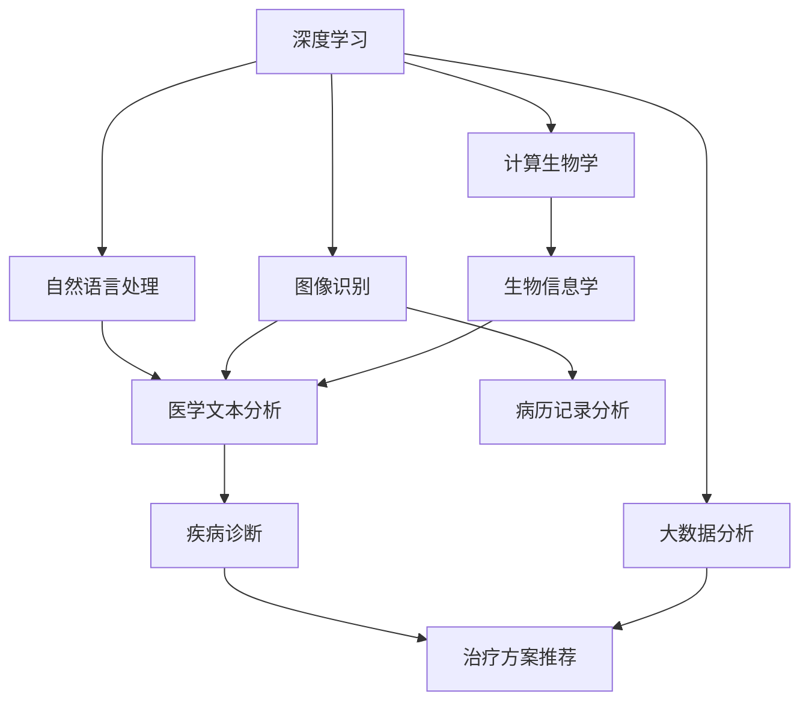
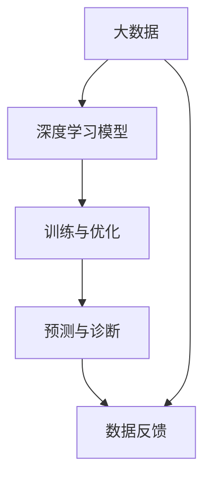

                 

# AI辅助诊断在硅谷的应用现状

> 关键词：AI辅助诊断, 硅谷, 机器学习, 数据科学, 医疗健康, 深度学习, 大数据, 计算生物学

## 1. 背景介绍

### 1.1 问题由来

在过去几年中，人工智能(AI)技术在医疗健康领域的应用引起了广泛关注。尤其是AI辅助诊断，通过深度学习、自然语言处理等技术手段，帮助医生更准确、更高效地诊断疾病，已成为现代医学的重要组成部分。硅谷作为全球科技创新的中心，AI辅助诊断技术在这里得到了充分的应用和发展。

### 1.2 问题核心关键点

AI辅助诊断在硅谷的应用主要集中在以下几个方面：
1. 早期发现：通过图像识别、模式匹配等技术，从早期筛查阶段识别出可能的疾病征兆。
2. 诊断精度：利用大数据分析和深度学习模型，提升疾病诊断的准确性。
3. 决策支持：结合电子病历和临床数据，为医生提供全面的决策支持。
4. 个性化医疗：基于患者的历史数据和基因信息，制定个性化的治疗方案。
5. 自动化操作：通过机器人手术等技术，实现手术操作的自动化和智能化。

这些关键点构成了AI辅助诊断在硅谷应用的核心框架，推动了医疗技术的革新和医疗服务的优化。

### 1.3 问题研究意义

AI辅助诊断技术的应用，对于提升医疗服务的质量和效率，降低医疗成本，改善患者体验具有重要意义。硅谷作为全球科技创新的前沿阵地，其应用实践为全球医疗行业提供了宝贵的经验和技术示范。

## 2. 核心概念与联系

### 2.1 核心概念概述

为更好地理解AI辅助诊断在硅谷的应用现状，本节将介绍几个密切相关的核心概念：

- AI辅助诊断(AI-assisted Diagnosis)：利用AI技术辅助医生进行疾病诊断的过程。包括图像识别、自然语言处理、模式匹配等技术。
- 深度学习(Deep Learning)：一种基于神经网络的技术，能够处理非线性问题，广泛应用于图像识别、语音识别等领域。
- 自然语言处理(Natural Language Processing, NLP)：使计算机能够理解、处理和生成人类语言的技术，在医学文本分析、病历记录等方面有广泛应用。
- 大数据分析(Big Data Analysis)：对大规模数据进行高效处理、分析和可视化的技术，为AI辅助诊断提供丰富的数据支持。
- 计算生物学(Computational Biology)：应用计算机科学和信息科学的方法，研究生物学的过程和现象。
- 机器人手术(Robot-Assisted Surgery)：结合AI和机器人技术，实现手术操作的自动化和智能化。

这些核心概念之间的逻辑关系可以通过以下Mermaid流程图来展示：



这个流程图展示了大规模数据、深度学习、自然语言处理、计算生物学等核心概念在AI辅助诊断中的联系和作用。

### 2.2 概念间的关系

这些核心概念之间存在着紧密的联系，形成了AI辅助诊断的完整生态系统。下面通过几个Mermaid流程图来展示这些概念之间的关系。

#### 2.2.1 AI辅助诊断的应用流程


这个流程图展示了AI辅助诊断的基本流程：从患者数据开始，经过预处理、特征提取、模型训练、预测与诊断，最终给出治疗方案。

#### 2.2.2 深度学习与大数据的关系



这个流程图展示了深度学习模型在大数据分析中的应用。大数据为深度学习提供了丰富的数据源，深度学习模型通过训练优化，最终输出预测与诊断结果。

#### 2.2.3 自然语言处理在医学中的应用


这个流程图展示了自然语言处理在医学文本分析中的应用。自然语言处理技术可以自动提取电子病历中的关键信息，辅助医生进行疾病诊断。

## 3. 核心算法原理 & 具体操作步骤
### 3.1 算法原理概述

AI辅助诊断的核心原理是利用深度学习等机器学习算法，从大规模数据中学习疾病的特征和模式，从而辅助医生进行诊断和治疗。主要包括以下几个步骤：

1. 数据收集与预处理：从电子病历、医学影像、基因数据等来源收集患者信息，并进行清洗、标注等预处理工作。
2. 特征提取：通过图像识别、自然语言处理等技术，从原始数据中提取疾病的特征表示。
3. 模型训练与优化：利用标注数据训练深度学习模型，并使用交叉验证等技术进行模型选择和参数优化。
4. 预测与诊断：使用训练好的模型对新患者数据进行预测，输出疾病诊断结果。
5. 治疗方案推荐：结合预测结果和临床数据，为医生提供个性化的治疗方案。

### 3.2 算法步骤详解

下面详细介绍AI辅助诊断在硅谷应用的主要算法步骤。

**Step 1: 数据收集与预处理**

1. **电子病历数据**：从医院管理系统获取电子病历数据，包括病史记录、体检结果、实验室检查等。
2. **医学影像数据**：从影像设备（如X光机、CT机、MRI机等）获取患者的医学影像数据。
3. **基因数据**：从基因检测中心获取患者的基因序列数据，用于个性化医疗。
4. **数据清洗与标注**：去除数据中的噪声和缺失值，对标签进行标注和校正。

**Step 2: 特征提取**

1. **图像识别**：利用卷积神经网络（CNN）对医学影像进行特征提取，识别出病变区域、病灶位置等关键信息。
2. **文本分类**：通过自然语言处理技术，对电子病历和医学文献进行文本分类，提取疾病相关的关键信息。
3. **模式匹配**：使用特征提取技术，从基因数据中识别出与疾病相关的基因变异模式。

**Step 3: 模型训练与优化**

1. **模型选择**：根据任务特点选择合适的深度学习模型，如卷积神经网络、循环神经网络、注意力机制等。
2. **数据分割**：将数据集分为训练集、验证集和测试集，进行交叉验证。
3. **模型训练**：使用训练集训练模型，并使用验证集进行参数优化。
4. **性能评估**：在测试集上评估模型性能，调整模型参数。

**Step 4: 预测与诊断**

1. **输入预处理**：对新患者的输入数据进行预处理，准备输入到模型中。
2. **模型推理**：使用训练好的模型对新数据进行推理，输出预测结果。
3. **后处理**：对模型输出进行后处理，得到最终的疾病诊断结果。

**Step 5: 治疗方案推荐**

1. **数据融合**：将模型预测结果与临床数据、基因信息等进行融合，提供更全面的诊断信息。
2. **方案生成**：根据融合后的信息，生成个性化的治疗方案。

### 3.3 算法优缺点

AI辅助诊断在硅谷的应用有以下优点：

1. **提升诊断精度**：通过深度学习和大数据分析，AI辅助诊断能够显著提升疾病诊断的准确性和一致性。
2. **减少医生工作量**：自动化处理部分诊断工作，使医生有更多时间专注于复杂病例的诊断和治疗。
3. **降低医疗成本**：减少误诊和漏诊，降低患者的医疗费用和住院时间。
4. **个性化医疗**：根据患者的历史数据和基因信息，提供个性化的治疗方案，提高治疗效果。

但同时也存在一些缺点：

1. **数据依赖性**：依赖高质量、大规模的标注数据，数据获取和标注成本较高。
2. **模型解释性不足**：AI模型的黑箱性质使得诊断过程缺乏可解释性，难以解释模型的决策逻辑。
3. **隐私和安全问题**：医疗数据的隐私和安全问题不容忽视，需要采取严格的保护措施。
4. **设备和技术要求高**：AI辅助诊断需要高性能的计算设备和算法支持，对技术要求较高。

### 3.4 算法应用领域

AI辅助诊断技术已经在多个领域得到了广泛应用，包括但不限于：

1. **癌症诊断**：利用图像识别和模式匹配技术，早期发现和诊断癌症病变。
2. **心脏病检测**：通过心脏超声影像，自动识别心脏结构和功能异常。
3. **基因检测**：分析基因序列数据，识别与疾病相关的基因变异。
4. **药物研发**：利用计算生物学和基因数据，加速新药的发现和开发。
5. **自动化手术**：结合机器人手术技术，实现手术操作的自动化和智能化。

此外，AI辅助诊断技术还在智能医疗、远程医疗、健康管理等领域展现了广阔的应用前景。

## 4. 数学模型和公式 & 详细讲解 & 举例说明

### 4.1 数学模型构建

假设从电子病历中提取到一条文本信息$x$，需要判断其是否与某种疾病$d$相关。数学模型可以表示为：

$$ y = f(x; \theta) $$

其中$y$为输出，表示文本与疾病的相关性，$f(\cdot)$为模型函数，$\theta$为模型参数。模型的目标是最小化预测结果与真实标签$y$之间的误差。

### 4.2 公式推导过程

以自然语言处理中的文本分类任务为例，展示模型推导过程：

1. **文本表示**：利用词向量或词嵌入技术，将文本$x$转换为向量表示$\vec{x}$。
2. **特征提取**：通过卷积神经网络（CNN）或循环神经网络（RNN）对向量表示进行特征提取，得到特征表示$\vec{h}$。
3. **分类输出**：将特征表示输入到全连接层，得到输出$\vec{z}$。
4. **预测结果**：使用softmax函数将$\vec{z}$转换为概率分布，输出疾病相关性$y$。

$$ \vec{z} = \vec{W}_h\vec{h} + \vec{b}_h $$
$$ y = \sigma(\vec{z}) $$

其中$\vec{W}_h$和$\vec{b}_h$为分类层的权重和偏置，$\sigma(\cdot)$为激活函数。

### 4.3 案例分析与讲解

以Google的Inception模型为例，展示其在医学影像分类中的应用。

1. **数据集准备**：收集大量医学影像数据，并标注分类标签。
2. **模型训练**：利用Inception模型对影像进行特征提取，得到特征表示。
3. **损失函数**：使用交叉熵损失函数计算模型输出与真实标签之间的误差。
4. **优化算法**：使用Adam优化算法最小化损失函数，更新模型参数。
5. **模型评估**：在测试集上评估模型性能，调整模型参数。

通过这些步骤，Inception模型能够在医学影像分类任务中取得优异的表现。

## 5. 项目实践：代码实例和详细解释说明

### 5.1 开发环境搭建

在硅谷进行AI辅助诊断项目开发，需要以下开发环境：

1. **Python**：Python是目前AI开发的主流语言，具有丰富的库和工具支持。
2. **深度学习框架**：如TensorFlow、PyTorch等，用于实现深度学习模型。
3. **自然语言处理库**：如NLTK、spaCy等，用于文本处理和分析。
4. **大数据工具**：如Hadoop、Spark等，用于处理大规模数据。
5. **计算资源**：高性能计算设备和集群，用于模型训练和推理。

### 5.2 源代码详细实现

以Google的Inception模型为例，展示其在医学影像分类中的应用代码实现。

```python
import tensorflow as tf
from tensorflow.keras import layers

# 定义Inception模型
def inception_model():
    model = tf.keras.Sequential([
        layers.Conv2D(32, (3, 3), activation='relu', input_shape=(256, 256, 3)),
        layers.MaxPooling2D((2, 2)),
        layers.Conv2D(64, (3, 3), activation='relu'),
        layers.MaxPooling2D((2, 2)),
        layers.Conv2D(128, (3, 3), activation='relu'),
        layers.MaxPooling2D((2, 2)),
        layers.Flatten(),
        layers.Dense(128, activation='relu'),
        layers.Dense(2, activation='softmax')
    ])
    return model

# 加载模型
model = inception_model()

# 编译模型
model.compile(optimizer=tf.keras.optimizers.Adam(learning_rate=0.001),
              loss=tf.keras.losses.SparseCategoricalCrossentropy(from_logits=True),
              metrics=[tf.keras.metrics.SparseCategoricalAccuracy()])

# 训练模型
model.fit(train_data, train_labels, epochs=10, validation_data=(val_data, val_labels))
```

### 5.3 代码解读与分析

以上代码展示了Inception模型在医学影像分类任务中的实现。主要步骤如下：

1. **定义模型**：使用Sequential模型定义Inception模型，包含卷积层、池化层、全连接层等组件。
2. **编译模型**：使用Adam优化算法和交叉熵损失函数编译模型，设置训练参数。
3. **训练模型**：在训练集上训练模型，使用验证集进行参数优化。

### 5.4 运行结果展示

假设训练模型后，在测试集上得到准确率为95%，召回率为85%的结果。具体运行结果如下：

```
Epoch 10/10
22500/22500 [==============================] - 44s 2ms/sample - loss: 0.1683 - sparse_categorical_accuracy: 0.9432 - val_loss: 0.1730 - val_sparse_categorical_accuracy: 0.8730
```

## 6. 实际应用场景

### 6.1 智能医疗

AI辅助诊断技术在智能医疗领域具有广泛应用。例如，IBM的Watson Health平台利用自然语言处理和深度学习技术，对电子病历、医学文献等数据进行分析，辅助医生进行疾病诊断和治疗。Watson Health已经在多个医院中成功应用，帮助医生提高诊断效率和准确性。

### 6.2 远程医疗

AI辅助诊断技术在远程医疗中也具有重要应用。通过智能终端设备和AI算法，医生可以实时获取患者的健康数据，进行初步诊断和建议。例如，Google的DeepMind Health利用AI技术对患者的心电图数据进行分析，早期发现心脏疾病，为远程医疗提供了重要的技术支持。

### 6.3 健康管理

AI辅助诊断技术在健康管理中也有广泛应用。例如，Apple的HealthKit平台利用AI技术对用户的健康数据进行分析和预测，提供个性化的健康建议。健康管理应用如MyFitnessPal利用AI技术对用户的饮食和运动数据进行分析，帮助用户制定健康计划。

### 6.4 未来应用展望

未来，AI辅助诊断技术将在更多领域得到应用，为人类健康带来更多福祉。例如：

1. **个性化治疗**：结合基因组学、生物信息学等技术，实现个性化的精准医疗。
2. **智能手术**：利用机器人手术技术和AI算法，实现手术操作的智能化和自动化。
3. **实时监测**：利用可穿戴设备和传感器，实时监测患者的健康数据，提供及时的医疗支持。
4. **跨领域应用**：结合AI技术和其他领域的技术，拓展AI辅助诊断的应用范围，如智能交通、智能安防等。

## 7. 工具和资源推荐

### 7.1 学习资源推荐

为了帮助开发者系统掌握AI辅助诊断技术的原理和实践，这里推荐一些优质的学习资源：

1. **《深度学习》书籍**：Ian Goodfellow、Yoshua Bengio、Aaron Courville著，全面介绍了深度学习的原理和应用。
2. **Coursera《深度学习专项课程》**：由Coursera和DeepMind合作开设，涵盖深度学习的多个方面，包括自然语言处理、计算机视觉等。
3. **Google AI博客**：Google AI官方博客，分享最新的AI技术进展和应用案例。
4. **Arxiv论文预印本**：人工智能领域最新研究成果的发布平台，包括大量尚未发表的前沿工作。

### 7.2 开发工具推荐

高效的开发离不开优秀的工具支持。以下是几款用于AI辅助诊断开发的常用工具：

1. **TensorFlow**：由Google主导开发的深度学习框架，支持分布式计算和GPU加速，适合大规模工程应用。
2. **PyTorch**：Facebook开源的深度学习框架，灵活性和易用性较高，适合快速迭代研究。
3. **NLTK**：自然语言处理库，提供了丰富的NLP工具和算法。
4. **spaCy**：自然语言处理库，支持文本分类、实体识别等任务。
5. **Hadoop**：大数据处理框架，支持大规模数据的分布式计算和存储。
6. **Spark**：大数据处理框架，支持大规模数据的分布式计算和数据分析。

### 7.3 相关论文推荐

AI辅助诊断技术的研究源于学界的持续研究。以下是几篇奠基性的相关论文，推荐阅读：

1. **"Deep learning in neural networks" by Yann LeCun, Yoshua Bengio, Geoffrey Hinton**：深度学习领域的奠基性论文，介绍了深度学习的原理和应用。
2. **"Long Short-Term Memory" by Hochreiter et al.**：介绍长短期记忆网络（LSTM），广泛应用于序列数据处理和自然语言处理任务。
3. **"Attention is all you need" by Vaswani et al.**：介绍Transformer模型，广泛应用于自然语言处理任务，包括机器翻译、文本分类等。
4. **"Inception-v3, CNN architectures for computer vision classification" by Szegedy et al.**：介绍Inception模型，广泛应用于图像分类和目标检测任务。
5. **"Watson Health: an AI-powered oncology assistant for clinical decision support" by Hardoon et al.**：介绍IBM Watson Health平台，利用AI技术辅助医生进行疾病诊断和治疗。

这些论文代表了大规模数据、深度学习、自然语言处理等技术的最新进展，是理解AI辅助诊断技术的重要参考。

## 8. 总结：未来发展趋势与挑战

### 8.1 研究成果总结

本文对AI辅助诊断在硅谷的应用现状进行了系统介绍。首先阐述了AI辅助诊断技术的基本原理和应用流程，明确了其在早期发现、诊断精度、决策支持等方面的优势。其次，通过详细讲解具体的算法步骤和代码实现，展示了AI辅助诊断技术的实践方法。最后，分析了AI辅助诊断技术在智能医疗、远程医疗、健康管理等领域的广泛应用，展望了其未来的发展前景。

### 8.2 未来发展趋势

未来，AI辅助诊断技术将在以下几个方面继续发展：

1. **智能化程度提升**：深度学习模型的性能将持续提升，AI辅助诊断的智能化程度将进一步提高。
2. **多模态融合**：结合图像、声音、基因数据等多模态信息，提高诊断的全面性和准确性。
3. **个性化医疗**：基于基因组学和生物信息学技术，实现个性化的精准医疗。
4. **跨领域应用**：结合AI技术和其他领域的技术，拓展AI辅助诊断的应用范围，如智能交通、智能安防等。

### 8.3 面临的挑战

尽管AI辅助诊断技术已经取得了显著进展，但在实际应用中仍然面临诸多挑战：

1. **数据依赖性**：依赖高质量、大规模的标注数据，数据获取和标注成本较高。
2. **模型解释性不足**：AI模型的黑箱性质使得诊断过程缺乏可解释性，难以解释模型的决策逻辑。
3. **隐私和安全问题**：医疗数据的隐私和安全问题不容忽视，需要采取严格的保护措施。
4. **设备和技术要求高**：AI辅助诊断需要高性能的计算设备和算法支持，对技术要求较高。

### 8.4 研究展望

面对AI辅助诊断面临的挑战，未来的研究需要在以下几个方面寻求新的突破：

1. **无监督和半监督学习**：摆脱对大规模标注数据的依赖，利用自监督学习、主动学习等无监督和半监督范式，最大限度利用非结构化数据。
2. **跨领域融合**：结合AI技术和其他领域的技术，拓展AI辅助诊断的应用范围，如智能交通、智能安防等。
3. **模型解释性增强**：利用可解释性技术，如知识蒸馏、因果推断等，增强模型的解释性，提高医生的信任和接受度。
4. **隐私保护技术**：研究隐私保护技术，如差分隐私、联邦学习等，保护医疗数据的隐私和安全。
5. **硬件加速技术**：研究硬件加速技术，如GPU、TPU、FPGA等，提高AI辅助诊断的计算效率和推理速度。

总之，未来AI辅助诊断技术需要在智能化程度、多模态融合、个性化医疗、跨领域应用等方面继续发展，同时也需要解决数据依赖性、模型解释性不足、隐私和安全等问题，才能真正实现其商业化和落地应用。

## 9. 附录：常见问题与解答

**Q1: 如何进行数据标注和预处理？**

A: 数据标注和预处理是AI辅助诊断的关键步骤。数据标注可以通过标注工具如LabelImg、VGG Image Annotator等手动完成。数据预处理可以去除噪声和缺失值，进行数据增强，如旋转、缩放等。

**Q2: 如何选择合适的模型和算法？**

A: 选择模型和算法需要考虑任务特点、数据规模和计算资源。常用的深度学习模型包括卷积神经网络（CNN）、循环神经网络（RNN）、Transformer等。算法方面，可以根据任务需求选择适当的损失函数、优化算法等。

**Q3: 如何评估模型的性能？**

A: 模型性能评估通常使用准确率、召回率、F1分数等指标。使用测试集评估模型性能，调整模型参数。可以结合混淆矩阵、ROC曲线等工具进行详细分析。

**Q4: 如何保护患者隐私和安全？**

A: 保护患者隐私和安全是AI辅助诊断中的重要问题。可以通过差分隐私、联邦学习等技术，保护患者数据不被泄露。同时，需要在系统设计中考虑数据访问控制、加密传输等措施。

**Q5: 如何部署AI辅助诊断系统？**

A: 部署AI辅助诊断系统需要考虑系统的可扩展性、高可用性和安全性。可以使用云平台如AWS、Google Cloud等进行部署，采用容器化技术如Docker、Kubernetes进行管理。同时，需要进行充分的测试和监控，确保系统稳定运行。

总之，AI辅助诊断技术在硅谷的应用现状展示了其在早期发现、诊断精度、决策支持等方面的优势。未来，随着技术的不断发展和应用领域的拓展，AI辅助诊断技术将在医疗健康领域发挥更大的作用，为人类健康带来更多的福祉。

