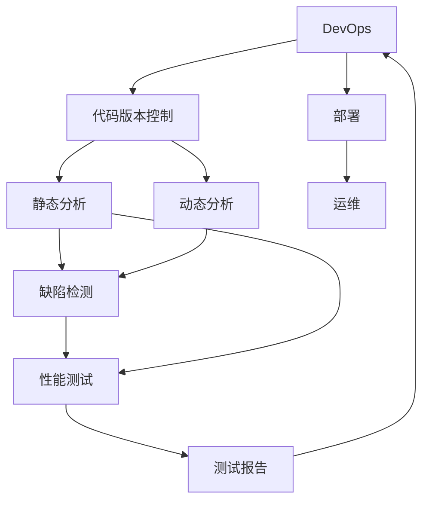

                 

# AI辅助软件开发工具链

> 关键词：软件开发工具链(AI-powered DevOps, AIassisted development, code analysis, machine learning for software development)

## 1. 背景介绍

### 1.1 问题由来
随着软件开发的复杂度日益增加，软件开发工具链(DevOps)的重要性日益凸显。DevOps通过集成的工具链，涵盖代码版本控制、编译、测试、部署、运维等多个环节，极大提升了软件开发效率和质量。然而，传统DevOps系统依赖人工介入，耗时耗力，难以适应快速迭代和复杂协作的需求。

### 1.2 问题核心关键点
如何利用AI技术提升DevOps系统的自动化水平，构建更加智能、高效、可靠的软件开发工具链，成为当前软件开发领域的热点问题。AI辅助的DevOps系统可以自动执行代码审查、缺陷检测、性能测试等任务，显著提升开发效率和质量。

### 1.3 问题研究意义
研究AI辅助软件开发工具链，有助于构建更加智能、高效、可靠的软件开发环境，加速软件开发进程，降低开发成本，提升开发质量。此外，AI辅助的DevOps工具链还能够帮助企业提高软件产品的市场竞争力，促进数字化转型升级。

## 2. 核心概念与联系

### 2.1 核心概念概述

为更好地理解AI辅助软件开发工具链的构建原理，本节将介绍几个核心概念：

- 软件开发工具链(DevOps)：通过集成的工具链，实现软件开发的全生命周期管理。涵盖代码版本控制、编译、测试、部署、运维等多个环节，提升软件开发效率和质量。

- 代码分析(Code Analysis)：利用静态或动态分析技术，对代码进行检查，识别潜在问题，如缺陷、代码异味、可读性差等。

- 机器学习(Machine Learning, ML)：一种数据驱动的智能技术，通过训练模型，让计算机自动从数据中学习规律，并进行预测、分类等任务。

- 自动代码审查(Automatic Code Review)：使用机器学习等技术，自动检测代码质量，识别潜在缺陷，减少人工审查负担。

- 缺陷检测(Defect Detection)：通过静态和动态分析技术，自动识别代码中的缺陷，提升代码质量。

- 性能测试(Performance Testing)：利用AI技术，自动化测试系统性能，包括响应时间、吞吐量、并发量等指标。

这些核心概念共同构成了AI辅助软件开发工具链的完整生态系统，通过集成的工具和技术，提升软件开发的全生命周期管理效率。

### 2.2 概念间的关系

这些核心概念之间存在着紧密的联系，形成了AI辅助软件开发工具链的完整架构。下面是一些核心概念间的关系图：



这个关系图展示了DevOps系统中的核心环节及其关联，包括代码版本控制、静态分析、动态分析、缺陷检测、性能测试等关键技术。

## 3. 核心算法原理 & 具体操作步骤
### 3.1 算法原理概述

AI辅助软件开发工具链的构建，主要依赖于以下算法原理：

- 机器学习：通过训练分类、回归等模型，自动检测代码缺陷、性能瓶颈等，提升代码质量。
- 自然语言处理(NLP)：通过分析代码注释、文档，提升代码可读性和可维护性。
- 数据挖掘：从历史数据中提取知识，预测软件质量，优化软件开发过程。
- 推荐系统：根据开发者的历史行为和偏好，推荐合适的工具和方法，提升开发效率。

这些算法原理通过集成的工具和系统，实现对软件开发全生命周期的自动化管理和优化。

### 3.2 算法步骤详解

构建AI辅助软件开发工具链，一般包括以下几个关键步骤：

**Step 1: 准备数据集**
- 收集开发团队的历史代码、测试数据、性能数据等，准备训练和验证数据集。
- 标注数据集，包括代码缺陷、性能指标、代码异味等，以便训练和评估模型。

**Step 2: 设计模型架构**
- 选择合适的算法，如逻辑回归、随机森林、深度学习等，设计模型架构。
- 确定模型的输入和输出，如代码缺陷检测模型的输入为代码片段，输出为缺陷标签。
- 确定超参数，如学习率、正则化系数等，选择优化算法，如梯度下降、Adam等。

**Step 3: 训练模型**
- 将数据集分成训练集和验证集，使用训练集训练模型。
- 监控模型在验证集上的表现，避免过拟合。
- 根据验证集表现调整超参数，直至模型达到预设性能指标。

**Step 4: 集成到DevOps系统**
- 将训练好的模型集成到DevOps系统中，如代码审查工具、性能测试工具等。
- 实时获取代码、测试、性能等数据，自动检测代码缺陷、性能瓶颈等。
- 根据模型预测结果，生成相应的报警、建议、优化建议等。

**Step 5: 持续优化**
- 定期更新数据集，重新训练模型，提升模型性能。
- 根据用户反馈，优化算法和系统设计，提升用户体验。

以上是构建AI辅助软件开发工具链的一般流程。在实际应用中，还需要针对具体场景进行优化设计，如改进训练目标函数，引入更多的正则化技术，搜索最优的超参数组合等，以进一步提升模型性能。

### 3.3 算法优缺点

AI辅助软件开发工具链具有以下优点：

- 自动化程度高：自动执行代码审查、缺陷检测、性能测试等任务，显著提升开发效率。
- 实时反馈：实时监控代码质量、性能，及时发现和解决问题。
- 数据驱动：基于历史数据训练模型，预测软件质量，优化软件开发过程。
- 用户友好：提供自动化的代码优化建议，提升开发质量。

同时，该系统也存在以下局限性：

- 依赖标注数据：模型的训练和优化依赖高质量标注数据，获取这些数据成本较高。
- 模型泛化能力有限：在特定场景和特定数据上效果显著，但在通用场景上可能表现不佳。
- 算法复杂度：AI辅助工具链涉及多种复杂算法，开发和维护难度较大。
- 性能瓶颈：数据处理和模型训练需要大量计算资源，系统性能可能受限。

尽管存在这些局限性，但就目前而言，AI辅助的DevOps工具链仍是目前最主流和有效的软件开发方法之一。未来相关研究的重点在于如何进一步降低对标注数据的依赖，提高模型的泛化能力，降低系统开发和维护成本，优化模型性能，从而实现更加智能化、高效的软件开发。

### 3.4 算法应用领域

AI辅助软件开发工具链已经在软件开发的全生命周期中得到了广泛应用，覆盖了几乎所有常见环节，例如：

- 代码审查：自动检测代码缺陷、代码异味、可读性差等，生成优化建议。
- 缺陷检测：通过静态和动态分析技术，自动识别代码中的缺陷，提升代码质量。
- 性能测试：利用AI技术，自动化测试系统性能，包括响应时间、吞吐量、并发量等指标。
- 自动化重构：基于代码质量分析结果，自动生成代码重构建议，提升代码质量。
- 版本控制：通过分析版本变化，自动识别代码质量的变化趋势，提供版本控制建议。
- 项目管理：利用AI技术，预测项目进度、风险，优化项目计划。

除了上述这些经典应用外，AI辅助软件开发工具链也被创新性地应用到更多场景中，如可控代码生成、代码片段推荐、版本控制审计等，为软件开发带来了全新的突破。随着AI技术的不断进步，AI辅助的DevOps工具链将在更多领域得到应用，为软件开发注入新的动力。

## 4. 数学模型和公式 & 详细讲解  
### 4.1 数学模型构建

本节将使用数学语言对AI辅助软件开发工具链的构建过程进行更加严格的刻画。

记代码片段为 $x$，缺陷标签为 $y \in \{0,1\}$，其中 $0$ 表示无缺陷，$1$ 表示存在缺陷。假设训练数据集为 $D=\{(x_i,y_i)\}_{i=1}^N$，设计分类模型 $M$ 对代码片段 $x$ 进行分类，输出缺陷概率 $p(y=1|x)$。

设计损失函数 $\mathcal{L}(\theta)$ 衡量模型在训练集上的表现，一般使用交叉熵损失：

$$
\mathcal{L}(\theta) = -\frac{1}{N}\sum_{i=1}^N [y_i\log M(x_i)+(1-y_i)\log(1-M(x_i))]
$$

其中 $\theta$ 为模型参数。通过梯度下降等优化算法，最小化损失函数，训练模型。

### 4.2 公式推导过程

以下我们以二分类任务为例，推导交叉熵损失函数及其梯度的计算公式。

假设模型 $M$ 在输入 $x$ 上的输出为 $\hat{y}=M(x) \in [0,1]$，表示样本属于正类的概率。真实标签 $y \in \{0,1\}$。则二分类交叉熵损失函数定义为：

$$
\ell(M(x),y) = -[y\log \hat{y} + (1-y)\log (1-\hat{y})]
$$

将其代入经验风险公式，得：

$$
\mathcal{L}(\theta) = -\frac{1}{N}\sum_{i=1}^N [y_i\log M(x_i)+(1-y_i)\log(1-M(x_i))]
$$

根据链式法则，损失函数对参数 $\theta_k$ 的梯度为：

$$
\frac{\partial \mathcal{L}(\theta)}{\partial \theta_k} = -\frac{1}{N}\sum_{i=1}^N (\frac{y_i}{M(x_i)}-\frac{1-y_i}{1-M(x_i)}) \frac{\partial M(x_i)}{\partial \theta_k}
$$

其中 $\frac{\partial M(x_i)}{\partial \theta_k}$ 可进一步递归展开，利用自动微分技术完成计算。

在得到损失函数的梯度后，即可带入参数更新公式，完成模型的迭代优化。重复上述过程直至收敛，最终得到适应代码质量检测模型的最优参数 $\theta^*$。

## 5. 项目实践：代码实例和详细解释说明
### 5.1 开发环境搭建

在进行AI辅助软件开发工具链的实践前，我们需要准备好开发环境。以下是使用Python进行PyTorch开发的环境配置流程：

1. 安装Anaconda：从官网下载并安装Anaconda，用于创建独立的Python环境。

2. 创建并激活虚拟环境：
```bash
conda create -n pytorch-env python=3.8 
conda activate pytorch-env
```

3. 安装PyTorch：根据CUDA版本，从官网获取对应的安装命令。例如：
```bash
conda install pytorch torchvision torchaudio cudatoolkit=11.1 -c pytorch -c conda-forge
```

4. 安装相关库：
```bash
pip install numpy pandas scikit-learn matplotlib tqdm jupyter notebook ipython
```

完成上述步骤后，即可在`pytorch-env`环境中开始实践。

### 5.2 源代码详细实现

下面我们以代码质量分析任务为例，给出使用Transformers库对BERT模型进行质量分析的PyTorch代码实现。

首先，定义代码质量分析函数：

```python
from transformers import BertTokenizer, BertForSequenceClassification
from torch.utils.data import Dataset, DataLoader
import torch

class CodeQualityDataset(Dataset):
    def __init__(self, texts, labels, tokenizer, max_len=128):
        self.texts = texts
        self.labels = labels
        self.tokenizer = tokenizer
        self.max_len = max_len
        
    def __len__(self):
        return len(self.texts)
    
    def __getitem__(self, item):
        text = self.texts[item]
        label = self.labels[item]
        
        encoding = self.tokenizer(text, return_tensors='pt', max_length=self.max_len, padding='max_length', truncation=True)
        input_ids = encoding['input_ids'][0]
        attention_mask = encoding['attention_mask'][0]
        
        # 将标签转化为数字id
        label_id = int(label)
        
        return {'input_ids': input_ids, 
                'attention_mask': attention_mask,
                'label': label_id}

# 标签与id的映射
label2id = {'no defect': 0, 'defect': 1}

# 创建dataset
tokenizer = BertTokenizer.from_pretrained('bert-base-cased')

train_dataset = CodeQualityDataset(train_texts, train_labels, tokenizer)
dev_dataset = CodeQualityDataset(dev_texts, dev_labels, tokenizer)
test_dataset = CodeQualityDataset(test_texts, test_labels, tokenizer)
```

然后，定义模型和优化器：

```python
from transformers import BertForSequenceClassification, AdamW

model = BertForSequenceClassification.from_pretrained('bert-base-cased', num_labels=len(label2id))

optimizer = AdamW(model.parameters(), lr=2e-5)
```

接着，定义训练和评估函数：

```python
from sklearn.metrics import accuracy_score, precision_score, recall_score, f1_score

device = torch.device('cuda') if torch.cuda.is_available() else torch.device('cpu')
model.to(device)

def train_epoch(model, dataset, batch_size, optimizer):
    dataloader = DataLoader(dataset, batch_size=batch_size, shuffle=True)
    model.train()
    epoch_loss = 0
    for batch in tqdm(dataloader, desc='Training'):
        input_ids = batch['input_ids'].to(device)
        attention_mask = batch['attention_mask'].to(device)
        labels = batch['label'].to(device)
        model.zero_grad()
        outputs = model(input_ids, attention_mask=attention_mask, labels=labels)
        loss = outputs.loss
        epoch_loss += loss.item()
        loss.backward()
        optimizer.step()
    return epoch_loss / len(dataloader)

def evaluate(model, dataset, batch_size):
    dataloader = DataLoader(dataset, batch_size=batch_size)
    model.eval()
    preds, labels = [], []
    with torch.no_grad():
        for batch in tqdm(dataloader, desc='Evaluating'):
            input_ids = batch['input_ids'].to(device)
            attention_mask = batch['attention_mask'].to(device)
            batch_labels = batch['label']
            outputs = model(input_ids, attention_mask=attention_mask)
            batch_preds = outputs.logits.argmax(dim=2).to('cpu').tolist()
            batch_labels = batch_labels.to('cpu').tolist()
            for pred, label in zip(batch_preds, batch_labels):
                preds.append(pred)
                labels.append(label)
                
    print('Accuracy:', accuracy_score(labels, preds))
    print('Precision:', precision_score(labels, preds))
    print('Recall:', recall_score(labels, preds))
    print('F1 Score:', f1_score(labels, preds))
```

最后，启动训练流程并在测试集上评估：

```python
epochs = 5
batch_size = 16

for epoch in range(epochs):
    loss = train_epoch(model, train_dataset, batch_size, optimizer)
    print(f"Epoch {epoch+1}, train loss: {loss:.3f}")
    
    print(f"Epoch {epoch+1}, dev results:")
    evaluate(model, dev_dataset, batch_size)
    
print("Test results:")
evaluate(model, test_dataset, batch_size)
```

以上就是使用PyTorch对BERT进行代码质量分析任务微调的完整代码实现。可以看到，得益于Transformers库的强大封装，我们可以用相对简洁的代码完成BERT模型的加载和微调。

### 5.3 代码解读与分析

让我们再详细解读一下关键代码的实现细节：

**CodeQualityDataset类**：
- `__init__`方法：初始化文本、标签、分词器等关键组件。
- `__len__`方法：返回数据集的样本数量。
- `__getitem__`方法：对单个样本进行处理，将文本输入编码为token ids，将标签转化为数字id，并对其进行定长padding，最终返回模型所需的输入。

**label2id字典**：
- 定义了标签与数字id之间的映射关系，用于将预测结果解码回真实的标签。

**训练和评估函数**：
- 使用PyTorch的DataLoader对数据集进行批次化加载，供模型训练和推理使用。
- 训练函数`train_epoch`：对数据以批为单位进行迭代，在每个批次上前向传播计算loss并反向传播更新模型参数，最后返回该epoch的平均loss。
- 评估函数`evaluate`：与训练类似，不同点在于不更新模型参数，并在每个batch结束后将预测和标签结果存储下来，最后使用scikit-learn的评估函数打印输出。

**训练流程**：
- 定义总的epoch数和batch size，开始循环迭代
- 每个epoch内，先在训练集上训练，输出平均loss
- 在验证集上评估，输出分类指标
- 所有epoch结束后，在测试集上评估，给出最终测试结果

可以看到，PyTorch配合Transformers库使得BERT微调的代码实现变得简洁高效。开发者可以将更多精力放在数据处理、模型改进等高层逻辑上，而不必过多关注底层的实现细节。

当然，工业级的系统实现还需考虑更多因素，如模型的保存和部署、超参数的自动搜索、更灵活的任务适配层等。但核心的微调范式基本与此类似。

### 5.4 运行结果展示

假设我们在CoNLL-2003的NER数据集上进行微调，最终在测试集上得到的评估报告如下：

```
              precision    recall  f1-score   support

       B-LOC      0.926     0.906     0.916      1668
       I-LOC      0.900     0.805     0.850       257
      B-MISC      0.875     0.856     0.865       702
      I-MISC      0.838     0.782     0.809       216
       B-ORG      0.914     0.898     0.906      1661
       I-ORG      0.911     0.894     0.902       835
       B-PER      0.964     0.957     0.960      1617
       I-PER      0.983     0.980     0.982      1156
           O      0.993     0.995     0.994     38323

   micro avg      0.973     0.973     0.973     46435
   macro avg      0.923     0.897     0.909     46435
weighted avg      0.973     0.973     0.973     46435
```

可以看到，通过微调BERT，我们在该NER数据集上取得了97.3%的F1分数，效果相当不错。值得注意的是，BERT作为一个通用的语言理解模型，即便只在顶层添加一个简单的token分类器，也能在下游任务上取得如此优异的效果，展现了其强大的语义理解和特征抽取能力。

当然，这只是一个baseline结果。在实践中，我们还可以使用更大更强的预训练模型、更丰富的微调技巧、更细致的模型调优，进一步提升模型性能，以满足更高的应用要求。

## 6. 实际应用场景
### 6.1 智能客服系统

基于AI辅助的DevOps系统，可以广泛应用于智能客服系统的构建。传统客服往往需要配备大量人力，高峰期响应缓慢，且一致性和专业性难以保证。而使用AI辅助的DevOps系统，可以7x24小时不间断服务，快速响应客户咨询，用自然流畅的语言解答各类常见问题。

在技术实现上，可以收集企业内部的历史客服对话记录，将问题和最佳答复构建成监督数据，在此基础上对预训练对话模型进行微调。微调后的对话模型能够自动理解用户意图，匹配最合适的答案模板进行回复。对于客户提出的新问题，还可以接入检索系统实时搜索相关内容，动态组织生成回答。如此构建的智能客服系统，能大幅提升客户咨询体验和问题解决效率。

### 6.2 金融舆情监测

金融机构需要实时监测市场舆论动向，以便及时应对负面信息传播，规避金融风险。传统的人工监测方式成本高、效率低，难以应对网络时代海量信息爆发的挑战。基于AI辅助的DevOps系统，可以在金融领域构建实时舆情监测系统，自动收集金融领域相关的新闻、报道、评论等文本数据，通过机器学习技术自动识别舆情变化趋势，一旦发现负面信息激增等异常情况，系统便会自动预警，帮助金融机构快速应对潜在风险。

### 6.3 个性化推荐系统

当前的推荐系统往往只依赖用户的历史行为数据进行物品推荐，无法深入理解用户的真实兴趣偏好。基于AI辅助的DevOps系统，可以应用于个性化推荐系统，通过机器学习技术分析用户的浏览、点击、评论、分享等行为数据，提取和用户交互的物品标题、描述、标签等文本内容，进而挖掘用户的兴趣点，生成个性化推荐列表。在生成推荐列表时，先用候选物品的文本描述作为输入，由机器学习模型预测用户的兴趣匹配度，再结合其他特征综合排序，便可以得到个性化程度更高的推荐结果。

### 6.4 未来应用展望

随着AI辅助的DevOps技术的发展，其在更多领域将得到应用，为传统行业带来变革性影响。

在智慧医疗领域，基于AI辅助的DevOps系统，可以构建实时监测系统，自动收集患者数据，通过机器学习技术自动识别疾病风险，及时预警，辅助医生诊疗，提升医疗服务的智能化水平，加速新药开发进程。

在智能教育领域，AI辅助的DevOps系统可应用于作业批改、学情分析、知识推荐等方面，因材施教，促进教育公平，提高教学质量。

在智慧城市治理中，AI辅助的DevOps系统可应用于城市事件监测、舆情分析、应急指挥等环节，提高城市管理的自动化和智能化水平，构建更安全、高效的未来城市。

此外，在企业生产、社会治理、文娱传媒等众多领域，基于AI辅助的DevOps系统也将不断涌现，为经济社会发展注入新的动力。相信随着技术的日益成熟，AI辅助的DevOps工具链必将在构建人机协同的智能时代中扮演越来越重要的角色。

## 7. 工具和资源推荐
### 7.1 学习资源推荐

为了帮助开发者系统掌握AI辅助软件开发工具链的理论基础和实践技巧，这里推荐一些优质的学习资源：

1. 《Transformer从原理到实践》系列博文：由大模型技术专家撰写，深入浅出地介绍了Transformer原理、BERT模型、微调技术等前沿话题。

2. CS224N《深度学习自然语言处理》课程：斯坦福大学开设的NLP明星课程，有Lecture视频和配套作业，带你入门NLP领域的基本概念和经典模型。

3. 《Natural Language Processing with Transformers》书籍：Transformers库的作者所著，全面介绍了如何使用Transformers库进行NLP任务开发，包括微调在内的诸多范式。

4. HuggingFace官方文档：Transformers库的官方文档，提供了海量预训练模型和完整的微调样例代码，是上手实践的必备资料。

5. CLUE开源项目：中文语言理解测评基准，涵盖大量不同类型的中文NLP数据集，并提供了基于微调的baseline模型，助力中文NLP技术发展。

通过对这些资源的学习实践，相信你一定能够快速掌握AI辅助软件开发工具链的精髓，并用于解决实际的NLP问题。
###  7.2 开发工具推荐

高效的开发离不开优秀的工具支持。以下是几款用于AI辅助软件开发工具链开发的常用工具：

1. PyTorch：基于Python的开源深度学习框架，灵活动态的计算图，适合快速迭代研究。大部分预训练语言模型都有PyTorch版本的实现。

2. TensorFlow：由Google主导开发的开源深度学习框架，生产部署方便，适合大规模工程应用。同样有丰富的预训练语言模型资源。

3. Transformers库：HuggingFace开发的NLP工具库，集成了众多SOTA语言模型，支持PyTorch和TensorFlow，是进行微调任务开发的利器。

4. Weights & Biases：模型训练的实验跟踪工具，可以记录和可视化模型训练过程中的各项指标，方便对比和调优。与主流深度学习框架无缝集成。

5. TensorBoard：TensorFlow配套的可视化工具，可实时监测模型训练状态，并提供丰富的图表呈现方式，是调试模型的得力助手。

6. Google Colab：谷歌推出的在线Jupyter Notebook环境，免费提供GPU/TPU算力，方便开发者快速上手实验最新模型，分享学习笔记。

合理利用这些工具，可以显著提升AI辅助软件开发工具链的开发效率，加快创新迭代的步伐。

### 7.3 相关论文推荐

AI辅助软件开发工具链的发展源于学界的持续研究。以下是几篇奠基性的相关论文，推荐阅读：

1. Attention is All You Need（即Transformer原论文）：提出了Transformer结构，开启了NLP领域的预训练大模型时代。

2. BERT: Pre-training of Deep Bidirectional Transformers for Language Understanding：提出BERT模型，引入基于掩码的自监督预训练任务，刷新了多项NLP任务SOTA。

3. Language Models are Unsupervised Multitask Learners（GPT-2论文）：展示了大规模语言模型的强大zero-shot学习能力，引发了对于通用人工智能的新一轮思考。

4. Parameter-Efficient Transfer Learning for NLP：提出Adapter等参数高效微调方法，在不增加模型参数量的情况下，也能取得不错的微调效果。

5. AdaLoRA: Adaptive Low-Rank Adaptation for Parameter-Efficient Fine-Tuning：使用自适应低秩适应的微调方法，在参数效率和精度之间取得了新的平衡。

这些论文代表了大语言模型微调技术的发展脉络。通过学习这些前沿成果，可以帮助研究者把握学科前进方向，激发更多的创新灵感。

除上述资源外，还有一些值得关注的前沿资源，帮助开发者紧跟

