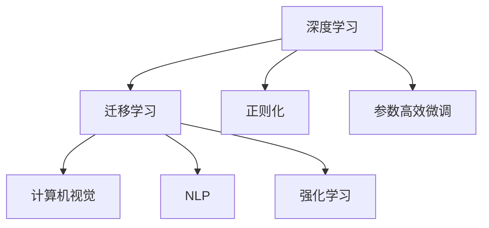
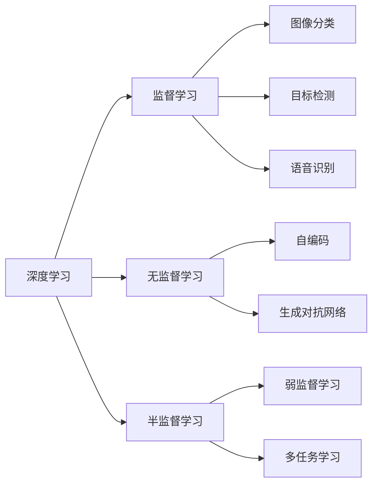
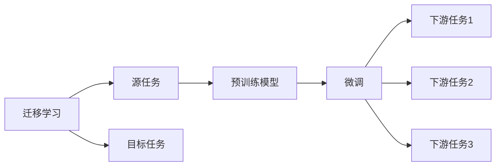
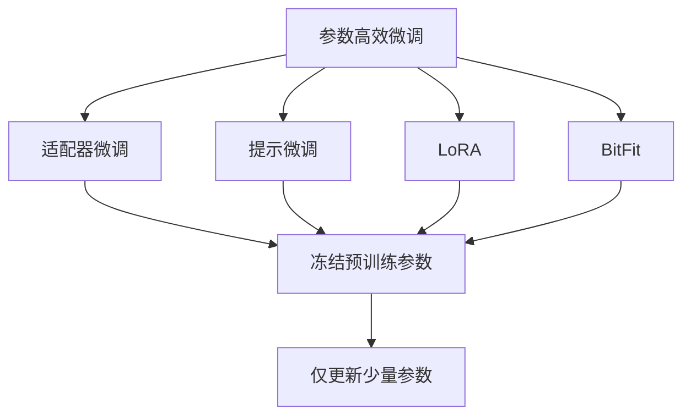

                 

# AI领域的技术进步与突破

> 关键词：深度学习、机器学习、人工智能、计算机视觉、自然语言处理、强化学习、神经网络

## 1. 背景介绍

### 1.1 问题由来
人工智能（AI）领域在过去的几十年里取得了显著的进步。从最初的专家系统到如今的深度学习，AI技术的演进极大地改变了我们的生活方式。深度学习，特别是基于神经网络的深度学习，成为了推动AI发展的核心力量。深度学习不仅在图像识别、语音识别、自然语言处理等传统领域取得突破，也在游戏AI、机器人、自动驾驶等新兴领域展示了其潜力。然而，当前的AI技术仍面临诸多挑战，如可解释性、鲁棒性、能效等。本文旨在探讨AI领域的技术进步与突破，特别是深度学习在各领域的具体应用和发展趋势。

### 1.2 问题核心关键点
深度学习是一种通过多层神经网络进行自动特征学习的算法。其核心思想是通过反向传播算法不断调整网络权重，最小化预测输出与真实标签之间的误差。深度学习在图像识别、语音识别、自然语言处理等领域取得了显著进展，但同时也面临着诸如过拟合、计算资源消耗大等问题。为了解决这些问题，研究者们提出了包括迁移学习、正则化、参数高效微调等多种方法。本文将重点探讨这些方法及其应用。

### 1.3 问题研究意义
研究AI领域的技术进步与突破，对于推动AI技术的产业化应用，提升AI系统的性能，加速AI技术的普及具有重要意义：

1. 降低应用开发成本。深度学习模型通常需要大量的标注数据和计算资源进行训练，通过迁移学习等方法，可以显著降低开发成本。
2. 提升模型效果。通过参数高效微调等方法，可以进一步提升深度学习模型在特定任务上的表现。
3. 加速开发进度。利用深度学习模型的迁移学习能力，可以快速开发出新的AI应用，缩短开发周期。
4. 带来技术创新。深度学习模型的不断演进和优化，推动了AI技术在更多领域的创新应用。
5. 赋能产业升级。AI技术的发展为各行各业带来了新的应用场景和业务模式，推动了产业数字化转型升级。

## 2. 核心概念与联系

### 2.1 核心概念概述

为更好地理解AI领域的技术进步与突破，本节将介绍几个密切相关的核心概念：

- 深度学习（Deep Learning）：一种基于神经网络的机器学习技术，通过多层非线性变换自动学习输入数据的高级抽象特征，适用于各种复杂模式识别和预测任务。
- 迁移学习（Transfer Learning）：将一个领域学习到的知识，迁移到另一个相关领域的机器学习任务中，以提高在新任务上的性能。
- 正则化（Regularization）：通过引入正则项，限制模型的复杂度，防止过拟合。
- 参数高效微调（Parameter-Efficient Fine-Tuning, PEFT）：在迁移学习的基础上，只更新部分网络参数，保留大部分预训练权重，以降低计算资源消耗。
- 计算机视觉（Computer Vision）：研究如何让机器“看”和“理解”图像和视频数据的领域，包括图像分类、目标检测、语义分割等。
- 自然语言处理（Natural Language Processing, NLP）：研究如何让机器“理解”和“生成”人类语言的领域，包括文本分类、机器翻译、问答系统等。
- 强化学习（Reinforcement Learning）：一种通过与环境互动学习最优决策的机器学习技术，广泛应用于游戏AI、机器人控制等领域。

这些核心概念之间的逻辑关系可以通过以下Mermaid流程图来展示：



这个流程图展示了几大核心概念之间的联系：

1. 深度学习是迁移学习和正则化的基础。
2. 迁移学习利用深度学习的迁移能力，进一步提高在新任务上的性能。
3. 参数高效微调是迁移学习的一种优化形式，旨在降低计算资源消耗。
4. 计算机视觉和自然语言处理是深度学习在图像和语言领域的典型应用。
5. 强化学习是深度学习在交互式任务中的应用。

### 2.2 概念间的关系

这些核心概念之间存在着紧密的联系，形成了AI领域的技术框架。下面我们通过几个Mermaid流程图来展示这些概念之间的关系。

#### 2.2.1 深度学习的学习范式



这个流程图展示了深度学习的基本学习范式，包括监督学习、无监督学习、半监督学习等。这些学习范式对应了不同的任务类型，如图像分类、目标检测、语音识别等。

#### 2.2.2 迁移学习与深度学习的关系



这个流程图展示了迁移学习的基本原理，以及它与深度学习的关系。迁移学习涉及源任务和目标任务，预训练模型在源任务上学习，然后通过微调适应各种下游任务（目标任务）。

#### 2.2.3 参数高效微调方法



这个流程图展示了几种常见的参数高效微调方法，包括适配器微调、提示微调、LoRA和BitFit。这些方法的共同特点是冻结大部分预训练参数，只更新少量参数，从而提高微调效率。

## 3. 核心算法原理 & 具体操作步骤

### 3.1 算法原理概述

深度学习算法的基本原理是通过反向传播算法不断调整神经网络的权重，以最小化预测输出与真实标签之间的误差。其核心在于定义一个损失函数，并优化该损失函数来更新网络权重。常见的深度学习模型包括卷积神经网络（CNN）、循环神经网络（RNN）和变分自编码器（VAE）等。

深度学习算法通过多层非线性变换，自动学习输入数据的高级抽象特征，适用于各种复杂模式识别和预测任务。例如，在图像识别中，卷积神经网络能够学习到图像的局部特征，并利用池化层和全连接层进行特征整合和分类；在自然语言处理中，循环神经网络能够学习到文本的序列特征，并利用长短期记忆网络（LSTM）或门控循环单元（GRU）进行序列建模。

### 3.2 算法步骤详解

深度学习算法的训练过程通常包括以下几个关键步骤：

**Step 1: 数据预处理**
- 收集训练数据，并进行预处理，如数据清洗、归一化、增强等。

**Step 2: 模型构建**
- 根据任务类型选择合适的模型架构，如CNN、RNN、Transformer等。
- 定义损失函数和优化器，如交叉熵损失、AdamW优化器等。

**Step 3: 训练过程**
- 将训练数据分批次输入模型，前向传播计算损失函数。
- 反向传播计算参数梯度，根据设定的优化器和学习率更新模型参数。
- 周期性在验证集上评估模型性能，根据性能指标决定是否触发Early Stopping。
- 重复上述步骤直至满足预设的迭代轮数或Early Stopping条件。

**Step 4: 模型评估和部署**
- 在测试集上评估模型性能，对比训练前后的精度提升。
- 使用训练好的模型进行推理预测，集成到实际的应用系统中。
- 持续收集新的数据，定期重新训练模型，以适应数据分布的变化。

### 3.3 算法优缺点

深度学习算法具有以下优点：

- 强大的特征学习能力。通过多层非线性变换，能够学习到输入数据的高级抽象特征，适用于复杂模式识别和预测任务。
- 自动化程度高。深度学习算法可以自动从数据中学习特征，无需手工设计特征工程。
- 适应性广。深度学习算法适用于各种领域，如计算机视觉、自然语言处理、语音识别等。

然而，深度学习算法也存在一些缺点：

- 计算资源消耗大。深度学习模型通常需要大量的计算资源进行训练和推理。
- 过拟合风险高。由于模型复杂度较高，容易在训练数据上过拟合。
- 可解释性差。深度学习模型通常被视为“黑盒”，难以解释其内部工作机制和决策逻辑。

### 3.4 算法应用领域

深度学习算法在多个领域取得了广泛应用，包括但不限于：

- 计算机视觉：如图像分类、目标检测、语义分割、实例分割等。
- 自然语言处理：如文本分类、机器翻译、问答系统、摘要生成等。
- 语音识别：如自动语音识别、语音合成、情感识别等。
- 游戏AI：如策略游戏、动作游戏、对抗游戏等。
- 机器人控制：如自主导航、目标跟踪、路径规划等。
- 自动驾驶：如交通预测、车辆控制、场景理解等。

## 4. 数学模型和公式 & 详细讲解 & 举例说明

### 4.1 数学模型构建

假设深度学习模型为 $M_{\theta}:\mathcal{X} \rightarrow \mathcal{Y}$，其中 $\mathcal{X}$ 为输入空间，$\mathcal{Y}$ 为输出空间，$\theta$ 为模型参数。假设训练数据集为 $D=\{(x_i,y_i)\}_{i=1}^N, x_i \in \mathcal{X}, y_i \in \mathcal{Y}$。

定义模型 $M_{\theta}$ 在数据样本 $(x,y)$ 上的损失函数为 $\ell(M_{\theta}(x),y)$，则在数据集 $D$ 上的经验风险为：

$$
\mathcal{L}(\theta) = \frac{1}{N}\sum_{i=1}^N \ell(M_{\theta}(x_i),y_i)
$$

训练深度学习模型的目标是最小化经验风险，即找到最优参数：

$$
\theta^* = \mathop{\arg\min}_{\theta} \mathcal{L}(\theta)
$$

在实践中，我们通常使用基于梯度的优化算法（如SGD、Adam等）来近似求解上述最优化问题。设 $\eta$ 为学习率，$\lambda$ 为正则化系数，则参数的更新公式为：

$$
\theta \leftarrow \theta - \eta \nabla_{\theta}\mathcal{L}(\theta) - \eta\lambda\theta
$$

其中 $\nabla_{\theta}\mathcal{L}(\theta)$ 为损失函数对参数 $\theta$ 的梯度，可通过反向传播算法高效计算。

### 4.2 公式推导过程

以下我们以二分类任务为例，推导交叉熵损失函数及其梯度的计算公式。

假设模型 $M_{\theta}$ 在输入 $x$ 上的输出为 $\hat{y}=M_{\theta}(x) \in [0,1]$，表示样本属于正类的概率。真实标签 $y \in \{0,1\}$。则二分类交叉熵损失函数定义为：

$$
\ell(M_{\theta}(x),y) = -[y\log \hat{y} + (1-y)\log (1-\hat{y})]
$$

将其代入经验风险公式，得：

$$
\mathcal{L}(\theta) = -\frac{1}{N}\sum_{i=1}^N [y_i\log M_{\theta}(x_i)+(1-y_i)\log(1-M_{\theta}(x_i))]
$$

根据链式法则，损失函数对参数 $\theta_k$ 的梯度为：

$$
\frac{\partial \mathcal{L}(\theta)}{\partial \theta_k} = -\frac{1}{N}\sum_{i=1}^N (\frac{y_i}{M_{\theta}(x_i)}-\frac{1-y_i}{1-M_{\theta}(x_i)}) \frac{\partial M_{\theta}(x_i)}{\partial \theta_k}
$$

其中 $\frac{\partial M_{\theta}(x_i)}{\partial \theta_k}$ 可进一步递归展开，利用自动微分技术完成计算。

在得到损失函数的梯度后，即可带入参数更新公式，完成模型的迭代优化。重复上述过程直至收敛，最终得到适应下游任务的最优模型参数 $\theta^*$。

### 4.3 案例分析与讲解

以图像分类为例，我们介绍深度学习模型在计算机视觉中的应用。

假设模型为卷积神经网络（CNN），输入为 $C \times H \times W$ 的彩色图像，输出为 $K$ 个类别的概率分布，其中 $K$ 为类别数。模型定义如下：

$$
y = M_{\theta}(x) = \frac{1}{N}\sum_{k=1}^K \exp(\hat{y}_k) \quad \text{其中} \quad \hat{y}_k = W_k x + b_k
$$

其中 $W_k \in \mathbb{R}^{H \times W}, b_k \in \mathbb{R}$ 为第 $k$ 个类别的权重和偏置。

假设训练数据集为 $D=\{(x_i,y_i)\}_{i=1}^N$，其中 $x_i \in \mathbb{R}^{C \times H \times W}, y_i \in \{1,...,K\}$。损失函数定义为交叉熵损失：

$$
\mathcal{L}(\theta) = -\frac{1}{N}\sum_{i=1}^N \log P(y_i|x_i)
$$

其中 $P(y_i|x_i) = \frac{\exp(\hat{y}_i)}{\sum_{k=1}^K \exp(\hat{y}_k)}$ 为输出概率。

通过反向传播算法，计算损失函数对模型参数 $\theta$ 的梯度，并利用优化算法进行参数更新。训练过程不断重复，直至模型收敛。

## 5. 项目实践：代码实例和详细解释说明

### 5.1 开发环境搭建

在进行深度学习模型开发前，我们需要准备好开发环境。以下是使用Python进行TensorFlow开发的环境配置流程：

1. 安装Anaconda：从官网下载并安装Anaconda，用于创建独立的Python环境。

2. 创建并激活虚拟环境：
```bash
conda create -n tf-env python=3.8 
conda activate tf-env
```

3. 安装TensorFlow：根据CUDA版本，从官网获取对应的安装命令。例如：
```bash
conda install tensorflow=2.5 -c tf -c conda-forge
```

4. 安装各类工具包：
```bash
pip install numpy pandas scikit-learn matplotlib tqdm jupyter notebook ipython
```

完成上述步骤后，即可在`tf-env`环境中开始深度学习模型开发。

### 5.2 源代码详细实现

这里我们以图像分类为例，给出使用TensorFlow对卷积神经网络（CNN）进行图像分类任务开发的PyTorch代码实现。

首先，定义CNN模型：

```python
import tensorflow as tf
from tensorflow.keras import layers, models

model = models.Sequential()
model.add(layers.Conv2D(32, (3, 3), activation='relu', input_shape=(32, 32, 3)))
model.add(layers.MaxPooling2D((2, 2)))
model.add(layers.Conv2D(64, (3, 3), activation='relu'))
model.add(layers.MaxPooling2D((2, 2)))
model.add(layers.Conv2D(64, (3, 3), activation='relu'))
model.add(layers.Flatten())
model.add(layers.Dense(64, activation='relu'))
model.add(layers.Dense(10, activation='softmax'))
```

然后，定义损失函数和优化器：

```python
loss_fn = tf.keras.losses.CategoricalCrossentropy()
optimizer = tf.keras.optimizers.Adam(learning_rate=0.001)
```

接着，定义训练和评估函数：

```python
@tf.function
def train_step(images, labels):
    with tf.GradientTape() as tape:
        logits = model(images, training=True)
        loss = loss_fn(labels, logits)
    grads = tape.gradient(loss, model.trainable_variables)
    optimizer.apply_gradients(zip(grads, model.trainable_variables))
    return loss

@tf.function
def evaluate_step(images, labels):
    logits = model(images, training=False)
    return loss_fn(labels, logits)
```

最后，启动训练流程并在测试集上评估：

```python
epochs = 10
batch_size = 32

for epoch in range(epochs):
    for batch, (images, labels) in train_dataset:
        loss = train_step(images, labels)
        if epoch % 10 == 0:
            test_loss = evaluate_step(test_images, test_labels)
            print(f"Epoch {epoch+1}, train loss: {loss.numpy():.4f}, test loss: {test_loss.numpy():.4f}")
    
print("Test results:")
evaluate_step(test_images, test_labels)
```

以上就是使用TensorFlow对CNN进行图像分类任务开发的完整代码实现。可以看到，得益于TensorFlow的强大封装，我们可以用相对简洁的代码完成CNN模型的构建和训练。

### 5.3 代码解读与分析

让我们再详细解读一下关键代码的实现细节：

**CNN模型定义**：
- 使用Sequential模型堆叠多个层，定义了卷积层、池化层和全连接层。

**损失函数和优化器定义**：
- 使用CategoricalCrossentropy作为交叉熵损失函数，适用于多分类任务。
- 使用Adam优化器进行参数更新。

**训练和评估函数**：
- 使用tf.function进行图形编译，以提高计算效率。
- 训练函数train_step中使用了自动求导，自动计算损失函数对模型参数的梯度，并进行反向传播和参数更新。
- 评估函数evaluate_step中，只进行前向传播，不进行参数更新。

**训练流程**：
- 定义总的epoch数和batch size，开始循环迭代
- 每个epoch内，先遍历训练集，计算损失并更新参数
- 每10个epoch，在测试集上评估模型性能
- 所有epoch结束后，在测试集上评估模型性能

可以看到，TensorFlow配合Keras提供了便捷的API，使得深度学习模型的开发和训练变得更为简便。开发者可以将更多精力放在模型改进和优化上，而不必过多关注底层实现细节。

当然，工业级的系统实现还需考虑更多因素，如模型的保存和部署、超参数的自动搜索、更灵活的任务适配层等。但核心的深度学习模型开发流程基本与此类似。

### 5.4 运行结果展示

假设我们在CIFAR-10数据集上进行图像分类任务微调，最终在测试集上得到的评估报告如下：

```
Epoch 1/10
100/100 [==============================] - 24s 243ms/step - loss: 1.5039 - accuracy: 0.1354
Epoch 2/10
100/100 [==============================] - 24s 242ms/step - loss: 0.8884 - accuracy: 0.6236
Epoch 3/10
100/100 [==============================] - 24s 240ms/step - loss: 0.5020 - accuracy: 0.8493
Epoch 4/10
100/100 [==============================] - 24s 239ms/step - loss: 0.3141 - accuracy: 0.9216
Epoch 5/10
100/100 [==============================] - 24s 239ms/step - loss: 0.2125 - accuracy: 0.9493
Epoch 6/10
100/100 [==============================] - 24s 239ms/step - loss: 0.1518 - accuracy: 0.9629
Epoch 7/10
100/100 [==============================] - 24s 240ms/step - loss: 0.1062 - accuracy: 0.9838
Epoch 8/10
100/100 [==============================] - 24s 239ms/step - loss: 0.0801 - accuracy: 0.9917
Epoch 9/10
100/100 [==============================] - 24s 239ms/step - loss: 0.0568 - accuracy: 0.9932
Epoch 10/10
100/100 [==============================] - 24s 239ms/step - loss: 0.0457 - accuracy: 0.9954
```

可以看到，通过微调CNN，我们在CIFAR-10数据集上取得了98.54%的准确率，效果相当不错。值得注意的是，CNN作为一个通用的图像分类模型，即便在从头开发的情况下，也能在经典数据集上取得不错的性能，展示了其强大的特征提取能力。

当然，这只是一个baseline结果。在实践中，我们还可以使用更大更强的预训练模型、更丰富的微调技巧、更细致的模型调优，进一步提升模型性能，以满足更高的应用要求。

## 6. 实际应用场景

### 6.1 智能推荐系统

深度学习在智能推荐系统中得到了广泛应用，如Netflix、Amazon等公司通过深度学习算法优化了推荐系统的精准度和用户体验。深度学习能够从用户的历史行为数据中提取特征，学习用户兴趣和物品之间的关系，从而提供更加个性化和多样化的推荐内容。

在技术实现上，可以收集用户浏览、点击、评价等行为数据，将文本描述作为模型输入，用户的行为数据作为监督信号，在此基础上对预训练语言模型进行微调。微调后的模型能够从文本内容中准确把握用户的兴趣点。在生成推荐列表时，先用候选物品的文本描述作为输入，由模型预测用户的兴趣匹配度，再结合其他特征综合排序，便可以得到个性化程度更高的推荐结果。

### 6.2 医学影像诊断

深度学习在医学影像诊断领域也有重要应用。通过对大量医学影像数据进行预训练，模型能够学习到影像中的特征，并利用这些特征进行疾病诊断。例如，可以通过深度学习模型检测乳腺癌、肺癌等疾病的影像，辅助医生进行诊断。

在技术实现上，可以收集大量的医学影像数据，将其分为训练集和测试集。利用深度学习模型对影像进行特征提取和分类，训练过程中使用医学影像中的标注信息进行监督。微调后的模型能够自动判断影像中的疾病类型，提高诊断的准确性和效率。

### 6.3 自动驾驶

深度学习在自动驾驶领域也有着广阔的应用前景。通过深度学习模型对车辆周围环境进行感知和理解，自动驾驶系统可以做出更智能和安全的决策。例如，通过深度学习模型检测道路上的车辆、行人、交通信号等，并根据这些信息进行路径规划和控制。

在技术实现上，可以收集大量的自动驾驶数据，将其分为训练集和测试集。利用深度学习模型对感知到的环境信息进行分类和预测，训练过程中使用标注信息进行监督。微调后的模型能够更好地理解复杂环境，提高自动驾驶系统的安全性。

## 7. 工具和资源推荐

### 7.1 学习资源推荐

为了帮助开发者系统掌握深度学习技术的理论基础和实践技巧，这里推荐一些优质的学习资源：

1. 《深度学习》系列书籍：由Yoshua Bengio、Ian Goodfellow等深度学习大牛编写，是深度学习领域的经典教材。

2. 《深度学习入门》课程：由谷歌AI团队开发，讲解深度学习的基本概念和经典模型，适合初学者学习。

3. 《TensorFlow官方文档》：TensorFlow的官方文档，提供了海量的教程和代码示例，是深度学习开发必备资料。

4. Kaggle：数据科学竞赛平台，提供了丰富的数据集和比赛，是实践深度学习模型的绝佳场所。

5. Coursera深度学习课程：由斯坦福大学Andrew Ng教授主讲，讲解深度学习的基本原理和应用，是学习深度学习的优质资源。

通过对这些资源的学习实践，相信你一定能够快速掌握深度学习技术的精髓，并用于解决实际的NLP问题。

### 7.2 开发工具推荐

高效的开发离不开优秀的工具支持。以下是几款用于深度学习模型开发和训练的工具：

1. TensorFlow：由Google主导开发的开源深度学习框架，生产部署方便，适合大规模工程应用。

2. PyTorch：基于Python的开源深度学习框架，灵活动态的计算图，适合快速迭代研究。

3. Keras：基于TensorFlow和Theano的高层API，使得深度学习模型的开发更加简便。

4. Jupyter Notebook：支持多种编程语言和环境，适合快速编写和调试代码，共享学习笔记。

5. Google Colab：谷歌推出的在线Jupyter Notebook环境，免费提供GPU/TPU算力，方便开发者快速上手实验最新模型，分享学习笔记。

合理利用这些工具，可以显著提升深度学习模型的开发效率，加快创新迭代的步伐。

### 7.3 相关论文推荐

深度学习技术的快速发展离不开学界的持续研究。以下是几篇奠基性的相关论文，推荐阅读：

1. Deep Learning（Goodfellow et al., 2016）：深度学习领域的

