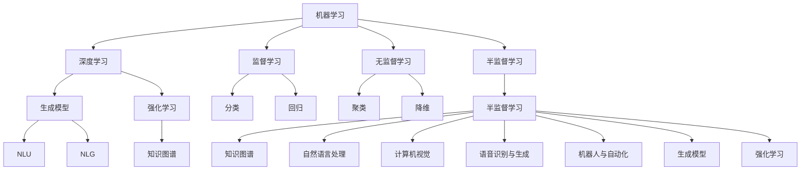

                 

## 1. 背景介绍

### 1.1 人工智能发展的独特时刻
自1950年图灵提出著名的图灵测试以来，人工智能（AI）领域已经走过了70多年的历程。回顾这段历程，我们可以看到多个标志性的时刻：

1. **1950年：图灵测试**：阿兰·图灵提出了图灵测试的概念，即如果一台机器能够以某种方式表现出类人的智能，那么它就是智能的。这一概念至今仍是AI领域的一个重要标准。

2. **1956年：达特茅斯会议**：约翰·麦卡锡、马文·明斯基、克洛普、罗切斯特在达特茅斯会议上首次提出“人工智能”一词，标志着AI成为一个独立的学科领域。

3. **1966年：Elman神经网络**：Seppo Elman 提出了一种新型的循环神经网络（RNN），开启了神经网络在序列预测任务中的新应用。

4. **1980年代：专家系统**：Mycin等专家系统在医疗领域的应用，显示了AI在知识表示与推理方面的潜力。

5. **1990年代：支持向量机（SVM）**：Vapnik提出SVM，在处理小样本和非线性问题上表现出色，极大提升了机器学习的效果。

6. **2000年：深度学习**：Hinton等人成功训练了深层神经网络（如卷积神经网络CNN、递归神经网络RNN等），引发了深度学习的热潮。

7. **2010年代：生成对抗网络（GAN）**：Goodfellow等人提出GAN，为生成模型开辟了新天地。

8. **2020年代：大模型与大规模数据训练**：GPT-3、BERT等大模型通过大规模数据训练，展现了AI的巨大潜力，引起了广泛关注。

这些时刻不仅推动了AI技术的发展，也深刻影响了社会、经济和文化的各个方面。AI已经从实验室走向了现实世界，成为推动科技进步和改变生活方式的重要力量。

### 1.2 当前AI技术的发展现状
当前，AI技术已经渗透到了各个领域，从医疗、金融、教育到制造业、农业等。AI正在改变人们的生活和工作方式，提升效率和生产力，同时也在不断挑战人类社会的伦理和法律边界。

**主要应用领域**：

- **自然语言处理（NLP）**：包括机器翻译、智能问答、文本摘要、情感分析等。
- **计算机视觉（CV）**：如图像识别、物体检测、人脸识别、自动驾驶等。
- **语音识别与生成**：如语音助手、自动语音翻译、语音合成等。
- **机器人与自动化**：如工业机器人、服务机器人、自动化流程等。
- **知识图谱与推荐系统**：如商品推荐、音乐推荐、医疗诊断等。
- **生成模型**：如图像生成、文本生成、音频生成等。

## 2. 核心概念与联系

### 2.1 核心概念概述

AI的核心概念包括但不限于：

- **机器学习**：通过数据训练模型，让模型能够自动学习特征，进行预测或分类。
- **深度学习**：使用多层神经网络进行特征提取和数据表示，提升模型的复杂度和表达能力。
- **生成模型**：如GAN、VAE等，能够生成与真实数据分布相似的新数据。
- **强化学习**：通过与环境的交互，使智能体学习最优策略。
- **知识图谱**：将实体、关系、属性等结构化信息进行表示，用于推理和查询。
- **自然语言理解（NLU）**：让计算机理解并处理自然语言，包括语言模型、句法分析、语义理解等。
- **自然语言生成（NLG）**：让计算机生成自然语言文本，包括文本摘要、对话系统等。

这些概念之间存在紧密的联系和相互作用，共同构成了AI的生态系统。

### 2.2 概念间的关系

以下是这些核心概念之间的逻辑关系，通过以下Mermaid流程图展示：



**解释**：

- 机器学习是AI的基础，包括监督学习、无监督学习和半监督学习。
- 深度学习是机器学习的一个分支，通过多层神经网络提升模型的复杂度和表达能力。
- 生成模型如GAN、VAE等，用于生成与真实数据分布相似的新数据。
- 强化学习通过与环境的交互，让智能体学习最优策略。
- 自然语言理解（NLU）和自然语言生成（NLG）是NLP的重要分支。
- 知识图谱用于表示和推理结构化信息。

这些概念相互依存、相互促进，共同推动AI技术的发展。

## 3. 核心算法原理 & 具体操作步骤

### 3.1 算法原理概述

AI算法的核心在于模型训练和优化。通过大量的数据训练模型，优化模型的参数，使得模型能够自动学习和提取特征，进行预测或分类。

**主要算法**：

- **监督学习**：通过有标签数据训练模型，使模型能够对新的数据进行分类或回归。
- **无监督学习**：通过无标签数据训练模型，使模型能够自动发现数据中的结构或模式。
- **半监督学习**：结合有标签和无标签数据训练模型，提升模型的泛化能力。
- **强化学习**：通过与环境的交互，使智能体学习最优策略。
- **深度学习**：通过多层神经网络提升模型的复杂度和表达能力。
- **生成模型**：如GAN、VAE等，用于生成与真实数据分布相似的新数据。

### 3.2 算法步骤详解

**主要算法步骤**：

1. **数据准备**：收集和处理数据，分为有标签和无标签两类。
2. **模型选择**：选择合适的模型架构和优化算法。
3. **模型训练**：使用训练数据对模型进行优化，调整参数。
4. **模型评估**：使用验证数据评估模型的性能，调整超参数。
5. **模型部署**：将训练好的模型部署到实际应用中，进行推理或预测。

### 3.3 算法优缺点

**主要优缺点**：

- **优点**：
  - 可扩展性强，适用于各种复杂任务。
  - 数据利用率高，可以处理大量数据。
  - 模型表现优秀，在很多任务上取得了最优性能。
  - 算法理论成熟，有大量研究成果和优化技术。

- **缺点**：
  - 模型训练成本高，需要大量计算资源和时间。
  - 模型复杂度高，容易过拟合。
  - 模型解释性差，难以理解其内部工作机制。
  - 数据和算法偏见问题，可能会产生歧视性输出。

### 3.4 算法应用领域

AI算法在各个领域都有广泛的应用，以下是一些主要的应用场景：

- **医疗健康**：如智能诊断、药物发现、患者管理等。
- **金融科技**：如信用评估、风险控制、智能投顾等。
- **零售电商**：如商品推荐、库存管理、客户服务等。
- **交通运输**：如自动驾驶、智能调度、交通分析等。
- **制造业**：如质量控制、设备维护、供应链优化等。
- **教育培训**：如个性化推荐、智能评估、虚拟教师等。

## 4. 数学模型和公式 & 详细讲解 & 举例说明

### 4.1 数学模型构建

AI算法的数学模型通常包括数据表示、模型结构、损失函数、优化算法等。以下是一个简单的监督学习模型的数学模型构建：

**数据表示**：
$$
x_i \in \mathbb{R}^n, y_i \in \{0, 1\}, \quad i=1,\dots,N
$$

**模型结构**：
$$
f(x; \theta) = \sum_{j=1}^m w_j \phi(x_i, x_j) + b
$$

**损失函数**：
$$
L(y, f(x; \theta)) = -(y \log f(x; \theta) + (1-y) \log (1-f(x; \theta)))
$$

**优化算法**：
$$
\theta \leftarrow \theta - \eta \nabla_{\theta}L(y, f(x; \theta))
$$

### 4.2 公式推导过程

以监督学习的逻辑回归模型为例，推导其公式：

假设训练数据集为 $D=\{(x_i,y_i)\}_{i=1}^N$，其中 $x_i \in \mathbb{R}^n, y_i \in \{0, 1\}$。定义模型参数 $\theta = (w, b)$，其中 $w \in \mathbb{R}^n$ 为权重向量，$b \in \mathbb{R}$ 为偏置。

**模型表达式**：
$$
f(x; \theta) = \sigma(\theta^T x) = \frac{1}{1+e^{-\theta^T x}}
$$

其中 $\sigma(\cdot)$ 为sigmoid函数，将模型输出映射到 $[0, 1]$ 区间内。

**损失函数**：
$$
L(y, f(x; \theta)) = -(y \log f(x; \theta) + (1-y) \log (1-f(x; \theta)))
$$

将损失函数对 $\theta$ 求导：
$$
\nabla_{\theta}L(y, f(x; \theta)) = y - f(x; \theta) \cdot \frac{f(x; \theta)}{1-f(x; \theta)} \cdot x
$$

代入梯度下降算法，更新模型参数：
$$
\theta \leftarrow \theta - \eta \nabla_{\theta}L(y, f(x; \theta))
$$

### 4.3 案例分析与讲解

以GAN为例，解释其核心思想和应用。

**核心思想**：
GAN由两个部分组成：生成器（Generator）和判别器（Discriminator）。生成器负责生成与真实数据分布相似的新数据，判别器则负责区分真实数据和生成数据。通过对抗训练，生成器和判别器互相博弈，最终生成器可以生成高质量的数据，判别器无法区分真假数据。

**主要算法步骤**：

1. 随机生成噪声 $z$，输入生成器。
2. 生成器输出数据 $G(z)$。
3. 判别器输入数据 $x$ 和 $G(z)$，输出真假概率。
4. 生成器希望判别器无法区分真假数据，因此优化目标为 $-\log D(G(z))$。
5. 判别器希望区分真实数据和生成数据，因此优化目标为 $\log D(x) + \log (1-D(G(z)))$。
6. 交替优化生成器和判别器，直到达到最优解。

## 5. 项目实践：代码实例和详细解释说明

### 5.1 开发环境搭建

在Python环境下搭建TensorFlow和Keras的开发环境，安装TensorFlow、Keras等库：

```bash
pip install tensorflow keras tensorflow-hub tensorflow-addons
```

### 5.2 源代码详细实现

以简单的手写数字识别为例，使用TensorFlow和Keras实现卷积神经网络（CNN）模型：

```python
import tensorflow as tf
from tensorflow.keras import layers

# 加载MNIST数据集
(x_train, y_train), (x_test, y_test) = tf.keras.datasets.mnist.load_data()

# 数据预处理
x_train = x_train.reshape(-1, 28, 28, 1) / 255.0
x_test = x_test.reshape(-1, 28, 28, 1) / 255.0
y_train = tf.keras.utils.to_categorical(y_train, 10)
y_test = tf.keras.utils.to_categorical(y_test, 10)

# 构建CNN模型
model = tf.keras.Sequential([
    layers.Conv2D(32, (3, 3), activation='relu', input_shape=(28, 28, 1)),
    layers.MaxPooling2D((2, 2)),
    layers.Flatten(),
    layers.Dense(10, activation='softmax')
])

# 编译模型
model.compile(optimizer='adam',
              loss='categorical_crossentropy',
              metrics=['accuracy'])

# 训练模型
model.fit(x_train, y_train, epochs=10, batch_size=32, validation_data=(x_test, y_test))
```

### 5.3 代码解读与分析

**代码解读**：

1. **数据加载与预处理**：使用TensorFlow的`tf.keras.datasets.mnist.load_data()`函数加载MNIST数据集，并进行预处理，将数据转换为浮点数归一化。
2. **模型构建**：使用Keras构建卷积神经网络模型，包括卷积层、池化层和全连接层。
3. **模型编译**：定义优化器、损失函数和评价指标，使用`model.compile()`函数编译模型。
4. **模型训练**：使用`model.fit()`函数对模型进行训练，指定训练轮数、批次大小和验证集。
5. **模型评估**：使用测试集对模型进行评估，输出准确率和损失函数。

**代码分析**：

- **数据加载**：使用TensorFlow提供的便捷函数，可以快速加载和处理数据集。
- **模型构建**：Keras提供了高级API，方便构建复杂的神经网络模型。
- **模型编译**：编译函数可以一次性定义模型的超参数和评估指标，方便管理和优化。
- **模型训练**：`model.fit()`函数可以自动完成数据迭代、模型更新和性能评估。

## 6. 实际应用场景

### 6.1 医疗健康

**主要应用**：

- **智能诊断**：使用深度学习模型分析医学影像和病历数据，辅助医生进行诊断。
- **药物发现**：利用生成模型生成分子结构，加速药物筛选和研发。
- **患者管理**：通过自然语言处理技术，自动处理患者反馈和咨询，提供个性化健康建议。

**案例分析**：

- **智能诊断**：使用卷积神经网络（CNN）分析X光片和MRI图像，识别肺部结节和肿瘤，辅助医生进行早期诊断。
- **药物发现**：使用生成对抗网络（GAN）生成化合物结构，筛选出可能的治疗药物。
- **患者管理**：使用自然语言处理技术分析患者文本记录，识别情感和症状，提供个性化的健康管理建议。

### 6.2 金融科技

**主要应用**：

- **信用评估**：使用机器学习模型分析借款人的历史数据，评估其信用风险。
- **风险控制**：利用深度学习模型监测交易数据，识别异常行为和潜在风险。
- **智能投顾**：通过推荐系统，向用户推荐投资组合和金融产品，提升用户体验。

**案例分析**：

- **信用评估**：使用逻辑回归模型分析借款人的历史还款数据和行为数据，评估其信用风险。
- **风险控制**：使用卷积神经网络（CNN）分析交易数据，识别异常交易行为。
- **智能投顾**：使用协同过滤算法和推荐系统，为用户推荐个性化的投资组合。

### 6.3 零售电商

**主要应用**：

- **商品推荐**：使用协同过滤算法和深度学习模型，向用户推荐相关商品。
- **库存管理**：利用预测模型分析销售数据，优化库存管理。
- **客户服务**：通过自然语言处理技术，自动处理客户咨询和投诉，提升客户满意度。

**案例分析**：

- **商品推荐**：使用协同过滤算法和深度学习模型，分析用户行为和商品特征，生成个性化推荐列表。
- **库存管理**：使用时间序列模型和神经网络，预测销售趋势，优化库存水平。
- **客户服务**：使用自然语言处理技术，自动处理客户咨询和投诉，提供实时响应。

### 6.4 交通运输

**主要应用**：

- **自动驾驶**：使用计算机视觉和深度学习技术，实现车辆自主导航和避障。
- **智能调度**：通过优化算法和强化学习，优化运输车辆的路线和时间。
- **交通分析**：利用深度学习模型分析交通数据，识别交通拥堵和事故。

**案例分析**：

- **自动驾驶**：使用卷积神经网络（CNN）分析摄像头和雷达数据，实现车辆自主导航和避障。
- **智能调度**：使用强化学习模型优化运输车辆的路线和时间，提升运输效率。
- **交通分析**：使用深度学习模型分析交通数据，识别交通拥堵和事故，提供实时预警。

## 7. 工具和资源推荐

### 7.1 学习资源推荐

为了深入了解AI技术，以下是一些推荐的学习资源：

1. **Coursera**：提供广泛的在线课程，涵盖机器学习、深度学习、自然语言处理等AI领域的重要内容。
2. **Kaggle**：提供数据集和竞赛平台，可以参与实际的数据分析和机器学习竞赛。
3. **DeepLearning.ai**：提供深度学习专项课程，由Andrew Ng教授主讲。
4. **ArXiv**：提供前沿论文和研究报告，了解最新的AI研究成果。
5. **OpenAI Blog**：提供OpenAI的研究进展和算法介绍，了解最新的AI动态。

### 7.2 开发工具推荐

以下是一些常用的AI开发工具：

1. **TensorFlow**：由Google开发，支持深度学习和机器学习，提供丰富的API和工具。
2. **PyTorch**：由Facebook开发，支持深度学习和机器学习，提供动态计算图和易用性。
3. **Keras**：提供高级API，方便构建和训练神经网络模型。
4. **Jupyter Notebook**：支持交互式编程和数据可视化，适合研究和开发。
5. **Scikit-learn**：提供经典的机器学习算法和工具，方便数据预处理和模型评估。

### 7.3 相关论文推荐

以下是几篇经典的AI论文，推荐阅读：

1. **《神经网络与深度学习》**：Ian Goodfellow, Yoshua Bengio, Aaron Courville著。全面介绍神经网络和深度学习的基础和应用。
2. **《深度学习》**：Ian Goodfellow, Yoshua Bengio, Aaron Courville著。介绍深度学习的理论、算法和应用。
3. **《GANs for Image Synthesis》**：Ian Goodfellow, Jean Pouget-Abadie, MéGAN Mirza, Bing Xu, David Warde-Farley, Sherjil Ozair, Aaron Courville, Yoshua Bengio著。介绍生成对抗网络（GAN）的理论和应用。
4. **《AlphaGo》**：David Silver, Nicolas Heess, Julian Schmidhuber, John Harris, Jianfeng Gao, et al.介绍AlphaGo算法和深度学习在围棋中的应用。

## 8. 总结：未来发展趋势与挑战

### 8.1 研究成果总结

AI技术在各个领域取得了显著进展，但仍然存在许多挑战和难点。以下是一些关键的总结：

- **数据依赖**：AI算法需要大量的数据进行训练和优化，但数据获取和标注成本高。
- **模型复杂**：大规模模型需要大量的计算资源和时间，模型训练成本高。
- **解释性不足**：AI模型往往是"黑盒"系统，难以解释其内部工作机制和决策逻辑。
- **偏见问题**：AI模型可能学习到有偏见的数据，产生歧视性输出。

### 8.2 未来发展趋势

未来AI技术将呈现以下几个发展趋势：

- **数据驱动**：越来越多的数据将推动AI技术的不断进步，数据质量和多样性将提升模型的表现。
- **算法优化**：算法优化将使AI模型更加高效、精确和可解释，提升AI技术的实用性。
- **跨学科融合**：AI技术将与其他学科进行更深入的融合，如医疗、金融、教育等，推动各领域的创新。
- **伦理和法律**：AI技术的伦理和法律问题将引起广泛关注，需要制定相关的法规和规范。
- **普及应用**：AI技术将越来越普及，应用到更多的生活和工作中，改变人们的生活方式。

### 8.3 面临的挑战

尽管AI技术在不断进步，但仍面临许多挑战：

- **数据隐私和安全**：大规模数据收集和使用可能带来隐私和数据安全问题。
- **算法公平性**：AI模型可能存在偏见和歧视，需要建立公平、透明的算法体系。
- **伦理和法律**：AI技术可能带来伦理和法律问题，需要制定相关的规范和标准。
- **计算资源**：大规模模型的训练和推理需要大量的计算资源，资源瓶颈仍需突破。
- **模型可解释性**：AI模型往往难以解释其内部工作机制和决策逻辑，需要提高模型的可解释性。

### 8.4 研究展望

未来的AI研究需要重点关注以下几个方向：

- **数据生成与增强**：通过生成对抗网络（GAN）和数据增强技术，生成高质量数据，提升模型性能。
- **模型优化与简化**：通过算法优化和模型简化，提升模型的计算效率和推理速度。
- **跨学科应用**：AI技术与其他学科的融合将带来新的应用场景和创新方向。
- **伦理和法律**：建立公平、透明的AI算法体系，保障数据隐私和安全。
- **模型可解释性**：提高AI模型的可解释性，使模型更容易被理解和接受。

总之，未来的AI研究需要综合考虑技术、伦理、法律等多方面因素，推动AI技术在各个领域的深入应用和普及。只有不断突破挑战，才能让AI技术更好地造福人类社会。

## 9. 附录：常见问题与解答

**Q1：AI技术需要大量的数据进行训练，但数据获取和标注成本很高，如何解决这个问题？**

A: 数据生成与增强技术如GAN、数据增强等，可以生成高质量数据，减少对标注数据的依赖。同时，分布式计算和模型优化也可以提升数据利用率，降低训练成本。

**Q2：AI模型往往复杂度高，难以解释其内部工作机制，如何提高模型的可解释性？**

A: 使用可解释性模型如LIME、SHAP等，对模型的预测结果进行解释和可视化。同时，引入符号化知识和逻辑规则，增强模型的解释性。

**Q3：AI技术可能存在偏见和歧视，如何建立公平、透明的算法体系？**

A: 引入公平性评估指标，对模型进行公平性测试和调整。建立透明的算法流程和规范，保障算法的公正性和透明性。

**Q4：AI技术的计算资源需求高，如何优化资源利用？**

A: 使用分布式计算、混合精度训练、模型压缩等技术，优化模型的计算效率和资源利用。同时，提升计算硬件的性能，支持大规模模型的训练和推理。

**Q5：AI技术的应用场景广泛，但如何在实际应用中保障数据隐私和安全？**

A: 采用数据加密、差分隐私等技术，保护用户数据隐私。同时，建立数据访问权限和审计机制，防止数据泄露和滥用。

总之，未来的AI技术需要综合考虑技术、伦理、法律等多方面因素，推动AI技术在各个领域的深入应用和普及。只有不断突破挑战，才能让AI技术更好地造福人类社会。

---

作者：禅与计算机程序设计艺术 / Zen and the Art of Computer Programming

