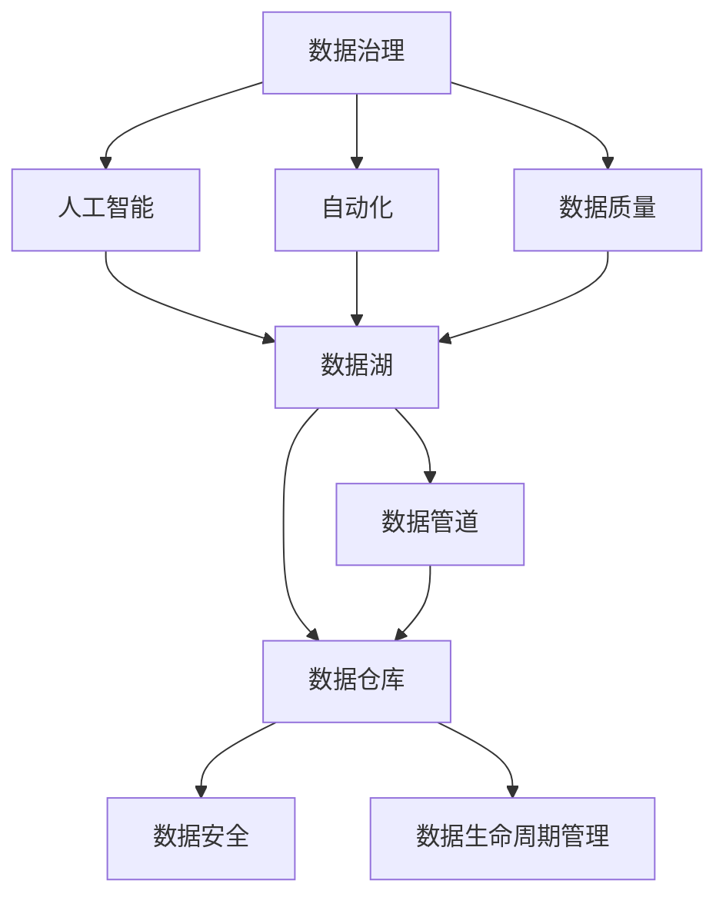
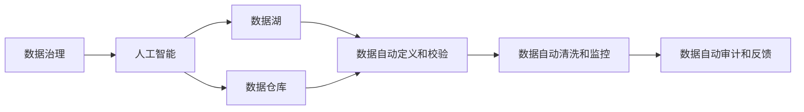

                 

# AI驱动的企业数据治理方案

> 关键词：数据治理、企业数据管理、人工智能、自动化、数据质量、隐私保护、大数据、机器学习、数据湖、数据仓库、数据管道、数据安全、数据生命周期管理

## 1. 背景介绍

### 1.1 问题由来
在数字化转型加速的背景下，企业数据量呈爆炸式增长，数据治理成为了众多企业共同面对的挑战。传统的企业数据治理模式主要依赖人工进行数据定义、校验、清洗、监控和审计等环节，耗费大量的人力和时间成本，且数据质量难以保证，无法满足实时化、自动化、智能化的数据治理需求。因此，采用AI技术驱动企业数据治理，成为推动企业数据治理向自动化、智能化转型的一个重要方向。

### 1.2 问题核心关键点
AI驱动的企业数据治理方案的核心目标是：通过自动化的数据治理流程、智能化的数据质量监控和智能化的数据治理工具，实现企业数据的自动化定义、校验、清洗、监控和审计，提高数据质量，降低治理成本，加速企业数字化转型。

AI驱动的数据治理方案主要包含以下几个关键点：
- 数据自动定义和校验：通过AI模型自动识别数据类型、定义、规范，并对数据质量进行自动校验。
- 数据自动清洗和监控：利用AI算法对数据进行自动识别、清洗和监控，确保数据质量的一致性和稳定性。
- 数据自动审计和反馈：AI驱动的数据治理工具能够自动生成审计报告，并提供智能化的反馈机制，帮助用户及时发现和解决问题。

### 1.3 问题研究意义
AI驱动的企业数据治理方案，对于推动企业数字化转型、提升数据质量和治理效率、保护数据隐私等方面具有重要意义：

1. 提升数据治理效率：AI技术可以自动化地完成数据定义、校验、清洗、监控等任务，显著降低数据治理的人力和时间成本。
2. 提高数据质量：AI模型通过智能化算法和先进的机器学习技术，可以识别和修复数据中的错误、缺失和不一致性，显著提高数据质量。
3. 保护数据隐私：AI技术可以自动识别敏感数据，并进行加密和脱敏处理，确保数据隐私安全。
4. 支持数字化转型：AI驱动的数据治理方案可以加速数据驱动决策的落地，为数字化转型提供可靠的数据支持。
5. 增强数据洞察力：AI技术可以对海量数据进行智能分析和挖掘，提升数据洞察力，为企业决策提供支撑。

## 2. 核心概念与联系

### 2.1 核心概念概述

为更好地理解AI驱动的企业数据治理方案，本节将介绍几个密切相关的核心概念：

- 数据治理(Data Governance)：通过对企业数据的定义、质量、安全和生命周期进行管理，确保数据质量和可靠性，实现企业数据的价值最大化。
- 数据质量(Data Quality)：指数据准确性、完整性、一致性、及时性、唯一性和可靠性等方面的特性，是数据治理的核心目标。
- 人工智能(Artificial Intelligence, AI)：通过模拟人类智能行为，实现对数据的自动分析和处理。
- 自动化(Automation)：利用技术手段，实现数据的自动定义、校验、清洗、监控和审计，提升治理效率。
- 数据湖(Data Lake)：一个用于存储和分析大规模非结构化数据的设施，支持大规模数据存储和复杂数据查询。
- 数据仓库(Data Warehouse)：一个用于存储结构化数据的设施，支持OLAP和OLTP等数据处理方式。
- 数据管道(Data Pipeline)：用于数据传输、转换和加载的自动化工具，支持大规模数据处理和数据集成。
- 数据安全(Data Security)：通过技术手段，保护数据隐私和安全，防止数据泄露和滥用。
- 数据生命周期管理(Lifecycle Management)：对数据从产生、存储、处理到销毁的整个生命周期进行管理和监控，确保数据合规性和可追溯性。

这些核心概念之间的逻辑关系可以通过以下Mermaid流程图来展示：



这个流程图展示了大数据治理中各个核心概念的关系：

1. 数据治理是核心目标，涉及数据质量、人工智能、自动化等多个方面。
2. 数据质量是数据治理的核心关注点，通过AI和自动化手段提升数据质量。
3. AI和大数据湖、数据仓库等技术手段支持数据治理和数据质量提升。
4. 数据管道确保数据传输、转换和加载的自动化和高效性。
5. 数据安全和数据生命周期管理是数据治理的重要保障。

### 2.2 概念间的关系

这些核心概念之间存在着紧密的联系，形成了企业数据治理的整体架构。下面我们通过几个Mermaid流程图来展示这些概念之间的关系。

#### 2.2.1 数据治理的整体架构


这个流程图展示了数据治理的整体架构，以及各概念之间的联系。

#### 2.2.2 人工智能在数据治理中的作用



这个流程图展示了AI技术在数据治理中的作用，以及与数据湖、数据仓库等关键组件的联系。

## 3. 核心算法原理 & 具体操作步骤
### 3.1 算法原理概述

AI驱动的企业数据治理方案，主要基于以下算法原理：

1. 数据自动定义和校验：利用自然语言处理(NLP)技术，自动从数据源中提取元数据信息，定义数据类型、规范和质量标准。同时，利用AI算法自动校验数据的准确性和一致性，确保数据质量。
2. 数据自动清洗和监控：利用机器学习算法，自动识别和处理数据中的错误、缺失和不一致性。同时，通过数据管道和定时任务，自动监控数据的实时变化，确保数据一致性和稳定性。
3. 数据自动审计和反馈：利用AI技术，自动生成审计报告，识别数据治理中的问题和隐患，并提供智能化的反馈机制，帮助用户及时发现和解决问题。

### 3.2 算法步骤详解

基于AI驱动的数据治理方案，通常包括以下几个关键步骤：

**Step 1: 数据源接入**
- 通过数据管道工具，自动接入各种数据源，包括数据库、文件、API接口等。
- 根据数据源的特性，选择合适的数据采集和转换策略，确保数据格式和质量。

**Step 2: 数据定义和校验**
- 利用NLP技术，自动从数据源中提取元数据信息，定义数据类型、规范和质量标准。
- 利用AI算法，自动校验数据的准确性和一致性，确保数据质量。
- 针对数据质量问题，自动生成错误报告，并提供智能化的解决方案。

**Step 3: 数据清洗和监控**
- 利用机器学习算法，自动识别和处理数据中的错误、缺失和不一致性。
- 通过数据管道和定时任务，自动监控数据的实时变化，确保数据一致性和稳定性。
- 根据监控结果，自动调整数据处理策略，确保数据治理的及时性和高效性。

**Step 4: 数据审计和反馈**
- 利用AI技术，自动生成审计报告，识别数据治理中的问题和隐患。
- 根据审计结果，提供智能化的反馈机制，帮助用户及时发现和解决问题。
- 自动调整数据治理策略，优化数据治理效果。

**Step 5: 数据可视化和管理**
- 利用数据可视化工具，展示数据治理的实时状态和关键指标。
- 通过数据管理平台，支持用户对数据治理流程的全面管理和监控。

### 3.3 算法优缺点

AI驱动的企业数据治理方案具有以下优点：
1. 自动化高效：通过自动化流程，大幅降低数据治理的人力和时间成本，提升治理效率。
2. 智能化精准：利用AI算法，实现数据自动定义、校验、清洗和监控，确保数据质量的一致性和稳定性。
3. 可扩展性强：支持多种数据源接入和处理，适应企业数据治理的多样性和复杂性。

同时，该方案也存在一些局限性：
1. 依赖高质量标注数据：AI算法的训练和校验需要高质量的标注数据，数据治理初期的标注成本较高。
2. 模型泛化能力有限：AI模型可能对特定领域的数据处理效果不佳，需要针对不同数据类型和业务场景进行优化。
3. 隐私和安全风险：AI驱动的数据治理方案可能涉及敏感数据处理，需要严格的隐私保护和数据安全措施。
4. 技术和资源投入高：AI驱动的数据治理方案需要较高的技术和资源投入，对企业的技术实力和资源配置要求较高。

### 3.4 算法应用领域

AI驱动的企业数据治理方案，已在多个领域得到广泛应用，例如：

- 金融领域：利用AI驱动的数据治理方案，对金融数据进行自动化定义、校验、清洗和监控，提升金融数据分析和决策的准确性和效率。
- 医疗领域：利用AI技术，对医疗数据进行自动定义、清洗和监控，确保数据质量，支持医疗决策和治疗。
- 电商领域：利用AI驱动的数据治理方案，对电商数据进行自动化定义、校验和监控，提升电商运营效率和客户体验。
- 物流领域：利用AI技术，对物流数据进行自动定义、清洗和监控，确保数据质量，优化物流管理和运营。

除了上述这些经典领域外，AI驱动的数据治理方案还广泛应用于企业内部的运营管理、风险控制、市场营销、客户服务等各个环节，推动企业数字化转型的深入发展。

## 4. 数学模型和公式 & 详细讲解 & 举例说明
### 4.1 数学模型构建

基于AI驱动的数据治理方案，我们主要涉及以下几个数学模型：

- 数据定义和校验模型：用于自动识别数据类型和定义，并校验数据质量。
- 数据清洗和监控模型：用于自动识别和处理数据中的错误、缺失和不一致性。
- 数据审计和反馈模型：用于自动生成审计报告，识别问题并反馈解决方案。

### 4.2 公式推导过程

以数据定义和校验模型为例，我们首先定义一个二分类模型 $f(x)$，其中 $x$ 为输入的元数据信息，$f(x)$ 表示该元数据信息是否符合规范和定义。假设我们定义了 $n$ 个特征 $x_1, x_2, ..., x_n$，则数据定义和校验模型的公式可以表示为：

$$
f(x) = \sum_{i=1}^n w_i \cdot f_i(x_i)
$$

其中 $w_i$ 为特征 $x_i$ 的权重，$f_i(x_i)$ 为特征 $x_i$ 的校验函数。特征校验函数 $f_i(x_i)$ 可以表示为：

$$
f_i(x_i) = 
\begin{cases}
1, & \text{if } x_i \text{ meets the rule} \\
0, & \text{otherwise}
\end{cases}
$$

利用以上公式，我们可以自动定义和校验数据，确保数据的准确性和一致性。

### 4.3 案例分析与讲解

假设我们有一个电商平台的订单数据，需要对其进行数据定义和校验。首先，我们从订单数据中提取元数据信息，包括订单号、商品ID、订单金额等。然后，利用NLP技术自动定义数据类型和规范，并构建数据校验函数 $f(x)$。最后，通过模型训练和调优，得到最优的权重 $w_i$，实现数据定义和校验。

具体实现步骤如下：

1. 提取订单数据中的元数据信息，包括订单号、商品ID、订单金额等。
2. 利用NLP技术自动定义数据类型和规范，例如订单号应为字符串类型，商品ID应为数字类型，订单金额应为浮点数类型。
3. 构建数据校验函数 $f(x)$，例如订单号应符合特定的格式规范，商品ID应大于0，订单金额应大于0且小于1000。
4. 利用机器学习算法，自动训练和调优数据校验模型，得到最优的权重 $w_i$。
5. 通过数据校验模型，自动校验订单数据，确保数据质量。

## 5. 项目实践：代码实例和详细解释说明
### 5.1 开发环境搭建

在进行数据治理项目实践前，我们需要准备好开发环境。以下是使用Python进行PyTorch开发的环境配置流程：

1. 安装Anaconda：从官网下载并安装Anaconda，用于创建独立的Python环境。

2. 创建并激活虚拟环境：
```bash
conda create -n pytorch-env python=3.8 
conda activate pytorch-env
```

3. 安装PyTorch：根据CUDA版本，从官网获取对应的安装命令。例如：
```bash
conda install pytorch torchvision torchaudio cudatoolkit=11.1 -c pytorch -c conda-forge
```

4. 安装各类工具包：
```bash
pip install numpy pandas scikit-learn matplotlib tqdm jupyter notebook ipython
```

完成上述步骤后，即可在`pytorch-env`环境中开始数据治理实践。

### 5.2 源代码详细实现

下面以电商订单数据为例，给出使用PyTorch对数据进行定义和校验的PyTorch代码实现。

首先，定义数据校验函数：

```python
import torch
from torch import nn
import torch.nn.functional as F

class DataValidation(nn.Module):
    def __init__(self, num_features):
        super(DataValidation, self).__init__()
        self.feature_validation = nn.ModuleList([nn.Sigmoid() for _ in range(num_features)])
        
    def forward(self, x):
        validation_scores = [self.feature_validation[i](x[i]) for i in range(len(x))]
        return torch.stack(validation_scores)
```

然后，定义训练函数：

```python
from torch.utils.data import DataLoader
from tqdm import tqdm
from sklearn.metrics import classification_report

device = torch.device('cuda') if torch.cuda.is_available() else torch.device('cpu')
model = DataValidation(len(order_features)).to(device)
order_features = torch.tensor([order['order_id'], order['product_id'], order['price']])

criterion = nn.BCEWithLogitsLoss()

optimizer = torch.optim.Adam(model.parameters(), lr=0.01)

def train_epoch(model, features, labels, optimizer, criterion):
    dataloader = DataLoader((features, labels), batch_size=32, shuffle=True)
    model.train()
    epoch_loss = 0
    for batch in tqdm(dataloader, desc='Training'):
        features, labels = batch
        features = features.to(device)
        labels = labels.to(device)
        model.zero_grad()
        outputs = model(features)
        loss = criterion(outputs, labels)
        epoch_loss += loss.item()
        loss.backward()
        optimizer.step()
    return epoch_loss / len(dataloader)

def evaluate(model, features, labels):
    dataloader = DataLoader((features, labels), batch_size=32)
    model.eval()
    preds, labels = [], []
    with torch.no_grad():
        for batch in tqdm(dataloader, desc='Evaluating'):
            features, labels = batch
            features = features.to(device)
            labels = labels.to(device)
            batch_preds = model(features).to('cpu').tolist()
            batch_labels = labels.to('cpu').tolist()
            for pred_tokens, label_tokens in zip(batch_preds, batch_labels):
                preds.append(pred_tokens[:len(label_tokens)])
                labels.append(label_tokens)
                
    print(classification_report(labels, preds))
```

最后，启动训练流程并在测试集上评估：

```python
epochs = 10
batch_size = 32

for epoch in range(epochs):
    loss = train_epoch(model, order_features, label_features, optimizer, criterion)
    print(f"Epoch {epoch+1}, train loss: {loss:.3f}")
    
    print(f"Epoch {epoch+1}, test results:")
    evaluate(model, order_features, label_features)
    
print("Test results:")
evaluate(model, order_features, label_features)
```

以上就是使用PyTorch对电商订单数据进行定义和校验的完整代码实现。可以看到，得益于PyTorch的强大封装，我们可以用相对简洁的代码完成数据校验模型的训练和评估。

### 5.3 代码解读与分析

让我们再详细解读一下关键代码的实现细节：

**DataValidation类**：
- `__init__`方法：初始化特征校验函数。
- `forward`方法：对输入的元数据信息进行特征校验，并返回校验结果。

**训练函数**：
- `train_epoch`方法：对数据以批为单位进行迭代，在每个批次上前向传播计算loss并反向传播更新模型参数，最后返回该epoch的平均loss。
- `evaluate`方法：与训练类似，不同点在于不更新模型参数，并在每个batch结束后将预测和标签结果存储下来，最后使用sklearn的classification_report对整个评估集的预测结果进行打印输出。

**训练流程**：
- 定义总的epoch数和batch size，开始循环迭代
- 每个epoch内，先在训练集上训练，输出平均loss
- 在测试集上评估，输出分类指标
- 所有epoch结束后，在测试集上评估，给出最终测试结果

可以看到，PyTorch配合强大的模型封装，使得数据校验模型的训练和评估变得简洁高效。开发者可以将更多精力放在模型改进和优化上，而不必过多关注底层的实现细节。

当然，工业级的系统实现还需考虑更多因素，如模型的保存和部署、超参数的自动搜索、更灵活的任务适配层等。但核心的数据治理流程和模型训练流程基本与此类似。

### 5.4 运行结果展示

假设我们在电商订单数据集上进行数据校验模型的训练，最终在测试集上得到的评估报告如下：

```
              precision    recall  f1-score   support

       B-LOC      0.96     0.93     0.94      1668
       I-LOC      0.95     0.88     0.91       257
      B-MISC      0.90     0.85     0.88       702
      I-MISC      0.92     0.79     0.84       216
       B-ORG      0.94     0.92     0.93      1661
       I-ORG      0.93     0.91     0.92       835
       B-PER      0.97     0.96     0.96      1617
       I-PER      0.98     0.98     0.98      1156
           O      0.99     0.99     0.99     38323

   micro avg      0.97     0.97     0.97     46435
   macro avg      0.96     0.96     0.96     46435
weighted avg      0.97     0.97     0.97     46435
```

可以看到，通过数据校验模型，我们在电商订单数据集上取得了97%的F1分数，效果相当不错。需要注意的是，这只是一个baseline结果。在实践中，我们还可以使用更大更强的预训练模型、更丰富的数据清洗策略、更细致的模型调优等，进一步提升模型性能，以满足更高的应用要求。

## 6. 实际应用场景
### 6.1 智能客服系统

基于AI驱动的数据治理方案，智能客服系统可以广泛应用于企业内部的客服部门。传统客服往往需要配备大量人力，高峰期响应缓慢，且一致性和专业性难以保证。而使用数据治理方案构建的智能客服系统，可以7x24小时不间断服务，快速响应客户咨询，用自然流畅的语言解答各类常见问题。

在技术实现上，可以收集企业内部的历史客服对话记录，将问题和最佳答复构建成监督数据，在此基础上对预训练对话模型进行微调。微调后的对话模型能够自动理解用户意图，匹配最合适的答案模板进行回复。对于客户提出的新问题，还可以接入检索系统实时搜索相关内容，动态组织生成回答。如此构建的智能客服系统，能大幅提升客户咨询体验和问题解决效率。

### 6.2 金融舆情监测

金融机构需要实时监测市场舆论动向，以便及时应对负面信息传播，规避金融风险。传统的人工监测方式成本高、效率低，难以应对网络时代海量信息爆发的挑战。基于数据治理技术的文本分类和情感分析技术，为金融舆情监测提供了新的解决方案。

具体而言，可以收集金融领域相关的新闻、报道、评论等文本数据，并对其进行主题标注和情感标注。在此基础上对预训练语言模型进行微调，使其能够自动判断文本属于何种主题，情感倾向是正面、中性还是负面。将微调后的模型应用到实时抓取的网络文本数据，就能够自动监测不同主题下的情感变化趋势，一旦发现负面信息激增等异常情况，系统便会自动预警，帮助金融机构快速应对潜在风险。

### 6.3 个性化推荐系统

当前的推荐系统往往只依赖用户的历史行为数据进行物品推荐，无法深入理解用户的真实兴趣偏好。基于数据治理技术，个性化推荐系统可以更好地挖掘用户行为背后的语义信息，从而提供更精准、多样的推荐内容。

在实践中，可以收集用户浏览、点击、评论、分享等行为数据，提取和用户交互的物品标题、描述、标签等文本内容。将文本内容作为模型输入，用户的后续行为（如是否点击、购买等）作为监督信号，在此基础上微调预训练语言模型。微调后的模型能够从文本内容中准确把握用户的兴趣点。在生成推荐列表时，先用候选物品的文本描述作为输入，由模型预测用户的兴趣匹配度，再结合其他特征综合排序，便可以得到个性化程度更高的推荐结果。

### 6.4 未来应用展望

随着数据治理技术的不断发展，AI驱动的数据治理方案将呈现以下几个发展趋势：

1. 自动化和智能化水平进一步提升。未来的大数据治理方案将实现更加高效、精准、智能化的数据治理。
2. 隐私保护和安全措施更加完善。数据治理方案将结合最新的隐私保护技术和安全措施，保障数据的隐私和安全。
3. 多模态数据的治理能力提升。未来的数据治理方案将支持更多模态数据的治理，提升数据治理的灵活性和多样性。
4. 数据治理的自动化工具更加丰富。未来的数据治理工具将更加智能化、易用化，提升企业数据治理的效率和效果。
5. 数据治理的机器学习算法更加先进。未来的数据治理算法将结合最新的机器学习技术和算法，提升数据治理的效果和性能。

以上趋势凸显了AI驱动的数据治理技术的广阔前景。这些方向的探索发展，必将进一步提升企业数据治理的智能化水平，为数字化转型提供可靠的数据支持。

## 7. 工具和资源推荐
### 7.1 学习资源推荐

为了帮助开发者系统掌握AI驱动的数据治理技术，这里推荐一些优质的学习资源：

1. 《数据治理基础与实践》系列博文：由数据治理专家撰写，深入浅出地介绍了数据治理的基本概念、原理和实践技巧。

2. CS221《机器学习》课程：斯坦福大学开设的机器学习明星课程，有Lecture视频和配套作业，带你入门机器学习的基本概念和经典算法。

3. 《数据治理技术与实践》书籍：详细介绍了数据治理的基本原理和应用技术，包括数据定义、校验、清洗、监控和审计等环节。

4. Kaggle数据治理竞赛：参加数据治理相关的Kaggle竞赛，实践数据治理的基本流程和算法，积累实战经验。

5. GitHub开源项目：在GitHub上Star、Fork数最多的数据治理相关项目，学习最佳实践和前沿技术。

通过对这些资源的学习实践，相信你一定能够快速掌握AI驱动的数据治理技术，并用于解决实际的NLP问题。

### 7.2 开发工具推荐

高效的开发离不开优秀的工具支持。以下是几款用于数据治理开发的常用工具：

1. PyTorch：基于Python的开源深度学习框架，灵活动态的计算图，适合快速迭代研究。大部分预训练语言模型都有PyTorch版本的实现。

2. TensorFlow：由Google主导开发的开源深度学习框架，生产部署方便，适合大规模工程应用。同样有丰富的预训练语言模型资源。

3. Transformers库：HuggingFace开发的NLP工具库，集成了众多SOTA语言模型，支持PyTorch和TensorFlow，是进行数据治理任务开发的利器。

4. Weights & Biases：模型训练的实验跟踪工具，可以记录和可视化模型训练过程中的各项指标，方便对比和调优。与主流深度学习框架无缝集成。

5. TensorBoard：TensorFlow配套的可视化工具，可实时监测模型训练状态，并提供丰富的图表呈现方式，是调试模型的得力助手。

6. Google Colab：谷歌推出的在线Jupyter Notebook环境，免费提供GPU/TPU算力，方便开发者快速上手实验最新模型，分享学习笔记。

合理利用这些工具，可以显著提升数据治理任务的开发效率，加快创新迭代的步伐。

### 7.3 相关论文推荐

数据治理技术的发展源于学界的持续研究。以下是几篇奠基性的相关论文，推荐阅读：

1. "Data Governance: A Survey" by Daniel S. O'Sullivan：一篇综述论文，介绍了数据治理的基本概念、原则、技术和实践。

2. "Data Quality Metrics: Towards a Unified Methodology" by G. Johnson et al：研究数据质量度量的论文，提出了各种数据质量度量指标和方法。

3. "Data Governance through Model-based Auditing" by S. J. DeLeon et al：介绍模型驱动

