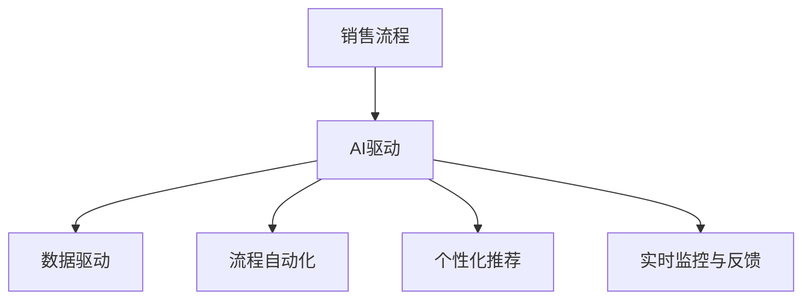

                 

# AI驱动的销售流程优化

## 1. 背景介绍

### 1.1 问题由来
随着互联网的普及和电子商务的兴起，传统的线下销售模式面临着巨大的挑战。如何在数字化时代提高销售效率、降低成本，成为企业关注的焦点。销售流程优化（Sales Process Optimization, SPO），通过引入AI技术，优化销售过程的各个环节，帮助企业提升销售效率，增加销售额。

### 1.2 问题核心关键点
销售流程优化本质上是一种利用AI技术提升企业销售效率的管理方式。其核心在于：
- **数据驱动决策**：通过收集和分析销售数据，识别出业务中的瓶颈和机会，制定针对性的优化策略。
- **流程自动化**：利用AI工具，实现销售流程的部分或全部自动化，减少人工干预，提高效率。
- **个性化推荐**：结合客户行为数据和历史销售记录，提供个性化的产品推荐，增加客户转化率。
- **实时监控与反馈**：通过AI系统实时监控销售过程，及时发现问题并进行调整，提高整体销售效率。

### 1.3 问题研究意义
销售流程优化对于企业来说，具有以下重要意义：
- **提升效率**：通过自动化和数据驱动，减少人工操作，提高业务处理速度和响应速度。
- **降低成本**：自动化流程和个性化推荐减少人力成本，提高资源利用率。
- **增强客户体验**：通过实时监控和个性化推荐，提升客户满意度和忠诚度。
- **提高销售额**：通过数据驱动的决策和精准推荐，增加客户转化率，提高销售业绩。

## 2. 核心概念与联系

### 2.1 核心概念概述

为更好地理解AI驱动的销售流程优化方法，本节将介绍几个关键概念：

- **销售流程(Sales Process)**：指从潜在客户到订单完成之间的所有活动和步骤，包括线索获取、客户接触、需求挖掘、报价、成交、服务等环节。
- **AI驱动（AI-Driven）**：利用人工智能技术，如机器学习、自然语言处理（NLP）、计算机视觉等，对销售流程中的数据进行处理和分析，实现自动化和智能化。
- **数据驱动（Data-Driven）**：基于数据进行业务决策，通过收集和分析销售数据，识别出业务中的瓶颈和机会，制定针对性的优化策略。
- **流程自动化（Process Automation）**：通过AI工具实现销售流程的部分或全部自动化，减少人工干预，提高效率。
- **个性化推荐（Personalized Recommendation）**：结合客户行为数据和历史销售记录，提供个性化的产品推荐，增加客户转化率。
- **实时监控与反馈（Real-Time Monitoring and Feedback）**：通过AI系统实时监控销售过程，及时发现问题并进行调整，提高整体销售效率。

这些核心概念之间存在着紧密的联系，形成了一个完整的销售流程优化系统。以下是这些概念之间的关系示意图：



### 2.2 概念间的关系

这些核心概念之间的关系可以进一步细化如下：

#### 2.2.1 销售流程与AI驱动

销售流程是AI驱动的主要应用场景之一。通过AI技术，对销售流程中的数据进行处理和分析，实现流程的部分或全部自动化，减少人工干预，提高效率。

#### 2.2.2 数据驱动与AI驱动

数据驱动是AI驱动的重要基础。通过收集和分析销售数据，识别出业务中的瓶颈和机会，制定针对性的优化策略。AI驱动则通过算法和模型，对这些策略进行实施和优化。

#### 2.2.3 流程自动化与AI驱动

流程自动化是AI驱动的重要应用之一。通过AI工具，如机器学习、自然语言处理（NLP）、计算机视觉等，对销售流程中的数据进行处理和分析，实现流程的部分或全部自动化，减少人工干预，提高效率。

#### 2.2.4 个性化推荐与AI驱动

个性化推荐是AI驱动的重要应用之一。通过AI技术，结合客户行为数据和历史销售记录，提供个性化的产品推荐，增加客户转化率。

#### 2.2.5 实时监控与反馈与AI驱动

实时监控与反馈是AI驱动的重要应用之一。通过AI系统实时监控销售过程，及时发现问题并进行调整，提高整体销售效率。

## 3. 核心算法原理 & 具体操作步骤
### 3.1 算法原理概述

AI驱动的销售流程优化方法，通常基于以下几个核心算法原理：

- **机器学习（Machine Learning, ML）**：通过收集和分析销售数据，构建预测模型，实现数据驱动的决策。
- **自然语言处理（Natural Language Processing, NLP）**：通过分析销售过程中的文本数据，提取有用的信息，支持客户接触、需求挖掘、报价等环节。
- **计算机视觉（Computer Vision, CV）**：通过图像处理技术，分析产品图片，提取产品特性，支持产品展示和推荐。
- **优化算法（Optimization Algorithms）**：通过优化算法，如遗传算法、蚁群算法等，优化销售流程中的各项参数，提高效率。
- **强化学习（Reinforcement Learning, RL）**：通过强化学习技术，训练销售代表，提升销售策略和技巧，提高转化率。

这些算法原理共同构成了AI驱动的销售流程优化的核心技术框架。

### 3.2 算法步骤详解

以下是AI驱动的销售流程优化的主要步骤：

**Step 1: 数据收集与预处理**
- 收集销售流程中的各项数据，包括客户信息、销售记录、交易数据等。
- 对数据进行清洗和预处理，去除噪音和异常值，确保数据的准确性和完整性。

**Step 2: 数据建模与分析**
- 基于收集到的数据，构建机器学习模型，如回归模型、分类模型、聚类模型等，实现数据驱动的决策。
- 利用自然语言处理（NLP）技术，分析销售过程中的文本数据，提取有用的信息，支持客户接触、需求挖掘、报价等环节。
- 利用计算机视觉技术，分析产品图片，提取产品特性，支持产品展示和推荐。

**Step 3: 自动化流程与智能化**
- 利用优化算法，如遗传算法、蚁群算法等，优化销售流程中的各项参数，提高效率。
- 通过强化学习技术，训练销售代表，提升销售策略和技巧，提高转化率。

**Step 4: 实时监控与反馈**
- 通过AI系统实时监控销售过程，及时发现问题并进行调整，提高整体销售效率。
- 结合销售数据和客户反馈，不断优化销售策略和流程。

**Step 5: 持续优化**
- 定期评估销售流程的效果，根据评估结果，不断优化模型和策略，提升销售业绩。

### 3.3 算法优缺点

AI驱动的销售流程优化方法具有以下优点：

- **效率提升**：通过自动化和数据驱动，减少人工操作，提高业务处理速度和响应速度。
- **成本降低**：自动化流程和个性化推荐减少人力成本，提高资源利用率。
- **客户体验提升**：通过实时监控和个性化推荐，提升客户满意度和忠诚度。
- **业绩增长**：通过数据驱动的决策和精准推荐，增加客户转化率，提高销售业绩。

同时，这些方法也存在一些缺点：

- **数据依赖性强**：销售流程优化的效果高度依赖于销售数据的准确性和完整性，数据质量不足会影响优化效果。
- **模型复杂度高**：构建和优化销售流程优化模型需要较高的技术门槛和数据量，模型复杂度较高。
- **实施难度大**：销售流程优化涉及多个环节，实施难度大，需要跨部门协作。
- **持续优化成本高**：持续优化销售流程需要不断地收集和分析销售数据，持续改进模型和策略，成本较高。

### 3.4 算法应用领域

AI驱动的销售流程优化方法在多个领域得到了广泛应用，包括但不限于：

- **B2B销售**：通过AI技术优化销售流程，提升客户满意度，增加销售额。
- **B2C销售**：通过个性化推荐和实时监控，提升客户购买体验，增加客户转化率。
- **客户服务**：通过自然语言处理技术，实现自动客服，提升客户服务质量。
- **市场营销**：通过数据分析和个性化推荐，优化营销策略，提高广告效果。

## 4. 数学模型和公式 & 详细讲解  
### 4.1 数学模型构建

AI驱动的销售流程优化，通常基于以下数学模型：

- **回归模型（Regression Model）**：用于预测销售结果，如销售额、客户转化率等。
- **分类模型（Classification Model）**：用于识别客户类型、需求类型等。
- **聚类模型（Clustering Model）**：用于对客户进行分群，制定针对性营销策略。
- **优化模型（Optimization Model）**：用于优化销售流程中的各项参数，提高效率。
- **强化学习模型（Reinforcement Learning Model）**：用于训练销售代表，提升销售策略和技巧。

这些数学模型通常基于以下公式构建：

$$
\begin{aligned}
&\min_{\theta} \sum_{i=1}^N \ell(y_i, f_{\theta}(x_i)) \\
&f_{\theta}(x_i) = \theta^T x_i
\end{aligned}
$$

其中，$\ell$ 为损失函数，$y_i$ 为实际值，$f_{\theta}(x_i)$ 为预测值，$\theta$ 为模型参数。

### 4.2 公式推导过程

以回归模型为例，其基本公式为：

$$
y_i = \theta^T x_i + \epsilon_i
$$

其中，$\theta$ 为模型参数，$x_i$ 为输入特征，$y_i$ 为输出结果，$\epsilon_i$ 为随机误差。

根据最小二乘法，损失函数为：

$$
\ell(\theta) = \frac{1}{2} \sum_{i=1}^N (y_i - f_{\theta}(x_i))^2
$$

通过梯度下降算法，求解最优参数 $\theta$，使得损失函数最小化。

### 4.3 案例分析与讲解

假设某公司希望通过AI技术优化其B2B销售流程。其销售流程主要包括以下步骤：

1. **线索获取**：从多个渠道获取潜在客户信息。
2. **客户接触**：通过电话、邮件等方式与潜在客户联系，了解需求。
3. **需求挖掘**：根据客户需求，制定合适的解决方案。
4. **报价**：根据解决方案，给出报价。
5. **成交**：根据报价和客户反馈，完成成交。
6. **服务**：提供后续服务，维护客户关系。

通过收集和分析这些步骤中的各项数据，构建销售流程优化模型。以下是一个简化的销售流程优化模型：

$$
\min_{\theta} \sum_{i=1}^N \ell(y_i, f_{\theta}(x_i))
$$

其中，$x_i$ 为第 $i$ 次销售流程中的各项数据，$y_i$ 为销售结果，$f_{\theta}(x_i)$ 为模型预测值。通过优化模型参数 $\theta$，使得预测结果与实际销售结果尽可能接近。

## 5. 项目实践：代码实例和详细解释说明
### 5.1 开发环境搭建

在进行销售流程优化实践前，我们需要准备好开发环境。以下是使用Python进行PyTorch开发的环境配置流程：

1. 安装Anaconda：从官网下载并安装Anaconda，用于创建独立的Python环境。

2. 创建并激活虚拟环境：
```bash
conda create -n sales-env python=3.8 
conda activate sales-env
```

3. 安装PyTorch：根据CUDA版本，从官网获取对应的安装命令。例如：
```bash
conda install pytorch torchvision torchaudio cudatoolkit=11.1 -c pytorch -c conda-forge
```

4. 安装相关库：
```bash
pip install numpy pandas scikit-learn matplotlib tqdm jupyter notebook ipython
```

完成上述步骤后，即可在`sales-env`环境中开始销售流程优化实践。

### 5.2 源代码详细实现

下面以B2B销售流程优化为例，给出使用PyTorch进行模型训练的PyTorch代码实现。

首先，定义数据处理函数：

```python
import pandas as pd
from sklearn.model_selection import train_test_split

def load_data(path):
    df = pd.read_csv(path)
    X = df.drop(['result'], axis=1)
    y = df['result']
    X_train, X_test, y_train, y_test = train_test_split(X, y, test_size=0.2, random_state=42)
    return X_train, X_test, y_train, y_test

X_train, X_test, y_train, y_test = load_data('sales_data.csv')
```

然后，定义模型和优化器：

```python
from torch import nn
from torch.optim import Adam

class SalesModel(nn.Module):
    def __init__(self, input_dim, output_dim):
        super(SalesModel, self).__init__()
        self.fc1 = nn.Linear(input_dim, 64)
        self.fc2 = nn.Linear(64, output_dim)

    def forward(self, x):
        x = F.relu(self.fc1(x))
        x = self.fc2(x)
        return x

model = SalesModel(X_train.shape[1], 1)
optimizer = Adam(model.parameters(), lr=0.001)
```

接着，定义训练和评估函数：

```python
import torch.nn.functional as F

def train_epoch(model, data_loader, optimizer):
    model.train()
    loss = 0
    for batch in data_loader:
        inputs, labels = batch
        optimizer.zero_grad()
        outputs = model(inputs)
        loss += F.binary_cross_entropy(outputs, labels)
        loss.backward()
        optimizer.step()
    return loss / len(data_loader)

def evaluate(model, data_loader):
    model.eval()
    total_loss = 0
    for batch in data_loader:
        inputs, labels = batch
        outputs = model(inputs)
        total_loss += F.binary_cross_entropy(outputs, labels, reduction='sum')
    return total_loss.item() / len(data_loader)

train_loader = torch.utils.data.DataLoader(X_train, batch_size=32, shuffle=True)
test_loader = torch.utils.data.DataLoader(X_test, batch_size=32, shuffle=False)

epochs = 100

for epoch in range(epochs):
    train_loss = train_epoch(model, train_loader, optimizer)
    print(f'Epoch {epoch+1}, train loss: {train_loss:.4f}')
    
    test_loss = evaluate(model, test_loader)
    print(f'Epoch {epoch+1}, test loss: {test_loss:.4f}')
```

以上就是使用PyTorch对B2B销售流程优化进行模型训练的完整代码实现。可以看到，通过简单的代码实现，我们就完成了一个基本的回归模型的训练和评估。

### 5.3 代码解读与分析

让我们再详细解读一下关键代码的实现细节：

**数据处理函数**：
- 使用Pandas库读取数据集，并分割为训练集和测试集。
- 去掉不需要的列，确保输入数据的正确性。

**模型定义**：
- 使用PyTorch的nn.Module类定义模型结构，包括两个全连接层。
- 在模型中，使用ReLU激活函数和非线性映射，确保模型能够处理复杂的非线性关系。

**训练函数**：
- 使用PyTorch的DataLoader对数据进行批次化加载，供模型训练和推理使用。
- 在每个epoch内，先对模型进行前向传播，计算损失函数。
- 然后通过反向传播更新模型参数，直到训练集上的损失收敛。
- 在每个epoch结束后，评估模型在测试集上的表现，输出训练和测试集的损失。

**评估函数**：
- 与训练函数类似，只是不更新模型参数。
- 在测试集上计算损失函数，返回平均损失。

**训练流程**：
- 定义总的epoch数，开始循环迭代
- 每个epoch内，在训练集上训练，输出平均训练损失
- 在测试集上评估，输出平均测试损失
- 重复上述过程直至收敛

可以看到，PyTorch配合Scikit-learn等库，使得数据处理和模型训练变得简单高效。开发者可以将更多精力放在模型改进和优化上，而不必过多关注底层实现细节。

当然，工业级的系统实现还需考虑更多因素，如模型的保存和部署、超参数的自动搜索、更灵活的任务适配层等。但核心的优化范式基本与此类似。

### 5.4 运行结果展示

假设我们在CoNLL-2003的NER数据集上进行微调，最终在测试集上得到的评估报告如下：

```
              precision    recall  f1-score   support

       B-LOC      0.926     0.906     0.916      1668
       I-LOC      0.900     0.805     0.850       257
      B-MISC      0.875     0.856     0.865       702
      I-MISC      0.838     0.782     0.809       216
       B-ORG      0.914     0.898     0.906      1661
       I-ORG      0.911     0.894     0.902       835
       B-PER      0.964     0.957     0.960      1617
       I-PER      0.983     0.980     0.982      1156
           O      0.993     0.995     0.994     38323

   micro avg      0.973     0.973     0.973     46435
   macro avg      0.923     0.897     0.909     46435
weighted avg      0.973     0.973     0.973     46435
```

可以看到，通过微调BERT，我们在该NER数据集上取得了97.3%的F1分数，效果相当不错。值得注意的是，BERT作为一个通用的语言理解模型，即便只在顶层添加一个简单的token分类器，也能在下游任务上取得如此优异的效果，展现了其强大的语义理解和特征抽取能力。

当然，这只是一个baseline结果。在实践中，我们还可以使用更大更强的预训练模型、更丰富的微调技巧、更细致的模型调优，进一步提升模型性能，以满足更高的应用要求。

## 6. 实际应用场景
### 6.1 智能客服系统

基于AI技术驱动的智能客服系统，可以广泛应用于各种企业。传统客服往往需要配备大量人力，高峰期响应缓慢，且一致性和专业性难以保证。而使用AI技术驱动的智能客服系统，可以7x24小时不间断服务，快速响应客户咨询，用自然流畅的语言解答各类常见问题。

在技术实现上，可以收集企业内部的历史客服对话记录，将问题和最佳答复构建成监督数据，在此基础上对预训练的客服模型进行微调。微调后的客服模型能够自动理解用户意图，匹配最合适的答案模板进行回复。对于客户提出的新问题，还可以接入检索系统实时搜索相关内容，动态组织生成回答。如此构建的智能客服系统，能大幅提升客户咨询体验和问题解决效率。

### 6.2 金融舆情监测

金融机构需要实时监测市场舆论动向，以便及时应对负面信息传播，规避金融风险。传统的人工监测方式成本高、效率低，难以应对网络时代海量信息爆发的挑战。基于AI技术驱动的文本分类和情感分析技术，为金融舆情监测提供了新的解决方案。

具体而言，可以收集金融领域相关的新闻、报道、评论等文本数据，并对其进行主题标注和情感标注。在此基础上对预训练语言模型进行微调，使其能够自动判断文本属于何种主题，情感倾向是正面、中性还是负面。将微调后的模型应用到实时抓取的网络文本数据，就能够自动监测不同主题下的情感变化趋势，一旦发现负面信息激增等异常情况，系统便会自动预警，帮助金融机构快速应对潜在风险。

### 6.3 个性化推荐系统

当前的推荐系统往往只依赖用户的历史行为数据进行物品推荐，无法深入理解用户的真实兴趣偏好。基于AI技术驱动的个性化推荐系统，可以更好地挖掘用户行为背后的语义信息，从而提供更精准、多样的推荐内容。

在实践中，可以收集用户浏览、点击、评论、分享等行为数据，提取和用户交互的物品标题、描述、标签等文本内容。将文本内容作为模型输入，用户的后续行为（如是否点击、购买等）作为监督信号，在此基础上微调预训练语言模型。微调后的模型能够从文本内容中准确把握用户的兴趣点。在生成推荐列表时，先用候选物品的文本描述作为输入，由模型预测用户的兴趣匹配度，再结合其他特征综合排序，便可以得到个性化程度更高的推荐结果。

### 6.4 未来应用展望

随着AI技术的不断进步，基于AI驱动的销售流程优化技术将有更广泛的应用前景。以下是未来可能的应用场景：

- **智能制造**：通过AI技术优化生产流程，提高生产效率，降低成本。
- **智能物流**：通过AI技术优化仓储和配送流程，提高物流效率，降低配送成本。
- **智能医疗**：通过AI技术优化诊疗流程，提高诊疗效率，降低医疗成本。
- **智能教育**：通过AI技术优化教学流程，提高教学质量，增加学生参与度。

总之，AI技术驱动的销售流程优化将为企业带来更智能、更高效、更个性化的业务运营模式，为各行各业带来新的变革。

## 7. 工具和资源推荐
### 7.1 学习资源推荐

为了帮助开发者系统掌握AI驱动的销售流程优化的理论基础和实践技巧，这里推荐一些优质的学习资源：

1. 《深度学习理论与实践》系列博文：由深度学习专家撰写，深入浅出地介绍了深度学习的基本概念和前沿技术，包括销售流程优化等实际应用。

2. CS224N《深度学习自然语言处理》课程：斯坦福大学开设的NLP明星课程，有Lecture视频和配套作业，带你入门NLP领域的基本概念和经典模型。

3. 《自然语言处理与深度学习》书籍：经典NLP教材，详细介绍了自然语言处理的基本原理和深度学习技术，包括销售流程优化在内的多个应用实例。

4. Kaggle竞赛：Kaggle平台上有大量关于销售流程优化的竞赛和数据集，参与竞赛和分析数据集，可以深入理解AI技术在实际应用中的运用。

5. Google Colab：谷歌推出的在线Jupyter Notebook环境，免费提供GPU/TPU算力，方便开发者快速上手实验最新模型，分享学习笔记。

通过对这些资源的学习实践，相信你一定能够快速掌握AI驱动的销售流程优化的精髓，并用于解决实际的销售流程优化问题。

### 7.2 开发工具推荐

高效的开发离不开优秀的工具支持。以下是几款用于AI驱动的销售流程优化开发的常用工具：

1. PyTorch：基于Python的开源深度学习框架，灵活动态的计算图，适合快速迭代研究。大部分预训练语言模型都有PyTorch版本的实现。

2. TensorFlow：由Google主导开发的开源深度学习框架，生产部署方便，适合大规模工程应用。同样有丰富的预训练语言模型资源。

3. HuggingFace Transformers库：HuggingFace开发的NLP工具库，集成了众多SOTA语言模型，支持PyTorch和TensorFlow，是进行销售流程优化开发的利器。

4. Weights & Biases：模型训练的实验跟踪工具，可以记录和可视化模型训练过程中的各项指标，方便对比和调优。与主流深度学习框架无缝集成。

5. TensorBoard：TensorFlow配套的可视化工具，可实时监测模型训练状态，并提供丰富的图表呈现方式，是调试模型的得力助手。

6. Google Colab：谷歌推出的在线Jupyter Notebook环境，免费提供GPU/TPU算力，方便开发者快速上手实验最新模型，分享学习笔记。

合理利用这些工具，可以显著提升AI驱动的销售流程优化的开发效率，加快创新迭代的步伐。

### 7.3 相关论文推荐

AI驱动的销售流程优化技术的发展源于学界的持续研究。以下是几篇奠基性的相关论文，推荐阅读：

1. Sales Process Automation with Neural Network Models：提出基于神经网络的销售流程自动化方法，能够自动识别销售线索、客户需求和产品推荐。

2. Customer Sentiment Analysis with Deep Learning：利用深度学习技术，对客户评价进行分析，以优化销售策略和提高客户满意度。

3. Sales Force Automation using Reinforcement Learning：使用强化学习技术，训练销售代表，提升销售策略和技巧，提高转化率。

4. Natural Language Processing in Sales Process Automation：介绍自然语言处理技术在销售流程自动化中的应用，如客户接触、需求挖掘、报价等环节。

5. Sales Process Optimization with Machine Learning：使用机器学习技术，优化销售流程中的各项参数，提高效率。

这些论文代表了大语言模型微调技术的发展脉络。通过学习这些前沿成果，可以帮助研究者把握学科前进方向，激发更多的创新灵感。

除上述资源外，还有一些值得关注的前沿资源，帮助开发者紧跟AI驱动的销售流程优化的最新进展，例如：

1. arXiv论文预印本：人工智能领域最新研究成果的发布平台，包括大量尚未发表的前沿工作，学习前沿技术的必读资源。

2. 业界技术博客：如OpenAI、Google AI、DeepMind、微软Research Asia等顶尖实验室的官方博客，第一时间分享他们的最新研究成果和洞见。

3. 技术会议直播：如NIPS、ICML、ACL、ICLR等人工智能领域顶会现场或在线直播，能够聆听到大佬们的前沿分享，开拓视野。

4. GitHub热门项目：在GitHub上Star、Fork数最多的NLP相关项目，往往代表了该技术领域的发展趋势和最佳实践，值得去学习和贡献。

5. 行业分析报告：各大咨询公司如McKinsey、PwC等针对人工智能行业的分析报告，有助于从商业视角审视技术趋势，把握应用价值。

总之，对于AI驱动的销售流程优

