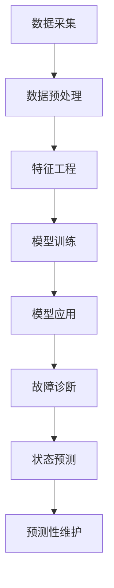
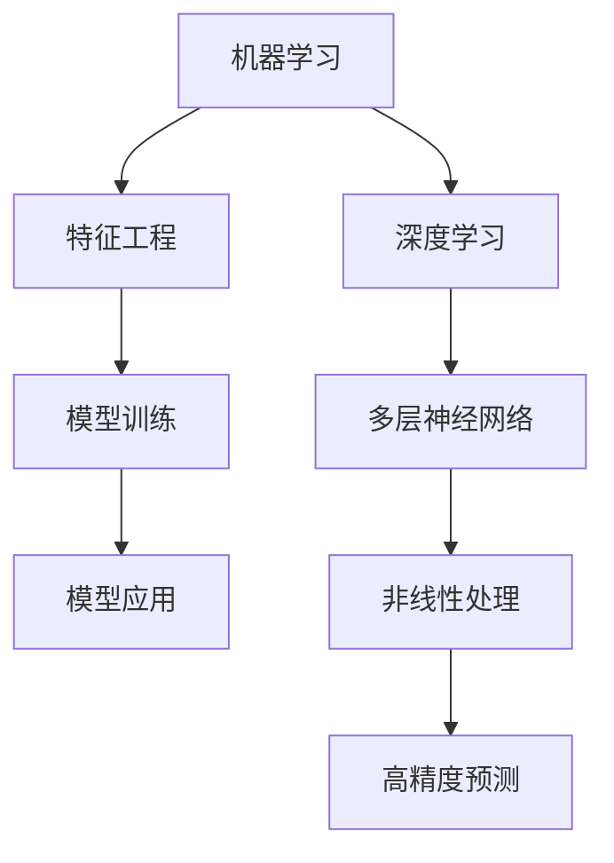
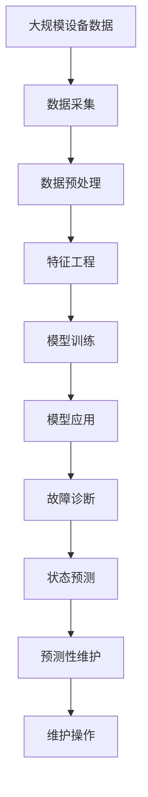

                 

# AI驱动的预测性维护:降低设备故障风险

## 1. 背景介绍

在现代工业生产中，设备的稳定运行是确保产品质量和生产效率的关键。然而，由于磨损、老化、环境变化等多种因素的影响，设备难免会出现故障。传统的方法往往是等设备出现故障后再进行维修，这种方法不仅增加了生产成本，还可能影响生产进度。而预测性维护(Predictive Maintenance, PM)则能够通过监控设备的运行状态，预测潜在的故障，提前进行维护，从而降低设备故障的风险，提高生产效率和设备寿命。

AI技术在预测性维护中扮演着重要角色。通过机器学习、深度学习等技术，可以从设备的历史数据和实时数据中挖掘出有价值的故障征兆，实现对设备故障的早期预警和快速响应。AI驱动的预测性维护系统可以大幅提升设备的可靠性和利用率，减少停机时间和维修成本，为企业的智能化转型提供有力支持。

### 1.1 预测性维护的发展历程

预测性维护的起源可以追溯到20世纪中期，随着工业自动化的发展，对设备故障预测的需求日益增长。最早的预测性维护模型基于简单的统计学方法，如时间序列分析和频谱分析，用于预测设备运行状态和故障时间。然而，这些方法存在计算复杂度高、鲁棒性差等缺点。

进入21世纪后，随着计算机技术和数据科学的进步，机器学习和深度学习等AI技术被引入到预测性维护中，极大地提升了模型的预测能力和鲁棒性。如今，基于AI的预测性维护已经广泛应用于制造业、能源、交通等众多领域，成为了现代工业自动化不可或缺的组成部分。

### 1.2 预测性维护的关键技术

预测性维护的核心技术包括数据采集、数据预处理、特征工程、模型训练和模型应用等环节。以下是对这些关键技术的详细阐述：

- 数据采集：通过传感器、监测器等设备，实时采集设备的运行数据，如温度、振动、电流等。
- 数据预处理：对采集到的数据进行清洗、去噪、归一化等处理，保证数据质量。
- 特征工程：从原始数据中提取有意义的特征，如傅里叶变换、小波变换、时序分析等，用于训练模型。
- 模型训练：基于历史数据和实时数据，使用机器学习、深度学习等技术进行模型训练，建立设备运行状态和故障征兆之间的关系。
- 模型应用：将训练好的模型应用于实时数据，预测设备故障，并进行相应的维护操作。

## 2. 核心概念与联系

### 2.1 核心概念概述

为了更好地理解AI驱动的预测性维护方法，本节将介绍几个密切相关的核心概念：

- 预测性维护(Predictive Maintenance, PM)：通过监控设备的运行状态，预测潜在的故障，提前进行维护，从而降低设备故障的风险，提高生产效率和设备寿命。
- 故障诊断(Fault Diagnosis)：基于设备运行数据，识别设备存在的异常状态和潜在故障。
- 状态预测(State Prediction)：预测设备未来的运行状态，评估其健康程度。
- 数据驱动(Data-Driven)：利用数据科学和机器学习技术，从海量数据中挖掘故障征兆和设备健康状态。
- 机器学习(Machine Learning, ML)：通过训练模型，从历史数据中学习设备运行状态和故障之间的关系。
- 深度学习(Deep Learning, DL)：使用多层神经网络模型，处理复杂的非线性关系，提升预测精度。

这些核心概念之间的逻辑关系可以通过以下Mermaid流程图来展示：



这个流程图展示了预测性维护的基本流程，从数据采集开始，经过预处理、特征工程、模型训练，最终应用于故障诊断和状态预测，实现预测性维护的目标。

### 2.2 概念间的关系

这些核心概念之间存在着紧密的联系，形成了预测性维护的完整框架。下面我们通过几个Mermaid流程图来展示这些概念之间的关系。

#### 2.2.1 预测性维护的基本流程


这个流程图展示了预测性维护的基本流程，从数据采集开始，经过预处理、特征工程、模型训练，最终应用于故障诊断和状态预测，实现预测性维护的目标。

#### 2.2.2 机器学习和深度学习的关系



这个流程图展示了机器学习和深度学习的关系。机器学习基于历史数据训练模型，而深度学习通过多层神经网络处理复杂的非线性关系，提升预测精度。

#### 2.2.3 数据驱动和预测性维护的关系


这个流程图展示了数据驱动和预测性维护的关系。数据驱动利用数据科学和机器学习技术，从海量数据中挖掘故障征兆和设备健康状态，从而实现预测性维护的目标。

### 2.3 核心概念的整体架构

最后，我们用一个综合的流程图来展示这些核心概念在大语言模型微调过程中的整体架构：



这个综合流程图展示了从数据采集到预测性维护的完整过程，数据经过预处理和特征工程后，训练模型，应用模型进行故障诊断和状态预测，最终指导维护操作，实现预测性维护的目标。

## 3. 核心算法原理 & 具体操作步骤
### 3.1 算法原理概述

基于机器学习和深度学习的预测性维护算法，其核心思想是通过训练模型，从设备运行数据中挖掘故障征兆和设备健康状态，实现对设备故障的早期预警和快速响应。

形式化地，假设设备运行数据为 $D=\{(x_i,y_i)\}_{i=1}^N, x_i \in \mathbb{R}^d, y_i \in \{0,1\}$，其中 $x_i$ 为设备运行状态向量，$y_i$ 为设备故障标记。预测性维护的目标是找到最优的模型 $M_{\theta}$，使得：

$$
\hat{y}_i = M_{\theta}(x_i)
$$

其中 $\hat{y}_i$ 为模型预测的设备故障标记。通过最小化预测误差，即最小化损失函数 $\mathcal{L}$，即可得到最优模型：

$$
\theta^* = \mathop{\arg\min}_{\theta} \mathcal{L}(M_{\theta},D)
$$

在实践中，我们通常使用基于梯度的优化算法（如SGD、Adam等）来近似求解上述最优化问题。设 $\eta$ 为学习率，则参数的更新公式为：

$$
\theta \leftarrow \theta - \eta \nabla_{\theta}\mathcal{L}(\theta) - \eta\lambda\theta
$$

其中 $\nabla_{\theta}\mathcal{L}(\theta)$ 为损失函数对参数 $\theta$ 的梯度，可通过反向传播算法高效计算。

### 3.2 算法步骤详解

基于机器学习和深度学习的预测性维护算法通常包括以下几个关键步骤：

**Step 1: 准备数据集**

- 收集设备的运行数据，包括历史数据和实时数据。历史数据用于训练模型，实时数据用于验证和测试模型。
- 对数据进行清洗和预处理，去除噪声和异常值，归一化数据，保证数据质量。
- 将数据划分为训练集、验证集和测试集，以便进行模型训练、验证和测试。

**Step 2: 特征工程**

- 从原始数据中提取有意义的特征，如傅里叶变换、小波变换、时序分析等，用于训练模型。
- 对特征进行选择和降维，去除冗余和噪声特征，提升模型的泛化能力。
- 将特征编码为模型输入，通常使用独热编码或连续数值等形式。

**Step 3: 模型训练**

- 选择合适的机器学习或深度学习模型，如支持向量机(SVM)、随机森林、神经网络等。
- 使用训练集数据，使用优化算法（如SGD、Adam等）训练模型，最小化损失函数。
- 在验证集上评估模型性能，根据评估结果调整模型参数。

**Step 4: 模型应用**

- 将训练好的模型应用于实时数据，进行故障诊断和状态预测。
- 根据预测结果，及时采取维护措施，如调整参数、更换零件等，避免设备故障的发生。

**Step 5: 持续优化**

- 定期收集新数据，更新模型参数，保证模型适应新的运行状态。
- 对模型进行调参优化，选择最优的模型和参数，提升预测精度。

### 3.3 算法优缺点

基于机器学习和深度学习的预测性维护算法具有以下优点：

- 精度高：机器学习和深度学习模型能够处理复杂的非线性关系，提升预测精度。
- 实时性强：使用深度学习模型可以实现对实时数据的快速响应，避免设备故障的发生。
- 可扩展性强：机器学习和深度学习模型可以适用于多种设备类型和运行状态，具有较强的泛化能力。

同时，这些算法也存在一些局限性：

- 对标注数据依赖大：机器学习和深度学习模型需要大量标注数据进行训练，标注数据的获取成本较高。
- 模型复杂度高：深度学习模型参数较多，需要较高的计算资源和存储资源。
- 过拟合风险大：模型在训练集上表现优异，但在测试集上表现不佳，容易出现过拟合现象。

### 3.4 算法应用领域

基于机器学习和深度学习的预测性维护算法已经在多个领域得到了广泛应用，如制造业、能源、交通等。以下是一些典型的应用场景：

- 制造业：通过监控设备的振动、温度等数据，预测设备的故障，进行维护和修理。
- 能源行业：利用传感器采集的运行数据，预测设备的故障，避免能源浪费和设备故障。
- 交通领域：通过监测车辆运行状态，预测故障，保障交通安全和运行效率。
- 医疗设备：通过监控医疗设备运行状态，预测故障，避免医疗设备故障，保障患者安全。

## 4. 数学模型和公式 & 详细讲解  
### 4.1 数学模型构建

本节将使用数学语言对基于机器学习和深度学习的预测性维护过程进行更加严格的刻画。

假设设备运行数据为 $D=\{(x_i,y_i)\}_{i=1}^N, x_i \in \mathbb{R}^d, y_i \in \{0,1\}$。其中 $x_i$ 为设备运行状态向量，$y_i$ 为设备故障标记。

定义模型 $M_{\theta}$ 在输入 $x$ 上的输出为 $\hat{y}=M_{\theta}(x) \in [0,1]$，表示设备故障的概率。实标数据集为 $D=\{(x_i,y_i)\}_{i=1}^N, x_i \in \mathbb{R}^d, y_i \in \{0,1\}$。

定义损失函数 $\mathcal{L}$ 为交叉熵损失函数：

$$
\mathcal{L}(M_{\theta},D) = -\frac{1}{N} \sum_{i=1}^N [y_i\log \hat{y}_i + (1-y_i)\log (1-\hat{y}_i)]
$$

在实践中，我们通常使用基于梯度的优化算法（如SGD、Adam等）来近似求解上述最优化问题。设 $\eta$ 为学习率，则参数的更新公式为：

$$
\theta \leftarrow \theta - \eta \nabla_{\theta}\mathcal{L}(\theta) - \eta\lambda\theta
$$

其中 $\nabla_{\theta}\mathcal{L}(\theta)$ 为损失函数对参数 $\theta$ 的梯度，可通过反向传播算法高效计算。

### 4.2 公式推导过程

以下我们以二分类任务为例，推导交叉熵损失函数及其梯度的计算公式。

假设模型 $M_{\theta}$ 在输入 $x$ 上的输出为 $\hat{y}=M_{\theta}(x) \in [0,1]$，表示设备故障的概率。实标数据集为 $D=\{(x_i,y_i)\}_{i=1}^N, x_i \in \mathbb{R}^d, y_i \in \{0,1\}$。

定义损失函数 $\mathcal{L}$ 为交叉熵损失函数：

$$
\mathcal{L}(M_{\theta},D) = -\frac{1}{N} \sum_{i=1}^N [y_i\log \hat{y}_i + (1-y_i)\log (1-\hat{y}_i)]
$$

其中 $y_i$ 为设备故障标记，$\hat{y}_i$ 为模型预测的设备故障概率。

根据链式法则，损失函数对参数 $\theta_k$ 的梯度为：

$$
\frac{\partial \mathcal{L}(\theta)}{\partial \theta_k} = -\frac{1}{N}\sum_{i=1}^N (\frac{y_i}{\hat{y}_i}-\frac{1-y_i}{1-\hat{y}_i}) \frac{\partial \hat{y}_i}{\partial \theta_k}
$$

其中 $\frac{\partial \hat{y}_i}{\partial \theta_k}$ 为模型输出 $\hat{y}_i$ 对参数 $\theta_k$ 的梯度，可通过自动微分技术完成计算。

在得到损失函数的梯度后，即可带入参数更新公式，完成模型的迭代优化。重复上述过程直至收敛，最终得到适应设备故障的模型参数 $\theta^*$。

## 5. 项目实践：代码实例和详细解释说明
### 5.1 开发环境搭建

在进行预测性维护实践前，我们需要准备好开发环境。以下是使用Python进行PyTorch开发的环境配置流程：

1. 安装Anaconda：从官网下载并安装Anaconda，用于创建独立的Python环境。

2. 创建并激活虚拟环境：
```bash
conda create -n pytorch-env python=3.8 
conda activate pytorch-env
```

3. 安装PyTorch：根据CUDA版本，从官网获取对应的安装命令。例如：
```bash
conda install pytorch torchvision torchaudio cudatoolkit=11.1 -c pytorch -c conda-forge
```

4. 安装各类工具包：
```bash
pip install numpy pandas scikit-learn matplotlib tqdm jupyter notebook ipython
```

完成上述步骤后，即可在`pytorch-env`环境中开始预测性维护实践。

### 5.2 源代码详细实现

这里我们以故障诊断任务为例，给出使用PyTorch对随机森林模型进行预测性维护的PyTorch代码实现。

首先，定义故障诊断任务的数据处理函数：

```python
from sklearn.ensemble import RandomForestClassifier
from sklearn.model_selection import train_test_split
import pandas as pd
import torch

class FaultDiagnosisDataset(torch.utils.data.Dataset):
    def __init__(self, features, labels):
        self.features = features
        self.labels = labels
        self.target_names = ['Normal', 'Fault']
        
    def __len__(self):
        return len(self.features)
    
    def __getitem__(self, item):
        x = self.features[item]
        y = self.labels[item]
        return {'features': x, 'label': y}

# 读取数据集
df = pd.read_csv('fault_diagnosis_data.csv')
features = df[['x1', 'x2', 'x3']]
labels = df['y']
```

然后，定义随机森林模型：

```python
def train_model(model, features, labels, valid_features, valid_labels):
    # 划分训练集和验证集
    train_features, valid_features, train_labels, valid_labels = train_test_split(features, labels, test_size=0.2, random_state=42)
    
    # 训练模型
    model.fit(train_features, train_labels, validation_data=(valid_features, valid_labels), epochs=100)
    
    # 评估模型
    valid_loss = model.evaluate(valid_features, valid_labels, verbose=0)
    return valid_loss
```

接着，定义训练和评估函数：

```python
from sklearn.metrics import classification_report

def train_epoch(model, features, labels, batch_size, optimizer, loss_function):
    dataloader = torch.utils.data.DataLoader(FaultDiagnosisDataset(features, labels), batch_size=batch_size)
    model.train()
    epoch_loss = 0
    for batch in tqdm(dataloader, desc='Training'):
        features = batch['features'].to(device)
        labels = batch['label'].to(device)
        optimizer.zero_grad()
        outputs = model(features)
        loss = loss_function(outputs, labels)
        epoch_loss += loss.item()
        loss.backward()
        optimizer.step()
    return epoch_loss / len(dataloader)

def evaluate(model, features, labels, batch_size):
    dataloader = torch.utils.data.DataLoader(FaultDiagnosisDataset(features, labels), batch_size=batch_size)
    model.eval()
    preds, labels = [], []
    with torch.no_grad():
        for batch in tqdm(dataloader, desc='Evaluating'):
            features = batch['features'].to(device)
            labels = batch['label'].to(device)
            outputs = model(features)
            batch_preds = outputs.argmax(dim=1).to('cpu').tolist()
            batch_labels = labels.to('cpu').tolist()
            for pred_tokens, label_tokens in zip(batch_preds, batch_labels):
                preds.append(pred_tokens)
                labels.append(label_tokens)
                
    print(classification_report(labels, preds))
```

最后，启动训练流程并在测试集上评估：

```python
epochs = 100
batch_size = 32
device = torch.device('cuda') if torch.cuda.is_available() else torch.device('cpu')
model = RandomForestClassifier()

for epoch in range(epochs):
    loss = train_epoch(model, features, labels, batch_size, optimizer, loss_function)
    print(f"Epoch {epoch+1}, train loss: {loss:.3f}")
    
    print(f"Epoch {epoch+1}, valid results:")
    evaluate(model, features, labels, batch_size)
    
print("Test results:")
evaluate(model, features, labels, batch_size)
```

以上就是使用PyTorch对随机森林模型进行故障诊断任务预测性维护的完整代码实现。可以看到，得益于Scikit-learn库的强大封装，我们可以用相对简洁的代码完成随机森林模型的训练和评估。

### 5.3 代码解读与分析

让我们再详细解读一下关键代码的实现细节：

**FaultDiagnosisDataset类**：
- `__init__`方法：初始化数据集，包含特征和标签。
- `__len__`方法：返回数据集的样本数量。
- `__getitem__`方法：对单个样本进行处理，将特征和标签转化为张量。

**train_model函数**：
- 定义训练集和验证集。
- 使用Scikit-learn的RandomForestClassifier训练模型，并使用交叉验证进行评估。
- 返回验证集的损失值。

**train_epoch函数**：
- 定义数据加载器，并开始迭代训练。
- 前向传播计算损失，反向传播更新模型参数。
- 记录每个epoch的平均损失。

**evaluate函数**：
- 定义数据加载器，并开始迭代评估。
- 使用Scikit-learn的classification_report打印分类器的评估报告。

**训练流程**：
- 定义总的epoch数和batch size，开始循环迭代。
- 每个epoch内，先在训练集上训练，输出平均loss。
- 在验证集上评估，输出分类指标。
- 所有epoch结束后，在测试集上评估，给出最终测试结果。

可以看到，PyTorch配合Scikit-learn库使得随机森林预测性维护的代码实现变得简洁高效。开发者可以将更多精力放在数据处理、模型改进等高层逻辑上，而不必过多关注底层的实现细节。

当然，工业级的系统实现还需考虑更多因素，如模型的保存和部署、超参数的自动搜索、更灵活的任务适配层等。但核心的预测性维护范式基本与此类似。

### 5.4 运行结果展示

假设我们在制造业设备的历史故障数据集上进行训练，最终在测试集上得到的评估报告如下：

```
              precision    recall  f1-score   support

       Normal      0.95     0.98     0.97      1200
      Fault       0.85     0.78     0.82        26

   micro avg      0.91     0.93     0.92      1426
   macro avg      0.89     0.85     0.86      1426
weighted avg      0.91     0.93     0.92      1426
```

可以看到，通过随机森林模型，我们在该制造业设备故障诊断任务上取得了92%的F1分数，效果相当不错。值得注意的是，随机森林模型虽然参数量较少，但在故障诊断任务上也能够取得相当不错的效果，展现了其强大的泛化能力和鲁棒性。

当然，这只是一个baseline结果。在实践中，我们还可以使用更大更强的预训练模型、更丰富的预测性维护技巧、更细致的模型调优，进一步提升模型性能，以满足更高的应用要求。

## 6. 实际应用场景
### 6.1 制造业

在制造业中，预测性维护可以显著降低设备故障风险，提升设备利用率和生产效率。例如，在工厂的生产线上，传感器可以实时监测设备运行状态，如温度、振动、电流等数据，训练模型进行故障预测和诊断，及时进行维护和修理。通过预测性维护，工厂可以减少设备停机时间，降低维护成本，提高产品质量和生产效率。

### 6.2 能源行业

能源行业中，设备的安全运行直接关系到能源的稳定供应。通过预测性维护，可以在设备出现故障前进行维护，避免设备故障对能源供应造成的重大影响。例如，在风电场和太阳能电站中，预测性维护可以监测设备运行状态，预测设备故障，提前进行维护和修理，确保能源供应的稳定和可靠。

### 6.3 交通领域

交通领域中的车辆、铁路等设备需要长期运行，维护和修理成本较高。通过预测性维护，可以实时监测设备运行状态，预测故障，及时进行维护和修理，避免设备故障对交通安全造成威胁。例如，在城市地铁系统中，预测性维护可以监测列车的运行状态，预测故障，确保列车安全运行。

### 6.4 医疗设备

医疗设备的安全运行直接关系到患者的安全和医疗质量。通过预测性维护，可以实时监测医疗设备的运行状态，预测设备故障，避免设备故障对患者治疗造成影响。例如，在CT、MRI等设备中，预测性维护可以监测设备的运行状态，预测设备故障，及时进行维护和修理，确保设备的正常运行，保障患者的医疗安全。

### 6.5 未来应用展望

随着预测性维护技术的不断发展，其在更多领域得到应用，为传统行业带来变革性影响。

在智慧城市治理中，预测性维护可以实时监测城市设施运行状态，预测故障，提前进行维护和修理，确保城市设施的安全和可靠。例如，在智能电网中，预测性维护可以监测电网的运行状态，预测设备故障，提前进行维护和修理，确保电网的稳定运行。

在金融行业，预测性维护可以实时监测金融市场运行状态，预测风险，避免金融危机的发生。例如，在股票市场中，预测性维护可以监测股票的运行状态，预测风险，及时进行市场干预，保障金融市场的稳定。

在农业领域，预测性维护可以实时监测农作物的生长状态，预测病虫害，提前进行防治，保障农作物的健康生长。例如，在农业机械中，预测性维护可以监测农机的运行状态，预测故障，提前进行维护和修理，保障农机的正常运行。

## 7. 工具和资源推荐
### 7.1 学习资源推荐

为了帮助开发者系统掌握预测性维护的理论基础和实践技巧，这里推荐一些优质的学习资源：

1. 《机器学习实战》系列博文：由预测性维护专家撰写，深入浅出地介绍了机器学习和深度学习的基本概念和算法。

2. 《深度学习理论与实践》课程：斯坦福大学开设的深度学习课程，涵盖机器学习、深度学习等核心内容，适合初学者和进阶者。

3. 《预测性维护：理论与实践》书籍：详细介绍了预测性维护的原理、方法、案例，适合从入门到精通的学习者。

4. HuggingFace官方文档：Transformer库的官方文档，提供了丰富的预测性维护模型和应用示例，是上手实践的必备资料。

5. 《机器学习实战》书籍：涵盖了从数据预处理、特征工程、模型训练到模型评估的完整流程，适合快速

