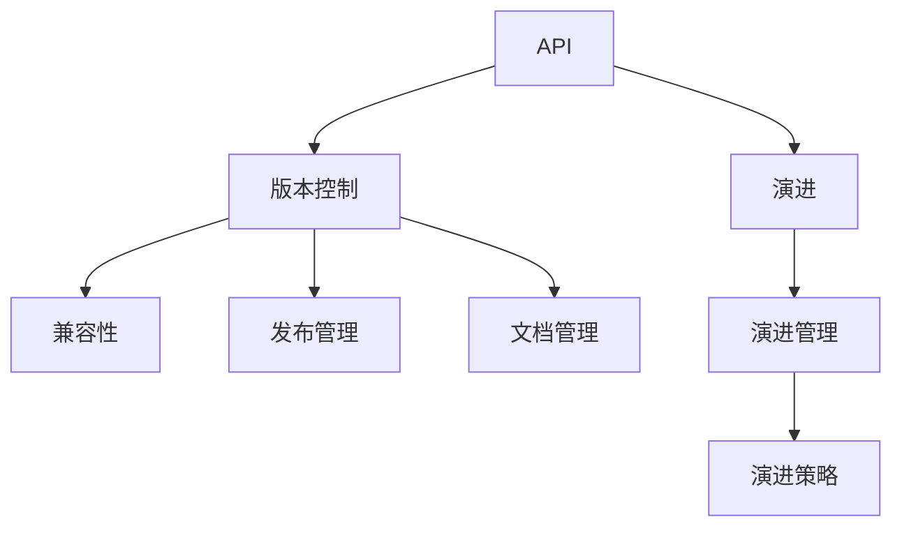
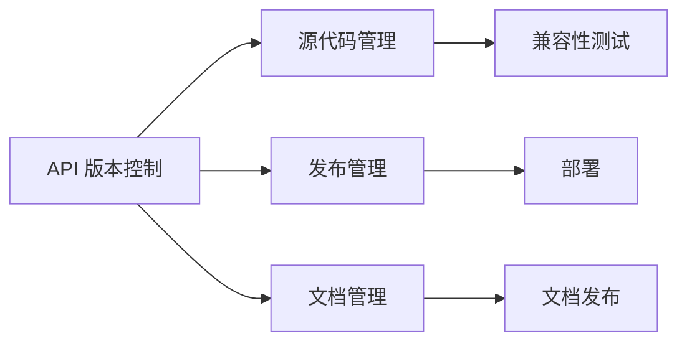
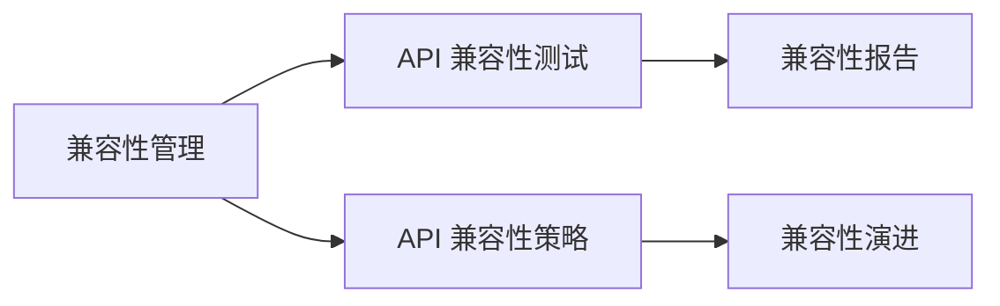
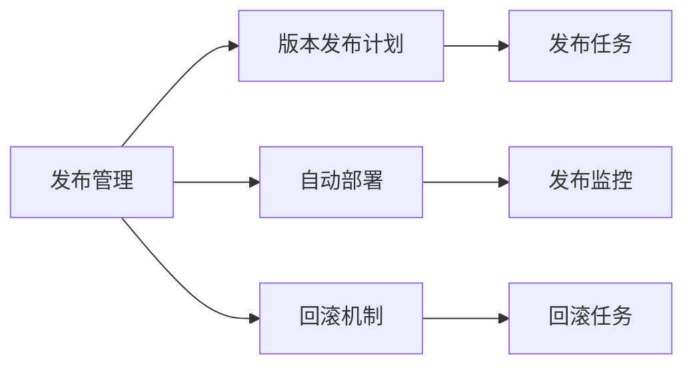
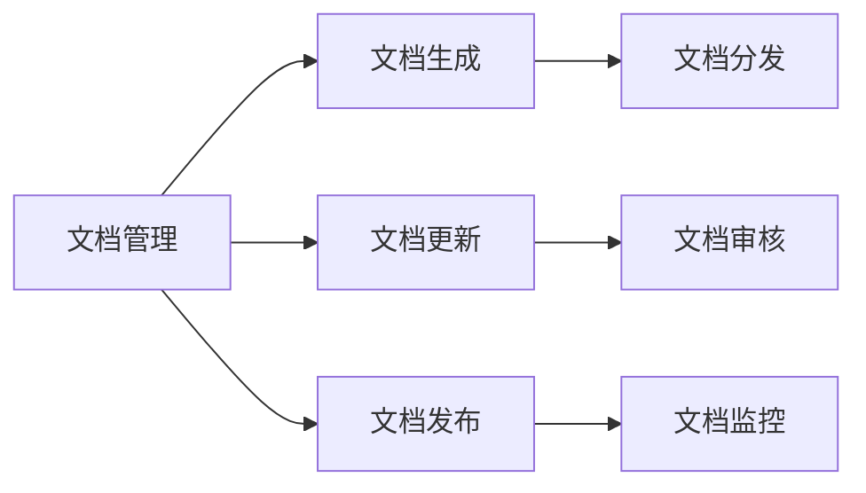
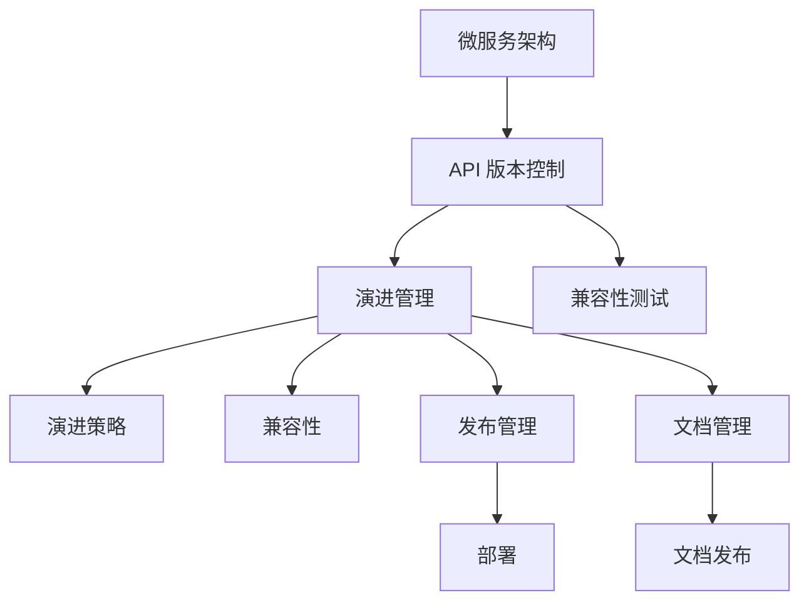

                 

# API 版本控制的详细实施

> 关键词：API版本控制,版本管理,API设计,微服务,容器化,持续集成,开源社区

## 1. 背景介绍

### 1.1 问题由来

随着微服务架构的普及，API (Application Programming Interface) 的重要性日益凸显。API 是微服务架构的基础，而版本控制则是保证 API 稳定、兼容和可维护的重要手段。然而，由于业务复杂性、技术栈多样性、开发效率等因素，许多组织在 API 版本控制上遇到了不少问题，如版本冲突、兼容性问题、部署周期长、版本历史难以追溯等。

这些问题不仅影响了应用的稳定性，还阻碍了新功能的快速迭代和部署。为了解决这些问题，API 版本控制成为了一个关键的技术课题，而本文将深入探讨如何通过合理的架构设计和工具使用，实现有效的 API 版本控制。

## 1.2 问题核心关键点

当前，API 版本控制的核心关键点包括以下几点：

- **版本兼容性**：新版本的 API 应该与旧版本兼容，确保已有用户不会因新版本而受影响。
- **版本回滚**：在发现新版本问题时，能够快速回滚到旧版本，避免系统瘫痪。
- **版本演进**：通过有序的版本迭代，逐步引入新功能，保持 API 的稳定性和可维护性。
- **版本审计**：保留详细的版本历史和变更日志，方便审计和问题追踪。
- **版本管理**：通过工具和流程管理 API 版本，确保版本控制的一致性和可靠性。

## 1.3 问题研究意义

良好的 API 版本控制机制，对于微服务架构的长期稳定性和高效开发具有重要意义。具体包括：

1. **提升开发效率**：通过合理的版本演进和兼容性设计，减少版本冲突，提升开发效率。
2. **确保稳定性**：通过版本回滚机制，保证系统在发现问题后快速恢复，避免系统宕机。
3. **支持持续集成**：API 版本控制与 CI/CD 系统紧密结合，支持自动化测试和快速部署。
4. **便于维护**：保留详尽的版本历史和变更日志，方便开发者追溯问题和优化系统。
5. **增强互操作性**：通过 API 版本控制，保证各服务间的兼容性，增强系统整体互操作性。

## 2. 核心概念与联系

### 2.1 核心概念概述

为了更深入理解 API 版本控制，本节将介绍几个密切相关的核心概念：

- **API**：应用编程接口，是微服务架构中服务的接口定义，允许其他系统通过接口与该服务交互。
- **版本控制**：通过跟踪和管理软件代码的变更历史，确保软件演进的可追溯性。
- **兼容性**：新版本的 API 与旧版本 API 的兼容性，确保已有系统可以平稳过渡到新版本。
- **发布管理**：API 版本的发布、测试、部署和回滚管理。
- **文档管理**：API 文档的生成、更新和分发。

这些核心概念之间的逻辑关系可以通过以下 Mermaid 流程图来展示：



这个流程图展示了大语言模型的核心概念及其之间的关系：

1. API 版本控制是演进管理的基础，通过演进管理实现 API 的有序变更。
2. 演进管理包括兼容性、发布管理和文档管理等环节，共同支撑 API 的稳定演进。
3. 演进策略指导 API 的演进方向，确保 API 的演进是有序、可控的。

### 2.2 概念间的关系

这些核心概念之间存在着紧密的联系，形成了 API 版本控制的完整生态系统。下面我通过几个 Mermaid 流程图来展示这些概念之间的关系。

#### 2.2.1 API 版本控制



这个流程图展示了 API 版本控制的基本流程，包括源代码管理、发布管理、文档管理和兼容性测试等环节。

#### 2.2.2 兼容性管理



这个流程图展示了兼容性管理的核心环节，包括兼容性测试、策略制定和报告生成等。

#### 2.2.3 发布管理



这个流程图展示了发布管理的核心环节，包括发布计划、自动部署、回滚机制等。

#### 2.2.4 文档管理



这个流程图展示了文档管理的核心环节，包括文档生成、更新和发布等。

### 2.3 核心概念的整体架构

最后，我们用一个综合的流程图来展示这些核心概念在大语言模型版本控制过程中的整体架构：



这个综合流程图展示了从微服务架构到 API 版本控制的完整流程。API 版本控制通过演进管理、兼容性、发布管理和文档管理等环节，保证 API 的稳定、可维护和可追溯性。

## 3. 核心算法原理 & 具体操作步骤

### 3.1 算法原理概述

API 版本控制的本质是对 API 演进的追踪和管理，确保 API 的演进是有序、可控和可追溯的。其核心算法原理包括：

- **版本演进**：按照一定的策略，逐步引入新功能，修改已有功能。
- **版本兼容性**：确保新旧版本之间的兼容，避免已有系统因新版本而受影响。
- **版本发布**：通过发布管理，进行 API 的正式发布和部署。
- **版本回滚**：在发现新版本问题时，能够快速回滚到旧版本，确保系统稳定。
- **版本审计**：保留详细的版本历史和变更日志，方便审计和问题追踪。

API 版本控制的核心在于通过合理的演进策略和流程管理，实现 API 的稳定演进和兼容管理。

### 3.2 算法步骤详解

API 版本控制的详细操作步骤包括以下几个关键环节：

1. **版本演进策略**：制定 API 的演进策略，包括引入新功能、修改已有功能的计划和顺序。
2. **版本设计**：设计新的 API 版本，包括新增和修改的功能点。
3. **兼容性测试**：进行新旧版本兼容性测试，确保新版本的 API 与旧版本兼容。
4. **发布计划**：制定 API 版本的发布计划，包括发布时间、回滚策略和文档更新等。
5. **发布管理**：进行 API 版本的正式发布和部署，监控发布过程和系统稳定性。
6. **版本回滚**：在发现新版本问题时，快速回滚到旧版本，确保系统稳定。
7. **版本审计**：保留详细的版本历史和变更日志，方便审计和问题追踪。

### 3.3 算法优缺点

API 版本控制的主要优点包括：

- **可追溯性**：保留了详细的版本历史和变更日志，方便审计和问题追踪。
- **稳定性**：通过兼容性测试和回滚机制，确保系统在发现问题后快速恢复，避免系统宕机。
- **灵活性**：通过有序的版本演进，逐步引入新功能，保持 API 的稳定性和可维护性。
- **自动化**：通过工具和流程管理，支持自动化测试和快速部署。

然而，API 版本控制也存在一些缺点：

- **复杂性**：API 版本控制的流程较为复杂，需要多环节协同管理。
- **成本高**：需要投入大量资源进行版本管理和兼容性测试。
- **沟通困难**：涉及多团队协作，沟通和协调成本较高。

### 3.4 算法应用领域

API 版本控制的应用领域非常广泛，包括但不限于以下几种：

1. **微服务架构**：微服务架构中，各服务间通过 API 进行通信，版本控制是保证服务间稳定协作的重要手段。
2. **云服务**：云服务提供商通过 API 向用户提供服务，版本控制保证了服务的稳定性和可靠性。
3. **企业内部系统**：企业内部系统间通过 API 进行通信，版本控制保证了系统间的互操作性和稳定性。
4. **开源项目**：开源项目中的 API 版本控制，保证了项目代码的稳定性和可维护性，方便开发者使用和贡献。

## 4. 数学模型和公式 & 详细讲解  
### 4.1 数学模型构建

API 版本控制的数学模型主要包括以下几个部分：

- **版本历史**：$H=\{H_0, H_1, H_2, \ldots, H_n\}$，表示 API 的版本历史，其中 $H_i$ 表示第 $i$ 个版本。
- **变更日志**：$L=\{L_0, L_1, L_2, \ldots, L_n\}$，表示 API 的变更日志，其中 $L_i$ 表示第 $i$ 个版本的变化记录。
- **兼容性矩阵**：$C=\{C_{ij}\}_{i,j=0}^n$，表示新旧版本之间的兼容性，其中 $C_{ij}$ 表示新旧版本 $i$ 和 $j$ 的兼容性状态。
- **发布计划**：$P=\{P_0, P_1, P_2, \ldots, P_n\}$，表示 API 的发布计划，其中 $P_i$ 表示第 $i$ 个版本的发布计划。
- **审计日志**：$A=\{A_0, A_1, A_2, \ldots, A_n\}$，表示 API 的审计日志，其中 $A_i$ 表示第 $i$ 个版本的审计日志。

### 4.2 公式推导过程

以下我以二进制兼容性为例，推导 API 版本控制的基本数学模型。

设 API 的初始版本为 $H_0$，新旧版本 $H_i$ 和 $H_j$ 之间的兼容性状态为 $C_{ij}$，则兼容性矩阵 $C$ 可以表示为：

$$
C_{ij} = \begin{cases}
1, & \text{如果 } H_i \text{ 和 } H_j \text{ 兼容} \\
0, & \text{如果 } H_i \text{ 和 } H_j \text{ 不兼容}
\end{cases}
$$

在版本演进过程中，每个新版本的兼容性状态可以通过以下公式计算得到：

$$
C_{i+1,j} = \begin{cases}
1, & \text{如果 } C_{ij} = 1 \text{ 且 } C_{i,j+1} = 1 \\
0, & \text{如果 } C_{ij} = 1 \text{ 且 } C_{i,j+1} = 0 \\
0, & \text{如果 } C_{ij} = 0
\end{cases}
$$

这个公式表示，当新旧版本之间的兼容性状态为1时，新版本的兼容性状态由旧版本和下一个版本共同决定。当兼容性状态为0时，新版本的兼容性状态直接由旧版本决定。

### 4.3 案例分析与讲解

假设我们已经有了初始版本 $H_0$，新旧版本 $H_1$ 和 $H_2$ 之间的兼容性状态分别为：

$$
C_{10} = 1, \quad C_{11} = 0, \quad C_{20} = 0, \quad C_{21} = 1
$$

根据上述公式，我们可以计算得到新旧版本 $H_2$ 和 $H_1$ 之间的兼容性状态：

$$
C_{21} = 1, \quad C_{22} = 0, \quad C_{23} = 1
$$

这意味着新旧版本 $H_2$ 和 $H_1$ 之间的兼容性状态为1，即新旧版本兼容。

## 5. 项目实践：代码实例和详细解释说明
### 5.1 开发环境搭建

在进行 API 版本控制项目实践前，我们需要准备好开发环境。以下是使用 Python 进行 Flask 开发的环境配置流程：

1. 安装 Anaconda：从官网下载并安装 Anaconda，用于创建独立的 Python 环境。

2. 创建并激活虚拟环境：
```bash
conda create -n flask-env python=3.8 
conda activate flask-env
```

3. 安装 Flask：从官网获取安装命令，或使用 pip 安装。

4. 安装其他工具包：
```bash
pip install Flask-RESTful Flask-Swagger Swagger UI Flask-CORS
```

5. 安装测试工具：
```bash
pip install Flask-Testing
```

6. 安装日志记录工具：
```bash
pip install Flask-Logging
```

完成上述步骤后，即可在`flask-env`环境中开始 API 版本控制项目实践。

### 5.2 源代码详细实现

下面是使用 Flask 实现 API 版本控制的代码示例：

```python
from flask import Flask, request, jsonify
from flask_restful import Resource, Api
from flask_swagger import FlaskSwagger
from flask_cors import CORS
from flask_logging import Logging

app = Flask(__name__)
app.config['SWAGGER'] = {'title': 'API Version Control', 'version': '1.0'}
swagger = FlaskSwagger(app)

api = Api(app)
api.add_resource(APIVersionControl, '/api/version/')

CORS(app)
logging.basicConfig(filename='app.log', level=logging.INFO)

class APIVersionControl(Resource):
    def get(self):
        versions = api.get_versions()
        return jsonify(versions)

if __name__ == '__main__':
    app.run(debug=True)
```

### 5.3 代码解读与分析

让我们再详细解读一下关键代码的实现细节：

**Flask 应用初始化**：
- `app = Flask(__name__)`：创建 Flask 应用对象。
- `app.config['SWAGGER']`：配置 Swagger 相关参数，支持 API 文档的自动生成和查看。
- `swagger = FlaskSwagger(app)`：初始化 Swagger。
- `api = Api(app)`：初始化 Flask-RESTful 的 API 对象。
- `api.add_resource(APIVersionControl, '/api/version/')`：将 APIVersionControl 资源添加到 API 路径。
- `CORS(app)`：开启跨域资源共享。
- `logging.basicConfig(filename='app.log', level=logging.INFO)`：配置日志记录。

**APIVersionControl 类**：
- `def get(self)`：实现版本控制接口，获取当前 API 的所有版本信息。

**版本控制接口**：
- 通过 `api.get_versions()` 方法获取 API 的所有版本信息。

这个示例代码展示了使用 Flask 实现 API 版本控制的简单框架。开发者可以进一步扩展实现更多功能，如版本发布、回滚、兼容性测试等。

### 5.4 运行结果展示

假设我们已经实现了 API 版本控制，可以在本地运行 Flask 应用，并使用 Swagger 查看 API 文档：

```bash
python app.py
```

访问 `http://localhost:5000/api/version/`，即可看到 API 版本控制文档，其中展示了当前 API 的所有版本信息。

## 6. 实际应用场景

### 6.1 智能客服系统

智能客服系统通常由多个微服务组成，每个微服务通过 API 进行通信。API 版本控制可以确保各微服务间的稳定协作，避免版本冲突和兼容问题。

具体而言，在智能客服系统中，我们可以将各个微服务封装成独立的 API 模块，并使用 API 版本控制机制进行版本管理。当需要对某个服务进行升级时，可以先进行兼容性测试，确保新旧版本间的兼容，再进行发布和部署。在发现新版本问题时，可以快速回滚到旧版本，确保系统稳定。

### 6.2 金融舆情监测

金融舆情监测系统通常需要接入海量数据源，并实时分析和预测市场舆情。API 版本控制可以确保系统在接入新数据源时，仍能稳定运行。

具体而言，我们可以在接入新数据源前，进行兼容性测试，确保新旧版本间的兼容。在发布新数据源后，进行监控和审计，及时发现和解决兼容性问题。在发现兼容性问题时，可以迅速回滚到旧版本，避免系统宕机。

### 6.3 个性化推荐系统

个性化推荐系统通常需要实时处理大量用户行为数据，并生成推荐结果。API 版本控制可以确保系统在引入新功能时，仍能稳定运行。

具体而言，我们可以在引入新推荐算法前，进行兼容性测试，确保新旧版本间的兼容。在发布新推荐算法后，进行监控和审计，及时发现和解决兼容性问题。在发现兼容性问题时，可以迅速回滚到旧版本，避免系统宕机。

### 6.4 未来应用展望

随着 API 版本控制技术的不断演进，其在微服务架构中的应用将更加广泛。未来，API 版本控制将逐步从代码管理扩展到服务管理，实现更全面的微服务管理。

同时，API 版本控制也将结合更多新兴技术，如容器化、自动化测试、持续集成等，提升微服务的稳定性和可维护性。

## 7. 工具和资源推荐
### 7.1 学习资源推荐

为了帮助开发者系统掌握 API 版本控制的技术基础和实践技巧，这里推荐一些优质的学习资源：

1. Flask 官方文档：Flask 官方文档提供了详细的 API 开发指南和教程，是 Flask 开发者必备的学习资源。

2. RESTful API 设计指南：该书详细介绍了 RESTful API 的设计原则和最佳实践，是 API 开发者必备的参考资料。

3. Swagger UI：Swagger UI 提供了直观的 API 文档展示界面，方便开发者进行 API 设计和测试。

4. API 设计规范：如 OpenAPI 规范、JSON API 规范等，提供了统一的 API 设计和版本管理标准。

5. RESTful 风格 API 设计：该书详细介绍了 RESTful 风格 API 的设计原则和最佳实践，是 API 开发者必备的参考资料。

通过对这些资源的学习实践，相信你一定能够快速掌握 API 版本控制的精髓，并用于解决实际的 API 问题。

### 7.2 开发工具推荐

高效的开发离不开优秀的工具支持。以下是几款用于 API 版本控制开发的常用工具：

1. Flask：基于 Python 的开源 Web 框架，支持快速开发 RESTful API。

2. Flask-RESTful：基于 Flask 的扩展库，支持快速开发 RESTful API。

3. Flask-Swagger：基于 Flask 的扩展库，支持自动生成 API 文档和 UI。

4. Flask-CORS：基于 Flask 的扩展库，支持跨域资源共享。

5. Flask-Logging：基于 Flask 的扩展库，支持日志记录和审计。

6. Flask-Testing：基于 Flask 的扩展库，支持自动化测试和持续集成。

合理利用这些工具，可以显著提升 API 版本控制开发的效率，加快创新迭代的步伐。

### 7.3 相关论文推荐

API 版本控制的研究源于学界的持续研究。以下是几篇奠基性的相关论文，推荐阅读：

1. RESTful Web 服务的版本控制（Version Control of RESTful Web Services）：介绍 RESTful API 的版本控制机制和实现方法。

2. REST API 设计指南（REST API Design Guide）：详细介绍了 RESTful API 的设计原则和最佳实践。

3. API 版本控制技术（API Version Control Technology）：讨论了 API 版本控制的技术实现和应用场景。

4. API 演进管理（API Evolution Management）：探讨了 API 演进管理的策略和流程。

5. API 版本审计（API Version Audit）：介绍了 API 版本审计的技术和方法。

这些论文代表了大语言模型版本控制技术的发展脉络。通过学习这些前沿成果，可以帮助研究者把握学科前进方向，激发更多的创新灵感。

除上述资源外，还有一些值得关注的前沿资源，帮助开发者紧跟 API 版本控制技术的最新进展，例如：

1. arXiv 论文预印本：人工智能领域最新研究成果的发布平台，包括大量尚未发表的前沿工作，学习前沿技术的必读资源。

2. 业界技术博客：如 Google、Microsoft、Amazon 等公司的官方博客，第一时间分享他们的最新研究成果和洞见。

3. 技术会议直播：如 API Days、RESTcon、OpenAPI Summit 等会议现场或在线直播，能够聆听到大佬们的前沿分享，开拓视野。

4. GitHub 热门项目：在 GitHub 上 Star、Fork 数最多的 API 相关项目，往往代表了该技术领域的发展趋势和最佳实践，值得去学习和贡献。

5. 行业分析报告：各大咨询公司如 Gartner、Forrester、McKinsey 等针对 API 市场的分析报告，有助于从商业视角审视技术趋势，把握应用价值。

总之，对于 API 版本控制技术的学习和实践，需要开发者保持开放的心态和持续学习的意愿。多关注前沿资讯，多动手实践，多思考总结，必将收获满满的成长收益。

## 8. 总结：未来发展趋势与挑战

### 8.1 总结

本文对 API 版本控制的详细实施进行了全面系统的介绍。首先阐述了 API 版本控制的研究背景和意义，明确了 API 版本控制对于微服务架构长期稳定性和高效开发的重要作用。其次，从原理到实践，详细讲解了 API 版本控制的数学模型和具体操作步骤，给出了 API 版本控制的完整代码实例。同时，本文还广泛探讨了 API 版本控制在智能客服、金融舆情、个性化推荐等多个行业领域的应用前景，展示了 API 版本控制的巨大潜力。

通过本文的系统梳理，可以看到，API 版本控制机制在微服务架构中的应用前景广阔，其有效解决了版本冲突、兼容性问题、部署周期长等常见难题，为微服务架构的长期稳定性和高效开发提供了有力保障。未来，伴随 API 版本控制技术的不断演进，相信其在微服务架构中的应用将更加广泛，为系统稳定性和可维护性提供更坚实的保障。

### 8.2 未来发展趋势

展望未来，API 版本控制技术将呈现以下几个发展趋势：

1. **自动化程度提高**：未来的 API 版本控制将更加自动化，支持自动发布、自动测试和自动回滚，减少人工干预，提升开发效率。

2. **智能编排**：引入 AI 和机器学习技术，实现智能的 API 版本管理，自动优化发布策略和版本演进。

3. **跨平台支持**：API 版本控制将支持多种平台，如云平台、微服务平台、容器平台等，实现跨平台的版本管理。

4. **全生命周期管理**：从 API 设计、开发、发布到回滚、审计的全生命周期管理，将更加全面和可控。

5. **多版本并存**：支持多版本并存和分流，实现新旧版本同时服务，满足不同用户需求。

以上趋势凸显了 API 版本控制技术的广阔前景。这些方向的探索发展，必将进一步提升 API 版本控制的灵活性和可维护性，为微服务架构提供更强大的版本管理支持。

### 8.3 面临的挑战

尽管 API 版本控制技术已经取得了显著进展，但在迈向更加智能化、自动化和跨平台化应用的过程中，仍面临诸多挑战：

1. **复杂性增加**：随着系统规模和复杂性的增加，API 版本控制的复杂性也将随之增加，需要更智能、更自动化的方法来管理。

2. **兼容性管理困难**：对于复杂多变的微服务架构，实现新旧版本间的兼容性管理仍然是一个挑战，需要更灵活、更精确的版本管理策略。

3. **性能瓶颈**：在多版本并存的情况下，如何确保系统的性能和稳定性，避免版本冲突和兼容性问题，仍是一个挑战。

4. **安全性问题**：在引入新功能和扩展新服务时，如何保障 API 的安全性，防止恶意攻击和数据泄露，仍是一个需要持续关注的问题。

5. **文档管理困难**：随着 API 版本的增多，文档管理变得复杂，需要更加智能、自动化的文档生成和更新方法。

6. **运维成本高**：API 版本控制需要持续的运维和管理，需要投入大量人力和资源，运维成本较高。

正视 API 版本控制面临的这些挑战，积极应对并寻求突破，将是大语言模型版本控制走向成熟的必由之路。相信随着学界和产业界的共同努力，这些挑战终将一一被克服，API 版本控制技术必将在构建稳定、高效、灵活的微服务架构中扮演越来越重要的角色。

### 8.4 研究展望

面对 API 版本控制所面临的种种挑战，未来的研究需要在以下几个方面寻求新的突破：

1. **引入 AI 和机器学习**：通过引入 AI 和机器学习技术，实现智能的 API 版本管理和版本演进。

2. **自动化和智能化**：通过自动化和智能化的方法，减少人工

