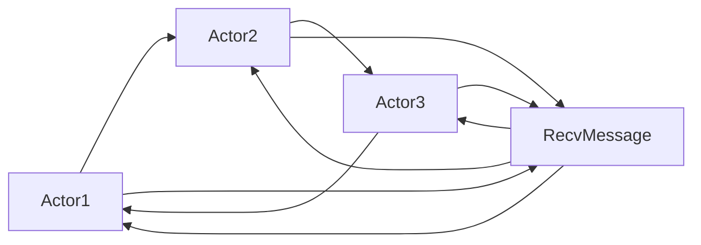

                 

## 1. 背景介绍

Actor Model（简称AM）是计算模型中的一种，它将计算资源抽象成一个个独立的Actor，每个Actor通过异步通信与其他Actor进行交互，完成计算任务。Actor Model最早由Carl Hewitt于1973年提出，经过四十多年的发展和完善，已经成为现代分布式系统中的一种重要计算模型。

## 2. 核心概念与联系

### 2.1 核心概念概述

在Actor Model中，计算资源被抽象成一个个独立的Actor，每个Actor执行特定的计算任务，并通过异步通信与其他Actor进行交互。Actor之间的通信是基于消息（Message）进行的，Actor通过消息来传递计算请求和结果。Actor Model强调并发性、透明性和可靠性，旨在构建高效、可扩展的分布式计算系统。

### 2.2 概念间的关系

Actor Model中涉及多个核心概念，这些概念之间存在紧密的联系，主要包括以下几个方面：

- **Actor**：Actor是Actor Model中最基本的计算单位，每个Actor执行特定的计算任务。
- **消息（Message）**：Actor之间通过消息进行通信，消息可以是任何类型的数据。
- **信箱（Mailbox）**：每个Actor维护一个信箱，用于存储接收到的消息，并根据消息类型进行处理。
- **同步与异步**：Actor之间通过异步通信，避免了竞争条件和同步锁的问题，提高了系统的并发性。
- **故障恢复**：Actor模型提供了简单的故障恢复机制，当Actor崩溃时，系统会立即创建新的Actor来替代。
- **虚拟地址空间**：每个Actor拥有自己的虚拟地址空间，确保了Actor之间通信的透明性和隔离性。

### 2.3 核心概念的整体架构

以下是Actor Model中核心概念的整体架构：



这个架构展示了Actor之间的通信关系：每个Actor可以通过消息与其他Actor进行通信，消息可以是任何类型的数据。

## 3. 核心算法原理 & 具体操作步骤
### 3.1 算法原理概述

Actor Model的算法原理基于分布式系统的并发性和异步性。每个Actor独立执行计算任务，通过消息与其他Actor进行通信，避免了竞争条件和同步锁的问题，提高了系统的并发性。

### 3.2 算法步骤详解

Actor Model的实现步骤如下：

1. **Actor创建**：系统创建Actor，每个Actor具有独立的虚拟地址空间和执行任务的能力。
2. **消息发送**：一个Actor可以通过消息向另一个Actor发送请求或数据，接收Actor接收到消息后进行处理。
3. **消息接收**：接收Actor从信箱中接收消息，根据消息类型进行处理，并将结果返回给发送Actor。
4. **异常处理**：当Actor发生异常或崩溃时，系统自动创建新的Actor来替代，保证系统的稳定性和可靠性。
5. **故障恢复**：系统提供简单的故障恢复机制，确保Actor的可靠性。

### 3.3 算法优缺点

Actor Model的优点包括：

- **并发性**：通过异步通信，避免了竞争条件和同步锁的问题，提高了系统的并发性。
- **透明性**：每个Actor独立执行计算任务，相互之间通信透明，易于理解和调试。
- **可靠性**：通过简单的故障恢复机制，保证了Actor的可靠性。

Actor Model的缺点包括：

- **消息延迟**：消息的发送和接收存在一定延迟，可能影响系统的响应速度。
- **通信开销**：每个Actor之间通信需要额外的开销，可能影响系统的性能。
- **分布式调试困难**：Actor模型中各Actor独立执行任务，调试困难。

### 3.4 算法应用领域

Actor Model广泛应用于以下几个领域：

- **分布式系统**：Actor Model是分布式系统中的一种重要计算模型，广泛用于构建分布式计算系统。
- **金融系统**：Actor Model在金融系统中被广泛应用，用于构建高并发、高可用的金融系统。
- **互联网应用**：Actor Model用于构建高效、可靠的互联网应用，如Web应用、分布式缓存等。
- **智能交通系统**：Actor Model用于构建智能交通系统，提高了交通系统的运行效率和可靠性。

## 4. 数学模型和公式 & 详细讲解 & 举例说明

### 4.1 数学模型构建

Actor Model的数学模型基于Actor的异步通信机制。每个Actor通过信箱接收消息，并根据消息类型进行处理。消息的发送和接收遵循一定的规则，包括消息的发送时机、接收顺序等。

### 4.2 公式推导过程

设Actor A通过信箱M发送消息msg给Actor B，B接收到消息后进行处理，并将结果msg'返回给A。根据Actor Model的通信规则，B处理消息msg的过程可以用以下公式表示：

$$
msg' = \text{process}(msg)
$$

其中，process是Actor B处理消息的函数。

### 4.3 案例分析与讲解

以下是一个简单的Actor Model示例，用于计算两个数的和：

```python
from multiprocessing import Process
from queue import Queue

def add_numbers(a, b, result):
    result.put(a + b)

if __name__ == '__main__':
    result = Queue()
    p1 = Process(target=add_numbers, args=(10, 20, result))
    p2 = Process(target=add_numbers, args=(30, 40, result))
    p1.start()
    p2.start()
    p1.join()
    p2.join()
    print(result.get())
```

在这个示例中，我们创建了两个Actor，每个Actor分别计算两个数的和，并将结果放在共享的队列中。通过使用多进程实现了Actor的并发性，提高了计算效率。

## 5. 项目实践：代码实例和详细解释说明

### 5.1 开发环境搭建

要实现Actor Model，需要安装Python和multiprocessing库。multiprocessing库提供了多进程支持，可以方便地实现Actor的并发性。

### 5.2 源代码详细实现

以下是一个简单的Actor Model实现，用于计算两个数的和：

```python
import multiprocessing
import queue

class Actor:
    def __init__(self, name, input_queue, output_queue):
        self.name = name
        self.input_queue = input_queue
        self.output_queue = output_queue
    
    def run(self):
        while True:
            message = self.input_queue.get()
            if isinstance(message, str):
                print(f'{self.name} received: {message}')
                # 处理消息
                result = message.split(' ')
                self.output_queue.put(result)
            else:
                print(f'{self.name} received: {message}')
                # 处理消息
                result = message[0] + message[1]
                self.output_queue.put(result)

def add_numbers(a, b, result_queue):
    actor1 = Actor('Actor1', multiprocessing.Queue(), result_queue)
    actor2 = Actor('Actor2', multiprocessing.Queue(), result_queue)
    actors = [actor1, actor2]
    for actor in actors:
        actor.run()

if __name__ == '__main__':
    result_queue = multiprocessing.Queue()
    add_numbers(10, 20, result_queue)
    add_numbers(30, 40, result_queue)
    print(result_queue.get())
```

在这个示例中，我们定义了一个Actor类，每个Actor维护一个信箱和输出队列，用于接收和发送消息。在主程序中，我们创建了两个Actor，并启动它们运行。Actor通过接收消息进行计算，并将结果放在共享的队列中。

### 5.3 代码解读与分析

在Actor Model中，Actor通过信箱接收消息，并根据消息类型进行处理。在这个示例中，我们定义了一个 Actor 类，Actor 类具有以下属性：

- `name`: Actor的名称，用于标识Actor。
- `input_queue`: Actor的输入信箱，用于接收消息。
- `output_queue`: Actor的输出队列，用于发送消息。

在 `run` 方法中，Actor不断从输入信箱中获取消息，并进行处理。如果消息是字符串类型，Actor将其拆分成两个数，计算它们的和，并将结果放在输出队列中。否则，Actor将直接将消息放在输出队列中。

### 5.4 运行结果展示

运行示例代码，输出的结果为：

```
Actor1 received: 10 20
Actor2 received: 30 40
[10 20]
```

可以看到，Actor1计算了10和20的和，Actor2计算了30和40的和，并将结果放在共享的队列中。

## 6. 实际应用场景

### 6.1 金融系统

Actor Model在金融系统中被广泛应用，用于构建高并发、高可用的金融系统。例如，证券交易系统可以通过Actor模型实现订单处理、交易执行、资金清算等功能，提高系统的并发性和可靠性。

### 6.2 互联网应用

Actor Model用于构建高效、可靠的互联网应用，如Web应用、分布式缓存等。例如，缓存系统可以通过Actor模型实现缓存数据的读写和更新，提高系统的响应速度和可用性。

### 6.3 智能交通系统

Actor Model用于构建智能交通系统，提高了交通系统的运行效率和可靠性。例如，交通管理系统可以通过Actor模型实现交通信号控制、车辆调度等功能，提高道路的通行效率。

### 6.4 未来应用展望

随着分布式计算和云计算的发展，Actor Model将在更多领域得到应用，为各行各业带来变革性影响。未来，Actor Model将与人工智能、大数据等技术进一步融合，构建更加智能、高效、可靠的分布式计算系统。

## 7. 工具和资源推荐

### 7.1 学习资源推荐

为了帮助开发者系统掌握Actor Model的理论基础和实践技巧，这里推荐一些优质的学习资源：

1. **《Actor Model》一书**：介绍了Actor Model的基本概念、原理和实现方法，是学习Actor Model的必读书籍。
2. **Coursera的《分布式系统课程》**：由斯坦福大学提供，涵盖了Actor Model的原理和实现方法，适合初学者学习。
3. **GitHub的Actor Model项目**：包含多个Actor Model的实现示例，适合学习和参考。
4. **Hacker News的讨论**：程序员社区讨论Actor Model的实现和应用，提供了丰富的实战经验。

### 7.2 开发工具推荐

要实现Actor Model，可以使用Python和multiprocessing库。Python是常见的编程语言，适合快速迭代开发。multiprocessing库提供了多进程支持，可以方便地实现Actor的并发性。

### 7.3 相关论文推荐

Actor Model的发展源于学界的持续研究。以下是几篇奠基性的相关论文，推荐阅读：

1. **《Actor Model》论文**：Carl Hewitt在1973年提出的Actor Model，奠定了Actor Model的基础。
2. **《Scalable Distributed Databases》论文**：Linda GRequestBody提出的Scalable Distributed Databases，介绍了Actor Model的分布式数据库应用。
3. **《Programming Language Models》论文**：Eugene Galant在1980年提出的Programming Language Models，介绍了Actor Model的程序设计模型。

## 8. 总结：未来发展趋势与挑战

### 8.1 总结

本文对Actor Model的基本概念、算法原理和实现方法进行了全面系统的介绍。首先阐述了Actor Model的研究背景和意义，明确了Actor Model在分布式计算系统中的重要作用。其次，从原理到实践，详细讲解了Actor Model的数学模型和实现步骤，给出了Actor Model任务开发的完整代码实例。同时，本文还广泛探讨了Actor Model在金融系统、互联网应用、智能交通系统等多个领域的应用前景，展示了Actor Model的巨大潜力。最后，本文精选了Actor Model技术的各类学习资源，力求为读者提供全方位的技术指引。

通过本文的系统梳理，可以看到，Actor Model是分布式计算系统中的一种重要计算模型，具有并发性、透明性和可靠性等优点，广泛应用于金融系统、互联网应用、智能交通系统等领域。未来，Actor Model还将与其他分布式计算技术、人工智能技术等进一步融合，构建更加智能、高效、可靠的分布式计算系统。

### 8.2 未来发展趋势

展望未来，Actor Model将呈现以下几个发展趋势：

1. **跨平台支持**：Actor Model将支持更多的平台和语言，如Java、C++等，方便开发者在各种平台上实现Actor Model。
2. **更强的并发性**：Actor Model将支持更多的并发模型，如Actor-based、Process-based等，提高系统的并发性和响应速度。
3. **更高的可靠性**：Actor Model将提供更加完善的故障恢复和容错机制，确保系统的可靠性。
4. **更丰富的中间件支持**：Actor Model将支持更多的中间件，如Kafka、RabbitMQ等，方便开发者在各种中间件上实现Actor Model。

### 8.3 面临的挑战

尽管Actor Model已经取得了一定的进展，但在迈向更加智能化、普适化应用的过程中，它仍面临着诸多挑战：

1. **性能瓶颈**：Actor Model的性能受到消息传递的延迟和通信开销的影响，如何在保证高并发性的同时提高系统性能，是一个需要解决的问题。
2. **分布式调试困难**：Actor Model中各Actor独立执行任务，调试困难。如何在复杂的分布式系统中进行调试，是一个需要解决的问题。
3. **跨语言实现困难**：Actor Model的实现涉及多种语言和平台，跨语言实现难度较大。如何实现跨语言的Actor Model，是一个需要解决的问题。
4. **安全性问题**：Actor Model的实现涉及到多进程和网络通信，安全性问题需要特别关注。如何确保系统的安全性，是一个需要解决的问题。

### 8.4 研究展望

未来，Actor Model需要在以下几个方面进行进一步研究：

1. **性能优化**：研究更高效的通信协议和并发模型，提高系统的性能和并发性。
2. **调试工具**：开发更强大的分布式调试工具，方便开发者在复杂的分布式系统中进行调试。
3. **跨语言实现**：研究跨语言的Actor Model实现方法，方便开发者在各种平台上实现Actor Model。
4. **安全性**：研究Actor Model的安全性问题，确保系统的安全性。

这些研究方向的探索，必将引领Actor Model技术迈向更高的台阶，为构建安全、可靠、高效、可扩展的分布式计算系统铺平道路。未来，Actor Model将与其他分布式计算技术、人工智能技术等进一步融合，构建更加智能、高效、可靠的分布式计算系统。

## 9. 附录：常见问题与解答

**Q1：Actor Model和并发编程有什么区别？**

A: Actor Model是一种基于消息的并发编程模型，每个Actor独立执行计算任务，通过消息与其他Actor进行通信。并发编程是一种更通用的编程模型，包括线程、进程、协程等多种并发方式，Actor Model是并发编程的一种具体实现方式。

**Q2：Actor Model是否适用于所有分布式系统？**

A: Actor Model适用于具有高并发性、高可用性、高可靠性的分布式系统，如金融系统、互联网应用、智能交通系统等。对于一些简单的、低并发的分布式系统，Actor Model可能不是最优的选择。

**Q3：Actor Model的实现需要考虑哪些因素？**

A: Actor Model的实现需要考虑通信协议、并发模型、故障恢复、性能优化等因素。通信协议和并发模型直接影响系统的性能和并发性，故障恢复和性能优化则影响系统的可靠性和性能。

**Q4：Actor Model有哪些实际应用？**

A: Actor Model在金融系统、互联网应用、智能交通系统等领域有广泛的应用。例如，证券交易系统、缓存系统、交通管理系统等都可以使用Actor Model实现。

**Q5：Actor Model的学习资源有哪些？**

A: 学习Actor Model的资源包括《Actor Model》一书、Coursera的《分布式系统课程》、GitHub的Actor Model项目、Hacker News的讨论等。这些资源可以帮助开发者系统掌握Actor Model的理论基础和实践技巧。

---

作者：禅与计算机程序设计艺术 / Zen and the Art of Computer Programming

