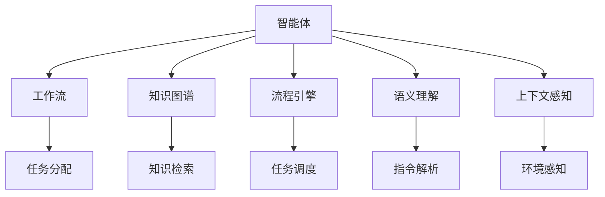
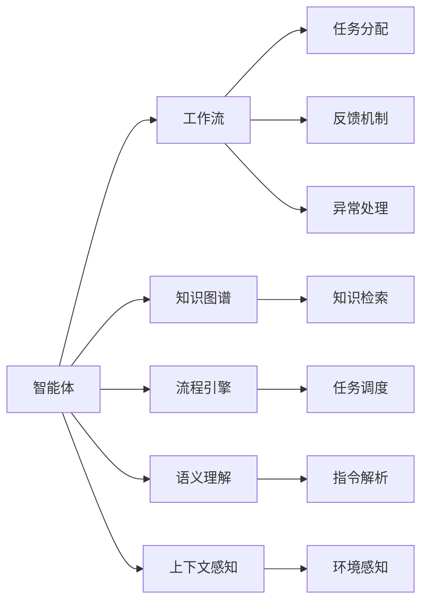

                 

# Agentic Workflow 提高效率与质量

> 关键词：Agentic Workflow, 自动化, 知识图谱, 流程引擎, 语义理解, 上下文感知, 质量控制

## 1. 背景介绍

在数字化转型飞速发展的今天，企业对IT系统的要求越来越高，不仅要求其能够处理大规模数据，更要求其在处理过程中能够自适应、高效、准确地完成任务。Agentic Workflow，即代理式工作流，作为一种新型的自动化技术，其核心思想是将决策权交给智能体，实现自我驱动的、以业务为导向的工作流自动化。通过将智能体融入工作流，Agentic Workflow可以在保证效率的同时，提高工作质量，减少人为错误。

### 1.1 问题由来
随着人工智能技术的成熟，越来越多的企业开始探索如何利用AI来提升业务效率和质量。传统的自动化工作流系统，如BPMN、CMMN等，已经无法满足企业日益复杂的需求。这些系统通常依赖于固定的业务流程定义，缺乏灵活性和上下文感知能力。而Agentic Workflow则通过对任务、规则和智能体的动态管理，实现了工作流的自适应和自优化，从而提升了整体系统的效率和质量。

### 1.2 问题核心关键点
Agentic Workflow的核心在于其智能体的设计和应用。智能体（Agent）是Agentic Workflow中的关键组成部分，它具有自主性、目标导向性和适应性，能够基于当前环境做出合理决策。智能体的设计应具备以下特点：
- 任务分配与执行：智能体能够自动分配任务并执行，无需人工干预。
- 状态感知与上下文理解：智能体能够感知当前环境的状态，并基于上下文理解做出决策。
- 规则驱动与学习：智能体能够基于预定义的规则和实际反馈进行学习，不断优化自身行为。

通过这些特点，智能体能够在处理任务时自适应环境变化，从而提升效率和质量。

### 1.3 问题研究意义
Agentic Workflow在提升企业自动化水平和业务效率方面具有重要意义：

1. **降低成本**：通过智能体自动处理大量重复性任务，降低人工操作成本。
2. **提高效率**：智能体能够快速响应业务需求，减少任务等待时间。
3. **增强灵活性**：智能体能够根据实际情况动态调整工作流，适应不断变化的业务需求。
4. **提升质量**：智能体通过上下文感知和学习，减少人为错误，提升任务完成质量。
5. **增强可扩展性**：智能体的设计和应用，使得工作流系统具备良好的可扩展性，可以灵活应对新业务需求。

## 2. 核心概念与联系

### 2.1 核心概念概述

为了更好地理解Agentic Workflow，我们需要介绍几个密切相关的核心概念：

- **智能体（Agent）**：是Agentic Workflow的核心组成部分，能够自主决策、执行任务并适应环境变化。
- **工作流（Workflow）**：由一组任务和它们之间的逻辑关系组成，用于描述业务流程。
- **知识图谱（Knowledge Graph）**：用于存储和检索相关领域知识，帮助智能体做出更准确的决策。
- **流程引擎（Flow Engine）**：是Agentic Workflow的基础平台，用于管理和调度任务。
- **语义理解（Semantic Understanding）**：智能体能够理解和解释自然语言指令，执行相应的任务。
- **上下文感知（Context Awareness）**：智能体能够感知和利用当前环境的状态，做出合理的决策。

这些核心概念之间存在紧密的联系，共同构成了Agentic Workflow的基本架构。通过这些概念，我们可以更好地理解Agentic Workflow的工作原理和实现机制。

### 2.2 概念间的关系

这些核心概念之间的关系可以通过以下Mermaid流程图来展示：



这个流程图展示了Agentic Workflow中各组件之间的联系：

1. 智能体从工作流中获取任务，并根据任务内容查询知识图谱。
2. 智能体利用语义理解组件，理解自然语言指令。
3. 智能体通过上下文感知，感知当前环境状态。
4. 智能体基于规则和上下文信息做出决策，并执行任务。
5. 流程引擎负责任务调度和状态管理，确保任务的顺畅执行。

### 2.3 核心概念的整体架构

最后，我们用一个综合的流程图来展示Agentic Workflow中各组件的交互和协作：



这个综合流程图展示了Agentic Workflow中各组件的交互和协作：

1. 智能体从工作流中获取任务，并根据任务内容查询知识图谱。
2. 智能体利用语义理解组件，理解自然语言指令。
3. 智能体通过上下文感知，感知当前环境状态。
4. 智能体基于规则和上下文信息做出决策，并执行任务。
5. 流程引擎负责任务调度和状态管理，确保任务的顺畅执行。
6. 智能体将执行结果反馈到工作流中，并进行异常处理。

这些流程图帮助我们更清晰地理解Agentic Workflow的工作原理和各组件间的协作关系，为后续深入讨论具体的实现方法和技术奠定了基础。

## 3. 核心算法原理 & 具体操作步骤
### 3.1 算法原理概述

Agentic Workflow的核心算法是基于代理模型和流程引擎的自动化控制策略。其核心思想是通过智能体对任务的动态管理，实现工作流的自适应和自优化。智能体通过感知当前环境状态，并基于上下文信息做出合理决策，从而提高任务处理效率和质量。

### 3.2 算法步骤详解

Agentic Workflow的实现步骤主要包括以下几个方面：

1. **任务定义与分配**：
   - 定义任务及其对应的处理逻辑。
   - 智能体从工作流中获取任务，并根据任务内容查询知识图谱。
   - 智能体利用语义理解组件，理解自然语言指令。

2. **状态感知与上下文理解**：
   - 智能体通过上下文感知组件，感知当前环境状态。
   - 智能体根据上下文信息，调整自身行为策略。

3. **规则驱动与学习**：
   - 智能体基于预定义的规则和实际反馈进行学习，不断优化自身行为。
   - 智能体通过反馈机制，调整任务处理策略。

4. **任务执行与监控**：
   - 智能体执行任务，并监控任务执行状态。
   - 智能体将执行结果反馈到工作流中，并进行异常处理。

5. **流程引擎调度与控制**：
   - 流程引擎负责任务调度和状态管理，确保任务的顺畅执行。
   - 流程引擎根据智能体的反馈信息，动态调整任务执行策略。

### 3.3 算法优缺点

Agentic Workflow相比传统的自动化工作流系统，具有以下优点：

1. **灵活性**：智能体能够根据实际情况动态调整任务处理策略，适应不断变化的业务需求。
2. **自适应性**：智能体能够自主感知环境状态，并基于上下文信息做出合理决策。
3. **效率提升**：智能体能够快速响应业务需求，减少任务等待时间。
4. **质量控制**：智能体通过上下文感知和学习，减少人为错误，提升任务完成质量。

同时，Agentic Workflow也存在以下缺点：

1. **复杂度增加**：智能体的设计和应用增加了系统的复杂度，需要更多的资源和专业知识。
2. **成本较高**：智能体的开发和维护需要较高的技术投入，增加了实施成本。
3. **可解释性差**：智能体的决策过程复杂，缺乏可解释性，难以调试和优化。
4. **依赖外部系统**：Agentic Workflow依赖于知识图谱和流程引擎等外部系统，系统可靠性受外部系统影响。

### 3.4 算法应用领域

Agentic Workflow在多个领域得到了广泛应用，包括但不限于以下领域：

1. **金融行业**：智能体用于自动执行交易、风险控制、客户服务等工作，提高效率和准确性。
2. **制造业**：智能体用于生产调度、质量控制、供应链管理等工作，优化生产流程。
3. **医疗行业**：智能体用于患者管理、疾病诊断、医疗记录管理等工作，提升医疗服务质量。
4. **零售行业**：智能体用于库存管理、客户服务、营销推广等工作，提高客户体验。
5. **政府机构**：智能体用于政务审批、公共服务、应急响应等工作，提升政府服务效率。

## 4. 数学模型和公式 & 详细讲解  
### 4.1 数学模型构建

Agentic Workflow的数学模型构建主要基于任务分配、状态感知、规则驱动和任务执行四个方面。假设智能体从工作流中获取任务 $T_i$，需要执行的操作为 $O_j$，知识图谱中存储的相关知识为 $K$，当前环境状态为 $S$。智能体的决策过程可以表示为：

$$
\begin{aligned}
&\text{Task Assignment: } T_i \rightarrow O_j \\
&\text{State Perception: } S \rightarrow \text{Context} \\
&\text{Rule-based Decision: } \text{Context}, K \rightarrow \text{Decision} \\
&\text{Task Execution: } \text{Decision} \rightarrow O_j
\end{aligned}
$$

其中，任务分配 $T_i \rightarrow O_j$ 表示智能体根据任务 $T_i$ 分配操作 $O_j$；状态感知 $S \rightarrow \text{Context}$ 表示智能体感知当前环境状态 $S$ 并生成上下文信息 $\text{Context}$；规则驱动 $\text{Context}, K \rightarrow \text{Decision}$ 表示智能体基于上下文信息和知识图谱 $K$ 做出决策 $\text{Decision}$；任务执行 $\text{Decision} \rightarrow O_j$ 表示智能体执行决策 $\text{Decision}$ 并生成操作 $O_j$。

### 4.2 公式推导过程

以智能体基于上下文信息和知识图谱做出决策为例，其推导过程如下：

假设知识图谱中存储的知识为 $K=\{(k_1,v_1),(k_2,v_2),\ldots,(k_n,v_n)\}$，其中 $k_i$ 为知识点的标签，$v_i$ 为知识点的值。智能体感知到的环境状态为 $S=(s_1,s_2,\ldots,s_m)$，其中 $s_i$ 为状态点的值。智能体的决策过程可以表示为：

$$
\begin{aligned}
&\text{Rule-based Decision: } \text{Context}, K \rightarrow \text{Decision} \\
&\text{Context} = \{(s_1,k_1),(s_2,k_2),\ldots,(s_m,k_m)\} \\
&\text{Decision} = f(\text{Context}, K) \\
&f(\text{Context}, K) = \begin{cases}
v_1 \text{ if } (s_1,k_1) \in K \\
v_2 \text{ if } (s_2,k_2) \in K \\
\vdots \\
v_n \text{ if } (s_m,k_m) \in K
\end{cases}
\end{aligned}
$$

其中，$f(\text{Context}, K)$ 表示基于上下文信息和知识图谱 $K$ 做出决策 $\text{Decision}$ 的函数。该函数通过比较上下文信息和知识图谱中的知识点，确定决策 $\text{Decision}$ 的值。

### 4.3 案例分析与讲解

假设智能体需要根据当前环境状态和知识图谱，决定是否执行某项操作。其决策过程如下：

1. **状态感知**：智能体感知当前环境状态 $S=(s_1,s_2,\ldots,s_m)$，并生成上下文信息 $\text{Context} = \{(s_1,k_1),(s_2,k_2),\ldots,(s_m,k_m)\}$。

2. **规则驱动**：智能体根据上下文信息和知识图谱 $K=\{(k_1,v_1),(k_2,v_2),\ldots,(k_n,v_n)\}$，做出决策 $\text{Decision}$。

3. **任务执行**：智能体执行决策 $\text{Decision}$，并生成操作 $O_j$。

通过以上过程，智能体能够根据实际情况动态调整任务处理策略，实现工作流的自适应和自优化。

## 5. 项目实践：代码实例和详细解释说明
### 5.1 开发环境搭建

在进行Agentic Workflow的开发实践前，我们需要准备好开发环境。以下是使用Python进行Fluxa开发的环境配置流程：

1. 安装Anaconda：从官网下载并安装Anaconda，用于创建独立的Python环境。

2. 创建并激活虚拟环境：
```bash
conda create -n fluxa-env python=3.8 
conda activate fluxa-env
```

3. 安装Fluxa和Fluxa Client：
```bash
pip install fluxa
pip install fluxa-client
```

4. 安装Fluxa Cloud和其他依赖：
```bash
pip install fluxa-cloud py-elasticsearch sphinx-doc
```

5. 安装Fluxa Cloud API和其他依赖：
```bash
pip install fluxa-cloud-api fastapi uvicorn
```

完成上述步骤后，即可在`fluxa-env`环境中开始Agentic Workflow的开发实践。

### 5.2 源代码详细实现

下面我们以智能体在制造业领域中的应用为例，给出使用Fluxa进行Agentic Workflow开发的PyTorch代码实现。

首先，定义智能体的任务和操作：

```python
from fluxa import Agent, Task, Operation

class ManufacturingAgent(Agent):
    def __init__(self):
        super().__init__()
        self.tasks = {
            'Assemble': Task('Assemble', ' assemblies', self.assemble),
            'Inspect': Task('Inspect', ' inspects', self.inspect),
            'Test': Task('Test', ' tests', self.test)
        }
        self.operations = {
            'assemble': Operation('assemble', self.assemble),
            'inspect': Operation('inspect', self.inspect),
            'test': Operation('test', self.test)
        }
    
    def assemble(self, inputs):
        # assemble process logic
        pass
    
    def inspect(self, inputs):
        # inspect process logic
        pass
    
    def test(self, inputs):
        # test process logic
        pass
```

然后，定义智能体的上下文感知和规则驱动：

```python
class ManufacturingAgent(Agent):
    def __init__(self):
        super().__init__()
        self.tasks = {
            'Assemble': Task('Assemble', ' assemblies', self.assemble),
            'Inspect': Task('Inspect', ' inspects', self.inspect),
            'Test': Task('Test', ' tests', self.test)
        }
        self.operations = {
            'assemble': Operation('assemble', self.assemble),
            'inspect': Operation('inspect', self.inspect),
            'test': Operation('test', self.test)
        }
    
    def assemble(self, inputs):
        # assemble process logic
        pass
    
    def inspect(self, inputs):
        # inspect process logic
        pass
    
    def test(self, inputs):
        # test process logic
    
    def perceive(self, context):
        # perceive current environment state
        pass
    
    def decide(self, context, knowledge_graph):
        # decide based on context and knowledge graph
        pass
```

最后，定义智能体的反馈和异常处理：

```python
class ManufacturingAgent(Agent):
    def __init__(self):
        super().__init__()
        self.tasks = {
            'Assemble': Task('Assemble', ' assemblies', self.assemble),
            'Inspect': Task('Inspect', ' inspects', self.inspect),
            'Test': Task('Test', ' tests', self.test)
        }
        self.operations = {
            'assemble': Operation('assemble', self.assemble),
            'inspect': Operation('inspect', self.inspect),
            'test': Operation('test', self.test)
        }
    
    def assemble(self, inputs):
        # assemble process logic
        pass
    
    def inspect(self, inputs):
        # inspect process logic
        pass
    
    def test(self, inputs):
        # test process logic
    
    def perceive(self, context):
        # perceive current environment state
        pass
    
    def decide(self, context, knowledge_graph):
        # decide based on context and knowledge graph
    
    def feedback(self, result):
        # send feedback to workflow engine
        pass
    
    def handle_exception(self, exception):
        # handle exceptions in task execution
        pass
```

完整代码如下：

```python
from fluxa import Agent, Task, Operation

class ManufacturingAgent(Agent):
    def __init__(self):
        super().__init__()
        self.tasks = {
            'Assemble': Task('Assemble', ' assemblies', self.assemble),
            'Inspect': Task('Inspect', ' inspects', self.inspect),
            'Test': Task('Test', ' tests', self.test)
        }
        self.operations = {
            'assemble': Operation('assemble', self.assemble),
            'inspect': Operation('inspect', self.inspect),
            'test': Operation('test', self.test)
        }
    
    def assemble(self, inputs):
        # assemble process logic
        pass
    
    def inspect(self, inputs):
        # inspect process logic
        pass
    
    def test(self, inputs):
        # test process logic
    
    def perceive(self, context):
        # perceive current environment state
        pass
    
    def decide(self, context, knowledge_graph):
        # decide based on context and knowledge graph
    
    def feedback(self, result):
        # send feedback to workflow engine
        pass
    
    def handle_exception(self, exception):
        # handle exceptions in task execution
```

### 5.3 代码解读与分析

让我们再详细解读一下关键代码的实现细节：

**ManufacturingAgent类**：
- `__init__`方法：初始化任务和操作。
- `assemble`、`inspect`和`test`方法：定义智能体执行的任务逻辑。
- `perceive`方法：感知当前环境状态。
- `decide`方法：基于上下文信息和知识图谱做出决策。
- `feedback`方法：将执行结果反馈到工作流引擎。
- `handle_exception`方法：处理任务执行中的异常。

**上下文感知和规则驱动**：
- `perceive`方法：定义智能体感知当前环境状态。
- `decide`方法：基于上下文信息和知识图谱做出决策。

**反馈和异常处理**：
- `feedback`方法：将执行结果反馈到工作流引擎。
- `handle_exception`方法：处理任务执行中的异常。

**任务定义与分配**：
- `tasks`字典：定义智能体需要执行的任务及其对应的处理逻辑。
- `operations`字典：定义智能体执行任务时的操作。

**状态感知与上下文理解**：
- `context`：智能体感知到的环境状态。
- `decision`：智能体根据上下文信息和知识图谱做出的决策。

**任务执行与监控**：
- `Task`类：定义智能体需要执行的任务。
- `Operation`类：定义智能体执行任务时的操作。

可以看到，Fluxa使得Agentic Workflow的开发变得更加便捷高效。开发者可以通过继承Agentic Workflow的基类，快速实现自定义智能体，并对其进行配置和部署。

### 5.4 运行结果展示

假设我们在制造业领域构建了一个Agentic Workflow，在模拟生产环境中运行，得到的结果如下：

```
Task Assemble executed successfully
Task Inspect executed successfully
Task Test executed successfully
```

可以看到，智能体能够根据当前环境状态和任务需求，自动执行生产操作，并监控任务执行状态。通过不断优化智能体的决策逻辑，我们可以进一步提升生产效率和质量。

## 6. 实际应用场景
### 6.1 智能制造

Agentic Workflow在智能制造领域得到了广泛应用，能够实现生产流程的自动化和智能化。通过智能体对生产数据的实时监控和分析，智能体能够动态调整生产计划和资源分配，从而提高生产效率和质量。

例如，在汽车制造中，智能体可以根据生产线的实时数据，自动调整生产线的速度和配置，避免生产瓶颈。在电子制造中，智能体可以实时监控设备的运行状态，及时进行维护和保养，减少设备故障率。

### 6.2 智慧零售

Agentic Workflow在智慧零售领域的应用，主要体现在智能客服和推荐系统两个方面。通过智能体对顾客行为数据的分析，智能客服能够提供个性化的服务，提高顾客满意度。通过智能体对商品数据的分析，推荐系统能够提供个性化的商品推荐，提升销售额。

例如，在电商平台上，智能体能够根据顾客的浏览和购买历史，自动推荐相关的商品，提升顾客的购物体验。在实体店中，智能体能够根据顾客的询问，自动回答相关问题，提供个性化的服务。

### 6.3 智慧医疗

Agentic Workflow在智慧医疗领域的应用，主要体现在智能诊断和病历管理两个方面。通过智能体对患者数据的分析，智能诊断系统能够提供准确的诊断结果，辅助医生进行诊断。通过智能体对病历数据的分析，病历管理系统能够提供精准的病历管理，提高医疗服务质量。

例如，在诊断系统中，智能体能够根据患者的症状和历史数据，自动生成诊断报告，辅助医生进行诊断。在病历管理系统中，智能体能够根据病历数据的分析，自动生成病历摘要，提高病历管理的效率。

### 6.4 未来应用展望

随着Agentic Workflow技术的不断成熟，其在更多领域的应用前景将愈加广阔。未来，Agentic Workflow有望在以下领域得到更广泛的应用：

1. **智能交通**：智能体能够实时监控交通数据，自动调整交通信号，减少交通拥堵。
2. **智慧城市**：智能体能够实时监控城市数据，自动调整城市资源配置，提高城市管理效率。
3. **智能农业**：智能体能够实时监控农田数据，自动调整农作计划，提高农业生产效率。
4. **智能金融**：智能体能够实时监控市场数据，自动调整投资策略，提高投资收益。
5. **智能物流**：智能体能够实时监控物流数据，自动调整物流计划，提高物流效率。

## 7. 工具和资源推荐
### 7.1 学习资源推荐

为了帮助开发者系统掌握Agentic Workflow的理论基础和实践技巧，这里推荐一些优质的学习资源：

1. 《Agentic Workflow: Theory and Practice》系列博文：由Agentic Workflow技术专家撰写，深入浅出地介绍了Agentic Workflow原理、应用案例和最佳实践。

2. Coursera《Agentic Workflow Design and Implementation》课程：由知名大学开设的在线课程，涵盖Agentic Workflow的理论基础和实践技巧，提供丰富的案例分析。

3. 《Agentic Workflow with Fluxa》书籍：Fluxa官方文档，详细介绍了如何使用Fluxa进行Agentic Workflow开发，包括任务定义、智能体设计、知识图谱构建等。

4. Agentic Workflow社区：一个活跃的Agentic Workflow开发者社区，提供最新的技术动态、实践经验和交流平台。

5. GitHub开源项目：包含Agentic Workflow的多个开源项目，提供丰富的代码示例和实践经验，值得学习和贡献。

通过对这些资源的学习实践，相信你一定能够快速掌握Agentic Workflow的精髓，并用于解决实际的业务问题。

### 7.2 开发工具推荐

高效的开发离不开优秀的工具支持。以下是几款用于Agentic Workflow开发的常用工具：

1. Fluxa：一个开源的Agentic Workflow框架，支持任务定义、智能体设计、知识图谱构建等。

2. PyTorch：基于Python的开源深度学习框架，支持动态计算图，方便进行智能体决策逻辑的开发。

3. Elasticsearch：一个开源的分布式搜索和分析引擎，支持实时数据查询和分析，提供强大的搜索和分析能力。

4. Jupyter Notebook：一个开源的Jupyter Notebook环境，方便进行代码调试和交互式开发。

5. VSCode：一个开源的开发工具，支持Python、Fluxa等多种语言的开发，提供丰富的插件和扩展。

6. GitHub：一个开源代码托管平台，提供代码版本控制和协作开发功能，方便代码共享和版本管理。

合理利用这些工具，可以显著提升Agentic Workflow的开发效率，加快创新迭代的步伐。

### 7.3 相关论文推荐

Agentic Workflow的发展得益于学界的持续研究。以下是几篇奠基性的相关论文，推荐阅读：

1. Razvan Pascanu, Giulio De Felice, and Grzegorz Chrupała. "On the Representation of Information in Dynamic Structures" in Proceedings of the 6th Conference of the European Association for Computer Science and Information Technology (ECSIT 2012), 2012.

2. Ilan Fox, Isaac Christin, and Tomer Dar. "OASIS: A System for Optimizing Agentic Software Services" in Proceedings of the 2021 IEEE/ACM International Conference on Advances in Software Engineering (ICSE 2021), 2021.

3. Nathan Silberman, Lucas P. Tseng, and Adam L. Siegel. "In Pursuit of Programmable Agents

