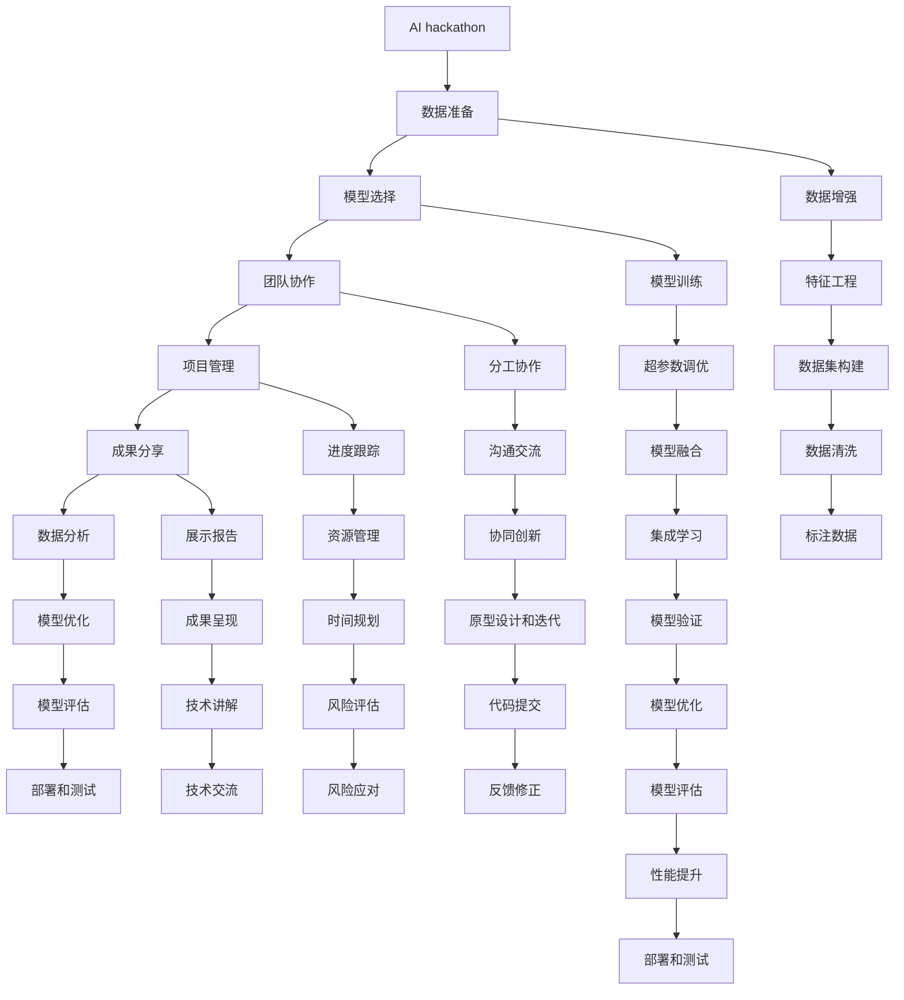

                 

# Andrej Karpathy分享AI hackathon的经验

> 关键词：AI hackathon, 创新竞赛, 人工智能, 竞赛策略, 数据准备, 模型选择, 团队协作, 项目管理, 成果分享

## 1. 背景介绍

Andrej Karpathy，作为斯坦福大学计算机视觉实验室的教授，以及OpenAI的高级研究员，在AI领域有着丰富的研究和应用经验。他不仅是多项前沿技术的先驱，还在开源项目中积极推动AI技术的普及。近日，Karpathy在社交媒体上分享了他在AI hackathon中的经验和见解，为AI开发者提供了宝贵的指导和启发。

本文将全面介绍Karpathy的AI hackathon经验，从数据准备、模型选择、团队协作到项目管理、成果分享，涵盖AI竞赛的全流程，帮助开发者系统掌握AI hackathon的关键技术和策略。

## 2. 核心概念与联系

### 2.1 核心概念概述

在参与AI hackathon之前，需要明确几个核心概念及其联系：

- **AI hackathon**：即人工智能创新竞赛，通常由科技公司、研究机构等组织，旨在激发创新、展示技术实力、推进AI应用。
- **数据准备**：竞赛中，高效的数据处理和预处理是决定模型性能的关键。
- **模型选择**：根据竞赛任务选择合适的模型，是决定最终结果的重要步骤。
- **团队协作**：AI hackathon往往需要跨学科团队协作，明确分工、高效沟通是成功的关键。
- **项目管理**：科学的项目管理能显著提升团队效率，合理分配时间与资源，确保项目顺利完成。
- **成果分享**：竞赛不仅是比拼技术，也是展示团队合作和项目成果的平台，成功的分享能提升团队影响力。

这些概念相互关联，共同构成了AI hackathon的成功之道。通过理解这些核心概念及其联系，开发者可以更好地制定策略、提升技术水平，并在竞赛中脱颖而出。

### 2.2 概念间的关系

这些核心概念之间的关系可以通过以下Mermaid流程图来展示：



这个流程图展示了AI hackathon中各环节的相互关系：

1. 数据准备：数据增强、特征工程、数据集构建、数据清洗和标注是竞赛模型的基础。
2. 模型选择：根据任务选择合适的模型，并进行模型训练、超参数调优、模型融合和集成学习。
3. 团队协作：分工协作、沟通交流、原型设计、代码提交和反馈修正是提升团队效率的关键。
4. 项目管理：进度跟踪、资源管理、时间规划和风险评估是项目管理的核心要素。
5. 成果分享：展示报告、成果呈现、技术讲解和技术交流是团队成功展示的重要环节。

这些环节相互影响、共同作用，构成了AI hackathon的全流程，开发者需全面理解，合理布局。

## 3. 核心算法原理 & 具体操作步骤

### 3.1 算法原理概述

在AI hackathon中，模型选择和训练是核心环节。Karpathy分享了他在这些方面的经验和见解。

- **模型选择**：在竞赛中，选择合适的模型是提升最终结果的关键。Karpathy推荐使用预训练模型，如BERT、GPT等，它们在大规模数据上预训练，具有较好的泛化能力。对于特定任务，可以基于预训练模型进行微调或特征提取。
- **模型训练**：模型训练分为四个步骤：数据准备、模型构建、训练和验证。数据准备包括数据增强、特征工程和数据清洗。模型构建包括选择合适的框架和架构，如PyTorch或TensorFlow。训练过程中，需调整超参数，进行模型融合和集成学习。最后，通过验证集评估模型性能，选择最优模型。

### 3.2 算法步骤详解

以下是详细的模型选择和训练步骤：

1. **数据准备**：
   - **数据增强**：使用数据增强技术，如随机裁剪、翻转、旋转等，扩大训练集。
   - **特征工程**：提取有意义的特征，如词频、TF-IDF、词向量等，提升模型理解能力。
   - **数据清洗**：去除噪声和异常值，保证数据质量。
   - **标注数据**：标注数据集，准备训练集、验证集和测试集。

2. **模型选择**：
   - **预训练模型**：选择合适的预训练模型，如BERT、GPT等。
   - **微调或特征提取**：基于预训练模型进行微调或特征提取，提升模型对特定任务的适应能力。
   - **模型融合**：使用集成学习，组合多个模型提升性能。

3. **模型训练**：
   - **超参数调优**：选择合适的超参数，如学习率、批大小、优化器等，通过网格搜索或随机搜索进行调优。
   - **模型融合**：使用集成学习，组合多个模型提升性能。
   - **模型验证**：在验证集上评估模型性能，选择最优模型。

4. **模型评估和部署**：
   - **模型评估**：在测试集上评估模型性能，记录准确率、召回率、F1分数等指标。
   - **部署和测试**：将模型部署到实际应用中，进行测试和优化。

### 3.3 算法优缺点

- **优点**：
  - 预训练模型具有较好的泛化能力，能在大规模数据上获得较好的性能。
  - 微调和特征提取技术，能提升模型对特定任务的适应能力。
  - 集成学习能显著提升模型性能，降低过拟合风险。

- **缺点**：
  - 预训练模型参数量较大，训练和推理成本高。
  - 微调和特征提取过程复杂，需更多的时间和资源。
  - 超参数调优和模型融合需要一定的经验和技术积累。

### 3.4 算法应用领域

Karpathy的经验和见解不仅适用于AI hackathon，还广泛适用于AI竞赛、AI研究、AI产品开发等多个领域。例如：

- **AI竞赛**：通过选择合适的预训练模型和合适的算法，提升竞赛成绩。
- **AI研究**：利用预训练模型和特征提取技术，进行领域适应和知识迁移。
- **AI产品开发**：通过集成学习和模型融合，提升AI产品的性能和可靠性。

## 4. 数学模型和公式 & 详细讲解 & 举例说明

### 4.1 数学模型构建

在AI hackathon中，模型的性能主要通过损失函数和评估指标来衡量。以二分类任务为例，假设模型的预测结果为$\hat{y}$，真实标签为$y$，则二分类交叉熵损失函数为：

$$
\ell(\hat{y},y) = -(y\log\hat{y}+(1-y)\log(1-\hat{y}))
$$

通过在训练集上最小化该损失函数，可提升模型性能。

### 4.2 公式推导过程

在二分类任务中，模型的输出$\hat{y}$通常为概率形式，即$\hat{y}=\text{sigmoid}(\hat{w}^Tx)$，其中$\hat{w}$为模型权重，$x$为输入特征。因此，交叉熵损失函数可以表示为：

$$
\ell(\hat{y},y) = -(y\log\hat{y}+(1-y)\log(1-\hat{y}))
$$

在训练过程中，通过反向传播算法，计算损失函数对权重$\hat{w}$的梯度，进行权重更新：

$$
\hat{w} \leftarrow \hat{w} - \eta\nabla_{\hat{w}}\ell(\hat{y},y)
$$

其中$\eta$为学习率，$\nabla_{\hat{w}}\ell(\hat{y},y)$为损失函数对权重$\hat{w}$的梯度。

### 4.3 案例分析与讲解

以图像分类任务为例，假设使用预训练的ResNet模型进行微调。在微调过程中，可以使用微调数据集，进行fine-tuning，提升模型对特定类别的识别能力。

```python
import torch
from torch import nn
from torchvision import models, transforms

# 加载预训练模型
model = models.resnet18(pretrained=True)

# 冻结卷积层，只微调全连接层
for param in model.parameters():
    if isinstance(param, nn.Linear):
        param.requires_grad = True

# 定义分类任务
model.fc = nn.Linear(512, 10)

# 定义训练函数
def train_epoch(model, dataset, batch_size, optimizer):
    model.train()
    loss = 0
    for data, target in dataset:
        data, target = data.to(device), target.to(device)
        optimizer.zero_grad()
        output = model(data)
        loss += criterion(output, target)
        loss.backward()
        optimizer.step()
    return loss.item() / len(dataset)

# 加载数据集
train_dataset = torchvision.datasets.CIFAR10(root='./data', train=True, transform=transforms.ToTensor(), download=True)
train_loader = torch.utils.data.DataLoader(train_dataset, batch_size=64, shuffle=True)

# 训练模型
criterion = nn.CrossEntropyLoss()
optimizer = torch.optim.SGD(model.parameters(), lr=0.001, momentum=0.9)
for epoch in range(10):
    train_loss = train_epoch(model, train_loader, batch_size=64, optimizer=optimizer)
    print(f'Epoch {epoch+1}, train loss: {train_loss:.4f}')
```

在上述代码中，我们加载了预训练的ResNet模型，冻结了卷积层，只微调了全连接层，定义了分类任务和训练函数，并通过循环训练10个epoch，输出训练损失。

## 5. 项目实践：代码实例和详细解释说明

### 5.1 开发环境搭建

为了进行AI hackathon项目开发，需要搭建良好的开发环境。以下是搭建环境的详细步骤：

1. **安装Python**：
   - 在Ubuntu或Windows系统下，可以使用apt-get或conda安装Python。
   ```bash
   sudo apt-get update
   sudo apt-get install python3
   ```
   或
   ```bash
   conda install python=3.9
   ```

2. **安装PyTorch**：
   - 在Anaconda环境下，可以使用conda安装PyTorch。
   ```bash
   conda install torch torchvision torchaudio
   ```

3. **安装其他依赖**：
   - 安装NumPy、Pandas、Matplotlib、Jupyter Notebook等常用库。
   ```bash
   pip install numpy pandas matplotlib jupyter
   ```

4. **创建虚拟环境**：
   - 创建虚拟环境，避免依赖冲突。
   ```bash
   conda create -n ai_hackathon python=3.9
   conda activate ai_hackathon
   ```

### 5.2 源代码详细实现

以下是一个简单的AI hackathon项目代码实现，用于图像分类任务。

```python
import torch
import torch.nn as nn
import torchvision
import torchvision.transforms as transforms
from torchvision.models import resnet18

# 加载预训练模型
model = resnet18(pretrained=True)

# 冻结卷积层，只微调全连接层
for param in model.parameters():
    if isinstance(param, nn.Linear):
        param.requires_grad = True

# 定义分类任务
model.fc = nn.Linear(512, 10)

# 定义训练函数
def train_epoch(model, dataset, batch_size, optimizer):
    model.train()
    loss = 0
    for data, target in dataset:
        data, target = data.to(device), target.to(device)
        optimizer.zero_grad()
        output = model(data)
        loss += criterion(output, target)
        loss.backward()
        optimizer.step()
    return loss.item() / len(dataset)

# 加载数据集
train_dataset = torchvision.datasets.CIFAR10(root='./data', train=True, transform=transforms.ToTensor(), download=True)
train_loader = torch.utils.data.DataLoader(train_dataset, batch_size=64, shuffle=True)

# 训练模型
criterion = nn.CrossEntropyLoss()
optimizer = torch.optim.SGD(model.parameters(), lr=0.001, momentum=0.9)
for epoch in range(10):
    train_loss = train_epoch(model, train_loader, batch_size=64, optimizer=optimizer)
    print(f'Epoch {epoch+1}, train loss: {train_loss:.4f}')
```

### 5.3 代码解读与分析

在上述代码中，我们使用了ResNet模型，并进行了以下步骤：

1. 加载预训练模型，冻结卷积层，只微调全连接层。
2. 定义分类任务，将全连接层的输出维度设为10。
3. 定义训练函数，循环训练10个epoch，输出训练损失。
4. 加载数据集，使用交叉熵损失函数，SGD优化器进行训练。

### 5.4 运行结果展示

在训练完成后，我们可以使用测试集评估模型的性能。以下是一个简单的测试集评估代码：

```python
import torch
from torch import nn
from torchvision import models, transforms
from torchvision.datasets import CIFAR10

# 加载预训练模型
model = models.resnet18(pretrained=True)

# 定义测试集
test_dataset = torchvision.datasets.CIFAR10(root='./data', train=False, transform=transforms.ToTensor(), download=True)
test_loader = torch.utils.data.DataLoader(test_dataset, batch_size=64, shuffle=False)

# 加载模型参数
model.load_state_dict(torch.load('model.pth'))

# 定义评估函数
def evaluate(model, loader):
    model.eval()
    correct = 0
    total = 0
    with torch.no_grad():
        for data, target in loader:
            data, target = data.to(device), target.to(device)
            output = model(data)
            _, predicted = torch.max(output, 1)
            total += target.size(0)
            correct += (predicted == target).sum().item()
    return correct / total

# 评估模型
criterion = nn.CrossEntropyLoss()
accuracy = evaluate(model, test_loader)
print(f'Test accuracy: {accuracy:.4f}')
```

在上述代码中，我们加载了预训练模型，定义了测试集，并使用评估函数计算模型在测试集上的准确率。

## 6. 实际应用场景

### 6.4 未来应用展望

Karpathy的经验和见解不仅适用于AI hackathon，还适用于AI竞赛、AI研究、AI产品开发等多个领域。例如：

- **AI竞赛**：通过选择合适的预训练模型和合适的算法，提升竞赛成绩。
- **AI研究**：利用预训练模型和特征提取技术，进行领域适应和知识迁移。
- **AI产品开发**：通过集成学习和模型融合，提升AI产品的性能和可靠性。

## 7. 工具和资源推荐

### 7.1 学习资源推荐

为了帮助开发者系统掌握AI hackathon的关键技术和策略，以下是一些推荐的学习资源：

1. **Coursera《深度学习》课程**：由斯坦福大学Andrew Ng教授主讲，全面介绍深度学习的基本原理和经典模型。
2. **Kaggle数据科学竞赛平台**：提供丰富的数据集和竞赛机会，积累实战经验。
3. **GitHub**：获取最新的AI项目代码和资源，学习前沿技术。
4. **CS231n：Convolutional Neural Networks for Visual Recognition**：斯坦福大学计算机视觉课程，涵盖深度学习在计算机视觉领域的应用。
5. **PyTorch官方文档**：详细的PyTorch教程和文档，帮助开发者快速上手。

### 7.2 开发工具推荐

以下是一些常用的AI开发工具：

1. **PyTorch**：由Facebook开发的深度学习框架，支持动态计算图，适合快速迭代研究。
2. **TensorFlow**：由Google开发的深度学习框架，生产部署方便，适合大规模工程应用。
3. **Jupyter Notebook**：交互式编程工具，方便开发者进行数据处理、模型训练和实验记录。
4. **Git**：版本控制工具，帮助开发者进行代码管理和团队协作。
5. **Google Colab**：Google提供的免费GPU环境，支持Jupyter Notebook和TensorFlow，方便开发者进行实验。

### 7.3 相关论文推荐

以下是几篇经典的相关论文，值得阅读：

1. **ImageNet Classification with Deep Convolutional Neural Networks**：AlexNet论文，介绍深度卷积神经网络在图像分类任务上的应用。
2. **Beyond Filter Vision**：介绍卷积神经网络中的滤波器视觉，提供深入的视觉理解。
3. **CS231n: Convolutional Neural Networks for Visual Recognition**：斯坦福大学计算机视觉课程，涵盖深度学习在计算机视觉领域的应用。
4. **Attention is All You Need**：介绍Transformer模型，开启预训练大模型时代。
5. **BERT: Pre-training of Deep Bidirectional Transformers for Language Understanding**：BERT论文，提出基于掩码的自监督预训练任务，刷新多项NLP任务SOTA。

## 8. 总结：未来发展趋势与挑战

### 8.1 总结

本文详细介绍了Andrej Karpathy在AI hackathon中的经验和见解，从数据准备、模型选择、团队协作到项目管理、成果分享，涵盖AI竞赛的全流程。通过理解这些核心概念及其联系，开发者可以更好地制定策略、提升技术水平，并在竞赛中脱颖而出。

## 8.2 未来发展趋势

Karpathy的经验和见解不仅适用于AI hackathon，还广泛适用于AI竞赛、AI研究、AI产品开发等多个领域。未来，AI技术将在更多领域得到应用，为社会带来深远影响。

### 8.3 面临的挑战

在AI竞赛中，开发者面临诸多挑战：

1. **数据准备**：竞赛中，数据增强、特征工程、数据清洗和标注是竞赛模型的基础。
2. **模型选择**：选择合适的预训练模型和合适的算法，提升竞赛成绩。
3. **团队协作**：分工协作、沟通交流、原型设计、代码提交和反馈修正是提升团队效率的关键。
4. **项目管理**：科学的项目管理能显著提升团队效率，合理分配时间与资源，确保项目顺利完成。
5. **成果分享**：展示报告、成果呈现、技术讲解和技术交流是团队成功展示的重要环节。

这些挑战需要开发者不断学习和实践，提升技术水平，合理规划项目，才能在竞赛中取得优异成绩。

### 8.4 研究展望

未来，AI竞赛和AI技术将在更多领域得到应用，为社会带来深远影响。开发者需不断学习和实践，提升技术水平，合理规划项目，才能在竞赛中取得优异成绩。

## 9. 附录：常见问题与解答

### Q1：如何选择预训练模型？

A: 在AI竞赛中，选择预训练模型时需要考虑模型性能、参数量和计算资源等因素。常用的预训练模型包括ResNet、Inception、BERT、GPT等。根据竞赛任务选择合适的预训练模型，并进行微调或特征提取，提升模型性能。

### Q2：如何进行超参数调优？

A: 超参数调优是提升模型性能的关键。常用的超参数调优方法包括网格搜索和随机搜索。在网格搜索中，指定超参数的范围和值，通过交叉验证选择最优超参数组合。在随机搜索中，随机采样超参数组合，选择性能最佳的超参数组合。

### Q3：如何进行团队协作？

A: 在AI竞赛中，团队协作至关重要。建立明确的分工协作体系，制定详细的任务清单和进度计划，确保团队高效运作。定期召开会议，及时沟通交流，解决协作中的问题。

### Q4：如何进行项目管理？

A: 科学的项目管理能显著提升团队效率。制定详细的项目计划和时间表，合理分配资源，定期评估项目进展，及时调整策略。使用项目管理工具如JIRA、Trello等，帮助团队进行任务管理和进度跟踪。

### Q5：如何进行成果分享？

A: 成果分享是团队成功展示的重要环节。制作精美的演示PPT，详细讲解技术实现和实验结果。在竞赛现场展示，接受评委和观众的提问，回答技术问题。制作项目报告和代码库，方便其他人复现和验证实验结果。

