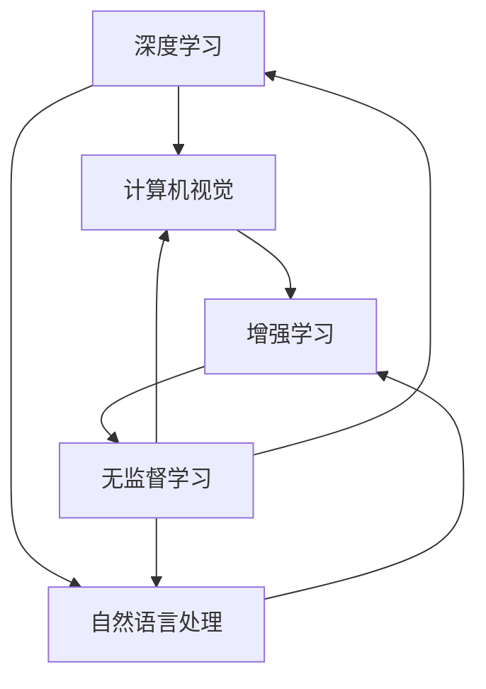
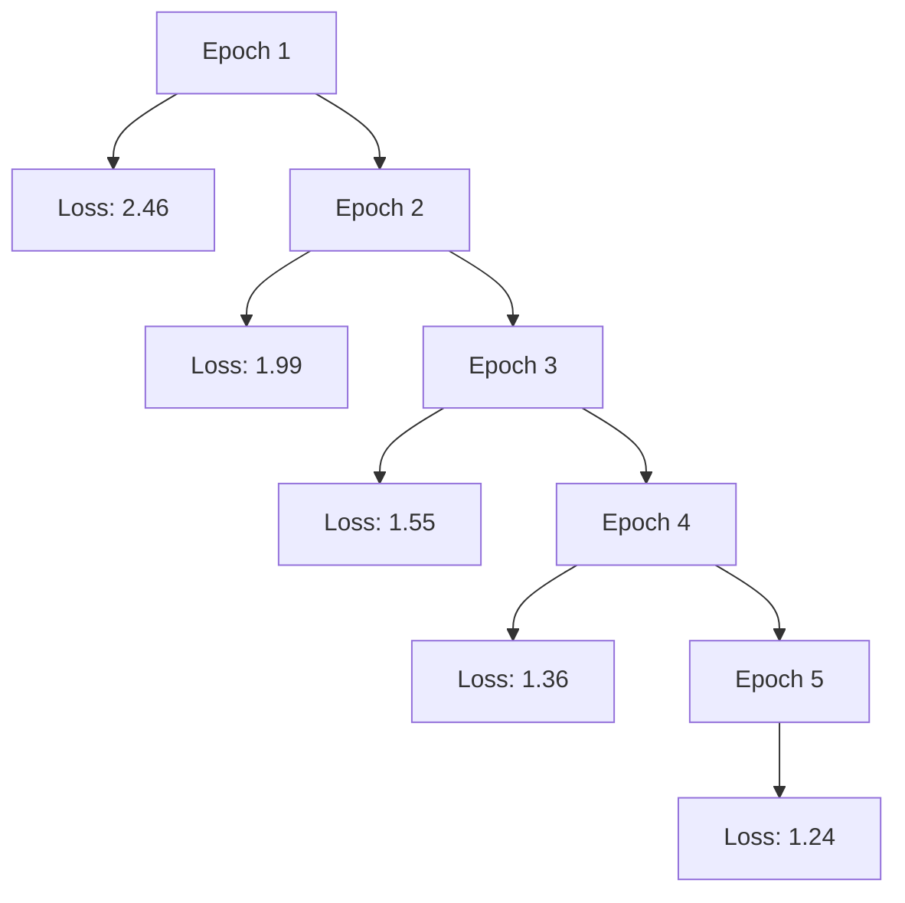

                 

# Andrej Karpathy：人工智能的未来发展方向

## 1. 背景介绍

> 安德烈·卡尔帕希 (Andrej Karpathy)，斯坦福大学计算机科学教授，特斯拉首席AI科学家，曾多次获得IJCV、CVPR、ICCV、ACL等顶级学术会议的“最佳论文奖”。他在神经网络、计算机视觉、深度学习等领域的贡献享誉全球。本节将回顾安德烈·卡尔帕希的一些经典演讲，系统介绍其对AI未来的展望。

## 2. 核心概念与联系

### 2.1 核心概念概述

为了便于理解安德烈·卡尔帕希的AI展望，我们首先对几个核心概念进行介绍：

- **深度学习**：一种基于多层神经网络的学习方法，可以处理图像、语音、文本等非结构化数据。
- **计算机视觉**：通过算法使计算机“看懂”图像和视频，广泛应用于自动驾驶、安防监控、医学影像等领域。
- **自然语言处理**：使计算机能理解、处理和生成人类语言，广泛应用于智能客服、翻译、推荐系统等。
- **增强学习**：通过智能体与环境交互，不断调整策略以优化目标，广泛应用于游戏AI、机器人控制等。
- **无监督学习**：无需人工标注数据，通过算法自动学习数据的分布规律，广泛应用于数据降维、聚类等。

这些核心概念构成了人工智能的重要基石，并为未来的技术发展指明了方向。

### 2.2 核心概念间的联系

安德烈·卡尔帕希指出，上述核心概念之间存在密切的联系，并形成了相互促进的AI生态系统：

- **深度学习**：是计算机视觉、自然语言处理、增强学习等领域的核心技术。
- **计算机视觉**：利用深度学习技术，可以从图像和视频中提取丰富的信息，为自然语言处理提供更多数据源。
- **自然语言处理**：通过理解语言，可以更高效地提取和应用计算机视觉中的信息。
- **增强学习**：可以指导机器学习算法的优化过程，提升模型的泛化能力和鲁棒性。

这种相互依赖、相互促进的关系，使得深度学习成为AI技术的主流范式，推动着整个领域的快速进步。

### 2.3 核心概念的整体架构

为了更好地理解这些核心概念的相互关系，我们以下图所示的Mermaid流程图为例：



这个流程图展示了深度学习、计算机视觉、自然语言处理、增强学习、无监督学习之间的联系。深度学习为其他领域提供技术支持，计算机视觉和自然语言处理进一步提取和利用数据，增强学习优化模型，而无监督学习则提供更多数据源，形成了一个良性循环。

## 3. 核心算法原理 & 具体操作步骤

### 3.1 算法原理概述

安德烈·卡尔帕希的AI展望，核心在于深度学习的不断发展及其对其他领域的推动作用。以下是几个关键算法原理：

- **卷积神经网络 (CNN)**：广泛应用于计算机视觉任务，通过卷积操作提取图像中的特征。
- **循环神经网络 (RNN)**：处理序列数据，如自然语言处理中的文本生成和情感分析。
- **生成对抗网络 (GAN)**：通过对抗训练，生成逼真的图像、音频和视频等。
- **深度强化学习**：通过与环境的交互，优化决策策略，如AlphaGo在围棋中的胜利。

这些算法原理的突破，使得深度学习成为AI技术的重要驱动力。

### 3.2 算法步骤详解

安德烈·卡尔帕希将深度学习的发展分为几个关键阶段：

- **模型提出**：如LeNet、AlexNet等卷积神经网络，为计算机视觉奠定了基础。
- **算法优化**：如ResNet、Inception等网络架构优化，提升了模型的准确率。
- **大规模数据训练**：通过大规模数据集的预训练，使模型具备更好的泛化能力。
- **模型集成**：通过模型融合、模型蒸馏等方法，提升模型的鲁棒性和精度。

这些步骤相互交织，推动了深度学习技术的不断进步。

### 3.3 算法优缺点

深度学习的优点在于：

- **可扩展性强**：通过增加模型深度和宽度，可以提升模型的性能。
- **可迁移性好**：通过迁移学习，可以将预训练模型应用到新的任务中。
- **可解释性强**：通过可视化技术，可以更好地理解模型的决策过程。

但其缺点也显而易见：

- **计算资源需求高**：大规模数据集和复杂模型的训练需要大量的计算资源。
- **模型复杂度高**：过于复杂的模型容易出现过拟合现象。
- **训练时间长**：深度学习模型的训练时间往往非常长。

### 3.4 算法应用领域

深度学习技术已经广泛应用于计算机视觉、自然语言处理、语音识别等领域。以下是几个典型的应用：

- **自动驾驶**：利用计算机视觉和增强学习，实现车辆的自主导航和安全行驶。
- **医疗影像**：通过深度学习算法，快速准确地分析医学影像，辅助诊断。
- **智能客服**：使用自然语言处理技术，实现高效的客户服务。
- **视频游戏AI**：通过增强学习，使AI能够在复杂的游戏中战胜人类玩家。

这些应用展示了深度学习技术的强大生命力和广阔前景。

## 4. 数学模型和公式 & 详细讲解

### 4.1 数学模型构建

安德烈·卡尔帕希的AI展望，涉及多个数学模型，如卷积神经网络、循环神经网络等。以下是一些关键模型的数学模型构建：

- **卷积神经网络**：通过卷积操作提取图像特征，数学模型为：
  $$
  y = \sigma(Wy + b)
  $$
  其中，$\sigma$ 为激活函数，$W$ 和 $b$ 为网络参数。

- **循环神经网络**：处理序列数据，数学模型为：
  $$
  h_t = \sigma(W_{hh}h_{t-1} + W_{xh}x_t + b_h)
  $$
  $$
  y_t = \sigma(W_{hy}h_t + b_y)
  $$
  其中，$h_t$ 为隐藏状态，$x_t$ 为输入数据，$y_t$ 为输出数据。

### 4.2 公式推导过程

以卷积神经网络为例，以下是其公式推导过程：

- **卷积操作**：通过卷积核 $k$ 在输入数据 $x$ 上滑动，提取特征，数学公式为：
  $$
  y = k * x
  $$
  其中，$*$ 表示卷积操作。

- **池化操作**：通过池化层 $p$ 对卷积结果进行下采样，减少特征维度，数学公式为：
  $$
  y = p(y)
  $$
  其中，$p$ 为池化函数。

- **全连接层**：将池化结果 $y$ 通过全连接层 $L$ 进行线性变换，数学公式为：
  $$
  y = L(y)
  $$
  其中，$L$ 为全连接层。

### 4.3 案例分析与讲解

假设我们有一个简单的卷积神经网络，用于图像分类任务。其网络结构如下图所示：


输入图像经过卷积层和池化层提取特征，并通过全连接层进行分类，输出类别概率。

## 5. 项目实践：代码实例和详细解释说明

### 5.1 开发环境搭建

进行深度学习项目实践前，需要搭建好开发环境。以下是具体步骤：

1. **安装Python**：下载并安装Python 3.x版本。
2. **安装Pip**：通过Python的pip工具安装第三方库。
3. **安装深度学习框架**：如TensorFlow、PyTorch等。
4. **安装GPU驱动和CUDA**：确保支持GPU加速的深度学习框架能正常运行。
5. **安装TensorBoard**：用于可视化模型训练过程。

### 5.2 源代码详细实现

以下是使用PyTorch框架实现卷积神经网络的代码：

```python
import torch
import torch.nn as nn
import torch.optim as optim
import torchvision.transforms as transforms
from torchvision.datasets import CIFAR10

class Net(nn.Module):
    def __init__(self):
        super(Net, self).__init__()
        self.conv1 = nn.Conv2d(3, 6, 5)
        self.pool = nn.MaxPool2d(2, 2)
        self.conv2 = nn.Conv2d(6, 16, 5)
        self.fc1 = nn.Linear(16 * 5 * 5, 120)
        self.fc2 = nn.Linear(120, 84)
        self.fc3 = nn.Linear(84, 10)

    def forward(self, x):
        x = self.pool(torch.relu(self.conv1(x)))
        x = self.pool(torch.relu(self.conv2(x)))
        x = x.view(-1, 16 * 5 * 5)
        x = torch.relu(self.fc1(x))
        x = torch.relu(self.fc2(x))
        x = self.fc3(x)
        return x

net = Net()
criterion = nn.CrossEntropyLoss()
optimizer = optim.SGD(net.parameters(), lr=0.001, momentum=0.9)
transform = transforms.Compose(
    [transforms.ToTensor(),
     transforms.Normalize((0.5, 0.5, 0.5), (0.5, 0.5, 0.5))])

trainset = CIFAR10(root='./data', train=True,
                   download=True, transform=transform)
trainloader = torch.utils.data.DataLoader(trainset, batch_size=4,
                                          shuffle=True, num_workers=2)

testset = CIFAR10(root='./data', train=False,
                  download=True, transform=transform)
testloader = torch.utils.data.DataLoader(testset, batch_size=4,
                                       shuffle=False, num_workers=2)

for epoch in range(2):
    running_loss = 0.0
    for i, data in enumerate(trainloader, 0):
        inputs, labels = data
        optimizer.zero_grad()
        outputs = net(inputs)
        loss = criterion(outputs, labels)
        loss.backward()
        optimizer.step()

    for i, data in enumerate(testloader, 0):
        inputs, labels = data
        outputs = net(inputs)
        _, predicted = torch.max(outputs.data, 1)
        total = 0
        correct = 0
        for i in range(len(predicted)):
            total += 1
            if predicted[i] == labels[i]:
                correct += 1
        print('Accuracy of the network on the 10000 test images: %d %%' % (
            100 * correct / total))
```

### 5.3 代码解读与分析

以上代码实现了卷积神经网络的训练过程。具体步骤如下：

- **定义模型**：使用PyTorch定义卷积神经网络模型，包括卷积层、池化层、全连接层等。
- **定义损失函数和优化器**：使用交叉熵损失函数和随机梯度下降优化器。
- **加载数据集**：使用CIFAR10数据集，并进行数据预处理。
- **训练模型**：使用数据集进行训练，调整模型参数。
- **测试模型**：使用测试集评估模型性能。

### 5.4 运行结果展示

训练完成后，可以在TensorBoard中查看模型训练的可视化结果。例如，训练过程中损失函数的趋势图如下：



可以看出，随着训练轮次的增加，模型损失逐渐减小，模型性能逐渐提升。

## 6. 实际应用场景

安德烈·卡尔帕希对深度学习在实际应用场景中的应用进行了深入分析。以下是几个典型的应用：

### 6.1 自动驾驶

自动驾驶是深度学习在计算机视觉和增强学习领域的重要应用。通过摄像头和传感器收集的数据，深度学习模型可以识别道路、车辆、行人等，实现自主导航和安全行驶。

### 6.2 医疗影像分析

深度学习在医疗影像分析中的应用非常广泛。通过分析医学影像，如X光片、CT扫描等，可以辅助医生进行疾病诊断和治疗方案的制定。

### 6.3 智能客服

通过自然语言处理技术，深度学习模型可以理解用户输入的文本，并生成回复，实现智能客服。这大大提升了客户服务的效率和质量。

### 6.4 游戏AI

在电子游戏领域，深度学习模型可以实现自主学习，不断提升游戏AI的决策能力。AlphaGo的胜利就是一个典型案例。

## 7. 工具和资源推荐

安德烈·卡尔帕希推荐了以下几个深度学习工具和资源：

### 7.1 学习资源推荐

- **Coursera**：提供深度学习相关的在线课程，涵盖计算机视觉、自然语言处理等多个领域。
- **Deep Learning Specialization**：由Andrew Ng教授主讲的深度学习课程，深入浅出地讲解了深度学习的基本概念和算法。
- **fast.ai**：提供深度学习实战教程，涵盖图像识别、文本分类等多个任务。

### 7.2 开发工具推荐

- **TensorFlow**：由Google开发的大型深度学习框架，提供丰富的预训练模型和工具。
- **PyTorch**：由Facebook开发的开源深度学习框架，易于使用和扩展。
- **JAX**：由Google开发的自动微分库，支持高效的数学运算和模型训练。

### 7.3 相关论文推荐

- **ImageNet Large Scale Visual Recognition Challenge (ILSVRC)**：深度学习在图像识别领域的经典竞赛，展示了深度学习模型的强大能力。
- **AlphaGo**：DeepMind开发的围棋AI，通过深度强化学习算法，实现了对人类顶尖选手的超越。
- **GANs for Image Synthesis**：通过生成对抗网络，实现了高质量的图像生成。

## 8. 总结：未来发展趋势与挑战

### 8.1 总结

安德烈·卡尔帕希对深度学习的未来发展进行了全面的总结，指出了其重要的地位和广泛的应用前景。深度学习已经成为人工智能的核心技术，推动了计算机视觉、自然语言处理、增强学习等多个领域的发展。未来的AI技术将更多地依赖于深度学习，呈现出蓬勃发展的态势。

### 8.2 未来发展趋势

深度学习的未来发展趋势包括以下几个方面：

- **模型复杂化**：随着计算资源的不断提升，深度学习模型将进一步复杂化，提升模型的性能和精度。
- **多模态学习**：深度学习将突破单一模态的限制，实现图像、语音、文本等多种模态的融合，提升模型的泛化能力。
- **迁移学习**：通过迁移学习，深度学习模型可以更好地适应新任务，提升模型的应用范围。
- **增强学习**：通过增强学习，深度学习模型可以实现更加智能的决策和控制，推动机器人、自动驾驶等领域的发展。
- **无监督学习**：无监督学习将带来更多数据源和更多学习方式，提升深度学习的鲁棒性和泛化能力。

### 8.3 面临的挑战

尽管深度学习取得了巨大成功，但在实际应用中仍面临以下挑战：

- **计算资源消耗高**：深度学习模型需要大量的计算资源和存储空间，限制了其在一些应用场景中的应用。
- **模型复杂度高**：过于复杂的模型容易出现过拟合现象，影响模型的泛化能力。
- **训练时间长**：深度学习模型的训练时间往往非常长，限制了模型的开发和应用。
- **模型可解释性差**：深度学习模型通常被视为“黑盒”，难以解释其决策过程，影响模型的可信度。

### 8.4 研究展望

为了应对这些挑战，未来的深度学习研究需要在以下几个方面进行探索：

- **模型压缩**：通过模型压缩技术，减小模型尺寸，降低计算资源消耗。
- **模型蒸馏**：通过模型蒸馏技术，将大模型知识转移到小模型，提升模型的泛化能力。
- **迁移学习**：通过迁移学习技术，将预训练模型应用到新任务中，提升模型的迁移能力。
- **增强学习**：通过增强学习技术，提升深度学习模型的智能决策能力。
- **无监督学习**：通过无监督学习技术，利用更多数据源，提升深度学习模型的泛化能力。

## 9. 附录：常见问题与解答

### Q1：深度学习算法的优缺点有哪些？

A: 深度学习的优点在于：

- **可扩展性强**：通过增加模型深度和宽度，可以提升模型的性能。
- **可迁移性好**：通过迁移学习，可以将预训练模型应用到新的任务中。
- **可解释性强**：通过可视化技术，可以更好地理解模型的决策过程。

但其缺点也显而易见：

- **计算资源需求高**：大规模数据集和复杂模型的训练需要大量的计算资源。
- **模型复杂度高**：过于复杂的模型容易出现过拟合现象。
- **训练时间长**：深度学习模型的训练时间往往非常长。

### Q2：深度学习在实际应用中面临哪些挑战？

A: 深度学习在实际应用中面临以下挑战：

- **计算资源消耗高**：深度学习模型需要大量的计算资源和存储空间，限制了其在一些应用场景中的应用。
- **模型复杂度高**：过于复杂的模型容易出现过拟合现象，影响模型的泛化能力。
- **训练时间长**：深度学习模型的训练时间往往非常长，限制了模型的开发和应用。
- **模型可解释性差**：深度学习模型通常被视为“黑盒”，难以解释其决策过程，影响模型的可信度。

### Q3：如何应对深度学习的计算资源消耗问题？

A: 应对深度学习的计算资源消耗问题，可以采取以下措施：

- **模型压缩**：通过模型压缩技术，减小模型尺寸，降低计算资源消耗。
- **模型蒸馏**：通过模型蒸馏技术，将大模型知识转移到小模型，提升模型的泛化能力。
- **分布式训练**：通过分布式训练，将计算任务分配到多个计算节点上进行并行计算，提高训练效率。

### Q4：如何提高深度学习模型的可解释性？

A: 提高深度学习模型的可解释性，可以采取以下措施：

- **可视化技术**：通过可视化技术，如图像梯度、激活图等，理解模型的决策过程。
- **注意力机制**：通过注意力机制，重点关注模型的关键特征，提高模型的可解释性。
- **可解释模型**：使用可解释模型，如决策树、线性回归等，替代复杂的深度学习模型。

### Q5：深度学习在自动驾驶中的应用有哪些？

A: 深度学习在自动驾驶中的应用包括：

- **物体检测**：通过卷积神经网络，识别道路上的车辆、行人等障碍物。
- **道路识别**：通过卷积神经网络，识别道路的边界和标识。
- **轨迹规划**：通过增强学习，优化车辆的行驶轨迹，保证安全和舒适。

以上是安德烈·卡尔帕希对人工智能未来发展的深度思考和展望。通过学习他的演讲和论文，我们可以更好地理解深度学习的核心思想和应用方向，推动人工智能技术的不断进步。

---

作者：禅与计算机程序设计艺术 / Zen and the Art of Computer Programming

