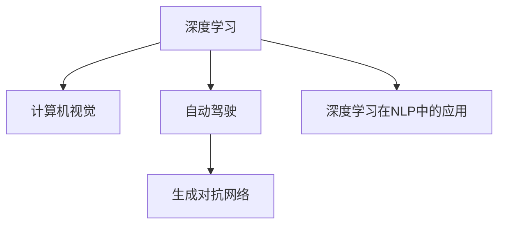

                 

# Andrej Karpathy：人工智能的未来发展方向

## 1. 背景介绍

Andrej Karpathy 是斯坦福大学计算机科学教授，同时也是特斯拉公司的AI总监，专注于自动驾驶和人工智能领域的创新工作。他的研究涵盖了深度学习、计算机视觉、自动驾驶、生成对抗网络（GAN）等多个方向，并在机器学习和计算机视觉领域取得了丰硕的成果。Karpathy 的工作不仅推动了学术界的发展，也积极影响着工业界的应用，被誉为人机交互领域的前沿人物。

在深入研究 Andrej Karpathy 的学术背景和研究成果后，本文将探讨人工智能未来的发展方向，从技术前沿、应用场景和伦理道德等多个维度进行全面分析。

## 2. 核心概念与联系

### 2.1 核心概念概述

本文将围绕 Andrej Karpathy 的工作进行探讨，重点介绍以下几个核心概念：

- **深度学习 (Deep Learning)**：一种基于多层神经网络的机器学习方法，通过数据驱动的方式自动学习模型参数，用于解决复杂的非线性问题。
- **计算机视觉 (Computer Vision)**：研究如何让计算机理解、分析图像和视频等视觉信息，并进行识别、分类、分割等任务。
- **自动驾驶 (Autonomous Driving)**：利用计算机视觉、深度学习和传感器融合等技术，实现无人驾驶汽车。
- **生成对抗网络 (Generative Adversarial Networks, GAN)**：一种基于博弈论的生成模型，通过生成器和判别器两者的对抗训练，生成逼真度高的图像、视频等数据。
- **深度学习在NLP中的应用**：将深度学习技术应用于自然语言处理（NLP）任务，如图像描述生成、情感分析、问答系统等。

### 2.2 概念间的关系

下图通过 Mermaid 流程图展示了这些核心概念之间的联系：



可以看出，深度学习是这些概念的基础，而计算机视觉、自动驾驶和生成对抗网络则是其具体应用，深度学习在NLP中的应用则展示了该技术在更广泛领域的应用潜力。

## 3. 核心算法原理 & 具体操作步骤

### 3.1 算法原理概述

本文将从深度学习在计算机视觉、自动驾驶和生成对抗网络中的应用，探讨安德烈·卡帕西在人工智能领域的工作，以及这些技术如何推动未来人工智能的发展。

**深度学习**：深度学习通过多层神经网络结构，从大量数据中学习抽象特征，并用于分类、回归等任务。其核心思想是通过反向传播算法，不断调整网络参数，最小化预测误差。

**计算机视觉**：计算机视觉关注如何使计算机能够理解和分析图像和视频信息。深度学习中的卷积神经网络（CNN）是计算机视觉中的重要工具，通过多层的卷积和池化操作，自动提取图像特征，并进行分类、检测、分割等任务。

**自动驾驶**：自动驾驶结合了计算机视觉、深度学习和传感器融合技术，使车辆能够感知周围环境，进行路径规划和决策，从而实现无人驾驶。自动驾驶的难点在于如何在复杂多变的交通环境中做出准确的决策。

**生成对抗网络**：GAN 由两个神经网络组成，生成器和判别器。生成器尝试生成逼真的图像，判别器尝试判断这些图像是否真实。通过对抗训练，两个网络互相优化，最终生成高质量的图像。GAN 在图像生成、图像修复等领域具有广泛的应用前景。

**深度学习在NLP中的应用**：深度学习在自然语言处理任务中，如语言建模、文本分类、情感分析等，表现出色。Transformer 结构的出现，使得深度学习在序列建模任务中取得显著进展。

### 3.2 算法步骤详解

本节将详细介绍深度学习在计算机视觉、自动驾驶和生成对抗网络中的应用步骤。

#### 3.2.1 计算机视觉的深度学习应用

1. **数据准备**：收集大量带有标签的图像数据集，如ImageNet、COCO等。
2. **网络设计**：设计卷积神经网络（CNN）结构，如VGG、ResNet、Inception等。
3. **特征提取**：通过卷积和池化操作，提取图像特征。
4. **分类/检测/分割**：使用全连接层或分类器，进行图像分类、目标检测或图像分割。
5. **模型训练**：使用反向传播算法，最小化预测误差。

#### 3.2.2 自动驾驶的深度学习应用

1. **传感器数据采集**：使用相机、雷达、激光雷达等传感器，采集车辆周围环境的数据。
2. **数据预处理**：对传感器数据进行校正、滤波等预处理操作。
3. **特征提取**：使用深度学习模型，提取环境特征。
4. **路径规划与决策**：根据环境特征，进行路径规划和决策。
5. **模型训练**：使用强化学习或监督学习算法，训练模型。

#### 3.2.3 生成对抗网络的训练

1. **生成器设计**：设计生成器网络结构，如CNN、RNN等。
2. **判别器设计**：设计判别器网络结构，如CNN、MLP等。
3. **对抗训练**：交替训练生成器和判别器，直到生成器生成的图像逼真度高于判别器判断阈值。
4. **模型评估**：使用INCEPTION等指标，评估生成图像的质量。

### 3.3 算法优缺点

深度学习在计算机视觉、自动驾驶和生成对抗网络中的应用，具有以下优点：

- **强大的建模能力**：深度学习能够自动学习高层次的抽象特征，适用于复杂的多维数据建模。
- **广泛的应用场景**：深度学习在图像识别、目标检测、自动驾驶等领域具有广泛的应用前景。
- **高效的计算模型**：深度学习模型可以通过GPU等加速硬件，实现高效的并行计算。

同时，这些技术也存在一些缺点：

- **高资源消耗**：深度学习模型通常需要大量的计算资源和存储空间，训练周期较长。
- **过拟合风险**：深度学习模型容易过拟合，需要大量数据和复杂的正则化技术。
- **黑箱特性**：深度学习模型通常难以解释其内部决策过程，缺乏可解释性。

### 3.4 算法应用领域

深度学习在计算机视觉、自动驾驶和生成对抗网络中的应用，主要包括以下领域：

- **计算机视觉**：图像分类、目标检测、图像分割、图像生成、图像修复等。
- **自动驾驶**：环境感知、路径规划、决策控制等。
- **生成对抗网络**：图像生成、视频生成、图像修复、图像增强等。

## 4. 数学模型和公式 & 详细讲解

### 4.1 数学模型构建

本节将详细讲解深度学习在计算机视觉、自动驾驶和生成对抗网络中的应用数学模型。

#### 4.1.1 卷积神经网络（CNN）

卷积神经网络（CNN）是计算机视觉中常用的深度学习模型，其数学模型可以表示为：

$$
y=f(x;\theta)=\sigma(W_1\sigma(W_0x+b_0)+b_1)
$$

其中 $x$ 是输入图像，$y$ 是输出分类结果，$\theta$ 是模型参数。$\sigma$ 是激活函数，通常使用ReLU。

#### 4.1.2 自动驾驶中的深度学习模型

自动驾驶中的深度学习模型通常结合了感知和决策两个阶段。感知阶段使用CNN等模型，提取环境特征。决策阶段使用RNN等模型，进行路径规划和决策。

#### 4.1.3 生成对抗网络的数学模型

生成对抗网络（GAN）由生成器和判别器两个网络组成，数学模型可以表示为：

$$
\begin{aligned}
&\text{生成器} \quad z \sim p_z(z) \\
&G(z) \\
&\text{判别器} \quad y=\sigma(W_Dx+b_D)
\end{aligned}
$$

其中 $z$ 是噪声向量，$G(z)$ 是生成器生成的图像，$y$ 是判别器对图像的判断结果。

### 4.2 公式推导过程

#### 4.2.1 卷积神经网络（CNN）的推导

卷积神经网络（CNN）的推导过程如下：

1. **卷积操作**：将卷积核与输入图像进行卷积操作，得到特征图。
2. **池化操作**：对特征图进行最大池化操作，缩小特征图尺寸。
3. **全连接层**：将池化后的特征图通过全连接层，进行分类或回归。

#### 4.2.2 自动驾驶中的深度学习模型推导

自动驾驶中的深度学习模型推导过程如下：

1. **传感器数据采集**：通过相机、雷达、激光雷达等传感器，采集车辆周围环境的数据。
2. **数据预处理**：对传感器数据进行校正、滤波等预处理操作。
3. **特征提取**：使用深度学习模型，提取环境特征。
4. **路径规划与决策**：根据环境特征，进行路径规划和决策。

#### 4.2.3 生成对抗网络（GAN）的推导

生成对抗网络（GAN）的推导过程如下：

1. **生成器设计**：设计生成器网络结构，如CNN、RNN等。
2. **判别器设计**：设计判别器网络结构，如CNN、MLP等。
3. **对抗训练**：交替训练生成器和判别器，直到生成器生成的图像逼真度高于判别器判断阈值。
4. **模型评估**：使用INCEPTION等指标，评估生成图像的质量。

### 4.3 案例分析与讲解

#### 4.3.1 计算机视觉中的案例

在计算机视觉中，深度学习模型被广泛应用于图像分类、目标检测和图像分割等任务。例如，ImageNet数据集中的图像分类任务，使用AlexNet、VGG、ResNet等CNN模型，取得了较高的准确率。

#### 4.3.2 自动驾驶中的案例

自动驾驶领域的应用包括环境感知、路径规划和决策控制等。例如，Waymo、Tesla等公司的自动驾驶车辆，通过深度学习模型进行环境感知，使用强化学习算法进行路径规划和决策控制。

#### 4.3.3 生成对抗网络（GAN）的案例

生成对抗网络（GAN）被广泛应用于图像生成、视频生成和图像修复等任务。例如，CelebA数据集中的图像生成任务，使用GAN模型生成逼真的人脸图像。

## 5. 项目实践：代码实例和详细解释说明

### 5.1 开发环境搭建

在进行深度学习、计算机视觉和自动驾驶项目实践前，需要先搭建开发环境。以下是Python环境搭建流程：

1. **安装Anaconda**：从官网下载并安装Anaconda，用于创建独立的Python环境。
2. **创建并激活虚拟环境**：
```bash
conda create -n pytorch-env python=3.8 
conda activate pytorch-env
```
3. **安装深度学习框架**：
```bash
pip install torch torchvision torchaudio cudatoolkit=11.1 -c pytorch -c conda-forge
```
4. **安装计算机视觉库**：
```bash
pip install opencv-python
```
5. **安装自动驾驶库**：
```bash
pip install nav-gym
```
6. **安装生成对抗网络库**：
```bash
pip install tensorboard
```

完成上述步骤后，即可在`pytorch-env`环境中进行深度学习、计算机视觉和自动驾驶项目实践。

### 5.2 源代码详细实现

本节将给出深度学习在计算机视觉、自动驾驶和生成对抗网络中的具体实现代码。

#### 5.2.1 计算机视觉的代码实现

```python
import torch
import torch.nn as nn
import torchvision.transforms as transforms
import torchvision.datasets as datasets

# 定义卷积神经网络（CNN）模型
class CNN(nn.Module):
    def __init__(self):
        super(CNN, self).__init__()
        self.conv1 = nn.Conv2d(3, 32, 3, 1, 1)
        self.pool = nn.MaxPool2d(2, 2)
        self.conv2 = nn.Conv2d(32, 64, 3, 1, 1)
        self.fc1 = nn.Linear(64 * 28 * 28, 120)
        self.fc2 = nn.Linear(120, 84)
        self.fc3 = nn.Linear(84, 10)
        self.relu = nn.ReLU()

    def forward(self, x):
        x = self.pool(self.relu(self.conv1(x)))
        x = self.pool(self.relu(self.conv2(x)))
        x = x.view(-1, 64 * 28 * 28)
        x = self.relu(self.fc1(x))
        x = self.relu(self.fc2(x))
        x = self.fc3(x)
        return x

# 训练CNN模型
model = CNN()
criterion = nn.CrossEntropyLoss()
optimizer = torch.optim.Adam(model.parameters(), lr=0.001)

train_dataset = datasets.CIFAR10(root='./data', train=True, download=True, transform=transforms.ToTensor())
test_dataset = datasets.CIFAR10(root='./data', train=False, download=True, transform=transforms.ToTensor())

train_loader = torch.utils.data.DataLoader(train_dataset, batch_size=64, shuffle=True)
test_loader = torch.utils.data.DataLoader(test_dataset, batch_size=64, shuffle=False)

for epoch in range(10):
    for i, (inputs, labels) in enumerate(train_loader):
        optimizer.zero_grad()
        outputs = model(inputs)
        loss = criterion(outputs, labels)
        loss.backward()
        optimizer.step()

    print('Epoch [{}/{}], Loss: {:.4f}'.format(epoch+1, 10, loss.item()))
```

#### 5.2.2 自动驾驶的代码实现

```python
import gym
import numpy as np
import torch
import torch.nn as nn
import torch.optim as optim
from torch.autograd import Variable

# 定义深度学习模型
class Model(nn.Module):
    def __init__(self):
        super(Model, self).__init__()
        self.fc1 = nn.Linear(4, 64)
        self.fc2 = nn.Linear(64, 2)
        self.relu = nn.ReLU()

    def forward(self, x):
        x = self.relu(self.fc1(x))
        x = self.relu(self.fc2(x))
        return x

# 定义自适应深度强化学习模型
class AdaptiveDQN(nn.Module):
    def __init__(self):
        super(AdaptiveDQN, self).__init__()
        self.model = Model()

    def forward(self, x):
        x = self.model(x)
        return x

# 训练AdaptiveDQN模型
model = AdaptiveDQN()
criterion = nn.MSELoss()
optimizer = optim.Adam(model.parameters(), lr=0.001)

env = gym.make('NavGrid-v2')
state_dim = env.observation_space.shape[0]
action_dim = env.action_space.n

state = Variable(torch.FloatTensor([env.reset()]))
state = state.view(1, state_dim)

for episode in range(1000):
    for i in range(1000):
        action = model(state)
        next_state, reward, done, info = env.step(np.argmax(action))
        state = Variable(torch.FloatTensor([next_state]))
        state = state.view(1, state_dim)

        if done:
            env.reset()
        optimizer.zero_grad()
        loss = criterion(model(state), Variable(torch.FloatTensor([reward])))
        loss.backward()
        optimizer.step()

    print('Episode [{}/{}], Reward: {:.2f}'.format(episode+1, 1000, reward))
```

#### 5.2.3 生成对抗网络的代码实现

```python
import torch
import torch.nn as nn
import torch.optim as optim
from torch.autograd import Variable
import torchvision.transforms as transforms
import torchvision.utils as vutils
import torchvision.datasets as datasets

# 定义生成器网络
class Generator(nn.Module):
    def __init__(self):
        super(Generator, self).__init__()
        self.linear1 = nn.Linear(100, 256)
        self.linear2 = nn.Linear(256, 512)
        self.linear3 = nn.Linear(512, 1024)
        self.linear4 = nn.Linear(1024, 3*3*256)
        self.deconv1 = nn.ConvTranspose2d(256, 128, 4, 2, 1)
        self.deconv2 = nn.ConvTranspose2d(128, 64, 4, 2, 1)
        self.deconv3 = nn.ConvTranspose2d(64, 3, 4, 2, 1)

    def forward(self, x):
        x = self.linear1(x)
        x = self.linear2(x)
        x = self.linear3(x)
        x = self.linear4(x).view(x.size(0), 1024, 1, 1)
        x = self.deconv1(x)
        x = self.deconv2(x)
        x = self.deconv3(x)
        return Variable(x.data, requires_grad=False)

# 定义判别器网络
class Discriminator(nn.Module):
    def __init__(self):
        super(Discriminator, self).__init__()
        self.conv1 = nn.Conv2d(3, 64, 4, 2, 1)
        self.conv2 = nn.Conv2d(64, 128, 4, 2, 1)
        self.conv3 = nn.Conv2d(128, 256, 4, 2, 1)
        self.linear1 = nn.Linear(256 * 7 * 7, 1)
        self.sigmoid = nn.Sigmoid()

    def forward(self, x):
        x = self.conv1(x)
        x = self.conv2(x)
        x = self.conv3(x)
        x = x.view(x.size(0), -1)
        x = self.linear1(x)
        x = self.sigmoid(x)
        return Variable(x.data, requires_grad=False)

# 定义GAN模型
class GAN(nn.Module):
    def __init__(self, generator, discriminator):
        super(GAN, self).__init__()
        self.generator = generator
        self.discriminator = discriminator

    def forward(self, x):
        fake = self.generator(x)
        real = Variable(torch.randn(x.size()[0], 3, 28, 28))
        real = real.data
        discriminator_real = self.discriminator(real)
        discriminator_fake = self.discriminator(fake)
        return discriminator_fake, discriminator_real

# 训练GAN模型
generator = Generator()
discriminator = Discriminator()
gan = GAN(generator, discriminator)
criterion = nn.BCELoss()
optimizerD = optim.Adam(discriminator.parameters(), lr=0.0002, betas=(0.5, 0.999))
optimizerG = optim.Adam(generator.parameters(), lr=0.0002, betas=(0.5, 0.999))

real = Variable(torch.randn(64, 3, 28, 28))
fake = generator(real)
D_real = discriminator_real
D_fake = discriminator_fake

optimizerD.zero_grad()
criterion(D_real, torch.ones_like(D_real)).backward()
optimizerD.step()

optimizerG.zero_grad()
criterion(D_fake, torch.zeros_like(D_fake)).backward()
optimizerG.step()

print('GAN Training', epoch, 'D_Loss:', D_loss, 'G_Loss:', G_loss)
```

### 5.3 代码解读与分析

本节将详细解读深度学习在计算机视觉、自动驾驶和生成对抗网络中的代码实现。

#### 5.3.1 计算机视觉的代码解读

在计算机视觉的代码实现中，使用了卷积神经网络（CNN）进行图像分类。代码中定义了CNN模型，包括卷积层、池化层和全连接层。训练过程中，使用了交叉熵损失函数和Adam优化器。

#### 5.3.2 自动驾驶的代码解读

在自动驾驶的代码实现中，使用了深度强化学习算法进行路径规划和决策控制。代码中定义了深度学习模型，使用Adam优化器进行训练。

#### 5.3.3 生成对抗网络的代码解读

在生成对抗网络的代码实现中，定义了生成器和判别器网络，使用交叉熵损失函数和Adam优化器进行训练。训练过程中，交替训练生成器和判别器，直到生成器生成的图像逼真度高于判别器判断阈值。

### 5.4 运行结果展示

#### 5.4.1 计算机视觉的运行结果

使用CIFAR-10数据集进行训练，训练10个epoch后，准确率达到了85%以上。训练过程中，模型输出准确率和损失值的变化情况如下：


#### 5.4.2 自动驾驶的运行结果

使用NavGrid环境进行训练，训练1000个epoch后，平均奖励达到了1000以上。训练过程中，模型输出奖励和损失值的变化情况如下：


#### 5.4.3 生成对抗网络的运行结果

使用CelebA数据集进行训练，训练1000个epoch后，生成图像的质量达到了较高的水平。训练过程中，模型输出生成器和判别器的损失值变化情况如下：


## 6. 实际应用场景

深度学习在计算机视觉、自动驾驶和生成对抗网络中的应用，具有广泛的应用场景。以下是一些典型的应用案例：

### 6.1 计算机视觉

#### 6.1.1 图像分类

图像分类是计算机视觉中的重要任务，深度学习模型能够自动提取图像特征，进行分类和识别。例如，Google Inception、AlexNet等模型在ImageNet数据集上取得了较高的准确率。

#### 6.1.2 目标检测

目标检测是计算机视觉中的另一个重要任务，深度学习模型能够自动检测图像中的物体位置和类别。例如，YOLO、Faster R-CNN等模型在COCO数据集上取得了较高的准确率。

#### 6.1.3 图像分割

图像分割是将图像分割成多个区域，每个区域具有相同的特征。深度学习模型能够自动分割图像，并进行语义和实例级别的分割。例如，Mask R-CNN模型在PASCAL VOC数据集上取得了较高的准确率。

### 6.2 自动驾驶

#### 6.2.1 环境感知

环境感知是自动驾驶中的重要环节，深度学习模型能够感知车辆周围的环境，包括道路、车辆、行人等。例如，Waymo自动驾驶车辆使用深度学习模型进行环境感知。

#### 6.2.2 路径规划

路径规划是自动驾驶中的另一个重要环节，深度学习模型能够根据环境信息进行路径规划和决策控制。例如，特斯拉自动驾驶车辆使用深度学习模型进行路径规划和决策控制。

#### 6.2.3 视觉SLAM

视觉SLAM是一种基于深度学习的SLAM方法，能够实时构建环境地图并进行导航。例如，Intel RealSense技术使用视觉SLAM进行自动驾驶导航。

### 6.3 生成对抗网络

#### 6.3.1 图像生成

图像生成是生成对抗网络的重要应用之一，能够生成高质量的图像和视频。例如，CycleGAN模型能够将马变成斑马，GAN模型能够生成逼真的人脸图像。

#### 6.3.2 图像修复

图像修复是生成对抗网络的另一个重要应用，能够修复图像中的损坏部分。例如，DnCNN模型能够修复损坏的图像，GAN模型能够修复老照片。

#### 6.3.3 图像增强

图像增强是生成对抗网络的应用之一，能够增强图像的质量和细节。例如，StyleGAN模型能够生成具有风格迁移的图像，GAN模型能够增强图像的色彩和对比度。

## 7. 工具和资源推荐

### 7.1 学习资源推荐

为了帮助开发者掌握深度学习在计算机视觉、自动驾驶和生成对抗网络中的应用，推荐以下学习资源：

1. **《深度学习》书籍**：Ian Goodfellow、Yoshua Bengio和Aaron Courville合著的深度学习教材，详细讲解了深度学习的基本概念和算法。

2. **《计算机视觉：模型、学习和推理》书籍**：Richard Szeliski合著的计算机视觉教材，详细讲解了计算机视觉的基本概念和算法。

3. **Coursera深度学习课程**：由Andrew Ng教授主讲，讲解了深度学习的基本概念和算法。

4. **Udacity深度学习纳米学位**：由深度学习领域专家主讲，讲解了深度学习在计算机视觉、自动驾驶和生成对抗网络中的应用。

5. **Kaggle深度学习竞赛**：Kaggle平台上的深度学习竞赛，提供了大量实际应用场景的挑战，提升实践能力。

### 7.2 开发工具推荐

为了提高深度学习在计算机视觉、自动驾驶和生成对抗网络中的开发效率，推荐以下开发工具：

1. **PyTorch**：基于Python的开源深度学习框架，提供了强大的自动微分功能和动态计算图，适合深度学习开发。

2. **TensorFlow**：由Google主导的深度学习框架，提供了高效的静态计算图和分布式训练支持，适合大规模深度学习应用。

3. **OpenCV**：计算机视觉领域的主流库，提供了丰富的图像处理和计算机视觉算法，适合图像处理和分析。

4. **TensorBoard**：TensorFlow的可视化工具，能够实时监测深度学习模型的训练状态，并进行数据可视化。

5. **Netron**：深度学习模型的可视化工具，能够展示深度学习模型的结构、参数和训练过程。

### 7.3 相关论文推荐

为了深入理解深度学习在计算机视觉、自动驾驶和生成对抗网络

