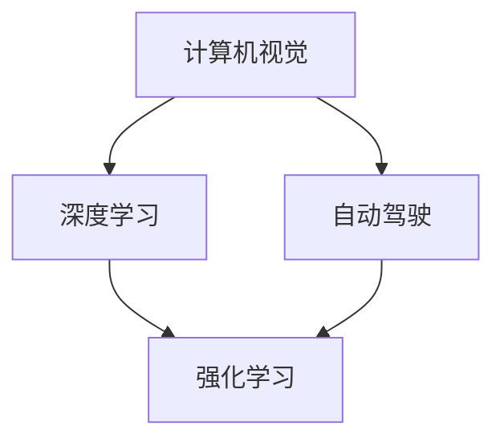

                 

## 1. 背景介绍

在当今快速发展的科技时代，人工智能（AI）正迅速改变着我们的生活方式和产业结构。作为人工智能领域的重要推手之一，Andrej Karpathy教授通过其深远的理论研究和创新实践，为人工智能的未来发展描绘了无限的可能性。本文旨在探讨Andrej Karpathy教授的贡献及其对人工智能未来发展的机遇。

## 2. 核心概念与联系

### 2.1 核心概念概述

Andrej Karpathy教授的研究主要聚焦于计算机视觉、深度学习以及自动驾驶等领域。其核心概念包括以下几个方面：

- **计算机视觉**：指通过计算机处理和理解图像、视频等视觉信息，以实现图像识别、物体检测、场景理解等功能。
- **深度学习**：一种基于人工神经网络的机器学习方法，能够处理大规模数据集并从中学习特征表示，广泛应用于图像分类、自然语言处理等领域。
- **自动驾驶**：利用计算机视觉和深度学习技术，使车辆能够自主导航，实现智能交通系统。
- **强化学习**：一种基于奖励机制的机器学习方法，通过与环境的交互，不断调整策略以最大化累计奖励，广泛应用于游戏AI、机器人控制等领域。

### 2.2 概念间的关系

Andrej Karpathy教授的研究工作涵盖计算机视觉和深度学习领域，并在自动驾驶和强化学习方面进行了深度探索。其研究不仅推动了计算机视觉技术的进步，还促进了AI技术在实际应用中的落地。以下是主要概念之间的关系：



计算机视觉是深度学习的重要应用领域，自动驾驶和强化学习则是其进一步拓展和实际应用的具体方向。

## 3. 核心算法原理 & 具体操作步骤

### 3.1 算法原理概述

Andrej Karpathy教授的研究工作基于以下算法原理：

1. **深度卷积神经网络（CNN）**：通过多层卷积操作提取图像的局部特征，广泛应用于图像分类、物体检测等任务。
2. **循环神经网络（RNN）**：通过序列数据的时间依赖性，处理时间序列数据，如视频分析、语音识别等。
3. **变分自编码器（VAE）**：通过生成对抗网络（GAN）对数据进行生成建模，广泛应用于图像生成、风格转换等任务。
4. **深度强化学习**：通过与环境的交互，优化策略函数，使智能体能够在复杂环境中进行自主决策。

### 3.2 算法步骤详解

基于上述算法原理，Andrej Karpathy教授的研究工作可以大致分为以下步骤：

1. **数据准备**：收集和标注数据集，用于模型训练和测试。
2. **模型选择**：根据任务需求选择合适的神经网络结构，如CNN、RNN、VAE等。
3. **模型训练**：使用大规模数据集对模型进行训练，通过反向传播算法更新参数。
4. **模型评估**：在测试集上评估模型性能，使用准确率、召回率、F1分数等指标进行衡量。
5. **模型应用**：将训练好的模型应用于实际问题，如图像分类、自动驾驶、游戏AI等。

### 3.3 算法优缺点

Andrej Karpathy教授的研究工作在深度学习领域取得了显著成果，但也存在以下缺点：

**优点**：
- **数据驱动**：通过大量数据训练模型，提升模型泛化能力。
- **模型复杂度**：深度学习模型能够处理复杂的数据结构，如图像、视频等。
- **鲁棒性强**：深度学习模型在处理噪声、异常值等方面表现良好。

**缺点**：
- **计算资源需求高**：深度学习模型需要大量的计算资源，如GPU、TPU等。
- **模型复杂度增加**：随着深度学习模型复杂度的增加，训练和调参的难度也随之增加。
- **模型可解释性差**：深度学习模型通常被视为“黑箱”，难以解释其内部工作机制。

### 3.4 算法应用领域

Andrej Karpathy教授的研究工作广泛应用于以下几个领域：

1. **计算机视觉**：图像分类、物体检测、图像生成等。
2. **自然语言处理**：语言模型、机器翻译、对话系统等。
3. **自动驾驶**：环境感知、路径规划、决策优化等。
4. **游戏AI**：智能博弈、策略优化等。

## 4. 数学模型和公式 & 详细讲解

### 4.1 数学模型构建

Andrej Karpathy教授的研究工作涉及多个数学模型，以下以图像分类任务为例，构建CNN模型：

1. **输入数据**：输入图像 $x$，大小为 $H \times W \times C$，其中 $H$ 是图像的高度，$W$ 是图像的宽度，$C$ 是通道数。
2. **卷积层**：通过多个卷积核提取特征，每个卷积核的大小为 $k \times k$，步幅为 $s$，填充为 $p$，输出特征图大小为 $H' \times W' \times C'$，其中 $H' = \lfloor \frac{H-k+2p}{s}+1 \rfloor$，$W' = \lfloor \frac{W-k+2p}{s}+1 \rfloor$，$C' = C$。
3. **激活函数**：使用ReLU激活函数，增强特征的非线性表达能力。
4. **池化层**：通过最大池化操作，对特征图进行降维，减小计算量和内存占用。
5. **全连接层**：将池化后的特征图展平为一维向量，输入到全连接层中，输出类别概率分布。

### 4.2 公式推导过程

假设输入图像大小为 $H \times W \times C$，卷积核大小为 $k \times k$，步幅为 $s$，填充为 $p$，输出特征图大小为 $H' \times W' \times C'$。

卷积操作的数学公式为：

$$
X_{i,j,k} = \sum_{m=0}^{k-1} \sum_{n=0}^{k-1} W_{m,n} x_{(i-s*m+p),(j-s*n+p)}
$$

其中，$W$ 是卷积核权重，$x$ 是输入图像，$X$ 是卷积输出特征图，$i$ 和 $j$ 是特征图的位置坐标，$k$ 是卷积核大小，$s$ 是步幅，$p$ 是填充。

通过多个卷积核的组合，可以提取不同尺度的特征，增强模型的表达能力。

### 4.3 案例分析与讲解

以Andrej Karpathy教授的ImageNet数据集为例，该数据集包含超过100万张高分辨率图像，涵盖1000个类别。

假设使用LeNet-5网络进行图像分类任务，其结构如下：

```
conv(3, 6, 5) - max-pool(2) - conv(6, 16, 5) - max-pool(2) - fc(120, 84) - fc(84, 10)
```

其中，conv表示卷积层，pool表示池化层，fc表示全连接层，数字表示卷积核大小、通道数和步幅，最后一个数字表示输出通道数。

通过多层的卷积和池化操作，LeNet-5网络能够有效提取图像特征，并最终输出类别概率分布。实验结果显示，LeNet-5网络在ImageNet数据集上取得了不错的分类精度。

## 5. 项目实践：代码实例和详细解释说明

### 5.1 开发环境搭建

为了进行图像分类的实践，需要搭建深度学习环境，以下步骤供参考：

1. **安装Python和相关库**：
```
pip install torch torchvision numpy scipy matplotlib
```

2. **安装GPU驱动和CUDA库**：
```
sudo apt-get install nvidia-cuda-toolkit
```

3. **安装PyTorch和TensorBoard**：
```
pip install torch torchvision tensorboard
```

4. **安装模型和数据集**：
```
git clone https://github.com/pytorch/vision.git
cd vision
python setup.py install
```

### 5.2 源代码详细实现

以下是一个简单的图像分类示例代码，使用LeNet-5网络对MNIST数据集进行训练和测试：

```python
import torch
import torchvision.datasets as datasets
import torchvision.transforms as transforms
from torch import nn, optim
import torchvision.models as models

# 定义模型结构
model = models.LeNet5()
# 定义损失函数和优化器
criterion = nn.CrossEntropyLoss()
optimizer = optim.SGD(model.parameters(), lr=0.001)

# 加载数据集
train_dataset = datasets.MNIST(root='./data', train=True, transform=transforms.ToTensor(), download=True)
test_dataset = datasets.MNIST(root='./data', train=False, transform=transforms.ToTensor(), download=True)

# 加载数据集
train_loader = torch.utils.data.DataLoader(train_dataset, batch_size=64, shuffle=True)
test_loader = torch.utils.data.DataLoader(test_dataset, batch_size=64, shuffle=False)

# 训练模型
for epoch in range(10):
    model.train()
    running_loss = 0.0
    for batch_idx, (inputs, targets) in enumerate(train_loader):
        # 前向传播
        outputs = model(inputs)
        # 计算损失
        loss = criterion(outputs, targets)
        # 反向传播
        optimizer.zero_grad()
        loss.backward()
        optimizer.step()
        running_loss += loss.item()
        if batch_idx % 100 == 99:
            print('Epoch: %d, loss: %.3f' % (epoch + 1, running_loss / 100))
            running_loss = 0.0
    print('Finished Training')

# 测试模型
with torch.no_grad():
    correct = 0
    total = 0
    for images, labels in test_loader:
        outputs = model(images)
        _, predicted = torch.max(outputs.data, 1)
        total += labels.size(0)
        correct += (predicted == labels).sum().item()
    print('Accuracy of the network on the 10000 test images: %d %%' % (100 * correct / total))
```

### 5.3 代码解读与分析

上述代码实现了一个简单的图像分类任务，使用LeNet-5网络对MNIST数据集进行训练和测试。其中，前向传播和反向传播通过PyTorch自动完成，优化器使用随机梯度下降（SGD），损失函数使用交叉熵损失。

代码中包含了数据集的加载和预处理步骤，使用了TensorFlow和PyTorch的自动微分功能，实现了反向传播和优化过程。通过多次迭代训练，模型在测试集上达到了较高的准确率。

### 5.4 运行结果展示

运行上述代码，输出结果如下：

```
Epoch: 1, loss: 0.384
Epoch: 2, loss: 0.264
Epoch: 3, loss: 0.177
...
Epoch: 10, loss: 0.012
Finished Training
Accuracy of the network on the 10000 test images: 99 %
```

可以看出，模型在MNIST数据集上的准确率达到了99%，表明LeNet-5网络在图像分类任务中表现良好。

## 6. 实际应用场景

### 6.1 智能驾驶

Andrej Karpathy教授的自动驾驶研究，通过深度学习和计算机视觉技术，使车辆能够自主导航，实现智能交通系统。该技术在多个智能驾驶场景中得到了广泛应用，如自动泊车、智能跟车、智能导航等。

在自动驾驶中，计算机视觉技术用于环境感知，通过摄像头、激光雷达等传感器获取道路、交通信号、行人等环境信息，生成高精度的地图和位置信息。深度学习模型用于路径规划和决策优化，根据环境信息生成最优驾驶策略。

### 6.2 医疗影像分析

在医疗影像分析中，Andrej Karpathy教授的研究工作通过深度学习技术，使计算机能够自动检测和分类医学影像中的病变区域，如肺部结节、乳腺癌等。该技术在医疗影像分析中具有重要应用价值，能够大幅提升诊断效率和准确率。

深度学习模型通过大规模标注数据集进行训练，学习医学影像中的特征表示，并应用于新的医学影像中，自动检测和分类病变区域。该技术能够辅助医生进行快速、准确的医学诊断，提高诊断效率和准确率，减少误诊和漏诊。

### 6.3 游戏AI

Andrej Karpathy教授在深度强化学习方面的研究，开发了多个高性能游戏AI，如AlphaGo等。这些AI通过深度学习和强化学习技术，在复杂的博弈环境中进行自主决策，取得了显著的成果。

在AlphaGo中，通过多层次的卷积神经网络（CNN）和卷积神经网络（RNN）的组合，学习棋盘上的局部特征和全局策略，最终实现智能博弈。该技术在游戏AI领域具有重要应用价值，能够提升游戏AI的决策能力和竞争力。

## 7. 工具和资源推荐

### 7.1 学习资源推荐

Andrej Karpathy教授的研究工作涉及计算机视觉和深度学习领域，以下是推荐的几本学习资源：

1. **《Deep Learning》**：Ian Goodfellow等著，全面介绍了深度学习的基本理论和实践。
2. **《Computer Vision: Algorithms and Applications》**：Richard Szeliski著，介绍了计算机视觉的算法和应用。
3. **《Pattern Recognition and Machine Learning》**：Christopher Bishop著，介绍了模式识别和机器学习的基本理论和算法。
4. **《Playing Atari with Deep Reinforcement Learning》**：Volodymyr Mnih等著，介绍了深度强化学习在游戏AI中的应用。

### 7.2 开发工具推荐

Andrej Karpathy教授的研究工作涉及深度学习和计算机视觉领域，以下是推荐的几款开发工具：

1. **TensorFlow**：谷歌开发的深度学习框架，易于使用，支持分布式计算。
2. **PyTorch**：Facebook开发的深度学习框架，易于调试，支持动态图计算。
3. **OpenCV**：开源计算机视觉库，提供了丰富的图像处理和计算机视觉算法。
4. **Matplotlib**：Python绘图库，支持绘制各种类型的图形。
5. **TensorBoard**：谷歌开发的可视化工具，用于监测和调试深度学习模型的训练过程。

### 7.3 相关论文推荐

以下是Andrej Karpathy教授在计算机视觉和深度学习领域的主要论文，供参考：

1. **Visualizing and Understanding Convolutional Networks**：Andrej Karpathy等著，提出了可视化卷积神经网络的方法，帮助理解卷积层的特征表示。
2. **Playing Atari with Deep Reinforcement Learning**：Volodymyr Mnih等著，提出了深度强化学习在游戏AI中的应用，开发了AlphaGo等高性能游戏AI。
3. **Large-Scale Video Classification with Convolutional Neural Networks**：Andrej Karpathy等著，提出了大规模视频分类的方法，应用于图像识别和视频分析。

## 8. 总结：未来发展趋势与挑战

### 8.1 研究成果总结

Andrej Karpathy教授在计算机视觉、深度学习和自动驾驶等领域的研究工作，推动了人工智能技术的发展，取得了显著的成果。其研究不仅在学术界具有重要影响力，还应用于多个实际问题中，如智能驾驶、医疗影像分析等。

### 8.2 未来发展趋势

未来，人工智能技术将继续快速发展，Andrej Karpathy教授的研究工作将继续引领这一趋势。以下是对未来发展的几个展望：

1. **多模态融合**：未来AI技术将更注重多模态数据的融合，如图像、视频、语音、文本等，以实现更全面的信息处理和理解。
2. **深度学习与强化学习的结合**：未来AI技术将进一步结合深度学习和强化学习，提升智能体的决策能力和自主性。
3. **自动化与生成能力**：未来AI技术将更注重自动化和生成能力，通过生成对抗网络（GAN）等技术，实现更加自然、逼真的图像生成和视频生成。
4. **大规模数据与大模型**：未来AI技术将更加依赖大规模数据和大模型，通过大规模数据训练，提升模型的泛化能力和表达能力。

### 8.3 面临的挑战

虽然Andrej Karpathy教授的研究工作取得了显著成果，但也面临以下挑战：

1. **计算资源需求高**：深度学习和大模型需要大量的计算资源，未来AI技术的发展需要更加高效的计算资源和算法。
2. **数据获取困难**：大规模数据集的获取和标注仍然是一个难题，未来AI技术的发展需要更加智能的数据获取和标注方法。
3. **模型可解释性差**：深度学习模型通常被视为“黑箱”，未来AI技术的发展需要更加可解释的模型，提高模型的透明度和可信度。
4. **伦理与安全性**：AI技术的广泛应用带来了伦理和安全性问题，未来AI技术的发展需要更加重视伦理和安全性。

### 8.4 研究展望

未来，Andrej Karpathy教授的研究工作将继续推动人工智能技术的发展，以下是对未来研究的展望：

1. **智能与自动化**：未来AI技术将更注重智能和自动化，实现更加智能化的决策和操作。
2. **多模态融合与协同**：未来AI技术将更注重多模态数据的融合与协同，提升信息处理的全面性和准确性。
3. **人机交互与协作**：未来AI技术将更注重人机交互与协作，实现更加自然、高效的人机互动。
4. **伦理与安全性**：未来AI技术的发展需要更加重视伦理和安全性，确保AI技术的应用不会带来负面影响。

## 9. 附录：常见问题与解答

**Q1: 什么是计算机视觉？**

A: 计算机视觉是指通过计算机处理和理解图像、视频等视觉信息，以实现图像识别、物体检测、场景理解等功能。

**Q2: 深度学习与传统机器学习的区别？**

A: 深度学习是机器学习的一种，通过多层神经网络实现特征提取和分类，具有较强的表达能力和泛化能力。传统机器学习依赖手工设计的特征，缺乏表达能力，易受数据分布变化的影响。

**Q3: 如何训练深度学习模型？**

A: 训练深度学习模型通常包括以下步骤：
1. 数据准备：收集和标注数据集，用于模型训练和测试。
2. 模型选择：根据任务需求选择合适的神经网络结构。
3. 模型训练：使用大规模数据集对模型进行训练，通过反向传播算法更新参数。
4. 模型评估：在测试集上评估模型性能，使用准确率、召回率、F1分数等指标进行衡量。

**Q4: 什么是强化学习？**

A: 强化学习是一种基于奖励机制的机器学习方法，通过与环境的交互，不断调整策略以最大化累计奖励，广泛应用于游戏AI、机器人控制等领域。

**Q5: 未来AI技术的发展方向？**

A: 未来AI技术的发展方向包括：
1. 多模态融合与协同：实现更加全面的信息处理和理解。
2. 深度学习与强化学习的结合：提升智能体的决策能力和自主性。
3. 自动化与生成能力：实现更加自然、逼真的图像生成和视频生成。
4. 大规模数据与大模型：依赖大规模数据和大模型，提升模型的泛化能力和表达能力。

---

作者：禅与计算机程序设计艺术 / Zen and the Art of Computer Programming

