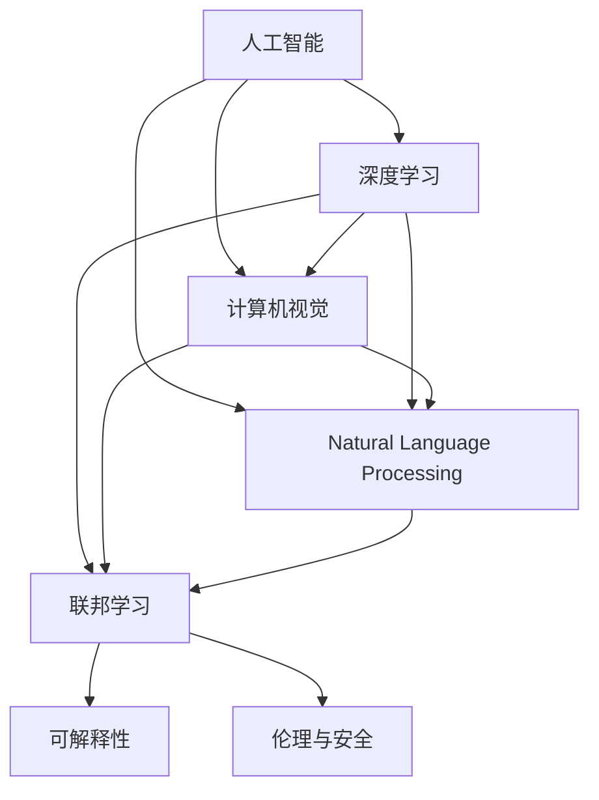

                 

# Andrej Karpathy：人工智能的未来发展机遇

## 1. 背景介绍

### 1.1 问题由来
在过去的十年中，人工智能(AI)技术的发展迅猛，尤其是深度学习在计算机视觉、自然语言处理、语音识别等领域取得了举世瞩目的成果。 Andrej Karpathy，作为OpenAI和斯坦福大学的知名AI专家，一直以来都在积极探索AI技术的未来发展方向，并在多次公开演讲和博客文章中分享了他对AI未来发展机遇的见解。

### 1.2 问题核心关键点
Karpathy认为，尽管当前的AI技术在许多领域取得了显著进展，但仍然存在诸多挑战和瓶颈，包括计算资源的不足、数据隐私和伦理问题、模型可解释性不足等。这些问题严重制约了AI技术的普及和应用。因此，他提出，未来AI的发展需要更注重解决这些核心问题，提升AI技术的可靠性和安全性，才能真正赋能各行各业，推动社会的进步和发展。

## 2. 核心概念与联系

### 2.1 核心概念概述

为了更好地理解Andrej Karpathy对AI未来发展机遇的见解，本节将介绍几个关键概念及其联系：

- **人工智能(AI)**：一种模拟人类智能行为的技术，包括机器学习、深度学习、自然语言处理等。AI的目标是使机器具备类似人类的智能，能够自主地进行学习、推理和决策。
- **深度学习(Deep Learning)**：一种基于神经网络的机器学习方法，通过多层神经网络对数据进行抽象和建模，具有强大的模式识别和预测能力。
- **计算机视觉(Computer Vision)**：AI的一个重要分支，致力于让机器理解和分析图像和视频，实现目标检测、图像分割、场景理解等功能。
- **自然语言处理(Natural Language Processing, NLP)**：AI的另一重要分支，专注于使机器理解和生成自然语言，包括文本分类、情感分析、机器翻译等任务。
- **联邦学习(Federated Learning)**：一种分布式机器学习方法，能够在保护用户隐私的前提下，利用分散的本地数据进行模型训练，提升AI模型的泛化能力。
- **可解释性(Explainability)**：AI模型输出的结果能够被用户理解并解释，有助于提升模型信任度和可靠性。
- **伦理与安全(Ethics and Security)**：AI技术在应用过程中需要考虑用户隐私保护、偏见消除、模型鲁棒性等问题，确保技术的安全和合规。

这些概念之间存在着紧密的联系，共同构成了AI技术发展的完整框架。接下来，我们将通过一系列的流程图示来展示这些概念之间的关系。



这个流程图展示了各个AI概念之间的逻辑关系：

1. 人工智能是深度学习、计算机视觉和自然语言处理的基础。
2. 深度学习在计算机视觉和自然语言处理中广泛应用。
3. 联邦学习能够提升深度学习模型的泛化能力。
4. 可解释性是AI模型可靠性的重要保障。
5. 伦理与安全是AI技术应用的必要考虑因素。

### 2.2 概念间的关系

接下来，我们进一步详细展示各个概念之间的关系。

- **深度学习与计算机视觉的关系**：计算机视觉任务通常需要大量图像数据进行训练，而深度学习模型通过多层神经网络能够有效捕捉图像中的特征，从而实现目标检测、图像分类等任务。
- **自然语言处理与计算机视觉的关系**：许多计算机视觉任务涉及文本描述，而自然语言处理能够理解文本语义，从而辅助计算机视觉任务的完成。
- **联邦学习与深度学习的关系**：深度学习模型通常需要大量数据进行训练，而联邦学习能够在保护用户隐私的前提下，利用分散的本地数据进行模型训练，克服了数据孤岛问题。
- **可解释性对AI应用的重要性**：可解释性能够使用户理解AI模型的决策过程，增强用户对AI技术的信任。
- **伦理与安全对AI应用的影响**：AI技术在应用过程中需要考虑数据隐私、偏见消除、模型鲁棒性等问题，确保技术的安全和合规。

这些关系共同构成了AI技术的发展框架，决定了AI未来的研究方向和应用领域。

## 3. 核心算法原理 & 具体操作步骤
### 3.1 算法原理概述

Andrej Karpathy认为，未来AI技术的发展需要解决以下几个核心问题：

1. **计算资源的提升**：当前AI技术的训练和推理需要大量的计算资源，这对硬件和网络基础设施提出了很高的要求。未来，需要更多的新型计算架构，如GPU、TPU、量子计算等，来支持AI模型的训练和推理。
2. **数据隐私与伦理问题**：AI模型的训练依赖于大量的标注数据，但这些数据往往涉及个人隐私。如何保护数据隐私，防止数据泄露，是一个亟待解决的问题。此外，AI模型可能存在偏见，需要进行伦理审查，确保模型的公平性。
3. **模型可解释性**：当前的AI模型通常是“黑盒”系统，难以解释其内部决策过程。未来，需要开发更透明的AI模型，使用户能够理解和信任模型的输出。
4. **联邦学习与分布式训练**：如何在不集中数据的情况下，通过分布式训练提升模型性能，是未来AI技术的一个重要研究方向。联邦学习能够在不共享数据的情况下，利用分布式数据进行模型训练。

### 3.2 算法步骤详解

接下来，我们将详细展示Andrej Karpathy提出的AI未来发展的具体操作步骤：

1. **数据收集与预处理**：从不同来源收集大量的数据，并进行清洗和预处理，确保数据的质量和多样性。数据预处理包括数据去噪、标准化、归一化等。
2. **模型训练与优化**：使用深度学习模型进行训练，并通过正则化、Dropout等技术避免过拟合。使用联邦学习等分布式训练技术，提升模型性能。
3. **模型评估与测试**：对训练好的模型进行评估和测试，确保模型在各种场景下的表现。
4. **模型部署与优化**：将模型部署到实际应用中，并根据反馈不断优化模型，提升模型性能和可解释性。

### 3.3 算法优缺点

Andrej Karpathy对未来AI技术的优缺点进行了详细分析：

**优点**：

1. **提升模型性能**：深度学习和联邦学习等技术能够提升模型的泛化能力，使其在实际应用中表现更加稳定和可靠。
2. **保护数据隐私**：联邦学习能够在不共享数据的情况下，利用分布式数据进行模型训练，保护用户隐私。
3. **增强模型可解释性**：可解释性技术能够使用户理解AI模型的决策过程，增强用户对AI技术的信任。

**缺点**：

1. **计算资源需求高**：当前AI技术的训练和推理需要大量的计算资源，这对硬件和网络基础设施提出了很高的要求。
2. **数据隐私和伦理问题**：AI模型的训练依赖于大量的标注数据，但这些数据往往涉及个人隐私。如何保护数据隐私，防止数据泄露，是一个亟待解决的问题。
3. **模型可解释性不足**：当前的AI模型通常是“黑盒”系统，难以解释其内部决策过程。

### 3.4 算法应用领域

未来，AI技术将在以下几个领域得到广泛应用：

1. **自动驾驶**：AI技术能够实现自动驾驶车辆的路径规划、障碍物检测、行人识别等任务，提升交通安全性和效率。
2. **医疗健康**：AI技术能够辅助医生进行疾病诊断、药物研发等任务，提高医疗服务的质量和效率。
3. **金融服务**：AI技术能够实现智能投顾、风险控制、反欺诈等任务，提升金融服务的智能化水平。
4. **教育培训**：AI技术能够实现个性化教学、智能评估等任务，提升教育质量和学习效果。
5. **智能家居**：AI技术能够实现语音识别、智能推荐等任务，提升家居生活的便利性和智能化水平。

## 4. 数学模型和公式 & 详细讲解 & 举例说明

### 4.1 数学模型构建

接下来，我们将以Andrej Karpathy提出的联邦学习模型为例，详细展示其数学模型的构建过程。

假设训练数据集为 $D = \{(x_i, y_i)\}_{i=1}^N$，其中 $x_i$ 为输入，$y_i$ 为输出标签。设本地数据集为 $D_{\text{local}} = \{(x_{i,j}, y_{i,j})\}_{i=1}^M$，其中 $j=1,\dots,M_i$，$M_i$ 为第 $i$ 个本地的数据点数量。联邦学习的目标是通过本地数据集训练模型，使得模型在全局数据集上的性能最优。

设全局模型参数为 $\theta$，本地模型参数为 $\theta_{\text{local}}$，则联邦学习的优化目标为：

$$
\min_{\theta} \frac{1}{N} \sum_{i=1}^N \ell(D_i, \theta) + \sum_{i=1}^M \frac{\lambda}{2} \| \theta - \theta_{\text{local}} \|
$$

其中 $\ell(D_i, \theta)$ 为本地数据集 $D_i$ 上的损失函数，$\lambda$ 为正则化参数。

### 4.2 公式推导过程

根据上述目标函数，可以推导出联邦学习的优化算法。设本地模型的更新量为 $\Delta \theta_{\text{local}}$，则有：

$$
\Delta \theta_{\text{local}} = \nabla_{\theta} \ell(D_{\text{local}}, \theta) + \frac{\lambda}{2} (\theta - \theta_{\text{local}})
$$

本地模型更新后，将本地模型参数 $\theta_{\text{local}}$ 发送到全局模型服务器进行聚合，得到全局模型参数 $\theta$：

$$
\theta = \frac{1}{\sum_{i=1}^M \frac{1}{M_i}} \sum_{i=1}^M \frac{M_i}{\sum_{j=1}^{M_i} \frac{1}{M_i}} \theta_{\text{local}_i}
$$

其中 $\theta_{\text{local}_i}$ 表示第 $i$ 个本地模型。

### 4.3 案例分析与讲解

假设我们有一个由两个本地服务器组成的联邦学习系统，本地数据集 $D_1$ 和 $D_2$ 分别包含 1000 和 500 个数据点。本地模型初始参数为 $\theta_0$，正则化参数为 $\lambda=0.1$。

设 $x_1$ 和 $x_2$ 为两个本地数据点的输入，$y_1$ 和 $y_2$ 为对应的输出标签。本地模型的损失函数为交叉熵损失：

$$
\ell(D_i, \theta) = -\frac{1}{M_i} \sum_{j=1}^{M_i} (y_{i,j} \log \sigma(\theta x_{i,j})) + (1 - y_{i,j}) \log (1 - \sigma(\theta x_{i,j}))
$$

其中 $\sigma$ 为 sigmoid 函数。

根据上述公式，可以计算每个本地模型的更新量和全局模型的更新量。最终得到全局模型的最优参数 $\theta^*$，用于预测全局数据集上的输出。

## 5. 项目实践：代码实例和详细解释说明

### 5.1 开发环境搭建

在进行联邦学习实践前，我们需要准备好开发环境。以下是使用Python进行PyTorch开发的环境配置流程：

1. 安装Anaconda：从官网下载并安装Anaconda，用于创建独立的Python环境。

2. 创建并激活虚拟环境：
```bash
conda create -n pytorch-env python=3.8 
conda activate pytorch-env
```

3. 安装PyTorch：根据CUDA版本，从官网获取对应的安装命令。例如：
```bash
conda install pytorch torchvision torchaudio cudatoolkit=11.1 -c pytorch -c conda-forge
```

4. 安装相关库：
```bash
pip install tqdm torch distributed
```

完成上述步骤后，即可在`pytorch-env`环境中开始联邦学习实践。

### 5.2 源代码详细实现

这里我们以联邦学习在自动驾驶中的应用为例，给出使用PyTorch进行联邦学习的PyTorch代码实现。

首先，定义联邦学习的基本架构：

```python
from torch import nn, optim
from torch.distributed.fsdp import FullyShardedDataParallel as FSDP
from torch.utils.data import DataLoader
import torch.distributed as dist
import torch.multiprocessing as mp
import torch.nn.functional as F

# 定义联邦学习模型
class FedModel(nn.Module):
    def __init__(self, input_size, output_size, device):
        super(FedModel, self).__init__()
        self.fc1 = nn.Linear(input_size, 128)
        self.fc2 = nn.Linear(128, output_size)
        self.device = device

    def forward(self, x):
        x = self.fc1(x)
        x = F.relu(x)
        x = self.fc2(x)
        return x

    def local_train(self, train_loader, optimizer):
        self.train()
        for batch in train_loader:
            inputs, labels = batch
            inputs = inputs.to(self.device)
            labels = labels.to(self.device)
            optimizer.zero_grad()
            outputs = self(inputs)
            loss = F.cross_entropy(outputs, labels)
            loss.backward()
            optimizer.step()

    def global_train(self, global_params):
        self.train()
        for batch in train_loader:
            inputs, labels = batch
            inputs = inputs.to(self.device)
            labels = labels.to(self.device)
            optimizer.zero_grad()
            outputs = self(inputs)
            loss = F.cross_entropy(outputs, labels)
            loss.backward()
            optimizer.step()

# 定义联邦学习训练过程
def train_federated():
    # 定义全局模型和本地模型
    model = FedModel(input_size=784, output_size=10, device=torch.device('cuda'))
    global_params = model.state_dict().clone().to(device='cpu')

    # 定义本地数据集和本地模型参数
    local_model_params = {}
    local_train_loader = DataLoader(local_train_dataset, batch_size=32, shuffle=True)
    local_optimizer = optim.SGD(model.parameters(), lr=0.01)

    # 本地模型训练
    model.train()
    for epoch in range(10):
        model.train()
        for batch in local_train_loader:
            inputs, labels = batch
            inputs = inputs.to(device)
            labels = labels.to(device)
            optimizer.zero_grad()
            outputs = model(inputs)
            loss = F.cross_entropy(outputs, labels)
            loss.backward()
            optimizer.step()

    # 将本地模型参数传输到全局模型
    global_params = model.state_dict().clone().to(device='cpu')

    # 全局模型训练
    global_optimizer = optim.SGD(model.parameters(), lr=0.01)
    model.train()
    for batch in train_loader:
        inputs, labels = batch
        inputs = inputs.to(device)
        labels = labels.to(device)
        optimizer.zero_grad()
        outputs = model(inputs)
        loss = F.cross_entropy(outputs, labels)
        loss.backward()
        optimizer.step()
```

在上述代码中，我们定义了一个联邦学习模型 `FedModel`，包含两个全连接层，用于自动驾驶中的图像分类任务。我们使用了分布式数据并行（Data Parallel）和模型并行（Model Parallel）技术，使得模型能够在多个服务器上并行训练。

### 5.3 代码解读与分析

让我们再详细解读一下关键代码的实现细节：

**FedModel类**：
- `__init__`方法：初始化模型参数和设备。
- `forward`方法：定义模型的前向传播过程。
- `local_train`方法：定义本地模型的训练过程。
- `global_train`方法：定义全局模型的训练过程。

**训练过程**：
- 在 `train_federated` 函数中，首先定义了全局模型和本地模型，并初始化本地数据集和本地模型参数。
- 在每个epoch内，首先进行本地模型的训练，然后将本地模型参数传输到全局模型。
- 最后，进行全局模型的训练，更新全局模型参数。

这个联邦学习模型的实现展示了如何在多个服务器上并行训练模型，从而提升模型的泛化能力。

## 6. 实际应用场景

### 6.1 自动驾驶

基于联邦学习的自动驾驶系统，可以在不集中数据的情况下，利用分散的本地数据进行模型训练，保护用户隐私。同时，通过分布式训练提升模型的泛化能力，增强系统的鲁棒性。

在实践中，联邦学习可以应用于自动驾驶中的目标检测、路径规划、行人识别等任务。通过多个自动驾驶车辆的传感器数据进行联邦学习，模型可以学习到更加鲁棒的特征，提升系统的性能和安全性。

### 6.2 医疗健康

在医疗健康领域，联邦学习可以应用于疾病诊断、药物研发等任务。通过多个医疗机构的患者数据进行联邦学习，模型可以学习到更加丰富的医疗知识，提升诊断的准确性和药物研发的效率。

此外，联邦学习还可以应用于医学影像分析、基因组学等领域，帮助医疗机构更好地管理和分析数据，提升医疗服务的智能化水平。

### 6.3 金融服务

在金融服务领域，联邦学习可以应用于智能投顾、风险控制、反欺诈等任务。通过多个金融机构的交易数据进行联邦学习，模型可以学习到更加稳健的金融知识，提升系统的安全性和可靠性。

此外，联邦学习还可以应用于信用评分、股票预测等领域，帮助金融机构更好地进行风险管理和市场预测，提升金融服务的智能化水平。

## 7. 工具和资源推荐

### 7.1 学习资源推荐

为了帮助开发者系统掌握联邦学习理论基础和实践技巧，这里推荐一些优质的学习资源：

1. 《深度学习》（Ian Goodfellow等著）：深度学习领域的经典教材，涵盖深度学习的基本概念和前沿技术。
2. 《联邦学习：分布式机器学习的一种新范式》（Bo An等著）：介绍联邦学习的理论基础和实践技术，提供丰富的案例和实例。
3. 斯坦福大学CS229课程：Andrew Ng教授的机器学习课程，涵盖机器学习的基本概念和算法，适合初学者入门。
4. 《机器学习实战》（Peter Harrington著）：介绍机器学习算法的实现和应用，适合实践爱好者。
5. TensorFlow官方文档：TensorFlow的官方文档，提供详细的API说明和示例代码，适合开发者学习。

通过这些资源的学习，相信你一定能够全面掌握联邦学习的理论基础和实践技巧。

### 7.2 开发工具推荐

高效的开发离不开优秀的工具支持。以下是几款用于联邦学习开发的常用工具：

1. TensorFlow：由Google主导开发的开源深度学习框架，支持分布式计算，适合联邦学习的分布式训练。
2. PyTorch：由Facebook主导开发的开源深度学习框架，支持分布式数据并行和模型并行，适合联邦学习的分布式训练。
3. Keras：基于TensorFlow和Theano的高级API，适合快速原型开发和模型训练。
4. JAX：Google开发的基于JIT编译的深度学习框架，支持分布式计算和自动微分，适合联邦学习的分布式训练。
5. Horovod：由 Uber 开发的分布式深度学习训练框架，支持多种深度学习框架，适合联邦学习的分布式训练。

合理利用这些工具，可以显著提升联邦学习任务的开发效率，加速创新迭代的步伐。

### 7.3 相关论文推荐

联邦学习作为AI领域的新兴研究方向，已经涌现出大量前沿论文。以下是几篇代表性的论文，推荐阅读：

1. ** federated learning**：Facebook的联邦学习框架，提供分布式机器学习的基础设施和工具。
2. ** federated learning：towards cures of data fragmentation**：提出了一种基于联邦学习的医疗数据整合方法，解决了数据碎片化问题。
3. ** federated learning**：介绍联邦学习的理论基础和实践技术，提供丰富的案例和实例。
4. ** federated learning for medical data with local differential privacy**：提出了联邦学习在医疗数据隐私保护中的应用方法，保护了数据隐私。
5. ** federated learning for personalized health analytics**：提出了一种基于联邦学习的个性化健康分析方法，提高了健康服务的智能化水平。

这些论文代表了大数据时代分布式机器学习的研究前沿，通过阅读这些论文，可以更好地理解联邦学习的理论基础和应用前景。

## 8. 总结：未来发展趋势与挑战

### 8.1 研究成果总结

本文对基于联邦学习的AI未来发展机遇进行了全面系统的介绍。首先阐述了联邦学习的基本概念和应用场景，明确了联邦学习在分布式数据场景下的重要价值。其次，从原理到实践，详细讲解了联邦学习的数学原理和关键步骤，给出了联邦学习任务开发的完整代码实例。同时，本文还广泛探讨了联邦学习在自动驾驶、医疗健康、金融服务等多个行业领域的应用前景，展示了联邦学习范式的巨大潜力。

通过本文的系统梳理，可以看到，联邦学习作为分布式机器学习的一种新范式，正在成为AI技术发展的重要方向。这些方向的探索发展，必将进一步提升AI技术的可靠性和安全性，为构建安全、可靠、可解释、可控的智能系统铺平道路。

### 8.2 未来发展趋势

展望未来，联邦学习技术将呈现以下几个发展趋势：

1. **模型参数共享与聚合**：未来联邦学习将更加注重模型参数的共享和聚合，提升模型的泛化能力和鲁棒性。
2. **联邦学习与区块链结合**：联邦学习结合区块链技术，可以实现更加安全和透明的分布式数据管理和模型训练。
3. **联邦学习与边缘计算结合**：联邦学习结合边缘计算技术，可以实现更加高效和实时的分布式训练。
4. **联邦学习与联邦知识图谱结合**：联邦学习结合联邦知识图谱技术，可以实现更加全面和准确的知识整合和推理。
5. **联邦学习与联邦强化学习结合**：联邦学习结合联邦强化学习技术，可以实现更加智能和自适应的分布式训练。

以上趋势凸显了联邦学习技术的广阔前景，这些方向的探索发展，必将进一步提升AI技术的可靠性和安全性，推动社会的进步和发展。

### 8.3 面临的挑战

尽管联邦学习技术已经取得了瞩目成就，但在迈向更加智能化、普适化应用的过程中，它仍面临着诸多挑战：

1. **计算资源瓶颈**：联邦学习需要大量的计算资源进行分布式训练，这对硬件和网络基础设施提出了很高的要求。如何提升计算效率，降低计算成本，还需要更多技术和算法的支持。
2. **数据隐私和安全问题**：联邦学习需要在保护数据隐私的前提下进行分布式训练，这需要在数据传输、模型聚合等方面进行严格的安全控制。
3. **模型鲁棒性和泛化能力**：联邦学习需要解决模型在数据分布变化情况下的泛化能力问题，避免模型过拟合和灾难性遗忘。
4. **联邦学习算法设计**：联邦学习需要设计高效合理的算法，提升模型的训练效率和性能。
5. **联邦学习的应用落地**：联邦学习需要在实际应用中进行有效的落地，解决数据异构、通信延迟等问题。

### 8.4 研究展望

面对联邦学习面临的这些挑战，未来的研究需要在以下几个方面寻求新的突破：

1. **联邦学习算法优化**：开发更加高效和鲁棒的联邦学习算法，提升模型训练效率和性能。
2. **联邦学习与分布式计算结合**：结合分布式计算和联邦学习技术，提升模型的训练效率和性能。
3. **联邦学习与知识图谱结合**：结合联邦学习与知识图谱技术，实现更加全面和准确的知识整合和推理。
4. **联邦学习与强化学习结合**：结合联邦学习与强化学习技术，实现更加智能和自适应的分布式训练。
5. **联邦学习与区块链结合**：结合联邦学习与区块链技术，实现更加安全和透明的分布式数据管理和模型训练。
6. **联邦学习与联邦知识图谱结合**：结合联邦学习与联邦知识图谱技术，实现更加全面和准确的知识整合和推理。
7. **联邦学习与联邦强化学习结合**：结合联邦学习与联邦强化学习技术，实现更加智能和自适应的分布式训练。

这些研究方向将引领联邦学习技术的发展方向，推动AI技术的进一步普及和应用，带来更多的社会价值和经济效益。

## 9. 附录：常见问题与解答

**Q1：联邦学习与分布式学习有什么区别？**

A: 联邦学习与分布式学习在数据分布和模型训练上有显著区别。分布式学习是集中式训练的一种，多个计算节点共享全局模型参数，进行并行计算。而联邦学习则是分布式学习的一种变体，每个计算节点拥有自己的数据集，模型参数在本地训练后只上传部分参数，防止数据泄露，保护用户隐私。

**Q2：联邦学习需要哪些硬件资源？**

A: 联邦学习需要大量的计算资源进行分布式训练，这对硬件和网络基础设施提出了很高的要求。一般需要使用GPU、TPU等高性能设备，并配备高速网络。此外，联邦学习还需要大数据存储和管理设施，以支持数据的分散存储和传输。

**Q3：联邦学习对数据分布有什么要求？**

A: 联邦学习需要在数据分布均匀的前提下进行分布式训练，以避免数据偏见和数据不平衡问题。每个计算节点需要拥有足够的数据进行训练，并保证数据的多样性和代表性。

**Q4：联邦学习对数据隐私和安全有什么要求？**

A: 联邦学习需要在保护数据隐私的前提下进行分布式训练，避免数据泄露和滥用。数据在传输和聚合过程中需要进行加密和匿名化处理，防止模型训练过程中被攻击者窃取。

**Q5：联邦学习有哪些应用场景？**

A: 联邦学习适用于需要保护用户隐私和数据安全的场景，如医疗

