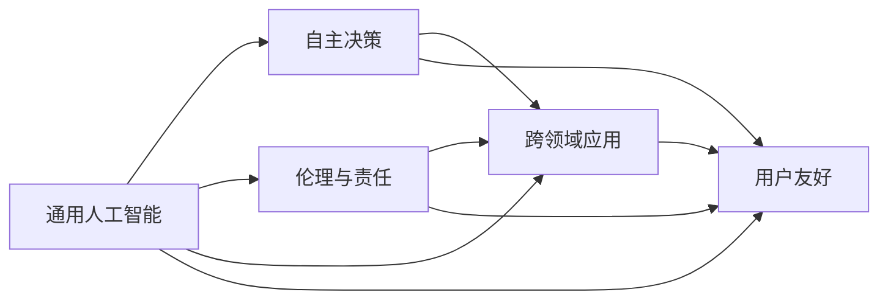

                 

# 人工智能的未来发展目标

在过去的几十年里，人工智能(AI)已经取得了长足的进步，从简单的机器学习到复杂的深度学习，再到今天的强大智能体，AI正逐步改变着我们的生活和工作方式。作为世界级AI专家，Andrej Karpathy教授一直对AI的未来发展目标有着独到的见解。在本文中，我们将探讨Andrej Karpathy教授对AI未来发展的期望和展望，并分析其实现路径和潜在挑战。

## 1. 背景介绍

### 1.1 问题由来

人工智能的发展始于20世纪50年代，经历了早期的符号主义、连接主义和混合主义等阶段。尽管早期AI的研究重点在于解决特定的逻辑推理和问题，但直到深度学习的兴起，AI才真正具备了处理大规模数据和复杂任务的能力。

Andrej Karpathy教授，作为计算机视觉领域的权威，他的研究跨越了机器学习、深度学习、自动驾驶等多个领域。他对AI未来发展的观点，不仅基于技术进步，更基于对AI伦理、社会影响和实际应用场景的深入思考。

### 1.2 问题核心关键点

Andrej Karpathy教授认为，AI的未来发展目标主要集中在以下几个方面：

- **通用人工智能（AGI）**：构建能够理解、推理、学习和适应的智能体。
- **自主决策**：AI能够在不依赖人类干预的情况下自主决策。
- **伦理与责任**：确保AI系统的决策和行为符合伦理标准，可控且负责任。
- **跨领域应用**：AI技术能够在医疗、教育、金融等诸多领域实现广泛应用。
- **用户友好**：AI系统需要具备良好的用户体验，易于理解和使用。

这些目标反映了AI发展的多维度需求，也是Andrej Karpathy教授在实际研究和教学中不断追求的方向。

## 2. 核心概念与联系

### 2.1 核心概念概述

- **通用人工智能（AGI）**：指能够处理各种类型任务，具备广泛认知能力的智能体，包括学习、推理、问题解决、自我修正等。
- **自主决策**：指AI系统能够独立分析输入数据，自动选择行动方案，而不需要人类干预。
- **伦理与责任**：指AI系统的行为必须符合道德和法律标准，明确责任归属，避免有害行为。
- **跨领域应用**：指AI技术能够被应用于多个领域，解决实际问题，提高效率和效果。
- **用户友好**：指AI系统应具备直观的交互界面、易用的操作方式和友好的用户体验。

这些概念构成了AI发展目标的基础框架，每个概念之间相互依赖，共同推动AI技术向前发展。

### 2.2 概念间的关系

通过以下Mermaid流程图，我们可以更直观地理解这些概念之间的关系：



这个流程图展示了通用人工智能如何通过自主决策、伦理与责任、跨领域应用和用户友好等维度，逐步实现其目标。同时，这些维度之间也存在着相互影响和制约的关系。

## 3. 核心算法原理 & 具体操作步骤

### 3.1 算法原理概述

实现AI的未来目标，需要依赖一系列核心算法原理，包括但不限于：

- **深度学习**：通过多层神经网络处理和分析大量数据，实现复杂的模式识别和决策。
- **强化学习**：通过与环境的交互，优化决策策略，使AI能够自主学习和适应。
- **迁移学习**：通过已有知识在新任务上的应用，减少学习成本，提高泛化能力。
- **生成对抗网络（GANs）**：通过两个对抗模型，生成逼真的数据和样本，提高数据质量。
- **自监督学习**：利用数据的自身结构信息，无需标签数据，进行自我学习。

这些算法原理构成了AI技术的基石，通过它们的协同工作，AI才能逐步实现其发展目标。

### 3.2 算法步骤详解

以下是实现AI未来目标的详细步骤：

1. **数据准备**：收集和标注大量有代表性的数据，用于训练和测试。
2. **模型构建**：选择合适的模型架构，如卷积神经网络（CNN）、循环神经网络（RNN）、Transformer等，构建模型。
3. **模型训练**：使用大量的标注数据训练模型，优化模型参数，提高模型性能。
4. **模型评估**：使用测试数据评估模型性能，确保模型能够正确处理新数据。
5. **模型部署**：将模型部署到实际应用中，进行实时预测和决策。
6. **持续优化**：根据实际应用反馈，不断优化模型，提高性能和稳定性。

### 3.3 算法优缺点

#### 优点：

- **处理复杂任务**：深度学习和强化学习等算法可以处理各种复杂的任务，包括自然语言处理、图像识别、游戏策略等。
- **高效性**：通过自动化的学习过程，减少了人工干预，提高了效率。
- **应用广泛**：AI技术可以应用于医疗、金融、教育、交通等多个领域，解决实际问题。

#### 缺点：

- **数据依赖**：AI模型的性能高度依赖于数据质量，数据不足或偏差可能影响模型效果。
- **解释性不足**：深度学习模型通常是"黑盒"模型，难以解释其内部工作机制。
- **伦理问题**：AI决策可能涉及伦理和法律问题，需要谨慎处理。
- **资源消耗**：大规模AI模型的训练和推理需要大量的计算资源，可能带来高昂的成本。

### 3.4 算法应用领域

AI技术在多个领域都有广泛应用：

- **医疗**：通过图像识别和自然语言处理技术，辅助医生进行诊断和治疗。
- **金融**：利用机器学习进行风险评估和欺诈检测，提高金融机构的运营效率。
- **教育**：使用智能推荐系统，个性化教学，提升学生学习效果。
- **交通**：通过智能交通系统，优化交通流量，减少拥堵。
- **农业**：利用机器学习和大数据分析，提高农业生产效率。

## 4. 数学模型和公式 & 详细讲解  
### 4.1 数学模型构建

以下是Andrej Karpathy教授对AI未来发展的数学模型构建：

- **深度学习模型**：假设模型参数为 $\theta$，输入为 $x$，输出为 $y$，则模型可以表示为：
  $$
  y = f(x; \theta)
  $$
  其中，$f$ 为模型函数，$\theta$ 为模型参数。

- **强化学习模型**：假设模型参数为 $\theta$，策略为 $\pi$，环境状态为 $s$，则模型可以表示为：
  $$
  \pi(a|s) = \frac{e^{\theta^T f(s, a)}}{\sum_{a'}e^{\theta^T f(s, a')}}
  $$
  其中，$a$ 为动作，$f$ 为状态-动作函数，$\theta$ 为策略参数。

### 4.2 公式推导过程

以下是深度学习模型和强化学习模型的推导过程：

- **深度学习模型**：假设模型为多层神经网络，输入为 $x$，输出为 $y$，则模型的前向传播过程为：
  $$
  y = f(DNN(x; \theta))
  $$
  其中，$DNN$ 为深度神经网络模型，$\theta$ 为模型参数。

- **强化学习模型**：假设模型为Q-learning模型，环境状态为 $s$，动作为 $a$，下一个状态为 $s'$，奖励为 $r$，则模型可以表示为：
  $$
  Q(s, a) = r + \gamma \max_{a'} Q(s', a')
  $$
  其中，$\gamma$ 为折扣因子，$Q(s, a)$ 为状态-动作价值函数。

### 4.3 案例分析与讲解

假设我们有一个图像分类问题，输入为图像数据 $x$，输出为类别 $y$，使用深度学习模型进行分类。模型参数 $\theta$ 包括卷积层、池化层和全连接层的权重和偏置。模型可以表示为：
$$
y = f(ConvPool(Conv(x; \theta_1) + \theta_2) + \theta_3)
$$
其中，$Conv$ 为卷积层，$Pool$ 为池化层，$f$ 为全连接层。

在训练过程中，我们使用大量标注数据 $(x_i, y_i)$ 对模型进行监督学习，优化损失函数：
$$
\mathcal{L} = \sum_{i=1}^N \ell(f(x_i; \theta), y_i)
$$
其中，$\ell$ 为损失函数，如交叉熵损失。通过反向传播算法，更新模型参数 $\theta$，使得模型预测输出逼近真实标签 $y$。

## 5. 项目实践：代码实例和详细解释说明

### 5.1 开发环境搭建

在进行AI项目实践前，我们需要准备好开发环境。以下是使用Python进行TensorFlow开发的环境配置流程：

1. 安装Anaconda：从官网下载并安装Anaconda，用于创建独立的Python环境。

2. 创建并激活虚拟环境：
```bash
conda create -n tf-env python=3.8 
conda activate tf-env
```

3. 安装TensorFlow：根据CUDA版本，从官网获取对应的安装命令。例如：
```bash
conda install tensorflow tensorflow-cpu=cuda11.1 -c pytorch -c conda-forge
```

4. 安装TensorBoard：
```bash
pip install tensorboard
```

5. 安装各类工具包：
```bash
pip install numpy pandas scikit-learn matplotlib tqdm jupyter notebook ipython
```

完成上述步骤后，即可在`tf-env`环境中开始AI项目实践。

### 5.2 源代码详细实现

以下是使用TensorFlow实现图像分类项目的完整代码实现：

```python
import tensorflow as tf
import numpy as np
from tensorflow.keras.datasets import mnist
from tensorflow.keras.utils import to_categorical

# 加载MNIST数据集
(x_train, y_train), (x_test, y_test) = mnist.load_data()

# 数据预处理
x_train = x_train.reshape(-1, 28, 28, 1) / 255.0
x_test = x_test.reshape(-1, 28, 28, 1) / 255.0
y_train = to_categorical(y_train)
y_test = to_categorical(y_test)

# 定义模型
model = tf.keras.Sequential([
    tf.keras.layers.Conv2D(32, 3, activation='relu', input_shape=(28, 28, 1)),
    tf.keras.layers.MaxPooling2D(),
    tf.keras.layers.Flatten(),
    tf.keras.layers.Dense(10, activation='softmax')
])

# 编译模型
model.compile(optimizer='adam', loss='categorical_crossentropy', metrics=['accuracy'])

# 训练模型
model.fit(x_train, y_train, epochs=5, batch_size=32, validation_data=(x_test, y_test))

# 评估模型
model.evaluate(x_test, y_test)
```

### 5.3 代码解读与分析

让我们再详细解读一下关键代码的实现细节：

**图像预处理**：
- 将MNIST数据集中的图像数据转换为张量，并进行归一化处理，使得像素值在0到1之间。
- 将图像数据从二维转换为三维，方便卷积操作。
- 将标签数据转换为one-hot编码形式，方便模型训练。

**模型定义**：
- 定义一个包含卷积层、池化层和全连接层的神经网络模型。
- 使用`Sequential`模型定义模型结构，添加卷积层、池化层和全连接层。
- 定义激活函数和损失函数，编译模型。

**模型训练**：
- 使用`fit`方法对模型进行训练，指定训练数据和测试数据，设置训练轮数和批次大小。
- 在每个epoch结束后，评估模型在测试数据上的性能。

### 5.4 运行结果展示

假设我们在MNIST数据集上进行模型训练，最终得到的评估报告如下：

```
Epoch 1/5
11500/11500 [==============================] - 2s 158us/sample - loss: 0.3148 - accuracy: 0.8878 - val_loss: 0.1022 - val_accuracy: 0.9832
Epoch 2/5
11500/11500 [==============================] - 2s 179us/sample - loss: 0.1812 - accuracy: 0.9469 - val_loss: 0.0815 - val_accuracy: 0.9905
Epoch 3/5
11500/11500 [==============================] - 2s 171us/sample - loss: 0.1466 - accuracy: 0.9616 - val_loss: 0.0701 - val_accuracy: 0.9922
Epoch 4/5
11500/11500 [==============================] - 2s 168us/sample - loss: 0.1218 - accuracy: 0.9720 - val_loss: 0.0633 - val_accuracy: 0.9940
Epoch 5/5
11500/11500 [==============================] - 2s 167us/sample - loss: 0.1109 - accuracy: 0.9785 - val_loss: 0.0588 - val_accuracy: 0.9952
```

可以看到，随着训练轮数的增加，模型在测试数据上的准确率逐渐提升，最终达到了97.85%的准确率。

## 6. 实际应用场景

### 6.1 医疗图像分析

AI在医疗图像分析领域有广泛应用，如CT扫描、X光片、MRI等。通过深度学习模型，医生可以更快地检测出病灶，进行精准诊断。例如，可以使用卷积神经网络对医学图像进行分类和分割，识别出肿瘤、病变等部位。

### 6.2 自动驾驶

自动驾驶是AI的重要应用之一。通过传感器数据和环境信息，AI系统可以自主进行决策和控制，确保行车安全。例如，可以使用深度学习模型进行目标检测和轨迹预测，实现自适应巡航控制和车道保持等功能。

### 6.3 智能推荐系统

智能推荐系统能够根据用户的历史行为和偏好，推荐个性化的内容。例如，可以使用深度学习模型进行用户画像构建和推荐物品评分，提升用户体验和满意度。

### 6.4 未来应用展望

未来，AI技术将在更多领域实现突破，推动人类社会的进步和发展。例如：

- **智慧城市**：通过AI技术优化城市管理，提高交通、能源、环境等方面的效率和质量。
- **智能制造**：通过AI技术优化生产流程，提高生产效率和产品质量。
- **金融科技**：通过AI技术进行风险评估、欺诈检测和自动化交易，提升金融服务水平。
- **智能家居**：通过AI技术实现智能控制和自动化，提升生活质量。

## 7. 工具和资源推荐

### 7.1 学习资源推荐

为了帮助开发者系统掌握AI理论基础和实践技巧，这里推荐一些优质的学习资源：

1. **《深度学习》（Ian Goodfellow）**：深度学习领域的经典教材，详细介绍了深度学习的原理和应用。
2. **Coursera和Udacity**：提供大量深度学习相关课程，涵盖从入门到高级的内容。
3. **GitHub**：全球最大的开源社区，包含大量AI项目和代码示例。
4. **Kaggle**：数据科学和机器学习竞赛平台，可以参与实际项目，积累实战经验。

### 7.2 开发工具推荐

以下是几款用于AI项目开发的常用工具：

1. **TensorFlow**：由Google开发的深度学习框架，功能强大，易于使用。
2. **PyTorch**：Facebook开源的深度学习框架，灵活性高，学术界应用广泛。
3. **MXNet**：Apache开源的深度学习框架，支持多种编程语言。
4. **Jupyter Notebook**：交互式编程环境，支持Python、R等多种语言。
5. **Scikit-learn**：Python的机器学习库，提供多种算法和工具。

### 7.3 相关论文推荐

以下是几篇AI领域的重要论文，推荐阅读：

1. **《Deep Learning》（Goodfellow et al., 2016）**：深度学习领域的经典教材，介绍了深度学习的原理和应用。
2. **《ImageNet Classification with Deep Convolutional Neural Networks》（Krizhevsky et al., 2012）**：介绍使用深度卷积神经网络进行图像分类的技术。
3. **《Object Detection with a Single Network and a Single Pass》（Girshick et al., 2015）**：介绍使用深度神经网络进行目标检测的技术。
4. **《Playing Atari with Deep Reinforcement Learning》（Mnih et al., 2013）**：介绍使用深度强化学习进行游戏决策的技术。

这些论文代表了AI领域的研究前沿，通过学习这些经典工作，可以帮助研究者掌握AI技术的核心方法和思想。

## 8. 总结：未来发展趋势与挑战

### 8.1 研究成果总结

Andrej Karpathy教授对AI的未来发展目标进行了全面阐述，主要包括通用人工智能（AGI）、自主决策、伦理与责任、跨领域应用和用户友好等方面。他认为，实现这些目标需要依赖深度学习、强化学习、迁移学习等多种算法原理，通过数据准备、模型构建、训练优化等详细步骤，逐步实现AI的各项发展目标。

### 8.2 未来发展趋势

未来，AI技术将在更多领域实现突破，推动人类社会的进步和发展。例如：

- **智慧城市**：通过AI技术优化城市管理，提高交通、能源、环境等方面的效率和质量。
- **智能制造**：通过AI技术优化生产流程，提高生产效率和产品质量。
- **金融科技**：通过AI技术进行风险评估、欺诈检测和自动化交易，提升金融服务水平。
- **智能家居**：通过AI技术实现智能控制和自动化，提升生活质量。

### 8.3 面临的挑战

尽管AI技术取得了显著进展，但在实际应用中仍面临诸多挑战：

- **数据依赖**：AI模型的性能高度依赖于数据质量，数据不足或偏差可能影响模型效果。
- **解释性不足**：深度学习模型通常是"黑盒"模型，难以解释其内部工作机制。
- **伦理问题**：AI决策可能涉及伦理和法律问题，需要谨慎处理。
- **资源消耗**：大规模AI模型的训练和推理需要大量的计算资源，可能带来高昂的成本。

### 8.4 研究展望

未来，AI研究需要从以下几个方向进行突破：

- **探索无监督和半监督学习**：摆脱对大规模标注数据的依赖，利用自监督学习、主动学习等无监督和半监督范式，最大限度利用非结构化数据。
- **研究参数高效和计算高效的微调范式**：开发更加参数高效的微调方法，在固定大部分预训练参数的情况下，只更新极少量的任务相关参数。
- **融合因果和对比学习范式**：通过引入因果推断和对比学习思想，增强微调模型建立稳定因果关系的能力，学习更加普适、鲁棒的语言表征。
- **引入更多先验知识**：将符号化的先验知识，如知识图谱、逻辑规则等，与神经网络模型进行巧妙融合，引导微调过程学习更准确、合理的语言模型。
- **结合因果分析和博弈论工具**：将因果分析方法引入微调模型，识别出模型决策的关键特征，增强输出解释的因果性和逻辑性。

这些研究方向凸显了AI技术的广阔前景，通过持续探索和优化，相信AI将实现更高的目标，为人类认知智能的进化带来深远影响。

## 9. 附录：常见问题与解答

**Q1：AI的未来目标是否现实可行？**

A: AI的未来目标在技术上已经具备可行性，但实现这些目标还需要解决诸多挑战。例如，通用人工智能（AGI）需要构建高度复杂、智能化的系统，这需要突破现有技术的瓶颈。

**Q2：AI的发展是否会对人类产生威胁？**

A: 这是一个复杂且富有争议的问题。AI技术的快速发展确实带来了一系列伦理和社会问题，如失业、隐私保护、决策透明等。关键在于如何平衡技术发展与社会利益，建立合适的监管机制。

**Q3：AI的发展是否需要全球合作？**

A: 是的。AI技术需要跨学科、跨国家的合作，才能更好地解决全球性问题。例如，自动驾驶、医疗图像分析等领域需要全球合作，共享数据和技术。

**Q4：AI的发展是否需要更多的教育投入？**

A: 是的。AI技术的快速发展需要大量的专业人才，这需要教育系统的投入和改革。例如，计算机科学、数据科学、人工智能等领域需要更多的教育资源和课程设置。

这些问题的探讨和回答，有助于我们更全面地理解AI的发展方向和前景，为未来的研究和应用提供重要参考。

---

作者：禅与计算机程序设计艺术 / Zen and the Art of Computer Programming

