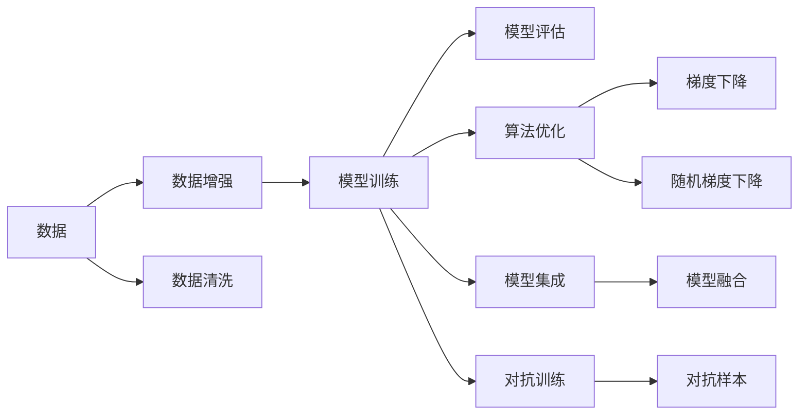

                 

## 1. 背景介绍

Andrej Karpathy 是一位享誉全球的人工智能领域专家，他在深度学习、计算机视觉、自动驾驶等多个方向都有深刻的见解和研究成果。作为一名技术爱好者和开源推动者，他通过社交媒体、博客、讲座等形式，积极分享自己的知识和经验，对技术界产生了深远的影响。本文将通过对其最新的技术分享和未来发展策略的梳理，探索人工智能未来的发展方向。

## 2. 核心概念与联系

### 2.1 核心概念概述

Karpathy 强调了数据、算法和模型在人工智能发展中的核心地位。以下是几个关键概念：

- **数据**：作为深度学习模型训练的基础，数据的多样性和质量直接影响模型的表现。Karpathy 倡导从真实世界获取高质量标注数据，并重视数据增强、数据清洗等数据预处理技术。
- **算法**：高效的算法是实现模型优化和加速训练的关键。Karpathy 介绍了深度学习中的梯度下降、随机梯度下降等优化算法，以及卷积神经网络、残差网络等模型结构。
- **模型**：深度学习模型通过多层次的神经网络结构，学习复杂的数据表示。Karpathy 详细讲解了卷积神经网络（CNN）、循环神经网络（RNN）、Transformer 等主流模型。
- **迁移学习**：通过在不同任务间共享知识，降低数据需求和训练成本，提高模型泛化能力。Karpathy 展示了在计算机视觉、自然语言处理等领域的迁移学习应用。
- **模型集成**：通过组合多个模型，提高模型性能和鲁棒性。Karpathy 介绍了模型融合和模型投票等集成策略。
- **对抗训练**：通过引入对抗样本，提高模型的鲁棒性和泛化能力。Karpathy 讨论了对抗训练的原理和应用场景。

### 2.2 概念间的关系

以下是这些核心概念之间的关系，通过 Mermaid 流程图展示：



这个流程图展示了数据、算法和模型之间的联系和相互作用。数据经过预处理后，通过模型训练和算法优化，生成高质量的模型。模型集成和对抗训练等技术进一步提升模型的性能和鲁棒性。

## 3. 核心算法原理 & 具体操作步骤

### 3.1 算法原理概述

Karpathy 详细介绍了深度学习模型的核心算法原理，包括神经网络的结构、激活函数、损失函数等。他强调了反向传播算法在模型训练中的关键作用，以及梯度下降算法的变体，如随机梯度下降、动量梯度下降、Adam 等。

### 3.2 算法步骤详解

深度学习模型的训练过程可以分为以下几个关键步骤：

1. **数据预处理**：包括数据清洗、归一化、标注等，确保数据的质量和一致性。
2. **模型初始化**：随机初始化模型参数，确保模型在训练初期有足够的随机性。
3. **前向传播**：将输入数据通过模型进行前向传递，计算输出结果。
4. **计算损失函数**：将模型的输出结果与真实标签进行比较，计算损失函数。
5. **反向传播**：根据损失函数的梯度，反向传播计算每个参数的梯度，更新模型参数。
6. **模型评估**：在验证集或测试集上评估模型性能，检查模型是否过拟合或欠拟合。
7. **模型优化**：根据模型评估结果，调整学习率、批次大小等超参数，优化模型训练过程。

### 3.3 算法优缺点

深度学习模型的优点包括：
- **高性能**：在许多任务上取得了优于传统算法的表现。
- **自动特征提取**：无需手动提取特征，模型能自动学习数据的抽象表示。
- **数据增强**：通过数据增强技术，扩充训练集，提升模型泛化能力。

缺点包括：
- **资源消耗大**：需要大量的计算资源和时间进行训练。
- **模型复杂**：模型结构复杂，难以解释和调试。
- **数据依赖**：依赖高质量标注数据，数据采集成本高。

### 3.4 算法应用领域

深度学习模型在计算机视觉、自然语言处理、语音识别、推荐系统等诸多领域都有广泛应用。Karpathy 展示了其在这些领域的应用案例，包括图像分类、目标检测、语音识别、机器翻译等。

## 4. 数学模型和公式 & 详细讲解 & 举例说明

### 4.1 数学模型构建

Karpathy 详细介绍了深度学习模型的数学模型构建过程。以卷积神经网络为例，卷积神经网络的数学模型可以表示为：

$$
y = W_2 \sigma(W_1 x + b_1) + b_2
$$

其中 $x$ 为输入数据，$W_1$ 和 $W_2$ 为卷积核权重，$b_1$ 和 $b_2$ 为偏置项，$\sigma$ 为激活函数。

### 4.2 公式推导过程

以深度学习模型的前向传播过程为例，假设有一层全连接神经网络，输入数据为 $x$，权重矩阵为 $W$，偏置向量为 $b$，输出为 $y$，则前向传播过程可以表示为：

$$
y = Wx + b
$$

其中 $W$ 为权重矩阵，$x$ 为输入向量，$b$ 为偏置向量，$y$ 为输出向量。

### 4.3 案例分析与讲解

Karpathy 以图像分类为例，详细讲解了卷积神经网络的结构和训练过程。卷积神经网络由卷积层、池化层、全连接层等组成，能够自动学习图像的特征表示，并在图像分类任务上取得了很好的效果。

## 5. 项目实践：代码实例和详细解释说明

### 5.1 开发环境搭建

Karpathy 推荐使用 PyTorch 和 TensorFlow 作为深度学习模型开发的工具。具体步骤如下：

1. 安装 Python：
   ```
   sudo apt-get update
   sudo apt-get install python3
   ```

2. 安装 PyTorch 和 TensorFlow：
   ```
   pip install torch torchvision
   pip install tensorflow
   ```

3. 安装相关依赖包：
   ```
   pip install numpy scipy matplotlib
   ```

### 5.2 源代码详细实现

Karpathy 以图像分类任务为例，展示了使用 PyTorch 进行卷积神经网络模型的实现。

```python
import torch
import torch.nn as nn
import torchvision.transforms as transforms
import torchvision.datasets as datasets
from torch.utils.data import DataLoader

# 定义卷积神经网络模型
class CNN(nn.Module):
    def __init__(self):
        super(CNN, self).__init__()
        self.conv1 = nn.Conv2d(3, 6, 5)
        self.pool = nn.MaxPool2d(2, 2)
        self.conv2 = nn.Conv2d(6, 16, 5)
        self.fc1 = nn.Linear(16 * 5 * 5, 120)
        self.fc2 = nn.Linear(120, 84)
        self.fc3 = nn.Linear(84, 10)

    def forward(self, x):
        x = self.pool(F.relu(self.conv1(x)))
        x = self.pool(F.relu(self.conv2(x)))
        x = x.view(-1, 16 * 5 * 5)
        x = F.relu(self.fc1(x))
        x = F.relu(self.fc2(x))
        x = self.fc3(x)
        return x

# 加载数据集
transform = transforms.Compose([transforms.ToTensor(), transforms.Normalize((0.5, 0.5, 0.5), (0.5, 0.5, 0.5))])
train_dataset = datasets.CIFAR10(root='./data', train=True, transform=transform, download=True)
test_dataset = datasets.CIFAR10(root='./data', train=False, transform=transform)

# 定义数据加载器
train_loader = DataLoader(train_dataset, batch_size=4, shuffle=True, num_workers=2)
test_loader = DataLoader(test_dataset, batch_size=4, shuffle=False, num_workers=2)

# 定义模型和优化器
model = CNN()
optimizer = torch.optim.SGD(model.parameters(), lr=0.001, momentum=0.9)

# 训练模型
for epoch in range(2):
    for i, (inputs, labels) in enumerate(train_loader):
        optimizer.zero_grad()
        outputs = model(inputs)
        loss = F.cross_entropy(outputs, labels)
        loss.backward()
        optimizer.step()
```

### 5.3 代码解读与分析

Karpathy 详细解释了上述代码的每一部分，包括数据集加载、模型定义、优化器选择、损失函数定义等。

## 6. 实际应用场景

Karpathy 通过多个实际应用场景，展示了深度学习模型在各个领域的应用潜力：

- **计算机视觉**：图像分类、目标检测、图像生成、图像分割等。
- **自然语言处理**：语言模型、机器翻译、文本分类、情感分析等。
- **语音识别**：语音识别、语音合成、声学模型等。
- **推荐系统**：协同过滤、内容推荐、广告推荐等。

## 7. 工具和资源推荐

### 7.1 学习资源推荐

Karpathy 推荐了以下学习资源，帮助开发者系统掌握深度学习模型的理论和实践：

1. 《深度学习》课程（Coursera）：由深度学习领域的权威专家 Andrew Ng 教授主讲，涵盖深度学习的基本概念和算法。
2. 《动手学深度学习》（Dive Into Deep Learning）：由李沐等人编写，深入浅出地讲解深度学习模型的实现和应用。
3. 《深度学习入门》（Deep Learning with PyTorch）：由 Yoshua Bengio 等人编写，介绍使用 PyTorch 进行深度学习开发的最佳实践。

### 7.2 开发工具推荐

Karpathy 推荐了以下开发工具，帮助开发者高效进行深度学习模型开发和优化：

1. PyTorch：由 Facebook 开发，支持动态图和静态图，易于使用和扩展。
2. TensorFlow：由 Google 开发，支持分布式训练和模型优化。
3. Keras：基于 TensorFlow 和 Theano，提供了简单易用的接口，适合快速原型开发。
4. Jupyter Notebook：支持多种编程语言，便于代码共享和协作。

### 7.3 相关论文推荐

Karpathy 推荐了以下深度学习领域的经典论文，供开发者深入学习：

1. AlexNet：ImageNet Large Scale Visual Recognition Challenge 2012 冠军，开创了卷积神经网络的纪元。
2. ResNet：深度残差网络，通过残差连接解决深度网络退化问题，提升了模型性能。
3. Transformer：Google 提出的自注意力机制，显著提升了机器翻译的效果。
4. Attention is All You Need：Google 提出的自注意力机制，颠覆了传统的循环神经网络，提升了模型性能。

## 8. 总结：未来发展趋势与挑战

### 8.1 研究成果总结

Karpathy 总结了深度学习模型在过去几年的重要研究成果，包括：

- **模型结构**：卷积神经网络、残差网络、自注意力机制等。
- **算法优化**：梯度下降、随机梯度下降、动量梯度下降、Adam 等。
- **数据增强**：图像增强、文本增强等。
- **模型集成**：模型融合、模型投票等。

### 8.2 未来发展趋势

Karpathy 预测了深度学习模型未来的发展趋势，包括：

- **模型规模**：随着计算资源和数据量的增长，模型规模将持续增大，增强模型的表达能力。
- **算法优化**：算法优化将更加注重参数高效的微调方法，提升模型的泛化能力和推理速度。
- **数据利用**：数据增强和数据利用将更加广泛，提升模型的鲁棒性和泛化能力。
- **跨模态融合**：跨模态融合技术将加速模型在多模态数据上的应用。

### 8.3 面临的挑战

Karpathy 指出了深度学习模型面临的挑战，包括：

- **资源消耗**：大规模模型的训练和推理需要大量的计算资源和时间。
- **模型复杂性**：模型的复杂性增加了调试和优化的难度。
- **数据依赖**：高质量标注数据获取困难，数据偏差可能影响模型性能。
- **可解释性**：模型结果难以解释，缺乏透明度。

### 8.4 研究展望

Karpathy 展望了深度学习模型的未来研究方向，包括：

- **可解释性**：增强模型的可解释性，提升用户信任和理解。
- **鲁棒性**：提升模型的鲁棒性和泛化能力，应对不同领域的挑战。
- **跨领域迁移**：提升模型的跨领域迁移能力，增强模型的通用性。

## 9. 附录：常见问题与解答

**Q1：深度学习模型的训练时间和计算资源需求如何？**

A: 深度学习模型的训练时间和计算资源需求较大，特别是在模型规模较大的情况下。一般建议使用高性能的GPU或TPU进行训练，可以使用分布式训练加速模型训练过程。

**Q2：如何缓解深度学习模型的过拟合问题？**

A: 缓解深度学习模型过拟合的方法包括：
1. 数据增强：通过旋转、平移、裁剪等方法扩充训练数据集。
2. 正则化：使用L1、L2正则化、Dropout等方法减少过拟合。
3. 提前停止：在验证集上监测模型性能，当性能不再提升时停止训练。

**Q3：如何提高深度学习模型的推理速度？**

A: 提高深度学习模型推理速度的方法包括：
1. 模型剪枝：去除冗余参数和层，减小模型尺寸。
2. 量化：将模型参数从浮点型转换为定点型，减少存储空间和计算量。
3. 硬件加速：使用GPU、TPU等高性能硬件加速推理过程。

**Q4：深度学习模型在实际应用中存在哪些挑战？**

A: 深度学习模型在实际应用中面临以下挑战：
1. 数据获取：高质量标注数据的获取成本高，数据偏差可能影响模型性能。
2. 模型解释性：深度学习模型通常被视为"黑盒"，难以解释其内部工作机制。
3. 模型鲁棒性：模型在面对异常数据和对抗样本时可能表现不佳。
4. 计算资源：大规模模型的训练和推理需要大量计算资源。

**Q5：如何优化深度学习模型的训练过程？**

A: 优化深度学习模型训练过程的方法包括：
1. 学习率调度：使用学习率衰减、学习率重启等方法调整学习率。
2. 批大小调整：根据计算资源和数据规模调整批大小。
3. 优化器选择：选择适合的数据分布和计算资源的优化器，如Adam、Adagrad等。
4. 数据清洗：对训练数据进行清洗，去除噪声和异常数据。

