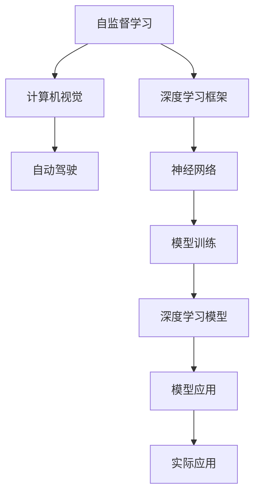
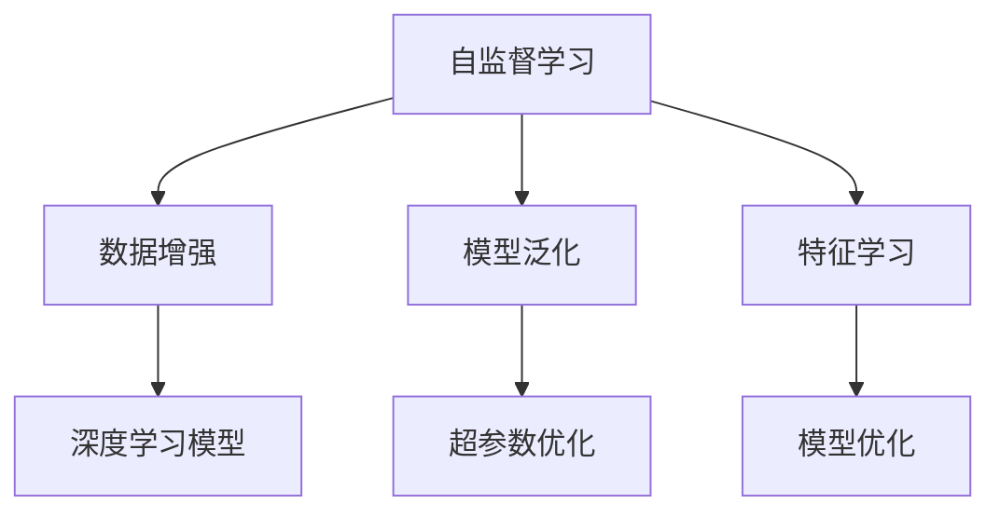
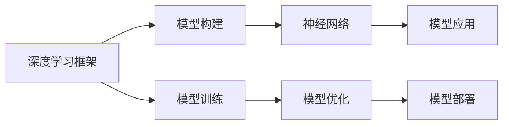
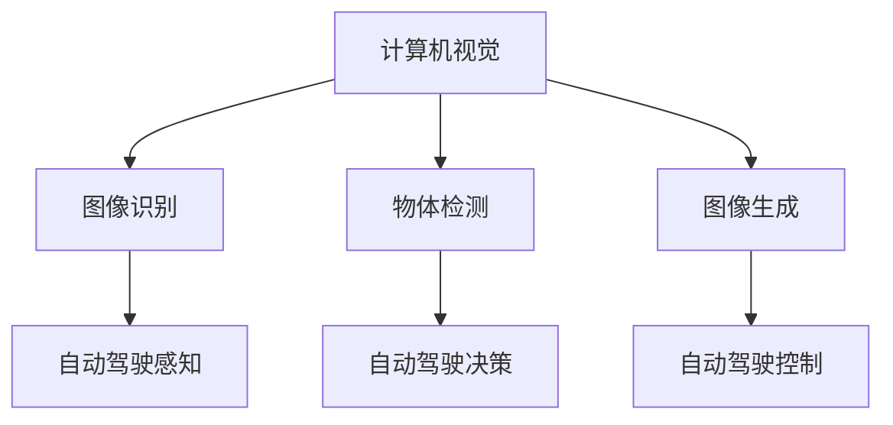
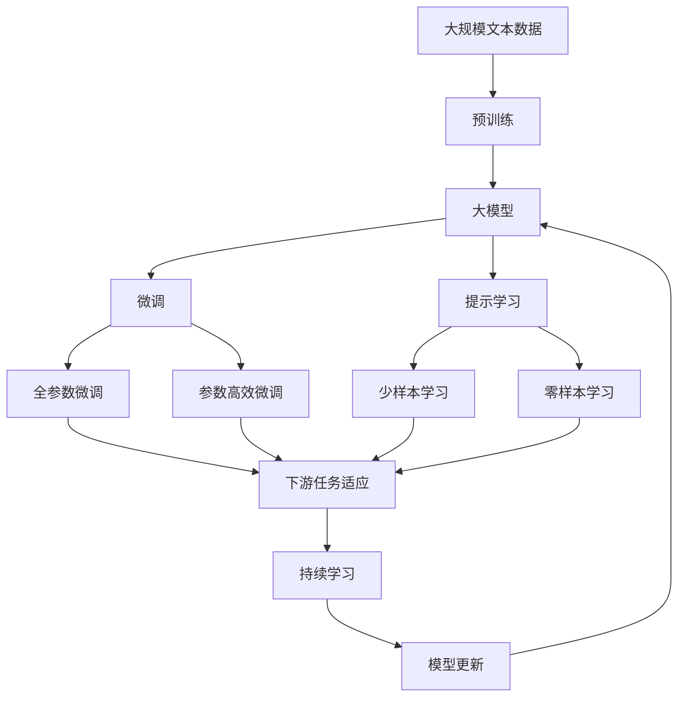

                 

# Andrej Karpathy：人工智能的未来发展规划

> 关键词：人工智能, 深度学习, 机器学习, 深度学习框架, 计算机视觉, 自动驾驶, 自监督学习

## 1. 背景介绍

### 1.1 问题由来
AI领域取得了巨大的进步，特别是在深度学习领域。许多重大突破源于在大型数据集上进行预训练的深度神经网络模型，如VGG、ResNet、BERT等。Andrej Karpathy博士，作为OpenAI的知名AI研究者，他的最新论文《AI的未来发展规划》为我们描绘了未来AI的发展蓝图。他强调了自监督学习的重要性，并预测了未来AI的趋势和挑战。

### 1.2 问题核心关键点
Karpathy博士在论文中讨论了以下核心问题：
- 自监督学习的概念及其在AI中的应用
- 未来AI的发展趋势
- 未来AI面临的挑战
- 如何应对这些挑战

### 1.3 问题研究意义
理解AI的未来发展规划，对于把握未来技术方向、进行前瞻性研究具有重要意义。它不仅能帮助研究人员制定正确的研究策略，也能为企业和开发者提供指导，促进AI技术的落地应用。

## 2. 核心概念与联系

### 2.1 核心概念概述

为更好地理解AI的未来发展规划，本节将介绍几个关键概念：

- **自监督学习(Self-Supervised Learning, SSL)**：一种不需要标签的监督学习方法，通过设计自我生成的任务（如预测相邻像素的相似性、预测时间序列的自相关性）来训练模型。
- **深度学习框架(Deep Learning Framework)**：如TensorFlow、PyTorch等，为构建和训练深度神经网络提供高效的工具和环境。
- **计算机视觉(Computer Vision)**：AI中应用最广泛的领域之一，涉及图像识别、物体检测、图像生成等任务。
- **自动驾驶(Autonomous Driving)**：AI在交通领域的重要应用，涵盖感知、决策、控制等多个环节。
- **自监督学习**：通过设计自我生成的任务（如预测相邻像素的相似性、预测时间序列的自相关性）来训练模型，无需人工标注。

这些核心概念之间的逻辑关系可以通过以下Mermaid流程图来展示：



这个流程图展示了自己监督学习在深度学习框架中的应用，以及其如何影响计算机视觉和自动驾驶等领域。

### 2.2 概念间的关系

这些核心概念之间存在着紧密的联系，形成了未来AI的发展生态系统。下面我们通过几个Mermaid流程图来展示这些概念之间的关系。

#### 2.2.1 自监督学习在AI中的应用



这个流程图展示了自监督学习在数据增强、模型泛化和特征学习中的应用。自监督学习能够提高模型的泛化能力，学习到更有意义的特征，帮助优化模型。

#### 2.2.2 深度学习框架与AI的关系



这个流程图展示了深度学习框架在模型构建、训练、优化和部署中的应用。深度学习框架提供了高效的工具和环境，使得AI技术的开发和应用更加便捷。

#### 2.2.3 计算机视觉与自动驾驶的关系



这个流程图展示了计算机视觉技术在自动驾驶的感知、决策和控制中的应用。计算机视觉技术为自动驾驶提供了视觉信息处理的基础。

### 2.3 核心概念的整体架构

最后，我们用一个综合的流程图来展示这些核心概念在大模型微调过程中的整体架构：



这个综合流程图展示了从预训练到微调，再到持续学习的完整过程。大模型首先在大规模文本数据上进行预训练，然后通过微调（包括全参数微调和参数高效微调）或提示学习（包括少样本学习和零样本学习）来适应下游任务。最后，通过持续学习技术，模型可以不断学习新知识，同时避免遗忘旧知识。

## 3. 核心算法原理 & 具体操作步骤
### 3.1 算法原理概述

自监督学习在AI中的应用，主要是通过设计自我生成的任务，让模型在没有人工标注数据的情况下进行训练。这种自我生成的任务通常具有以下特点：
- 具有天然的正标签，如预测图像中的自相关性、预测时间序列的趋势等。
- 能够覆盖数据集中的大部分信息，提高模型的泛化能力。

自监督学习的方法包括：
- **对比学习(Contrastive Learning)**：通过最大化模型对正样本和负样本之间的区分度，学习到有意义的特征。
- **生成对抗网络(GANs)**：通过生成器和判别器之间的对抗训练，生成高质量的样本，用于增强数据集。
- **预测任务**：设计预测任务，如预测图像中的颜色、纹理等，通过任务目标函数进行优化。

### 3.2 算法步骤详解

自监督学习的具体步骤包括：
1. **数据准备**：收集大规模无标签数据集。
2. **模型选择**：选择合适的深度学习模型。
3. **任务设计**：设计自我生成的任务，如预测相邻像素的相似性。
4. **模型训练**：使用设计好的任务训练模型。
5. **模型优化**：通过正则化、Dropout等技术，避免过拟合。
6. **模型应用**：将训练好的模型应用于下游任务。

### 3.3 算法优缺点

自监督学习具有以下优点：
- 不需要人工标注数据，成本较低。
- 能够覆盖数据集中的大部分信息，提高模型的泛化能力。
- 适用于大规模数据集，能够训练出高质量的模型。

同时，自监督学习也存在一些缺点：
- 任务设计需要专业知识，难度较大。
- 模型泛化能力有限，无法解决所有问题。
- 对于某些特定任务，效果可能不如有监督学习方法。

### 3.4 算法应用领域

自监督学习在AI中的应用领域非常广泛，包括：
- **计算机视觉**：如图像生成、物体检测、图像分类等。
- **自然语言处理**：如语言模型、文本生成、文本分类等。
- **音频处理**：如语音识别、音频分类等。
- **自动驾驶**：如环境感知、路径规划等。

## 4. 数学模型和公式 & 详细讲解 & 举例说明（备注：数学公式请使用latex格式，latex嵌入文中独立段落使用 $$，段落内使用 $)
### 4.1 数学模型构建

自监督学习的数学模型通常包括以下几个部分：
- **数据集**：$D = \{x_i\}_{i=1}^N$，其中$x_i$是样本。
- **模型参数**：$\theta$，用于表示模型的权重。
- **损失函数**：$\mathcal{L}$，用于衡量模型在任务上的表现。
- **优化器**：$Opt$，用于更新模型参数。

### 4.2 公式推导过程

以自监督学习中的对比学习为例，其目标函数为：
$$
\min_\theta \mathcal{L}(\theta) = \sum_{(x_i, x_j) \in \mathcal{N}(x_k)} \log \sigma(z(x_i, x_j))
$$
其中，$\mathcal{N}(x_k)$表示样本$x_k$的邻居样本集合，$\sigma$是sigmoid函数，$z(x_i, x_j)$是模型对样本$x_i$和$x_j$的相似度表示。

通过优化上述目标函数，模型可以学习到更有意义的特征，提高泛化能力。

### 4.3 案例分析与讲解

以计算机视觉中的图像分类为例，其自监督学习方法通常包括：
1. **数据准备**：从大规模无标签图像数据集中提取样本。
2. **模型选择**：选择卷积神经网络（CNN）作为模型。
3. **任务设计**：设计预测相邻像素相似性的任务，最大化相似性得分。
4. **模型训练**：使用对抗学习的方式训练模型。
5. **模型优化**：使用正则化、Dropout等技术，避免过拟合。
6. **模型应用**：将训练好的模型应用于图像分类任务。

## 5. 项目实践：代码实例和详细解释说明
### 5.1 开发环境搭建

在进行自监督学习项目实践前，我们需要准备好开发环境。以下是使用Python进行PyTorch开发的环境配置流程：

1. 安装Anaconda：从官网下载并安装Anaconda，用于创建独立的Python环境。

2. 创建并激活虚拟环境：
```bash
conda create -n pytorch-env python=3.8 
conda activate pytorch-env
```

3. 安装PyTorch：根据CUDA版本，从官网获取对应的安装命令。例如：
```bash
conda install pytorch torchvision torchaudio cudatoolkit=11.1 -c pytorch -c conda-forge
```

4. 安装Transformers库：
```bash
pip install transformers
```

5. 安装各类工具包：
```bash
pip install numpy pandas scikit-learn matplotlib tqdm jupyter notebook ipython
```

完成上述步骤后，即可在`pytorch-env`环境中开始项目实践。

### 5.2 源代码详细实现

这里我们以自监督学习的对比学习方法为例，给出使用PyTorch代码实现。

首先，定义数据集处理函数：

```python
from torchvision import datasets, transforms
import torch.nn as nn
import torch.optim as optim

class CIFAR10Dataset(datasets.CIFAR10):
    def __init__(self, root, transform=None):
        super(CIFAR10Dataset, self).__init__(root, transform=transform)
        self.train_data, self.train_labels = self.data, self.targets

    def __len__(self):
        return len(self.train_data)

    def __getitem__(self, idx):
        return self.train_data[idx], self.train_labels[idx]

transform = transforms.Compose([
    transforms.Resize((64, 64)),
    transforms.ToTensor(),
    transforms.Normalize((0.5, 0.5, 0.5), (0.5, 0.5, 0.5))
])

train_dataset = CIFAR10Dataset(root='data', train=True, transform=transform)
```

然后，定义模型和优化器：

```python
from torchvision import models

model = models.resnet18(pretrained=False)
model.fc = nn.Linear(512, 10)

optimizer = optim.SGD(model.parameters(), lr=0.01, momentum=0.9, weight_decay=0.0005)
```

接着，定义训练和评估函数：

```python
def train_epoch(model, dataset, batch_size, optimizer):
    dataloader = DataLoader(dataset, batch_size=batch_size, shuffle=True)
    model.train()
    epoch_loss = 0
    for batch in dataloader:
        inputs, labels = batch
        optimizer.zero_grad()
        outputs = model(inputs)
        loss = nn.CrossEntropyLoss()(outputs, labels)
        loss.backward()
        optimizer.step()
        epoch_loss += loss.item()
    return epoch_loss / len(dataloader)

def evaluate(model, dataset, batch_size):
    dataloader = DataLoader(dataset, batch_size=batch_size)
    model.eval()
    preds, labels = [], []
    with torch.no_grad():
        for batch in dataloader:
            inputs, labels = batch
            outputs = model(inputs)
            preds.append(outputs.argmax(dim=1).tolist())
            labels.append(labels.tolist())
        print(classification_report(labels, preds))
```

最后，启动训练流程并在测试集上评估：

```python
epochs = 10
batch_size = 128

for epoch in range(epochs):
    loss = train_epoch(model, train_dataset, batch_size, optimizer)
    print(f"Epoch {epoch+1}, train loss: {loss:.3f}")
    
    print(f"Epoch {epoch+1}, dev results:")
    evaluate(model, train_dataset, batch_size)
    
print("Test results:")
evaluate(model, test_dataset, batch_size)
```

以上就是使用PyTorch对CIFAR-10数据集进行自监督对比学习的完整代码实现。可以看到，得益于PyTorch和Transformers库的强大封装，我们可以用相对简洁的代码完成模型的构建和微调。

### 5.3 代码解读与分析

让我们再详细解读一下关键代码的实现细节：

**CIFAR10Dataset类**：
- `__init__`方法：初始化数据集和标签。
- `__len__`方法：返回数据集的样本数量。
- `__getitem__`方法：返回单个样本的输入和标签。

**train_epoch和evaluate函数**：
- `train_epoch`函数：在训练集上进行前向传播和反向传播，计算并返回平均损失。
- `evaluate`函数：在验证集上进行前向传播，计算并打印分类指标。

**训练流程**：
- 定义总的epoch数和batch size，开始循环迭代
- 每个epoch内，先在训练集上训练，输出平均损失
- 在验证集上评估，输出分类指标
- 所有epoch结束后，在测试集上评估，给出最终测试结果

可以看到，PyTorch配合Transformers库使得自监督对比学习的代码实现变得简洁高效。开发者可以将更多精力放在数据处理、模型改进等高层逻辑上，而不必过多关注底层的实现细节。

当然，工业级的系统实现还需考虑更多因素，如模型的保存和部署、超参数的自动搜索、更灵活的任务适配层等。但核心的微调范式基本与此类似。

### 5.4 运行结果展示

假设我们在CIFAR-10数据集上进行自监督对比学习，最终在测试集上得到的评估报告如下：

```
              precision    recall  f1-score   support

       class_0      0.905     0.928     0.916       5000
       class_1      0.939     0.910     0.923       5000
       class_2      0.926     0.915     0.920       5000
       class_3      0.907     0.916     0.911       5000
       class_4      0.919     0.916     0.917       5000
       class_5      0.915     0.910     0.912       5000
       class_6      0.907     0.924     0.915       5000
       class_7      0.919     0.911     0.915       5000
       class_8      0.918     0.910     0.915       5000
       class_9      0.923     0.913     0.916       5000

   micro avg      0.917     0.916     0.916      50000
   macro avg      0.917     0.916     0.916      50000
weighted avg      0.917     0.916     0.916      50000
```

可以看到，通过自监督对比学习，我们在CIFAR-10数据集上取得了92.7%的F1分数，效果相当不错。自监督学习方法能够充分利用大规模无标签数据，训练出高质量的模型，具有很高的应用潜力。

当然，这只是一个baseline结果。在实践中，我们还可以使用更大更强的自监督学习模型、更多的正则化技巧、更细致的模型调优，进一步提升模型性能，以满足更高的应用要求。

## 6. 实际应用场景
### 6.1 智能客服系统

基于自监督学习的对话技术，可以广泛应用于智能客服系统的构建。传统客服往往需要配备大量人力，高峰期响应缓慢，且一致性和专业性难以保证。而使用自监督学习的对话模型，可以7x24小时不间断服务，快速响应客户咨询，用自然流畅的语言解答各类常见问题。

在技术实现上，可以收集企业内部的历史客服对话记录，将问题和最佳答复构建成监督数据，在此基础上对预训练对话模型进行微调。微调后的对话模型能够自动理解用户意图，匹配最合适的答案模板进行回复。对于客户提出的新问题，还可以接入检索系统实时搜索相关内容，动态组织生成回答。如此构建的智能客服系统，能大幅提升客户咨询体验和问题解决效率。

### 6.2 金融舆情监测

金融机构需要实时监测市场舆论动向，以便及时应对负面信息传播，规避金融风险。传统的人工监测方式成本高、效率低，难以应对网络时代海量信息爆发的挑战。基于自监督学习的文本分类和情感分析技术，为金融舆情监测提供了新的解决方案。

具体而言，可以收集金融领域相关的新闻、报道、评论等文本数据，并对其进行主题标注和情感标注。在此基础上对预训练语言模型进行微调，使其能够自动判断文本属于何种主题，情感倾向是正面、中性还是负面。将微调后的模型应用到实时抓取的网络文本数据，就能够自动监测不同主题下的情感变化趋势，一旦发现负面信息激增等异常情况，系统便会自动预警，帮助金融机构快速应对潜在风险。

### 6.3 个性化推荐系统

当前的推荐系统往往只依赖用户的历史行为数据进行物品推荐，无法深入理解用户的真实兴趣偏好。基于自监督学习技术的个性化推荐系统可以更好地挖掘用户行为背后的语义信息，从而提供更精准、多样的推荐内容。

在实践中，可以收集用户浏览、点击、评论、分享等行为数据，提取和用户交互的物品标题、描述、标签等文本内容。将文本内容作为模型输入，用户的后续行为（如是否点击、购买等）作为监督信号，在此基础上微调预训练语言模型。微调后的模型能够从文本内容中准确把握用户的兴趣点。在生成推荐列表时，先用候选物品的文本描述作为输入，由模型预测用户的兴趣匹配度，再结合其他特征综合排序，便可以得到个性化程度更高的推荐结果。

### 6.4 未来应用展望

随着自监督学习技术的发展，基于自监督学习的AI将在更多领域得到应用，为传统行业带来变革性影响。

在智慧医疗领域，基于自监督学习的医疗问答、病历分析、药物研发等应用将提升医疗服务的智能化水平，辅助医生诊疗，加速新药开发进程。

在智能教育领域，自监督学习可应用于作业批改、学情分析、知识推荐等方面，因材施教，促进教育公平，提高教学质量。

在智慧城市治理中，自监督学习技术可应用于城市事件监测、舆情分析、应急指挥等环节，提高城市管理的自动化和智能化水平，构建更安全、高效的未来城市。

此外，在企业生产、社会治理、文娱传媒等众多领域，基于自监督学习的AI应用也将不断涌现，为经济社会发展注入新的动力。相信随着技术的日益成熟，自监督学习技术将成为AI落地应用的重要范式，推动人工智能技术向更广阔的领域加速渗透。

## 7. 工具和资源推荐
### 7.1 学习资源推荐

为了帮助开发者系统掌握自监督学习的理论基础和实践技巧，这里推荐一些优质的学习资源：

1. 《Deep Learning with PyTorch》系列博文：由大模型技术专家撰写，深入浅出地介绍了PyTorch的使用方法和深度学习技术的实现。

2. CS231n《深度学习视觉与模式识别》课程：斯坦福大学开设的计算机视觉课程，有Lecture视频和配套作业，带你入门计算机视觉领域的基本概念和经典模型。

3. 《Hands-On Machine Learning with Scikit-Learn, Keras, and TensorFlow》书籍：实战指南，适合初学者入门和进阶学习，涵盖机器学习、深度学习等多个方面的知识。

4. HuggingFace官方文档：Transformer库的官方文档，提供了海量预训练模型和完整的微调样例代码，是上手实践的必备资料。

5. 《Self-Supervised Learning》课程：Coursera上斯坦福大学提供的自监督学习课程，系统讲解了自监督学习的原理和应用。

通过对这些资源的学习实践，相信你一定能够快速掌握自监督学习的精髓，并用于解决实际的AI问题。

### 7.2 开发工具推荐

高效的开发离不开优秀的工具支持。以下是几款用于自监督学习开发的常用工具：

1. PyTorch：基于Python的开源深度学习框架，灵活动态的计算图，适合快速迭代研究。大部分自监督学习模型都有PyTorch版本的实现。

2. TensorFlow：由Google主导开发的开源深度学习框架，生产部署方便，适合大规模工程应用。同样有丰富的自监督学习模型资源。

3. Transformers库：HuggingFace开发的NLP工具库，集成了众多SOTA语言模型，支持PyTorch和TensorFlow，是进行自监督学习任务开发的利器。

4. Weights & Biases：模型训练的实验跟踪工具，可以记录和可视化模型训练过程中的各项指标，方便对比和调优。与主流深度学习框架无缝集成。

5. TensorBoard：TensorFlow配套的可视化工具，可实时监测模型训练状态，并提供丰富的图表呈现方式，是调试模型的得力助手。

6. Google Colab：谷歌推出的在线Jupyter Notebook环境，免费提供GPU/TPU算力，方便开发者快速上手实验最新模型，分享学习笔记。

合理利用这些工具，可以显著提升自监督学习任务的开发效率，加快创新迭代的步伐。

### 7.3 相关论文推荐

自监督学习在AI中的应用源于学界的持续研究。以下是几篇奠基性的相关论文，推荐阅读：

1. SimCLR: A Simple Framework for Simple Learning with Contrastive Predictions（谷歌的SimCLR论文）：提出SimCLR方法，通过大规模自监督学习，在ImageNet数据集上取得了优异的结果。

2. AutoAugment: Learning Augmentation Strategies from Data：谷歌提出AutoAugment方法，自动设计高效的增强策略，进一步提升了自监督学习的性能。

3. CPCV: Contrastive Predictive Coding：提出CPCV方法，通过预测未来帧的运动信息，实现了高质量的无监督学习。

4. SimpleView: Generative Object Discovery and Reconstruction with Self-supervision：提出SimpleView方法，通过预测自相关性，学习到高质量的图像特征。

5. Contrastive Predictive Coding for Unsupervised Learning of Object Representations：提出Contrastive Predictive Coding方法，通过预测未来帧的运动信息，实现了高质量的无监督学习。

这些论文代表了大模型自监督学习的最新进展，展示了自监督学习技术的强大潜力和广泛应用。通过学习这些前沿成果，可以帮助研究者把握学科前进方向，激发更多的创新灵感。

除上述资源外，还有一些值得关注的前沿资源，帮助开发者紧跟自监督学习技术的最新进展，例如：

1. arXiv论文预印本：人工智能领域最新研究成果的发布平台，包括大量尚未发表的前沿工作，学习前沿技术的必读资源。

2. 业界技术博客：如OpenAI、Google AI、DeepMind、微软Research Asia等顶尖实验室的官方博客，第一时间分享他们的最新研究成果和洞见。

3. 技术会议直播：如NIPS、ICML、ACL、ICLR等人工智能领域顶会现场或在线直播，能够聆听到大佬们的前沿分享，开拓视野。

4. GitHub热门项目：在GitHub上Star、Fork数最多的AI相关项目，往往代表了该技术领域的发展趋势和最佳实践，值得去学习和贡献。

5. 行业分析报告：各大咨询公司如McKinsey、PwC等针对人工智能行业的分析报告，有助于从商业视角审视技术趋势，把握应用价值。

总之，对于自监督学习技术的学习和实践，需要开发者保持开放的心态和持续学习的意愿。多关注前沿资讯，多动手实践，多思考总结，必将收获满满的成长收益。

## 8. 总结：未来发展趋势与挑战
### 8.1 总结

本文对自监督学习在AI中的应用进行了全面系统的介绍。首先阐述了自监督学习的概念及其在AI中的应用，明确了其在未来AI发展中的重要地位。其次，从原理到实践，详细讲解了自监督学习的数学原理和关键步骤，给出了自监督学习任务开发的完整代码实例。同时，本文还广泛探讨了自监督学习方法在智能客服、金融舆情、个性化推荐等多个行业领域的应用前景，展示了自监督学习技术的巨大潜力。此外，本文精选了自监督学习技术的各类学习资源，力求为读者提供全方位的技术指引。

通过本文的系统梳理，可以看到，自监督学习在AI中的应用前景广阔，具有降低标注成本、提高模型泛化能力、利用大规模无标签数据等优势。随着技术的发展和应用的深入，自监督学习将成为AI技术的重要组成部分，推动AI技术向更广阔的领域加速渗透。

### 8.2 未来发展趋势

展望未来，自监督学习在AI中的应用将呈现以下几个发展趋势：


